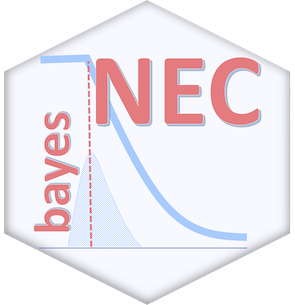

<!-- README.md is generated from README.Rmd. Please edit that file -->

bayesnec 
=========================================================================================

<!-- badges: start -->

<!-- badges: end -->

Overview
--------

`bayesnec` is a No-Effect-Concentration estimation package that uses
[`brms`](https://github.com/paul-buerkner/brms) to fit
concentration(dose)-response data using Bayesian methods for the purpose
of estimating both ECX values, but more particularly NEC. Please see
`?bnec` for a more detailed help file.

Installation
------------

To install the latest release version from CRAN use

    install.packages("bayesnec")

The current development version can be downloaded from GitHub via

    if (!requireNamespace("remotes")) {
      install.packages("remotes")
    }
    remotes::install_github("open-aims/bayesnec", ref = "dev")

Because `bayesnec` is based on `brms` and [Stan](https://mc-stan.org/),
a C++ compiler is required. The program
[Rtools](https://cran.r-project.org/bin/windows/Rtools/) comes with a
C++ compiler for Windows. On Mac, you should install Xcode. See the
prerequisites section on this
[link](https://github.com/stan-dev/rstan/wiki/RStan-Getting-Started) for
further instructions on how to get the compilers running.

Usage
-----

Usage and further information about `bayesnec` can be seen on the
[project page](https://open-aims.github.io/bayesnec/) and the
[vignettes](https://open-aims.github.io/bayesnec/articles/). Help files
for the individual functions can be found on the [reference
page](https://open-aims.github.io/bayesnec/reference/).

Further Information
-------------------

`bayesnec` is provided by the [Australian Institute of Marine
Science](https://www.aims.gov.au) under the GPL-2 License
([GPL-2](https://opensource.org/licenses/GPL-2.0)).
