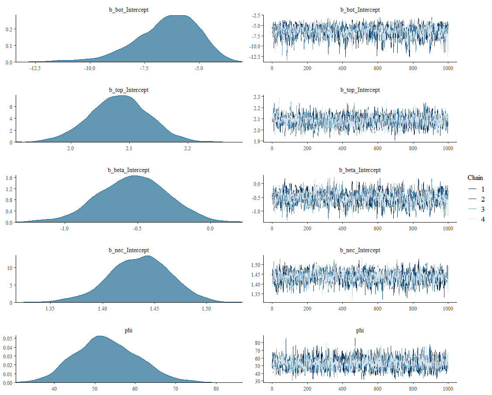
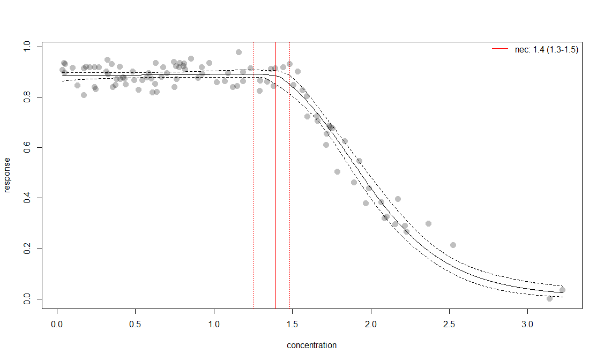
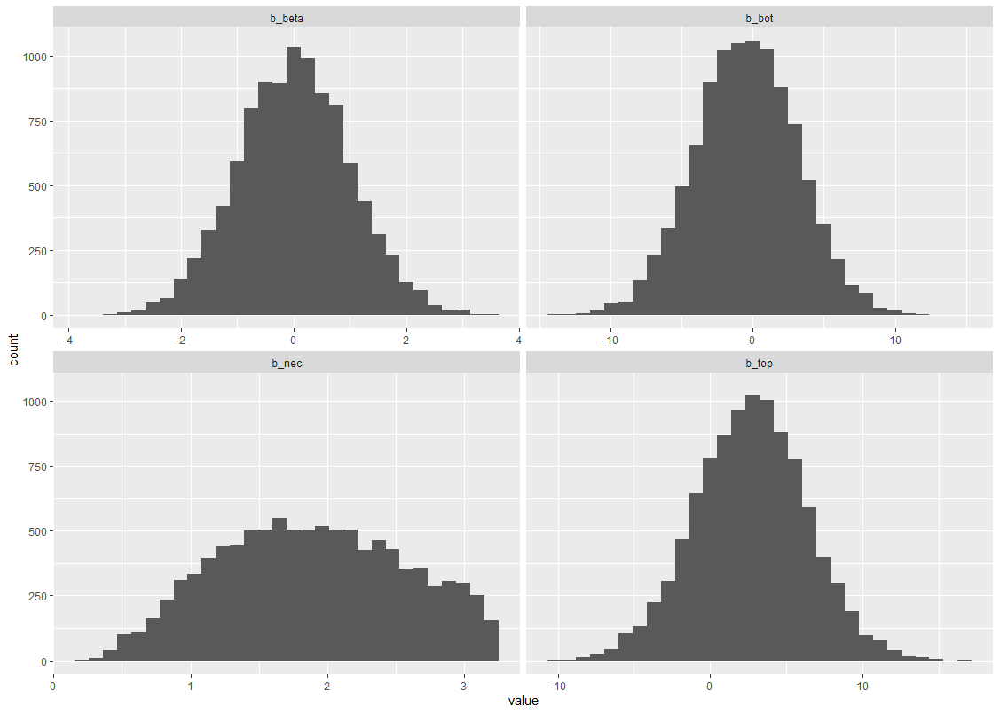
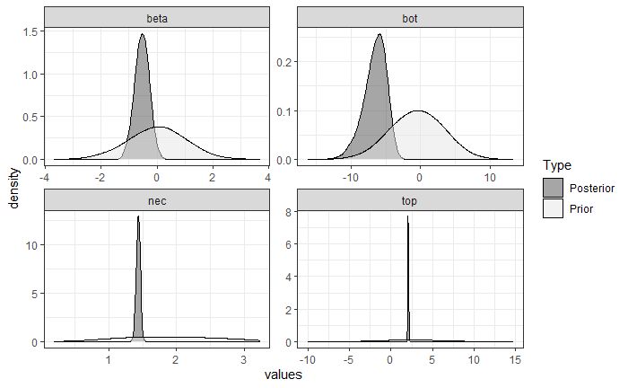

# Summary

The `bayesnec` package in R has been developed to fit concentration(dose) - response curves (C-R) to toxicity data for the purpose of deriving No-Effect-Concentration (*NEC*), No-Significant-Effect-Concentration (*NSEC*), and Effect-Concentration (of specified percentage 'x', *ECx*) thresholds from non-linear models fitted using Bayesian MCMC fitting methods via `brms` [@Burkner2017; @Burkner2018] and `stan` [@rstan2020]. The package is an adaptation and extension of an initial package `jagsNEC` [@Fisher2020] which was based on the `R2jags` package [@Su2015] and `jags` [@Plummer2003]. In `bayesnec` it is possible to fit a single model, custom model-set, specific model-set or all of the available models. When multiple models are specified the `bnec` function returns a model weighted average estimate of predicted posterior values. A range of support functions and methods are also included to work with the returned single, or multi- model objects that allow extraction of raw, or model averaged predicted, *ECx*, *NEC* and *NSEC* values and to interrogate the fitted model or model-set. The statistical methods used mean that the uncertainty in derived threshold values can be robustly quantified, including uncertainty in individual model fits to the underlying observed data, as well as uncertainty in the model functional form.

# Statement of need

Concentration-response (C-R) modelling is fundamental to assessing toxicity and deriving toxicity thresholds used in the risk assessments that underpin protection of human health and the environment. It is widely used in the disciplines of pharmacology, toxicology and ecotoxicology. Typically C-R curves are non-linear, which increases the complexity of model fitting. Estimates of uncertainty in parameters and derived thresholds are critical to effective integration in risk assessment and formal decision frameworks. Bayesian methods that allow robust quantification of uncertainty with intuitive and direct probabilistic meaning [@Ellison1996] and are therefore an ideal platform for C-R modelling in most settings.

Bayesian model fitting can be difficult to automate across a broad range of usage cases, particularly with respect to specifying valid initial parameter values and appropriate priors. This is one reason the use of Bayesian statistics for *NEC* estimation (or even *ECx* estimation) is not currently widely adopted across the broader ecotoxicology and toxicology communities, who may not have access to specialist statistical expertise. The `bayesnec` package provides an accessible interface specifically for fitting *NEC* and other C-R models using Bayesian methods. A range of models can be specified based on the known distribution of the "concentration" or "dose" variable (the predictor, x) as well as the "response" (y) variable. The model formula, including priors and initial values required to call `brms` are automatically generated based on information contained in the supplied data.

# Technical details and Usage

This project started with an implementation of the *NEC* model based on that described in [@Fox2010; @Pires2002] using R2jags [@Su2015]. Code for fitting this initial model was developed into the R package `jagsNEC` and  expanded to include several C-R models and further generalised to allow a large range of response variables to be modelled using their appropriate statistical distribution. While the original `jagsNEC` implementation supported gaussian, poisson, binomial, gamma, negative binomial and beta response data, `bayesnec` supports all of these in addition to the beta binomial family. Furthermore, the new structure implemented using `brms` means `bayesnec` can be readily extended to include any of the `brms` families. In addition to greater flexibility in the available response families, `bayesnec` includes a larger range of alternative *NEC* model types, as well as most typically used smooth C-R models (such as 4-parameter logistic and weibull models) that have no *NEC* 'step' function but simply model the response as a smooth function of concentration. We have now incorporated most of the commonly used models in frequentist packages such as `drc` [@Ritz2016] (please see the [Model details](https://open-aims.github.io/bayesnec/articles/example2b.html) vignette for more information on the full list of models currently available in `bayesnec`).

## Model specification

The main working function in `bayesnec` is `bnec`. We have attempted to make the `bnec` function as easy to use as possible, targeting the novice R user. A `bayesnec` model can be fit as simply as:

```{r fit, eval=FALSE}
library(bayesnec)
data(nec_data)
exmp_fit <- bnec(data = nec_data, x_var = "x", y_var = "y", model = "all")
```

Only three arguments must be supplied, including: `data`---a `data.frame` containing the data to use for the model; `x_var`---a `character` indicating the column heading containing the concentration (x) variable; and `y_var`---a `character` indicating the column heading containing the response (y) variable. The next argument `model` is a `character` indicating the desired model (or model-set, see details below) and currently defaults to "all" models available. A large range of arguments to be passed to `brms` or model weighting via `loo` can be specified manually by the user as required for more advanced users.

While the statistical distribution of the response variable (y) can be specified directly, `bayesnec` will automatically try and predict the most appropriate distribution (family) to use based on the characteristics of the provided data, as well as build the relevant model priors (see more details below) and initial values for the `brms` model. Initial values are selected such that they yield predicted values in the range of the observed response (`y_var`) data.

If not supplied, the appropriate family to use will be determined based on the characteristics of the input data. This includes evaluation of class (integer or numeric) as well as the observed range via the function `check_data`. Family predictions include all of the available families (see above) except negative binomial and beta-binomial because these require knowledge on whether the data are overdispersed, which are not assessed prior to model fitting. By default `bayesnec` will use the default link function for the predicted family. Note that in `bnec` the default link for the gamma family has been set to `log`. If other link functions are required for any of the implemented families, such as `identity` in the case of a beta family for example, this will need to be specified manually using:

```{r, eval=FALSE}
family = Beta(link = "identity")
```

Data that are numeric and scaled from `0` to `1` or `0` to `Inf` are assumed to be `beta` and `gamma` distributed respectively. Because both distributions are naturally truncated at `0`, if necessary a value that is `0` is increased by 1/10th of the next smallest non-zero value. Similarly, because `beta` is also truncated at `1`, ones are substituted with 0.999. Data scaled from or `-Inf` to `Inf` are modelled using a `gaussian` distribution.

If `y_var` data are integers and a `trials_var` argument is supplied (must also be integer) a `binomial` distribution is assumed. If no `trials_var` argument is supplied the `y_var` data are assumed to be `poisson`. Similar checks are used to assign a likely family to the `x_var` (concentration) data. In this case of `x_var` data, the assigned family only influences the priors on `x_var`-based model parameters (*NEC*), which can be overridden by setting manual priors (see more information on priors below).

Specific models can be fit directly using `bnec`, in which case an object of class `bayesnecfit` is returned. `bayesnec` includes a set of `bayesnecfit` methods for predicting, plotting and extracting effect concentrations and related threshold values. Alternatively it is possible to fit a custom model-set, specific model-set or all of the available models. The default in `bayesnec` is to use `model = "all"` which fits all of the available models.

When multiple models are fitted using `bnec`, an object of class `bayesmanecfit` is returned that includes a model weighted estimate of predicted posterior values. `bayesnec` also includes a set of `bayesmanecfit` methods for predicting, plotting and extracting effect concentrations and related threshold values that return model weighted estimates. 

Multi-model inference can be useful where there are a range of plausible models that could be used [@Burnham2002] and has been recently adopted in ecotoxicology for Species Sensitivity Distribution (SSD) model inference [@Thorley2018; @fox2020; @Dalgarno]. The approach may have considerable value in C-R modelling because there is often no a priori knowledge of the functional form that the response relationship should take. In this case model averaging can be a useful way of allowing the data to drive the model selection process, with weights proportional to how well the individual models fit the data. Well-fitting models will have high weights, dominating the model averaged outcome. Conversely, poorly fitting models will have very low model weights and will therefore have little influence on the outcome. Where multiple models fit the data equally well, these can equally influence the outcome, and the resultant posterior predictions reflect that model uncertainty. It is possible to specify the "stacking" method [@Yao2018] for model weights if desired (through the argument `loo_controls`) which aims to minimise prediction error. We do not currently recommend using stacking weights given the typical sample sizes associated with most C-R experiments, and because the main motivation for model averaging within the `bayesnec` package is to properly capture model uncertainty rather than reduce prediction error. By default `bayesnec` uses the  "pseudobma" method using the Bayesian bootstrap through `loo_model_weights` [@vehtari2020; @vehtari2017]. These are reasonably analogous to the way model weights are generated using AIC or AICc [@Burnham2002].

### Model diagnostics

A range of tools are available to assess model fit, including an estimate of overdispersion (for relevant families), an extension of the `brms` `rhat` function that can be applied to both `bayesnecfit` and `bayesmanecfit` model objects, and a function `check_chains` that can be used to visually assess chain mixing and stability.

All diagnostic functions available in `brms` and `rstan` can be used on the underlying `brm` model fit by extracting the fitted `brms` model from the `bayenecfit` or `bayesmanecfit` model object. For example, we can use the default `brms` plotting method to obtain a diagnostic plot of the individual fit of the **nec4param** model using:

```{r brms-plot, eval=FALSE}
plot(exmp_fit$mod_fits$nec4param$fit)
```

(ref:fig-brmsplot) Default brms plot of the nec4param model showing the posterior probability densities and chain mixing for each of the included parameters.

```{r brmsplot, echo=FALSE, out.width='100%', fig.cap="(ref:fig-brmsplot)", cache = TRUE}

```

which yields a plot of the posterior densities and chains plot for each parameter in the specified model as shown in Fig. \@ref(fig:brmsplot).

The default number of total iterations in `bayesnec` is 10,000 per chain, with 9,000 of these used as warm-up (or burn-in) across 4 chains. If the `bnec` call returns `brms` warning messages the number of iterations and warm-up samples can be adjusted through arguments `iter` and `warmup`. A range of other arguments can be further adjusted to improve convergence, see the rich set of [Resources](https://github.com/paul-buerkner/brms available) available for the `brms` package for further information.

Several helper functions have been included that allow the user to add or drop models from a `bayesmanecfit` object, or change the model weighting method (`amend`); extract a single or subset of models from the `bayesmanecfit` object (`pull_out`); and examine the priors used for model fitting (`pull_prior`, `sample_priors` and `check_priors`).

### Model inference

`bayesnec` includes a summary method for both `bayesnecfit` and `bayesmanecfit` model objects, providing the usual summary of model parameters and any relevant model fit statistics as returned in the underlying `brm` model fits. This includes a list of fitted models, their respective model weights, and a model-averaged NEC---which is reported with a warning in case it contains NSEC values. A warning message also indicates that the **ecxll5** model may have convergence issues according to the default brms $\widehat{R}$ criteria:

```{r, eval=FALSE}
summary(exmp_fit)
# Object of class bayesmanecfit containing the following non-linear models:
#   -  nec4param
#   -  nechorme4
#   -  neclin
#   -  neclinhorme
#   -  nechorme4pwr
#   -  ecxlin
#   -  ecx4param
#   -  ecxwb1
#   -  ecxwb2
#   -  ecxll5
#   -  ecxll4
#   -  ecxhormebc5
# 
# Distribution family: beta
# Number of posterior draws per model:  4000
# 
# Model weights (Method: pseudobma_bb_weights):
#                 waic   wi
# nec4param    -332.75 0.37
# nechorme4    -330.31 0.13
# neclin       -332.05 0.29
# neclinhorme  -329.80 0.14
# nechorme4pwr -328.40 0.06
# ecxlin       -188.03 0.00
# ecx4param    -302.35 0.00
# ecxwb1       -294.30 0.00
# ecxwb2       -317.12 0.00
# ecxll5       -317.78 0.00
# ecxll4       -302.92 0.00
# ecxhormebc5  -310.25 0.00
# 
# Summary of weighted NEC posterior estimates:
# NB: model-set contains the ECX models: ecxlin;ecx4param;ecxwb1;ecxwb2;ecxll5;ecxll4;ecxhormebc5; weighted NEC estimates include NSEC surrogates for NEC
#     Estimate Q2.5 Q97.5
# NEC     1.39 1.26  1.48
# 
# Warning message:
# In print.manecsummary(x) :
#   The following model had Rhats > 1.05 (no convergence):
#   -  ecxll5
# Consider dropping them (see ?amend)
```

Base R (`plot`) and ggplot2 (`ggbnec`) plotting methods, as well as predict methods have also been developed for both `bayesnecfit` and `bayesmanecfit` model classes. In addition, there are method-based functions for extracting *ECx* (`ecx`), *NEC* (`nec`) and *NSEC* (`nsec`) threshold values. In all cases the posterior samples that underpin these functions are achieved through `posterior_epred` from the `brms` package. An example base plot of a `bayesmanecfit` model fit can be seen in Fig. \@ref(fig:baseplot).

```{r base-plot, eval=FALSE}
plot(exmp_fit)
```

(ref:fig-baseplot) Base plot of the `exmp_fit` model averaged curve, showing the fitted median of the posterior prediction (solid line), 95% credible intervals (dashed lines), and the estimated *NEC* value (red vertical lines).

```{r baseplot, echo=FALSE, out.width='100%', fig.cap="(ref:fig-baseplot)", cache = TRUE}

```

By default the plot shows the fitted posterior curve with 95% credible intervals, along with an estimate of the $\eta = \text{NEC}$ value. Please see the [vignettes](https://open-aims.github.io/bayesnec/articles/) for more examples using `bayesnec` models for inference.

## Models in `bayesnec`

The argument `model` in the function `bnec` is a character string indicating the name(s) of the desired model. If a recognised model name is provided, a single model of the specified type is fit, and `bnec` returns a model object of class `bayesnecfit`. If a vector of two or more of the available models are supplied, `bnec` returns a model object of class `bayesmanecfit` containing Bayesian model averaged predictions for the supplied models, providing they were successfully fitted.

The `model` argument may also be one of "all", meaning all of the available models will be fit; "ecx" meaning only models excluding the $\eta = \text{NEC}$ step parameter will be fit; or "nec" meaning only models with the $\eta = \text{NEC}$ step parameter (see below **Model parameters**) will be fit. There are a range of other pre-defined model groups available. The full list of currently implemented model groups can be seen using the function `models()`.

Please see the [Model details](https://open-aims.github.io/bayesnec/articles/example2b.html) vignette or `?model("all")` for more information on all the models available in `bayesnec` and their specific formulation. 

### Parameter definitions

Where possible we have aimed for consistency in the interpretable meaning of the individual parameters across models. Across the currently implemented model-set, models contain from two (basic linear or exponential decay, see **ecxlin** or **ecxexp**) to five possible parameters (e.g. **nechorme4**, **ecxhormebc5**), including:

 - $\tau = \text{top}$, usually interpretable as either the y-intercept or the upper plateau representing the mean concentration of the response at zero concentration;
 
 - $\eta = \text{NEC}$, the No-Effect-Concentration value (the x concentration value where the breakpoint in the regression is estimated at, see **Model types for *NEC* and *ECx* estimation** and [@Fox2010] for more details on parameter based *NEC* estimation); 
  
 - $\beta = \text{beta}$, generally the exponential decay rate of response, either from 0 concentration or from the estimated $\eta$ value, with the exception of the **neclinhorme** model where it represents a linear decay from $\eta$ because slope ($\alpha$) is required for the linear increase;
  
 - $\delta = \text{bottom}$, representing the lower plateau for the response at infinite concentration; 
  
 - $\alpha = \text{slope}$, the linear decay rate in the models **neclin** and **ecxlin**, or the linear increase rate prior to $\eta$ for all hormesis models; 
  
 - $\text{ec50}$ notionally the 50% effect concentration but may be influenced by scaling and should therefore not be strictly interpreted; and 
  
 - $\epsilon = \text{d}$, the exponent in the **ecxsigm** and **necisgm** models.

In addition to the model parameters, all `nec...`  models have a step function used to define the breakpoint in the regression, which can be defined as:

$$
f(x_i, \eta) = \begin{cases} 
      0, & x_i - \eta < 0 \\
      1, & x_i - \eta \geq 0 \\
   \end{cases}
$$


### Model types for *NEC* and *ECx* estimation

All models provide an estimate of the No-Effect-Concentration (*NEC*). For model types with "nec" as a prefix, the *NEC* is directly estimated as parameter $\eta = \text{NEC}$ in the model, as per @Fox2010. Models with "ecx" as a prefix are continuous curve models, typically used for extracting *ECx* values from C-R data. In this instance the *NEC* reported is actually the No-Significant-Effect-Concentration (*NSEC*), defined as the concentration at which the predicted response is now "significantly" lower than the values observed at the lowest treatment concentration (typically the 'control'). The desired level of "significance" can be controlled by the user through the argument `sig_val`, which is passed as a probability to `quantile`and used to calculate the lower bound of the posterior predictions at the lowest treatment concentration. The default value for `sig_val` is 0.01, which is analogous to an alpha value (Type 1 error rate) of 0.01 for a one-sided test of significance. See `?nsec` for more details. We currently recommend only using the "nec" model-set for estimation of *NEC* values, as the *NSEC* concept has yet to be formally peer-reviewed, and likely suffers from at least some of the same issues as the No-Observed-Effect-Concentration [@Warne2008a; @Fox2008].

*ECx* estimates can be equally validly obtained from both "nec" and "ecx" models. *ECx* estimates will usually be lower (more conservative) for "ecx" models fitted to the same data as "nec" models (see the [Comparing posterior predictions](https://open-aims.github.io/bayesnec/articles/example4.html) vignette for an example. However, we recommend using "all" models where *ECx* estimation is required because "nec" models can fit some datasets better than "ecx" models and the model averaging approach will place the greatest weight for the outcome that best fits the supplied data. This approach will yield *ECx* estimates that are the most representative of the underlying relationship in the dataset.

There is ambiguity in the definition of *ECx* estimates from hormesis models (these allow an initial increase in the response [see @Mattson2008] and include models with the character string `horme` in their name), as well as those that have no natural lower bound on the scale of the response (models with the string `lin` in their name, in the case of gaussian response data). For this reason, the `ecx` function has arguments `hormesis_def` and `type`, both character vectors indicating the desired behaviour. For `hormesis_def = "max"` *ECx* values are calculated as a decline from the maximum estimates (i.e. the peak at $\eta = \text{NEC}$); and `hormesis_def = "control"` (the default) indicates *ECx* values should be calculated relative to the control, which is assumed to be the lowest observed concentration. For `type = "relative"` *ECx* is calculated as the percentage decrease from the maximum predicted value of the response ($\tau = \text{top}$) to the minimum predicted value of the response (ie, 'relative' to the observed data). For `type = "absolute"` (the default) *ECx* is calculated as the percentage decrease from the maximum value of the response ($\tau = \text{top}$) to 0 (or $\delta = \text{bottom}$ for models with that parameter). For `type = "direct"`, a direct interpolation of y on x is obtained.


### Model suitability for response types

Models that have an exponential decay (most models with parameter $\beta = \text{beta}$) with no $\delta = \text{bottom}$ parameter are `0` bounded and are not suitable for the gaussian family, or any family modelled using a logit or log link because they cannot generate predictions of negative y (response). Conversely models with a linear decay (containing the string `lin` in their name) are not suitable for modelling families that are `0` bounded (gamma, poisson, negative binomial, beta, binomial, beta binomial) using an identity link. These restrictions do not need to be controlled by the user as a call to `bnec` with `models = "all"` will simply exclude inappropriate models, albeit with a message.

Strictly speaking, models with a linear hormesis increase are not suitable for modelling fthe binomial, beta and beta binomial families, however they are currently allowed in `bayesnec`, with a reasonable fit achieved through a combination of the appropriate family being applied to the response, and the `bayesnec` `make_inits` function that ensures initial values passed to `brms` yield response values within the range of the observed `y_var` data.

## Priors on model parameters

In Bayesian inference, model parameters and their inherent uncertainty are estimated as statistical probability distributions. This is achieved by combining an a-prior understanding of each parameter's probability density function (the 'priors') with the likelihood of the observed information (data) given the model parameters, to yield a so-called posterior probability distribution. Regardless of whether this is done mathematically via Bayes' theorem or through monte-carlo simulation, to carry out a Bayesian analysis the prior probability densities must be defined. Sometimes there may be substantial prior knowledge, for example when pilot data or data from a previous experiment exist for a given response curve. In this case the prior probability distribution may be quite narrow (highly "informative") and can have a strong influence on the posterior, especially when subsequent data are scarce or highly variable. In our experience however, such prior knowledge is generally the exception. Where no quantitative prior information exists, it is common in Bayesian statistics to use "vague" or "weakly" informative priors. The use of "vague", "diffuse", "flat" or otherwise so-called "uninformative" priors is no longer recommended [@Banner2020]. Such priors generally form the default for many Bayesian packages, and are often used in practice without critical thought or evaluation, possibly as a result of fear of being too 'subjective' [@Banner2020].

Considerable thought has gone into development of an algorithm (`define_prior`) to build "weakly" informative priors for fitting models in `bayesnec`. The priors are "weakly" informative in that in addition to specifying the relevant statistical family that appropriately captures the parameters likely theoretical statistical distribution, we also use information contained within the observed data to centre the probability density near the most likely parameter space and/or constrain priors to sensible bounds. These weakly informative priors are used to help constrain the underlying routines so that they are less likely to consider what the researcher would deem highly improbable estimates, that also cause the routines to become unstable. Weakly informative priors can be particularly helpful in complex non-linear modelling to ensure reliable convergence. These types of priors specify the general shape and bounds of the expected probability distribution for a given parameter, whilst remaining sufficiently broad so as not to influence the parameter's estimated posterior distribution (given a reasonable amount of observed data). In this sense appropriately weak priors should yield analytical outcomes that share the same level of *objectivity* as equivalent frequentist approaches, whilst yielding robust parameter estimates with probabilistically interpretable uncertainty bounds. To ensure a `bayesnec` analysis retains the same level of objectivity as an equivalent frequentist approach we recommend using the function `check_priors` to compare the prior and posterior probability densities and check that the priors used by `bayesnec` are sensible and are not exerting an undesirable influence over the analysis.

### `bayesnec`'s `define_prior` algorithm

Priors are constructed in `bayesnec` for each parameter of each model being fitted based on the characteristics of either the input `x_var` or `y_var` data, depending on which is relevant to the specific parameter scaling. In the case of parameters that scale with `y_var` (the response), priors are constructed based on the relevant link scaling, whether that be identity, the default, or user specified link function for a specific family. The priors are constructed by `bnec` internally calling the function `define_prior`, which takes the arguments `model`, `family` (including the relevant link function), `predictor` (`x_var` data), and `response` (`y_var` data).

#### Priors for response (`y_var`) scaled parameters 

Only the parameters $\tau = \text{top}$ and $\delta = \text{bottom}$ scale specifically with the response (`y_var` data) family. 
For gaussian `y_var` data (or any `y_var` data for which the link ensures valid values of the response can take from `-Inf` to `Inf`, including `log` and `logit`) priors are `normal` with a standard deviation of `2.5` and a mean set at the 90^th^ and 10^th^ quantiles for $\tau = \text{top}$ and $\delta = \text{bottom}$ respectively. In this way `bayesnec` attempts to construct a prior that scales appropriately with the observed data, with greatest density near the most likely region of the response for the $\tau = \text{top}$ and $\delta = \text{bottom}$ parameters, whilst remaining broad enough to have little influence on each parameter's posterior density.

For poisson-, negative binomial- and gamma-distributed `y_var` data, the response is bounded by `0` and therefore normal priors are unsuitable. Instead we use `Gamma` priors, with a mean scaled to correspond to the 75th and 25th quantiles for $\tau = \text{top}$ and $\delta = \text{bottom}$ respectively. The mean ($\mu$) is linked mathematically to the shape (s) and rate parameters (r) by the equation $$ \mu = s * (1/r) $$ with the shape parameter being set to 2 by default.

For the binomial, beta, and beta binomial families estimates for $\tau = \text{top}$ and $\delta = \text{bottom}$ must necessarily be constrained between `0` and `1` when modelled on the identity link. Because of this constraint there is no need to adjust scaling based on the response. In this case `bayesnec` uses `beta(5, 1)` and `beta(1, 5)` priors to provide a broad density centred across the upper and lower `0` to `1` range for the $\tau = \text{top}$ and $\delta = \text{bottom}$ parameters respectively.

#### Priors for predictor (`x_var`) scaled parameters

The parameters $\eta = \text{NEC}$ and $\eta = \text{ec50}$ scale with respect to the predictor (`x_var` data), because both of these are estimated in units of the predictor (`x_var`, usually concentration). To stabilise model fitting, the $\eta = \text{NEC}$ and $\eta = \text{ec50}$ parameters are bounded to the upper and lower observed range in the predictor, under the assumption that the range of concentrations in the experiment were sufficient to cover the full range of the response outcomes. The priors used reflect the characteristics of the observed data that are used to predict the appropriate family. If the `x_var` data are bounded to `0` and  `>1` a gamma prior is used, with maximum density ($\mu$, see above) at the median value of the predictor, and a shape parameter of 5. If the `x_var` data are bounded to `0` and `1` a `beta(2, 2)` prior is used. For `x_var` data ranging from `-Inf` to `Inf`, a normal prior is used, with a mean set at the median of the `x_var` values and a standard deviation of 2.5. 

#### Priors for other parameters

For the parameters $\beta = \text{beta}$, $\alpha = \text{slope}$ and $\epsilon = \text{d}$ we first ensured any relevant transformations in the model formula such that theoretical values with the range `-Inf` to `+Inf` are allowable, and a `normal(0, 2)` prior is used. For example in the `nec3param` model $\beta = \text{beta}$ is an exponential decay parameter, which must by definition be bounded to `0` and `Inf`. Calling `exp(beta)` in the model formula ensures the exponent meets these requirements. Note also that a mean of `0` and standard deviation of `2` represents a relatively broad prior on this exponential scaling, so this is still generally a weakly informative prior in practice.

### User specified priors

There may be situations where the default `bayesnec` priors do not behave as desired, or the user wants to provide informative priors. For example, the default priors may be too informative, yielding unreasonably tight confidence bands (although this is only likely where there are few data or unique values of the `x_var` data). Conversely, priors may be too vague, leading to poor model convergence.  Alternatively, the default priors may be of the wrong statistical family if there was insufficient information in the provided data for `bayesnec` to correctly predict the appropriate ones to use. The priors used in the default model fit can be extracted using `pull_prior`, and a sample or plot of prior values can be obtained from the individual `brms` model fits through the function `sample_priors` which samples directly from the `prior` element in the `brm` model fit (see Fig. \@ref(fig:priorsplot)).

```{r sample-prior, eval=FALSE}
sample_priors(exmp_fit$mod_fits$nec4param$fit$prior)
```

(ref:fig-priorsplot) Frequency histograms of samples of the default priors used by `bnec` for fitting the `nec4param` model to the example `nec_data`.

```{r priorsplot, echo=FALSE, out.width='100%', fig.cap="(ref:fig-priorsplot)", cache = TRUE}

```

We can also use the function `check_priors` (based on the `hypothesis` function of `brms`) to assess how the posterior probability density for each parameter differs from that of the prior. Here we show the prior and posterior probability densities for the parameters in the **nec4param** model, extracted from our example fit (see Fig. \@ref(fig:checkpriorsplot)). There is also a class `bayesmanecfit` method that can be used to sequentially view all plots in a `bnec` call with multiple models, or write to a pdf as in `check_chains`. 

```{r check-prior, eval=FALSE}
# for a single model
exmp_fit_nec4param <- pull_out(exmp_fit, model = "nec4param")
check_priors(exmp_fit_nec4param)

# for all models, writing to a pdf file named Check_priors_plots.pdf
check_priors(exmp_fit, filename = "Check_priors_plots")
```

(ref:fig-checkpriorsplot) A comparison of the prior and posterior parameter probability densities for the `nec4param` model fit to the example `nec_data`.

```{r checkpriorsplot, echo=FALSE, out.width='100%', fig.cap="(ref:fig-checkpriorsplot)", cache = TRUE}

```


## Model comparison

With `bayesnec` we have included a function (`compare_posterior`) that allows bootstrapped comparisons of posterior predictions. This function allows the user to fit several different `bnec` model fits and compare differences in the posterior predictions. Comparisons can be made across the model fits for individual endpoint estimates (e.g. *NEC*, *NSEC* or *ECx*) or across a range of predictor (x) values. Usage is demonstrated in the relevant [vignette](https://open-aims.github.io/bayesnec/articles/example4.html) by comparing different types of models and model-sets using a single dataset. However, the intent of this function is to allow comparison across different datasets that might represent, for example, different levels of a fixed factor covariate. For example, this function has been used to compare toxicity of herbicides across three different climate scenarios, to examine the cumulative impacts of pesticides and global warming on corals [@flores2021].

At this time `bnec` does not allow for an inclusion of an interaction with a fixed factor. Including an interaction term within each of the non-linear models implemented in `bayesnec` is relatively straightforward, and may be introduced in future releases. However, in many cases the functional form of the response may change with different levels of a given factor. The substantial complexity of defining all possible non-linear model combinations at each factor level means it unlikely this could be feasibly implemented in `bayesnec` in the short term. In the meantime the greatest flexibility in the functional form of individual model fits can be readily obtained using models fitted independently to data within each factor level. 

## Random effects

Most eco-toxicological and toxicology experiments include a range of grouping elements, such as tanks, vials or batches of samples that contain multiple measurements that cannot be considered strictly independent (aka they are pseudo-replicates). To avoid criticism around potential issues with pseudoreplication, it is often the practice for ecotoxicologists to pool such observations and carry out modelling using, for example, the group mean. Where the number of within group observations varies substantially across groups, this will have the undesirable effect of equally weighting the group means even though some may be based on far fewer observations than others. In addition there are often instances of ecotoxicology data from multiple experiments or other grouping factors within an experiment (such as genotype) that cover the full range of x concentrations that cannot be averaged prior to modelling, resulting in the ecotoxicologist either ignoring the potential non-independence, or fitting many indepedent datasets and subsequently needing to aggregate the endpoint estimates. Carrying out mutliple fits on seperate datasets is undesirable because each fit is based on fewer data and will have greater uncertainty. 

The current version of `bayesnec` allows a list of  random terms to be passed through the argument *random* to `brms` for accommodating hierarchical designs and other forms of non-independence. Random effects can be in the form of a random offset, which effectively allows different mean response levels across groups, and is acheived through specifying the random term "ost" in the named list. Random effects can also be added to any or all of the non-linear parameters in the model. Note that implementing random effects in a non-linear modelling setting is non-trivial and considerable thought and testing should go into selecting an appropriate random structure.

# Discussion and caveats

In order to be accessible to a broad community of varying statistical capabilities, we have simplified fitting a `bayesnec` model as much as possible, whilst retaining the ability to modify a wide range of arguments as necessary. Where possible we have tried to set default values to align with those in `brms`. Wherever we deviate, this is generally towards being more conservative and/or we have clearly explained our reasoning. Specific examples include: 1) `iter`, which we increased from the `brms` default of `2e3` to `10e3` as we found that a higher number of MCMC iterations are generally required for these sometimes complex non-linear models; 2) the use of pseudo-BMA rather than stacking weights to better reflect `bayesnec`'s goals with respect to model averaging (discussed in more detail above); and 3) the use of `pointwise = TRUE` (where possible) and `sample_prior = "yes"` to avoid excessive R crashes when used in the Windows operating system and allow the use of the `hypothesis` function respectively. We welcome constructive criticism of our selections and users must expect that default settings may change accordingly in later releases.

We have made considerable effort to ensure that `bayesnec` makes a sensible prediction for the appropriate family, constructs appropriate weakly informative priors, and generates sensible initial values. However, this is a difficult task across such a broad range of non-linear models, and across the potential range of ecotoxicological data that may be used. The user must interrogate their model fits using the wide array of helper functions, and use their own judgement regarding the appropriateness of model inferences for their own application. Of particular importance are examination of model fit statistics through the `summary` and `rhat` methods, visual inspection of all model fits in `bayesmanecfit` objects (via `plot(..., all_models = TRUE)` and `check_chains(..., all_models = TRUE)`) and an assessment of the posterior versus prior probability densities to ensure default priors are appropriate.

The model averaging approach implemented in `bayesnec` is widely used in a range of settings [in ecology for example, see @Dormann2018 for a thorough review]. However, model averaging is relatively new to ecotoxicology [but see, for example, @Shao2014; @Thorley2018; @fox2020; @Wheeler2009]. In `bayesnec` we have implemented a broad range of potential models, and the default behaviour is to fit them all, although we discuss above situations where this is clearly not recommended (for example, in the estimation of **NEC**). More research is required to understand how model-set selection influences model inference. While some studies suggest using a broad range of models may be optimal [@Wheeler2009], others indicate that including multiple models of similar shape may overweight the representation of that shape in model averaged predictions [@fox2020]. In addition, it is important to understand that when models are added or removed from the model-set, this can sometimes have a substantial influence on model predictions (potentially changing estimated **ECx** values, for example). As the model-set in `bayesnec` may change through time it is important to keep a record of the models that were actually fitted in a given analysis, in the event it is necessary to reproduce a set of results. A potentially better strategy is to build a [Docker](https://docs.docker.com/get-docker/) container, an emerging approach representing one strategy towards overcoming the reproducibility crisis [@Baker2016]. Considerations of analytical reproducibility are particularly relevant to C-R modelling, where the model outcomes can often have far reaching management implications.

Like R itself, bayesnec is free software and comes with ABSOLUTELY NO WARRANTY, or even IMPLIED WARRANTY.

# Future directions

The `bayesnec` package is a work in progress, and we welcome suggestions and feedback that will improve the package performance and function. Our goal is to make `bayesnec` as user friendly as possible, and capable of dealing with most real world C-R modelling applications in the hope that Bayesian statistics will become more widely used in applied risk assessment. Please submit requests through the package [Issues](https://github.com/open-AIMS/bayesnec/issues) on github. Some suggested future enhancements include:

 
 - The addition of other custom families, such as the tweedie distribution. Currently `bayesnec` implements adjustments away from `0` (gamma, beta) or `1` (beta) as a strategy for allowing modelling with these types of data using the closest most convenient statistical distribution. To our knowledge there are no readily available distributions able to model data that includes `0` and `1` on the continuous scale, and `0` and `1` adjustments followed by modelling using a `beta` distribution remains the most appropriate option. For data that are `0` to `+Inf` on the continuous scale the `tweedie` distribution may prove a much better option than the current zero bounded `gamma`, and has been used extensively in fisheries research for biomass data [@Shono2008]. As this family is not currently available in `brms` this would need to be implemented as a custom family, which for the `tweedie` is not trivial.

 - A hypothesis method for testing against toxicity thresholds. The `brms` package includes a `hypothesis` function that allows for testing parameter estimates against specified criteria. This is used in `bayesnec` in the `check_prior` function, which is a wrapper that examines the deviation of each parameter in the given model relative to `0` as a means of generating posterior and prior probability density plots for comparison. However, an additional wrapper function could be developed that allows toxicity to be assessed, as measured through NEC, or ECx for example, against a required pre-defined threshold. Such a feature may be useful where toxicity testing is used as a trigger in risk management.
  
# Acknowledgements

The development of `bayesnec` was supported by an AIMS internal grant. David Fox and Gerard Ricardo developed some of the initial code on which the `bayesnec` predecessor `jagsNEC` was based. Usage, testing and functionality of both the `jagsNEC` and `bayesnec` packages were substantially aided through input from Joost van Dam, Andrew Negri, Florita Flores, Heidi Luter, Marie Thomas and Mikaela Nordborg. Florita Flores and Murray Logan provided valuable comments on the manuscript text. 


# References
