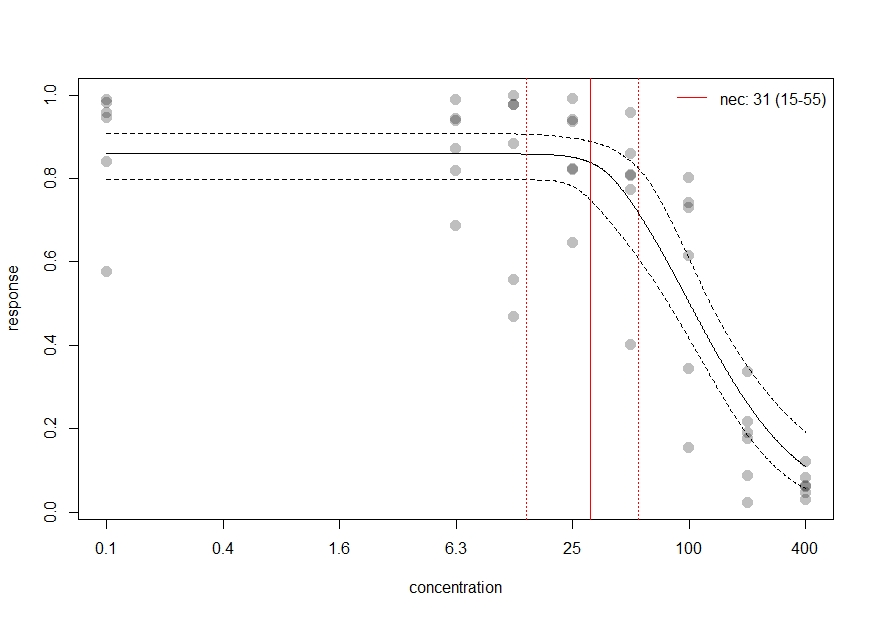
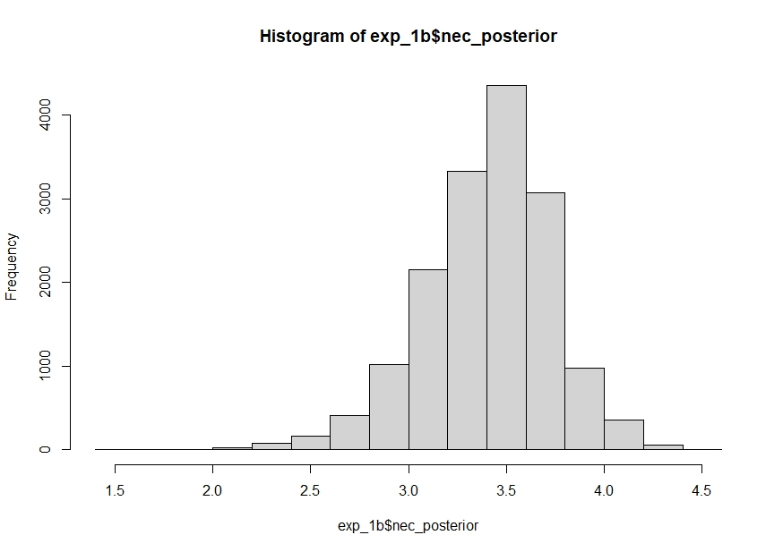
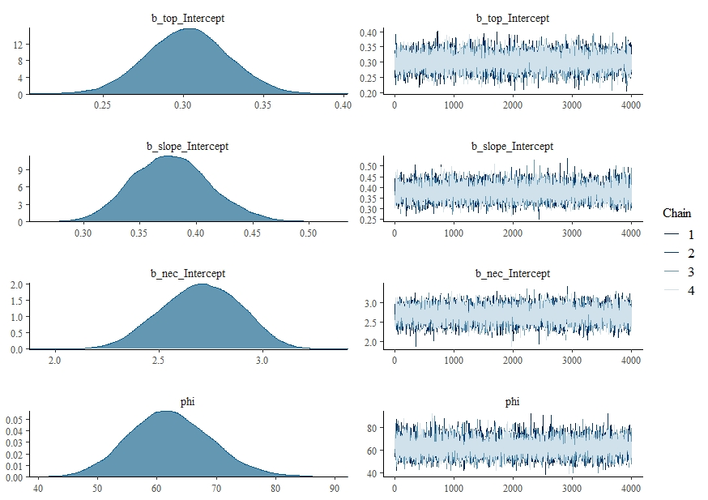
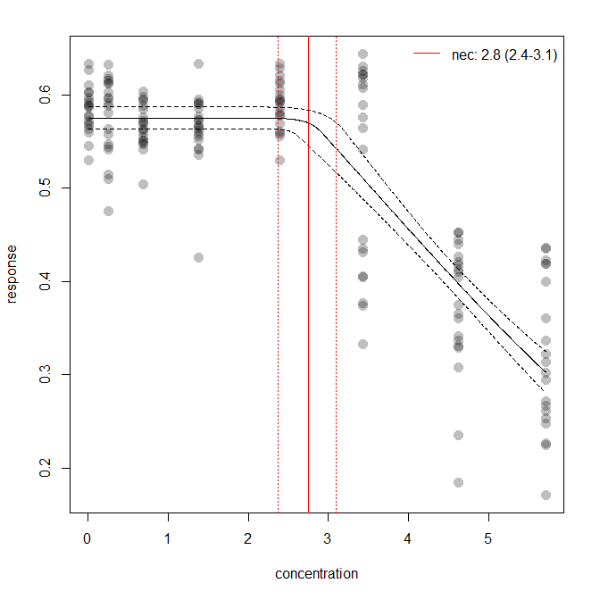
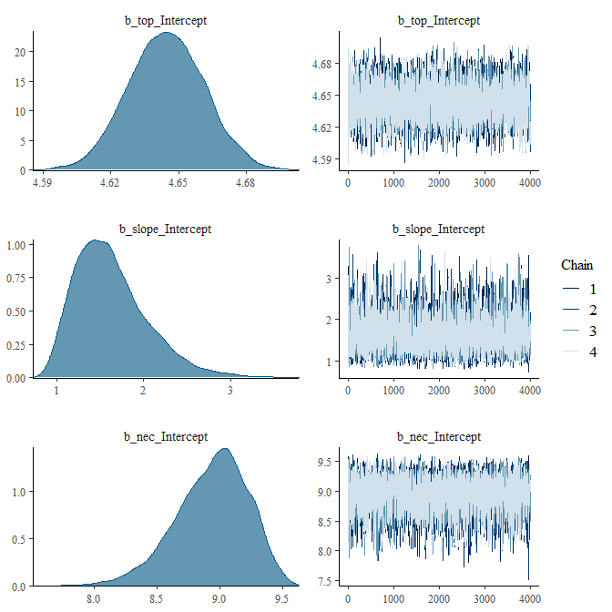
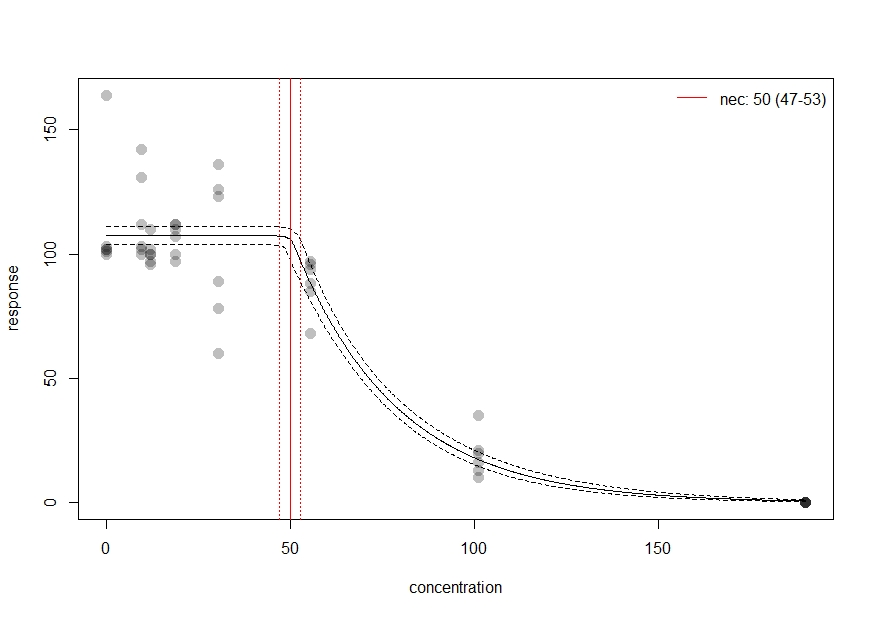
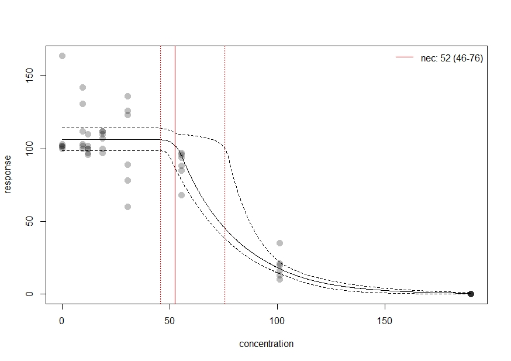
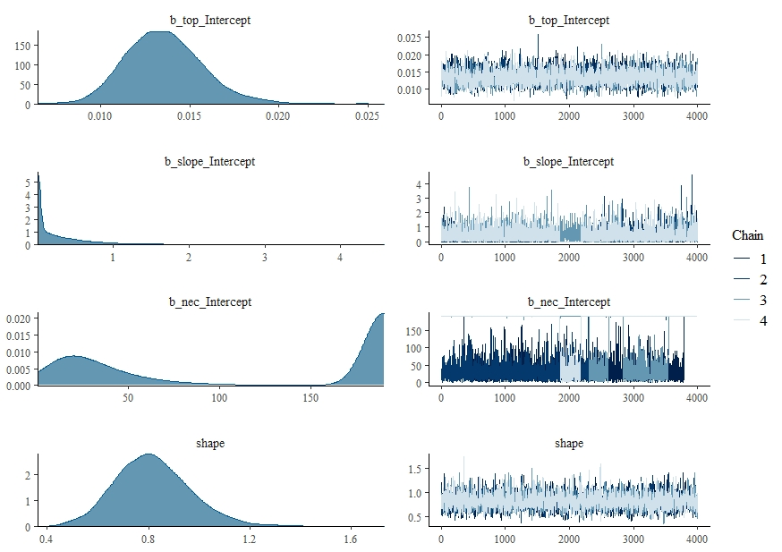
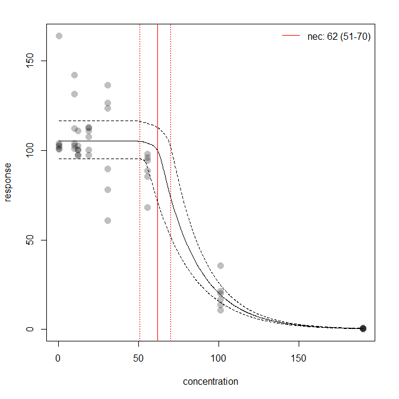

```{r setup, include = FALSE}
stopifnot(require(knitr))
knitr::opts_chunk$set(warning = FALSE, message = FALSE)
```

```{r echo = FALSE}
e1 <- "https://open-aims.github.io/bayesnec/articles/example1.html"
e2 <- "https://open-aims.github.io/bayesnec/articles/example2.html"
e2b <- "https://open-aims.github.io/bayesnec/articles/example2b.html"
e3 <- "https://open-aims.github.io/bayesnec/articles/example3.html"
e4 <- "https://open-aims.github.io/bayesnec/articles/example4.html"
```

[e1]: `r e1`
[e2]: `r e2`
[e2b]: `r e2b`
[e3]: `r e3`
[e4]: `r e4`

# `bayesnec`

The `bayesnec` is an R package to fit concentration(dose) - response curves to toxicity data, and derive No-Effect-Concentration (*NEC*), No-Significant-Effect-Concentration (*NSEC*), and Effect-Concentration (of specified percentage 'x', *ECx*) thresholds from non-linear models fitted using Bayesian MCMC fitting methods via `brms` [@Burkner2017; @Burkner2018] and `stan`. The package is an adaptation and extension of an initial package `jagsNEC` [@Fisher2020] which was based on the `R2jags` package [@Su2015] and `jags` [@Plummer2003].

# Background

Bayesian model fitting can be difficult to automate across a broad range of usage cases, particularly with respect to specifying valid initial values and appropriate priors. This is one reason the use of Bayesian statistics for *NEC* estimation (or even *ECx* estimation) is not currently widely adopted across the broader ecotoxicological community, who rarely have access to specialist statistical expertise. The `bayesnec` package provides an accessible interface specifically for fitting *NEC* models and other concentration-response models using Bayesian methods. A range of models are specified based on the known distribution of the "concentration" or "dose" variable (the predictor, x) as well as the "response" (y) variable. The model formula, including priors and initial values required to call a `brms` model are automatically generated based on information contained in the supplied data. While the distribution of the x and y variables can be specified directly, `bayesnec` will automatically 'guess' the correct distribution to use based on the characteristics of the provided data.

This project started with an implementation of the *NEC* model based on that described in [@Fox2010] using R2jags. The package has been further generalised to allow a large range of response variables to be modelled using the appropriate statistical distribution. While the original `jagsNEC` implementation supported gaussian, poisson, binomial, gamma, negbin and beta response data `bayesnec` supports any of the `brms` families. We have since also further added a range of alternative *NEC* model types, as well as a range of typically used concentration-response models (such as 4-parameter logistic and weibull models) that have no *NEC* 'step' function but simply model the response as a smooth function of concentration, as can be fit using other commonly used frequentist packages such as `drc` [@Ritz2016].

Specific models can be fit directly using `bnec`, which is what we discuss here. Alternatively it is possible to fit a custom model set, specific model set or all of the available models. Further information on fitting multi models using `bayesnec` can be found in the [Multi model usage][e2] vignette. For detailed information on the models available in `bayesnec` see the [Model details][e2b] vignette.

Important information on the current package is contained in the `bayesnec` help-files and the [Model details][e2b] vignette.

This package is currently under development. We are keen on any feedback regarding usage, and especially bug reporting that includes an easy to run self contained reproducible example of unexpected behaviour or example model fits that fail to converge (have poor chain mixing) or yield other errors. Such information will hopefully help us towards building a more robust package. We cannot help troubleshoot issues if an easy to run reproducible example is not supplied.

# Installation

To install the latest version from GitHub (https://github.com/open-AIMS/bayesnec) use:

```{r, eval = FALSE}
install.packages("remotes")
remotes::install_github("open-AIMS/bayesnec")
```

To run this vignette we will also need some additional packages, which are made available via `tidyverse`

```{r, echo = FALSE, warning = FALSE, message = FALSE, results = "hide"}
install.packages("tidyverse", repos = "http://cran.us.r-project.org")
```

```{r, warning = FALSE, message = FALSE}
library(tidyverse)
```

# Examples
## Fitting the neclin model using `bnec`

Here we include some examples showing how to use the package to fit an *NEC* model to binomial, proportional, count and continuous response (y) data. The examples are those used by Gerard Ricardo at: <https://github.com/gerard-ricardo/NECs/blob/master/NECs>. Here we show how to run a similar `jags` models using the `bayesnec` package. Note however, the default behaviour in `bayesnec` is to use native link functions for each family, thus we fit the "neclin" model for these examples, rather than the "nec3param" model which is not valid for use with the logit or log link (see the [Model details][e2b] vignette for more information and the models available in `bayesnec`).

### Binomial data

The response variable `y` is considered to follow a binomial distribution when it is a count out of a total (such as the percentage survival of individuals, for example). First we read in the binomial example from [pastebin](https://pastebin.com/tools), prepare the data for analysis, and then inspect the dataset as well as the "concentration" or x variable, in this case `raw_x`.


```{r}
binom_data <- "https://pastebin.com/raw/zfrUha88" %>%
  read.table(header = TRUE, dec = ",", stringsAsFactors = FALSE) %>%
  dplyr::rename(raw_x = raw.x) %>%
  dplyr::mutate(raw_x = as.numeric(as.character(raw_x)),
                log_x = log(raw_x))

str(binom_data)
range(binom_data$raw_x)
hist(binom_data$raw_x)
```

In this case for x, lowest concentration is 0.1 and the highest is 400. The data are right skewed and on the continuous scale. This type of distribution for the x data are common for concentration response experiments, where the x 'concentration' data are the concentration of contaminants, or dilutions. The current default in `bayesnec` is to estimate the appropriate distribution(s) and priors for the `family` argument, but it is possible to supply `family` directly. We are going to model this with the x data on a log scale, as this is the scaling clearly used in the experimental design and the will provide more stable results.

The data are clearly binomial, with the column `suc`---indicating the number of 'successes' in the binomial call, with `tot` clearly indicating the number of trials.

The main 'working' function in `bayesnec` is the function `bnec`, which calls the other necessary functions and fits the `brms` model. We run `bnec` by supplying `data`: a data.frame containing the data for the model fitting, here, `binom_data`;  `x_var`: the name of the column in `data` which contains the concentration data or 'x' data to be used in the *NEC* model fit, and `y_var`: the name of the column in `data` which contains the response or 'y' data to be used in the *NEC* model fit. In our example here, as this is binomial, we must also supply `trials_var`, which is the name of the column in `data` which contains the number of trials in the binomial call.

`bnec` will guess the data types for use, although as mentioned above we could manually specify `family` as "binomial". `bnec` will also generate appropriate priors for the `brms` model call, although these can also be specified manually (see the [User-specified priors][e3] vignette for more details).

```{r, warning = FALSE, message = FALSE}
library(bayesnec)

set.seed(333)
exp_1 <- bnec(data = binom_data, x_var = "log_x",
              y_var = "suc", model = "neclin",
              trials_var = "tot")
```

The function shows the progress of the `brms` fit and returns the usual `brms` output (with a few other elements added to this list). The function `plot(exp_1$fit)` can be used to plot the chains, so we can assess mixing and look for other potential issues with the model fit. Initially `bayesnec` will attempt to use starting values generated for that type of model formula and family. It will run the iterations and then test if all chains are valid. If the model does not have valid chains `bayesnec` with try up to `n_tries` more times to fit the data using either `bayesnec` generated or `brms` default initial values and obtain a successfully fitted model with good mixing. If no model is successfully fit an error will be returned indicating the model could not be fit successfully.

```{r, warning = FALSE, fig.width = 7, fig.height = 7}
plot(exp_1$fit)
```

In our example, the chains are well mixed and the probability density plots look good. We can also do a pairs plot that can help to assess issues with identifiability, which also looks ok. There are a range of other model diagnostics that can be explored for brms model fits, using the $fit syntax. We encourage you to explore the rich material already on github regarding use and validation of [brms] (https://github.com/paul-buerkner/brms) models.

```{r, fig.width = 7, fig.height = 7}
pairs(exp_1$fit)
```

We can see the summary of our fitted model parameters using:
```{r}
summary(exp_1)
```

Note the Rhat values in this example are one, indicating convergence.

The function `plot` can be used to plot the fitted model. You can also make your own plot from the data included in the returned `bayesnecfit` object from the call to `bnec`. Here we use the default plot method from `bayesnec`, where we add the exp function to plot the tick labels on the original scaling of the concentration data.

```{r, fig.width = 7, fig.height = 7}
plot(exp_1, lxform = exp)
```

Alternatively, we can use the built in `brms` methods to plot the `brms` fit directly. For example:

```{r, message = FALSE, warning = FALSE, fig.width = 7, fig.height = 7}
df <- exp_1$fit$data %>%
  dplyr::mutate(prop = y / trials)
plot(brms::conditional_effects(exp_1$fit))[[1]] +
     geom_point(data = df, aes(x = x, y = prop),
                inherit.aes = FALSE)
```

This model fit doesn't look great. You can see that the error bounds around the fit are far too narrow for this data, suggesting over dispersion of this model (meaning that the data are more variable than this model fit predicts). An estimate of dispersion is provided by `bayesnec`, and this can be extracted using `exp_1$dispersion`. Values >1 indicate over-dispersion and values <1 indicate under-dispersion. In this case the over-dispersion value is much bigger than 1, suggesting extreme over-dispersion (meaning our model doesn't properly capture the true variability represented in this data). We would need to consider alternative ways of modelling this data using a different distribution, such as the beta-binomial.

```{r}
exp_1$dispersion
```

### Beta binomial

The beta binomial model can be useful for over dispersed binomial data.

```{r, eval=FALSE}
set.seed(333)
exp_1b <- bnec(data = binom_data, x_var = "log_x",
              y_var = "suc", model = "neclin",
              family = beta_binomial2,
              trials_var = "tot")
```
Fitting this data with the betabinomial2 yields a much more realistic fit in terms of the confidence bounds and the spread in the data. Note that no dispersion estimate is provided here, as overdispersion is only relevant for poisson and binomial data.

```{r, eval=FALSE}
plot(exp_1b, lxform = exp)
exp_1b$dispersion
#[1] NA NA NA
```
```{r echo=FALSE, out.width='100%'}

```

Now we have a good fit to these data, we can interpret the results. The estimated *NEC* value can be obtained directly from the fitted model object, using `exp_1b$nec`, or we can plot the posterior distribution of the nec values.
 
```{r, eval=FALSE}
exp_1b$nec
#Estimate     Q2.5    Q97.5 
#3.436315 2.674583 4.00693

hist(exp_1b$nec_posterior)
```

```{r echo=FALSE, out.width='100%'}

```


EC*x* estimates can also be obtained from the *NEC* model fit, using the function `ecx`. Note these may differ from a typical 4-parameter non-linear model, as the *NEC* model is a broken stick non-linear regression and will often fall more sharply than a smooth 4-parameter non-linear curve. See both the [Model details][e2b] and [Comparing posterior predictions][e4] vignettes for more information.

```{r, warning = FALSE, eval=FALSE}
ecx(exp_1b)
#  ec_10_Q50  ec_10_Q2.5 ec_10_Q97.5 
#   3.799644    3.276595    4.223064 
```


### Beta data

Sometimes the response variable is distributed between `0` and `1` but is not a straight forward binomial. A common example in coral ecology is maximum quantum yield (the proportion of light used for photosynthesis when all reaction centres are open) which is a measure of photosynthetic efficiency calculated from PAM data. Here we have a proportion value that is not based on trials and successes. In this case there are no theoretical 'trials' and the data must be modelled using a beta distribution.

```{r, eval=FALSE}
prop_data <- "https://pastebin.com/raw/123jq46d" %>%
  read.table(header = TRUE, dec = ",", stringsAsFactors = FALSE) %>%
  dplyr::rename(raw_x = raw.x) %>%
  dplyr::mutate(raw_x = log(as.numeric(as.character(raw_x)) + 1),
                resp = as.numeric(as.character(resp)))

set.seed(333)
exp_2 <- bnec(data = prop_data, x_var = "raw_x",
              y_var = "resp", model = "neclin")

```

```{r, warning = FALSE, fig.width = 7, fig.height = 7, eval=FALSE}
plot(exp_2$fit)
```
```{r echo=FALSE, out.width='100%'}

```


```{r, warning = FALSE, fig.width = 7, fig.height = 7, eval=FALSE}
plot(exp_2)
```
```{r echo=FALSE, out.width='100%'}

```

### Poisson data

Where data are a count (of, for example, individuals or cells) y is poisson. Such data are distributed from `0` to `Inf` and are integers. First we read in the count data example from [pastebin](https://pastebin.com/tools), and then plot the "concentration" or x data, Again, this is `raw_x`, and distributed as in our binomial example above.


```{r, warning = FALSE, fig.width = 10, fig.height = 4.7}
require(tidyverse)
require(bayesnec)
count_data <- "https://pastebin.com/raw/ENgNSgf7" %>%
  read.table(header = TRUE, dec = ",", stringsAsFactors = FALSE) %>%
  dplyr::rename(raw_x = raw.x) %>%
  dplyr::mutate(raw_x = as.numeric(as.character(raw_x)),
                sqrt_x = sqrt(raw_x))

str(count_data)
range(count_data$raw_x)

par(mfrow = c(1, 2))
hist(count_data$raw_x, xlab = "'x' variable", main = "")
hist(count_data$count, xlab = "Total counts", main = "")
```


First we supply `bnec` with `data` (count_data), and specify `x_var` and `y_var`. As we have integers of 0 and greater  `family` is "poisson". The default behaviour to guess the variable types works for this example.


```{r, warning = FALSE, eval=FALSE}
set.seed(333)
exp_3 <- bnec(data = count_data, x_var = "sqrt_x",
              y_var = "count", model = "neclin")
```

We first plot the model chains and parameter estimates to check the fit.

```{r, warning = FALSE, fig.width = 7, fig.height = 7, eval=FALSE}
plot(exp_3$fit)
```
```{r echo=FALSE, out.width='100%'}

```

```{r, warning = FALSE, fig.width = 7, fig.height = 7, eval=FALSE}
plot(exp_3)
exp_3$dispersion
#Estimate     Q2.5    Q97.5 
#2.915520 1.927265 4.526432 
```
```{r echo=FALSE, out.width='100%'}

```

The chains look ok, however our plot of the fit is not very convincing. The error bars are very narrow, and this does not seem to be a particularly good model for these data. Note that the dispersion estimate is much greater than one, indicating serious overdispersion. In this case we can try a negative binomial family.

### Negative binomial

When count data are overdispersed and cannot be modelled using the poisson family, the negative binomial family is generally used. We can do this by calling `family = "negbinomial"`.

```{r, warning = FALSE, eval=FALSE}
set.seed(333)
exp_3b <- bnec(data = count_data, x_var = "sqrt_x",
              y_var = "count", family = "negbinomial", model = "neclin")
```
The resultant plot seems to indicate the negative binomial family works better in terms of dispersion (more sensible wider confidence bands) however it it still does not seem to be a good model for these data.

```{r, warning = FALSE, fig.width = 7, fig.height = 7, eval=FALSE}
plot(exp_3b)
```
```{r echo=FALSE, out.width='100%'}

```

```{r, warning = FALSE, fig.width = 7, fig.height = 7, eval=FALSE}
plot(exp_3b$fit)
```
```{r echo=FALSE, out.width='100%'}
knitr::include_graphics('example1g.jpeg')
```


### Measure data

Where data are a measured variable (i.e. length or size) y is family gamma. Such data are distributed from `0+` to `Inf` and are continuous. First we read in the count data example from pastebin, and then plot the "concentration" or x data, Again, this is raw_x, and distributed as in our binomial example above.

```{r}
measure_data <- "https://pastebin.com/raw/pWeS6x0n" %>%
  read.table(header = TRUE, dec = ",", stringsAsFactors = FALSE) %>%
  dplyr::rename(raw_x = raw.x) %>%
  dplyr::mutate(dplyr::across(where(is.character), as.numeric))
```

```{r, warning = FALSE, eval=FALSE}
set.seed(333)
exp_4 <- bnec(data = measure_data, x_var = "raw_x",
              y_var = "measure", model = "neclin")
```
```{r, warning = FALSE, fig.width = 7, fig.height = 7, eval=FALSE}
plot(exp_4$fit)
```
```{r echo=FALSE, out.width='100%'}

```

```{r, warning = FALSE, fig.width = 7, fig.height = 7, eval=FALSE}
plot(exp_4)
```
```{r echo=FALSE, out.width='100%'}
knitr::include_graphics('example1i.jpeg')
```
In this case our model is a terrible fit. This is because the default link for the gamma family is inverse, which doesn't work at all in this case. We need to run this again calling the family `Gamma` manually, and setting a `log` link.

```{r, warning = FALSE, eval=FALSE}
set.seed(333)
exp_4b <- bnec(data = measure_data, x_var = "raw_x",
              y_var = "measure", model = "neclin", family = Gamma(link = "log"))
```

```{r, warning = FALSE, fig.width = 7, fig.height = 7, eval=FALSE}
plot(exp_4b)
```
```{r echo=FALSE, out.width='100%'}

```

Using the `log` link our `Gamma` distribution is a reasonable fit to these data.


# References
