[e1]: https://open-aims.github.io/bayesnec/articles/example1.html
[e2]: https://open-aims.github.io/bayesnec/articles/example2.html
[e2b]: https://open-aims.github.io/bayesnec/articles/example2b.html
[e3]: https://open-aims.github.io/bayesnec/articles/example3.html
[e4]: https://open-aims.github.io/bayesnec/articles/example4.html

# `bayesnec`

The `bayesnec` is an R package to fit concentration(dose) — response curves to toxicity data, and derive No-Effect-Concentration (*NEC*), No-Significant-Effect-Concentration (*NSEC*), and Effect-Concentration (of specified percentage 'x', *ECx*) thresholds from non-linear models fitted using Bayesian MCMC fitting methods via `brms` [@Burkner2017; @Burkner2018] and `stan`. The package is an adaptation and extension of an initial package `jagsNEC` [@Fisher2020] which was based on the `R2jags` package [@Su2015] and `jags` [@Plummer2003].

# Background

Bayesian model fitting can be difficult to automate across a broad range of usage cases, particularly with respect to specifying valid initial values and appropriate priors. This is one reason the use of Bayesian statistics for *NEC* estimation (or even *ECx* estimation) is not currently widely adopted across the broader ecotoxicological community, who rarely have access to specialist statistical expertise. The `bayesnec` package provides an accessible interface specifically for fitting *NEC* models and other concentration—response models using Bayesian methods. A range of models are specified based on the known distribution of the "concentration" or "dose" variable (the predictor, x) as well as the "response" (y) variable. The model formula, including priors and initial values required to call a `brms` model are automatically generated based on information contained in the supplied data. While the distribution of the x and y variables can be specified directly, `bayesnec` will automatically 'guess' the correct distribution to use based on the characteristics of the provided data.

This project started with an implementation of the *NEC* model based on that described in (Pires et al. 2002) and [@Fox2010] using R2jags [@Fisher2020]. The package has been further generalised to allow a large range of response variables to be modelled using the appropriate statistical distribution. While the original `jagsNEC` implementation supported Gaussian, Poisson, Binomial, Gamma, Negative Binomial and beta response data `bayesnec` additionally supports the Beta-Binomial distribution, and can be easily extended to include any of the available `brms` families. We have since also further added a range of alternative *NEC* model types, as well as a range of  concentration—response models (such as 4-parameter logistic and Weibull models) that are commonly used in frequentist packages such as `drc`[@Ritz2016]. These models do not employ segmented regression (i.e., use of a ‘step’ function) but simply models the response as a smooth function of concentration.  

Specific models can be fit directly using `bnec`, which is what we discuss here. Alternatively, it is possible to fit a custom model set, a specific model set, or all the available models. Further information on fitting multi-models using `bayesnec` can be found in the [Multi model usage][e2] vignette. For detailed information on the models available in `bayesnec` see the [Model details][e2b] vignette.

Important information on the current package is contained in the `bayesnec` help-files and the [Model details][e2b] vignette.

This package is currently under development. We are keen to receive any feedback regarding usage, and especially bug reporting that includes an easy to run self-contained reproducible example of unexpected behaviour, or example model fits that fail to converge (have poor chain mixing) or yield other errors. Such information will hopefully help us towards building a more robust package. We cannot help troubleshoot issues if an easy-to-run reproducible example is not supplied.

# Installation

To install the latest release version from CRAN use


```r
install.packages("bayesnec")
```

The current development version can be downloaded from GitHub via


```r
if (!requireNamespace("remotes")) {
  install.packages("remotes")
}
remotes::install_github("open-aims/bayesnec")
```

Because `bayesnec` is based on `brms` and [Stan](https://mc-stan.org/), a C++
compiler is required. The program
[Rtools](https://cran.r-project.org/bin/windows/Rtools/) comes with a C++
compiler for Windows. On Mac, you should install Xcode. See the prerequisites
section on this
[link](https://github.com/stan-dev/rstan/wiki/RStan-Getting-Started)
for further instructions on how to get the compilers running.

To run this vignette, we will also need some additional packages


```r
library(dplyr)
library(ggplot2)
```

# Examples
## Fitting the neclin model using `bnec`

Here we include some examples showing how to use the package to fit an *NEC* model to binomial, proportional, count and continuous response (y) data. The examples are those used at: <https://github.com/gerard-ricardo/NECs/blob/master/NECs>, but here we are showing how to fit models to these data using the `bayesnec` package. Note however, the default behaviour in `bayesnec` is to use native link functions for each family, thus we fit the "neclin" model for these examples, rather than the "nec3param" model which is not valid for use with the logit or log link (see the [Model details][e2b] vignette for more information and the models available in `bayesnec`).

### Binomial data

The response variable `y` is considered to follow a binomial distribution when it is a count out of a total (such as the percentage survival of individuals, for example). First, we read in the binomial example from [pastebin](https://pastebin.com/tools), prepare the data for analysis, and then inspect the dataset as well as the "concentration" or x variable, in this case `raw_x`.


```r
binom_data <- "https://pastebin.com/raw/zfrUha88" %>%
  read.table(header = TRUE, dec = ",", stringsAsFactors = FALSE) %>%
  dplyr::rename(raw_x = raw.x) %>%
  dplyr::mutate(raw_x = as.numeric(as.character(raw_x)),
                log_x = log(raw_x))

str(binom_data)
#> 'data.frame':	48 obs. of  4 variables:
#>  $ raw_x: num  0.1 0.1 0.1 0.1 0.1 0.1 6.25 6.25 6.25 6.25 ...
#>  $ suc  : int  101 106 102 112 58 158 95 91 93 113 ...
#>  $ tot  : int  175 112 103 114 69 165 109 92 99 138 ...
#>  $ log_x: num  -2.3 -2.3 -2.3 -2.3 -2.3 ...
range(binom_data$raw_x)
#> [1]   0.1 400.0
hist(binom_data$raw_x)
```

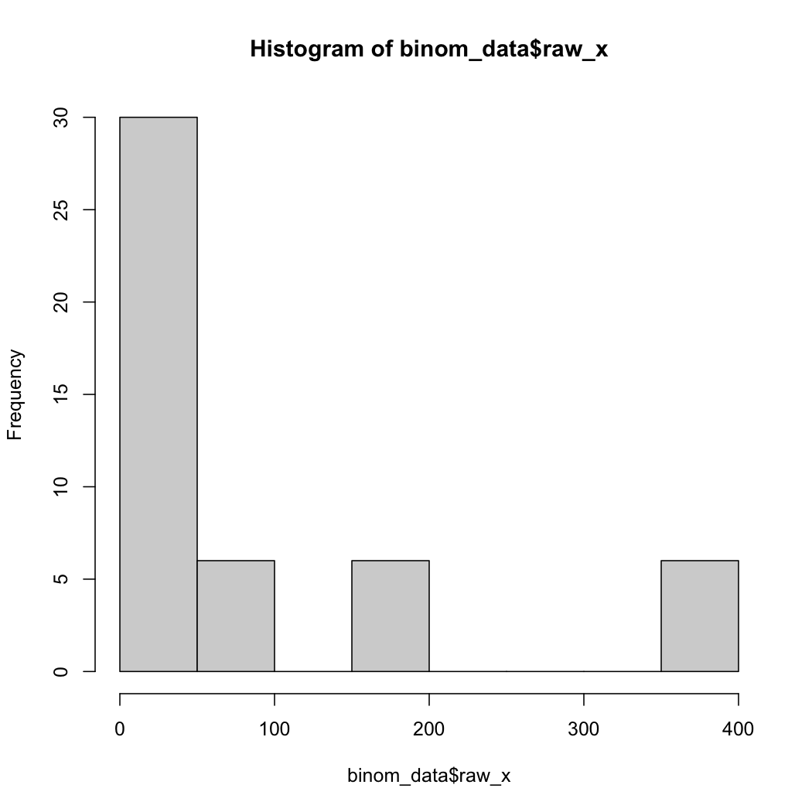

In this case for x, lowest concentration is 0.1 and the highest is 400. The data are right skewed and on the continuous scale. This type of distribution for the x data are common for concentration—response experiments, where the x 'concentration' data are the concentration of contaminants, or dilutions. The current default in `bayesnec` is to estimate the appropriate distribution(s) and priors for the `family` argument, but it is possible to supply `family` directly. We are going to model this with the x data on a log scale, as this is the scaling clearly used in the experimental design and thus will provide more stable results.

The data are clearly binomial, with the column `suc`---indicating the number of 'successes' in the binomial call, with `tot` clearly indicating the number of trials.

The main 'working' function in `bayesnec` is the function `bnec`, which calls the other necessary functions and fits the `brms` model. We run `bnec` by supplying `data`: a data.frame containing the data for the model fitting, here, `binom_data`;  `x_var`: the name of the column in `data` which contains the concentration data or 'x' data to be used in the *NEC* model fit, and `y_var`: the name of the column in `data` which contains the response or 'y' data to be used in the *NEC* model fit. In our example here, as this is binomial, we must also supply `trials_var`, which is the name of the column in `data` which contains the number of trials in the binomial call.

`bnec` will guess the data types for use, although as mentioned above we could manually specify `family` as "binomial". `bnec` will also generate appropriate priors for the `brms` model call, although these can also be specified manually (see the [Priors][e3] vignette for more details).


```r
library(bayesnec)

set.seed(333)
exp_1 <- bnec(data = binom_data, x_var = "log_x",
              y_var = "suc", model = "neclin",
              trials_var = "tot")
#> 
#> SAMPLING FOR MODEL '8a8b3e9e9e97704abf746e2c6f5cd369' NOW (CHAIN 1).
#> Chain 1: 
#> Chain 1: Gradient evaluation took 7.2e-05 seconds
#> Chain 1: 1000 transitions using 10 leapfrog steps per transition would take 0.72 seconds.
#> Chain 1: Adjust your expectations accordingly!
#> Chain 1: 
#> Chain 1: 
#> Chain 1: Iteration:    1 / 10000 [  0%]  (Warmup)
#> Chain 1: Iteration: 1000 / 10000 [ 10%]  (Warmup)
#> Chain 1: Iteration: 2000 / 10000 [ 20%]  (Warmup)
#> Chain 1: Iteration: 3000 / 10000 [ 30%]  (Warmup)
#> Chain 1: Iteration: 4000 / 10000 [ 40%]  (Warmup)
#> Chain 1: Iteration: 5000 / 10000 [ 50%]  (Warmup)
#> Chain 1: Iteration: 6000 / 10000 [ 60%]  (Warmup)
#> Chain 1: Iteration: 7000 / 10000 [ 70%]  (Warmup)
#> Chain 1: Iteration: 8000 / 10000 [ 80%]  (Warmup)
#> Chain 1: Iteration: 9000 / 10000 [ 90%]  (Warmup)
#> Chain 1: Iteration: 9001 / 10000 [ 90%]  (Sampling)
#> Chain 1: Iteration: 10000 / 10000 [100%]  (Sampling)
#> Chain 1: 
#> Chain 1:  Elapsed Time: 1.31598 seconds (Warm-up)
#> Chain 1:                0.172262 seconds (Sampling)
#> Chain 1:                1.48824 seconds (Total)
#> Chain 1: 
#> 
#> SAMPLING FOR MODEL '8a8b3e9e9e97704abf746e2c6f5cd369' NOW (CHAIN 2).
#> Chain 2: 
#> Chain 2: Gradient evaluation took 2.4e-05 seconds
#> Chain 2: 1000 transitions using 10 leapfrog steps per transition would take 0.24 seconds.
#> Chain 2: Adjust your expectations accordingly!
#> Chain 2: 
#> Chain 2: 
#> Chain 2: Iteration:    1 / 10000 [  0%]  (Warmup)
#> Chain 2: Iteration: 1000 / 10000 [ 10%]  (Warmup)
#> Chain 2: Iteration: 2000 / 10000 [ 20%]  (Warmup)
#> Chain 2: Iteration: 3000 / 10000 [ 30%]  (Warmup)
#> Chain 2: Iteration: 4000 / 10000 [ 40%]  (Warmup)
#> Chain 2: Iteration: 5000 / 10000 [ 50%]  (Warmup)
#> Chain 2: Iteration: 6000 / 10000 [ 60%]  (Warmup)
#> Chain 2: Iteration: 7000 / 10000 [ 70%]  (Warmup)
#> Chain 2: Iteration: 8000 / 10000 [ 80%]  (Warmup)
#> Chain 2: Iteration: 9000 / 10000 [ 90%]  (Warmup)
#> Chain 2: Iteration: 9001 / 10000 [ 90%]  (Sampling)
#> Chain 2: Iteration: 10000 / 10000 [100%]  (Sampling)
#> Chain 2: 
#> Chain 2:  Elapsed Time: 1.31395 seconds (Warm-up)
#> Chain 2:                0.180111 seconds (Sampling)
#> Chain 2:                1.49406 seconds (Total)
#> Chain 2: 
#> 
#> SAMPLING FOR MODEL '8a8b3e9e9e97704abf746e2c6f5cd369' NOW (CHAIN 3).
#> Chain 3: 
#> Chain 3: Gradient evaluation took 2.5e-05 seconds
#> Chain 3: 1000 transitions using 10 leapfrog steps per transition would take 0.25 seconds.
#> Chain 3: Adjust your expectations accordingly!
#> Chain 3: 
#> Chain 3: 
#> Chain 3: Iteration:    1 / 10000 [  0%]  (Warmup)
#> Chain 3: Iteration: 1000 / 10000 [ 10%]  (Warmup)
#> Chain 3: Iteration: 2000 / 10000 [ 20%]  (Warmup)
#> Chain 3: Iteration: 3000 / 10000 [ 30%]  (Warmup)
#> Chain 3: Iteration: 4000 / 10000 [ 40%]  (Warmup)
#> Chain 3: Iteration: 5000 / 10000 [ 50%]  (Warmup)
#> Chain 3: Iteration: 6000 / 10000 [ 60%]  (Warmup)
#> Chain 3: Iteration: 7000 / 10000 [ 70%]  (Warmup)
#> Chain 3: Iteration: 8000 / 10000 [ 80%]  (Warmup)
#> Chain 3: Iteration: 9000 / 10000 [ 90%]  (Warmup)
#> Chain 3: Iteration: 9001 / 10000 [ 90%]  (Sampling)
#> Chain 3: Iteration: 10000 / 10000 [100%]  (Sampling)
#> Chain 3: 
#> Chain 3:  Elapsed Time: 1.31919 seconds (Warm-up)
#> Chain 3:                0.191825 seconds (Sampling)
#> Chain 3:                1.51101 seconds (Total)
#> Chain 3: 
#> 
#> SAMPLING FOR MODEL '8a8b3e9e9e97704abf746e2c6f5cd369' NOW (CHAIN 4).
#> Chain 4: 
#> Chain 4: Gradient evaluation took 2.5e-05 seconds
#> Chain 4: 1000 transitions using 10 leapfrog steps per transition would take 0.25 seconds.
#> Chain 4: Adjust your expectations accordingly!
#> Chain 4: 
#> Chain 4: 
#> Chain 4: Iteration:    1 / 10000 [  0%]  (Warmup)
#> Chain 4: Iteration: 1000 / 10000 [ 10%]  (Warmup)
#> Chain 4: Iteration: 2000 / 10000 [ 20%]  (Warmup)
#> Chain 4: Iteration: 3000 / 10000 [ 30%]  (Warmup)
#> Chain 4: Iteration: 4000 / 10000 [ 40%]  (Warmup)
#> Chain 4: Iteration: 5000 / 10000 [ 50%]  (Warmup)
#> Chain 4: Iteration: 6000 / 10000 [ 60%]  (Warmup)
#> Chain 4: Iteration: 7000 / 10000 [ 70%]  (Warmup)
#> Chain 4: Iteration: 8000 / 10000 [ 80%]  (Warmup)
#> Chain 4: Iteration: 9000 / 10000 [ 90%]  (Warmup)
#> Chain 4: Iteration: 9001 / 10000 [ 90%]  (Sampling)
#> Chain 4: Iteration: 10000 / 10000 [100%]  (Sampling)
#> Chain 4: 
#> Chain 4:  Elapsed Time: 1.30727 seconds (Warm-up)
#> Chain 4:                0.187053 seconds (Sampling)
#> Chain 4:                1.49433 seconds (Total)
#> Chain 4:
```

The function shows the progress of the `brms` fit and returns the usual `brms` output (with a few other elements added to this list). The function `plot(exp_1$fit)` can be used to plot the chains, so we can assess mixing and look for other potential issues with the model fit. Initially `bayesnec` will attempt to use starting values generated for that type of model formula and family. It will run the iterations and then test if all chains are valid. If the model does not have valid chains `bayesnec` with try up to `n_tries` more times to fit the data using either `bayesnec` generated or `brms` default initial values and obtain a successfully fitted model with good mixing. If no model is successfully fit an error will be returned indicating the model could not be fit successfully.


```r
plot(exp_1$fit)
```

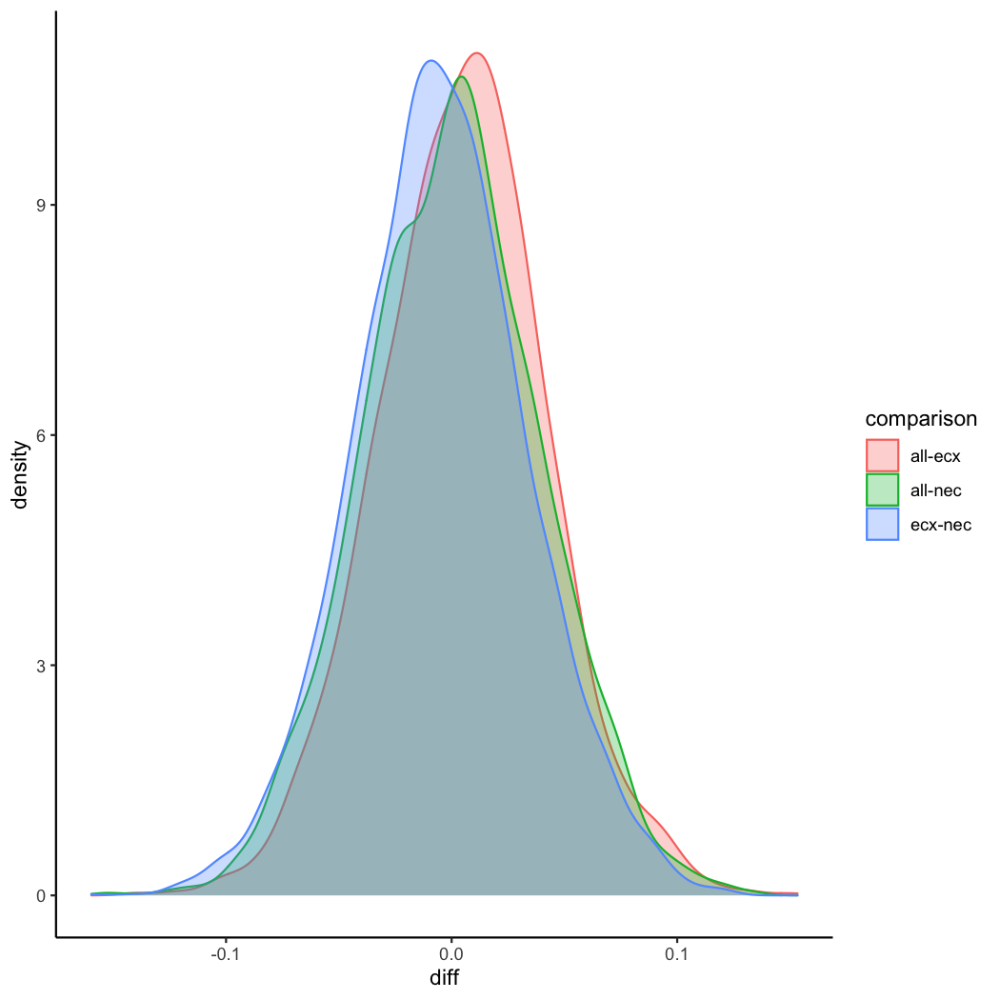

In our example, the chains are well mixed, and the probability density plots look good. We can also run a pairs plot that can help to assess issues with identifiability, and which also looks ok. There are a range of other model diagnostics that can be explored for [brms] model fits, using the $fit syntax. We encourage you to explore the rich material already on github regarding use and validation of [brms] (https://github.com/paul-buerkner/brms) models.


```r
pairs(exp_1$fit)
```

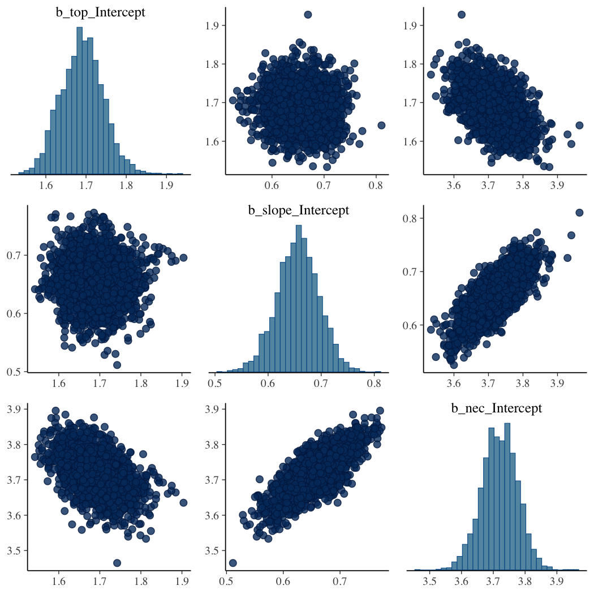

We can see the summary of our fitted model parameters using:

```r
summary(exp_1)
#> Object of class bayesnecfit containing the following non-linear model: neclin
#> 
#>  Family: binomial 
#>   Links: mu = logit 
#> Formula: y | trials(trials) ~ top - exp(slope) * (x - nec) * step(x - nec) 
#>          top ~ 1
#>          slope ~ 1
#>          nec ~ 1
#>    Data: structure(list(x = c(-2.30258509299405, -2.3025850 (Number of observations: 48) 
#> Samples: 4 chains, each with iter = 10000; warmup = 9000; thin = 1;
#>          total post-warmup samples = 4000
#> 
#> Population-Level Effects: 
#>                 Estimate Est.Error l-95% CI u-95% CI Rhat Bulk_ESS Tail_ESS
#> top_Intercept       1.69      0.05     1.59     1.80 1.00     1928     1457
#> slope_Intercept     0.66      0.04     0.58     0.73 1.00     1272     1284
#> nec_Intercept       3.72      0.06     3.60     3.82 1.00     1186     1040
#> 
#> Samples were drawn using sampling(NUTS). For each parameter, Bulk_ESS
#> and Tail_ESS are effective sample size measures, and Rhat is the potential
#> scale reduction factor on split chains (at convergence, Rhat = 1).
```

Note the Rhat values in this example are one, indicating convergence.

The function `plot` can be used to plot the fitted model. You can also make your own plot from the data included in the returned `bayesnecfit` object from the call to `bnec`. Here we use the default plot method from `bayesnec`, where we add the 'exp' function to plot the tick labels on the original scaling of the concentration data.


```r
plot(exp_1, lxform = exp)
```

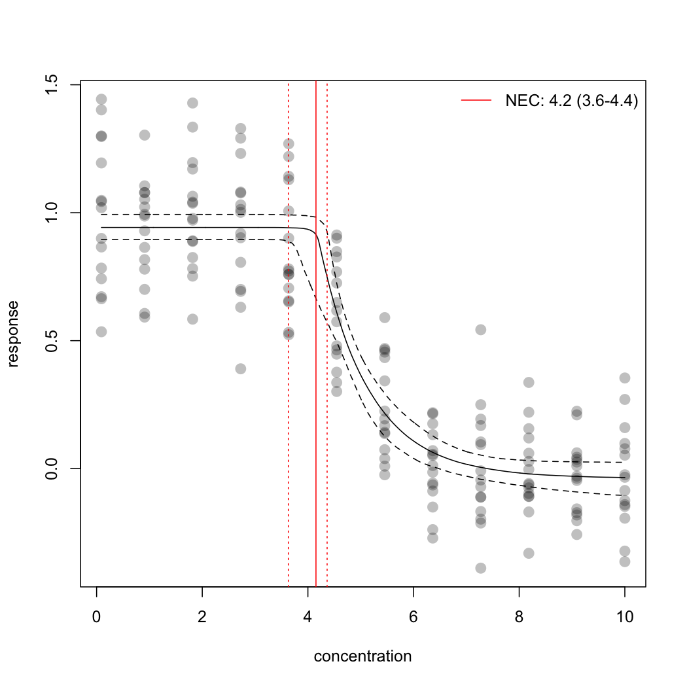

Alternatively, we can use the built in `brms` methods to plot the `brms` fit directly. For example:


```r
df <- exp_1$fit$data %>%
  dplyr::mutate(prop = y / trials)
plot(brms::conditional_effects(exp_1$fit))[[1]] +
     geom_point(data = df, aes(x = x, y = prop),
                inherit.aes = FALSE)
```

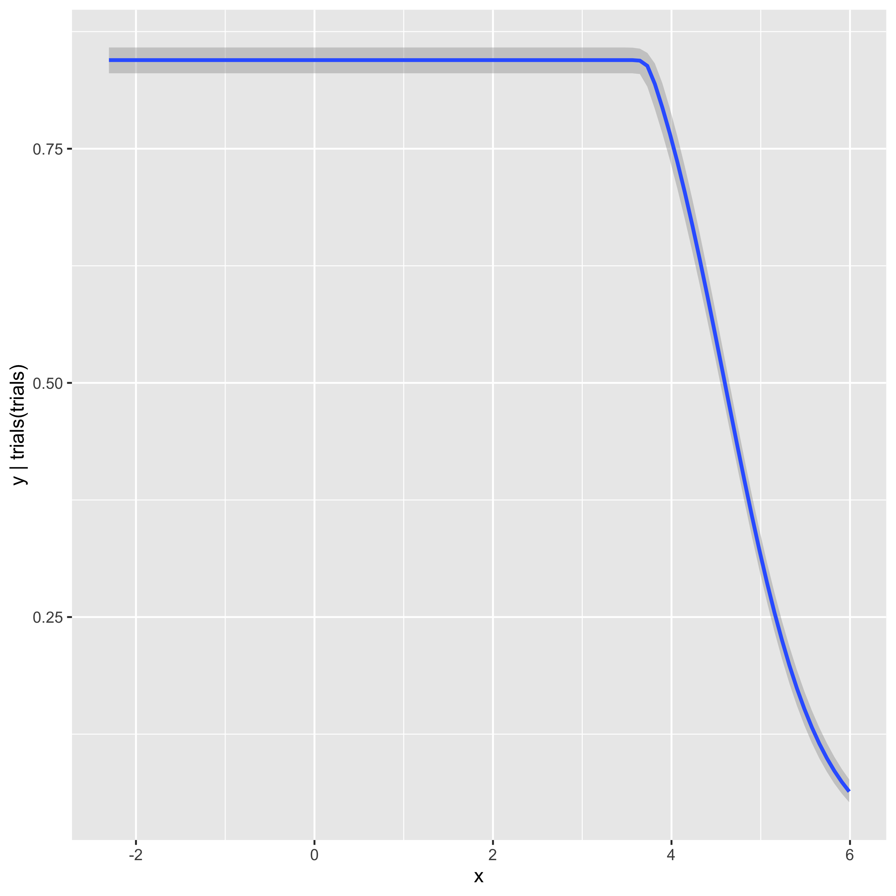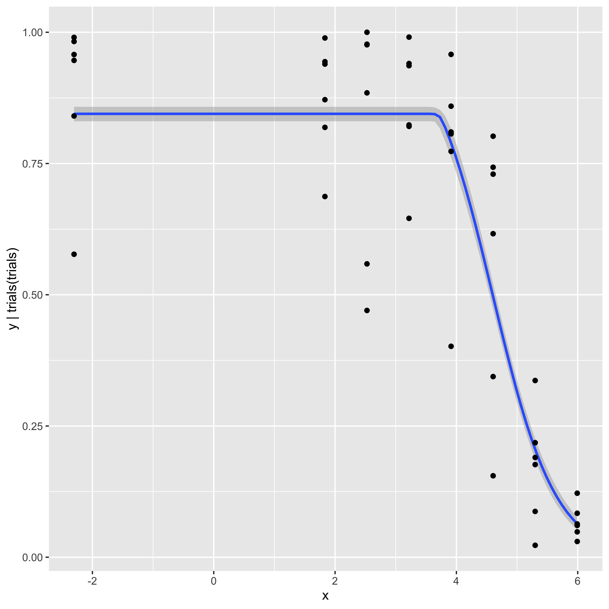

This model fit doesn't look great. You can see that the error bounds around the fit are far too narrow for this data, suggesting over dispersion of this model (meaning that the data are more variable than this model fit predicts). An estimate of dispersion is provided by `bayesnec`, and this can be extracted using `exp_1$dispersion`. Values >1 indicate overdispersion and values <1 indicate underdispersion. In this case the overdispersion value is much bigger than 1, suggesting extreme overdispersion (meaning our model doesn't properly capture the true variability represented in this data). We would need to consider alternative ways of modelling this data using a different distribution, such as the Beta-Binomial.


```r
exp_1$dispersion
#> Estimate     Q2.5    Q97.5 
#> 19.51379 13.07776 30.61626
```

### Beta-Binomial

The Beta-Binomial model can be useful for overdispersed Binomial data.


```r
set.seed(333)
exp_1b <- bnec(data = binom_data, x_var = "log_x",
               y_var = "suc", model = "neclin",
               family = beta_binomial2,
               trials_var = "tot")
#> 
#> SAMPLING FOR MODEL 'dbe470e6d8427b0eb0462767407ead75' NOW (CHAIN 1).
#> Chain 1: 
#> Chain 1: Gradient evaluation took 6.2e-05 seconds
#> Chain 1: 1000 transitions using 10 leapfrog steps per transition would take 0.62 seconds.
#> Chain 1: Adjust your expectations accordingly!
#> Chain 1: 
#> Chain 1: 
#> Chain 1: Iteration:    1 / 10000 [  0%]  (Warmup)
#> Chain 1: Iteration: 1000 / 10000 [ 10%]  (Warmup)
#> Chain 1: Iteration: 2000 / 10000 [ 20%]  (Warmup)
#> Chain 1: Iteration: 3000 / 10000 [ 30%]  (Warmup)
#> Chain 1: Iteration: 4000 / 10000 [ 40%]  (Warmup)
#> Chain 1: Iteration: 5000 / 10000 [ 50%]  (Warmup)
#> Chain 1: Iteration: 6000 / 10000 [ 60%]  (Warmup)
#> Chain 1: Iteration: 7000 / 10000 [ 70%]  (Warmup)
#> Chain 1: Iteration: 8000 / 10000 [ 80%]  (Warmup)
#> Chain 1: Iteration: 9000 / 10000 [ 90%]  (Warmup)
#> Chain 1: Iteration: 9001 / 10000 [ 90%]  (Sampling)
#> Chain 1: Iteration: 10000 / 10000 [100%]  (Sampling)
#> Chain 1: 
#> Chain 1:  Elapsed Time: 3.36142 seconds (Warm-up)
#> Chain 1:                0.413773 seconds (Sampling)
#> Chain 1:                3.7752 seconds (Total)
#> Chain 1: 
#> 
#> SAMPLING FOR MODEL 'dbe470e6d8427b0eb0462767407ead75' NOW (CHAIN 2).
#> Chain 2: 
#> Chain 2: Gradient evaluation took 4e-05 seconds
#> Chain 2: 1000 transitions using 10 leapfrog steps per transition would take 0.4 seconds.
#> Chain 2: Adjust your expectations accordingly!
#> Chain 2: 
#> Chain 2: 
#> Chain 2: Iteration:    1 / 10000 [  0%]  (Warmup)
#> Chain 2: Iteration: 1000 / 10000 [ 10%]  (Warmup)
#> Chain 2: Iteration: 2000 / 10000 [ 20%]  (Warmup)
#> Chain 2: Iteration: 3000 / 10000 [ 30%]  (Warmup)
#> Chain 2: Iteration: 4000 / 10000 [ 40%]  (Warmup)
#> Chain 2: Iteration: 5000 / 10000 [ 50%]  (Warmup)
#> Chain 2: Iteration: 6000 / 10000 [ 60%]  (Warmup)
#> Chain 2: Iteration: 7000 / 10000 [ 70%]  (Warmup)
#> Chain 2: Iteration: 8000 / 10000 [ 80%]  (Warmup)
#> Chain 2: Iteration: 9000 / 10000 [ 90%]  (Warmup)
#> Chain 2: Iteration: 9001 / 10000 [ 90%]  (Sampling)
#> Chain 2: Iteration: 10000 / 10000 [100%]  (Sampling)
#> Chain 2: 
#> Chain 2:  Elapsed Time: 3.3744 seconds (Warm-up)
#> Chain 2:                0.451995 seconds (Sampling)
#> Chain 2:                3.8264 seconds (Total)
#> Chain 2: 
#> 
#> SAMPLING FOR MODEL 'dbe470e6d8427b0eb0462767407ead75' NOW (CHAIN 3).
#> Chain 3: 
#> Chain 3: Gradient evaluation took 3.9e-05 seconds
#> Chain 3: 1000 transitions using 10 leapfrog steps per transition would take 0.39 seconds.
#> Chain 3: Adjust your expectations accordingly!
#> Chain 3: 
#> Chain 3: 
#> Chain 3: Iteration:    1 / 10000 [  0%]  (Warmup)
#> Chain 3: Iteration: 1000 / 10000 [ 10%]  (Warmup)
#> Chain 3: Iteration: 2000 / 10000 [ 20%]  (Warmup)
#> Chain 3: Iteration: 3000 / 10000 [ 30%]  (Warmup)
#> Chain 3: Iteration: 4000 / 10000 [ 40%]  (Warmup)
#> Chain 3: Iteration: 5000 / 10000 [ 50%]  (Warmup)
#> Chain 3: Iteration: 6000 / 10000 [ 60%]  (Warmup)
#> Chain 3: Iteration: 7000 / 10000 [ 70%]  (Warmup)
#> Chain 3: Iteration: 8000 / 10000 [ 80%]  (Warmup)
#> Chain 3: Iteration: 9000 / 10000 [ 90%]  (Warmup)
#> Chain 3: Iteration: 9001 / 10000 [ 90%]  (Sampling)
#> Chain 3: Iteration: 10000 / 10000 [100%]  (Sampling)
#> Chain 3: 
#> Chain 3:  Elapsed Time: 3.39203 seconds (Warm-up)
#> Chain 3:                0.433083 seconds (Sampling)
#> Chain 3:                3.82511 seconds (Total)
#> Chain 3: 
#> 
#> SAMPLING FOR MODEL 'dbe470e6d8427b0eb0462767407ead75' NOW (CHAIN 4).
#> Chain 4: 
#> Chain 4: Gradient evaluation took 3.7e-05 seconds
#> Chain 4: 1000 transitions using 10 leapfrog steps per transition would take 0.37 seconds.
#> Chain 4: Adjust your expectations accordingly!
#> Chain 4: 
#> Chain 4: 
#> Chain 4: Iteration:    1 / 10000 [  0%]  (Warmup)
#> Chain 4: Iteration: 1000 / 10000 [ 10%]  (Warmup)
#> Chain 4: Iteration: 2000 / 10000 [ 20%]  (Warmup)
#> Chain 4: Iteration: 3000 / 10000 [ 30%]  (Warmup)
#> Chain 4: Iteration: 4000 / 10000 [ 40%]  (Warmup)
#> Chain 4: Iteration: 5000 / 10000 [ 50%]  (Warmup)
#> Chain 4: Iteration: 6000 / 10000 [ 60%]  (Warmup)
#> Chain 4: Iteration: 7000 / 10000 [ 70%]  (Warmup)
#> Chain 4: Iteration: 8000 / 10000 [ 80%]  (Warmup)
#> Chain 4: Iteration: 9000 / 10000 [ 90%]  (Warmup)
#> Chain 4: Iteration: 9001 / 10000 [ 90%]  (Sampling)
#> Chain 4: Iteration: 10000 / 10000 [100%]  (Sampling)
#> Chain 4: 
#> Chain 4:  Elapsed Time: 3.3576 seconds (Warm-up)
#> Chain 4:                0.460912 seconds (Sampling)
#> Chain 4:                3.81851 seconds (Total)
#> Chain 4:
```
Fitting this data with the betabinomial2 yields a much more realistic fit in terms of the confidence bounds and the spread in the data. Note that a dispersion estimate is not provided here, as overdispersion is only relevant for Poisson and Binomial data.


```r
plot(exp_1b, lxform = exp)
```

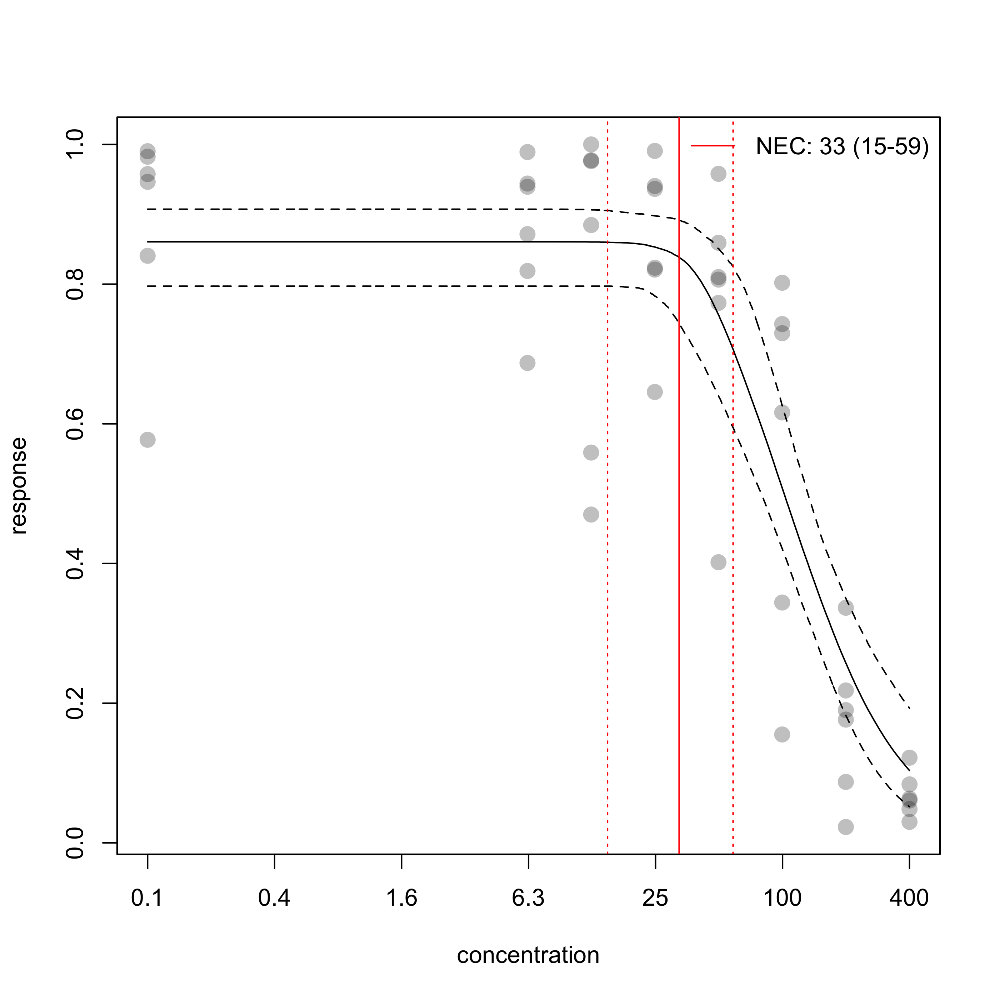

```r
exp_1b$dispersion
#> [1] NA NA NA
```


Now we have a good fit to these data, we can interpret the results. The estimated *NEC* value can be obtained directly from the fitted model object, using `exp_1b$nec`, or we can plot the posterior distribution of the *NEC* values.
 

```r
exp_1b$nec
#> Estimate     Q2.5    Q97.5 
#> 3.483277 2.703967 4.070901
hist(exp_1b$nec_posterior)
```

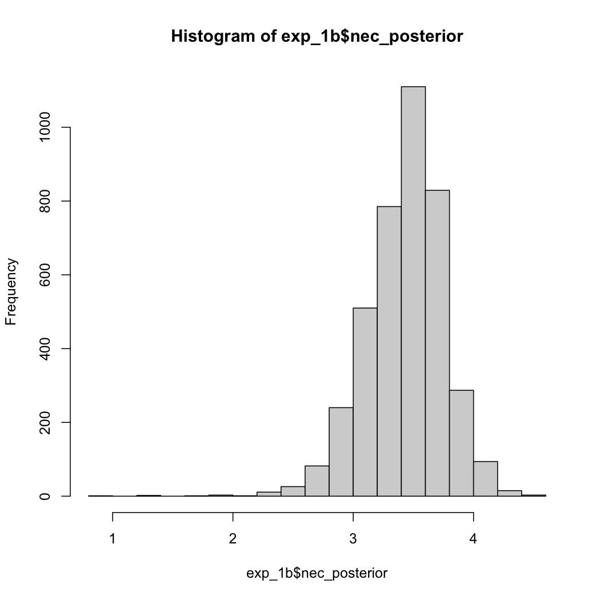

EC*x* estimates can also be obtained from the *NEC* model fit, using the function `ecx`. Note these may differ from a typical 4-parameter non-linear model, as the *NEC* model is a broken stick non-linear regression and will often fall more sharply than a smooth 4-parameter non-linear curve. See both the [Model details][e2b] and [Comparing posterior predictions][e4] vignettes for more information.


```r
ecx(exp_1b)
#>   ec_10_Q50  ec_10_Q2.5 ec_10_Q97.5 
#>    3.849458    3.301503    4.314389 
#> attr(,"precision")
#> [1] 1000
```

A summary method has also been developed for `bayesnecfit` objects that gives an overall summary of the model statistics, which also include the estimate for **NEC**, as the nec_intercept population level effect in the model.


```r
summary(exp_1b)
#> Object of class bayesnecfit containing the following non-linear model: neclin
#> 
#>  Family: beta_binomial2 
#>   Links: mu = logit; phi = identity 
#> Formula: y | trials(trials) ~ top - exp(slope) * (x - nec) * step(x - nec) 
#>          top ~ 1
#>          slope ~ 1
#>          nec ~ 1
#>    Data: structure(list(x = c(-2.30258509299405, -2.3025850 (Number of observations: 48) 
#> Samples: 4 chains, each with iter = 10000; warmup = 9000; thin = 1;
#>          total post-warmup samples = 4000
#> 
#> Population-Level Effects: 
#>                 Estimate Est.Error l-95% CI u-95% CI Rhat Bulk_ESS Tail_ESS
#> top_Intercept       1.82      0.23     1.37     2.28 1.00     1665     1908
#> slope_Intercept     0.46      0.18     0.07     0.80 1.00     1836     1954
#> nec_Intercept       3.48      0.31     2.70     4.07 1.00     1735     1590
#> 
#> Family Specific Parameters: 
#>     Estimate Est.Error l-95% CI u-95% CI Rhat Bulk_ESS Tail_ESS
#> phi     5.78      1.34     3.65     8.90 1.00     1786     2248
#> 
#> Samples were drawn using sampling(NUTS). For each parameter, Bulk_ESS
#> and Tail_ESS are effective sample size measures, and Rhat is the potential
#> scale reduction factor on split chains (at convergence, Rhat = 1).
```

### Beta data

Sometimes the response variable is distributed between `0` and `1` but is not a straight-forward Binomial. A common example in coral ecology is maximum quantum yield (the proportion of light used for photosynthesis when all reaction centres are open) which is a measure of photosynthetic efficiency calculated from PAM data. Here we have a proportion value that is not based on trials and successes. In this case there are no theoretical 'trials' and the data must be modelled using a beta distribution.


```r
prop_data <- "https://pastebin.com/raw/123jq46d" %>%
  read.table(header = TRUE, dec = ",", stringsAsFactors = FALSE) %>%
  dplyr::rename(raw_x = raw.x) %>%
  dplyr::mutate(raw_x = log(as.numeric(as.character(raw_x)) + 1),
                resp = as.numeric(as.character(resp)))

set.seed(333)
exp_2 <- bnec(data = prop_data, x_var = "raw_x",
              y_var = "resp", model = "neclin")
#> 
#> SAMPLING FOR MODEL '8bac138c9ef2061a5ea735609fd6ea64' NOW (CHAIN 1).
#> Chain 1: 
#> Chain 1: Gradient evaluation took 0.000101 seconds
#> Chain 1: 1000 transitions using 10 leapfrog steps per transition would take 1.01 seconds.
#> Chain 1: Adjust your expectations accordingly!
#> Chain 1: 
#> Chain 1: 
#> Chain 1: Iteration:    1 / 10000 [  0%]  (Warmup)
#> Chain 1: Iteration: 1000 / 10000 [ 10%]  (Warmup)
#> Chain 1: Iteration: 2000 / 10000 [ 20%]  (Warmup)
#> Chain 1: Iteration: 3000 / 10000 [ 30%]  (Warmup)
#> Chain 1: Iteration: 4000 / 10000 [ 40%]  (Warmup)
#> Chain 1: Iteration: 5000 / 10000 [ 50%]  (Warmup)
#> Chain 1: Iteration: 6000 / 10000 [ 60%]  (Warmup)
#> Chain 1: Iteration: 7000 / 10000 [ 70%]  (Warmup)
#> Chain 1: Iteration: 8000 / 10000 [ 80%]  (Warmup)
#> Chain 1: Iteration: 9000 / 10000 [ 90%]  (Warmup)
#> Chain 1: Iteration: 9001 / 10000 [ 90%]  (Sampling)
#> Chain 1: Iteration: 10000 / 10000 [100%]  (Sampling)
#> Chain 1: 
#> Chain 1:  Elapsed Time: 6.27707 seconds (Warm-up)
#> Chain 1:                0.85706 seconds (Sampling)
#> Chain 1:                7.13413 seconds (Total)
#> Chain 1: 
#> 
#> SAMPLING FOR MODEL '8bac138c9ef2061a5ea735609fd6ea64' NOW (CHAIN 2).
#> Chain 2: 
#> Chain 2: Gradient evaluation took 5.9e-05 seconds
#> Chain 2: 1000 transitions using 10 leapfrog steps per transition would take 0.59 seconds.
#> Chain 2: Adjust your expectations accordingly!
#> Chain 2: 
#> Chain 2: 
#> Chain 2: Iteration:    1 / 10000 [  0%]  (Warmup)
#> Chain 2: Iteration: 1000 / 10000 [ 10%]  (Warmup)
#> Chain 2: Iteration: 2000 / 10000 [ 20%]  (Warmup)
#> Chain 2: Iteration: 3000 / 10000 [ 30%]  (Warmup)
#> Chain 2: Iteration: 4000 / 10000 [ 40%]  (Warmup)
#> Chain 2: Iteration: 5000 / 10000 [ 50%]  (Warmup)
#> Chain 2: Iteration: 6000 / 10000 [ 60%]  (Warmup)
#> Chain 2: Iteration: 7000 / 10000 [ 70%]  (Warmup)
#> Chain 2: Iteration: 8000 / 10000 [ 80%]  (Warmup)
#> Chain 2: Iteration: 9000 / 10000 [ 90%]  (Warmup)
#> Chain 2: Iteration: 9001 / 10000 [ 90%]  (Sampling)
#> Chain 2: Iteration: 10000 / 10000 [100%]  (Sampling)
#> Chain 2: 
#> Chain 2:  Elapsed Time: 6.07363 seconds (Warm-up)
#> Chain 2:                0.941764 seconds (Sampling)
#> Chain 2:                7.01539 seconds (Total)
#> Chain 2: 
#> 
#> SAMPLING FOR MODEL '8bac138c9ef2061a5ea735609fd6ea64' NOW (CHAIN 3).
#> Chain 3: 
#> Chain 3: Gradient evaluation took 5.7e-05 seconds
#> Chain 3: 1000 transitions using 10 leapfrog steps per transition would take 0.57 seconds.
#> Chain 3: Adjust your expectations accordingly!
#> Chain 3: 
#> Chain 3: 
#> Chain 3: Iteration:    1 / 10000 [  0%]  (Warmup)
#> Chain 3: Iteration: 1000 / 10000 [ 10%]  (Warmup)
#> Chain 3: Iteration: 2000 / 10000 [ 20%]  (Warmup)
#> Chain 3: Iteration: 3000 / 10000 [ 30%]  (Warmup)
#> Chain 3: Iteration: 4000 / 10000 [ 40%]  (Warmup)
#> Chain 3: Iteration: 5000 / 10000 [ 50%]  (Warmup)
#> Chain 3: Iteration: 6000 / 10000 [ 60%]  (Warmup)
#> Chain 3: Iteration: 7000 / 10000 [ 70%]  (Warmup)
#> Chain 3: Iteration: 8000 / 10000 [ 80%]  (Warmup)
#> Chain 3: Iteration: 9000 / 10000 [ 90%]  (Warmup)
#> Chain 3: Iteration: 9001 / 10000 [ 90%]  (Sampling)
#> Chain 3: Iteration: 10000 / 10000 [100%]  (Sampling)
#> Chain 3: 
#> Chain 3:  Elapsed Time: 5.95139 seconds (Warm-up)
#> Chain 3:                0.876905 seconds (Sampling)
#> Chain 3:                6.82829 seconds (Total)
#> Chain 3: 
#> 
#> SAMPLING FOR MODEL '8bac138c9ef2061a5ea735609fd6ea64' NOW (CHAIN 4).
#> Chain 4: 
#> Chain 4: Gradient evaluation took 6.6e-05 seconds
#> Chain 4: 1000 transitions using 10 leapfrog steps per transition would take 0.66 seconds.
#> Chain 4: Adjust your expectations accordingly!
#> Chain 4: 
#> Chain 4: 
#> Chain 4: Iteration:    1 / 10000 [  0%]  (Warmup)
#> Chain 4: Iteration: 1000 / 10000 [ 10%]  (Warmup)
#> Chain 4: Iteration: 2000 / 10000 [ 20%]  (Warmup)
#> Chain 4: Iteration: 3000 / 10000 [ 30%]  (Warmup)
#> Chain 4: Iteration: 4000 / 10000 [ 40%]  (Warmup)
#> Chain 4: Iteration: 5000 / 10000 [ 50%]  (Warmup)
#> Chain 4: Iteration: 6000 / 10000 [ 60%]  (Warmup)
#> Chain 4: Iteration: 7000 / 10000 [ 70%]  (Warmup)
#> Chain 4: Iteration: 8000 / 10000 [ 80%]  (Warmup)
#> Chain 4: Iteration: 9000 / 10000 [ 90%]  (Warmup)
#> Chain 4: Iteration: 9001 / 10000 [ 90%]  (Sampling)
#> Chain 4: Iteration: 10000 / 10000 [100%]  (Sampling)
#> Chain 4: 
#> Chain 4:  Elapsed Time: 5.92945 seconds (Warm-up)
#> Chain 4:                0.802549 seconds (Sampling)
#> Chain 4:                6.732 seconds (Total)
#> Chain 4:
```


```r
plot(exp_2$fit)
```

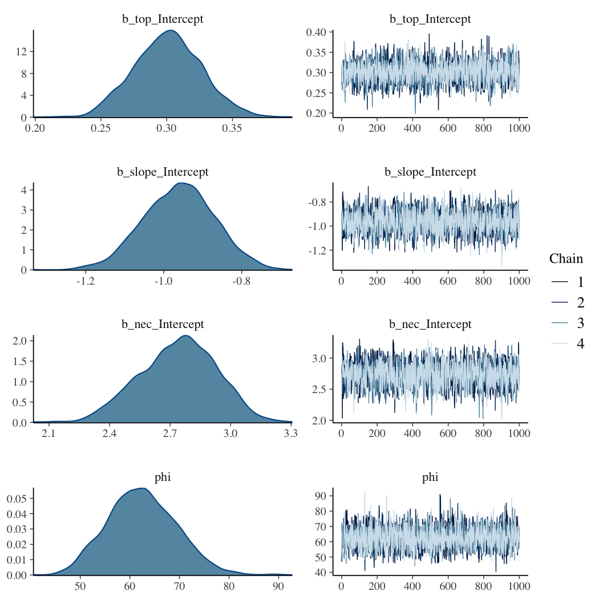


```r
plot(exp_2)
```

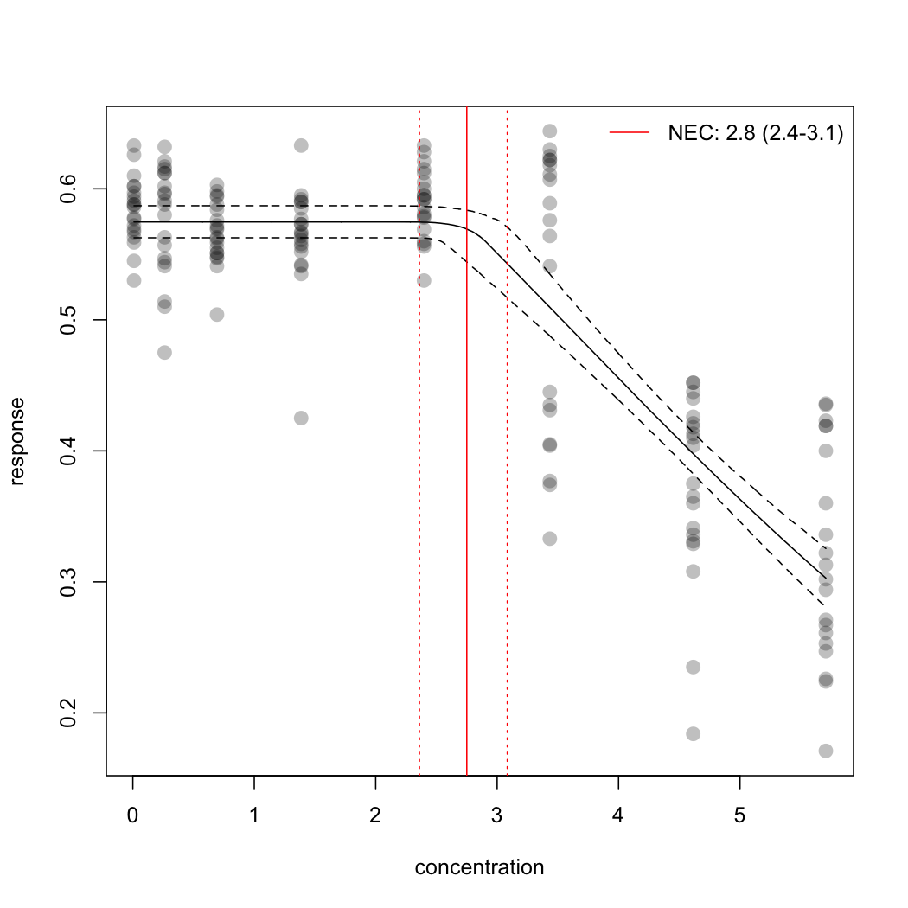

### Poisson data

Where data are a count (of, for example, individuals or cells) y is Poisson. Such data are distributed from `0` to `Inf` and are integers. First we read in the count data example from [pastebin](https://pastebin.com/tools), and then plot the "concentration" or x data, Again, this is `raw_x`, and distributed as in our binomial example above.


```r
count_data <- "https://pastebin.com/raw/ENgNSgf7" %>%
  read.table(header = TRUE, dec = ",", stringsAsFactors = FALSE) %>%
  dplyr::rename(raw_x = raw.x) %>%
  dplyr::mutate(raw_x = as.numeric(as.character(raw_x)),
                sqrt_x = sqrt(raw_x))

str(count_data)
#> 'data.frame':	48 obs. of  3 variables:
#>  $ raw_x : num  0.1 0.1 0.1 0.1 0.1 0.1 9.67 9.67 9.67 9.67 ...
#>  $ count : int  164 100 103 102 102 101 131 102 112 100 ...
#>  $ sqrt_x: num  0.316 0.316 0.316 0.316 0.316 ...
range(count_data$raw_x)
#> [1]   0.1 190.0

par(mfrow = c(1, 2))
hist(count_data$raw_x, xlab = "'x' variable", main = "")
hist(count_data$count, xlab = "Total counts", main = "")
```


First, we supply `bnec` with `data` (count_data), and specify `x_var` and `y_var`. As we have integers of 0 and greater, the  `family` is "poisson". The default behaviour to guess the variable types works for this example.


```r
set.seed(333)
exp_3 <- bnec(data = count_data, x_var = "sqrt_x",
              y_var = "count", model = "neclin")
#> 
#> SAMPLING FOR MODEL 'b0d7ff4a6b0c9747c0ef05a4b7e89ac8' NOW (CHAIN 1).
#> Chain 1: 
#> Chain 1: Gradient evaluation took 4.8e-05 seconds
#> Chain 1: 1000 transitions using 10 leapfrog steps per transition would take 0.48 seconds.
#> Chain 1: Adjust your expectations accordingly!
#> Chain 1: 
#> Chain 1: 
#> Chain 1: Iteration:    1 / 10000 [  0%]  (Warmup)
#> Chain 1: Iteration: 1000 / 10000 [ 10%]  (Warmup)
#> Chain 1: Iteration: 2000 / 10000 [ 20%]  (Warmup)
#> Chain 1: Iteration: 3000 / 10000 [ 30%]  (Warmup)
#> Chain 1: Iteration: 4000 / 10000 [ 40%]  (Warmup)
#> Chain 1: Iteration: 5000 / 10000 [ 50%]  (Warmup)
#> Chain 1: Iteration: 6000 / 10000 [ 60%]  (Warmup)
#> Chain 1: Iteration: 7000 / 10000 [ 70%]  (Warmup)
#> Chain 1: Iteration: 8000 / 10000 [ 80%]  (Warmup)
#> Chain 1: Iteration: 9000 / 10000 [ 90%]  (Warmup)
#> Chain 1: Iteration: 9001 / 10000 [ 90%]  (Sampling)
#> Chain 1: Iteration: 10000 / 10000 [100%]  (Sampling)
#> Chain 1: 
#> Chain 1:  Elapsed Time: 2.46017 seconds (Warm-up)
#> Chain 1:                0.335978 seconds (Sampling)
#> Chain 1:                2.79615 seconds (Total)
#> Chain 1: 
#> 
#> SAMPLING FOR MODEL 'b0d7ff4a6b0c9747c0ef05a4b7e89ac8' NOW (CHAIN 2).
#> Chain 2: 
#> Chain 2: Gradient evaluation took 1.8e-05 seconds
#> Chain 2: 1000 transitions using 10 leapfrog steps per transition would take 0.18 seconds.
#> Chain 2: Adjust your expectations accordingly!
#> Chain 2: 
#> Chain 2: 
#> Chain 2: Iteration:    1 / 10000 [  0%]  (Warmup)
#> Chain 2: Iteration: 1000 / 10000 [ 10%]  (Warmup)
#> Chain 2: Iteration: 2000 / 10000 [ 20%]  (Warmup)
#> Chain 2: Iteration: 3000 / 10000 [ 30%]  (Warmup)
#> Chain 2: Iteration: 4000 / 10000 [ 40%]  (Warmup)
#> Chain 2: Iteration: 5000 / 10000 [ 50%]  (Warmup)
#> Chain 2: Iteration: 6000 / 10000 [ 60%]  (Warmup)
#> Chain 2: Iteration: 7000 / 10000 [ 70%]  (Warmup)
#> Chain 2: Iteration: 8000 / 10000 [ 80%]  (Warmup)
#> Chain 2: Iteration: 9000 / 10000 [ 90%]  (Warmup)
#> Chain 2: Iteration: 9001 / 10000 [ 90%]  (Sampling)
#> Chain 2: Iteration: 10000 / 10000 [100%]  (Sampling)
#> Chain 2: 
#> Chain 2:  Elapsed Time: 2.96708 seconds (Warm-up)
#> Chain 2:                0.327268 seconds (Sampling)
#> Chain 2:                3.29435 seconds (Total)
#> Chain 2: 
#> 
#> SAMPLING FOR MODEL 'b0d7ff4a6b0c9747c0ef05a4b7e89ac8' NOW (CHAIN 3).
#> Chain 3: 
#> Chain 3: Gradient evaluation took 2.1e-05 seconds
#> Chain 3: 1000 transitions using 10 leapfrog steps per transition would take 0.21 seconds.
#> Chain 3: Adjust your expectations accordingly!
#> Chain 3: 
#> Chain 3: 
#> Chain 3: Iteration:    1 / 10000 [  0%]  (Warmup)
#> Chain 3: Iteration: 1000 / 10000 [ 10%]  (Warmup)
#> Chain 3: Iteration: 2000 / 10000 [ 20%]  (Warmup)
#> Chain 3: Iteration: 3000 / 10000 [ 30%]  (Warmup)
#> Chain 3: Iteration: 4000 / 10000 [ 40%]  (Warmup)
#> Chain 3: Iteration: 5000 / 10000 [ 50%]  (Warmup)
#> Chain 3: Iteration: 6000 / 10000 [ 60%]  (Warmup)
#> Chain 3: Iteration: 7000 / 10000 [ 70%]  (Warmup)
#> Chain 3: Iteration: 8000 / 10000 [ 80%]  (Warmup)
#> Chain 3: Iteration: 9000 / 10000 [ 90%]  (Warmup)
#> Chain 3: Iteration: 9001 / 10000 [ 90%]  (Sampling)
#> Chain 3: Iteration: 10000 / 10000 [100%]  (Sampling)
#> Chain 3: 
#> Chain 3:  Elapsed Time: 0.602879 seconds (Warm-up)
#> Chain 3:                0.077856 seconds (Sampling)
#> Chain 3:                0.680735 seconds (Total)
#> Chain 3: 
#> 
#> SAMPLING FOR MODEL 'b0d7ff4a6b0c9747c0ef05a4b7e89ac8' NOW (CHAIN 4).
#> Chain 4: 
#> Chain 4: Gradient evaluation took 1.9e-05 seconds
#> Chain 4: 1000 transitions using 10 leapfrog steps per transition would take 0.19 seconds.
#> Chain 4: Adjust your expectations accordingly!
#> Chain 4: 
#> Chain 4: 
#> Chain 4: Iteration:    1 / 10000 [  0%]  (Warmup)
#> Chain 4: Iteration: 1000 / 10000 [ 10%]  (Warmup)
#> Chain 4: Iteration: 2000 / 10000 [ 20%]  (Warmup)
#> Chain 4: Iteration: 3000 / 10000 [ 30%]  (Warmup)
#> Chain 4: Iteration: 4000 / 10000 [ 40%]  (Warmup)
#> Chain 4: Iteration: 5000 / 10000 [ 50%]  (Warmup)
#> Chain 4: Iteration: 6000 / 10000 [ 60%]  (Warmup)
#> Chain 4: Iteration: 7000 / 10000 [ 70%]  (Warmup)
#> Chain 4: Iteration: 8000 / 10000 [ 80%]  (Warmup)
#> Chain 4: Iteration: 9000 / 10000 [ 90%]  (Warmup)
#> Chain 4: Iteration: 9001 / 10000 [ 90%]  (Sampling)
#> Chain 4: Iteration: 10000 / 10000 [100%]  (Sampling)
#> Chain 4: 
#> Chain 4:  Elapsed Time: 0.987625 seconds (Warm-up)
#> Chain 4:                0.498165 seconds (Sampling)
#> Chain 4:                1.48579 seconds (Total)
#> Chain 4:
```

We first plot the model chains and parameter estimates to check the fit.


```r
plot(exp_3$fit)
```

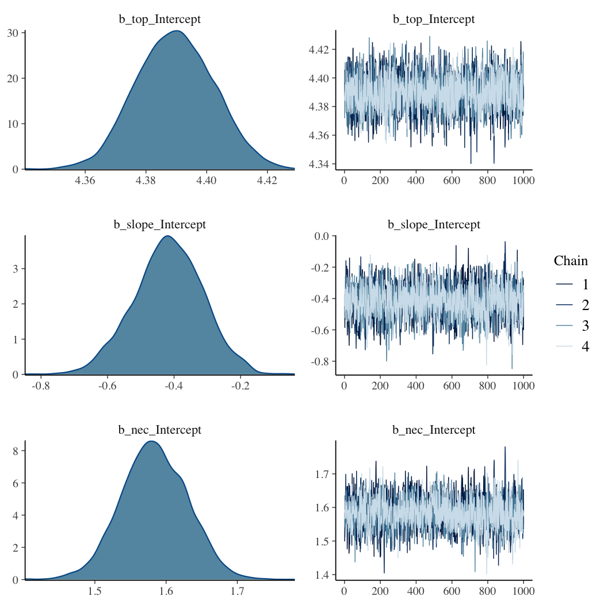


```r
plot(exp_3)
```

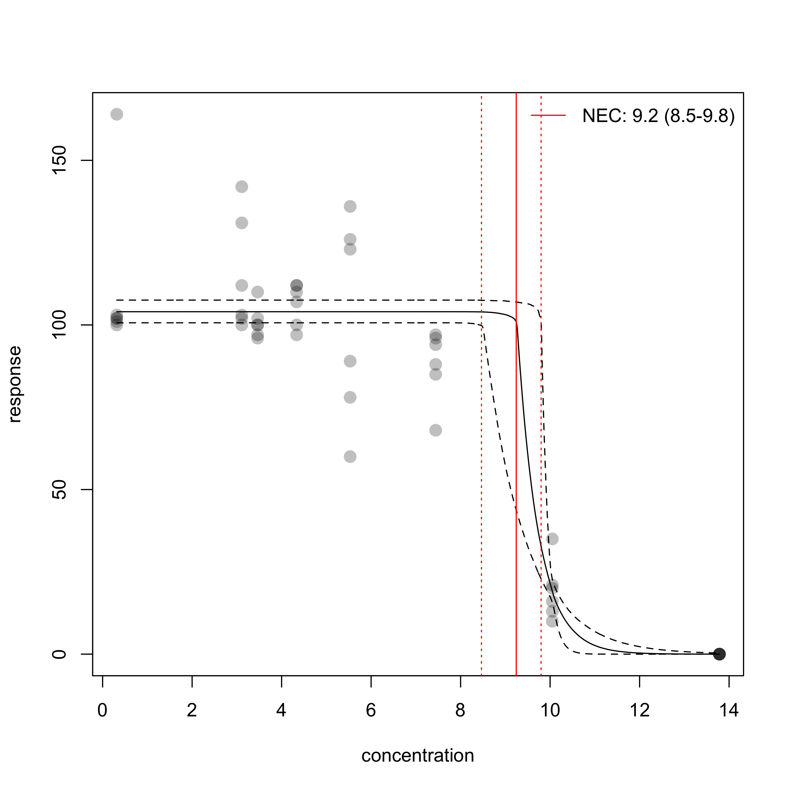

```r
exp_3$dispersion
#> Estimate     Q2.5    Q97.5 
#> 3.361285 1.991797 5.519465
```

The chains look ok; however, our plot of the fit is not very convincing. The error bars are very narrow, and this does not seem to be a particularly good model for these data. Note that the dispersion estimate is much greater than one, indicating serious overdispersion. In this case we can try a negative binomial family.

### Negative binomial

When count data are overdispersed and cannot be modelled using the poisson family, the negative binomial family is generally used. We can do this by calling `family = "negbinomial"`.


```r
set.seed(333)
exp_3b <- bnec(data = count_data, x_var = "sqrt_x",
              y_var = "count", family = "negbinomial", model = "neclin")
#> 
#> SAMPLING FOR MODEL 'b00819b13477ed73c05459704383ad86' NOW (CHAIN 1).
#> Chain 1: 
#> Chain 1: Gradient evaluation took 5.4e-05 seconds
#> Chain 1: 1000 transitions using 10 leapfrog steps per transition would take 0.54 seconds.
#> Chain 1: Adjust your expectations accordingly!
#> Chain 1: 
#> Chain 1: 
#> Chain 1: Iteration:    1 / 10000 [  0%]  (Warmup)
#> Chain 1: Iteration: 1000 / 10000 [ 10%]  (Warmup)
#> Chain 1: Iteration: 2000 / 10000 [ 20%]  (Warmup)
#> Chain 1: Iteration: 3000 / 10000 [ 30%]  (Warmup)
#> Chain 1: Iteration: 4000 / 10000 [ 40%]  (Warmup)
#> Chain 1: Iteration: 5000 / 10000 [ 50%]  (Warmup)
#> Chain 1: Iteration: 6000 / 10000 [ 60%]  (Warmup)
#> Chain 1: Iteration: 7000 / 10000 [ 70%]  (Warmup)
#> Chain 1: Iteration: 8000 / 10000 [ 80%]  (Warmup)
#> Chain 1: Iteration: 9000 / 10000 [ 90%]  (Warmup)
#> Chain 1: Iteration: 9001 / 10000 [ 90%]  (Sampling)
#> Chain 1: Iteration: 10000 / 10000 [100%]  (Sampling)
#> Chain 1: 
#> Chain 1:  Elapsed Time: 4.599 seconds (Warm-up)
#> Chain 1:                0.681803 seconds (Sampling)
#> Chain 1:                5.2808 seconds (Total)
#> Chain 1: 
#> 
#> SAMPLING FOR MODEL 'b00819b13477ed73c05459704383ad86' NOW (CHAIN 2).
#> Chain 2: 
#> Chain 2: Gradient evaluation took 2.5e-05 seconds
#> Chain 2: 1000 transitions using 10 leapfrog steps per transition would take 0.25 seconds.
#> Chain 2: Adjust your expectations accordingly!
#> Chain 2: 
#> Chain 2: 
#> Chain 2: Iteration:    1 / 10000 [  0%]  (Warmup)
#> Chain 2: Iteration: 1000 / 10000 [ 10%]  (Warmup)
#> Chain 2: Iteration: 2000 / 10000 [ 20%]  (Warmup)
#> Chain 2: Iteration: 3000 / 10000 [ 30%]  (Warmup)
#> Chain 2: Iteration: 4000 / 10000 [ 40%]  (Warmup)
#> Chain 2: Iteration: 5000 / 10000 [ 50%]  (Warmup)
#> Chain 2: Iteration: 6000 / 10000 [ 60%]  (Warmup)
#> Chain 2: Iteration: 7000 / 10000 [ 70%]  (Warmup)
#> Chain 2: Iteration: 8000 / 10000 [ 80%]  (Warmup)
#> Chain 2: Iteration: 9000 / 10000 [ 90%]  (Warmup)
#> Chain 2: Iteration: 9001 / 10000 [ 90%]  (Sampling)
#> Chain 2: Iteration: 10000 / 10000 [100%]  (Sampling)
#> Chain 2: 
#> Chain 2:  Elapsed Time: 4.8448 seconds (Warm-up)
#> Chain 2:                0.621595 seconds (Sampling)
#> Chain 2:                5.4664 seconds (Total)
#> Chain 2: 
#> 
#> SAMPLING FOR MODEL 'b00819b13477ed73c05459704383ad86' NOW (CHAIN 3).
#> Chain 3: 
#> Chain 3: Gradient evaluation took 2.9e-05 seconds
#> Chain 3: 1000 transitions using 10 leapfrog steps per transition would take 0.29 seconds.
#> Chain 3: Adjust your expectations accordingly!
#> Chain 3: 
#> Chain 3: 
#> Chain 3: Iteration:    1 / 10000 [  0%]  (Warmup)
#> Chain 3: Iteration: 1000 / 10000 [ 10%]  (Warmup)
#> Chain 3: Iteration: 2000 / 10000 [ 20%]  (Warmup)
#> Chain 3: Iteration: 3000 / 10000 [ 30%]  (Warmup)
#> Chain 3: Iteration: 4000 / 10000 [ 40%]  (Warmup)
#> Chain 3: Iteration: 5000 / 10000 [ 50%]  (Warmup)
#> Chain 3: Iteration: 6000 / 10000 [ 60%]  (Warmup)
#> Chain 3: Iteration: 7000 / 10000 [ 70%]  (Warmup)
#> Chain 3: Iteration: 8000 / 10000 [ 80%]  (Warmup)
#> Chain 3: Iteration: 9000 / 10000 [ 90%]  (Warmup)
#> Chain 3: Iteration: 9001 / 10000 [ 90%]  (Sampling)
#> Chain 3: Iteration: 10000 / 10000 [100%]  (Sampling)
#> Chain 3: 
#> Chain 3:  Elapsed Time: 4.88644 seconds (Warm-up)
#> Chain 3:                0.691177 seconds (Sampling)
#> Chain 3:                5.57761 seconds (Total)
#> Chain 3: 
#> 
#> SAMPLING FOR MODEL 'b00819b13477ed73c05459704383ad86' NOW (CHAIN 4).
#> Chain 4: 
#> Chain 4: Gradient evaluation took 2.9e-05 seconds
#> Chain 4: 1000 transitions using 10 leapfrog steps per transition would take 0.29 seconds.
#> Chain 4: Adjust your expectations accordingly!
#> Chain 4: 
#> Chain 4: 
#> Chain 4: Iteration:    1 / 10000 [  0%]  (Warmup)
#> Chain 4: Iteration: 1000 / 10000 [ 10%]  (Warmup)
#> Chain 4: Iteration: 2000 / 10000 [ 20%]  (Warmup)
#> Chain 4: Iteration: 3000 / 10000 [ 30%]  (Warmup)
#> Chain 4: Iteration: 4000 / 10000 [ 40%]  (Warmup)
#> Chain 4: Iteration: 5000 / 10000 [ 50%]  (Warmup)
#> Chain 4: Iteration: 6000 / 10000 [ 60%]  (Warmup)
#> Chain 4: Iteration: 7000 / 10000 [ 70%]  (Warmup)
#> Chain 4: Iteration: 8000 / 10000 [ 80%]  (Warmup)
#> Chain 4: Iteration: 9000 / 10000 [ 90%]  (Warmup)
#> Chain 4: Iteration: 9001 / 10000 [ 90%]  (Sampling)
#> Chain 4: Iteration: 10000 / 10000 [100%]  (Sampling)
#> Chain 4: 
#> Chain 4:  Elapsed Time: 4.81602 seconds (Warm-up)
#> Chain 4:                0.548506 seconds (Sampling)
#> Chain 4:                5.36452 seconds (Total)
#> Chain 4:
```

The resultant plot seems to indicate the negative binomial family works better in terms of dispersion (more sensible wider confidence bands) however it still does not seem to be a good model for these data. See the [Model details][e2b] and [Multi model usage][e2] vignettes for options to fit other models to these data.


```r
plot(exp_3b)
```

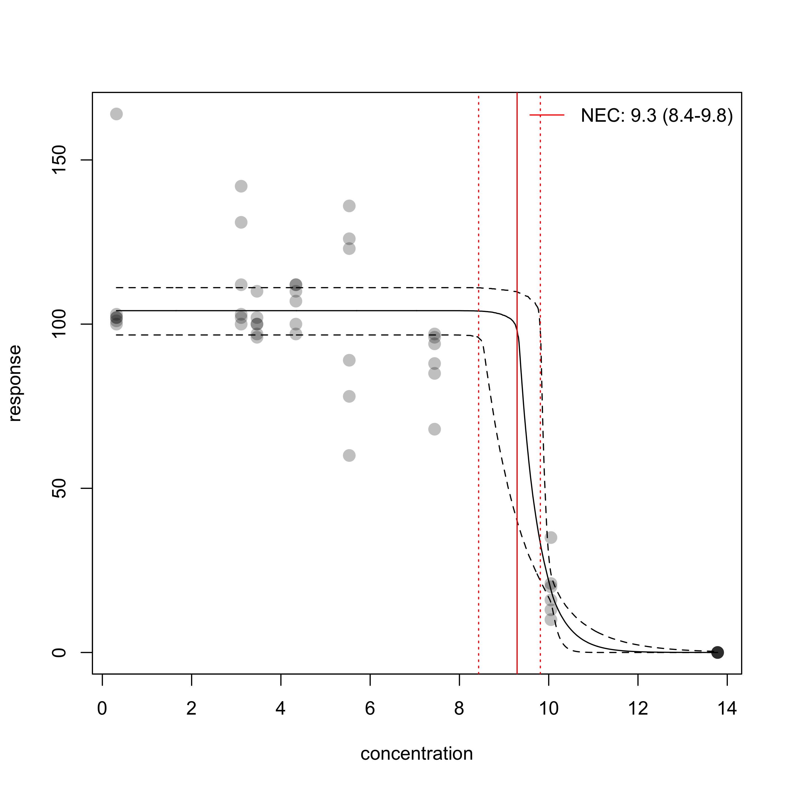


```r
plot(exp_3b$fit)
```

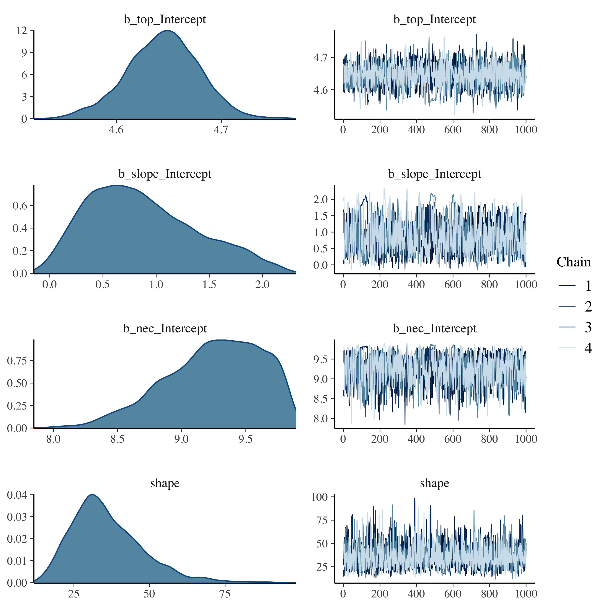

### Measure data

Where data are a measured variable y is family gamma. Good examples of `gamma` distributed data include measures of body size, such as length, weight, or area. Such data are distributed from `0+` to `Inf` and are continuous. Here we use the nec_data supplied with `bayesnec` with y on the exponential scale to ensure the right data range for a gamma as an example.


```r
data(nec_data)
measure_data <- nec_data %>%
  dplyr::mutate(measure = exp(y))
```


```r
set.seed(333)
exp_4 <- bnec(data = measure_data, x_var = "x",
              y_var = "measure", model = "neclin")
#> 
#> SAMPLING FOR MODEL '66a3c69058cc57a98f33c1c6d389c60a' NOW (CHAIN 1).
#> Chain 1: 
#> Chain 1: Gradient evaluation took 6.2e-05 seconds
#> Chain 1: 1000 transitions using 10 leapfrog steps per transition would take 0.62 seconds.
#> Chain 1: Adjust your expectations accordingly!
#> Chain 1: 
#> Chain 1: 
#> Chain 1: Iteration:    1 / 10000 [  0%]  (Warmup)
#> Chain 1: Iteration: 1000 / 10000 [ 10%]  (Warmup)
#> Chain 1: Iteration: 2000 / 10000 [ 20%]  (Warmup)
#> Chain 1: Iteration: 3000 / 10000 [ 30%]  (Warmup)
#> Chain 1: Iteration: 4000 / 10000 [ 40%]  (Warmup)
#> Chain 1: Iteration: 5000 / 10000 [ 50%]  (Warmup)
#> Chain 1: Iteration: 6000 / 10000 [ 60%]  (Warmup)
#> Chain 1: Iteration: 7000 / 10000 [ 70%]  (Warmup)
#> Chain 1: Iteration: 8000 / 10000 [ 80%]  (Warmup)
#> Chain 1: Iteration: 9000 / 10000 [ 90%]  (Warmup)
#> Chain 1: Iteration: 9001 / 10000 [ 90%]  (Sampling)
#> Chain 1: Iteration: 10000 / 10000 [100%]  (Sampling)
#> Chain 1: 
#> Chain 1:  Elapsed Time: 1.68346 seconds (Warm-up)
#> Chain 1:                0.253453 seconds (Sampling)
#> Chain 1:                1.93692 seconds (Total)
#> Chain 1: 
#> 
#> SAMPLING FOR MODEL '66a3c69058cc57a98f33c1c6d389c60a' NOW (CHAIN 2).
#> Chain 2: 
#> Chain 2: Gradient evaluation took 3.2e-05 seconds
#> Chain 2: 1000 transitions using 10 leapfrog steps per transition would take 0.32 seconds.
#> Chain 2: Adjust your expectations accordingly!
#> Chain 2: 
#> Chain 2: 
#> Chain 2: Iteration:    1 / 10000 [  0%]  (Warmup)
#> Chain 2: Iteration: 1000 / 10000 [ 10%]  (Warmup)
#> Chain 2: Iteration: 2000 / 10000 [ 20%]  (Warmup)
#> Chain 2: Iteration: 3000 / 10000 [ 30%]  (Warmup)
#> Chain 2: Iteration: 4000 / 10000 [ 40%]  (Warmup)
#> Chain 2: Iteration: 5000 / 10000 [ 50%]  (Warmup)
#> Chain 2: Iteration: 6000 / 10000 [ 60%]  (Warmup)
#> Chain 2: Iteration: 7000 / 10000 [ 70%]  (Warmup)
#> Chain 2: Iteration: 8000 / 10000 [ 80%]  (Warmup)
#> Chain 2: Iteration: 9000 / 10000 [ 90%]  (Warmup)
#> Chain 2: Iteration: 9001 / 10000 [ 90%]  (Sampling)
#> Chain 2: Iteration: 10000 / 10000 [100%]  (Sampling)
#> Chain 2: 
#> Chain 2:  Elapsed Time: 1.68701 seconds (Warm-up)
#> Chain 2:                0.251297 seconds (Sampling)
#> Chain 2:                1.9383 seconds (Total)
#> Chain 2: 
#> 
#> SAMPLING FOR MODEL '66a3c69058cc57a98f33c1c6d389c60a' NOW (CHAIN 3).
#> Chain 3: 
#> Chain 3: Gradient evaluation took 3e-05 seconds
#> Chain 3: 1000 transitions using 10 leapfrog steps per transition would take 0.3 seconds.
#> Chain 3: Adjust your expectations accordingly!
#> Chain 3: 
#> Chain 3: 
#> Chain 3: Iteration:    1 / 10000 [  0%]  (Warmup)
#> Chain 3: Iteration: 1000 / 10000 [ 10%]  (Warmup)
#> Chain 3: Iteration: 2000 / 10000 [ 20%]  (Warmup)
#> Chain 3: Iteration: 3000 / 10000 [ 30%]  (Warmup)
#> Chain 3: Iteration: 4000 / 10000 [ 40%]  (Warmup)
#> Chain 3: Iteration: 5000 / 10000 [ 50%]  (Warmup)
#> Chain 3: Iteration: 6000 / 10000 [ 60%]  (Warmup)
#> Chain 3: Iteration: 7000 / 10000 [ 70%]  (Warmup)
#> Chain 3: Iteration: 8000 / 10000 [ 80%]  (Warmup)
#> Chain 3: Iteration: 9000 / 10000 [ 90%]  (Warmup)
#> Chain 3: Iteration: 9001 / 10000 [ 90%]  (Sampling)
#> Chain 3: Iteration: 10000 / 10000 [100%]  (Sampling)
#> Chain 3: 
#> Chain 3:  Elapsed Time: 1.65836 seconds (Warm-up)
#> Chain 3:                0.243536 seconds (Sampling)
#> Chain 3:                1.9019 seconds (Total)
#> Chain 3: 
#> 
#> SAMPLING FOR MODEL '66a3c69058cc57a98f33c1c6d389c60a' NOW (CHAIN 4).
#> Chain 4: 
#> Chain 4: Gradient evaluation took 3.1e-05 seconds
#> Chain 4: 1000 transitions using 10 leapfrog steps per transition would take 0.31 seconds.
#> Chain 4: Adjust your expectations accordingly!
#> Chain 4: 
#> Chain 4: 
#> Chain 4: Iteration:    1 / 10000 [  0%]  (Warmup)
#> Chain 4: Iteration: 1000 / 10000 [ 10%]  (Warmup)
#> Chain 4: Iteration: 2000 / 10000 [ 20%]  (Warmup)
#> Chain 4: Iteration: 3000 / 10000 [ 30%]  (Warmup)
#> Chain 4: Iteration: 4000 / 10000 [ 40%]  (Warmup)
#> Chain 4: Iteration: 5000 / 10000 [ 50%]  (Warmup)
#> Chain 4: Iteration: 6000 / 10000 [ 60%]  (Warmup)
#> Chain 4: Iteration: 7000 / 10000 [ 70%]  (Warmup)
#> Chain 4: Iteration: 8000 / 10000 [ 80%]  (Warmup)
#> Chain 4: Iteration: 9000 / 10000 [ 90%]  (Warmup)
#> Chain 4: Iteration: 9001 / 10000 [ 90%]  (Sampling)
#> Chain 4: Iteration: 10000 / 10000 [100%]  (Sampling)
#> Chain 4: 
#> Chain 4:  Elapsed Time: 1.67697 seconds (Warm-up)
#> Chain 4:                0.240911 seconds (Sampling)
#> Chain 4:                1.91788 seconds (Total)
#> Chain 4:
```


```r
plot(exp_4$fit)
```

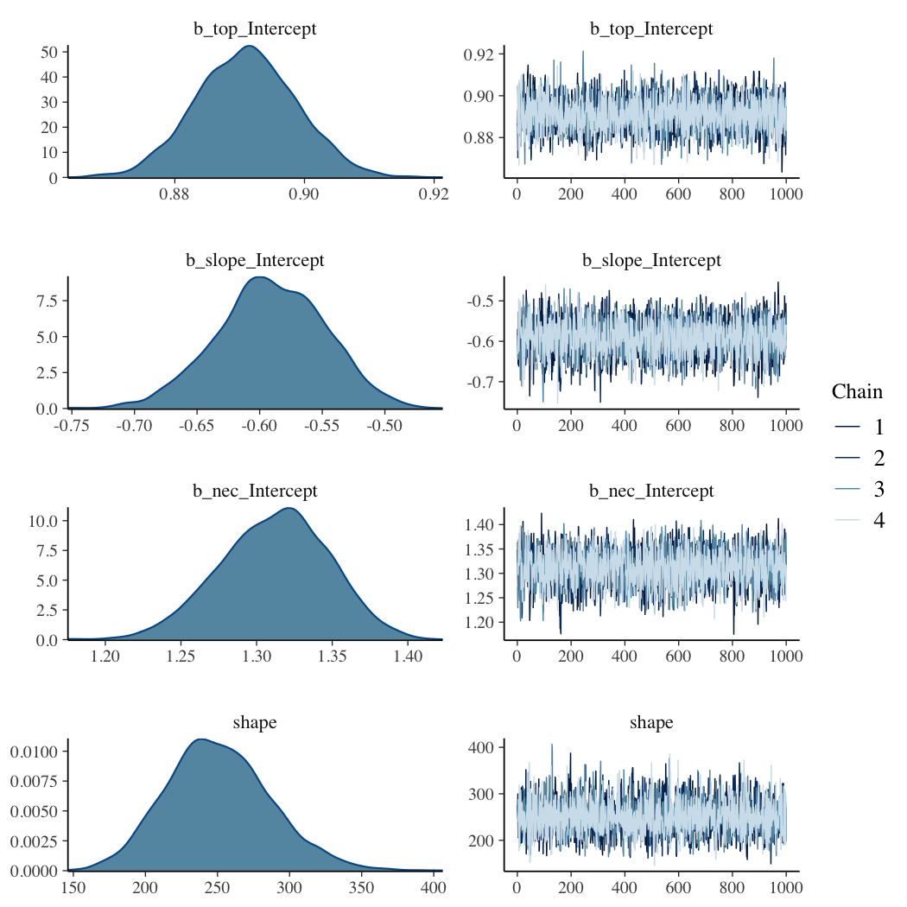


```r
plot(exp_4)
```

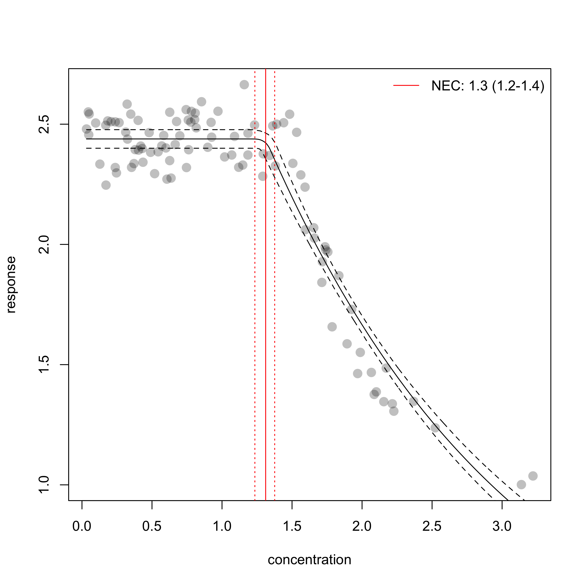

```r
summary(exp_4)
#> Object of class bayesnecfit containing the following non-linear model: neclin
#> 
#>  Family: gamma 
#>   Links: mu = log; shape = identity 
#> Formula: y ~ top - exp(slope) * (x - nec) * step(x - nec) 
#>          top ~ 1
#>          slope ~ 1
#>          nec ~ 1
#>    Data: structure(list(x = c(1.01874617094183, 0.815747457 (Number of observations: 100) 
#> Samples: 4 chains, each with iter = 10000; warmup = 9000; thin = 1;
#>          total post-warmup samples = 4000
#> 
#> Population-Level Effects: 
#>                 Estimate Est.Error l-95% CI u-95% CI Rhat Bulk_ESS Tail_ESS
#> top_Intercept       0.89      0.01     0.88     0.91 1.00     2491     2484
#> slope_Intercept    -0.59      0.04    -0.68    -0.51 1.00     2035     2325
#> nec_Intercept       1.31      0.04     1.23     1.38 1.00     1839     1992
#> 
#> Family Specific Parameters: 
#>       Estimate Est.Error l-95% CI u-95% CI Rhat Bulk_ESS Tail_ESS
#> shape   248.17     37.37   182.02   323.79 1.00     2846     2125
#> 
#> Samples were drawn using sampling(NUTS). For each parameter, Bulk_ESS
#> and Tail_ESS are effective sample size measures, and Rhat is the potential
#> scale reduction factor on split chains (at convergence, Rhat = 1).
```

In this case our model has converged well, although it is perhaps not the best model to fit. See the [Model details][e2b] and [Multi model usage][e2] vignettes for options to fit other models to these data.

# References
