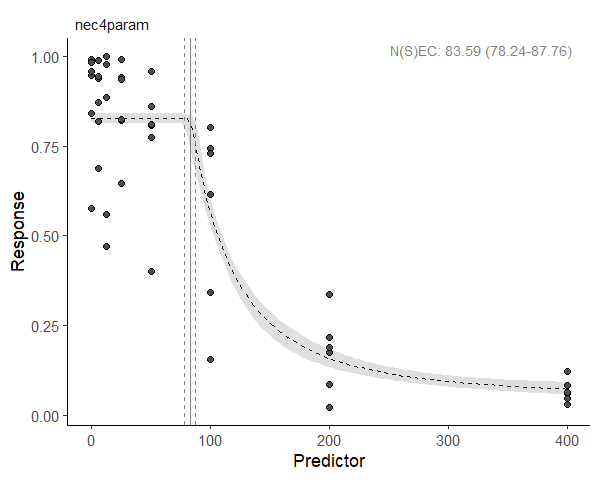
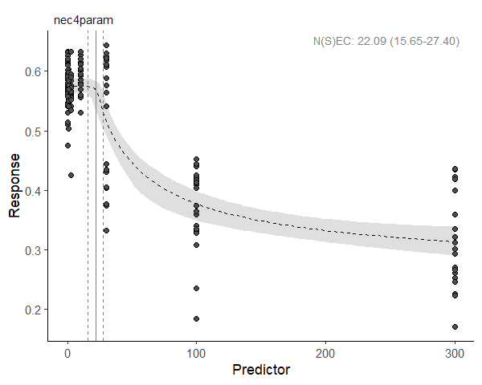
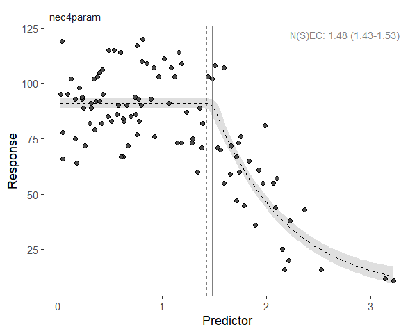
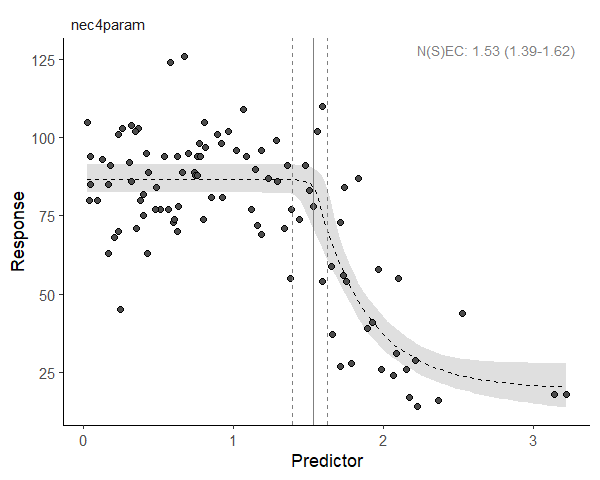
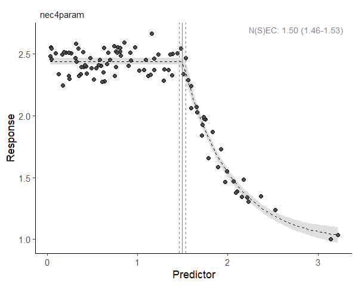

[e1]: https://open-aims.github.io/bayesnec/articles/example1.html
[e2]: https://open-aims.github.io/bayesnec/articles/example2.html
[e2b]: https://open-aims.github.io/bayesnec/articles/example2b.html
[e3]: https://open-aims.github.io/bayesnec/articles/example3.html
[e4]: https://open-aims.github.io/bayesnec/articles/example4.html

# `bayesnec`

The `bayesnec` is an R package to fit concentration(dose) — response curves to toxicity data, and derive No-Effect-Concentration (*NEC*), No-Significant-Effect-Concentration (*NSEC*), and Effect-Concentration (of specified percentage "x", *ECx*) thresholds from non-linear models fitted using Bayesian Hamiltonian Monte Carlo (HMC) via `brms` [@Burkner2017; @Burkner2018] and `stan`. The package is an adaptation and extension of an initial package `jagsNEC` [@Fisher2020] which was based on the `R2jags` package [@Su2015] and `jags` [@Plummer2003].

# Background

Bayesian model fitting can be difficult to automate across a broad range of usage cases, particularly with respect to specifying valid initial values and appropriate priors. This is one reason the use of Bayesian statistics for *NEC* estimation (or even *ECx* estimation) is not currently widely adopted across the broader ecotoxicological community, who rarely have access to specialist statistical expertise. The `bayesnec` package provides an accessible interface specifically for fitting *NEC* models and other concentration—response models using Bayesian methods. A range of models are specified based on the known distribution of the "concentration" or "dose" variable (the predictor) as well as the "response" variable. The package requires a simplified model formula, which together with the data is used to wrangle more complex non-linear model formula(s), as well as to generate priors and initial values required to call a `brms` model. While the distribution of the predictor and response variables can be specified directly, `bayesnec` will automatically attempt to assign the correct distribution to use based on the characteristics of the provided data.

This project started with an implementation of the *NEC* model based on that described in (Pires et al. 2002) and [@Fox2010] using R2jags [@Fisher2020]. The package has been further generalised to allow a large range of response variables to be modelled using the appropriate statistical distribution. While the original `jagsNEC` implementation supported Gaussian-, Poisson-, Binomial-, Gamma-, Negative Binomial- and Beta-distributed response data, `bayesnec` additionally supports the Beta-Binomial distribution, and can be easily extended to include any of the available `brms` families. We have since also further added a range of alternative *NEC* model types, as well as a range of  concentration—response models (such as 4-parameter logistic and Weibull models) that are commonly used in frequentist-based packages such as `drc`[@Ritz2016]. These models do not employ segmented linear regression (i.e., use of a `step` function) but simply models the response as a smooth function of concentration.

Specific models can be fit directly using `bnec`, which is what we discuss here. Alternatively, it is possible to fit a custom model set, a specific model set, or all the available models. Further information on fitting multi-models using `bayesnec` can be found in the [Multi model usage][e2] vignette. For detailed information on the models available in `bayesnec` see the [Model details][e2b] vignette.

Important information on the current package is contained in the `bayesnec` help-files and the [Model details][e2b] vignette.

This package is currently under development. We are keen to receive any feedback regarding usage, and especially bug reporting that includes an easy to run self-contained reproducible example of unexpected behaviour, or example model fits that fail to converge (have poor chain mixing) or yield other errors. Such information will hopefully help us towards building a more robust package. We cannot help troubleshoot issues if an easy-to-run reproducible example is not supplied.

# Installation

To install the latest release version from CRAN use


```r
install.packages("bayesnec")
```

The current development version can be downloaded from GitHub via


```r
if (!requireNamespace("remotes")) {
  install.packages("remotes")
}
remotes::install_github("open-aims/bayesnec", ref = "dev")
```

Because `bayesnec` is based on `brms` and [Stan](https://mc-stan.org/), a C++
compiler is required. The program
[Rtools](https://cran.r-project.org/bin/windows/Rtools/) comes with a C++
compiler for Windows. On Mac, you should install Xcode. See the prerequisites
section on this
[link](https://github.com/stan-dev/rstan/wiki/RStan-Getting-Started)
for further instructions on how to get the compilers running.

To run this vignette, we will also need some additional packages


```r
library(dplyr)
library(ggplot2)
library(tidyr)
```

# Examples

## Fitting the `nec4param` model using `bnec`

Here we include some examples showing how to use the package to fit an *NEC* model to binomial, proportional, count and continuous response data. The examples are those used at: <https://github.com/gerard-ricardo/NECs/blob/master/NECs>, but here we are showing how to fit models to these data using the `bayesnec` package. Note however, the default behaviour in `bayesnec` is to use the `"identity"` link because the native link functions for each family (e.g., `"logit"` for Binomial, `"log"` for Poisson) introduce non-linear transformation on formulas which are already non-linear. So please be aware that estimates of *NEC* or *ECx* might not be as expected when using link functions other than identity (see the [Model details][e2b] vignette for more information and the models available in `bayesnec`).

### Binomial data

The response variable is considered to follow a binomial distribution when it is a count out of a total (such as the percentage survival of individuals, for example). First, we read in the binomial example from [pastebin](https://pastebin.com/tools), prepare the data for analysis, and then inspect the dataset as well as the "concentration", in this case `raw_x`.


```r
binom_data <- "https://pastebin.com/raw/zfrUha88" %>%
  read.table(header = TRUE, dec = ",", stringsAsFactors = FALSE) %>%
  dplyr::rename(raw_x = raw.x) %>%
  dplyr::mutate(raw_x = as.numeric(as.character(raw_x)))

str(binom_data)
#> 'data.frame':	48 obs. of  3 variables:
#>  $ raw_x: num  0.1 0.1 0.1 0.1 0.1 0.1 6.25 6.25 6.25 6.25 ...
#>  $ suc  : int  101 106 102 112 58 158 95 91 93 113 ...
#>  $ tot  : int  175 112 103 114 69 165 109 92 99 138 ...
summary(binom_data$raw_x)
#>    Min. 1st Qu.  Median    Mean 3rd Qu.    Max. 
#>    0.10   10.94   37.50   99.23  125.00  400.00
```

In this case for `raw_x`, lowest concentration is 0.1 and the highest is 400. The data are right skewed and on the continuous scale. This type of distribution for the predictor data are common for concentration—response experiments, where the *concentration* data are the concentration of contaminants, or dilutions. The current default in `bayesnec` is to estimate the appropriate distribution(s) and priors based on the data, but it is possible to supply `prior` or `family` directly as additional arguments to the underlying `brm` function from `brms`. We are going to model this with the predictor data on a log scale, as this is the scaling clearly used in the experimental design and thus will provide more stable results.

The data are binomial, with the column `suc` indicating the number of successes in the binomial call, and column `tot` indicating the number of trials.

The main working function in `bayesnec` is the function `bnec`, which calls the other necessary functions and fits the `brms` model. We can run `bnec` by supplying `formula`: a special formula which comprises the relationship between response and predictor, and the C-R model (or models) chosen to be fitted; and `data`: a `data.frame` containing the data for the model fitting, here, `binom_data`.

The basic `bayesnec` formula should be of the form:


```r
suc | trials(tot) ~ crf(log(raw_x), model = "your_model")
```

where the left-hand side of the formula is implemented exactly as in `brms`, including the `trials` term. The right-hand side of the formula contains the special internal function `crf` (which stands for concentration-response function), and takes the predictor (including any simple function transformations such as `log`) and the desired C-R model or suite of models. As with any formula in R, the name of the terms need to be exactly as they are in the input data.frame.

`bnec` will guess the data types for use, although as mentioned above we could manually specify `family` as `"binomial"` (or `binomial`, or `binomial()`). `bnec` will also generate appropriate priors for the `brms` model call, although these can also be specified manually (see the [Priors][e3] vignette for more details).


```r
library(bayesnec)

set.seed(333)
exp_1 <- bnec(suc | trials(tot) ~ crf(log(raw_x), model = "nec4param"),
              data = binom_data)
```

The function shows the progress of the `brms` fit and returns the usual `brms` output (with a few other elements added to this list). The function `plot(exp_1$fit)` can be used to plot the chains, so we can assess mixing and look for other potential issues with the model fit. We can also run a pairs plot that can help to assess issues with identifiability, and which also looks OK. There are a range of other model diagnostics that can be explored for `brms` model fits, using the `object$fit` syntax. We encourage you to explore the rich material already on GitHub regarding use and validation of [brms](https://github.com/paul-buerkner/brms) models.

Initially `bayesnec` will attempt to use starting values generated for that type of model formula and family. It will run the iterations and then test if all chains are valid. If the model does not have valid chains `bayesnec` will discard that model and an error will be returned indicating the model could not be fit successfully.

We can see the summary of our fitted model parameters using:


```r
summary(exp_1)
#> Object of class bayesnecfit containing the following non-linear model: nec4param
#> 
#>  Family: binomial 
#>   Links: mu = identity 
#> Formula: suc | trials(tot) ~ bot + (top - bot) * exp(-exp(beta) * (log(raw_x) - nec) * step(log(raw_x) - nec)) 
#>          bot ~ 1
#>          top ~ 1
#>          beta ~ 1
#>          nec ~ 1
#>    Data: structure(list(raw_x = c(0.1, 0.1, 0.1, 0.1, 0.1,  (Number of observations: 48) 
#>   Draws: 4 chains, each with iter = 10000; warmup = 8000; thin = 1;
#>          total post-warmup draws = 8000
#> 
#> Population-Level Effects: 
#>                Estimate Est.Error l-95% CI u-95% CI Rhat Bulk_ESS Tail_ESS
#> bot_Intercept      0.04      0.02     0.01     0.08 1.00     1958     1598
#> top_Intercept      0.83      0.01     0.82     0.84 1.00     4301     4099
#> beta_Intercept     0.75      0.15     0.49     1.04 1.00     1833     1944
#> nec_Intercept      4.42      0.03     4.34     4.47 1.00     2118     2854
#> 
#> Draws were sampled using sampling(NUTS). For each parameter, Bulk_ESS
#> and Tail_ESS are effective sample size measures, and Rhat is the potential
#> scale reduction factor on split chains (at convergence, Rhat = 1).
#> 
#> 
#> Bayesian R2 estimates:
#>    Estimate Est.Error Q2.5 Q97.5
#> R2     0.81      0.00 0.80  0.82
```

Note the Rhat values in this example are one, indicating convergence.

The functions `plot` (extending `base` plot method) and `autoplot` (extending `ggplot2` plot method) can be used to plot the fitted model. You can also make your own plot from the data included in the returned object (class `bayesnecfit`) from the call to `bnec`. **Notice, however, that in this case we log-transformed the predictor `raw_x` in the input formula.** This causes `brms` to pass these transformations onto Stan's native code, and therefore estimates of *NEC* will be on that same scale. So we need to transform them back to the data scale using the additional argument `xform`.


```r
autoplot(exp_1, xform = exp)
```



There are many built in methods available for `brmsfit` objects and we encourage you to make use of these in full.

This model fit does not look great. You can see that the error bounds around the fit are far too narrow for this data given the variability among the points, suggesting over dispersion of this model (meaning that the data are more variable than this model fit predicts). For models whose response data are Binomial- or Poisson-distributed, an estimate of dispersion is provided by `bayesnec`, and this can be extracted using `exp_1$dispersion`. Values > 1 indicate overdispersion and values < 1 indicate underdispersion. In this case the overdispersion value is much bigger than 1, suggesting extreme overdispersion (meaning our model does not properly capture the true variability represented in this data). We would need to consider alternative ways of modelling this data using a different distribution, such as the Beta-Binomial.


```r
exp_1$dispersion
#> Estimate     Q2.5    Q97.5 
#> 19.67592 13.23461 30.40135
```

### Beta-Binomial

The Beta-Binomial model can be useful for overdispersed Binomial data.


```r
set.seed(333)
exp_1b <- bnec(suc | trials(tot) ~ crf(log(raw_x), model = "nec4param"),
               data = binom_data, family = beta_binomial2)
```

Fitting this data with the `betabinomial2` yields a much more realistic fit in terms of the confidence bounds (check `autoplot(exp_1b, xform = exp)`) and the spread in the data. Note that a dispersion estimate is not provided here, as overdispersion is only relevant for Poisson and Binomial data.


```r
exp_1b$dispersion
#> [1] NA NA NA
```

Now that we have a better fit to these data, we can interpret the results. The estimated *NEC* value can be obtained directly from the fitted model object. As explained above, we need to transform *NEC* back to the data scale.
 

```r
summary(exp(exp_1b$nec_posterior))
#>    Min. 1st Qu.  Median    Mean 3rd Qu.    Max. 
#>   20.56   55.03   70.62   68.05   81.16  192.06
```

EC*x* estimates can also be obtained from the *NEC* model fit, using the function `ecx`. Note these may differ from a typical 4-parameter non-linear model, as the *NEC* model is a broken stick non-linear regression and will often fall more sharply than a smooth 4-parameter non-linear curve. See both the [Model details][e2b] and [Comparing posterior predictions][e4] vignettes for more information.


```r
ecx(exp_1b, xform = exp)
#>   ec_10_Q50  ec_10_Q2.5 ec_10_Q97.5 
#>    76.15706    41.73123    96.57237 
#> attr(,"precision")
#> [1] 1000
```

A summary method has also been developed for `bayesnecfit` objects that gives an overall summary of the model statistics, which also include the estimate for *NEC*, as the `nec_intercept` population-level effect in the model---again, its value will depend on the scale of the predictor variable.


```r
summary(exp_1b)
#> Object of class bayesnecfit containing the following non-linear model: nec4param
#> 
#>  Family: beta_binomial2 
#>   Links: mu = identity; phi = identity 
#> Formula: suc | trials(tot) ~ bot + (top - bot) * exp(-exp(beta) * (log(raw_x) - nec) * step(log(raw_x) - nec)) 
#>          bot ~ 1
#>          top ~ 1
#>          beta ~ 1
#>          nec ~ 1
#>    Data: structure(list(raw_x = c(0.1, 0.1, 0.1, 0.1, 0.1,  (Number of observations: 48) 
#>   Draws: 4 chains, each with iter = 10000; warmup = 8000; thin = 1;
#>          total post-warmup draws = 8000
#> 
#> Population-Level Effects: 
#>                Estimate Est.Error l-95% CI u-95% CI Rhat Bulk_ESS Tail_ESS
#> bot_Intercept      0.08      0.06     0.00     0.20 1.00     2327     2465
#> top_Intercept      0.84      0.03     0.79     0.89 1.00     3400     3631
#> beta_Intercept     0.44      0.53    -0.35     1.92 1.00     1354     1194
#> nec_Intercept      4.26      0.25     3.58     4.54 1.01     1346     1512
#> 
#> Family Specific Parameters: 
#>     Estimate Est.Error l-95% CI u-95% CI Rhat Bulk_ESS Tail_ESS
#> phi     5.51      1.28     3.43     8.45 1.00     3182     3849
#> 
#> Draws were sampled using sampling(NUTS). For each parameter, Bulk_ESS
#> and Tail_ESS are effective sample size measures, and Rhat is the potential
#> scale reduction factor on split chains (at convergence, Rhat = 1).
#> 
#> 
#> Bayesian R2 estimates:
#>    Estimate Est.Error Q2.5 Q97.5
#> R2     0.77      0.03 0.69  0.82
```

### Beta data

Sometimes the response variable is distributed between `0` and `1` but is not a straight-forward Binomial because it is a proportion on the continuous scale. A common example in coral ecology is maximum quantum yield (the proportion of light used for photosynthesis when all reaction centres are open) which is a measure of photosynthetic efficiency calculated from Pulse-Amplitude-Modulation (PAM) data. Here we have a proportion value that is not based on trials and successes. In this case there are no theoretical trials, and the data must be modelled using a Beta distribution instead.


```r
prop_data <- "https://pastebin.com/raw/123jq46d" %>%
  read.table(header = TRUE, dec = ",", stringsAsFactors = FALSE) %>%
  dplyr::rename(raw_x = raw.x) %>%
  dplyr::mutate(across(where(is.character), as.numeric))

set.seed(333)
exp_2 <- bnec(resp ~ crf(log(raw_x + 1), model = "nec4param"),
              data = prop_data)
```


```r
autoplot(exp_2, xform = function(x)exp(x) - 1)
```



### Poisson data

Where data are a count (of, for example, individuals or cells), the response is likely to be Poisson distributed. Such data are distributed from `0` to `Inf` and are integers. First we mimic count data based on the package's internal dataset, and make it overdispersed. Then we plot the concentration (i.e. predictor) data.


```r
data(nec_data)
set.seed(330)
count_data <- nec_data %>%
  dplyr::mutate(
    y = (y * 100 + rnorm(nrow(nec_data), 0, 15)) %>%
      round %>%
      as.integer %>%
      abs
  )

str(count_data)
#> 'data.frame':	100 obs. of  2 variables:
#>  $ x: num  1.019 0.816 0.371 0.401 1.295 ...
#>  $ y: int  109 116 88 101 95 89 66 78 101 80 ...
summary(count_data$y)
#>    Min. 1st Qu.  Median    Mean 3rd Qu.    Max. 
#>    5.00   68.00   84.00   76.87   92.25  124.00
summary(count_data$x)
#>    Min. 1st Qu.  Median    Mean 3rd Qu.    Max. 
#> 0.03235 0.43424 0.87599 1.05142 1.59336 3.22052
```

First, we supply `bnec` with `data` (here `count_data`), and specify our formula. As we have integers of 0 and greater, the `family` is `"poisson"`. The default behaviour to guess the variable types works for this example.


```r
set.seed(333)
exp_3 <- bnec(y ~ crf(x, model = "nec4param"), data = count_data)
```


```r
autoplot(exp_3)
```



```r
exp_3$dispersion
#>   Estimate       Q2.5      Q97.5 
#>  2.1349239  0.1836499 74.0848915
```

We first plot the model chains (with `plot(exp_3$fit)`) and parameter estimates to check the fit. The chains look OK. However, our plot of the fit is not very convincing. The model uncertainty is very narrow, and this does not seem to be a particularly good model for these data. Note that the dispersion estimate is much greater than one, indicating serious overdispersion. In this case we can try to refit the model but instead deliberately specifying the Negative Binomial distribution for via the `family` argument.

### Negative binomial

When count data are overdispersed and cannot be modelled using the Poisson distribution, the Negative binomial distribution is generally used. We can do this by calling `family = "negbinomial"`.


```r
exp_3b <- bnec(y ~ crf(x, model = "nec4param"), data = count_data,
               family = "negbinomial")
```

The resultant plot seems to indicate the Negative Binomial distribution works better in terms of dispersion (more sensible wider confidence bands), however it still might not be the best model for these data. See the [Model details][e2b] and [Multi model usage][e2] vignettes for options to fit other models to these data.


```r
autoplot(exp_3b)
```



### Measure data

Where data are a measured variable, the response is likely to be Gamma distributed. Good examples of `Gamma`-distributed data include measures of body size, such as length, weight, or area. Such data are distributed from `0+` to `Inf` and are continuous. Here we use the `nec_data` supplied with `bayesnec` with the response `y` on the exponential scale to ensure the right data range for a Gamma as an example.


```r
data(nec_data)
measure_data <- nec_data %>%
  dplyr::mutate(measure = exp(y))
```


```r
exp_4 <- bnec(measure ~ crf(x, model = "nec4param"), data = measure_data)
```


```r
autoplot(exp_4)
```



```r
summary(exp_4)
#> Object of class bayesnecfit containing the following non-linear model: nec4param
#> 
#>  Family: gamma 
#>   Links: mu = identity; shape = identity 
#> Formula: measure ~ bot + (top - bot) * exp(-exp(beta) * (x - nec) * step(x - nec)) 
#>          bot ~ 1
#>          top ~ 1
#>          beta ~ 1
#>          nec ~ 1
#>    Data: structure(list(x = c(1.01874617094183, 0.815747457 (Number of observations: 100) 
#>   Draws: 4 chains, each with iter = 10000; warmup = 8000; thin = 1;
#>          total post-warmup draws = 8000
#> 
#> Population-Level Effects: 
#>                Estimate Est.Error l-95% CI u-95% CI Rhat Bulk_ESS Tail_ESS
#> bot_Intercept      0.98      0.05     0.88     1.07 1.00     3508     3507
#> top_Intercept      2.44      0.01     2.41     2.46 1.00     5914     4942
#> beta_Intercept     0.65      0.09     0.46     0.84 1.00     3000     3559
#> nec_Intercept      1.50      0.02     1.46     1.54 1.00     3651     4294
#> 
#> Family Specific Parameters: 
#>       Estimate Est.Error l-95% CI u-95% CI Rhat Bulk_ESS Tail_ESS
#> shape   517.12     74.89   381.75   677.29 1.00     6018     4652
#> 
#> Draws were sampled using sampling(NUTS). For each parameter, Bulk_ESS
#> and Tail_ESS are effective sample size measures, and Rhat is the potential
#> scale reduction factor on split chains (at convergence, Rhat = 1).
#> 
#> 
#> Bayesian R2 estimates:
#>    Estimate Est.Error Q2.5 Q97.5
#> R2     0.95      0.00 0.94  0.95
```

In this case our model has converged really well.

# References
