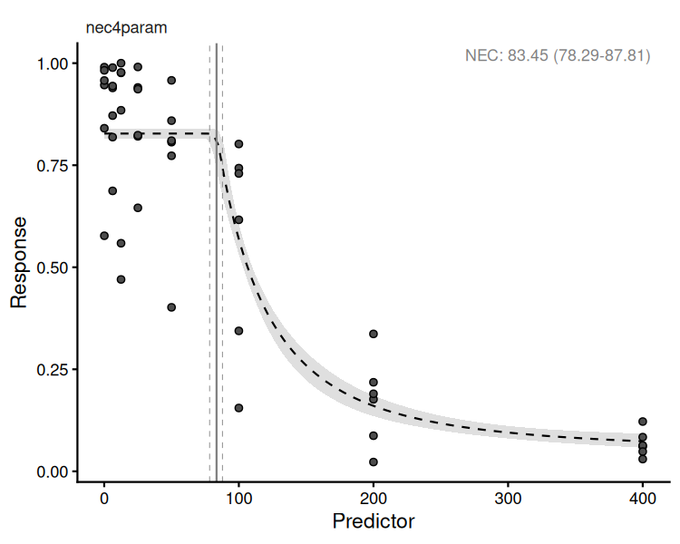
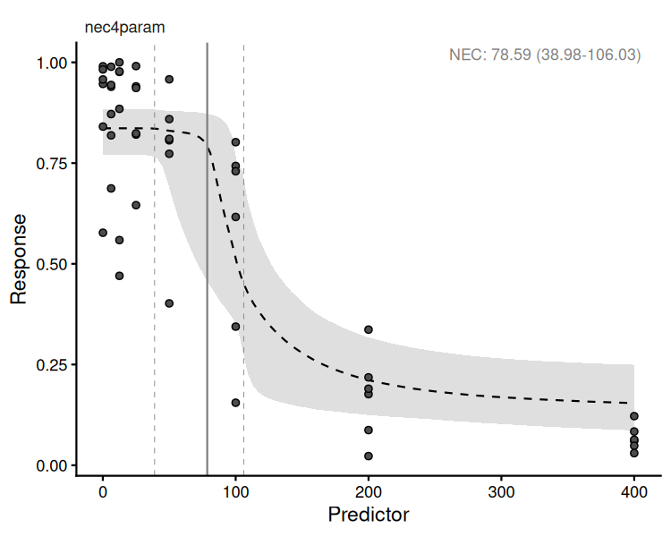
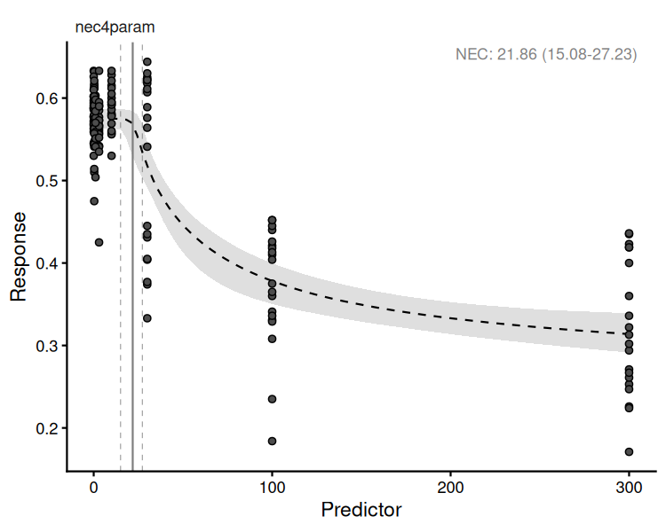
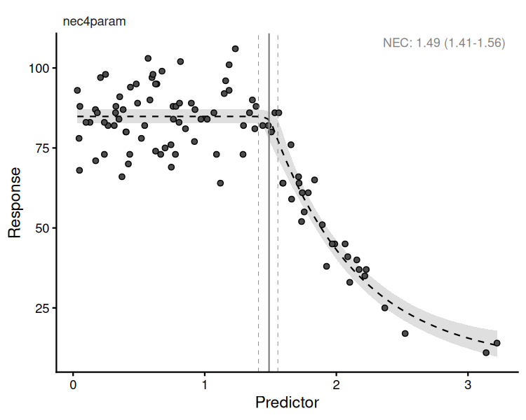
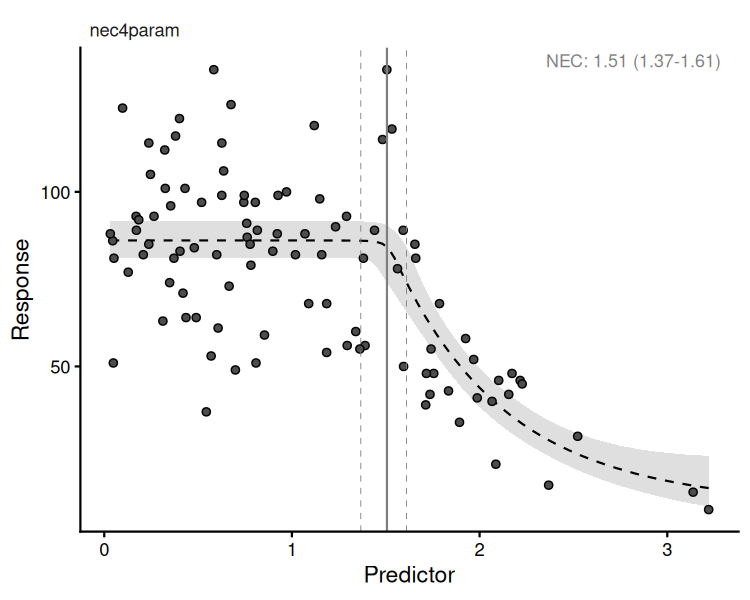
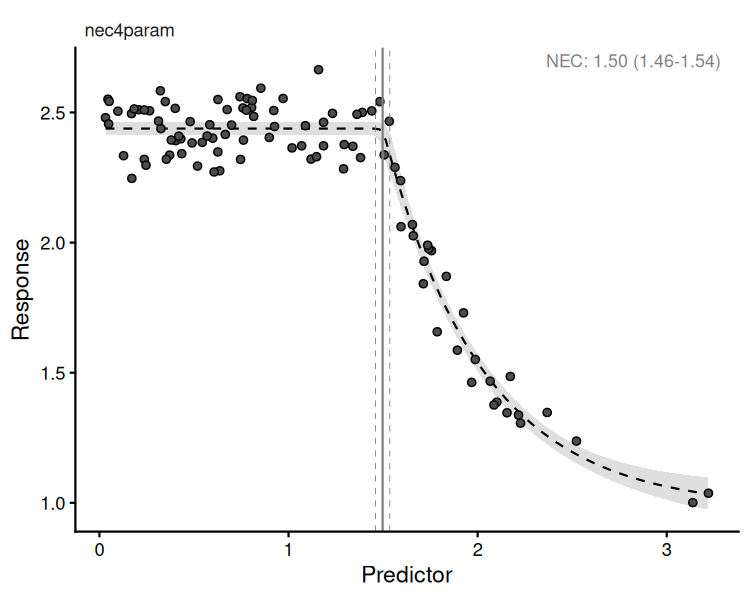
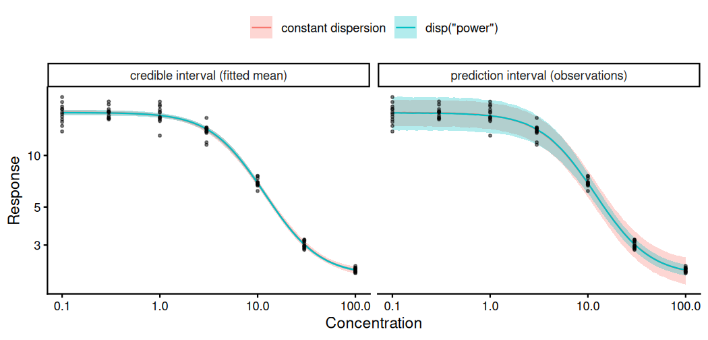
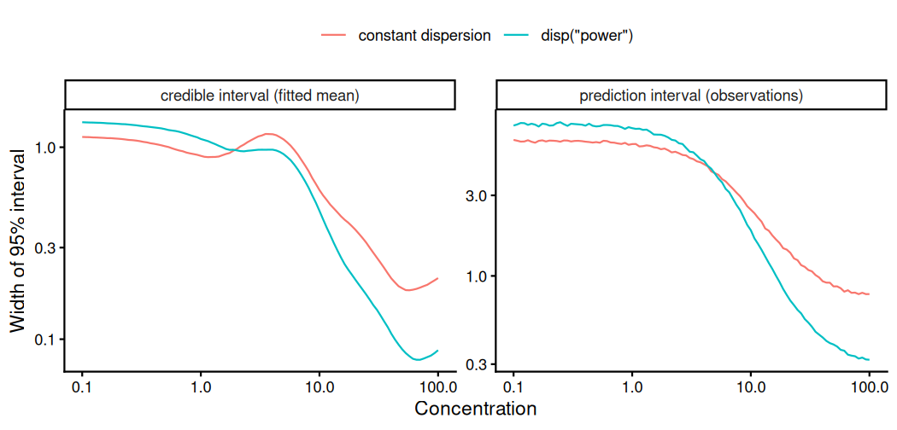

[e1]: https://open-aims.github.io/bayesnec/articles/example1.html
[e2]: https://open-aims.github.io/bayesnec/articles/example2.html
[e2b]: https://open-aims.github.io/bayesnec/articles/example2b.html
[e3]: https://open-aims.github.io/bayesnec/articles/example3.html
[e4]: https://open-aims.github.io/bayesnec/articles/example4.html

# `bayesnec`

The `bayesnec` is an R package to fit concentration(dose) — response curves to toxicity data, and derive No-Effect-Concentration (*NEC*), No-Significant-Effect-Concentration (*NSEC*, [@fisherfox2023]), and Effect-Concentration (of specified percentage "x", *ECx*) thresholds from non-linear models fitted using Bayesian Hamiltonian Monte Carlo (HMC) via `brms` [@Burkner2017; @Burkner2018] and `stan`. The package is an adaptation and extension of an initial package `jagsNEC` [@Fisher2020] which was based on the `R2jags` package [@Su2015] and `jags` [@Plummer2003].

# Background

Bayesian model fitting can be difficult to automate across a broad range of usage cases, particularly with respect to specifying valid initial values and appropriate priors. This is one reason the use of Bayesian statistics for *NEC* estimation (or even *ECx* estimation) is not currently widely adopted across the broader ecotoxicological community, who rarely have access to specialist statistical expertise. The `bayesnec` package provides an accessible interface specifically for fitting *NEC* models and other concentration—response models using Bayesian methods. A range of models are specified based on the known distribution of the "concentration" or "dose" variable (the predictor) as well as the "response" variable. The package requires a simplified model formula, which together with the data is used to wrangle more complex non-linear model formula(s), as well as to generate priors and initial values required to call a `brms` model. While the distribution of the predictor and response variables can be specified directly, `bayesnec` will automatically attempt to assign the correct distribution to use based on the characteristics of the provided data.

This project started with an implementation of the *NEC* model based on that described in (Pires et al. 2002) and [@Fox2010] using R2jags [@Fisher2020]. The package has been further generalised to allow a large range of response variables to be modelled using the appropriate statistical distribution. While the original `jagsNEC` implementation supported Gaussian-, Poisson-, Binomial-, Gamma-, Negative Binomial- and Beta-distributed response data, `bayesnec` additionally supports the Beta-Binomial distribution, and can be easily extended to include any of the available `brms` families. We have since also further added a range of alternative *NEC* model types, as well as a range of  concentration—response models (such as 4-parameter logistic and Weibull models) that are commonly used in frequentist-based packages such as `drc`[@Ritz2016]. These models do not employ segmented linear regression (i.e., use of a `step` function) but model the response as a smooth function of concentration. They can be used to derive no-effect toxicity estimates as a no-significant-effect-concentration [@fisherfox2023].

Specific models can be fit directly using `bnec`, which is what we discuss here. Alternatively, it is possible to fit a custom model set, a specific model set, or all the available models. Further information on fitting multi-models using `bayesnec` can be found in the [Multi model usage][e2] vignette. For detailed information on the models available in `bayesnec` see the [Model details][e2b] vignette.

Important information on the current package is contained in the `bayesnec` help-files and the [Model details][e2b] vignette.

This package is currently under development. We are keen to receive any feedback regarding usage, and especially bug reporting that includes an easy to run self-contained reproducible example of unexpected behaviour, or example model fits that fail to converge (have poor chain mixing) or yield other errors. Such information will hopefully help us towards building a more robust package. We cannot help troubleshoot issues if an easy-to-run reproducible example is not supplied.

# Installation

To install the latest release version from CRAN use


``` r
install.packages("bayesnec")
```

The current development version can be downloaded from GitHub via


``` r
if (!requireNamespace("remotes")) {
  install.packages("remotes")
}
remotes::install_github("open-aims/bayesnec", ref = "dev")
```

Because `bayesnec` is based on `brms` and [Stan](https://mc-stan.org/), a C++
compiler is required. The program
[Rtools](https://cran.r-project.org/bin/windows/Rtools/) comes with a C++
compiler for Windows. On Mac, you should install Xcode. See the prerequisites
section on this
[link](https://github.com/stan-dev/rstan/wiki/RStan-Getting-Started)
for further instructions on how to get the compilers running.

To run this vignette, we will also need some additional packages


``` r
library(dplyr)
library(ggplot2)
library(tidyr)
```

# The scale of the predictor

The scale on which the predictor enters the model is a decision the user has to make, and `bayesnec` does not make it for them. `bnec` takes the concentration exactly as it is given. It is worth settling before any model is fitted, because it generally matters more than the choice of equation: on one algal dataset, moving a `nec4param` fit from the raw dose axis to `log(dose)` reduced the maximum lack of fit in the mean from 0.2115 to 0.0676 on a response spanning about 0.7, while five different equations fitted on the log axis all landed within 1.2 `elpd_loo` of one another.

Concentration—response experiments are usually laid out as a dilution series, in which each concentration is a fixed multiple of the one below it. On a linear axis such a design crushes the low concentrations together and spreads the high ones out, so the equation spends its flexibility at the top of the range, where the response is often already flat, and has few distinct points where the response is actually changing.

The way to tell is to look at the spacing of the **design**, not at the response. If the concentrations are near evenly spaced after a log transformation, the series was laid out on a log scale and is usually best modelled there:


``` r
# the concentrations used in the Beta example below
conc <- c(0.01, 0.3, 1, 3, 10, 30, 100, 300)

# coefficient of variation of the gaps between adjacent concentrations:
# small means evenly spaced on that scale
spacing_cv <- function(x) sd(diff(sort(x))) / mean(diff(sort(x)))
round(c(linear = spacing_cv(conc), log = spacing_cv(log(conc))), 2)
#> linear    log 
#>   1.72   0.58
```

Any simple transformation may be written directly inside `crf`, as `crf(log(x), model = "nec4param")`. Two consequences follow. Zero concentrations cannot be logged, so a control recorded as `0` needs an offset first — `bayesnec` uses `min(x[x > 0]) / 10` when it has to make that substitution itself on the raw axis. And the toxicity estimates are then returned on the transformed scale, so `nec`, `ecx` and `nsec` need back-transforming, with `xform` doing the same job for plots:


``` r
ecx(exp_2, xform = function(x) exp(x) - 1)
autoplot(exp_2, xform = function(x) exp(x) - 1)
```

One caution on the inline form as the package currently stands. A transformation whose argument is a bare variable, such as `log(x)` or `sqrt(x)`, is handled correctly throughout. Where the argument contains arithmetic of its own, such as `log(x + 1)`, `nec` is still reported on the transformed scale but `ecx` and `nsec` are not: they are back-transformed as though the offset were absent, and so are slightly in error. Pre-computing the transformation into its own column and passing it as a bare variable avoids this entirely:


``` r
prop_data$log_x <- log(prop_data$raw_x + 1)
bnec(resp ~ crf(log_x, model = "nec4param"), data = prop_data)
```

The simulated examples further below stay on the linear scale, and deliberately so. They are generated by `data-raw/nec_data.R` as `x <- abs(rnorm(100, 1))` — 100 random draws rather than a designed series — and the true curve is defined as a function of linear `x`, with `nec = 1.5` in linear units. Logging them would distort the generating scale rather than reveal it. The difference between those examples and the three real datasets is the design, not the package.

# Examples

## Fitting the `nec4param` model using `bnec`

Here we include some examples showing how to use the package to fit an *NEC* model to binomial, proportional, count and continuous response data. The examples are those used at: <https://github.com/gerard-ricardo/NECs/blob/master/NECs>, but here we are showing how to fit models to these data using the `bayesnec` package. Note however, the default behaviour in `bayesnec` is to use the `"identity"` link because the native link functions for each family (e.g., `"logit"` for Binomial, `"log"` for Poisson) introduce non-linear transformation on formulas which are already non-linear. So please be aware that estimates of *NEC* or *ECx* might not be as expected when using link functions other than identity (see the [Model details][e2b] vignette for more information and the models available in `bayesnec`).

### Binomial data

The response variable is considered to follow a binomial distribution when it is a count out of a total (such as the percentage survival of individuals, for example). First, we read in the binomial example from [pastebin](https://pastebin.com/tools), prepare the data for analysis, and then inspect the dataset as well as the "concentration", in this case `raw_x`.


``` r
binom_data <- "https://pastebin.com/raw/zfrUha88" |>
  read.table(header = TRUE, dec = ",", stringsAsFactors = FALSE) |>
  dplyr::rename(raw_x = raw.x) |>
  dplyr::mutate(raw_x = as.numeric(as.character(raw_x)))

str(binom_data)
#> 'data.frame':	48 obs. of  3 variables:
#>  $ raw_x: num  0.1 0.1 0.1 0.1 0.1 0.1 6.25 6.25 6.25 6.25 ...
#>  $ suc  : int  101 106 102 112 58 158 95 91 93 113 ...
#>  $ tot  : int  175 112 103 114 69 165 109 92 99 138 ...
summary(binom_data$raw_x)
#>    Min. 1st Qu.  Median    Mean 3rd Qu.    Max. 
#>    0.10   10.94   37.50   99.23  125.00  400.00
```

In this case for `raw_x`, lowest concentration is 0.1 and the highest is 400. The data are right skewed and on the continuous scale. This type of distribution for the predictor data are common for concentration—response experiments, where the *concentration* data are the concentration of contaminants, or dilutions. The current default in `bayesnec` is to estimate the appropriate distribution(s) and priors based on the data, but it is possible to supply `prior` or `family` directly as additional arguments to the underlying `brm` function from `brms`. We are going to model this with the predictor data on a log scale, as this is the scaling clearly used in the experimental design and thus will provide more stable results.

The data are binomial, with the column `suc` indicating the number of successes in the binomial call, and column `tot` indicating the number of trials.

The main working function in `bayesnec` is the function `bnec`, which calls the other necessary functions and fits the `brms` model. We can run `bnec` by supplying `formula`: a special formula which comprises the relationship between response and predictor, and the C-R model (or models) chosen to be fitted; and `data`: a `data.frame` containing the data for the model fitting, here, `binom_data`.

The basic `bayesnec` formula should be of the form:


``` r
suc | trials(tot) ~ crf(log(raw_x), model = "your_model")
```

where the left-hand side of the formula is implemented exactly as in `brms`, including the `trials` term. The right-hand side of the formula contains the special internal function `crf` (which stands for concentration-response function), and takes the predictor (including any simple function transformations such as `log`) and the desired C-R model or suite of models. As with any formula in R, the name of the terms need to be exactly as they are in the input data.frame.

`bnec` will guess the data types for use, although as mentioned above we could manually specify `family` as `"binomial"` (or `binomial`, or `binomial()`). `bnec` will also generate appropriate priors for the `brms` model call, although these can also be specified manually (see the [Priors][e3] vignette for more details).


``` r
library(bayesnec)

exp_1 <- bnec(suc | trials(tot) ~ crf(log(raw_x), model = "nec4param"),
              data = binom_data, seed = 333, open_progress = FALSE)
```

The function shows the progress of the `brms` fit and returns the usual `brms` output (with a few other elements added to this list). The function `plot(pull_brmsfit(exp_1))` can be used to plot the chains, so we can assess mixing and look for other potential issues with the model fit. We can also run a pairs plot that can help to assess issues with identifiability, and which also looks OK. There are a range of other model diagnostics that can be explored for `brms` model fits, using the function `pull_brmsfit`. We encourage you to explore the rich material already on GitHub regarding use and validation of [brms](https://github.com/paul-buerkner/brms) models.

Initially `bayesnec` will attempt to use starting values generated for that type of model formula and family. It will run the iterations and then test if all chains are valid. If the model does not have valid chains `bayesnec` will discard that model and an error will be returned indicating the model could not be fit successfully.

Whenever the `model` argument of `crf` is a single model `bnec` will return an object of class `bayesnecfit`. We can see the summary of our fitted model parameters using:


``` r
summary(exp_1)
#> Object of class bayesnecfit containing the nec4param model
#> 
#>  Family: binomial 
#>   Links: mu = identity 
#> Formula: suc | trials(tot) ~ bot + (top - bot) * exp(-exp(beta) * (log(raw_x) - nec) * step(log(raw_x) - nec)) 
#>          bot ~ 1
#>          top ~ 1
#>          beta ~ 1
#>          nec ~ 1
#>    Data: data (Number of observations: 48) 
#>   Draws: 4 chains, each with iter = 10000; warmup = 8000; thin = 1;
#>          total post-warmup draws = 8000
#> 
#> Regression Coefficients:
#>      Estimate Est.Error l-95% CI u-95% CI Rhat Bulk_ESS Tail_ESS
#> bot      0.05      0.02     0.02     0.08 1.00     3123     2828
#> top      0.83      0.01     0.81     0.84 1.00     3958     4178
#> beta     0.80      0.13     0.56     1.07 1.00     2690     3166
#> nec      4.43      0.03     4.36     4.47 1.00     3084     4024
#> 
#> Draws were sampled using sampling(NUTS). For each parameter, Bulk_ESS
#> and Tail_ESS are effective sample size measures, and Rhat is the potential
#> scale reduction factor on split chains (at convergence, Rhat = 1).
#> 
#> 
#>     Estimate Q2.5 Q97.5
#> NEC     4.43 4.36  4.47
#> 
#> 
#> Bayesian R2 estimates:
#>    Estimate Est.Error Q2.5 Q97.5
#> R2     0.81      0.00 0.80  0.82
```

Note the Rhat values in this example are one, indicating convergence.

The functions `plot` (extending `base` plot method) and `autoplot` (extending `ggplot2` plot method) can be used to plot the fitted model. You can also make your own plot from the data included in the returned object (class `bayesnecfit`) from the call to `bnec`. **Notice, however, that in this case we log-transformed the predictor `raw_x` in the input formula.** This causes `brms` to pass these transformations onto Stan's native code, and therefore derived toxicity estimates will be on that same scale. So we need to transform them back to the data scale using the additional argument `xform`.


``` r
autoplot(exp_1, xform = exp)
```

<div class="figure" style="text-align: center">

<p class="caption">plot of chunk exmp1-binom</p>
</div>

There are many built in methods available for `brmsfit` objects and we encourage you to make use of these in full.

This model fit does not look great. You can see that the error bounds around the fit are far too narrow for this data given the variability among the points, suggesting over dispersion of this model (meaning that the data are more variable than this model fit predicts). For models whose response data are Binomial- or Poisson-distributed, an estimate of dispersion is provided by `bayesnec`, and this can be extracted using `exp_1$dispersion`. Values > 1 indicate overdispersion and values < 1 indicate underdispersion. In this case the overdispersion value is much bigger than 1, suggesting extreme overdispersion (meaning our model does not properly capture the true variability represented in this data). We would need to consider alternative ways of modelling this data using a different distribution, such as the Beta-Binomial.


``` r
exp_1$dispersion
#> Estimate     Q2.5    Q97.5 
#> 19.65927 13.20570 31.09474
```

### Beta-Binomial

The Beta-Binomial model can be useful for overdispersed Binomial data.


``` r
exp_1b <- bnec(suc | trials(tot) ~ crf(log(raw_x), model = "nec4param"),
               data = binom_data, family = beta_binomial(link = "identity"),
               seed = 333, open_progress = FALSE)
```

Fitting this data with the `beta_binomial` yields a much more realistic fit in terms of the confidence bounds (check `autoplot(exp_1b, xform = exp)`) and the spread in the data. Note that a dispersion estimate is not provided here, as overdispersion is only relevant for Poisson and Binomial data.


``` r
autoplot(exp_1b, xform = exp)
```

<div class="figure" style="text-align: center">

<p class="caption">plot of chunk exmp1-bbinom</p>
</div>


``` r
exp_1b$dispersion
#> [1] NA NA NA
```

Now that we have a better fit to these data, we can interpret the results. The estimated *NEC* value can be obtained directly from the fitted model object. As explained above, we need to transform *NEC* back to the data scale.
 

``` r
summary(exp(exp_1b$ne_posterior))
#>    Min. 1st Qu.  Median    Mean 3rd Qu.    Max. 
#>   22.98   67.31   79.46   77.96   88.58  198.62
```

EC*x* estimates can also be obtained from the *NEC* model fit, using the function `ecx`. Note these may differ from a typical 4-parameter non-linear model, as the *NEC* model is a broken stick non-linear regression and will often fall more sharply than a smooth 4-parameter non-linear curve. See both the [Model details][e2b] and [Comparing posterior predictions][e4] vignettes for more information.


``` r
ecx(exp_1b, xform = exp)
#>      Q50     Q2.5    Q97.5 
#> 82.96216 36.92763 99.77477 
#> attr(,"resolution")
#> [1] 1000
#> attr(,"ecx_val")
#> [1] 10
#> attr(,"toxicity_estimate")
#> [1] "ecx"
```

A summary method has also been developed for `bayesnecfit` objects that gives an overall summary of the model statistics, which also include the estimate for *NEC*, as the `nec_intercept` population-level effect in the model---again, its value will depend on the scale of the predictor variable.


``` r
summary(exp_1b)
#> Object of class bayesnecfit containing the nec4param model
#> 
#>  Family: beta_binomial 
#>   Links: mu = identity 
#> Formula: suc | trials(tot) ~ bot + (top - bot) * exp(-exp(beta) * (log(raw_x) - nec) * step(log(raw_x) - nec)) 
#>          bot ~ 1
#>          top ~ 1
#>          beta ~ 1
#>          nec ~ 1
#>    Data: data (Number of observations: 48) 
#>   Draws: 4 chains, each with iter = 10000; warmup = 8000; thin = 1;
#>          total post-warmup draws = 8000
#> 
#> Regression Coefficients:
#>      Estimate Est.Error l-95% CI u-95% CI Rhat Bulk_ESS Tail_ESS
#> bot      0.13      0.05     0.03     0.24 1.00     1082      946
#> top      0.84      0.03     0.77     0.88 1.00     1095     1054
#> beta     0.87      0.69    -0.16     5.09 1.01      433      153
#> nec      4.38      0.19     3.69     4.85 1.01      452      140
#> 
#> Further Distributional Parameters:
#>     Estimate Est.Error l-95% CI u-95% CI Rhat Bulk_ESS Tail_ESS
#> phi     5.34      1.28     3.16     8.35 1.01     1212     1999
#> 
#> Draws were sampled using sampling(NUTS). For each parameter, Bulk_ESS
#> and Tail_ESS are effective sample size measures, and Rhat is the potential
#> scale reduction factor on split chains (at convergence, Rhat = 1).
#> 
#> 
#>     Estimate Q2.5 Q97.5
#> NEC     4.38 3.69  4.85
#> 
#> 
#> Bayesian R2 estimates:
#>    Estimate Est.Error Q2.5 Q97.5
#> R2     0.76      0.04 0.67  0.81
```

### Beta data

Sometimes the response variable is distributed between `0` and `1` but is not a straight-forward Binomial because it is a proportion on the continuous scale. A common example in coral ecology is maximum quantum yield (the proportion of light used for photosynthesis when all reaction centres are open) which is a measure of photosynthetic efficiency calculated from Pulse-Amplitude-Modulation (PAM) data. Here we have a proportion value that is not based on trials and successes. In this case there are no theoretical trials, and the data must be modelled using a Beta distribution instead.

These data are a three-fold dilution series, so following the section above we model the predictor on a log scale. Here we use `log(raw_x + 1)` rather than `log(raw_x)`. The reason is the lowest concentration: it is 0.01, thirty times below the next one, where every other step is a factor of three. On a plain log axis that point would sit 3.4 log units from its neighbour against about 1.1 for every other gap, giving a single concentration a great deal of leverage over the fitted curve. The offset draws it in, and leaves the series more evenly spaced than `log(raw_x)` would:


``` r
round(c(linear = spacing_cv(conc),
        log = spacing_cv(log(conc)),
        `log(x + 1)` = spacing_cv(log(conc + 1))), 2)
#>     linear        log log(x + 1) 
#>       1.72       0.58       0.44
```

An offset of one is convenient rather than principled; it is reasonable here because the concentrations span several orders of magnitude and one lies within their range. Whatever offset is used has to be carried through to anything read off the fitted model, which is what the `xform` argument does below.


``` r
prop_data <- "https://pastebin.com/raw/123jq46d" |>
  read.table(header = TRUE, dec = ",", stringsAsFactors = FALSE) |>
  dplyr::rename(raw_x = raw.x) |>
  dplyr::mutate(across(where(is.character), as.numeric))

exp_2 <- bnec(resp ~ crf(log(raw_x + 1), model = "nec4param"),
              data = prop_data, seed = 333, open_progress = FALSE)
```


``` r
autoplot(exp_2, xform = function(x)exp(x) - 1)
```

<div class="figure" style="text-align: center">

<p class="caption">plot of chunk exmp1-beta</p>
</div>

### Poisson data

Where data are a count (of, for example, individuals or cells), the response is likely to be Poisson distributed. Such data are distributed from `0` to `Inf` and are integers. First we mimic count data based on the package's internal dataset, and make it overdispersed. Then we plot the concentration (i.e. predictor) data.


``` r
data(nec_data)
count_data <- nec_data |>
  dplyr::mutate(
    y = (y * 100 + rnorm(nrow(nec_data), 0, 15)) |>
      round() |>
      as.integer() |>
      abs()
  )

str(count_data)
#> 'data.frame':	100 obs. of  2 variables:
#>  $ x: num  1.019 0.816 0.371 0.401 1.295 ...
#>  $ y: int  82 82 83 69 60 93 76 97 95 79 ...
summary(count_data$y)
#>    Min. 1st Qu.  Median    Mean 3rd Qu.    Max. 
#>   16.00   67.50   82.00   77.86   94.00  124.00
summary(count_data$x)
#>    Min. 1st Qu.  Median    Mean 3rd Qu.    Max. 
#> 0.03235 0.43424 0.87599 1.05142 1.59336 3.22052
```

First, we supply `bnec` with `data` (here `count_data`), and specify our formula. As we have integers of 0 and greater, the `family` is `"poisson"`. The default behaviour to guess the variable types works for this example.


``` r
exp_3 <- bnec(y ~ crf(x, model = "nec4param"), data = count_data,
              seed = 333, open_progress = FALSE)
```


``` r
autoplot(exp_3)
```

<div class="figure" style="text-align: center">

<p class="caption">plot of chunk exmp1-poisson</p>
</div>

``` r
exp_3$dispersion
#>   Estimate       Q2.5      Q97.5 
#>  3.5337626  0.4859079 57.6675764
```

We first plot the model chains (with `plot(exp_3$fit)`) and parameter estimates to check the fit. The chains look OK. However, our plot of the fit is not very convincing. The model uncertainty is very narrow, and this does not seem to be a particularly good model for these data. Note that the dispersion estimate is much greater than one, indicating serious overdispersion. In this case we can try to refit the model but instead deliberately specifying the Negative Binomial distribution for via the `family` argument.

### Negative binomial

When count data are overdispersed and cannot be modelled using the Poisson distribution, the Negative binomial distribution is generally used. We can do this by calling `family = "negbinomial"`.


``` r
exp_3b <- bnec(y ~ crf(x, model = "nec4param"), data = count_data,
               family = "negbinomial", seed = 333, open_progress = FALSE)
```

The resultant plot seems to indicate the Negative Binomial distribution works better in terms of dispersion (more sensible wider confidence bands), however it still might not be the best model for these data. See the [Model details][e2b] and [Multi model usage][e2] vignettes for options to fit other models to these data.


``` r
autoplot(exp_3b)
```

<div class="figure" style="text-align: center">

<p class="caption">plot of chunk exmp1-negbinbase</p>
</div>

### Measure data

Where data are a measured variable, the response is likely to be Gamma distributed. Good examples of `Gamma`-distributed data include measures of body size, such as length, weight, or area. Such data are distributed from `0+` to `Inf` and are continuous. Here we use the `nec_data` supplied with `bayesnec` with the response `y` on the exponential scale to ensure the right data range for a Gamma as an example.


``` r
data(nec_data)
measure_data <- nec_data |>
  dplyr::mutate(measure = exp(y))
```


``` r
exp_4 <- bnec(measure ~ crf(x, model = "nec4param"), data = measure_data,
              seed = 333, open_progress = FALSE)
```


``` r
autoplot(exp_4)
```

<div class="figure" style="text-align: center">

<p class="caption">plot of chunk exmp1-gammabase</p>
</div>

``` r
summary(exp_4)
#> Object of class bayesnecfit containing the nec4param model
#> 
#>  Family: gamma 
#>   Links: mu = identity 
#> Formula: measure ~ bot + (top - bot) * exp(-exp(beta) * (x - nec) * step(x - nec)) 
#>          bot ~ 1
#>          top ~ 1
#>          beta ~ 1
#>          nec ~ 1
#>    Data: data (Number of observations: 100) 
#>   Draws: 4 chains, each with iter = 10000; warmup = 8000; thin = 1;
#>          total post-warmup draws = 8000
#> 
#> Regression Coefficients:
#>      Estimate Est.Error l-95% CI u-95% CI Rhat Bulk_ESS Tail_ESS
#> bot      0.98      0.05     0.89     1.07 1.00     3689     4003
#> top      2.44      0.01     2.41     2.46 1.00     6677     5088
#> beta     0.65      0.10     0.46     0.84 1.00     3112     3630
#> nec      1.50      0.02     1.46     1.54 1.00     3814     4479
#> 
#> Further Distributional Parameters:
#>       Estimate Est.Error l-95% CI u-95% CI Rhat Bulk_ESS Tail_ESS
#> shape   516.52     74.64   384.84   683.21 1.00     5969     4475
#> 
#> Draws were sampled using sampling(NUTS). For each parameter, Bulk_ESS
#> and Tail_ESS are effective sample size measures, and Rhat is the potential
#> scale reduction factor on split chains (at convergence, Rhat = 1).
#> 
#> 
#>     Estimate Q2.5 Q97.5
#> NEC     1.50 1.46  1.54
#> 
#> 
#> Bayesian R2 estimates:
#>    Estimate Est.Error Q2.5 Q97.5
#> R2     0.95      0.00 0.94  0.95
```

In this case our model has converged really well.

# Preparing the response

Supply the response as measured. Do not convert it to percent inhibition, percent of control, or percent of the observed maximum before calling `bnec`.

Normalising to the control is conventional in ecotoxicology, usually as $y^0_i = 1 - y_i / \bar{y}_{con}$ where $\bar{y}_{con}$ is the mean of three to six control replicates. @Ritz2026 show what it costs. Every observation is divided by the *same random quantity*, so the normalised values are correlated and the sampling variability of the divisor is discarded. Applying Jensen's inequality to $y \rightarrow 1/y$ gives $E(1 - y_i/\bar{y}_{con}) \leq 1 - E(y_i)/E(\bar{y}_{con})$, so the inhibition trend is biased downwards and the effective doses read off it are biased upwards. In their simulation of an ED10 with six controls, normalising gave a bias of 6.8% and a coefficient of variation of 26.4%, against 2.1% and 12.7% for the same quantity estimated from the raw response; nominal 95% intervals covered at 88–91%. Roughly half the reported variability was an artefact of the normalisation itself.

Nothing is lost by not normalising. The concentration at which inhibition rises by $x$ percent is the same concentration at which the response falls by $x$ percent, so the two analyses answer the same question. The second is what `ecx(type = "absolute")` — the default — already returns:

$$f(EC_x, \beta) = (1 - x/100) \cdot f(0, \beta)$$

a decline relative to the *fitted* control value rather than to an observed control mean. Because it is evaluated separately within every posterior draw, uncertainty about the control level propagates into the credible interval instead of being thrown away. This is exactly the estimand @Ritz2026 recommend, and it is why no change to `bayesnec` is needed to follow their advice — only a change to what you feed it.

Dividing by the maximum observed response instead of the control mean is worse, on three counts. An extreme order statistic is more variable and more biased than a mean of three to six values. The divisor then depends on every treatment rather than on the controls alone, so treated groups partly determine their own denominator. And it forces exactly one observation to be exactly `1`, which is outside the open $(0, 1)$ support of the Beta distribution, so `bnec` must nudge it off the boundary — a third distortion on top of the other two.

`bnec` looks for both practices and says so. Dividing by the observed maximum leaves a maximum of exactly `1` attained by exactly one observation; dividing by the control mean leaves the control observations averaging to exactly `1`. Either produces a message pointing back to this section. The first check is suppressed when the response lies on a rational grid, because genuine count-derived proportions such as 19/20 surviving routinely produce a single observation at `1` and are not evidence of anything.

## When a divisor is unavoidable

The problem is dividing by something *random*, not dividing as such. @Ritz2026 are explicit on this point:

> If the average growth rate in the control group was known beyond uncertainty, perhaps from historical data, there would be no problem.

This matters for the `Beta` and `zero_inflated_beta` families, which need a response on the open interval $(0, 1)$ and therefore sometimes need a divisor. Where one is required it must be a constant fixed in advance of the analysis — a physiological or design ceiling, or a value from accumulated historical controls — and never a quantity computed from the dataset being analysed.

Note also that ECx is invariant to the choice of constant divisor, because it is a relative decline from the fitted `top`. Changing the divisor changes what `top` means; it does not change the toxicity estimate.

Many proportional responses need no divisor at all. The maximum quantum yield used in the Beta example above is a genuine physical proportion on $(0, 1)$, as is a survival fraction or a bleached-area fraction. These are already on the right scale and should be modelled as they stand.

# Censoring

A recorded value is *censored* when the truth is known to lie in an interval rather than at a point: a concentration below a limit of detection, a cell count below the resolution of the method, a value rounded at the recording precision. The number written down is a **bound**, not a measurement.

Substituting something for it — a zero, half the detection limit, or the bound itself treated as though it had been observed — states more than is known. `bayesnec` passes through the `cens()` aterm from `brms`, so the bound can be declared instead:

```r
y | cens(censoring) ~ crf(x, model = "nec4param")
```

`censoring` is a variable in the data rather than a constant, because in a concentration-response dataset only some rows are censored. It takes the values `"none"`, `"left"`, `"right"` or `"interval"` (equivalently `0`, `-1`, `1`, `2`). Interval censoring takes a second argument giving the upper bound, `cens(censoring, upper)`.

**The response column carries the bound.** On a left-censored row, the number in the response column is the value the truth is known to be at or below — not zero, and not a guess at the unknown truth. The declaration supplies that upper end of the interval and the family's support supplies the lower one, so a left-censored row under a Beta asserts only that the truth lies in $(0, \text{bound}]$.

Because the bound has been declared, a censored row is exempt from the boundary shifts `bnec` otherwise applies to zeros under the Gamma and Beta families; moving the bound would restate it. Declaring a row censored at a value the family excludes — left-censored at `0` under Gamma or Beta, right-censored at `1` under Beta — is an error rather than a shift, because the censored likelihood is degenerate there.

The reason this changes the fit is worth stating. A censored row contributes $F(\text{bound})$, the probability of falling at or below the bound, rather than a density at a point. As the fitted curve descends past the bound, $F$ rises toward 1 and *saturates*: the curve is not rewarded for passing further below, but neither is it penalised. A substituted value instead contributes a density, which falls away as the curve descends, so substitution actively pulls the curve back up toward the value that was substituted.

## What saturation costs

Saturation is what makes the censored likelihood honest, and it is also its limit. Once the fitted curve sits a few residual standard deviations below the bound, $F(\text{bound})$ is indistinguishable from 1 and moving the curve further down changes the likelihood by nothing. The likelihood is *flat* over that region, so a parameter whose only expression is there is not identified by the data, and what gets reported for it is the prior.

The lower asymptote is the usual casualty. Where every response near the bottom of the curve is censored, `bot` is told only that it lies somewhere below the bound, and nothing in the likelihood distinguishes one such value from another.

An example, from a marine microalgal growth test in which the population fell below the counting limit at the highest concentrations, so that specific growth rate is undefined there. A counting limit of 10 cells mL^-1^ against a starting density of 3871 cells mL^-1^ over three days implies a bound of $(\log 10 - \log 3871)/3 = -1.99$ d^-1^. Fitting `nec4param` with a Gaussian family and the same prior throughout, and varying only how those rows are declared:

| below-limit rows declared as | `bot`, median [95% CI] | posterior SD |
|---|---|---|
| the bound, treated as observed | −1.985 [−2.013, −1.958] | 0.014 |
| `cens(censoring)`, left-censored at the bound | −5.64 [−11.0, −2.51] | 2.23 |
| `cens(censoring, upper)`, interval-censored from extinction to the bound | −2.45 [−2.68, −2.10] | 0.17 |

Read in order. Substitution is not only wrong about the value, it is *confident*: the posterior SD is 0.014, an interval a tenth the width of any other, because those rows have been asserted to sit exactly at the bound when all that is known is that they lie below it.

Left-censoring withdraws the false assertion, and what it reveals is that the data contain almost nothing about `bot`. The posterior widens by a factor of 160 and runs down to −11 d^-1^, a rate at which the population would fall by $e^{33}$ over the test. That is the prior's lower tail rather than an estimate. Nothing has gone wrong mechanically: the chains mix, $\widehat{R}$ is 1.00, and the sampler reports 5 divergent transitions in 8000 draws — nothing a routine check would stop on. The number is simply uninformed, and an interval alone will not tell you so.

The third row is the repair. A population below the counting limit is not below extinction, so the truth lies in an interval and `cens(censoring, upper)` can say exactly that. Bounding the flat region from below restores a usable posterior. It is worth being clear about what that estimate then rests on: the lower end is the declared extinction floor, here 1 cell mL^-1^ and so −2.75 d^-1^, and the posterior presses against it. The asymptote is constrained by that assumption rather than measured, and should be reported that way. This fit also needed a longer warmup and a smaller step size to converge (the default settings left one chain of four stranded on a ridge in `beta`, $\widehat{R} = 1.47$); the interval declaration gives the curve slack in the region the other two preparations pin down, and that slack has to be sampled.

Two things follow for practice. First, read identification from the prior-to-posterior contraction rather than from the interval: across these three fits it is 0.996, 0.379 and 0.953 respectively, and the middle value is the diagnostic that the interval hides. `pull_prior()` and the posterior draws are enough to compute it. Second, the problem propagates — any quantity read off the deep part of the fitted curve inherits the prior dependence, so an `ecx()` value whose target falls near the asymptote deserves the same scepticism as `bot` itself.

Whether a value is censored at all is a separate question from how to handle it once it is. A zero that marks a distinct event — an organism that died, rather than a measurement that fell below a limit — is structural, and belongs in a hurdle model rather than a censoring declaration; see `vignette("example6")`.

# Non-constant dispersion

By default a fit holds the dispersion parameter of the chosen family constant across the whole concentration—response curve. For a `gaussian` response that amounts to assuming replicate variability is the same at every concentration; for the other families it means the dispersion parameter, and hence the coefficient of variation or precision, does not change with the mean. Where that assumption is wrong the consequences fall on the credible intervals of the toxicity estimates, and they fall unevenly, because the assumed variability is too large at one end of the series and too small at the other.

The special term `disp` relaxes the assumption, in one of two ways.

```r
y ~ crf(x, model = "nec4param") + disp(~x)         # on the predictor
y ~ crf(x, model = "nec4param") + disp("power")    # on the fitted mean
```

`disp(~x)` is an ordinary `brms` distributional formula, so anything `brms` understands is allowed, including `disp(~log(x))` and `disp(~s(x))`. It states only that variability differs along the concentration axis. `disp("power")` instead models the dispersion parameter as a function of the **fitted mean**, which is a statement about the measurement process rather than about the concentration axis. The two coincide for a monotone curve, where the fitted mean is itself a monotone function of the predictor, and separate under hormesis or where a design revisits the same fitted mean. The available variance functions, the families each applies to, and what the estimated exponent implies for a given family are described in `?bayesnecformula`.

A variance function of the fitted mean requires the mean to be modelled on its natural scale, because the sub-model is built by substituting the model's own curve expression into the variance function, and that expression is the linear predictor on the *link* scale. `bnec` uses an identity link whenever it selects the family itself, so no action is needed in the usual case; if you supply a family explicitly, supply the link too, as in `Gamma(link = "identity")`. Other links are refused rather than fitted, because under an inverse link the sub-model would estimate the slope with the opposite sign while converging perfectly well.

## Choosing a variance function

`"power"` and `"twosided"` are written in terms of $\log(\mu)$, and are therefore undefined wherever the fitted mean reaches zero. That rules them out for a response on the real line — a specific growth rate, a yield or an increment can all be negative — and `bnec` refuses the combination rather than letting it fail at initialisation, pointing instead at `"loglinear"` or `disp(~x)`.

`"loglinear"` is linear in $\mu$ rather than in $\log(\mu)$, so it remains defined across zero. It is also the form a log-transformed endpoint inherits from a power law on its original scale. If a density has $\text{sd} \propto \mu^p$, the delta method gives $\text{sd}(\log N) \propto \mu^{p - 1}$; substituting $\mu_N = N_0 \exp(d \mu_r)$ for an average specific growth rate $\mu_r$ over $d$ days leaves $\log \text{sd}(\mu_r) = \text{const} + d (p - 1) \mu_r$, which is `"loglinear"`. A growth rate is therefore not a response a variance function cannot describe, only one the power law cannot, and $p < 1$ implies $c_1 < 0$.

The exponent $c_1$ is dimensionless for `"power"` and `"twosided"`, which multiply $\log(\mu)$, but carries units of 1/response for `"loglinear"`. Its default prior is scaled to the observed spread of the response accordingly, so that it means the same thing whatever the response is measured in.

The covariate in every variance function is centred on a fixed reference $m$, computed from the response before fitting — its median, or its geometric median for the forms that take $\log(\mu)$. It is a constant rather than an estimated quantity, so it changes the coordinates the sub-model is written in and not the likelihood. Without it, $c_0$ would be the dispersion parameter at $\mu = 1$, or at $\mu = 0$ for `"loglinear"` — points nowhere near the data unless the response happens to be of order one. Fitting a response of order $10^4$ uncentred gives a posterior correlation between $c_0$ and $c_1$ above 0.99. With centring, $c_0$ is the dispersion parameter at a typical response and $c_1$ its rate of change from there.

## Diagnose before modelling

We would encourage treating `disp` as a diagnostic rather than as a routine addition to a model. Replicate variability that appears to change across a concentration series usually has some other cause, and a variance function will absorb any of them and report a confident slope regardless. Three explanations are worth excluding before concluding that dispersion is genuinely non-constant.

The first is **substituted or censored values**, the subject of the section above. Values floored at a boundary, or substituted for a detection limit, cluster at one end of the series, and their spread is easily mistaken for heteroscedasticity. Refitting with those rows declared censored is the test.

The second is a **misspecified family**. A variance function fitted under one family may recover only what a different family assumes for free — a constant coefficient of variation is what a `Gamma` already implies, so fitting `disp("power")` to a constant-CV response under a `gaussian` will appear to be a large improvement while changing nothing that a `Gamma` would not have handled. Comparing the baseline fits across candidate families, before adding any dispersion term, separates the two.

The third is **lack of fit in the mean**. Residuals from a curve that is systematically wrong somewhere are large in that region, and a variance function is free to describe the region as noisy rather than the curve as wrong. The check is to express the departure of the fitted curve from the observed mean at each concentration in units of the *within-concentration replicate standard deviation*, rather than in units of the response.

## A worked example

We simulate a response whose standard deviation rises with the mean, so that the relationship is known rather than assumed, and confirm that it is recovered. The response here is strictly positive, so `bnec` will select a `Gamma` family, which already implies a standard deviation proportional to the mean. We therefore simulate a standard deviation proportional to $\mu^{1.6}$ — steeper than the family alone provides, so that there is something for a variance function to do. This is the second of the three checks above, applied when designing the example rather than after the fact.


``` r
set.seed(333)
disp_x <- rep(c(0.1, 0.3, 1, 3, 10, 30, 100), each = 12)
disp_mu <- 2 + (18 - 2) / (1 + exp((log(disp_x) - log(6)) * exp(0.5)))
disp_dat <- data.frame(
  x = disp_x,
  y = rnorm(length(disp_mu), disp_mu, 0.02 * disp_mu ^ 1.6)
)
```

The relationship is visible without fitting anything, by summarising replicate variability within each concentration. Because these summaries are computed inside each concentration, no curve enters the calculation and no lack of fit in the mean can inflate them.


``` r
within_conc <- aggregate(y ~ x, disp_dat, function(z) c(mean = mean(z), sd = sd(z)))
data.frame(
  x = within_conc$x,
  mean = round(within_conc$y[, "mean"], 2),
  sd = round(within_conc$y[, "sd"], 3),
  cv = round(within_conc$y[, "sd"] / within_conc$y[, "mean"], 3)
)
#>       x  mean    sd    cv
#> 1   0.1 17.63 2.335 0.132
#> 2   0.3 17.83 1.377 0.077
#> 3   1.0 17.42 2.049 0.118
#> 4   3.0 13.91 1.279 0.092
#> 5  10.0  6.95 0.396 0.057
#> 6  30.0  3.02 0.147 0.049
#> 7 100.0  2.15 0.065 0.030
```

The coefficient of variation is not constant, which is what tells us a `Gamma` on its own will not describe these data. We fit with and without a variance function and compare.


``` r
# seed is passed through to brm() so that both fits are exactly reproducible.
# set.seed() alone is not sufficient: it governs the initial values bayesnec
# generates, but not the seed Stan's sampler uses, so repeated runs differ.
disp_const <- bnec(y ~ crf(log(x), model = "ecx4param"),
                   data = disp_dat, seed = 333, open_progress = FALSE)
disp_power <- bnec(y ~ crf(log(x), model = "ecx4param") + disp("power"),
                   data = disp_dat, seed = 333, open_progress = FALSE)
```


``` r
brms::loo_compare(brms::loo(pull_brmsfit(disp_const)),
                  brms::loo(pull_brmsfit(disp_power)))
#>                          elpd_diff se_diff
#> pull_brmsfit(disp_power)   0.0       0.0  
#> pull_brmsfit(disp_const) -13.1       3.7
```

The estimated exponent should be read through the family. `disp("power")` models the dispersion parameter, which for a `Gamma` is `shape`, and the implied standard deviation is proportional to $\mu^{1 - c_1/2}$ (see the table in `?bayesnecformula`). The value used to simulate the data, $\mu^{1.6}$, therefore corresponds to $c_1 = -1.2$:


``` r
brms::fixef(pull_brmsfit(disp_power))[c("c0_Intercept", "c1_Intercept"), ]
#>               Estimate Est.Error      Q2.5      Q97.5
#> c0_Intercept  4.678649 0.1801369  4.306412  5.0135912
#> c1_Intercept -1.086578 0.1895727 -1.452422 -0.7109449
```

A value of zero would correspond to the constant-dispersion model, and is where the prior on this parameter is centred, so an interval excluding zero reflects the data rather than the prior.

Finally, the third check: the departure of the fitted curve from the observed mean at each concentration, in units of the within-concentration replicate standard deviation. Values of a few standard deviations or more would indicate a problem with the mean model that a variance function would conceal rather than resolve.


``` r
disp_fitted <- colMeans(posterior_epred(disp_power))
lof <- aggregate(cbind(obs = disp_dat$y, fit = disp_fitted) ~ disp_dat$x, FUN = mean)
names(lof)[1] <- "x"
lof$replicate_sd <- tapply(disp_dat$y, disp_dat$x, sd)
lof$misfit_in_sds <- round(abs(lof$obs - lof$fit) / lof$replicate_sd, 2)
lof[, c("x", "replicate_sd", "misfit_in_sds")]
#>       x replicate_sd misfit_in_sds
#> 1   0.1   2.33524353          0.06
#> 2   0.3   1.37693794          0.10
#> 3   1.0   2.04860393          0.15
#> 4   3.0   1.27943964          0.27
#> 5  10.0   0.39614047          0.15
#> 6  30.0   0.14681633          0.07
#> 7 100.0   0.06481783          0.03
```

## What it changes

Both models describe the same mean curve, so the effect of the variance function is on the intervals rather than on the fitted response. We take the two intervals from the same draws: the *credible* interval on the fitted mean, and the *prediction* interval a new observation would be expected to fall in. Only the second carries the fitted dispersion directly.


``` r
disp_grid <- data.frame(
  x = exp(seq(log(min(disp_dat$x)), log(max(disp_dat$x)), length.out = 100))
)

disp_bands <- function(fit, label) {
  bfit <- pull_brmsfit(fit)
  quants <- function(mat) {
    data.frame(x = disp_grid$x,
               lo = apply(mat, 2, quantile, 0.025),
               md = apply(mat, 2, median),
               hi = apply(mat, 2, quantile, 0.975))
  }
  rbind(
    cbind(quants(brms::posterior_epred(bfit, newdata = disp_grid)),
          model = label, interval = "credible interval (fitted mean)"),
    cbind(quants(brms::posterior_predict(bfit, newdata = disp_grid)),
          model = label, interval = "prediction interval (observations)")
  )
}

bands <- rbind(disp_bands(disp_const, "constant dispersion"),
               disp_bands(disp_power, "disp(\"power\")"))
```


``` r
ggplot(bands, aes(x = x)) +
  geom_ribbon(aes(ymin = lo, ymax = hi, fill = model), alpha = 0.3) +
  geom_line(aes(y = md, colour = model)) +
  geom_point(data = disp_dat, aes(x = x, y = y), size = 0.7, alpha = 0.5,
             inherit.aes = FALSE) +
  facet_wrap(~interval) +
  scale_x_log10() +
  scale_y_log10() +
  labs(x = "Concentration", y = "Response", fill = NULL, colour = NULL) +
  theme_classic() +
  theme(legend.position = "top")
```

<div class="figure" style="text-align: center">

<p class="caption">plot of chunk exmp1-disp-bands</p>
</div>

The median curves are indistinguishable. At the low concentrations, where replicate variability is largest, the two prediction intervals are similar. At the high concentrations, where the replicate standard deviation has fallen to 0.065, the constant-dispersion interval remains far wider than the data warrant. Plotting the width of each interval directly makes the pattern easier to read than the bands do.


``` r
bands$width <- bands$hi - bands$lo

ggplot(bands, aes(x = x, y = width, colour = model)) +
  geom_line() +
  facet_wrap(~interval, scales = "free_y") +
  scale_x_log10() +
  scale_y_log10() +
  labs(x = "Concentration", y = "Width of 95% interval", colour = NULL) +
  theme_classic() +
  theme(legend.position = "top")
```

<div class="figure" style="text-align: center">

<p class="caption">plot of chunk exmp1-disp-width</p>
</div>

The two lines cross. Relative to the variance function, the constant-dispersion model is too narrow at low concentrations and too wide at high ones — the uneven error described at the start of this section, and the reason the consequences fall on the toxicity estimates rather than on the fitted curve.

Those consequences are not in a single direction, and it is worth seeing why.


``` r
tox <- function(fit, label) {
  vals <- rbind(ec10 = ecx(fit, ecx_val = 10, xform = exp),
                ec50 = ecx(fit, ecx_val = 50, xform = exp),
                nsec = nsec(fit, xform = exp))
  data.frame(model = label, estimate = rownames(vals),
             median = round(vals[, 1], 2),
             lower = round(vals[, 2], 2), upper = round(vals[, 3], 2),
             width = round(vals[, 3] - vals[, 2], 2), row.names = NULL)
}
rbind(tox(disp_const, "constant dispersion"), tox(disp_power, "disp(\"power\")"))
#>                 model estimate median lower upper width
#> 1 constant dispersion     ec10   1.80  1.50  2.20  0.70
#> 2 constant dispersion     ec50   7.20  6.60  7.80  1.20
#> 3 constant dispersion     nsec   0.93  0.43  1.32  0.89
#> 4       disp("power")     ec10   1.90  1.60  2.20  0.60
#> 5       disp("power")     ec50   7.30  6.70  7.80  1.10
#> 6       disp("power")     nsec   1.09  0.50  1.53  1.02
```

The `ecx` intervals narrow, while the `nsec` interval widens. The explanation is what each estimate is referenced against, and it follows from the reweighting the variance function performs. Under constant dispersion every observation carries equal weight. Under `disp("power")` the tightly grouped high-concentration replicates carry more and the variable control replicates carry less, which is visible in the parameters themselves.


``` r
# Only the curve parameters are shared: the disp fit carries c0 and c1 as well.
curve_pars <- c("top_Intercept", "bot_Intercept", "beta_Intercept", "ec50_Intercept")
round(cbind(
  constant = brms::fixef(pull_brmsfit(disp_const))[curve_pars, "Est.Error"],
  power = brms::fixef(pull_brmsfit(disp_power))[curve_pars, "Est.Error"]
), 4)
#>                constant  power
#> top_Intercept    0.2879 0.3425
#> bot_Intercept    0.0718 0.0330
#> beta_Intercept   0.0512 0.0355
#> ec50_Intercept   0.0455 0.0417
```

The parameters set by the high-concentration end, `bot` and `beta`, are estimated more precisely, and `top`, which is set by the control end, less so. `ecx` depends on the curve as a whole — with `type = "absolute"`, the default, on where the curve falls to a given percentage of its own fitted maximum — so it inherits the better-determined shape. `nsec` is referenced against the control instead: it is the concentration at which the curve drops below a lower quantile of the *control* posterior, so it inherits the one thing the variance function made less certain, and widens.

This matters when choosing an endpoint. An `nsec` reported from a constant-dispersion fit rests on an assumption about control variability that the fit has not checked, and it is the estimate most exposed if that assumption is wrong.

# References
