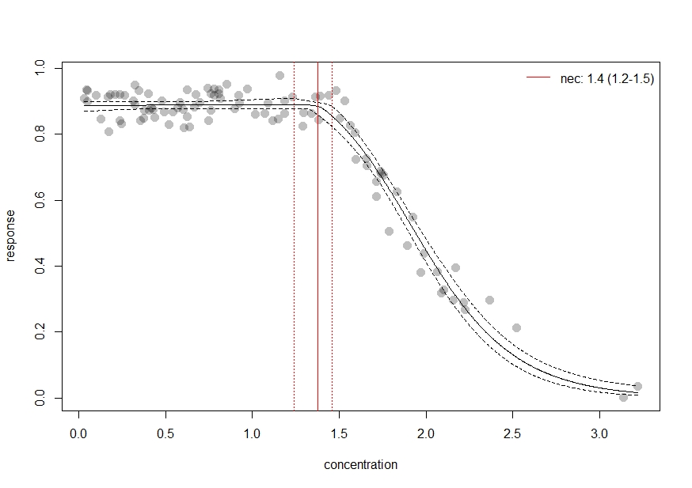
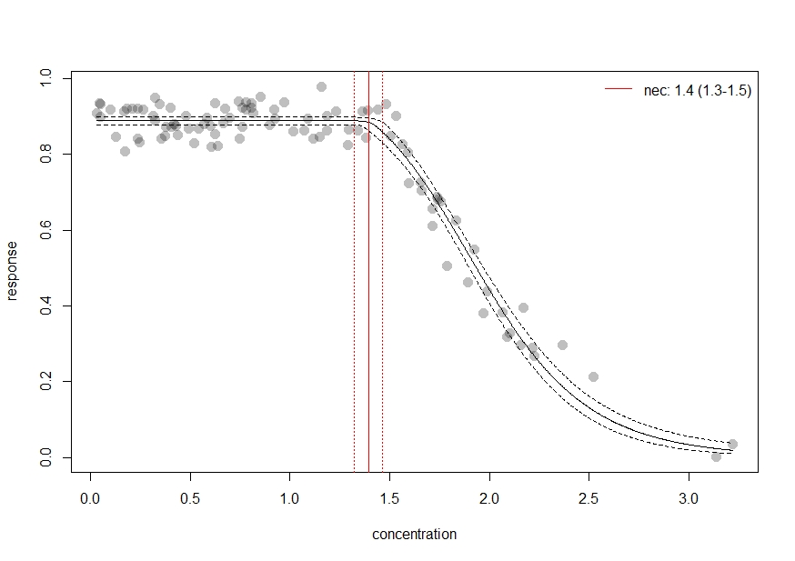
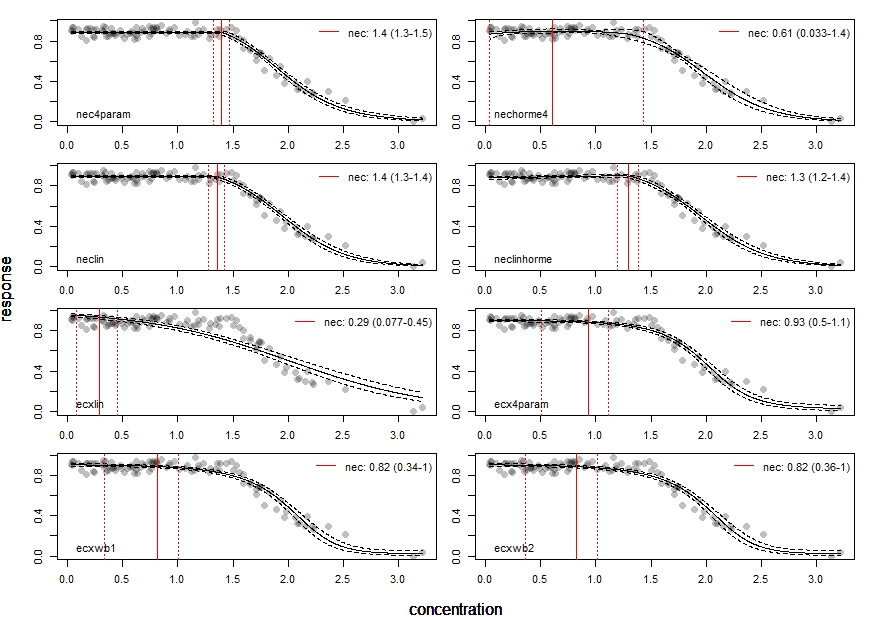
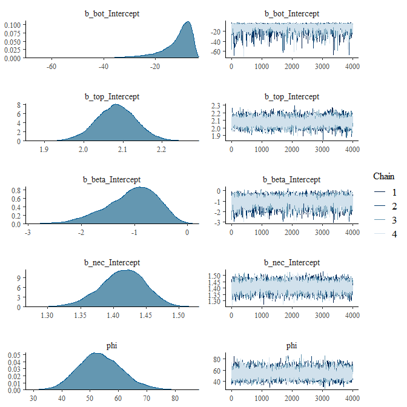
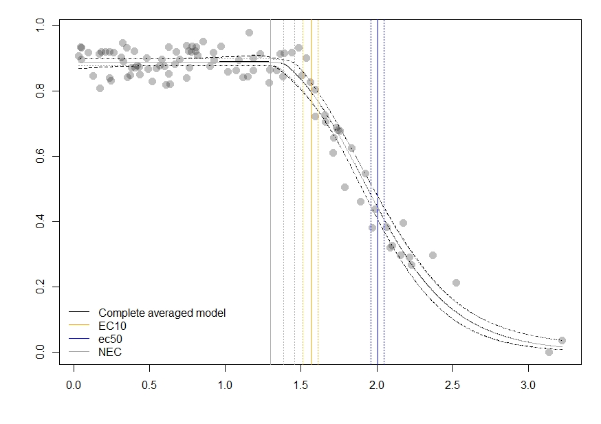

```{r setup, include = FALSE}
stopifnot(require(knitr))
knitr::opts_chunk$set(warning = FALSE, message = FALSE)
```

```{r echo = FALSE, warning = FALSE, message = FALSE, results = "hide"}
plat <- Sys.info()["sysname"]
if (plat == "Windows") {
  library(rstan)
  example(stan_model,
          run.dontrun = TRUE,
          verbose = TRUE)
}
```

```{r echo = FALSE}
e1 <- "https://open-aims.github.io/bayesnec/articles/example1.html"
e2 <- "https://open-aims.github.io/bayesnec/articles/example2.html"
e2b <- "https://open-aims.github.io/bayesnec/articles/example2b.html"
e3 <- "https://open-aims.github.io/bayesnec/articles/example3.html"
e4 <- "https://open-aims.github.io/bayesnec/articles/example4.html"
```

[e1]: `r e1`
[e2]: `r e2`
[e2b]: `r e2b`
[e3]: `r e3`
[e4]: `r e4`


# `bayesnec`

The background of `bayesnec` is covered in the [Single model usage][e1] vignette. Here we explain multi model usage using `bayesnec`. In `bayesnec` it is possible to fit a a custom model set, specific model set or all of the available models. When multiple models are specified the `bnec` function returns a model weighted estimate of predicted posterior values, based on the "pseudobma" with Bayesian bootstrap through `loo_model_weights` [@vehtari2020; @vehtari2017]. These are reasonably analogous to the way model weights are generated using AIC or AICc [@Burnham2002]. 

It is also possible to obtain all individual model fits from the fitted `bayesnecfit` model object if required using the `pull_out` function, and also to update an existing model fit with additional models, or to drop models using the function `amend`. 

Multi-model inference can be useful where there are a range of plausible models that could be used [@Burnham2002] and has been recently adopted in ecotoxicology for SSD model inference [@Thorley2018]. The approach may have considerable value in concentration-response modelling because there is often no a priori knowledge of the functional form that the response relationship should take. In this case model averaging can be a useful way of allowing the data to drive the model selection processing, with weights proportional to how well the individual models fits the data. Well fitting models will have high weights, dominating the model averaged outcome. Conversely, poorly fitting models will have very low model weights and will therefore have little influence on the outcome. Were multiple models fit the data equally well, these  can equally influence the outcome, and the resultant posterior predictions reflect that model uncertainty. It is possible to specify the "stacking" method [@Yao2018] for model weights if desired (through the argument `wi_method`) which aim to minimise prediction error. We do not currently recommend sing stacking weights given the typical sample sizes associated with most concentration-response experiments, and because the main motivation for model averaging within the `bayesnec` package is to properly capture model uncertainty rather than reduce prediction error.

# Installation

To install the latest version from GitHub (https://github.com/open-AIMS/bayesnec) use:

```{r, eval = FALSE}
install.packages("remotes")
remotes::install_github("open-AIMS/bayesnec")
```

To run this vignette we will also need some additional packages, which are made available via `tidyverse`

```{r, echo = FALSE, warning = FALSE, message = FALSE, results = "hide"}
install.packages("tidyverse", repos = "http://cran.us.r-project.org")
```

```{r, warning = FALSE, message = FALSE}
library(tidyverse)
```

# Examples

## Fitting multiple models and model averaging using the `bnec` function

### Fitting a `bnec` model

So far we have explored how to fit individual models via the function `bnec`. The `bayesnec` package also has the capacity to fit a custom selection of models, pre-specified sets of models or even all the available models in the package. Note that as these are Bayesian methods requiring multiple MCMC chains using `bnec` can be very slow when fitting `models = "all"`. See details under `?bnec` for more information on the models, and model sets that can be specified, as well as the [Model details][e2b] vignette which contains considerable information on the available models in `bnec` and their appropriate usage. In general it is safe to call `models = "all"`, as by default `bnec` will discard invalid models.

```{r, results = "hide", eval=FALSE}
library(bayesnec)
data("nec_data")

set.seed(333)
exp_5 <- bnec(data = nec_data, x_var = "x",
               y_var = "y", model = "all")
# save(exp_5, file = "exp_5.RData")
```

Here we run `bnec` using `model =  "all"` using a simulated data example for a beta response variable and save the output as an `.RData` file. Saving an `.RData` file of the *all* model `bnec` output can be a useful way of fitting all the models at a convenient time (this can be very slow, so you can run this overnight for example) so you can reload them later to explore, plot, extract values, and amend the model set as required.

### Exploring a `bayesmanecfit` model

We have created some plotting method functions for our `bayesnec` model types, so we can plot a `bayesmanecfit` model object simply with `plot`.

```{r, fig.width = 7, fig.height = 7, eval=FALSE}
plot(exp_5)
```
```{r echo=FALSE, out.width='100%'}

```

The default plot looks exactly the same out our regular `bayesnecfit` plot, but the output is based on a weighted average of all the models fits. The *NEC* estimate on this plot is based on a mix of actual *NEC* estimates, as well as the *NSEC* estimates that are used as an approximation to *NEC* for all the `ecx` models in the set. Note that we do not currently recommend reporting this values as the *NEC* (see the [Model details][e2b] vignette for more information). The fitted `bayesmanecfit` object contains different elements to the `bayesnecfit`. In particular `mod_stats` contains the table of model fit statistic for all the fitted models. This includes the model name, the WAIC (as returned from `brms`), wi (the model weight, currently defaulting to "pseudobma" with Bayesian boostrap from `loo`), pD, and the over-dispersion estimate (in this case blank because we have fitted a beta family). For this example, the **nec4param** model has the highest weight, followed by the **neclin** and the **neclinhorme** models.
```{r, eval=FALSE}
exp_5$mod_stats
#                   model      waic           wi dispersion_Estimate dispersion_Q2.5 dispersion_Q97.5
# nec4param     nec4param -334.0280 6.370498e-01                  NA              NA               NA
# nechorme4     nechorme4 -303.5511 7.174919e-07                  NA              NA               NA
# neclin           neclin -332.7034 1.811404e-01                  NA              NA               NA
# neclinhorme neclinhorme -329.9205 1.817941e-01                  NA              NA               NA
# ecxlin           ecxlin -188.2148 6.949153e-09                  NA              NA               NA
# ecx4param     ecx4param -302.6093 1.240282e-05                  NA              NA               NA
# ecxwb1           ecxwb1 -294.8037 1.571710e-06                  NA              NA               NA
# ecxwb2           ecxwb2 -294.6499 1.011942e-06                  NA              NA               NA
```

The `bayesmanecfit` object also contains all of the original fits, which can be extracted using the `pull_out` function. For example, we can pull out the highested weighted model, **nec4param**.

```{r, fig.width = 7, fig.height = 7, eval=FALSE}
exp_5_nec4param <- pull_out(exp_5, model = "nec4param")
plot(exp_5_nec4param)
```
```{r echo=FALSE, out.width='100%'}

```

This would extract the **nec4param** model from the `bayesmanecfit` and create a new object that contains just this `bayesnecfit` fit. This would be identical to fitting the **nec4param** as a single model using `bnec`. All of the models in the `bayesmanecfit` can be simultaneously plotted using the argument `all_models = TRUE`.


```{r, fig.width = 7, fig.height = 10, eval=FALSE}
plot(exp_5, all_models = TRUE)
```
```{r echo=FALSE, out.width='100%'}

```
 You can see that some of these model represent very bad fits, and accordingly have extremely low model weights, such as the **ecxlin** model in this example. There is no harm in leaving in poor models with low weight, precisely because they have such a low model weight and will not influence posterior predictions. However, it is important to assess the adequacy of model fits of all models, because a poor fit may be more to do with a model that has not converged.
 
 We can assess the chains for the best model to make sure this is good.

```{r, fig.width = 7, fig.height = 7, eval=FALSE}
plot(exp_5$mod_fits$nec4param$fit)
```
```{r echo=FALSE, out.width='100%'}

```
Assessing chains for all the models in a `bayesmanecfit` doesn't work as well using the default `brms` plotting method. Instead use `check_chains` and make sure to pass a `filename` argument, which mean plots are automatically saved to pdf with a message.

```{r, fig.width = 7, fig.height = 7, eval=FALSE}
check_chains(exp_5, filename = "example_5_all_chains")
#Chain plots saved to file example_5_all_chains.pdf, in your working directory.
```

### Extracting endpoint values

The models prefixed with `ecx` are all models that do not have the *NEC* as a parameter in the model. That is they are smooth curves as a function of concentration and have no breakpoint. The *NEC* on the plots above for these models are an approximation based on *NSEC* and should not be used without careful consideration of the validity of this endpoint value (see the [Model details][e2b] vignette for more details. A formal model averaged estimate of *NEC* should be obtained with `model = "nec"`. We can use the helper functions `pull_out` and `amend` to alter the model set as required. pull_out has a `model` argument and can be used to pull out a single model (as above) or to pull out a specific types of models.

We can use this to obtain first a set of *NEC* only models from the existing set.


```{r, eval=FALSE}
exp_5_nec <- pull_out(exp_5, model = "nec")
# Model(s) nec3param, nechorme, necsigm non-existent in current set of models: nec4param, nechorme4, neclin, neclinhorme, ecxlin, ecx4param, ecxwb1, ecxwb2.
# If needed, add desired model(s) via function amend (see ?amend)
# Pulling out model(s): nec4param, nechorme4, neclin, neclinhorm
```
In this case, because we have already fitted "all" models, we can ignore the message regarding the missing nec models - these are all models that are not appropriate for a `Beta` family with a `logit` link function.

We can drop other models from the set if desired, for example let's drop the **neclinhorme** model using the `amend` function.

```{r, eval=FALSE}
exp_5_nec <- amend(exp_5_nec, drop = "neclinhorme")
#Fitted models are:  nec4param nechorme4 neclin
```
Now we have two model sets, an *NEC* set and a mixed *NEC* and *ECx* set. Of course before we use this model set for any inference, we would need to check the chain mixing and acf plot for each of the input models. For the "all" set, the model with the highest weight is **nec4param**. 

Now we can use the `ecx` function to get EC10 and ec50 values. We can do this using our all model set, because it is valid to use *NEC* models for estimating *ECx* (see more information in the [Model details][e2b] vignette.

```{r, eval=FALSE}
ECx10 <- ecx(exp_5, ecx_val = 10)
ECx50 <- ecx(exp_5, ecx_val = 50)
ECx10
#    ec_10 ec_10_lw ec_10_up 
# 1.564202 1.509949 1.612073 
ECx50
#    ec_50 ec_50_lw ec_50_up 
# 2.004610 1.963123 2.049289
```

The weighted *NEC* estimates can be extracted directly from the *NEC* model set object, as they are an explicit parameter in these models.

```{r, eval=FALSE}
NECvals <- exp_5_nec$w_nec
NECvals
# Estimate     Q2.5    Q97.5 
# 1.384765 1.297690 1.459165 
```

### Putting it all together

Now we can make a combined plot of our output, showing the model averaged "*NEC*" model and the "all averaged model", along with the relevant thresholds.


```{r, fig.width = 7, fig.height = 7, eval=FALSE}
preds <- exp_5_nec$w_pred_vals$data

par(mfrow=c(1,1))
plot(exp_5, add_nec = FALSE)
abline(v = ECx10, col = "orange", lty = c(1, 3, 3))
abline(v = ECx50, col = "blue", lty = c(1, 3, 3))
abline(v = NECvals, col = "darkgrey", lty = c(3, 1, 3))
lines(preds$x, preds$Estimate, col = "darkgrey")
lines(preds$x, preds$Q2.5, col = "darkgrey", lty = 3)
lines(preds$x, preds$Q97.5, col = "darkgrey", lty = 3)
legend("bottomleft",
  legend = c("Complete averaged model", "ec10", "ec50", "NEC"),
  col = c("black", "orange", "blue", "darkgrey"), lty = 1, bty = "n"
)
```
```{r echo=FALSE, out.width='100%'}

```

# References
