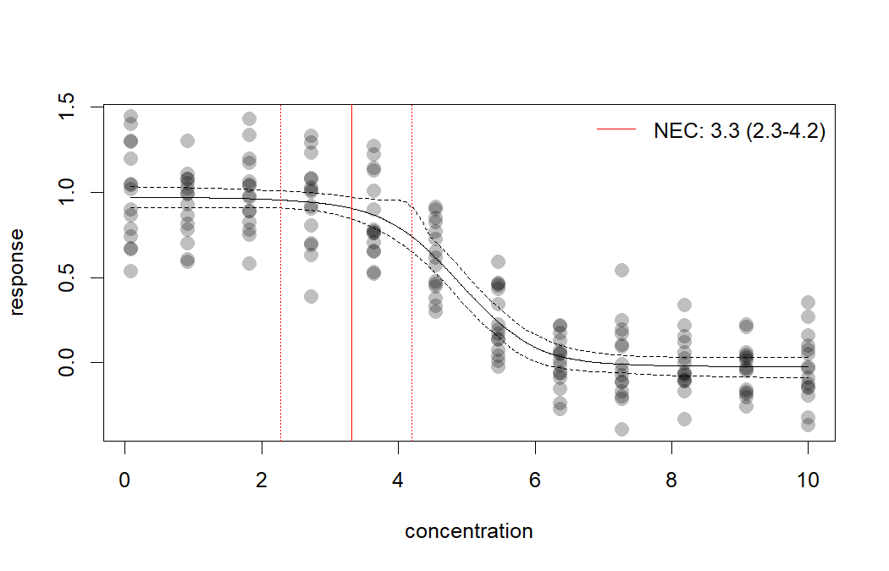
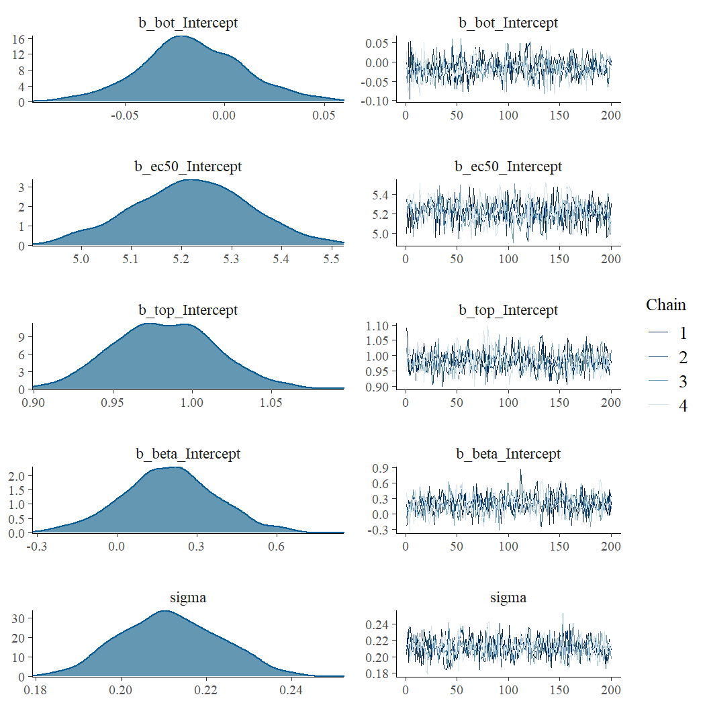
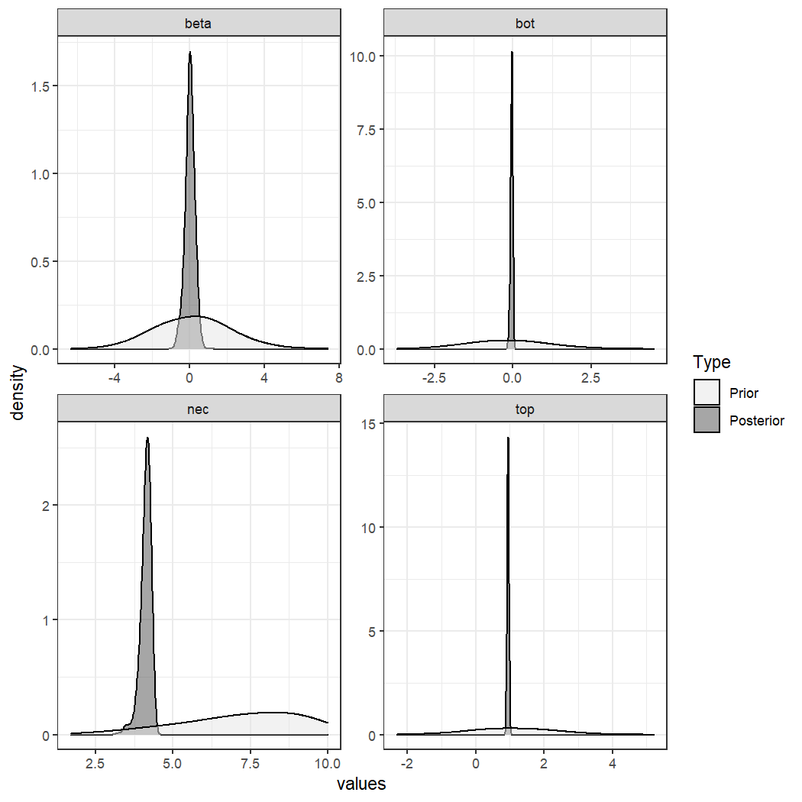

[e1]: https://open-aims.github.io/bayesnec/articles/example1.html
[e2]: https://open-aims.github.io/bayesnec/articles/example2.html
[e2b]: https://open-aims.github.io/bayesnec/articles/example2b.html
[e3]: https://open-aims.github.io/bayesnec/articles/example3.html
[e4]: https://open-aims.github.io/bayesnec/articles/example4.html

# `bayesnec`

The background of `bayesnec` is covered in the [Single model usage][e1] vignette. Here we explain multi model usage using `bayesnec`. In `bayesnec` it is possible to fit a custom model set, specific model set, or all of the available models. When multiple models are specified the `bnec` function returns a model weighted estimate of predicted posterior values, based on the "pseudobma" using Bayesian bootstrap through `loo_model_weights` [@vehtari2020; @vehtari2017]. These are reasonably analogous to the way model weights are generated using AIC or AICc [@Burnham2002]. 

It is also possible to obtain all individual model fits from the fitted `bayesnecfit` model object if required using the `pull_out` function, and also to update an existing model fit with additional models, or to drop models using the function `amend`. 

Multi-model inference can be useful where there are a range of plausible models that could be used [@Burnham2002] and has been recently adopted in ecotoxicology for Species Sensitivity Distribution (SSD) model inference [@Thorley2018]. The approach may have considerable value in concentration-response modeling because there is often no *a priori* knowledge of the functional form that the response relationship should take. In this case model averaging can be a useful way of allowing the data to drive the model selection processing, with weights proportional to how well the individual models fits the data. Well-fitting models will have high weights, dominating the model averaged outcome. Conversely, poorly fitting models will have very low model weights and will therefore have little influence on the outcome. Where multiple models fit the data equally well, these  can equally influence the outcome, and the resultant posterior predictions reflect that model uncertainty. It is possible to specify the "stacking" method [@Yao2018] for model weights if desired (through the argument `loo_controls`) which aims to minimise prediction error. We do not currently recommend using stacking weights given the typical sample sizes associated with most concentration—response experiments, and because the main motivation for model averaging within the `bayesnec` package is to properly capture model uncertainty rather than reduce prediction error.

# Installation

To install the latest release version from CRAN use


```r
install.packages("bayesnec")
```

The current development version can be downloaded from GitHub via


```r
if (!requireNamespace("remotes")) {
  install.packages("remotes")
}
remotes::install_github("open-aims/bayesnec")
```

Because `bayesnec` is based on `brms` and [Stan](https://mc-stan.org/), a C++
compiler is required. The program
[Rtools](https://cran.r-project.org/bin/windows/Rtools/) comes with a C++
compiler for Windows. On Mac, you should install Xcode. See the prerequisites
section on this
[link](https://github.com/stan-dev/rstan/wiki/RStan-Getting-Started)
for further instructions on how to get the compilers running.

# Examples

## Fitting multiple models and model averaging using the `bnec` function

### Fitting a `bnec` model

So far we have explored how to fit individual models via the function `bnec`. The `bayesnec` package also has the capacity to fit a custom selection of models, pre-specified sets of models, or even all the available models in the package. Note that as these are Bayesian methods requiring multiple MCMC chains, using `bnec` can be very slow when fitting `models = "all"`. See details under `?bnec` for more information on the models, and model sets that can be specified, as well as the [Model details][e2b] vignette which contains considerable information on the available models in `bnec` and their appropriate usage. In general it is safe to call `models = "all"`, because by default `bnec` will discard invalid models and the model averaging approach should result in an overall fit that reflects the models that best fit the data. However, because the MCMC can be slow for `models = "all"` we do recommend testing you fit using a single (likely) model in the first instance, to make sure there is no issues with dispersion, the appropriate family is selected and model fitting appears robust (see the model the single model usage [vignette][e1] for more details).

To run this vignette, we willneed the `ggplot2` package:


```r
library(ggplot2)
```


```r
library(bayesnec)
set.seed(30)
x <- seq(0, 10, length = 12)
y <- bayesnec:::pred_ecx4param(x = x, b_bot = 0, b_top = 1, b_beta = 0.5,
                               b_ec50 = 5)
df_ <- data.frame(x = rep(x, 15), y = rnorm(15 * 12, y, 0.2))
exp_5 <- bnec(data = df_, x_var = "x", y_var = "y", model = "decline", iter = 2e3)
```

Here we run `bnec` using `model =  "decline"` using a simulated data example for a beta response variable. We are using the decline set here because we are not going to consider hormesis (these allow an initial increase in the response), largely to save time in fitting this example. We save the output as an `.RData` file. Saving an `.RData` file of the `bnec` output can be a useful way of fitting large model sets (ie `model = "all"`, or `model = "decline"`) at a convenient time (this can be very slow, and may be run overnight for example) so you can reload them later to explore, plot, extract values, and amend the model set as required.

### Exploring a `bayesmanecfit` model

We have created some plotting method functions for our `bayesnec` model types, so we can plot a `bayesmanecfit` model object simply with `plot`.


```r
plot(exp_5)
```


The default plot looks exactly the same as our regular `bayesnecfit` plot, but the output is based on a weighted average of all the model fits in the `model = "decline"` model set. The *NEC* estimate on this plot (and in the summary output below) is based on a mix of actual *NEC* estimates, as well as the *NSEC* estimates that are used as an approximation to *NEC* for all the `ecx` models in the set. Note that we do not currently recommend reporting these values as the *NEC* (see the [Model details][e2b] vignette for more information). The fitted `bayesmanecfit` object contains different elements to the `bayesnecfit`. In particular, `mod_stats` contains the table of model fit statistics for all the fitted models. This includes the model name, the WAIC (as returned from `brms`), wi (the model weight, currently defaulting to "pseudobma" using Bayesian bootstrap from `loo`), pD, and the overdispersion estimate.


```r
exp_5$mod_stats
#>               model      waic           wi dispersion_Estimate dispersion_Q2.5 dispersion_Q97.5
#> nec4param nec4param -40.75272 7.964242e-02           0.9866352       0.7298807         1.334673
#> neclin       neclin  19.22863 2.638122e-09           1.0002044       0.7103761         1.310570
#> ecxlin       ecxlin  26.21035 7.084188e-09           0.9999276       0.7456454         1.371861
#> ecx4param ecx4param -45.03642 1.630890e-01           0.9926411       0.7355155         1.333868
#> ecxwb1       ecxwb1 -45.81315 2.936186e-01           0.9870866       0.7387066         1.349078
#> ecxwb2       ecxwb2 -43.17848 9.675897e-02           0.9913437       0.7454251         1.306820
#> ecxll5       ecxll5 -44.53880 1.319952e-01           0.9929741       0.7531405         1.329122
#> ecxll4       ecxll4 -45.75654 2.348958e-01           0.9944131       0.7312557         1.327689
```

We can obtain a neater summary of the model fit by using the summary method for a bayesmanecfit object. A list of fitted models, and model weights are provided. In addition, the model averaged NEC is reported, however a warning is provided indicating it contains NSEC values. A warning message also indicates that the **ecxll5** model may have convergence issues according to the default `brms` Rhat criteria. For this example all the **ecx* type models have quite high weights, which we would expect given that type of model was used to generate the underlying example.

All these models fit quite well despite the relatively low iter set in our example, but the summary would also include a warning if there were fits with divergent transitions.


```r
summary(exp_5)
#> Object of class bayesmanecfit containing the following non-linear models:
#>   -  nec4param
#>   -  neclin
#>   -  ecxlin
#>   -  ecx4param
#>   -  ecxwb1
#>   -  ecxwb2
#>   -  ecxll5
#>   -  ecxll4
#> 
#> Distribution family: gaussian
#> Number of posterior draws per model:  800
#> 
#> Model weights (Method: pseudobma_bb_weights):
#>             waic   wi dispersion_Estimate dispersion_Q2.5 dispersion_Q97.5
#> nec4param -40.75 0.08                0.99            0.73             1.33
#> neclin     19.23 0.00                1.00            0.71             1.31
#> ecxlin     26.21 0.00                1.00            0.75             1.37
#> ecx4param -45.04 0.16                0.99            0.74             1.33
#> ecxwb1    -45.81 0.29                0.99            0.74             1.35
#> ecxwb2    -43.18 0.10                0.99            0.75             1.31
#> ecxll5    -44.54 0.13                0.99            0.75             1.33
#> ecxll4    -45.76 0.23                0.99            0.73             1.33
#> 
#> 
#> Summary of weighted NEC posterior estimates:
#> NB: Model set contains the ECX models: ecxlin;ecx4param;ecxwb1;ecxwb2;ecxll5;ecxll4; weighted NEC estimates include NSEC surrogates for NEC
#>     Estimate Q2.5 Q97.5
#> NEC     3.32 2.27  4.20
```

The `bayesmanecfit` object also contains all of the original fits, which can be extracted using the `pull_out` function. For example, we can pull out the model **ecx4param**.


```r
exp_5_nec4param <- pull_out(exp_5, model = "ecx4param")
plot(exp_5_nec4param)
```


This would extract the **nec4param** model from the `bayesmanecfit` and create a new object that contains just this `bayesnecfit` fit. This would be identical to fitting the **ecx4param** as a single model using `bnec`. All of the models in the `bayesmanecfit` can be simultaneously plotted using the argument `all_models = TRUE`.


```r
plot(exp_5, all_models = TRUE)
```


You can see that some of these models represent very bad fits, and accordingly have extremely low model weights, such as the **ecxlin** and **neclin** models in this example. There is no harm in leaving in poor models with low weight, precisely because they have such a low model weight and therefore will not influence posterior predictions. However, it is important to assess the adequacy of model fits of all models, because a poor fit may be more to do with a model that has not converged.
 
We can assess the chains for one of the higher weighted models to make sure this is good. It is probably good practice to do this for all models with a high weight.


```r
plot(exp_5$mod_fits$ecxwb1$fit)
```



Assessing chains for all the models in `bayesmanecfit` doesn't work as well using the default `brms` plotting method. Instead use `check_chains` and make sure to pass a `filename` argument, which means plots are automatically saved to pdf with a message.


```r
check_chains(exp_5, filename = "example_5_all_chains")
```

We can also make a plot to compare the posterior probability density to that of the prior using the `check_priors` function, for an individual model fit, but also saving all fits to a file in the working directory.


```r
check_priors(exp_5$mod_fits$nec4param)
```




```r
check_priors(exp_5, filename = "example_5_all_priors")
```

Where  a large number of models are failing to converge, obviously it would be better to adjust `iter` and `warmup` in the `bnec` call, as well as some of the other arguments to `brms` such as `adapt_delta`. See the `brms` documentation for more details. In the example above, only a single model had poor convergence according to `rhat` criteria. It is possible to exclude such models from the model set using `amend` and the `bayesmanecfit` rhat method, via:


```r
exp_5_new <- amend(exp_5, drop = rhat(exp_5)$failed)
```
Here we get an error because none of our models fail the default rhat criteria. A more conservative cut off of 1.01 can also be used by changing the default argument to the desired value. In this case quite a lot of models fail, although this is a very stringent criteria, and we have also used less than the default `bayesnec` value of `iter`.


```r
rhat(exp_5, rhat_cutoff = 1.01)$failed
#> [1] "nec4param" "ecxll5"
```

### Extracting endpoint values

The models prefixed with `ecx` are all models that do not have the *NEC* as a parameter in the model. That is, they are smooth curves as a function of concentration and have no breakpoint. The *NEC* on the plots above for these models are an approximation based on *NSEC* and should not be used without careful consideration of the validity of this endpoint value (see the [Model details][e2b] vignette for more details). A formal model averaged estimate of *NEC* should be obtained with `model = "nec"`. We can use the helper functions `pull_out` and `amend` to alter the model set as required. pull_out has a `model` argument and can be used to pull out a single model (as above) or to pull out a specific set of models.

We can use this to obtain first a set of *NEC* only models from the existing set.


```r
exp_5_nec <- pull_out(exp_5, model = "nec")
```

In this case, because we have already fitted "decline" models, we can ignore the message regarding the missing *NEC* models — these are all models that are not appropriate for a `Beta` family with a `logit` link function, or allow hormesis, which we did not consider in this example.

Now we have two model sets, an *NEC* set, and a mixed *NEC* and *ECx* set. Of course, before we use this model set for any inference, we would need to check the chain mixing and acf plot for each of the input models. For the "all" set, the model with the highest weight is **nec4param**. 

Now we can use the `ecx` function to get EC10 and EC50 values. We can do this using our all model set, because it is valid to use *NEC* models for estimating *ECx* (see more information in the [Model details][e2b] vignette.


```r
ECx10 <- ecx(exp_5, ecx_val = 10)
ECx50 <- ecx(exp_5, ecx_val = 50)
ECx10
#>    ec_10 ec_10_lw ec_10_up 
#> 3.592320 2.838475 4.306488 
#> attr(,"precision")
#> [1] 1000
ECx50
#>    ec_50 ec_50_lw ec_50_up 
#> 4.842115 4.623897 5.070500 
#> attr(,"precision")
#> [1] 1000
```

The weighted *NEC* estimates can be extracted directly from the *NEC* model set object, as they are an explicit parameter in these models.


```r
NECvals <- exp_5_nec$w_nec
NECvals
#> Estimate     Q2.5    Q97.5 
#> 4.147365 3.620584 4.358790
```

Note that the new NEC estimates from the *NEC* only model fits are slightly higher than those reported in the summary output of all the fitted models. This can happen for smooth curves, which is what was used as the underlying data generation model in thie simulations here, and is explored in more detail in the Compare posteriors [vigenette][e4].

### Putting it all together

Now we can make a combined plot of our output, showing the model averaged "*NEC*" model and the "all averaged model", along with the relevant thresholds.


```r
preds <- exp_5_nec$w_pred_vals$data

ggbnec(exp_5, nec = FALSE, all = FALSE) +
  geom_vline(mapping = aes(xintercept = ECx10, colour = "ECx 10"),
             linetype = c(1, 3, 3), key_glyph = "path") +
  geom_vline(mapping = aes(xintercept = ECx50, colour = "ECx 50"),
             linetype = c(1, 3, 3), key_glyph = "path") +
  geom_vline(mapping = aes(xintercept = NECvals, colour = "NEC"),
             linetype = c(1, 3, 3), key_glyph = "path") +
  scale_color_manual(values = c("ECx 10" = "orange", "ECx 50" = "blue",
                                "NEC" = "darkgrey"), name = "") +
  geom_line(data = preds, mapping = aes(x = x, y = Estimate),
            colour = "tomato", linetype = 2) +
  geom_line(data = preds, mapping = aes(x = x, y = Q2.5),
            colour = "tomato", linetype = 2) +
  geom_line(data = preds, mapping = aes(x = x, y = Q97.5),
            colour = "tomato", linetype = 2) +
  theme(legend.position = c(0.8, 0.8),
        axis.title = element_text(size = 16),
        axis.text = element_text(size = 12),
        strip.text.x = element_text(size = 16))
```


# References
