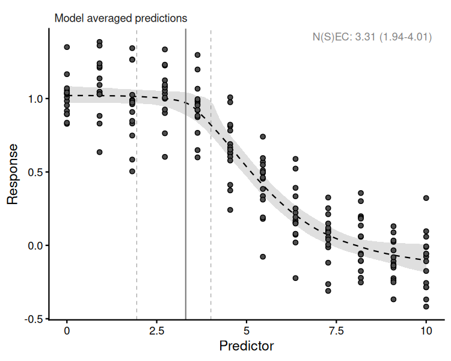
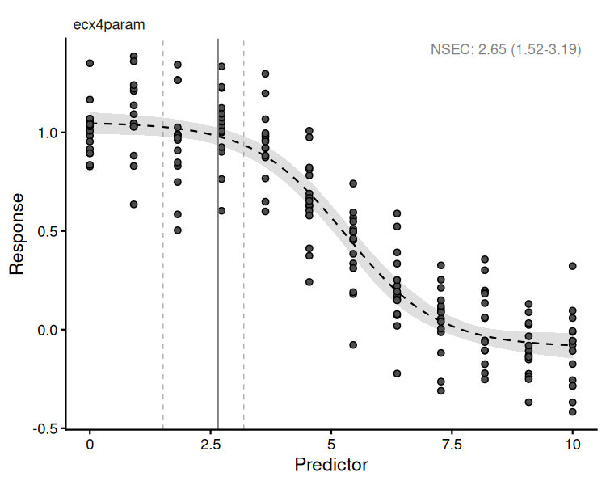
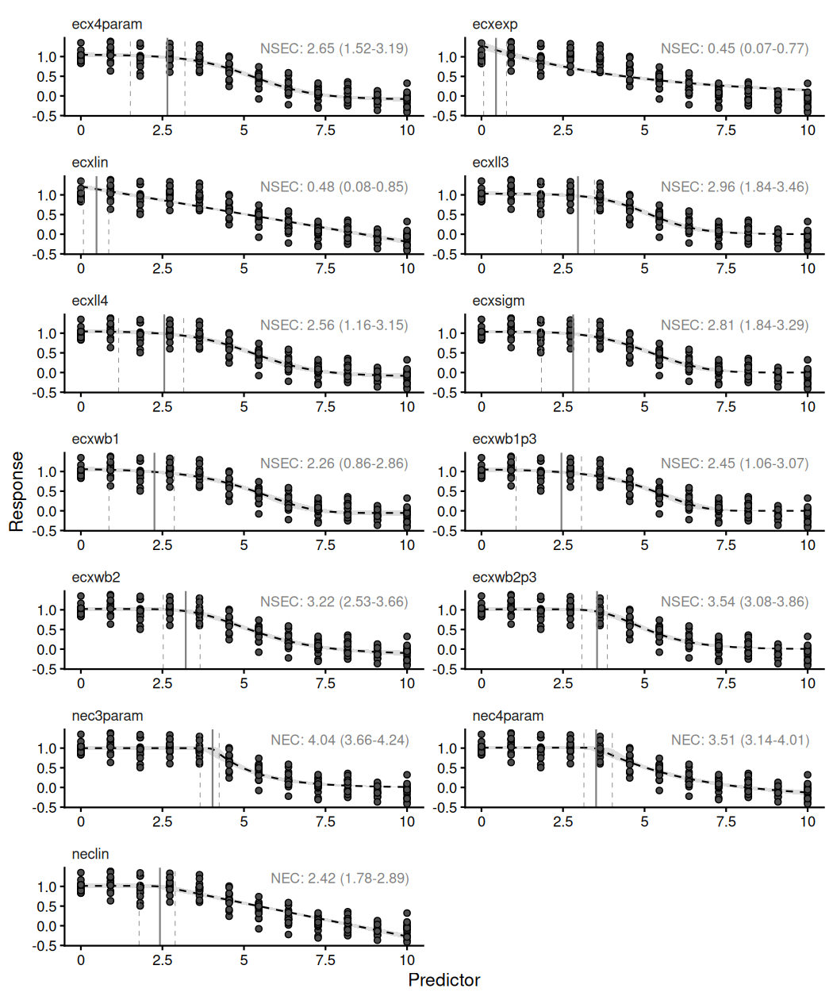
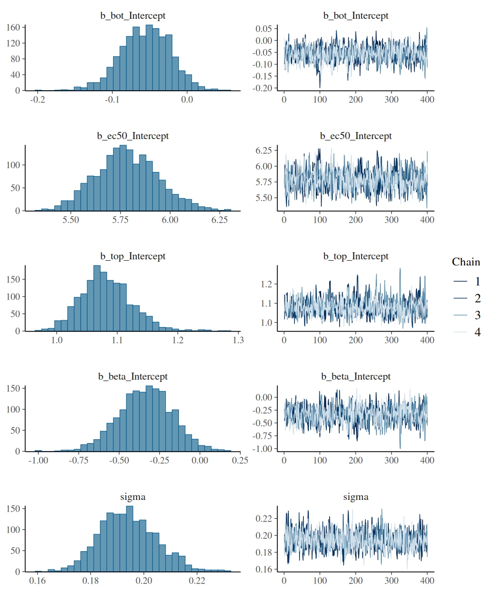
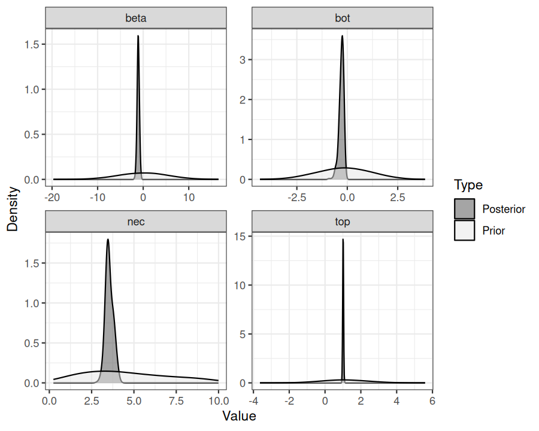
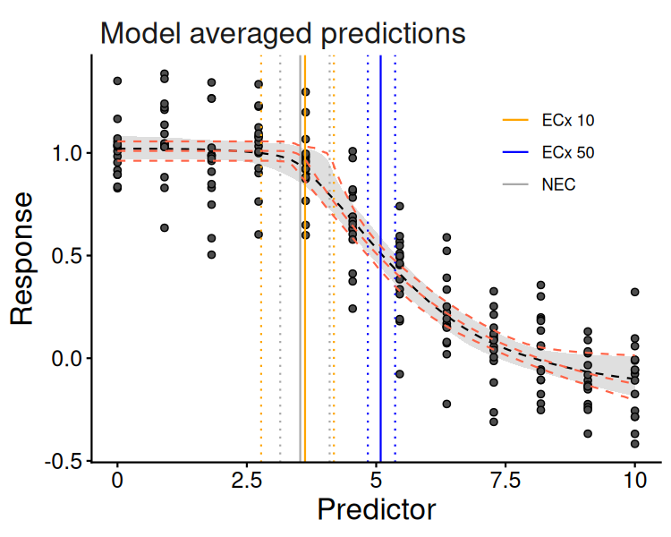

[e1]: https://open-aims.github.io/bayesnec/articles/example1.html
[e2]: https://open-aims.github.io/bayesnec/articles/example2.html
[e2b]: https://open-aims.github.io/bayesnec/articles/example2b.html
[e3]: https://open-aims.github.io/bayesnec/articles/example3.html
[e4]: https://open-aims.github.io/bayesnec/articles/example4.html

# `bayesnec`

The background of `bayesnec` is covered in the [Single model usage][e1] vignette. Here we explain multi model usage using `bayesnec`. In `bayesnec` it is possible to fit a custom model set, specific model set, or all of the available models. When multiple models are specified the `bnec` function returns a model weighted estimate of predicted posterior values, based on the `"pseudobma"` using Bayesian bootstrap through `loo_model_weights` [@vehtari2020; @vehtari2017]. These are reasonably analogous to the way model weights are generated using AIC or AICc [@Burnham2002]. 

It is also possible to obtain all individual model fits from the fitted `bayesnecfit` model object if required using the `pull_out` function, and also to update an existing model fit with additional models, or to drop models using the function `amend`.

Multi-model inference can be useful where there are a range of plausible models that could be used [@Burnham2002] and has been recently adopted in ecotoxicology for Species Sensitivity Distribution (SSD) model inference [@Thorley2018]. The approach may have considerable value in concentration-response modelling because there is often no *a priori* knowledge of the functional form that the response relationship should take. In this case model averaging can be a useful way of allowing the data to drive the model selection process, with weights proportional to how well the individual models fits the data. Well-fitting models will have high weights, dominating the model averaged outcome. Conversely, poorly fitting models will have very low model weights and will therefore have little influence on the outcome. Where multiple models fit the data equally well, these can equally influence the outcome, and the resultant posterior predictions reflect that model uncertainty. It is possible to specify the `"stacking"` method [@Yao2018] for model weights if desired (through the argument `loo_controls`) which aims to minimise prediction error. We do not currently recommend using stacking weights given the typical sample sizes associated with most concentration—response experiments, and because the main motivation for model averaging within the `bayesnec` package is to properly capture model uncertainty rather than reduce prediction error.

# Examples

## Fitting multiple models and model averaging using the `bnec` function

### Fitting a `bnec` model

So far we have explored how to fit individual models via the function `bnec`. The `bayesnec` package also has the capacity to fit a custom selection of models, pre-specified sets of models, or even all the available models in the package. Note that as these are Bayesian methods requiring multiple Hamiltonian Monte Carlo (HMC) chains, using `bnec` can be very slow when specifying `models = "all"` within a `bayesnecformula`. See details under `?bnec` for more information on the models, and model sets that can be specified, as well as the [Model details][e2b] vignette which contains considerable information on the available models in `bnec` and their appropriate usage. In general it is safe to call `models = "all"`, because by default `bnec` will discard invalid models and the model averaging approach should result in an overall fit that reflects the models that best fit the data. However, because the HMC can be slow for `models = "all"` we do recommend testing your fit using a single (likely) model in the first instance, to make sure there are no issues with dispersion, the appropriate distribution is selected and model fitting appears robust (see the [Single model usage vignette][e1] for more details).

To run this vignette, we will need the `ggplot2` package:


```r
library(ggplot2)
```


```r
library(bayesnec)
# function which generates an "ecx4param" model
make_ecx_data <- function(top, bot, ec50, beta, x) {
  top + (bot - top) / (1 + exp((ec50 - x) * exp(beta)))
}
x <- seq(0, 10, length = 12)
y <- make_ecx_data(x = x, bot = 0, top = 1, beta = 0.5, ec50 = 5)
set.seed(333)
df_ <- data.frame(x = rep(x, 15), y = rnorm(15 * length(x), y, 0.2))
exp_5 <- bnec(y ~ crf(x, model = "decline"), data = df_, iter = 2e3,
              cores = 4)
```

Here we run `bnec` using `model =  "decline"` using a simulated data example for a Beta-distributed response variable. We are using the `"decline"` set here because we are not going to consider hormesis (these allow an initial increase in the response), largely to save time in fitting this example. Moreover, you might want to consider saving the output as an `.RData` file---doing so can be a useful way of fitting large model sets (ie `model = "all"`, or `model = "decline"`) at a convenient time (this can be very slow, and may be run overnight for example) so you can reload them later to explore, plot, extract values, and amend the model set as required.

Whenever the `model` argument of `crf` is a model set, or a concatenation of specific models, `bnec` will return an object of class `bayesmanecfit`.

### Exploring a `bayesmanecfit` model

We have created some plotting method functions for both the `bayesnecfit` and `bayesmanecfit` model fits, so we can plot a `bayesmanecfit` model object simply with `autoplot`.


```r
autoplot(exp_5)
```

<div class="figure" style="text-align: center">

<p class="caption">plot of chunk exmp2-decline</p>
</div>

The default plot looks exactly the same as our regular `bayesnecfit` plot, but the output is based on a weighted average of all the model fits in the `model = "decline"` model set that were able to fit successfully using the default `bnec` settings. Because the model set contains a mix of *NEC* and *ECx* models, no-effect toxicity estimate reported by default on this plot (and in the summary output below) is reported as a N(S)EC (see @fisher2023ieam).

The fitted `bayesmanecfit` object contains different elements to the `bayesnecfit`. In particular, `mod_stats` contains the table of model fit statistics for all the fitted models. This includes the model name, the WAIC (as returned from `brms`), wi (the model weight, currently defaulting to `"pseudobma"` using Bayesian bootstrap from `loo`), and the dispersion estimates (only reported if response is modelled with a Poisson or Binomial distribution, otherwise NA).


```r
exp_5$mod_stats
#>               model      waic           wi dispersion_Estimate dispersion_Q2.5 dispersion_Q97.5
#> nec4param nec4param -84.71235 0.3266459430                  NA              NA               NA
#> neclin       neclin -52.72181 0.0004911001                  NA              NA               NA
#> ecxlin       ecxlin -27.81568 0.0006015808                  NA              NA               NA
#> ecx4param ecx4param -81.67824 0.0972614372                  NA              NA               NA
#> ecxwb1       ecxwb1 -75.70936 0.0183140713                  NA              NA               NA
#> ecxwb2       ecxwb2 -84.77620 0.2454512947                  NA              NA               NA
#> ecxll5       ecxll5 -84.61205 0.2204366725                  NA              NA               NA
#> ecxll4       ecxll4 -81.55602 0.0907979003                  NA              NA               NA
```

We can obtain a neater summary of the model fit by using the `summary` method for a `bayesmanecfit` object. A list of fitted models, and model weights are provided. In addition, the model averaged no-effect estimate is reported, in this case as an N(S)EC. For this example the **nec4param** and **ecxwb2** models have the highest weights.

All these model fits are satisfactory despite the relatively low number of iterations set in our example, but the summary would also include a warning if there were fits with divergent transitions.


```r
summary(exp_5)
#> Object of class bayesmanecfit
#> 
#>  Family: gaussian  
#>   Links: mu = identity; sigma = identity  
#> 
#> Number of posterior draws per model:  1600
#> 
#> Model weights (Method: pseudobma_bb_weights):
#>             waic   wi
#> nec4param -84.71 0.33
#> neclin    -52.72 0.00
#> ecxlin    -27.82 0.00
#> ecx4param -81.68 0.10
#> ecxwb1    -75.71 0.02
#> ecxwb2    -84.78 0.25
#> ecxll5    -84.61 0.22
#> ecxll4    -81.56 0.09
#> 
#> 
#> Summary of weighted N(S)EC posterior estimates:
#> NB: Model set contains a combination of ECx and NEC
#>     models, and is therefore a model averaged
#>     combination of NEC and NSEC estimates.
#>        Estimate Q2.5 Q97.5
#> N(S)EC     3.37 2.11  3.98
#> 
#> 
#> Bayesian R2 estimates:
#>           Estimate Est.Error Q2.5 Q97.5
#> nec4param     0.86      0.01 0.84  0.87
#> neclin        0.83      0.01 0.80  0.84
#> ecxlin        0.80      0.01 0.78  0.82
#> ecx4param     0.85      0.01 0.83  0.87
#> ecxwb1        0.85      0.01 0.83  0.86
#> ecxwb2        0.86      0.01 0.84  0.87
#> ecxll5        0.86      0.01 0.84  0.87
#> ecxll4        0.85      0.01 0.83  0.87
```

The `bayesmanecfit` object also contains all of the individual `brms` model fits, which can be extracted using the `pull_out` function. For example, we can pull out and plot the model **ecx4param**.


```r
exp_5_nec4param <- pull_out(exp_5, model = "ecx4param")
autoplot(exp_5_nec4param)
```

<div class="figure" style="text-align: center">

<p class="caption">plot of chunk exmp2-ecx4param</p>
</div>

This would extract the **nec4param** model from the `bayesmanecfit` and create a new object of class `bayesnecfit` which contains just a single fit. This would be identical to fitting the **ecx4param** as a single model using `bnec`. All of the models in the `bayesmanecfit` can be simultaneously plotted using the argument `all_models = TRUE`.


```r
autoplot(exp_5, all_models = TRUE)
```

<div class="figure" style="text-align: center">

<p class="caption">plot of chunk exmp2-allmods</p>
</div>

You can see that some of these models represent very bad fits, and accordingly have extremely low model weights, such as the **ecxlin** and **neclin** models in this example. There is no harm in leaving in poor models with low weight, precisely because they have such a low model weight and therefore will not influence posterior predictions. However, it is important to assess the adequacy of model fits of all models, because a poor fit may be more to do with a model that has not converged.
 
We can assess the chains for one of the higher weighted models to make sure they show good convergence. It is good practice to do this for all models with a high weight, as these are the models most influencing the multi-model inference.


```r
plot(pull_brmsfit(exp_5, "ecxwb1"))
```

<div class="figure" style="text-align: center">

<p class="caption">plot of chunk exmp2-goodmod</p>
</div>

Assessing chains for all the models in `bayesmanecfit` does not work as well using the default `brms` plotting method. Instead use `check_chains` and make sure to pass a `filename` argument, which means plots are automatically saved to pdf with a message.


```r
check_chains(exp_5, filename = "example_5_all_chains")
```

We can also make a plot to compare the posterior probability density to that of the prior using the `check_priors` function, for an individual model fit, but also saving all fits to a file in the working directory.


```r
check_priors(pull_out(exp_5, "nec4param"))
```

<div class="figure" style="text-align: center">

<p class="caption">plot of chunk exmp2-checkpriors</p>
</div>


```r
check_priors(exp_5, filename = "example_5_all_priors")
```

Where  a large number of models are failing to converge, obviously it would be better to adjust `iter` and `warmup` in the `bnec` call, as well as some of the other arguments to `brms` such as `adapt_delta`. See the `?brm` documentation for more details. It is possible to investigate if models from a  `bayesmanecfit` class achieved convergence according to Rhat:


```r
rhat(exp_5) |>
  sapply("[[", "failed")
#> nec4param    neclin    ecxlin ecx4param    ecxwb1    ecxwb2    ecxll5    ecxll4 
#>     FALSE     FALSE     FALSE     FALSE     FALSE     FALSE     FALSE     FALSE
```

Here we get a message because none of our models failed the default Rhat criterion. A more conservative cut off of 1.01 can also be used by changing the default argument to the desired value. In this case one model fails, although we note that this is a very stringent criterion, and we have also used less than the default `bayesnec` value of `iter` (10,000).


```r
rhat(exp_5, rhat_cutoff = 1.01) |>
  sapply("[[", "failed")
#> nec4param    neclin    ecxlin ecx4param    ecxwb1    ecxwb2    ecxll5    ecxll4 
#>     FALSE     FALSE     FALSE      TRUE     FALSE     FALSE     FALSE     FALSE
```

### Extracting toxicity values

The models prefixed with **ecx** are all models that do not have the *NEC* as a parameter in the model. That is, they are smooth curves as a function of concentration and have no breakpoint (no true No-Effect-Concentration, NEC). Thus the reported no-effect toxicity estimate is the NSEC [@fisherfox2023] (see the [Model details][e2b] vignette for more details). If a true model averaged estimate of *NEC* based only on threshold models is desired, this can be obtained with `model = "nec"`. We can use the helper functions `pull_out` and `amend` to alter the model set as required. `pull_out` has a `model` argument and can be used to pull a single model out (as above) or to pull out a specific set of models.

We can use this to obtain first a set of *NEC* only models from the existing set.


```r
exp_5_nec <- pull_out(exp_5, model = "nec")
```

In this case, because we have already fitted `"decline"` models, we can ignore the message regarding the missing *NEC* models---these are all models that are not appropriate for the family and link `bnec` selected for these data, or allow hormesis, which we did not consider in this example.

Now we have two model sets, an *NEC* set, and a mixed *NEC* and *ECx* set. Of course, before we use this model set for any inference, we would need to check the chain mixing and `acf` plot for each of the input models. For the "all" set, the model with the highest weight is **nec4param**. 

Now we can use the `ecx` function to get *EC~10~* and *EC~50~* values. We can do this using our all model set, because it is valid to use *NEC* models for estimating *ECx* (see more information in the [Model details][e2b] vignette).


```r
ECx10 <- ecx(exp_5, ecx_val = 10)
ECx50 <- ecx(exp_5, ecx_val = 50)
ECx10
#>      Q50     Q2.5    Q97.5 
#> 3.641915 2.699609 4.177541 
#> attr(,"resolution")
#> [1] 1000
#> attr(,"ecx_val")
#> [1] 10
#> attr(,"toxicity_estimate")
#> [1] "ecx"
ECx50
#>      Q50     Q2.5    Q97.5 
#> 5.100009 4.842115 5.357903 
#> attr(,"resolution")
#> [1] 1000
#> attr(,"ecx_val")
#> [1] 50
#> attr(,"toxicity_estimate")
#> [1] "ecx"
```

The weighted *NEC* estimates can be extracted directly from the *NEC* model set object, as they are an explicit parameter in these models.


```r
NECvals <- exp_5_nec$w_ne
NECvals
#> Estimate     Q2.5    Q97.5 
#> 3.528531 3.129615 4.031603
```

Note that the new *NEC* estimates from the **nec**-containing model fits are slightly higher than those reported in the summary output of all the fitted models. This can happen for smooth curves, which is what was used as the underlying data generation model in the simulations here, and is explored in more detail in the [Compare posteriors vigenette][e4].

### Putting it all together

Now we can make a combined plot of our output, showing the model averaged *NEC* model and the "all averaged model", along with the relevant thresholds.


```r
preds <- exp_5_nec$w_pred_vals$data

autoplot(exp_5, nec = FALSE, all = FALSE) +
  geom_vline(mapping = aes(xintercept = ECx10, colour = "ECx 10"),
             linetype = c(1, 3, 3), key_glyph = "path") +
  geom_vline(mapping = aes(xintercept = ECx50, colour = "ECx 50"),
             linetype = c(1, 3, 3), key_glyph = "path") +
  geom_vline(mapping = aes(xintercept = NECvals, colour = "NEC"),
             linetype = c(1, 3, 3), key_glyph = "path") +
  scale_color_manual(values = c("ECx 10" = "orange", "ECx 50" = "blue",
                                "NEC" = "darkgrey"), name = "") +
  geom_line(data = preds, mapping = aes(x = x, y = Estimate),
            colour = "tomato", linetype = 2) +
  geom_line(data = preds, mapping = aes(x = x, y = Q2.5),
            colour = "tomato", linetype = 2) +
  geom_line(data = preds, mapping = aes(x = x, y = Q97.5),
            colour = "tomato", linetype = 2) +
  theme(legend.position = c(0.8, 0.8),
        axis.title = element_text(size = 16),
        axis.text = element_text(size = 12),
        strip.text.x = element_text(size = 16))
```

<div class="figure" style="text-align: center">

<p class="caption">plot of chunk exmp2-pretty</p>
</div>

## Fitting the model set in parallel

Every fit above passed `cores = 4`, which tells `brms` to sample the model's four chains at the same time. That is one of two things in a model set that can be done at once, and it is the narrower one: the chains of a single model. A model set is a second opportunity, because the models do not depend on one another and there are usually more of them than there are chains.

`bayesnec` fits the models one at a time unless a [`future`](https://cran.r-project.org/package=future) plan says otherwise. Setting one before the call is all that is required:


```r
library(future)
plan(multisession, workers = 8)
exp_5 <- bnec(y ~ crf(x, model = "decline"), data = df_, iter = 2e3,
              seed = 322)
plan(sequential)
```

There is no `cores` or `parallel` argument to `bnec`. The plan already records how much of the machine you are willing to use, and a second way of saying it would only disagree with the first. `future` and `future.apply` are suggested rather than required packages: without them, or without a plan, the models are fitted in sequence exactly as they were before this feature existed. `amend` uses the plan in the same way, over whichever models it has to fit.

### Choosing the number of workers

Under a plan of more than one worker each model samples its chains in sequence. `brms` parallelises across chains on its own account, so models in parallel on top of that would ask for `workers` times `chains` processes, and `bayesnec` passes `cores = 1` inside each worker to stop that happening by accident.

The arithmetic that follows is the part worth understanding. The sequential fit above already uses four cores, one for each chain. A plan with two workers uses two cores in total, so it is doing less work at once than the fit it replaces; four workers is the same four cores rearranged, one chain each of four models rather than four chains of one. Only above four workers is a plan asking the machine for something it was not already doing.

| plan | cores in use | seconds | against no plan |
|---|---|---|---|
| no plan | 4, one per chain | 99 | -- |
| `workers = 2` | 2, one per model | 114 | 0.87x |
| `workers = 4` | 4, one per model | 108 | 0.92x |
| `workers = 8` | 8, one per model | 101 | 0.98x |
| `workers = 5`, `cores = 4` | 20, four per model | 94 | 1.06x |

Measured 2026-09-12 on an otherwise idle 22-core workstation under WSL2, R 4.6.1, with the `cmdstanr` backend and `plan(multicore)`: the 13 models of the `"decline"` set that fit on this data, at `iter = 2e3` and `chains = 4`, each configuration in a fresh R session. The Stan programs were compiled once before timing began and reused, so these are sampling and overhead rather than a first run; compiling the set takes several minutes on top. One model, `ecxll5`, fails to initialise at this seed in every configuration alike.

Which is a disappointing result, and it is the honest one for a set this size. Two workers cost 15 per cent. Four and eight were still marginally behind the sequential fit. Only the nested configuration, using twenty cores against the baseline's four, came out ahead, and it did so by six per cent.

What that bounds is how much of the run a plan can touch at all. Twenty cores in place of four returned six per cent, so on this example at most a few per cent of the elapsed time is fitting that a plan can overlap; the rest is work it cannot. Some of that is the model weights, the leave-one-out comparisons and the prediction grid, which are computed after the models are fitted, in this process, whatever plan was set. How the remainder divides was not measured and is not claimed here.

So the question to ask is not how many workers to use but whether these models are slow enough to be worth parallelising at all. The models here take seconds. Where a single model takes minutes --- a large data set, a hurdle or group-level structure, many more draws --- the fitting is the run, the arithmetic above applies, and a plan with more workers than chains repays itself. Where a model set looks like this one, it will not.

### Nesting the two levels

The two levels are not exclusive. Passing `cores` yourself is left alone by `bayesnec`, and nests deliberately:


```r
plan(multisession, workers = 5)
exp_5 <- bnec(y ~ crf(x, model = "decline"), data = df_, iter = 2e3,
              cores = 4, seed = 322)
plan(sequential)
```

That runs five models at a time with four chains each: twenty processes. It is the shape that suits a cluster allocation, where the number of cores is known in advance and is larger than any one model can use. Divide the allocation between the two levels rather than giving it all to either.

### Reproducibility

Each fitted model reproduces exactly under a parallel plan, given the same `seed`. That equality is not automatic. `future` gives each worker its own random number generator, `bayesnec`'s initial-value search seeds itself with `set.seed`, and `set.seed` does not restore the generator *kind*, so the same seed would otherwise have produced different starting values in a worker than in the parent. The worker restores the parent's generator before fitting, and the equality is tested.

The model-averaged quantities are the exception, and the reason is mechanical. Once the models are fitted, `bayesnec` draws a seed from the session's random number stream and uses it to decide which posterior draws each model contributes to the averaged estimate. A sequential run has advanced that stream, by way of the `set.seed` each initial-value search performs; a parallel run leaves it untouched, so that models fitted in workers cannot disturb whatever the session was doing. The averaged `nec`, its credible interval and the stored prediction grid therefore differ between the two plans. Neither is wrong: they are two draws from the same weighting. Calling `set.seed` in your own session before `bnec` fixes that draw under a plan, and two parallel runs then agree.

### Memory

Each worker holds a complete fit while it is working, and fits are large. Eight workers on a large data set can exhaust memory where eight cores would have been fine, and a worker killed by the operating system ends the whole call rather than the one model it was fitting. If a run dies without an R error, reduce the worker count before looking anywhere else.

Two smaller effects go with it. A worker is a fresh R process that loads `bayesnec`, and with it `brms` and `rstan`, before it can fit anything: about three seconds each, paid once per worker, which matters for a set of three models and not for a set of twenty-three. And everything the fit needs -- the data, the formula, the priors -- is sent to each worker, so a very large data set may reach `future`'s export limit. Raise it with `options(future.globals.maxSize = )`.

Progress reporting changes too. The per-model messages `bnec` prints come from worker processes, and arrive out of order or not at all depending on the platform. Nothing is lost: a model that fails is still recorded, the remaining models still fit, and `failed_models` reports what happened.

### The Stan backend

Use the `cmdstanr` backend for a parallel run. The default, `rstan`, compiles each model into the session's temporary directory, and a forked worker shares that directory with the process it was forked from; thirteen models compiling at once in eight workers collided there and every one of them failed with `cannot open the connection` from `stanc`. `cmdstanr` names a compiled program after a hash of its Stan code and keeps it in a cache directory, so concurrent compiles of different models do not collide and a repeated run reuses what is already built. Set it with `options(brms.backend = "cmdstanr")`, which is what this package's vignettes are built with.

Two models in two workers did not trigger the collision and thirteen in eight did, so a small trial will not reveal this. It is a property of forking rather than of any one platform: a forked worker shares the parent's temporary directory wherever forking is available.

### Choosing a plan

`plan(multisession)` is the portable choice: it starts fresh R processes that talk to the parent over local sockets, and it is available on every platform. `plan(multicore)` forks the current process instead, which starts faster and shares memory rather than copying it, but forking is unavailable on Windows and inside RStudio and Positron, where the plan silently resolves to a single worker. `bnec` reports the number of workers it actually got, so a plan that has collapsed to one is visible rather than merely slow.

Check that a plan works before committing a long run to it. Fit two models with a small `iter` under the plan you intend to use, and confirm it returns. The socket layer `multisession` depends on is outside R's control, and where it misbehaves the symptom is a run that neither finishes nor errors.

That is not hypothetical. On the WSL2 machine these notes were written on, a two-model fit completed under `multicore` in five runs out of five, taking 84 to 90 seconds, and completed under `multisession` in none of four, each attempt producing no output at all before being killed. A separate thirteen-model run under `multisession` failed differently again: both workers stopped with `error writing to connection` and the parent then waited indefinitely.

The cause is not established here and is very likely below R. The Windows subsystem logged name-resolution failures during these runs, which fits a problem in the socket layer that `multisession` relies on and `multicore` does not use; and the same code passes under `multisession` on Linux, macOS and Windows in this package's continuous integration, so whatever it is, it is not general. The timings below were taken with `multicore` for this reason.

The general lesson is the check, not the backend. If `multisession` stalls on your machine and you are on Linux or macOS, `multicore` avoids sockets altogether and is worth trying.

# References
