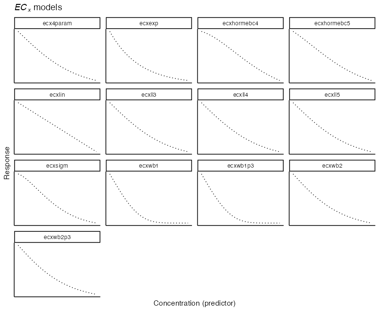
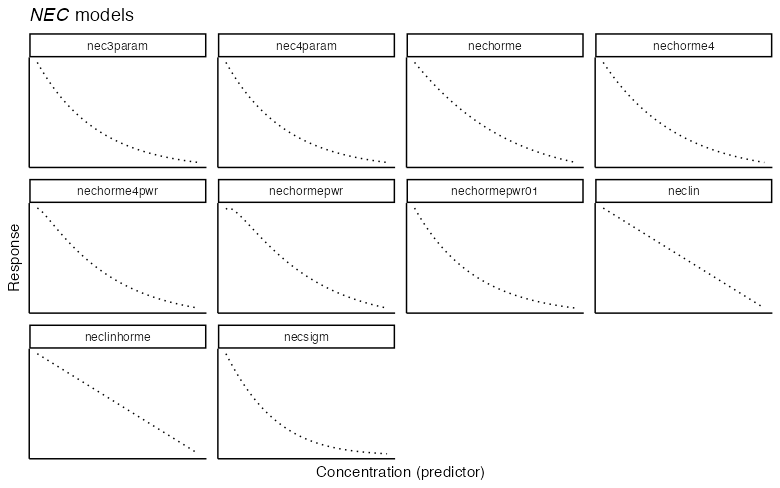

[e1]: https://open-aims.github.io/bayesnec/articles/example1.html
[e2]: https://open-aims.github.io/bayesnec/articles/example2.html
[e2b]: https://open-aims.github.io/bayesnec/articles/example2b.html
[e3]: https://open-aims.github.io/bayesnec/articles/example3.html
[e4]: https://open-aims.github.io/bayesnec/articles/example4.html

# Models in `bayesnec`

There are a range of models available in `bayesnec` and the working `bnec` function supports individual model fitting, as well as multi-model fitting with Bayesian model averaging.

The argument `model` in a `bayesnecformula` is a character string indicating the name(s) of the desired model (see `?models` for more details, and the list of models available). If a recognised model name is provided, a single model of the specified type is fit, and `bnec` returns a model object of class `bayesnecfit`. If a vector of two or more of the available models are supplied, `bnec` returns a model object of class `bayesmanecfit` containing Bayesian model averaged predictions for the supplied models, providing they were successfully fitted.

Model averaging is achieved through a weighted sample of each fitted models' posterior predictions, with weights derived using the `loo_model_weights` function from `loo` [@vehtari2020; @vehtari2017]. Individual `brms` model fits can be extracted from the `mod_fits` element and can be examined individually.

The `model` may also be one of `"all"`, meaning all of the available models will be fit; `"ecx"` meaning only models excluding the $\eta = \text{NEC}$ step parameter will be fit; `"nec"` meaning only models with a specific $\eta = \text{NEC}$ step parameter will be fit; `"bot_free"` meaning only models without a `"bot"` parameter (without a bottom plateau) will be fit; `"zero_bounded"` are models that are bounded to be zero; or `"decline"` excludes all hormesis models, i.e., only allows a strict decline in response across the whole predictor range (see below **Parameter definitions**). There are a range of other pre-defined model groups available. The full list of currently implemented model groups can be seen using:


```r
library(bayesnec)
models()
#> $nec
#>  [1] "nec3param"     "nec4param"     "nechorme"      "nechorme4"     "necsigm"       "neclin"        "neclinhorme"   "nechormepwr"   "nechorme4pwr" 
#> [10] "nechormepwr01"
#> 
#> $ecx
#>  [1] "ecx4param"   "ecxlin"      "ecxexp"      "ecxsigm"     "ecxwb1"      "ecxwb2"      "ecxwb1p3"    "ecxwb2p3"    "ecxll5"      "ecxll4"     
#> [11] "ecxll3"      "ecxhormebc4" "ecxhormebc5"
#> 
#> $all
#>  [1] "nec3param"     "nec4param"     "nechorme"      "nechorme4"     "necsigm"       "neclin"        "neclinhorme"   "nechormepwr"   "nechorme4pwr" 
#> [10] "nechormepwr01" "ecxlin"        "ecxexp"        "ecxsigm"       "ecx4param"     "ecxwb1"        "ecxwb2"        "ecxwb1p3"      "ecxwb2p3"     
#> [19] "ecxll5"        "ecxll4"        "ecxll3"        "ecxhormebc4"   "ecxhormebc5"  
#> 
#> $bot_free
#>  [1] "nec3param"     "nechorme"      "necsigm"       "neclin"        "neclinhorme"   "nechormepwr"   "ecxlin"        "ecxexp"        "ecxsigm"      
#> [10] "ecxwb1p3"      "ecxwb2p3"      "ecxll3"        "ecxhormebc4"   "nechormepwr01"
#> 
#> $zero_bounded
#>  [1] "nec3param"     "nechorme"      "necsigm"       "nechormepwr"   "nechormepwr01" "ecxexp"        "ecxsigm"       "ecxwb1p3"      "ecxwb2p3"     
#> [10] "ecxll3"        "ecxhormebc4"  
#> 
#> $decline
#>  [1] "nec3param" "nec4param" "neclin"    "ecxlin"    "ecxexp"    "ecxsigm"   "ecx4param" "ecxwb1"    "ecxwb2"    "ecxwb1p3"  "ecxwb2p3"  "ecxll5"   
#> [13] "ecxll4"    "ecxll3"   
#> 
#> $hormesis
#> [1] "nechorme"      "nechorme4"     "neclinhorme"   "nechormepwr"   "nechorme4pwr"  "nechormepwr01" "ecxhormebc4"   "ecxhormebc5"
```

# Parameter definitions

Where possible we have aimed for consistency in the interpretable meaning of the individual parameters across models. Across the currently implemented model set, models contain from two (basic linear or exponential decay, see **ecxlin** or **ecxexp**) to five possible parameters (**nechorme4**), including:

$\tau = \text{top}$, usually interpretable as either the y-intercept or the upper plateau representing the mean concentration of the response at zero concentration;

$\eta = \text{NEC}$, the No-Effect-Concentration value (the x concentration value where the breakpoint in the regression is estimated at, see **Model types for *NEC* and *EC~x~* estimation** and [@Fox2010] for more details on parameter based *NEC* estimation);

$\beta = \text{beta}$, generally the exponential decay rate of response, either from 0 concentration or from the estimated $\eta$ value, with the exception of the **neclinhorme** model where it represents a linear decay from $\eta$ because slope ($\alpha$) is required for the linear increase;

$\delta = \text{bottom}$, representing the lower plateau for the response at infinite concentration;

$\alpha = \text{slope}$, the linear decay rate in the models **neclin** and **ecxlin**, or the linear increase rate prior to $\eta$ for all hormesis models;

$\omega$ = $\text{EC\textsubscript{50}}$ notionally the 50% effect concentration but may be influenced by scaling and should therefore not be strictly interpreted, and

$\epsilon = \text{d}$, the exponent in the **ecxsigm** and **necisgm** models.

$\zeta = \text{f}$ A scaling exponent exclusive to model **ecxll5**.

In addition to the model parameters, all **nec**-containing models have a step function used to define the breakpoint in the regression, which can be defined as

$$
f(x_i, \eta) = \begin{cases} 
      0, & x_i - \eta < 0 \\
      1, & x_i - \eta \geq 0 \\
   \end{cases}
$$

# Model types for *NEC* and *EC~x~* estimation

All models provide an estimate for the No-Effect-Concentration (*NEC*). For model types with **nec** as a prefix, the *NEC* is directly estimated as parameter $\eta = \text{NEC}$ in the model, as per [@Fox2010]. Models with **ecx** as a prefix are continuous curve models, typically used for extracting *EC~x~* values from concentration-response data. In this instance the *NEC* reported is actually the No-Significant-Effect-Concentration (*NSEC*), defined as the concentration at which there is a user supplied (see `sig_val`) percentage certainty (based on the Bayesian posterior estimate) that the response falls below the estimated value of the upper asymptote ($\tau = \text{top}$) of the response (i.e. the response value is significantly lower than that expected in the case of no exposure). The default value for `sig_val` is 0.01, which corresponds to an alpha value (Type-I error rate) of 0.01 for a one-sided test of significance. See `?nsec` for more details. We currently recommend only using the `"nec"` model set for estimation of *NEC* values, as the *NSEC* concept has yet to be formally peer-reviewed.

*EC~x~* estimates can be equally obtained from both `"nec"` and `"ecx"` models. *EC~x~* estimates will usually be lower (more conservative) for `"ecx"` models fitted to the same data as `"nec"` models (see the [Comparing posterior predictions][e4]) vignette for an example. However, we recommend using `"all"` models where *EC~x~* estimation is required because `"nec"` models can fit some datasets better than `"ecx"` models and the model averaging approach will place the greatest weight for the outcome that best fits the supplied data. This approach will yield *EC~x~* estimates that are the most representative of the underlying relationship in the dataset.

There is ambiguity in the definition of *EC~x~* estimates from hormesis models---these allow an initial increase in the response [see @Mattson2008] and include models with the character string `horme` in their name---as well as those that have no natural lower bound on the scale of the response (models with the string **lin** in their name, in the case of Gaussian response data). For this reason the `ecx` function has arguments `hormesis_def` and `type`, both character vectors indicating the desired behaviour. For `hormesis_def = "max"`, *EC~x~* values are calculated as a decline from the maximum estimates (i.e., the peak at $\eta = \text{NEC}$); and `hormesis_def = "control"` (the default) indicates that *EC~x~* values should be calculated relative to the control, which is assumed to be the lowest observed concentration. For `type = "relative"` *EC~x~* is calculated as the percentage decrease from the maximum predicted value of the response ($\tau = \text{top}$) to the minimum predicted value of the response (i.e., *relative* to the observed data). For `type = "absolute"` (the default) *EC~x~* is calculated as the percentage decrease from the maximum value of the response ($\tau = \text{top}$) to 0 (or $\delta = \text{bottom}$ for models with that parameter). For `type = "direct"`, a direct interpolation of the response on the predictor is obtained.

# Model suitability for response types

Models that have an exponential decay (most models with parameter $\beta = \text{beta}$) with no $\delta = \text{bottom}$ parameter are 0-bounded and are not suitable for the Gaussian family, or any family modelled using a `"logit"` or `"log"` link because they cannot generate predictions of negative response values. Conversely, models with a linear decay (containing the string **lin** in their name) are not suitable for modelling families that are 0-bounded (Gamma, Poisson, Negative Binomial, Beta, Binomial, Beta-Binomial) using an `"identity"` link. These restrictions do not need to be controlled by the user, as a call to `bnec` with `models = "all"` in the formula will simply exclude inappropriate models, albeit with a message.

Strictly speaking, models with a linear hormesis increase are not suitable for modelling responses that are 0, 1-bounded (Binomial-, Beta- and Beta-Binomial-distributed), however they are currently allowed in `bayesnec`, with a reasonable fit achieved through a combination of the appropriate distribution being applied to the response, and `bayesnec`'s `make_inits` function which ensures initial values passed to `brms` yield response values within the range of the user-supplied response data.

# Model definitions

## *EC~x~* models



#### ecxlin

The **ecxlin** model is a basic linear decay model, given by the equation:
$$y_i = \tau - e^{\alpha} x_i$$
with the respective `brmsformula` being


```
#> y ~ top - exp(slope) * x 
#> top ~ 1
#> slope ~ 1
```

Because the model contains linear predictors it is not suitable for 0, 1-bounded data (i.e. Binomial and Beta families with an `"identity"` link function). As the model includes a linear decline with concentration, it is also not suitable for 0, `Inf` bounded data (Gamma, Poisson, Negative Binomial with an `"identity"` link).

#### ecxexp

The **ecxexp** model is a basic exponential decay model, given by the equation:
$$y_i = \tau e^{-e^{\beta} x_i}$$
with the respective `brmsformula` being


```
#> y ~ top * exp(-exp(beta) * x) 
#> top ~ 1
#> beta ~ 1
```

The model is 0-bounded, thus not suitable for Gaussian response data or the use of a `"logit"` or `"log"` link function.

#### ecxsigm

The **ecxsigm** model is a simple sigmoidal decay model, given by the equation:
$$y_i = \tau e^{-e^{\beta} x_i^{e^\epsilon}}$$
with the respective `brmsformula` being


```
#> y ~ top * exp(-exp(beta) * x^exp(d)) 
#> d ~ 1
#> top ~ 1
#> beta ~ 1
```

The model is 0-bounded, thus not suitable for Gaussian response data or the use of a `"logit"` or `"log"` link function.

#### ecx4param

The **ecx4param** model is a 4-parameter sigmoidal decay model, given by the equation:
$$y_i = \tau + (\delta - \tau)/(1 + e^{e^{\beta} (\omega - x_i)})$$
with the respective `brmsformula` being


```
#> y ~ top + (bot - top)/(1 + exp((ec50 - x) * exp(beta))) 
#> bot ~ 1
#> ec50 ~ 1
#> top ~ 1
#> beta ~ 1
```

#### ecxwb1

The **ecxwb1** model is a 4-parameter sigmoidal decay model which is a slight reformulation of the Weibull1 model of @Ritz2016, given by the equation:
$$y_i = \delta + (\tau - \delta) e^{-e^{e^{\beta} (x_i - \omega)}}$$
with the respective `brmsformula` being


```
#> y ~ bot + (top - bot) * exp(-exp(exp(beta) * (x - ec50))) 
#> bot ~ 1
#> ec50 ~ 1
#> top ~ 1
#> beta ~ 1
```

#### ecxwb1p3

The **ecxwb1p3** model is a 3-parameter sigmoidal decay model which is a slight reformulation of the Weibull1 model of @Ritz2016, given by the equation:
$$y_i = {0} + (\tau - {0}) e^{-e^{e^{\beta} (x_i - \omega)}}$$
with the respective `brmsformula` being


```
#> y ~ 0 + (top - 0) * exp(-exp(exp(beta) * (x - ec50))) 
#> ec50 ~ 1
#> top ~ 1
#> beta ~ 1
```

The model is 0-bounded, thus not suitable for Gaussian response data or the use of a `"logit"` or `"log"` link function.

#### ecxwb2

The **ecxwb2** model is a 4-parameter sigmoidal decay model which is a slight reformulation of the Weibull2 model of @Ritz2016, given by the equation:
$$y_i = \delta + (\tau - \delta) (1 - e^{-e^{e^{\beta} (x_i - \omega)}})$$
with the respective `brmsformula` being


```
#> y ~ bot + (top - bot) * (1 - exp(-exp(-exp(beta) * (x - ec50)))) 
#> bot ~ 1
#> ec50 ~ 1
#> top ~ 1
#> beta ~ 1
```

While very similar to the **ecxwb1** [according to @Ritz2016], fitted **ecxwb1** and **ecxwb2** models can differ slightly.

#### ecxwb2p3

The **ecxwb2p3** model is a 3-parameter sigmoidal decay model, which is a slight reformulation of the Weibull2 model of @Ritz2016, given by the equation:
$$y_i = {0} + (\tau -{0}) (1 - e^{-e^{e^{\beta} (x_i - \omega)}})$$
with the respective `brmsformula` being


```
#> y ~ 0 + (top - 0) * (1 - exp(-exp(-exp(beta) * (x - ec50)))) 
#> ec50 ~ 1
#> top ~ 1
#> beta ~ 1
```

While very similar to the **ecxwb1p3** [according to @Ritz2016], fitted **ecxwb1p3** and **ecxwb2p3** models can differ slightly. The model is 0-bounded, thus not suitable for Gaussian response data or the use of a logit or log link function.

#### ecxll5

The **ecxll5** model is a 5-parameter sigmoidal log-logistic decay model, which is a slight reformulation of the LL.5 model of @Ritz2016, given by the equation:
$$y_i = \delta + (\tau - \delta) / (1 + e^{-e^{\beta} (x_i - \omega)})^{e^\zeta}$$
with the respective `brmsformula` being


```
#> y ~ bot + (top - bot)/(1 + exp(exp(beta) * (x - ec50)))^exp(f) 
#> bot ~ 1
#> top ~ 1
#> beta ~ 1
#> ec50 ~ 1
#> f ~ 1
```

#### ecxll4

The **ecxll4** model is a 4-parameter sigmoidal log-logistic decay model which is a slight reformulation of the LL.4 model of @Ritz2016, given by the equation:
$$y_i = \delta + (\tau - \delta)/ (1 + e^{e^{\beta} (x_i - \omega)})$$
with the respective `brmsformula` being


```
#> y ~ bot + (top - bot)/(1 + exp(exp(beta) * (x - ec50))) 
#> bot ~ 1
#> top ~ 1
#> beta ~ 1
#> ec50 ~ 1
```

#### ecxll3

The **ecxll3** model is a 3-parameter sigmoidal log-logistic decay model, which is a slight reformulation of the LL.3 model of @Ritz2016, given by the equation:
$$y_i = 0 + (\tau - 0)/ (1 + e^{e^{\beta} (x_i - \omega)})$$
with the respective `brmsformula` being


```
#> y ~ 0 + (top - 0)/(1 + exp(exp(beta) * (x - ec50))) 
#> top ~ 1
#> beta ~ 1
#> ec50 ~ 1
```

The model is 0-bounded, thus not suitable for Gaussian response data or the use of a `"logit"` or `"log"` link function.

#### ecxhormebc5

The **ecxhormebc5** model is a 5 parameter log-logistic model modified to accommodate a non-linear hormesis at low concentrations. It has been modified from to the "Brain-Cousens" (BC.5) model of @Ritz2016, given by the equation:
$$y_i = \delta + (\tau - \delta + e^{\alpha} x)/ (1 + e^{e^{\beta} (x_i - \omega)})$$
with the respective `brmsformula` being


```
#> y ~ bot + (top - bot + exp(slope) * x)/(1 + exp(exp(beta) * (x - ec50))) 
#> bot ~ 1
#> top ~ 1
#> beta ~ 1
#> ec50 ~ 1
#> slope ~ 1
```

#### ecxhormebc4

The **ecxhormebc4** model is a 5-parameter log-logistic model similar to the **exchormebc5** model but with a lower bound of 0, given by the equation:
$$y_i = 0 + (\tau - 0 + e^{\alpha} x)/ (1 + e^{e^{\beta} (x_i - \omega)})$$
with the respective `brmsformula` being


```
#> y ~ 0 + (top - 0 + exp(slope) * x)/(1 + exp(exp(beta) * (x - ec50))) 
#> top ~ 1
#> beta ~ 1
#> ec50 ~ 1
#> slope ~ 1
```

The model is 0-bounded, thus not suitable for Gaussian response data or the use of a `"logit"` or `"log"` link function.

## *NEC* models



#### neclin

The **neclin** model is a basic linear decay model equivalent to **ecxlin** with the addition of the *NEC* step function, given by the equation:
$$y_i = \tau - e^{\alpha} \left(x_i - \eta \right) f(x_i, \eta)$$
with the respective `brmsformula` being


```
#> y ~ top - exp(slope) * (x - nec) * step(x - nec) 
#> top ~ 1
#> slope ~ 1
#> nec ~ 1
```

Because the model contains linear predictors it is not suitable for 0, 1-bounded data (Binomial and Beta distributions with `"identity"` link). As the model includes a linear decline with concentration, it is also not suitable for 0, `Inf` bounded data (Gamma, Poisson, Negative Binomial with `"identity"` link).

#### nec3param

The **nec3param** model is a basic exponential decay model equivalent to **ecxexp** with the addition of the *NEC* step function, given by the equation:
$$y_i = \tau e^{-e^{\beta} \left(x_i - \eta \right) f(x_i, \eta)}$$
with the respective `brmsformula` being


```
#> y ~ top * exp(-exp(beta) * (x - nec) * step(x - nec)) 
#> top ~ 1
#> beta ~ 1
#> nec ~ 1
```

For Binomial-distributed response data in the case of `"identity"` link this model is equivalent to that in @Fox2010. The model is 0-bounded, thus not suitable for Gaussian response data or the use of a `"logit"` or `"log"` link function.

#### nec4param

The **nec4param** model is a 3-parameter decay model with the addition of the *NEC* step function, given by the equation:
$$y_i = \delta + (\tau - \delta) e^{-e^{\beta} \left(x_i - \eta \right) f(x_i, \eta)}$$
with the respective `brmsformula` being


```
#> y ~ bot + (top - bot) * exp(-exp(beta) * (x - nec) * step(x - nec)) 
#> bot ~ 1
#> top ~ 1
#> beta ~ 1
#> nec ~ 1
```

#### nechorme

The **nechorme** model is a basic exponential decay model with an *NEC* step function equivalent to **nec3param**, with the addition of a linear increase prior to $\eta$, given by the equation
$$y_i = (\tau + e^{\alpha} x_i) e^{-e^{\beta} \left(x_i - \eta \right) f(x_i, \eta)}$$
with the respective `brmsformula` being


```
#> y ~ (top + exp(slope) * x) * exp(-exp(beta) * (x - nec) * step(x - nec)) 
#> top ~ 1
#> beta ~ 1
#> nec ~ 1
#> slope ~ 1
```

The **nechorme** model is a *hormesis* model [@Mattson2008], allowing an initial increase in the response variable at concentrations below $\eta$. The model is 0-bounded, thus not suitable for Gaussian response data or the use of a `"logit"` or `"log"` link function. In this case the linear version (**neclinhorme**) should be used.

#### nechormepwr
The **nechormepwr** model is a basic exponential decay model with an *NEC* step function equivalent to **nec3param**, with the addition of a power increase prior to $\eta$, given by the equation:
$$y_i = (\tau + x_i^{1/(1+e^{\alpha})}) e^{-e^{\beta} \left(x_i - \eta \right) f(x_i, \eta)}$$
with the respective `brmsformula` being


```
#> y ~ (top + x^(1/(1 + exp(slope)))) * exp(-exp(beta) * (x - nec) * step(x - nec)) 
#> top ~ 1
#> beta ~ 1
#> nec ~ 1
#> slope ~ 1
```

The **nechormepwr** model is a *hormesis* model [@Mattson2008], allowing an initial increase in the response variable at concentrations below $\eta$. The model is 0-bounded, thus not suitable for Gaussian response data or the use of a `"logit"` or `"log"` link function. Because the model can generate predictions > 1 it should not be used for Binomial and Beta distributions with `"identity"` link. In this case the **nechromepwr01** model should be used.

#### neclinhorme

The **neclinhorme** model is a basic linear decay model with an *NEC* step function equivalent to **neclin**, with the addition of a linear increase prior to $\eta$, given by the equation:
$$y_i = (\tau + e^{\alpha} x_i) - e^{\beta} \left(x_i - \eta \right) f(x_i, \eta)$$
with the respective `brmsformula` being. 


```
#> y ~ (top + exp(slope) * x) - exp(beta) * (x - nec) * step(x - nec) 
#> top ~ 1
#> beta ~ 1
#> nec ~ 1
#> slope ~ 1
```

The **neclinhorme** model is a *hormesis* model [@Mattson2008], allowing an initial increase in the response variable at concentrations below $\eta$. This model contains linear predictors and is not suitable for 0, 1-bounded data (Binomial and Beta distributions with `"identity"` link). As the model includes a linear decline with concentration, it is also not suitable for 0, `Inf` bounded data (Gamma, Poisson, Negative Binomial with `"identity"` link).

#### nechorme4

The **nechorme4** model is 4 parameter decay model with an *NEC* step function equivalent to **nec4param** with the addition of a linear increase prior to $\eta$, given by the equation:
$$y_i = \delta + ((\tau + e^{\alpha} x_i) - \delta ) e^{-e^{\beta} \left(x_i - \eta \right) f(x_i, \eta)}$$
with the respective `brmsformula` being


```
#> y ~ bot + ((top + exp(slope) * x) - bot) * exp(-exp(beta) * (x - nec) * step(x - nec)) 
#> bot ~ 1
#> top ~ 1
#> beta ~ 1
#> nec ~ 1
#> slope ~ 1
```

The **nechorme4** model is a *hormesis* model [@Mattson2008], allowing an initial increase in the response variable at concentrations below $\eta$.

#### nechorme4pwr

The **nechorme4pwr** model is 4 parameter decay model with an *NEC* step function equivalent to **nec4param** with the addition of a power increase prior to $\eta$, given by the equation:
$$y_i = \delta + ((\tau + x_i^{1/(1+e^{\alpha})}) - \delta) e^{-e^{\beta} \left(x_i - \eta \right) f(x_i, \eta)}$$
with the respective `brmsformula` being


```
#> y ~ bot + ((top + x^(1/(1 + exp(slope)))) - bot) * exp(-exp(beta) * (x - nec) * step(x - nec)) 
#> bot ~ 1
#> top ~ 1
#> beta ~ 1
#> nec ~ 1
#> slope ~ 1
```

The **nechorme4pwr** model is a *hormesis* model [@Mattson2008], allowing an initial power increase in the response variable at concentrations below $\eta$. Because the model can generate predictions > 1 it should not be used for Binomial and Beta distributions with `"identity"` link. In this case the **nechromepwr01** model should be used.

#### nechormepwr01

The **nechormepwr01** model is a basic exponential decay model with an *NEC* step function equivalent to **nec3param**, with the addition of a power increase prior to $\eta$, given by the equation:
$$y_i = \left(\frac{1}{(1 + ((1/\tau)-1)  e^{-e^{\alpha}x_i}}\right) e^{-e^{\beta} \left(x_i - \eta \right) f(x_i, \eta)}$$
with the respective `brmsformula` being


```
#> y ~ (1/(1 + ((1/top) - 1) * exp(-exp(slope) * x))) * exp(-exp(beta) * (x - nec) * step(x - nec)) 
#> top ~ 1
#> beta ~ 1
#> nec ~ 1
#> slope ~ 1
```

The **nechormepwr01** model is a *hormesis* model [@Mattson2008], allowing an initial increase in the response variable at concentrations below $\eta$. The model is 0-bounded, thus not suitable for Gaussian response data or the use of a `"logit"` or `"log"` link function. In this case the linear version (**neclinhorme**) should be used.

#### necsigm

The **necsigm** model is a basic exponential decay model equivalent to **ecxlin** with the addition of the *NEC* step function, given by the equation:
$$y_i = \tau e^{-e^{\beta} ((x_i - \eta) f(x_i, \eta))^{e^\epsilon}f(x_i, \eta)}$$
with the respective `brmsformula` being


```
#> y ~ top * exp(-exp(beta) * (step(x - nec) * (x - nec))^exp(d) * step(x - nec)) 
#> top ~ 1
#> beta ~ 1
#> nec ~ 1
#> d ~ 1
```

The model is 0-bounded, thus not suitable for Gaussian response data or the use of a `"logit"` or `"log"` link function. In addition, there may be theoretical issues with combining a sigmoidal decay model with an *NEC* step function because where there is an upper plateau in the data the location of $\eta$ may become ambiguous. Estimation of No-Effect-Concentrations using this model are not currently recommended without further testing.

# References
