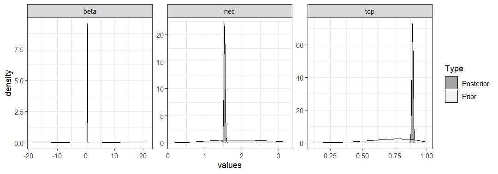

## Overview

The main focus here is to explain the default priors used in `bayesnec` and to showcase how the user can interrogate the priors used in a `bayesec` model and alternatively specify their own priors, should they wish to. This might be needed depending on the model and the data because `bayesnec` tries to find reasonable and yet only weakly informative priors for the model parameters by default. First we describe the default priors used in `bayesnec` and then follow up with a demonstration of how the user can specify priors in multiple ways for objects of class `bayesnecfit` and `bayesmanecfit`.

## Default priors in `bayesnec`

The default priors used in `bayesnec` can generally be considered "weakly informative". They are constructed for each parameter of each model being fitted based on the characteristics of either the input `x_var` or `y_var` data, depending on which is relevant to the specific parameter scaling. In the case of parameters that scale with `y_var` (the response), priors are constructed based on the relevant link scaling, whether that be identity or the default (or user specific) link function for a specific family. The priors are constructed by `bnec` internally calling the function `define_prior`, which takes the arguments `model` , `family` (including the relevant link function), `predictor` (`x_var` data), and `response` (`y_var` data).

### Priors for response (`y_var`) scaled parameters 

Only the parameters **top** and **bot** scale specifically with the response (`y-var` data) family. 
For gaussian `y-dat` (or any `y_var` data for which the link ensures valid values of the response can take from `+Inf` to `-Inf`, including `log` and `logit`) priors are `normal` with a standard deviation of `2.5` and a mean set at the 90th and 10th quantiles for **top** and **bot** respectively.
For poisson, negative binomial and gamma `y_var` data the response is bounded by `0` and thus priors are `Gamma`, with a mean scaled to correspond to the 75th and 25th quantiles for **top** and **bot** respectively. The mean is linked mathematically to the shape (s) and rate parameters (r) by the equation  $$ mean = s * (1/r) $$ with the gamma shape parameter set at 2.
For the binomial, beta, and beta binomial families estimates for **top** and **bot** must necessarily be constrained between `0` and `1` when modelled on the identity link. Because of this constraint there is no need to adjust scaling based on the response. `bayesnec` uses `beta(5, 1)` and `beta(1, 5)` priors to provide a broad density centred across the upper and lower `0` to `1` range for the **top** and **bot** parameters respectively.

### Priors for predictor (`x_var`) scaled parameters

The parameters **nec** and **ec50** scale with respect to the predictor (`x_var` data), because both of these are parameters in  concentration-response curves the are estimated in units of concentration. To stabilise model fitting the **nec** and **ec50** parameters are bounded to the upper and lower observed range in the predictor, under the assumption that the range of concentrations in the experiment were sufficient to cover the full range of the response outcomes. The priors used reflect the characteristics of the observed data that are used to guess the appropriate family. If the `x_var` data are bounded to `0` and  `>1` a gamma prior is used, with maximum density (mean, see above) at the median value of the predictor, and a shape parameter of 5. If the `x_var` data are bounded to `0` and `1` a `beta(2, 2)` prior is used. For `x_var` data ranging from `-ve` to `+ve` a normal prior is used, with a mean set at the median of the `x_var` values and a standard deviation of 2.5. 

### Priors for other parameters

For the parameters **beta**, **slope**, **d** and **f** we first ensured any relevant transformations in the model formula such that theoretical values of `-Inf` to `+Inf` are allowable, and a `normal(0, 1)` prior is used. For example, for **beta** in the `nec3param` model is an exponential decay parameter, which must by definition be bounded to `0` and `+ve`. Calling `exp(beta)` in the model formula ensures the exponent meets these requirements. Note also that a mean of `0` and sd of `1` represents a relatively broad prior on the exponential scaling. See the **Model details** vignette or `?model("all")` for more information on all the models available in `bayesnec` and their specific formulation. 

## User specified priors

There may be situations were the default `bayesnec` priors to not behave as desired, or the user wants to provide informative priors. For example the default priors may be too informative, yielding unreasonably tight confidence bands, although this is only likely where there are few data. Conversely, priors may be too vague, leading to poor model convergence.  Alternatively, as indicated in the example below under **User specified priors**, the default priors may be of the wrong statistical family if there was insufficient information in the provided data for `bayesnec` to guess correctly the appropriate ones to use.

The priors used in the default model fit can be extracted using `pull_prior`, and a sample or plot of prior values can be obtained from the individual `brms` model fits through the function `samples_priors` which samples directly from the `prior` element in the `brm` model fit. We can also use the function `check_prior` (based on the `hypothesis` function of `brms`) to assess how the posterior probability density for each parameter differs from that of the prior.

### bayesnecfit

To set specified priors, it is simplest to start by letting `bnec` find the priors on its own, i.e. by not specifying a `priors` argument at all.


```r
library(brms)
library(bayesnec)
options(mc.cores = parallel::detectCores())
data(nec_data)

# a single model
exmp_a <- bnec(data = nec_data, x_var = "x", y_var = "y",
               model = "nec3param",
               family = Beta(link = "identity"),
               iter = 1e4, control = list(adapt_delta = 0.99))
#> 
-

\

|

/

-

\

|

/

-

\

|

/

-

\

|

/

-

\

|

/

-

\

|

/

-

\

|

/

-

\

|

/

-

\

|

/

-

\

|

/

-

\

|

/

-

\

|

/

-

\

|

/

-

\

|

/

-

\

|

/

-

\

|

/

-

\

|

/

-

\

|

/

-

\

|

/

-

\

|

/

-

\

|

/

-

\

|

/

-

\

|

/

-

\

|

/

-

\

|

/

-

\

|

/

-

\

|

/

-

\

|

/

-

\

|

/

-

\

|

/

-

\

|

/

-

\

|

/

-

\

|

/

-

\

|

/

-

\

|

/

-

\

|

/

-

\

|

/

-

\

|

/

-

\

|

/

-

\

|

/

-

\

|

/

-

\

|

/

-

\

|

/

-

\

|

/

-

\

|

/

-

\

|

/

-

\

 
Running MCMC with 4 chains, at most 8 in parallel...
#> 
#> Chain 1 Iteration:    1 / 10000 [  0%]  (Warmup) 
#> Chain 2 Iteration:    1 / 10000 [  0%]  (Warmup) 
#> Chain 3 Iteration:    1 / 10000 [  0%]  (Warmup) 
#> Chain 4 Iteration:    1 / 10000 [  0%]  (Warmup) 
#> Chain 2 Iteration:  100 / 10000 [  1%]  (Warmup) 
#> Chain 3 Iteration:  100 / 10000 [  1%]  (Warmup) 
#> Chain 4 Iteration:  100 / 10000 [  1%]  (Warmup) 
#> Chain 1 Iteration:  100 / 10000 [  1%]  (Warmup) 
#> Chain 4 Iteration:  200 / 10000 [  2%]  (Warmup) 
#> Chain 3 Iteration:  200 / 10000 [  2%]  (Warmup) 
#> Chain 4 Iteration:  300 / 10000 [  3%]  (Warmup) 
#> Chain 1 Iteration:  200 / 10000 [  2%]  (Warmup) 
#> Chain 2 Iteration:  200 / 10000 [  2%]  (Warmup) 
#> Chain 4 Iteration:  400 / 10000 [  4%]  (Warmup) 
#> Chain 1 Iteration:  300 / 10000 [  3%]  (Warmup) 
#> Chain 3 Iteration:  300 / 10000 [  3%]  (Warmup) 
#> Chain 2 Iteration:  300 / 10000 [  3%]  (Warmup) 
#> Chain 4 Iteration:  500 / 10000 [  5%]  (Warmup) 
#> Chain 1 Iteration:  400 / 10000 [  4%]  (Warmup) 
#> Chain 2 Iteration:  400 / 10000 [  4%]  (Warmup) 
#> Chain 3 Iteration:  400 / 10000 [  4%]  (Warmup) 
#> Chain 4 Iteration:  600 / 10000 [  6%]  (Warmup) 
#> Chain 1 Iteration:  500 / 10000 [  5%]  (Warmup) 
#> Chain 3 Iteration:  500 / 10000 [  5%]  (Warmup) 
#> Chain 4 Iteration:  700 / 10000 [  7%]  (Warmup) 
#> Chain 2 Iteration:  500 / 10000 [  5%]  (Warmup) 
#> Chain 3 Iteration:  600 / 10000 [  6%]  (Warmup) 
#> Chain 1 Iteration:  600 / 10000 [  6%]  (Warmup) 
#> Chain 1 Iteration:  700 / 10000 [  7%]  (Warmup) 
#> Chain 2 Iteration:  600 / 10000 [  6%]  (Warmup) 
#> Chain 3 Iteration:  700 / 10000 [  7%]  (Warmup) 
#> Chain 4 Iteration:  800 / 10000 [  8%]  (Warmup) 
#> Chain 1 Iteration:  800 / 10000 [  8%]  (Warmup) 
#> Chain 2 Iteration:  700 / 10000 [  7%]  (Warmup) 
#> Chain 3 Iteration:  800 / 10000 [  8%]  (Warmup) 
#> Chain 2 Iteration:  800 / 10000 [  8%]  (Warmup) 
#> Chain 4 Iteration:  900 / 10000 [  9%]  (Warmup) 
#> Chain 1 Iteration:  900 / 10000 [  9%]  (Warmup) 
#> Chain 3 Iteration:  900 / 10000 [  9%]  (Warmup) 
#> Chain 3 Iteration: 1000 / 10000 [ 10%]  (Warmup) 
#> Chain 4 Iteration: 1000 / 10000 [ 10%]  (Warmup) 
#> Chain 1 Iteration: 1000 / 10000 [ 10%]  (Warmup) 
#> Chain 2 Iteration:  900 / 10000 [  9%]  (Warmup) 
#> Chain 3 Iteration: 1100 / 10000 [ 11%]  (Warmup) 
#> Chain 4 Iteration: 1100 / 10000 [ 11%]  (Warmup) 
#> Chain 1 Iteration: 1100 / 10000 [ 11%]  (Warmup) 
#> Chain 4 Iteration: 1200 / 10000 [ 12%]  (Warmup) 
#> Chain 1 Iteration: 1200 / 10000 [ 12%]  (Warmup) 
#> Chain 2 Iteration: 1000 / 10000 [ 10%]  (Warmup) 
#> Chain 3 Iteration: 1200 / 10000 [ 12%]  (Warmup) 
#> Chain 2 Iteration: 1100 / 10000 [ 11%]  (Warmup) 
#> Chain 4 Iteration: 1300 / 10000 [ 13%]  (Warmup) 
#> Chain 1 Iteration: 1300 / 10000 [ 13%]  (Warmup) 
#> Chain 3 Iteration: 1300 / 10000 [ 13%]  (Warmup) 
#> Chain 4 Iteration: 1400 / 10000 [ 14%]  (Warmup) 
#> Chain 2 Iteration: 1200 / 10000 [ 12%]  (Warmup) 
#> Chain 3 Iteration: 1400 / 10000 [ 14%]  (Warmup) 
#> Chain 1 Iteration: 1400 / 10000 [ 14%]  (Warmup) 
#> Chain 4 Iteration: 1500 / 10000 [ 15%]  (Warmup) 
#> Chain 2 Iteration: 1300 / 10000 [ 13%]  (Warmup) 
#> Chain 3 Iteration: 1500 / 10000 [ 15%]  (Warmup) 
#> Chain 1 Iteration: 1500 / 10000 [ 15%]  (Warmup) 
#> Chain 2 Iteration: 1400 / 10000 [ 14%]  (Warmup) 
#> Chain 4 Iteration: 1600 / 10000 [ 16%]  (Warmup) 
#> Chain 3 Iteration: 1600 / 10000 [ 16%]  (Warmup) 
#> Chain 1 Iteration: 1600 / 10000 [ 16%]  (Warmup) 
#> Chain 2 Iteration: 1500 / 10000 [ 15%]  (Warmup) 
#> Chain 1 Iteration: 1700 / 10000 [ 17%]  (Warmup) 
#> Chain 2 Iteration: 1600 / 10000 [ 16%]  (Warmup) 
#> Chain 3 Iteration: 1700 / 10000 [ 17%]  (Warmup) 
#> Chain 4 Iteration: 1700 / 10000 [ 17%]  (Warmup) 
#> Chain 1 Iteration: 1800 / 10000 [ 18%]  (Warmup) 
#> Chain 4 Iteration: 1800 / 10000 [ 18%]  (Warmup) 
#> Chain 2 Iteration: 1700 / 10000 [ 17%]  (Warmup) 
#> Chain 3 Iteration: 1800 / 10000 [ 18%]  (Warmup) 
#> Chain 1 Iteration: 1900 / 10000 [ 19%]  (Warmup) 
#> Chain 3 Iteration: 1900 / 10000 [ 19%]  (Warmup) 
#> Chain 4 Iteration: 1900 / 10000 [ 19%]  (Warmup) 
#> Chain 2 Iteration: 1800 / 10000 [ 18%]  (Warmup) 
#> Chain 4 Iteration: 2000 / 10000 [ 20%]  (Warmup) 
#> Chain 1 Iteration: 2000 / 10000 [ 20%]  (Warmup) 
#> Chain 2 Iteration: 1900 / 10000 [ 19%]  (Warmup) 
#> Chain 3 Iteration: 2000 / 10000 [ 20%]  (Warmup) 
#> Chain 1 Iteration: 2100 / 10000 [ 21%]  (Warmup) 
#> Chain 3 Iteration: 2100 / 10000 [ 21%]  (Warmup) 
#> Chain 4 Iteration: 2100 / 10000 [ 21%]  (Warmup) 
#> Chain 2 Iteration: 2000 / 10000 [ 20%]  (Warmup) 
#> Chain 1 Iteration: 2200 / 10000 [ 22%]  (Warmup) 
#> Chain 3 Iteration: 2200 / 10000 [ 22%]  (Warmup) 
#> Chain 4 Iteration: 2200 / 10000 [ 22%]  (Warmup) 
#> Chain 2 Iteration: 2100 / 10000 [ 21%]  (Warmup) 
#> Chain 4 Iteration: 2300 / 10000 [ 23%]  (Warmup) 
#> Chain 1 Iteration: 2300 / 10000 [ 23%]  (Warmup) 
#> Chain 3 Iteration: 2300 / 10000 [ 23%]  (Warmup) 
#> Chain 2 Iteration: 2200 / 10000 [ 22%]  (Warmup) 
#> Chain 4 Iteration: 2400 / 10000 [ 24%]  (Warmup) 
#> Chain 1 Iteration: 2400 / 10000 [ 24%]  (Warmup) 
#> Chain 2 Iteration: 2300 / 10000 [ 23%]  (Warmup) 
#> Chain 3 Iteration: 2400 / 10000 [ 24%]  (Warmup) 
#> Chain 4 Iteration: 2500 / 10000 [ 25%]  (Warmup) 
#> Chain 1 Iteration: 2500 / 10000 [ 25%]  (Warmup) 
#> Chain 2 Iteration: 2400 / 10000 [ 24%]  (Warmup) 
#> Chain 3 Iteration: 2500 / 10000 [ 25%]  (Warmup) 
#> Chain 1 Iteration: 2600 / 10000 [ 26%]  (Warmup) 
#> Chain 4 Iteration: 2600 / 10000 [ 26%]  (Warmup) 
#> Chain 2 Iteration: 2500 / 10000 [ 25%]  (Warmup) 
#> Chain 3 Iteration: 2600 / 10000 [ 26%]  (Warmup) 
#> Chain 1 Iteration: 2700 / 10000 [ 27%]  (Warmup) 
#> Chain 4 Iteration: 2700 / 10000 [ 27%]  (Warmup) 
#> Chain 2 Iteration: 2600 / 10000 [ 26%]  (Warmup) 
#> Chain 3 Iteration: 2700 / 10000 [ 27%]  (Warmup) 
#> Chain 1 Iteration: 2800 / 10000 [ 28%]  (Warmup) 
#> Chain 4 Iteration: 2800 / 10000 [ 28%]  (Warmup) 
#> Chain 2 Iteration: 2700 / 10000 [ 27%]  (Warmup) 
#> Chain 3 Iteration: 2800 / 10000 [ 28%]  (Warmup) 
#> Chain 4 Iteration: 2900 / 10000 [ 29%]  (Warmup) 
#> Chain 1 Iteration: 2900 / 10000 [ 29%]  (Warmup) 
#> Chain 2 Iteration: 2800 / 10000 [ 28%]  (Warmup) 
#> Chain 3 Iteration: 2900 / 10000 [ 29%]  (Warmup) 
#> Chain 4 Iteration: 3000 / 10000 [ 30%]  (Warmup) 
#> Chain 1 Iteration: 3000 / 10000 [ 30%]  (Warmup) 
#> Chain 2 Iteration: 2900 / 10000 [ 29%]  (Warmup) 
#> Chain 3 Iteration: 3000 / 10000 [ 30%]  (Warmup) 
#> Chain 4 Iteration: 3100 / 10000 [ 31%]  (Warmup) 
#> Chain 1 Iteration: 3100 / 10000 [ 31%]  (Warmup) 
#> Chain 1 Iteration: 3200 / 10000 [ 32%]  (Warmup) 
#> Chain 2 Iteration: 3000 / 10000 [ 30%]  (Warmup) 
#> Chain 3 Iteration: 3100 / 10000 [ 31%]  (Warmup) 
#> Chain 4 Iteration: 3200 / 10000 [ 32%]  (Warmup) 
#> Chain 2 Iteration: 3100 / 10000 [ 31%]  (Warmup) 
#> Chain 3 Iteration: 3200 / 10000 [ 32%]  (Warmup) 
#> Chain 4 Iteration: 3300 / 10000 [ 33%]  (Warmup) 
#> Chain 1 Iteration: 3300 / 10000 [ 33%]  (Warmup) 
#> Chain 2 Iteration: 3200 / 10000 [ 32%]  (Warmup) 
#> Chain 4 Iteration: 3400 / 10000 [ 34%]  (Warmup) 
#> Chain 1 Iteration: 3400 / 10000 [ 34%]  (Warmup) 
#> Chain 3 Iteration: 3300 / 10000 [ 33%]  (Warmup) 
#> Chain 2 Iteration: 3300 / 10000 [ 33%]  (Warmup) 
#> Chain 4 Iteration: 3500 / 10000 [ 35%]  (Warmup) 
#> Chain 1 Iteration: 3500 / 10000 [ 35%]  (Warmup) 
#> Chain 2 Iteration: 3400 / 10000 [ 34%]  (Warmup) 
#> Chain 3 Iteration: 3400 / 10000 [ 34%]  (Warmup) 
#> Chain 4 Iteration: 3600 / 10000 [ 36%]  (Warmup) 
#> Chain 1 Iteration: 3600 / 10000 [ 36%]  (Warmup) 
#> Chain 2 Iteration: 3500 / 10000 [ 35%]  (Warmup) 
#> Chain 3 Iteration: 3500 / 10000 [ 35%]  (Warmup) 
#> Chain 4 Iteration: 3700 / 10000 [ 37%]  (Warmup) 
#> Chain 1 Iteration: 3700 / 10000 [ 37%]  (Warmup) 
#> Chain 3 Iteration: 3600 / 10000 [ 36%]  (Warmup) 
#> Chain 2 Iteration: 3600 / 10000 [ 36%]  (Warmup) 
#> Chain 4 Iteration: 3800 / 10000 [ 38%]  (Warmup) 
#> Chain 1 Iteration: 3800 / 10000 [ 38%]  (Warmup) 
#> Chain 3 Iteration: 3700 / 10000 [ 37%]  (Warmup) 
#> Chain 2 Iteration: 3700 / 10000 [ 37%]  (Warmup) 
#> Chain 4 Iteration: 3900 / 10000 [ 39%]  (Warmup) 
#> Chain 1 Iteration: 3900 / 10000 [ 39%]  (Warmup) 
#> Chain 3 Iteration: 3800 / 10000 [ 38%]  (Warmup) 
#> Chain 4 Iteration: 4000 / 10000 [ 40%]  (Warmup) 
#> Chain 2 Iteration: 3800 / 10000 [ 38%]  (Warmup) 
#> Chain 1 Iteration: 4000 / 10000 [ 40%]  (Warmup) 
#> Chain 2 Iteration: 3900 / 10000 [ 39%]  (Warmup) 
#> Chain 3 Iteration: 3900 / 10000 [ 39%]  (Warmup) 
#> Chain 4 Iteration: 4100 / 10000 [ 41%]  (Warmup) 
#> Chain 1 Iteration: 4100 / 10000 [ 41%]  (Warmup) 
#> Chain 2 Iteration: 4000 / 10000 [ 40%]  (Warmup) 
#> Chain 3 Iteration: 4000 / 10000 [ 40%]  (Warmup) 
#> Chain 4 Iteration: 4200 / 10000 [ 42%]  (Warmup) 
#> Chain 1 Iteration: 4200 / 10000 [ 42%]  (Warmup) 
#> Chain 2 Iteration: 4100 / 10000 [ 41%]  (Warmup) 
#> Chain 3 Iteration: 4100 / 10000 [ 41%]  (Warmup) 
#> Chain 4 Iteration: 4300 / 10000 [ 43%]  (Warmup) 
#> Chain 1 Iteration: 4300 / 10000 [ 43%]  (Warmup) 
#> Chain 3 Iteration: 4200 / 10000 [ 42%]  (Warmup) 
#> Chain 2 Iteration: 4200 / 10000 [ 42%]  (Warmup) 
#> Chain 4 Iteration: 4400 / 10000 [ 44%]  (Warmup) 
#> Chain 1 Iteration: 4400 / 10000 [ 44%]  (Warmup) 
#> Chain 3 Iteration: 4300 / 10000 [ 43%]  (Warmup) 
#> Chain 1 Iteration: 4500 / 10000 [ 45%]  (Warmup) 
#> Chain 2 Iteration: 4300 / 10000 [ 43%]  (Warmup) 
#> Chain 4 Iteration: 4500 / 10000 [ 45%]  (Warmup) 
#> Chain 3 Iteration: 4400 / 10000 [ 44%]  (Warmup) 
#> Chain 1 Iteration: 4600 / 10000 [ 46%]  (Warmup) 
#> Chain 2 Iteration: 4400 / 10000 [ 44%]  (Warmup) 
#> Chain 4 Iteration: 4600 / 10000 [ 46%]  (Warmup) 
#> Chain 3 Iteration: 4500 / 10000 [ 45%]  (Warmup) 
#> Chain 1 Iteration: 4700 / 10000 [ 47%]  (Warmup) 
#> Chain 2 Iteration: 4500 / 10000 [ 45%]  (Warmup) 
#> Chain 4 Iteration: 4700 / 10000 [ 47%]  (Warmup) 
#> Chain 3 Iteration: 4600 / 10000 [ 46%]  (Warmup) 
#> Chain 4 Iteration: 4800 / 10000 [ 48%]  (Warmup) 
#> Chain 1 Iteration: 4800 / 10000 [ 48%]  (Warmup) 
#> Chain 2 Iteration: 4600 / 10000 [ 46%]  (Warmup) 
#> Chain 3 Iteration: 4700 / 10000 [ 47%]  (Warmup) 
#> Chain 4 Iteration: 4900 / 10000 [ 49%]  (Warmup) 
#> Chain 1 Iteration: 4900 / 10000 [ 49%]  (Warmup) 
#> Chain 2 Iteration: 4700 / 10000 [ 47%]  (Warmup) 
#> Chain 3 Iteration: 4800 / 10000 [ 48%]  (Warmup) 
#> Chain 2 Iteration: 4800 / 10000 [ 48%]  (Warmup) 
#> Chain 4 Iteration: 5000 / 10000 [ 50%]  (Warmup) 
#> Chain 1 Iteration: 5000 / 10000 [ 50%]  (Warmup) 
#> Chain 3 Iteration: 4900 / 10000 [ 49%]  (Warmup) 
#> Chain 1 Iteration: 5100 / 10000 [ 51%]  (Warmup) 
#> Chain 2 Iteration: 4900 / 10000 [ 49%]  (Warmup) 
#> Chain 4 Iteration: 5100 / 10000 [ 51%]  (Warmup) 
#> Chain 3 Iteration: 5000 / 10000 [ 50%]  (Warmup) 
#> Chain 1 Iteration: 5200 / 10000 [ 52%]  (Warmup) 
#> Chain 2 Iteration: 5000 / 10000 [ 50%]  (Warmup) 
#> Chain 4 Iteration: 5200 / 10000 [ 52%]  (Warmup) 
#> Chain 3 Iteration: 5100 / 10000 [ 51%]  (Warmup) 
#> Chain 1 Iteration: 5300 / 10000 [ 53%]  (Warmup) 
#> Chain 2 Iteration: 5100 / 10000 [ 51%]  (Warmup) 
#> Chain 4 Iteration: 5300 / 10000 [ 53%]  (Warmup) 
#> Chain 3 Iteration: 5200 / 10000 [ 52%]  (Warmup) 
#> Chain 4 Iteration: 5400 / 10000 [ 54%]  (Warmup) 
#> Chain 1 Iteration: 5400 / 10000 [ 54%]  (Warmup) 
#> Chain 2 Iteration: 5200 / 10000 [ 52%]  (Warmup) 
#> Chain 1 Iteration: 5500 / 10000 [ 55%]  (Warmup) 
#> Chain 3 Iteration: 5300 / 10000 [ 53%]  (Warmup) 
#> Chain 4 Iteration: 5500 / 10000 [ 55%]  (Warmup) 
#> Chain 1 Iteration: 5600 / 10000 [ 56%]  (Warmup) 
#> Chain 2 Iteration: 5300 / 10000 [ 53%]  (Warmup) 
#> Chain 3 Iteration: 5400 / 10000 [ 54%]  (Warmup) 
#> Chain 4 Iteration: 5600 / 10000 [ 56%]  (Warmup) 
#> Chain 1 Iteration: 5700 / 10000 [ 57%]  (Warmup) 
#> Chain 2 Iteration: 5400 / 10000 [ 54%]  (Warmup) 
#> Chain 3 Iteration: 5500 / 10000 [ 55%]  (Warmup) 
#> Chain 4 Iteration: 5700 / 10000 [ 57%]  (Warmup) 
#> Chain 1 Iteration: 5800 / 10000 [ 58%]  (Warmup) 
#> Chain 2 Iteration: 5500 / 10000 [ 55%]  (Warmup) 
#> Chain 3 Iteration: 5600 / 10000 [ 56%]  (Warmup) 
#> Chain 4 Iteration: 5800 / 10000 [ 58%]  (Warmup) 
#> Chain 1 Iteration: 5900 / 10000 [ 59%]  (Warmup) 
#> Chain 2 Iteration: 5600 / 10000 [ 56%]  (Warmup) 
#> Chain 3 Iteration: 5700 / 10000 [ 57%]  (Warmup) 
#> Chain 4 Iteration: 5900 / 10000 [ 59%]  (Warmup) 
#> Chain 1 Iteration: 6000 / 10000 [ 60%]  (Warmup) 
#> Chain 2 Iteration: 5700 / 10000 [ 57%]  (Warmup) 
#> Chain 3 Iteration: 5800 / 10000 [ 58%]  (Warmup) 
#> Chain 4 Iteration: 6000 / 10000 [ 60%]  (Warmup) 
#> Chain 1 Iteration: 6100 / 10000 [ 61%]  (Warmup) 
#> Chain 2 Iteration: 5800 / 10000 [ 58%]  (Warmup) 
#> Chain 3 Iteration: 5900 / 10000 [ 59%]  (Warmup) 
#> Chain 4 Iteration: 6100 / 10000 [ 61%]  (Warmup) 
#> Chain 1 Iteration: 6200 / 10000 [ 62%]  (Warmup) 
#> Chain 2 Iteration: 5900 / 10000 [ 59%]  (Warmup) 
#> Chain 3 Iteration: 6000 / 10000 [ 60%]  (Warmup) 
#> Chain 4 Iteration: 6200 / 10000 [ 62%]  (Warmup) 
#> Chain 1 Iteration: 6300 / 10000 [ 63%]  (Warmup) 
#> Chain 2 Iteration: 6000 / 10000 [ 60%]  (Warmup) 
#> Chain 3 Iteration: 6100 / 10000 [ 61%]  (Warmup) 
#> Chain 4 Iteration: 6300 / 10000 [ 63%]  (Warmup) 
#> Chain 1 Iteration: 6400 / 10000 [ 64%]  (Warmup) 
#> Chain 2 Iteration: 6100 / 10000 [ 61%]  (Warmup) 
#> Chain 3 Iteration: 6200 / 10000 [ 62%]  (Warmup) 
#> Chain 4 Iteration: 6400 / 10000 [ 64%]  (Warmup) 
#> Chain 1 Iteration: 6500 / 10000 [ 65%]  (Warmup) 
#> Chain 2 Iteration: 6200 / 10000 [ 62%]  (Warmup) 
#> Chain 3 Iteration: 6300 / 10000 [ 63%]  (Warmup) 
#> Chain 4 Iteration: 6500 / 10000 [ 65%]  (Warmup) 
#> Chain 1 Iteration: 6600 / 10000 [ 66%]  (Warmup) 
#> Chain 2 Iteration: 6300 / 10000 [ 63%]  (Warmup) 
#> Chain 3 Iteration: 6400 / 10000 [ 64%]  (Warmup) 
#> Chain 4 Iteration: 6600 / 10000 [ 66%]  (Warmup) 
#> Chain 1 Iteration: 6700 / 10000 [ 67%]  (Warmup) 
#> Chain 3 Iteration: 6500 / 10000 [ 65%]  (Warmup) 
#> Chain 2 Iteration: 6400 / 10000 [ 64%]  (Warmup) 
#> Chain 4 Iteration: 6700 / 10000 [ 67%]  (Warmup) 
#> Chain 3 Iteration: 6600 / 10000 [ 66%]  (Warmup) 
#> Chain 1 Iteration: 6800 / 10000 [ 68%]  (Warmup) 
#> Chain 2 Iteration: 6500 / 10000 [ 65%]  (Warmup) 
#> Chain 4 Iteration: 6800 / 10000 [ 68%]  (Warmup) 
#> Chain 3 Iteration: 6700 / 10000 [ 67%]  (Warmup) 
#> Chain 4 Iteration: 6900 / 10000 [ 69%]  (Warmup) 
#> Chain 1 Iteration: 6900 / 10000 [ 69%]  (Warmup) 
#> Chain 2 Iteration: 6600 / 10000 [ 66%]  (Warmup) 
#> Chain 3 Iteration: 6800 / 10000 [ 68%]  (Warmup) 
#> Chain 4 Iteration: 7000 / 10000 [ 70%]  (Warmup) 
#> Chain 1 Iteration: 7000 / 10000 [ 70%]  (Warmup) 
#> Chain 2 Iteration: 6700 / 10000 [ 67%]  (Warmup) 
#> Chain 3 Iteration: 6900 / 10000 [ 69%]  (Warmup) 
#> Chain 1 Iteration: 7100 / 10000 [ 71%]  (Warmup) 
#> Chain 4 Iteration: 7100 / 10000 [ 71%]  (Warmup) 
#> Chain 2 Iteration: 6800 / 10000 [ 68%]  (Warmup) 
#> Chain 3 Iteration: 7000 / 10000 [ 70%]  (Warmup) 
#> Chain 1 Iteration: 7200 / 10000 [ 72%]  (Warmup) 
#> Chain 4 Iteration: 7200 / 10000 [ 72%]  (Warmup) 
#> Chain 2 Iteration: 6900 / 10000 [ 69%]  (Warmup) 
#> Chain 3 Iteration: 7100 / 10000 [ 71%]  (Warmup) 
#> Chain 1 Iteration: 7300 / 10000 [ 73%]  (Warmup) 
#> Chain 2 Iteration: 7000 / 10000 [ 70%]  (Warmup) 
#> Chain 4 Iteration: 7300 / 10000 [ 73%]  (Warmup) 
#> Chain 3 Iteration: 7200 / 10000 [ 72%]  (Warmup) 
#> Chain 1 Iteration: 7400 / 10000 [ 74%]  (Warmup) 
#> Chain 4 Iteration: 7400 / 10000 [ 74%]  (Warmup) 
#> Chain 2 Iteration: 7100 / 10000 [ 71%]  (Warmup) 
#> Chain 3 Iteration: 7300 / 10000 [ 73%]  (Warmup) 
#> Chain 1 Iteration: 7500 / 10000 [ 75%]  (Warmup) 
#> Chain 2 Iteration: 7200 / 10000 [ 72%]  (Warmup) 
#> Chain 4 Iteration: 7500 / 10000 [ 75%]  (Warmup) 
#> Chain 3 Iteration: 7400 / 10000 [ 74%]  (Warmup) 
#> Chain 1 Iteration: 7600 / 10000 [ 76%]  (Warmup) 
#> Chain 2 Iteration: 7300 / 10000 [ 73%]  (Warmup) 
#> Chain 4 Iteration: 7600 / 10000 [ 76%]  (Warmup) 
#> Chain 3 Iteration: 7500 / 10000 [ 75%]  (Warmup) 
#> Chain 1 Iteration: 7700 / 10000 [ 77%]  (Warmup) 
#> Chain 2 Iteration: 7400 / 10000 [ 74%]  (Warmup) 
#> Chain 4 Iteration: 7700 / 10000 [ 77%]  (Warmup) 
#> Chain 3 Iteration: 7600 / 10000 [ 76%]  (Warmup) 
#> Chain 1 Iteration: 7800 / 10000 [ 78%]  (Warmup) 
#> Chain 4 Iteration: 7800 / 10000 [ 78%]  (Warmup) 
#> Chain 1 Iteration: 7900 / 10000 [ 79%]  (Warmup) 
#> Chain 2 Iteration: 7500 / 10000 [ 75%]  (Warmup) 
#> Chain 3 Iteration: 7700 / 10000 [ 77%]  (Warmup) 
#> Chain 4 Iteration: 7900 / 10000 [ 79%]  (Warmup) 
#> Chain 1 Iteration: 8000 / 10000 [ 80%]  (Warmup) 
#> Chain 2 Iteration: 7600 / 10000 [ 76%]  (Warmup) 
#> Chain 3 Iteration: 7800 / 10000 [ 78%]  (Warmup) 
#> Chain 3 Iteration: 7900 / 10000 [ 79%]  (Warmup) 
#> Chain 4 Iteration: 8000 / 10000 [ 80%]  (Warmup) 
#> Chain 1 Iteration: 8100 / 10000 [ 81%]  (Warmup) 
#> Chain 2 Iteration: 7700 / 10000 [ 77%]  (Warmup) 
#> Chain 3 Iteration: 8000 / 10000 [ 80%]  (Warmup) 
#> Chain 4 Iteration: 8100 / 10000 [ 81%]  (Warmup) 
#> Chain 1 Iteration: 8200 / 10000 [ 82%]  (Warmup) 
#> Chain 2 Iteration: 7800 / 10000 [ 78%]  (Warmup) 
#> Chain 4 Iteration: 8200 / 10000 [ 82%]  (Warmup) 
#> Chain 1 Iteration: 8300 / 10000 [ 83%]  (Warmup) 
#> Chain 2 Iteration: 7900 / 10000 [ 79%]  (Warmup) 
#> Chain 3 Iteration: 8100 / 10000 [ 81%]  (Warmup) 
#> Chain 4 Iteration: 8300 / 10000 [ 83%]  (Warmup) 
#> Chain 1 Iteration: 8400 / 10000 [ 84%]  (Warmup) 
#> Chain 2 Iteration: 8000 / 10000 [ 80%]  (Warmup) 
#> Chain 3 Iteration: 8200 / 10000 [ 82%]  (Warmup) 
#> Chain 3 Iteration: 8300 / 10000 [ 83%]  (Warmup) 
#> Chain 4 Iteration: 8400 / 10000 [ 84%]  (Warmup) 
#> Chain 1 Iteration: 8500 / 10000 [ 85%]  (Warmup) 
#> Chain 2 Iteration: 8100 / 10000 [ 81%]  (Warmup) 
#> Chain 4 Iteration: 8500 / 10000 [ 85%]  (Warmup) 
#> Chain 3 Iteration: 8400 / 10000 [ 84%]  (Warmup) 
#> Chain 1 Iteration: 8600 / 10000 [ 86%]  (Warmup) 
#> Chain 2 Iteration: 8200 / 10000 [ 82%]  (Warmup) 
#> Chain 3 Iteration: 8500 / 10000 [ 85%]  (Warmup) 
#> Chain 4 Iteration: 8600 / 10000 [ 86%]  (Warmup) 
#> Chain 1 Iteration: 8700 / 10000 [ 87%]  (Warmup) 
#> Chain 2 Iteration: 8300 / 10000 [ 83%]  (Warmup) 
#> Chain 4 Iteration: 8700 / 10000 [ 87%]  (Warmup) 
#> Chain 1 Iteration: 8800 / 10000 [ 88%]  (Warmup) 
#> Chain 2 Iteration: 8400 / 10000 [ 84%]  (Warmup) 
#> Chain 3 Iteration: 8600 / 10000 [ 86%]  (Warmup) 
#> Chain 1 Iteration: 8900 / 10000 [ 89%]  (Warmup) 
#> Chain 4 Iteration: 8800 / 10000 [ 88%]  (Warmup) 
#> Chain 3 Iteration: 8700 / 10000 [ 87%]  (Warmup) 
#> Chain 1 Iteration: 9000 / 10000 [ 90%]  (Warmup) 
#> Chain 2 Iteration: 8500 / 10000 [ 85%]  (Warmup) 
#> Chain 4 Iteration: 8900 / 10000 [ 89%]  (Warmup) 
#> Chain 1 Iteration: 9001 / 10000 [ 90%]  (Sampling) 
#> Chain 3 Iteration: 8800 / 10000 [ 88%]  (Warmup) 
#> Chain 1 Iteration: 9100 / 10000 [ 91%]  (Sampling) 
#> Chain 2 Iteration: 8600 / 10000 [ 86%]  (Warmup) 
#> Chain 2 Iteration: 8700 / 10000 [ 87%]  (Warmup) 
#> Chain 3 Iteration: 8900 / 10000 [ 89%]  (Warmup) 
#> Chain 4 Iteration: 9000 / 10000 [ 90%]  (Warmup) 
#> Chain 1 Iteration: 9200 / 10000 [ 92%]  (Sampling) 
#> Chain 4 Iteration: 9001 / 10000 [ 90%]  (Sampling) 
#> Chain 1 Iteration: 9300 / 10000 [ 93%]  (Sampling) 
#> Chain 2 Iteration: 8800 / 10000 [ 88%]  (Warmup) 
#> Chain 3 Iteration: 9000 / 10000 [ 90%]  (Warmup) 
#> Chain 1 Iteration: 9400 / 10000 [ 94%]  (Sampling) 
#> Chain 3 Iteration: 9001 / 10000 [ 90%]  (Sampling) 
#> Chain 4 Iteration: 9100 / 10000 [ 91%]  (Sampling) 
#> Chain 2 Iteration: 8900 / 10000 [ 89%]  (Warmup) 
#> Chain 3 Iteration: 9100 / 10000 [ 91%]  (Sampling) 
#> Chain 1 Iteration: 9500 / 10000 [ 95%]  (Sampling) 
#> Chain 1 Iteration: 9600 / 10000 [ 96%]  (Sampling) 
#> Chain 3 Iteration: 9200 / 10000 [ 92%]  (Sampling) 
#> Chain 4 Iteration: 9200 / 10000 [ 92%]  (Sampling) 
#> Chain 2 Iteration: 9000 / 10000 [ 90%]  (Warmup) 
#> Chain 1 Iteration: 9700 / 10000 [ 97%]  (Sampling) 
#> Chain 2 Iteration: 9001 / 10000 [ 90%]  (Sampling) 
#> Chain 3 Iteration: 9300 / 10000 [ 93%]  (Sampling) 
#> Chain 4 Iteration: 9300 / 10000 [ 93%]  (Sampling) 
#> Chain 1 Iteration: 9800 / 10000 [ 98%]  (Sampling) 
#> Chain 2 Iteration: 9100 / 10000 [ 91%]  (Sampling) 
#> Chain 3 Iteration: 9400 / 10000 [ 94%]  (Sampling) 
#> Chain 1 Iteration: 9900 / 10000 [ 99%]  (Sampling) 
#> Chain 2 Iteration: 9200 / 10000 [ 92%]  (Sampling) 
#> Chain 4 Iteration: 9400 / 10000 [ 94%]  (Sampling) 
#> Chain 1 Iteration: 10000 / 10000 [100%]  (Sampling) 
#> Chain 3 Iteration: 9500 / 10000 [ 95%]  (Sampling) 
#> Chain 1 finished in 23.0 seconds.
#> Chain 2 Iteration: 9300 / 10000 [ 93%]  (Sampling) 
#> Chain 4 Iteration: 9500 / 10000 [ 95%]  (Sampling) 
#> Chain 3 Iteration: 9600 / 10000 [ 96%]  (Sampling) 
#> Chain 2 Iteration: 9400 / 10000 [ 94%]  (Sampling) 
#> Chain 3 Iteration: 9700 / 10000 [ 97%]  (Sampling) 
#> Chain 4 Iteration: 9600 / 10000 [ 96%]  (Sampling) 
#> Chain 2 Iteration: 9500 / 10000 [ 95%]  (Sampling) 
#> Chain 3 Iteration: 9800 / 10000 [ 98%]  (Sampling) 
#> Chain 3 Iteration: 9900 / 10000 [ 99%]  (Sampling) 
#> Chain 4 Iteration: 9700 / 10000 [ 97%]  (Sampling) 
#> Chain 2 Iteration: 9600 / 10000 [ 96%]  (Sampling) 
#> Chain 3 Iteration: 10000 / 10000 [100%]  (Sampling) 
#> Chain 3 finished in 23.9 seconds.
#> Chain 2 Iteration: 9700 / 10000 [ 97%]  (Sampling) 
#> Chain 4 Iteration: 9800 / 10000 [ 98%]  (Sampling) 
#> Chain 2 Iteration: 9800 / 10000 [ 98%]  (Sampling) 
#> Chain 4 Iteration: 9900 / 10000 [ 99%]  (Sampling) 
#> Chain 2 Iteration: 9900 / 10000 [ 99%]  (Sampling) 
#> Chain 4 Iteration: 10000 / 10000 [100%]  (Sampling) 
#> Chain 4 finished in 24.4 seconds.
#> Chain 2 Iteration: 10000 / 10000 [100%]  (Sampling) 
#> Chain 2 finished in 24.7 seconds.
#> 
#> All 4 chains finished successfully.
#> Mean chain execution time: 24.0 seconds.
#> Total execution time: 25.3 seconds.

class(exmp_a)
#> [1] "bayesnecfit"
```

We can view the prior and posterior probability densities of all the parameters in the model using the function `check_prior`, based on the `hypothesis` function of `brms`. This can be useful to assess if priors are suitably vague, and/or if they might be having an undesirable influence on the posterior.


```r
check_priors(exmp_a)
```



In this case the priors seem reasonably vague, however there will be times when it is necessary to modify these priors. The user can take advantage of the function `pull_prior` to inspect what `bnec` came up with on its own, and decide how best to modify those priors to be more desirable.


```r
pull_prior(exmp_a)
#>                       prior class      coef group resp dpar nlpar
#>                normal(0, 2)     b                            beta
#>                normal(0, 2)     b Intercept                  beta
#>  gamma(5, 2.28313180499098)     b                             nec
#>  gamma(5, 2.28313180499098)     b Intercept                   nec
#>                  beta(5, 1)     b                             top
#>                  beta(5, 1)     b Intercept                   top
#>           gamma(0.01, 0.01)   phi                                
#>                                            bound       source
#>                                                          user
#>                                                  (vectorized)
#>  <lower=0.03234801324009,upper=3.22051966293556>         user
#>                                                  (vectorized)
#>                                <lower=0,upper=1>         user
#>                                                  (vectorized)
#>                                                       default
```

`bnec` chose a `gamma` prior on the NEC parameter of `nec3param` because the x predictor in the data `nec_data` is non-zero positive. However imagine that in theory the x predictor could have had negative values, it just happened to not have in this particular dataset. So let's go ahead and specify something else, say a normal with larger variance.


```r
my_prior <- c(prior_string("beta(5, 1)", nlpar = "top"),
              prior_string("normal(1.3, 2.7)", nlpar = "nec"),
              prior_string("gamma(0.5, 2)", nlpar = "beta"))

exmp_b <- bnec(data = nec_data, x_var = "x", y_var = "y",
               model = "nec3param", priors = my_prior,
               family = Beta(link = "identity"),
               iter = 1e4, control = list(adapt_delta = 0.99))
#> 
-

\

|

/

-

\

|

/

-

\

|

/

-

\

|

/

-

\

|

/

-

\

|

/

-

\

|

/

-

\

|

/

-

\

|

/

-

\

|

/

-

\

|

/

-

\

|

/

-

\

|

/

-

\

|

/

-

\

|

/

-

\

|

/

-

\

|

/

-

\

|

/

-

\

|

/

-

\

|

/

-

\

|

/

-

\

|

/

-

\

|

/

-

\

|

/

-

\

|

/

-

\

|

/

-

\

|

/

-

\

|

/

-

\

|

/

-

\

|

/

-

\

|

/

-

\

|

/

-

\

|

/

-

\

|

/

-

\

|

/

-

\

|

/

-

\

|

/

-

\

|

/

-

\

|

/

-

\

|

/

-

\

|

/

-

\

|

/

-

\

|

/

-

\

|

/

-

\

|

/

-

\

 
Running MCMC with 4 chains, at most 8 in parallel...
#> 
#> Chain 1 Iteration:    1 / 10000 [  0%]  (Warmup) 
#> Chain 2 Iteration:    1 / 10000 [  0%]  (Warmup) 
#> Chain 3 Iteration:    1 / 10000 [  0%]  (Warmup) 
#> Chain 4 Iteration:    1 / 10000 [  0%]  (Warmup) 
#> Chain 1 Iteration:  100 / 10000 [  1%]  (Warmup) 
#> Chain 2 Iteration:  100 / 10000 [  1%]  (Warmup) 
#> Chain 4 Iteration:  100 / 10000 [  1%]  (Warmup) 
#> Chain 2 Iteration:  200 / 10000 [  2%]  (Warmup) 
#> Chain 3 Iteration:  100 / 10000 [  1%]  (Warmup) 
#> Chain 1 Iteration:  200 / 10000 [  2%]  (Warmup) 
#> Chain 2 Iteration:  300 / 10000 [  3%]  (Warmup) 
#> Chain 1 Iteration:  300 / 10000 [  3%]  (Warmup) 
#> Chain 2 Iteration:  400 / 10000 [  4%]  (Warmup) 
#> Chain 4 Iteration:  200 / 10000 [  2%]  (Warmup) 
#> Chain 1 Iteration:  400 / 10000 [  4%]  (Warmup) 
#> Chain 2 Iteration:  500 / 10000 [  5%]  (Warmup) 
#> Chain 2 Iteration:  600 / 10000 [  6%]  (Warmup) 
#> Chain 1 Iteration:  500 / 10000 [  5%]  (Warmup) 
#> Chain 2 Iteration:  700 / 10000 [  7%]  (Warmup) 
#> Chain 1 Iteration:  600 / 10000 [  6%]  (Warmup) 
#> Chain 2 Iteration:  800 / 10000 [  8%]  (Warmup) 
#> Chain 4 Iteration:  300 / 10000 [  3%]  (Warmup) 
#> Chain 3 Iteration:  200 / 10000 [  2%]  (Warmup) 
#> Chain 1 Iteration:  700 / 10000 [  7%]  (Warmup) 
#> Chain 2 Iteration:  900 / 10000 [  9%]  (Warmup) 
#> Chain 2 Iteration: 1000 / 10000 [ 10%]  (Warmup) 
#> Chain 1 Iteration:  800 / 10000 [  8%]  (Warmup) 
#> Chain 1 Iteration:  900 / 10000 [  9%]  (Warmup) 
#> Chain 2 Iteration: 1100 / 10000 [ 11%]  (Warmup) 
#> Chain 1 Iteration: 1000 / 10000 [ 10%]  (Warmup) 
#> Chain 2 Iteration: 1200 / 10000 [ 12%]  (Warmup) 
#> Chain 1 Iteration: 1100 / 10000 [ 11%]  (Warmup) 
#> Chain 2 Iteration: 1300 / 10000 [ 13%]  (Warmup) 
#> Chain 4 Iteration:  400 / 10000 [  4%]  (Warmup) 
#> Chain 1 Iteration: 1200 / 10000 [ 12%]  (Warmup) 
#> Chain 2 Iteration: 1400 / 10000 [ 14%]  (Warmup) 
#> Chain 1 Iteration: 1300 / 10000 [ 13%]  (Warmup) 
#> Chain 2 Iteration: 1500 / 10000 [ 15%]  (Warmup) 
#> Chain 1 Iteration: 1400 / 10000 [ 14%]  (Warmup) 
#> Chain 3 Iteration:  300 / 10000 [  3%]  (Warmup) 
#> Chain 2 Iteration: 1600 / 10000 [ 16%]  (Warmup) 
#> Chain 1 Iteration: 1500 / 10000 [ 15%]  (Warmup) 
#> Chain 1 Iteration: 1600 / 10000 [ 16%]  (Warmup) 
#> Chain 2 Iteration: 1700 / 10000 [ 17%]  (Warmup) 
#> Chain 2 Iteration: 1800 / 10000 [ 18%]  (Warmup) 
#> Chain 1 Iteration: 1700 / 10000 [ 17%]  (Warmup) 
#> Chain 2 Iteration: 1900 / 10000 [ 19%]  (Warmup) 
#> Chain 1 Iteration: 1800 / 10000 [ 18%]  (Warmup) 
#> Chain 2 Iteration: 2000 / 10000 [ 20%]  (Warmup) 
#> Chain 1 Iteration: 1900 / 10000 [ 19%]  (Warmup) 
#> Chain 2 Iteration: 2100 / 10000 [ 21%]  (Warmup) 
#> Chain 1 Iteration: 2000 / 10000 [ 20%]  (Warmup) 
#> Chain 2 Iteration: 2200 / 10000 [ 22%]  (Warmup) 
#> Chain 1 Iteration: 2100 / 10000 [ 21%]  (Warmup) 
#> Chain 2 Iteration: 2300 / 10000 [ 23%]  (Warmup) 
#> Chain 1 Iteration: 2200 / 10000 [ 22%]  (Warmup) 
#> Chain 2 Iteration: 2400 / 10000 [ 24%]  (Warmup) 
#> Chain 1 Iteration: 2300 / 10000 [ 23%]  (Warmup) 
#> Chain 1 Iteration: 2400 / 10000 [ 24%]  (Warmup) 
#> Chain 2 Iteration: 2500 / 10000 [ 25%]  (Warmup) 
#> Chain 4 Iteration:  500 / 10000 [  5%]  (Warmup) 
#> Chain 1 Iteration: 2500 / 10000 [ 25%]  (Warmup) 
#> Chain 2 Iteration: 2600 / 10000 [ 26%]  (Warmup) 
#> Chain 1 Iteration: 2600 / 10000 [ 26%]  (Warmup) 
#> Chain 2 Iteration: 2700 / 10000 [ 27%]  (Warmup) 
#> Chain 2 Iteration: 2800 / 10000 [ 28%]  (Warmup) 
#> Chain 1 Iteration: 2700 / 10000 [ 27%]  (Warmup) 
#> Chain 2 Iteration: 2900 / 10000 [ 29%]  (Warmup) 
#> Chain 1 Iteration: 2800 / 10000 [ 28%]  (Warmup) 
#> Chain 1 Iteration: 2900 / 10000 [ 29%]  (Warmup) 
#> Chain 2 Iteration: 3000 / 10000 [ 30%]  (Warmup) 
#> Chain 3 Iteration:  400 / 10000 [  4%]  (Warmup) 
#> Chain 1 Iteration: 3000 / 10000 [ 30%]  (Warmup) 
#> Chain 2 Iteration: 3100 / 10000 [ 31%]  (Warmup) 
#> Chain 2 Iteration: 3200 / 10000 [ 32%]  (Warmup) 
#> Chain 1 Iteration: 3100 / 10000 [ 31%]  (Warmup) 
#> Chain 1 Iteration: 3200 / 10000 [ 32%]  (Warmup) 
#> Chain 2 Iteration: 3300 / 10000 [ 33%]  (Warmup) 
#> Chain 1 Iteration: 3300 / 10000 [ 33%]  (Warmup) 
#> Chain 2 Iteration: 3400 / 10000 [ 34%]  (Warmup) 
#> Chain 2 Iteration: 3500 / 10000 [ 35%]  (Warmup) 
#> Chain 1 Iteration: 3400 / 10000 [ 34%]  (Warmup) 
#> Chain 1 Iteration: 3500 / 10000 [ 35%]  (Warmup) 
#> Chain 2 Iteration: 3600 / 10000 [ 36%]  (Warmup) 
#> Chain 1 Iteration: 3600 / 10000 [ 36%]  (Warmup) 
#> Chain 2 Iteration: 3700 / 10000 [ 37%]  (Warmup) 
#> Chain 1 Iteration: 3700 / 10000 [ 37%]  (Warmup) 
#> Chain 2 Iteration: 3800 / 10000 [ 38%]  (Warmup) 
#> Chain 1 Iteration: 3800 / 10000 [ 38%]  (Warmup) 
#> Chain 2 Iteration: 3900 / 10000 [ 39%]  (Warmup) 
#> Chain 1 Iteration: 3900 / 10000 [ 39%]  (Warmup) 
#> Chain 2 Iteration: 4000 / 10000 [ 40%]  (Warmup) 
#> Chain 1 Iteration: 4000 / 10000 [ 40%]  (Warmup) 
#> Chain 2 Iteration: 4100 / 10000 [ 41%]  (Warmup) 
#> Chain 1 Iteration: 4100 / 10000 [ 41%]  (Warmup) 
#> Chain 2 Iteration: 4200 / 10000 [ 42%]  (Warmup) 
#> Chain 3 Iteration:  500 / 10000 [  5%]  (Warmup) 
#> Chain 1 Iteration: 4200 / 10000 [ 42%]  (Warmup) 
#> Chain 2 Iteration: 4300 / 10000 [ 43%]  (Warmup) 
#> Chain 1 Iteration: 4300 / 10000 [ 43%]  (Warmup) 
#> Chain 2 Iteration: 4400 / 10000 [ 44%]  (Warmup) 
#> Chain 1 Iteration: 4400 / 10000 [ 44%]  (Warmup) 
#> Chain 4 Iteration:  600 / 10000 [  6%]  (Warmup) 
#> Chain 2 Iteration: 4500 / 10000 [ 45%]  (Warmup) 
#> Chain 1 Iteration: 4500 / 10000 [ 45%]  (Warmup) 
#> Chain 1 Iteration: 4600 / 10000 [ 46%]  (Warmup) 
#> Chain 2 Iteration: 4600 / 10000 [ 46%]  (Warmup) 
#> Chain 2 Iteration: 4700 / 10000 [ 47%]  (Warmup) 
#> Chain 1 Iteration: 4700 / 10000 [ 47%]  (Warmup) 
#> Chain 2 Iteration: 4800 / 10000 [ 48%]  (Warmup) 
#> Chain 1 Iteration: 4800 / 10000 [ 48%]  (Warmup) 
#> Chain 2 Iteration: 4900 / 10000 [ 49%]  (Warmup) 
#> Chain 1 Iteration: 4900 / 10000 [ 49%]  (Warmup) 
#> Chain 3 Iteration:  600 / 10000 [  6%]  (Warmup) 
#> Chain 2 Iteration: 5000 / 10000 [ 50%]  (Warmup) 
#> Chain 1 Iteration: 5000 / 10000 [ 50%]  (Warmup) 
#> Chain 2 Iteration: 5100 / 10000 [ 51%]  (Warmup) 
#> Chain 4 Iteration:  700 / 10000 [  7%]  (Warmup) 
#> Chain 1 Iteration: 5100 / 10000 [ 51%]  (Warmup) 
#> Chain 2 Iteration: 5200 / 10000 [ 52%]  (Warmup) 
#> Chain 1 Iteration: 5200 / 10000 [ 52%]  (Warmup) 
#> Chain 2 Iteration: 5300 / 10000 [ 53%]  (Warmup) 
#> Chain 1 Iteration: 5300 / 10000 [ 53%]  (Warmup) 
#> Chain 2 Iteration: 5400 / 10000 [ 54%]  (Warmup) 
#> Chain 1 Iteration: 5400 / 10000 [ 54%]  (Warmup) 
#> Chain 2 Iteration: 5500 / 10000 [ 55%]  (Warmup) 
#> Chain 3 Iteration:  700 / 10000 [  7%]  (Warmup) 
#> Chain 1 Iteration: 5500 / 10000 [ 55%]  (Warmup) 
#> Chain 2 Iteration: 5600 / 10000 [ 56%]  (Warmup) 
#> Chain 1 Iteration: 5600 / 10000 [ 56%]  (Warmup) 
#> Chain 2 Iteration: 5700 / 10000 [ 57%]  (Warmup) 
#> Chain 1 Iteration: 5700 / 10000 [ 57%]  (Warmup) 
#> Chain 4 Iteration:  800 / 10000 [  8%]  (Warmup) 
#> Chain 2 Iteration: 5800 / 10000 [ 58%]  (Warmup) 
#> Chain 1 Iteration: 5800 / 10000 [ 58%]  (Warmup) 
#> Chain 2 Iteration: 5900 / 10000 [ 59%]  (Warmup) 
#> Chain 1 Iteration: 5900 / 10000 [ 59%]  (Warmup) 
#> Chain 2 Iteration: 6000 / 10000 [ 60%]  (Warmup) 
#> Chain 1 Iteration: 6000 / 10000 [ 60%]  (Warmup) 
#> Chain 2 Iteration: 6100 / 10000 [ 61%]  (Warmup) 
#> Chain 1 Iteration: 6100 / 10000 [ 61%]  (Warmup) 
#> Chain 2 Iteration: 6200 / 10000 [ 62%]  (Warmup) 
#> Chain 1 Iteration: 6200 / 10000 [ 62%]  (Warmup) 
#> Chain 2 Iteration: 6300 / 10000 [ 63%]  (Warmup) 
#> Chain 4 Iteration:  900 / 10000 [  9%]  (Warmup) 
#> Chain 3 Iteration:  800 / 10000 [  8%]  (Warmup) 
#> Chain 1 Iteration: 6300 / 10000 [ 63%]  (Warmup) 
#> Chain 2 Iteration: 6400 / 10000 [ 64%]  (Warmup) 
#> Chain 1 Iteration: 6400 / 10000 [ 64%]  (Warmup) 
#> Chain 2 Iteration: 6500 / 10000 [ 65%]  (Warmup) 
#> Chain 1 Iteration: 6500 / 10000 [ 65%]  (Warmup) 
#> Chain 2 Iteration: 6600 / 10000 [ 66%]  (Warmup) 
#> Chain 4 Iteration: 1000 / 10000 [ 10%]  (Warmup) 
#> Chain 1 Iteration: 6600 / 10000 [ 66%]  (Warmup) 
#> Chain 2 Iteration: 6700 / 10000 [ 67%]  (Warmup) 
#> Chain 1 Iteration: 6700 / 10000 [ 67%]  (Warmup) 
#> Chain 2 Iteration: 6800 / 10000 [ 68%]  (Warmup) 
#> Chain 3 Iteration:  900 / 10000 [  9%]  (Warmup) 
#> Chain 1 Iteration: 6800 / 10000 [ 68%]  (Warmup) 
#> Chain 2 Iteration: 6900 / 10000 [ 69%]  (Warmup) 
#> Chain 3 Iteration: 1000 / 10000 [ 10%]  (Warmup) 
#> Chain 3 Iteration: 1100 / 10000 [ 11%]  (Warmup) 
#> Chain 1 Iteration: 6900 / 10000 [ 69%]  (Warmup) 
#> Chain 2 Iteration: 7000 / 10000 [ 70%]  (Warmup) 
#> Chain 3 Iteration: 1200 / 10000 [ 12%]  (Warmup) 
#> Chain 4 Iteration: 1100 / 10000 [ 11%]  (Warmup) 
#> Chain 2 Iteration: 7100 / 10000 [ 71%]  (Warmup) 
#> Chain 1 Iteration: 7000 / 10000 [ 70%]  (Warmup) 
#> Chain 3 Iteration: 1300 / 10000 [ 13%]  (Warmup) 
#> Chain 2 Iteration: 7200 / 10000 [ 72%]  (Warmup) 
#> Chain 1 Iteration: 7100 / 10000 [ 71%]  (Warmup) 
#> Chain 3 Iteration: 1400 / 10000 [ 14%]  (Warmup) 
#> Chain 1 Iteration: 7200 / 10000 [ 72%]  (Warmup) 
#> Chain 2 Iteration: 7300 / 10000 [ 73%]  (Warmup) 
#> Chain 3 Iteration: 1500 / 10000 [ 15%]  (Warmup) 
#> Chain 4 Iteration: 1200 / 10000 [ 12%]  (Warmup) 
#> Chain 1 Iteration: 7300 / 10000 [ 73%]  (Warmup) 
#> Chain 2 Iteration: 7400 / 10000 [ 74%]  (Warmup) 
#> Chain 2 Iteration: 7500 / 10000 [ 75%]  (Warmup) 
#> Chain 3 Iteration: 1600 / 10000 [ 16%]  (Warmup) 
#> Chain 1 Iteration: 7400 / 10000 [ 74%]  (Warmup) 
#> Chain 2 Iteration: 7600 / 10000 [ 76%]  (Warmup) 
#> Chain 1 Iteration: 7500 / 10000 [ 75%]  (Warmup) 
#> Chain 3 Iteration: 1700 / 10000 [ 17%]  (Warmup) 
#> Chain 2 Iteration: 7700 / 10000 [ 77%]  (Warmup) 
#> Chain 3 Iteration: 1800 / 10000 [ 18%]  (Warmup) 
#> Chain 4 Iteration: 1300 / 10000 [ 13%]  (Warmup) 
#> Chain 1 Iteration: 7600 / 10000 [ 76%]  (Warmup) 
#> Chain 2 Iteration: 7800 / 10000 [ 78%]  (Warmup) 
#> Chain 3 Iteration: 1900 / 10000 [ 19%]  (Warmup) 
#> Chain 1 Iteration: 7700 / 10000 [ 77%]  (Warmup) 
#> Chain 2 Iteration: 7900 / 10000 [ 79%]  (Warmup) 
#> Chain 3 Iteration: 2000 / 10000 [ 20%]  (Warmup) 
#> Chain 3 Iteration: 2100 / 10000 [ 21%]  (Warmup) 
#> Chain 1 Iteration: 7800 / 10000 [ 78%]  (Warmup) 
#> Chain 2 Iteration: 8000 / 10000 [ 80%]  (Warmup) 
#> Chain 3 Iteration: 2200 / 10000 [ 22%]  (Warmup) 
#> Chain 4 Iteration: 1400 / 10000 [ 14%]  (Warmup) 
#> Chain 1 Iteration: 7900 / 10000 [ 79%]  (Warmup) 
#> Chain 2 Iteration: 8100 / 10000 [ 81%]  (Warmup) 
#> Chain 3 Iteration: 2300 / 10000 [ 23%]  (Warmup) 
#> Chain 1 Iteration: 8000 / 10000 [ 80%]  (Warmup) 
#> Chain 2 Iteration: 8200 / 10000 [ 82%]  (Warmup) 
#> Chain 3 Iteration: 2400 / 10000 [ 24%]  (Warmup) 
#> Chain 1 Iteration: 8100 / 10000 [ 81%]  (Warmup) 
#> Chain 2 Iteration: 8300 / 10000 [ 83%]  (Warmup) 
#> Chain 3 Iteration: 2500 / 10000 [ 25%]  (Warmup) 
#> Chain 3 Iteration: 2600 / 10000 [ 26%]  (Warmup) 
#> Chain 2 Iteration: 8400 / 10000 [ 84%]  (Warmup) 
#> Chain 1 Iteration: 8200 / 10000 [ 82%]  (Warmup) 
#> Chain 3 Iteration: 2700 / 10000 [ 27%]  (Warmup) 
#> Chain 1 Iteration: 8300 / 10000 [ 83%]  (Warmup) 
#> Chain 2 Iteration: 8500 / 10000 [ 85%]  (Warmup) 
#> Chain 3 Iteration: 2800 / 10000 [ 28%]  (Warmup) 
#> Chain 4 Iteration: 1500 / 10000 [ 15%]  (Warmup) 
#> Chain 1 Iteration: 8400 / 10000 [ 84%]  (Warmup) 
#> Chain 2 Iteration: 8600 / 10000 [ 86%]  (Warmup) 
#> Chain 3 Iteration: 2900 / 10000 [ 29%]  (Warmup) 
#> Chain 1 Iteration: 8500 / 10000 [ 85%]  (Warmup) 
#> Chain 2 Iteration: 8700 / 10000 [ 87%]  (Warmup) 
#> Chain 3 Iteration: 3000 / 10000 [ 30%]  (Warmup) 
#> Chain 1 Iteration: 8600 / 10000 [ 86%]  (Warmup) 
#> Chain 2 Iteration: 8800 / 10000 [ 88%]  (Warmup) 
#> Chain 3 Iteration: 3100 / 10000 [ 31%]  (Warmup) 
#> Chain 4 Iteration: 1600 / 10000 [ 16%]  (Warmup) 
#> Chain 1 Iteration: 8700 / 10000 [ 87%]  (Warmup) 
#> Chain 2 Iteration: 8900 / 10000 [ 89%]  (Warmup) 
#> Chain 3 Iteration: 3200 / 10000 [ 32%]  (Warmup) 
#> Chain 1 Iteration: 8800 / 10000 [ 88%]  (Warmup) 
#> Chain 2 Iteration: 9000 / 10000 [ 90%]  (Warmup) 
#> Chain 3 Iteration: 3300 / 10000 [ 33%]  (Warmup) 
#> Chain 2 Iteration: 9001 / 10000 [ 90%]  (Sampling) 
#> Chain 2 Iteration: 9100 / 10000 [ 91%]  (Sampling) 
#> Chain 1 Iteration: 8900 / 10000 [ 89%]  (Warmup) 
#> Chain 2 Iteration: 9200 / 10000 [ 92%]  (Sampling) 
#> Chain 3 Iteration: 3400 / 10000 [ 34%]  (Warmup) 
#> Chain 4 Iteration: 1700 / 10000 [ 17%]  (Warmup) 
#> Chain 3 Iteration: 3500 / 10000 [ 35%]  (Warmup) 
#> Chain 4 Iteration: 1800 / 10000 [ 18%]  (Warmup) 
#> Chain 2 Iteration: 9300 / 10000 [ 93%]  (Sampling) 
#> Chain 1 Iteration: 9000 / 10000 [ 90%]  (Warmup) 
#> Chain 2 Iteration: 9400 / 10000 [ 94%]  (Sampling) 
#> Chain 3 Iteration: 3600 / 10000 [ 36%]  (Warmup) 
#> Chain 4 Iteration: 1900 / 10000 [ 19%]  (Warmup) 
#> Chain 1 Iteration: 9001 / 10000 [ 90%]  (Sampling) 
#> Chain 3 Iteration: 3700 / 10000 [ 37%]  (Warmup) 
#> Chain 2 Iteration: 9500 / 10000 [ 95%]  (Sampling) 
#> Chain 4 Iteration: 2000 / 10000 [ 20%]  (Warmup) 
#> Chain 1 Iteration: 9100 / 10000 [ 91%]  (Sampling) 
#> Chain 2 Iteration: 9600 / 10000 [ 96%]  (Sampling) 
#> Chain 3 Iteration: 3800 / 10000 [ 38%]  (Warmup) 
#> Chain 2 Iteration: 9700 / 10000 [ 97%]  (Sampling) 
#> Chain 4 Iteration: 2100 / 10000 [ 21%]  (Warmup) 
#> Chain 3 Iteration: 3900 / 10000 [ 39%]  (Warmup) 
#> Chain 1 Iteration: 9200 / 10000 [ 92%]  (Sampling) 
#> Chain 2 Iteration: 9800 / 10000 [ 98%]  (Sampling) 
#> Chain 3 Iteration: 4000 / 10000 [ 40%]  (Warmup) 
#> Chain 4 Iteration: 2200 / 10000 [ 22%]  (Warmup) 
#> Chain 2 Iteration: 9900 / 10000 [ 99%]  (Sampling) 
#> Chain 4 Iteration: 2300 / 10000 [ 23%]  (Warmup) 
#> Chain 2 Iteration: 10000 / 10000 [100%]  (Sampling) 
#> Chain 3 Iteration: 4100 / 10000 [ 41%]  (Warmup) 
#> Chain 2 finished in 22.2 seconds.
#> Chain 1 Iteration: 9300 / 10000 [ 93%]  (Sampling) 
#> Chain 4 Iteration: 2400 / 10000 [ 24%]  (Warmup) 
#> Chain 3 Iteration: 4200 / 10000 [ 42%]  (Warmup) 
#> Chain 4 Iteration: 2500 / 10000 [ 25%]  (Warmup) 
#> Chain 1 Iteration: 9400 / 10000 [ 94%]  (Sampling) 
#> Chain 3 Iteration: 4300 / 10000 [ 43%]  (Warmup) 
#> Chain 4 Iteration: 2600 / 10000 [ 26%]  (Warmup) 
#> Chain 1 Iteration: 9500 / 10000 [ 95%]  (Sampling) 
#> Chain 3 Iteration: 4400 / 10000 [ 44%]  (Warmup) 
#> Chain 4 Iteration: 2700 / 10000 [ 27%]  (Warmup) 
#> Chain 3 Iteration: 4500 / 10000 [ 45%]  (Warmup) 
#> Chain 1 Iteration: 9600 / 10000 [ 96%]  (Sampling) 
#> Chain 3 Iteration: 4600 / 10000 [ 46%]  (Warmup) 
#> Chain 4 Iteration: 2800 / 10000 [ 28%]  (Warmup) 
#> Chain 1 Iteration: 9700 / 10000 [ 97%]  (Sampling) 
#> Chain 3 Iteration: 4700 / 10000 [ 47%]  (Warmup) 
#> Chain 4 Iteration: 2900 / 10000 [ 29%]  (Warmup) 
#> Chain 3 Iteration: 4800 / 10000 [ 48%]  (Warmup) 
#> Chain 4 Iteration: 3000 / 10000 [ 30%]  (Warmup) 
#> Chain 1 Iteration: 9800 / 10000 [ 98%]  (Sampling) 
#> Chain 3 Iteration: 4900 / 10000 [ 49%]  (Warmup) 
#> Chain 4 Iteration: 3100 / 10000 [ 31%]  (Warmup) 
#> Chain 3 Iteration: 5000 / 10000 [ 50%]  (Warmup) 
#> Chain 1 Iteration: 9900 / 10000 [ 99%]  (Sampling) 
#> Chain 4 Iteration: 3200 / 10000 [ 32%]  (Warmup) 
#> Chain 3 Iteration: 5100 / 10000 [ 51%]  (Warmup) 
#> Chain 4 Iteration: 3300 / 10000 [ 33%]  (Warmup) 
#> Chain 3 Iteration: 5200 / 10000 [ 52%]  (Warmup) 
#> Chain 1 Iteration: 10000 / 10000 [100%]  (Sampling) 
#> Chain 4 Iteration: 3400 / 10000 [ 34%]  (Warmup) 
#> Chain 1 finished in 24.3 seconds.
#> Chain 3 Iteration: 5300 / 10000 [ 53%]  (Warmup) 
#> Chain 4 Iteration: 3500 / 10000 [ 35%]  (Warmup) 
#> Chain 3 Iteration: 5400 / 10000 [ 54%]  (Warmup) 
#> Chain 4 Iteration: 3600 / 10000 [ 36%]  (Warmup) 
#> Chain 3 Iteration: 5500 / 10000 [ 55%]  (Warmup) 
#> Chain 4 Iteration: 3700 / 10000 [ 37%]  (Warmup) 
#> Chain 3 Iteration: 5600 / 10000 [ 56%]  (Warmup) 
#> Chain 4 Iteration: 3800 / 10000 [ 38%]  (Warmup) 
#> Chain 3 Iteration: 5700 / 10000 [ 57%]  (Warmup) 
#> Chain 4 Iteration: 3900 / 10000 [ 39%]  (Warmup) 
#> Chain 3 Iteration: 5800 / 10000 [ 58%]  (Warmup) 
#> Chain 4 Iteration: 4000 / 10000 [ 40%]  (Warmup) 
#> Chain 4 Iteration: 4100 / 10000 [ 41%]  (Warmup) 
#> Chain 3 Iteration: 5900 / 10000 [ 59%]  (Warmup) 
#> Chain 4 Iteration: 4200 / 10000 [ 42%]  (Warmup) 
#> Chain 3 Iteration: 6000 / 10000 [ 60%]  (Warmup) 
#> Chain 3 Iteration: 6100 / 10000 [ 61%]  (Warmup) 
#> Chain 4 Iteration: 4300 / 10000 [ 43%]  (Warmup) 
#> Chain 4 Iteration: 4400 / 10000 [ 44%]  (Warmup) 
#> Chain 3 Iteration: 6200 / 10000 [ 62%]  (Warmup) 
#> Chain 4 Iteration: 4500 / 10000 [ 45%]  (Warmup) 
#> Chain 3 Iteration: 6300 / 10000 [ 63%]  (Warmup) 
#> Chain 3 Iteration: 6400 / 10000 [ 64%]  (Warmup) 
#> Chain 4 Iteration: 4600 / 10000 [ 46%]  (Warmup) 
#> Chain 3 Iteration: 6500 / 10000 [ 65%]  (Warmup) 
#> Chain 4 Iteration: 4700 / 10000 [ 47%]  (Warmup) 
#> Chain 3 Iteration: 6600 / 10000 [ 66%]  (Warmup) 
#> Chain 4 Iteration: 4800 / 10000 [ 48%]  (Warmup) 
#> Chain 4 Iteration: 4900 / 10000 [ 49%]  (Warmup) 
#> Chain 3 Iteration: 6700 / 10000 [ 67%]  (Warmup) 
#> Chain 3 Iteration: 6800 / 10000 [ 68%]  (Warmup) 
#> Chain 4 Iteration: 5000 / 10000 [ 50%]  (Warmup) 
#> Chain 4 Iteration: 5100 / 10000 [ 51%]  (Warmup) 
#> Chain 3 Iteration: 6900 / 10000 [ 69%]  (Warmup) 
#> Chain 3 Iteration: 7000 / 10000 [ 70%]  (Warmup) 
#> Chain 4 Iteration: 5200 / 10000 [ 52%]  (Warmup) 
#> Chain 4 Iteration: 5300 / 10000 [ 53%]  (Warmup) 
#> Chain 3 Iteration: 7100 / 10000 [ 71%]  (Warmup) 
#> Chain 4 Iteration: 5400 / 10000 [ 54%]  (Warmup) 
#> Chain 3 Iteration: 7200 / 10000 [ 72%]  (Warmup) 
#> Chain 3 Iteration: 7300 / 10000 [ 73%]  (Warmup) 
#> Chain 4 Iteration: 5500 / 10000 [ 55%]  (Warmup) 
#> Chain 4 Iteration: 5600 / 10000 [ 56%]  (Warmup) 
#> Chain 3 Iteration: 7400 / 10000 [ 74%]  (Warmup) 
#> Chain 3 Iteration: 7500 / 10000 [ 75%]  (Warmup) 
#> Chain 4 Iteration: 5700 / 10000 [ 57%]  (Warmup) 
#> Chain 4 Iteration: 5800 / 10000 [ 58%]  (Warmup) 
#> Chain 3 Iteration: 7600 / 10000 [ 76%]  (Warmup) 
#> Chain 3 Iteration: 7700 / 10000 [ 77%]  (Warmup) 
#> Chain 4 Iteration: 5900 / 10000 [ 59%]  (Warmup) 
#> Chain 3 Iteration: 7800 / 10000 [ 78%]  (Warmup) 
#> Chain 4 Iteration: 6000 / 10000 [ 60%]  (Warmup) 
#> Chain 4 Iteration: 6100 / 10000 [ 61%]  (Warmup) 
#> Chain 3 Iteration: 7900 / 10000 [ 79%]  (Warmup) 
#> Chain 3 Iteration: 8000 / 10000 [ 80%]  (Warmup) 
#> Chain 4 Iteration: 6200 / 10000 [ 62%]  (Warmup) 
#> Chain 3 Iteration: 8100 / 10000 [ 81%]  (Warmup) 
#> Chain 4 Iteration: 6300 / 10000 [ 63%]  (Warmup) 
#> Chain 3 Iteration: 8200 / 10000 [ 82%]  (Warmup) 
#> Chain 4 Iteration: 6400 / 10000 [ 64%]  (Warmup) 
#> Chain 3 Iteration: 8300 / 10000 [ 83%]  (Warmup) 
#> Chain 4 Iteration: 6500 / 10000 [ 65%]  (Warmup) 
#> Chain 3 Iteration: 8400 / 10000 [ 84%]  (Warmup) 
#> Chain 4 Iteration: 6600 / 10000 [ 66%]  (Warmup) 
#> Chain 3 Iteration: 8500 / 10000 [ 85%]  (Warmup) 
#> Chain 4 Iteration: 6700 / 10000 [ 67%]  (Warmup) 
#> Chain 3 Iteration: 8600 / 10000 [ 86%]  (Warmup) 
#> Chain 4 Iteration: 6800 / 10000 [ 68%]  (Warmup) 
#> Chain 3 Iteration: 8700 / 10000 [ 87%]  (Warmup) 
#> Chain 4 Iteration: 6900 / 10000 [ 69%]  (Warmup) 
#> Chain 4 Iteration: 7000 / 10000 [ 70%]  (Warmup) 
#> Chain 3 Iteration: 8800 / 10000 [ 88%]  (Warmup) 
#> Chain 3 Iteration: 8900 / 10000 [ 89%]  (Warmup) 
#> Chain 4 Iteration: 7100 / 10000 [ 71%]  (Warmup) 
#> Chain 4 Iteration: 7200 / 10000 [ 72%]  (Warmup) 
#> Chain 3 Iteration: 9000 / 10000 [ 90%]  (Warmup) 
#> Chain 4 Iteration: 7300 / 10000 [ 73%]  (Warmup) 
#> Chain 3 Iteration: 9001 / 10000 [ 90%]  (Sampling) 
#> Chain 3 Iteration: 9100 / 10000 [ 91%]  (Sampling) 
#> Chain 4 Iteration: 7400 / 10000 [ 74%]  (Warmup) 
#> Chain 3 Iteration: 9200 / 10000 [ 92%]  (Sampling) 
#> Chain 4 Iteration: 7500 / 10000 [ 75%]  (Warmup) 
#> Chain 4 Iteration: 7600 / 10000 [ 76%]  (Warmup) 
#> Chain 3 Iteration: 9300 / 10000 [ 93%]  (Sampling) 
#> Chain 4 Iteration: 7700 / 10000 [ 77%]  (Warmup) 
#> Chain 3 Iteration: 9400 / 10000 [ 94%]  (Sampling) 
#> Chain 4 Iteration: 7800 / 10000 [ 78%]  (Warmup) 
#> Chain 3 Iteration: 9500 / 10000 [ 95%]  (Sampling) 
#> Chain 4 Iteration: 7900 / 10000 [ 79%]  (Warmup) 
#> Chain 3 Iteration: 9600 / 10000 [ 96%]  (Sampling) 
#> Chain 4 Iteration: 8000 / 10000 [ 80%]  (Warmup) 
#> Chain 4 Iteration: 8100 / 10000 [ 81%]  (Warmup) 
#> Chain 3 Iteration: 9700 / 10000 [ 97%]  (Sampling) 
#> Chain 4 Iteration: 8200 / 10000 [ 82%]  (Warmup) 
#> Chain 3 Iteration: 9800 / 10000 [ 98%]  (Sampling) 
#> Chain 4 Iteration: 8300 / 10000 [ 83%]  (Warmup) 
#> Chain 3 Iteration: 9900 / 10000 [ 99%]  (Sampling) 
#> Chain 4 Iteration: 8400 / 10000 [ 84%]  (Warmup) 
#> Chain 3 Iteration: 10000 / 10000 [100%]  (Sampling) 
#> Chain 4 Iteration: 8500 / 10000 [ 85%]  (Warmup) 
#> Chain 3 finished in 34.1 seconds.
#> Chain 4 Iteration: 8600 / 10000 [ 86%]  (Warmup) 
#> Chain 4 Iteration: 8700 / 10000 [ 87%]  (Warmup) 
#> Chain 4 Iteration: 8800 / 10000 [ 88%]  (Warmup) 
#> Chain 4 Iteration: 8900 / 10000 [ 89%]  (Warmup) 
#> Chain 4 Iteration: 9000 / 10000 [ 90%]  (Warmup) 
#> Chain 4 Iteration: 9001 / 10000 [ 90%]  (Sampling) 
#> Chain 4 Iteration: 9100 / 10000 [ 91%]  (Sampling) 
#> Chain 4 Iteration: 9200 / 10000 [ 92%]  (Sampling) 
#> Chain 4 Iteration: 9300 / 10000 [ 93%]  (Sampling) 
#> Chain 4 Iteration: 9400 / 10000 [ 94%]  (Sampling) 
#> Chain 4 Iteration: 9500 / 10000 [ 95%]  (Sampling) 
#> Chain 4 Iteration: 9600 / 10000 [ 96%]  (Sampling) 
#> Chain 4 Iteration: 9700 / 10000 [ 97%]  (Sampling) 
#> Chain 4 Iteration: 9800 / 10000 [ 98%]  (Sampling) 
#> Chain 4 Iteration: 9900 / 10000 [ 99%]  (Sampling) 
#> Chain 4 Iteration: 10000 / 10000 [100%]  (Sampling) 
#> Chain 4 finished in 37.1 seconds.
#> 
#> All 4 chains finished successfully.
#> Mean chain execution time: 29.4 seconds.
#> Total execution time: 37.7 seconds.
```

Two things are of note. If the user is specifying their own priors, `bnec` requires them to specify priors for **all** parameters. The `pull_prior` function shows the priors *after* the model was fitted, but suppose the user does not know what parameters were comprised in a particular model. In those instances, the user can call the function `show_params(model = "all")` to inspect the parameters of each function, or some targeted function in particular.


```r
show_params(model = "nec3param")
#> y ~ top * exp(-exp(beta) * (x - nec) * step(x - nec)) 
#> top ~ 1
#> beta ~ 1
#> nec ~ 1
```

### bayesmanecfit

The user can also specify a named list of priors when one or more models are being fitted to the same dataset.


```r
my_priors <- list(nec3param = c(prior_string("beta(5, 1)", nlpar = "top"),
                                prior_string("normal(1.3, 2.7)", nlpar = "nec"),
                                prior_string("gamma(0.5, 2)", nlpar = "beta")),
                  nec4param = c(prior_string("beta(5, 1)", nlpar = "top"),
                                prior_string("normal(1.3, 2.7)", nlpar = "nec"),
                                prior_string("gamma(0.5, 2)", nlpar = "beta"),
                                prior_string("beta(1, 5)", nlpar = "bot")))

exmp_c <- bnec(data = nec_data, x_var = "x", y_var = "y",
               model = c("nec3param", "nec4param"),
               family = Beta(link = "identity"), priors = my_priors,
               iter = 1e4, control = list(adapt_delta = 0.99))
#> 
-

\

|

/

-

\

|

/

-

\

|

/

-

\

|

/

-

\

|

/

-

\

|

/

-

\

|

/

-

\

|

/

-

\

|

/

-

\

|

/

-

\

|

/

-

\

|

/

-

\

|

/

-

\

|

/

-

\

|

/

-

\

|

/

-

\

|

/

-

\

|

/

-

\

|

/

-

\

|

/

-

\

|

/

-

\

|

/

-

\

|

/

-

\

|

/

-

\

|

/

-

\

|

/

-

\

|

/

-

\

|

/

-

\

|

/

-

\

|

/

-

\

|

/

-

\

|

/

-

\

|

/

-

\

|

/

-

\

|

/

-

\

|

/

-

\

|

/

-

\

|

/

-

\

|

/

-

\

|

/

-

\

|

/

-

\

|

/

-

\

|

/

-

\

|

/

-

\

|

/

-

\

|

/

 
Running MCMC with 4 chains, at most 8 in parallel...
#> 
#> Chain 1 Iteration:    1 / 10000 [  0%]  (Warmup) 
#> Chain 2 Iteration:    1 / 10000 [  0%]  (Warmup) 
#> Chain 3 Iteration:    1 / 10000 [  0%]  (Warmup) 
#> Chain 4 Iteration:    1 / 10000 [  0%]  (Warmup) 
#> Chain 1 Iteration:  100 / 10000 [  1%]  (Warmup) 
#> Chain 4 Iteration:  100 / 10000 [  1%]  (Warmup) 
#> Chain 3 Iteration:  100 / 10000 [  1%]  (Warmup) 
#> Chain 2 Iteration:  100 / 10000 [  1%]  (Warmup) 
#> Chain 3 Iteration:  200 / 10000 [  2%]  (Warmup) 
#> Chain 3 Iteration:  300 / 10000 [  3%]  (Warmup) 
#> Chain 1 Iteration:  200 / 10000 [  2%]  (Warmup) 
#> Chain 3 Iteration:  400 / 10000 [  4%]  (Warmup) 
#> Chain 4 Iteration:  200 / 10000 [  2%]  (Warmup) 
#> Chain 2 Iteration:  200 / 10000 [  2%]  (Warmup) 
#> Chain 2 Iteration:  300 / 10000 [  3%]  (Warmup) 
#> Chain 3 Iteration:  500 / 10000 [  5%]  (Warmup) 
#> Chain 4 Iteration:  300 / 10000 [  3%]  (Warmup) 
#> Chain 2 Iteration:  400 / 10000 [  4%]  (Warmup) 
#> Chain 3 Iteration:  600 / 10000 [  6%]  (Warmup) 
#> Chain 4 Iteration:  400 / 10000 [  4%]  (Warmup) 
#> Chain 3 Iteration:  700 / 10000 [  7%]  (Warmup) 
#> Chain 2 Iteration:  500 / 10000 [  5%]  (Warmup) 
#> Chain 3 Iteration:  800 / 10000 [  8%]  (Warmup) 
#> Chain 4 Iteration:  500 / 10000 [  5%]  (Warmup) 
#> Chain 2 Iteration:  600 / 10000 [  6%]  (Warmup) 
#> Chain 4 Iteration:  600 / 10000 [  6%]  (Warmup) 
#> Chain 2 Iteration:  700 / 10000 [  7%]  (Warmup) 
#> Chain 3 Iteration:  900 / 10000 [  9%]  (Warmup) 
#> Chain 4 Iteration:  700 / 10000 [  7%]  (Warmup) 
#> Chain 2 Iteration:  800 / 10000 [  8%]  (Warmup) 
#> Chain 3 Iteration: 1000 / 10000 [ 10%]  (Warmup) 
#> Chain 4 Iteration:  800 / 10000 [  8%]  (Warmup) 
#> Chain 2 Iteration:  900 / 10000 [  9%]  (Warmup) 
#> Chain 3 Iteration: 1100 / 10000 [ 11%]  (Warmup) 
#> Chain 4 Iteration:  900 / 10000 [  9%]  (Warmup) 
#> Chain 2 Iteration: 1000 / 10000 [ 10%]  (Warmup) 
#> Chain 3 Iteration: 1200 / 10000 [ 12%]  (Warmup) 
#> Chain 4 Iteration: 1000 / 10000 [ 10%]  (Warmup) 
#> Chain 1 Iteration:  300 / 10000 [  3%]  (Warmup) 
#> Chain 2 Iteration: 1100 / 10000 [ 11%]  (Warmup) 
#> Chain 3 Iteration: 1300 / 10000 [ 13%]  (Warmup) 
#> Chain 4 Iteration: 1100 / 10000 [ 11%]  (Warmup) 
#> Chain 4 Iteration: 1200 / 10000 [ 12%]  (Warmup) 
#> Chain 2 Iteration: 1200 / 10000 [ 12%]  (Warmup) 
#> Chain 3 Iteration: 1400 / 10000 [ 14%]  (Warmup) 
#> Chain 4 Iteration: 1300 / 10000 [ 13%]  (Warmup) 
#> Chain 2 Iteration: 1300 / 10000 [ 13%]  (Warmup) 
#> Chain 3 Iteration: 1500 / 10000 [ 15%]  (Warmup) 
#> Chain 2 Iteration: 1400 / 10000 [ 14%]  (Warmup) 
#> Chain 3 Iteration: 1600 / 10000 [ 16%]  (Warmup) 
#> Chain 4 Iteration: 1400 / 10000 [ 14%]  (Warmup) 
#> Chain 2 Iteration: 1500 / 10000 [ 15%]  (Warmup) 
#> Chain 3 Iteration: 1700 / 10000 [ 17%]  (Warmup) 
#> Chain 4 Iteration: 1500 / 10000 [ 15%]  (Warmup) 
#> Chain 2 Iteration: 1600 / 10000 [ 16%]  (Warmup) 
#> Chain 4 Iteration: 1600 / 10000 [ 16%]  (Warmup) 
#> Chain 3 Iteration: 1800 / 10000 [ 18%]  (Warmup) 
#> Chain 3 Iteration: 1900 / 10000 [ 19%]  (Warmup) 
#> Chain 4 Iteration: 1700 / 10000 [ 17%]  (Warmup) 
#> Chain 2 Iteration: 1700 / 10000 [ 17%]  (Warmup) 
#> Chain 1 Iteration:  400 / 10000 [  4%]  (Warmup) 
#> Chain 3 Iteration: 2000 / 10000 [ 20%]  (Warmup) 
#> Chain 4 Iteration: 1800 / 10000 [ 18%]  (Warmup) 
#> Chain 2 Iteration: 1800 / 10000 [ 18%]  (Warmup) 
#> Chain 4 Iteration: 1900 / 10000 [ 19%]  (Warmup) 
#> Chain 3 Iteration: 2100 / 10000 [ 21%]  (Warmup) 
#> Chain 2 Iteration: 1900 / 10000 [ 19%]  (Warmup) 
#> Chain 3 Iteration: 2200 / 10000 [ 22%]  (Warmup) 
#> Chain 4 Iteration: 2000 / 10000 [ 20%]  (Warmup) 
#> Chain 2 Iteration: 2000 / 10000 [ 20%]  (Warmup) 
#> Chain 1 Iteration:  500 / 10000 [  5%]  (Warmup) 
#> Chain 3 Iteration: 2300 / 10000 [ 23%]  (Warmup) 
#> Chain 4 Iteration: 2100 / 10000 [ 21%]  (Warmup) 
#> Chain 2 Iteration: 2100 / 10000 [ 21%]  (Warmup) 
#> Chain 3 Iteration: 2400 / 10000 [ 24%]  (Warmup) 
#> Chain 1 Iteration:  600 / 10000 [  6%]  (Warmup) 
#> Chain 4 Iteration: 2200 / 10000 [ 22%]  (Warmup) 
#> Chain 2 Iteration: 2200 / 10000 [ 22%]  (Warmup) 
#> Chain 3 Iteration: 2500 / 10000 [ 25%]  (Warmup) 
#> Chain 4 Iteration: 2300 / 10000 [ 23%]  (Warmup) 
#> Chain 1 Iteration:  700 / 10000 [  7%]  (Warmup) 
#> Chain 2 Iteration: 2300 / 10000 [ 23%]  (Warmup) 
#> Chain 1 Iteration:  800 / 10000 [  8%]  (Warmup) 
#> Chain 3 Iteration: 2600 / 10000 [ 26%]  (Warmup) 
#> Chain 4 Iteration: 2400 / 10000 [ 24%]  (Warmup) 
#> Chain 2 Iteration: 2400 / 10000 [ 24%]  (Warmup) 
#> Chain 3 Iteration: 2700 / 10000 [ 27%]  (Warmup) 
#> Chain 1 Iteration:  900 / 10000 [  9%]  (Warmup) 
#> Chain 4 Iteration: 2500 / 10000 [ 25%]  (Warmup) 
#> Chain 2 Iteration: 2500 / 10000 [ 25%]  (Warmup) 
#> Chain 3 Iteration: 2800 / 10000 [ 28%]  (Warmup) 
#> Chain 1 Iteration: 1000 / 10000 [ 10%]  (Warmup) 
#> Chain 4 Iteration: 2600 / 10000 [ 26%]  (Warmup) 
#> Chain 2 Iteration: 2600 / 10000 [ 26%]  (Warmup) 
#> Chain 3 Iteration: 2900 / 10000 [ 29%]  (Warmup) 
#> Chain 4 Iteration: 2700 / 10000 [ 27%]  (Warmup) 
#> Chain 1 Iteration: 1100 / 10000 [ 11%]  (Warmup) 
#> Chain 3 Iteration: 3000 / 10000 [ 30%]  (Warmup) 
#> Chain 1 Iteration: 1200 / 10000 [ 12%]  (Warmup) 
#> Chain 2 Iteration: 2700 / 10000 [ 27%]  (Warmup) 
#> Chain 4 Iteration: 2800 / 10000 [ 28%]  (Warmup) 
#> Chain 2 Iteration: 2800 / 10000 [ 28%]  (Warmup) 
#> Chain 3 Iteration: 3100 / 10000 [ 31%]  (Warmup) 
#> Chain 1 Iteration: 1300 / 10000 [ 13%]  (Warmup) 
#> Chain 4 Iteration: 2900 / 10000 [ 29%]  (Warmup) 
#> Chain 2 Iteration: 2900 / 10000 [ 29%]  (Warmup) 
#> Chain 3 Iteration: 3200 / 10000 [ 32%]  (Warmup) 
#> Chain 1 Iteration: 1400 / 10000 [ 14%]  (Warmup) 
#> Chain 4 Iteration: 3000 / 10000 [ 30%]  (Warmup) 
#> Chain 2 Iteration: 3000 / 10000 [ 30%]  (Warmup) 
#> Chain 3 Iteration: 3300 / 10000 [ 33%]  (Warmup) 
#> Chain 1 Iteration: 1500 / 10000 [ 15%]  (Warmup) 
#> Chain 4 Iteration: 3100 / 10000 [ 31%]  (Warmup) 
#> Chain 1 Iteration: 1600 / 10000 [ 16%]  (Warmup) 
#> Chain 2 Iteration: 3100 / 10000 [ 31%]  (Warmup) 
#> Chain 3 Iteration: 3400 / 10000 [ 34%]  (Warmup) 
#> Chain 4 Iteration: 3200 / 10000 [ 32%]  (Warmup) 
#> Chain 1 Iteration: 1700 / 10000 [ 17%]  (Warmup) 
#> Chain 2 Iteration: 3200 / 10000 [ 32%]  (Warmup) 
#> Chain 3 Iteration: 3500 / 10000 [ 35%]  (Warmup) 
#> Chain 4 Iteration: 3300 / 10000 [ 33%]  (Warmup) 
#> Chain 1 Iteration: 1800 / 10000 [ 18%]  (Warmup) 
#> Chain 3 Iteration: 3600 / 10000 [ 36%]  (Warmup) 
#> Chain 1 Iteration: 1900 / 10000 [ 19%]  (Warmup) 
#> Chain 2 Iteration: 3300 / 10000 [ 33%]  (Warmup) 
#> Chain 3 Iteration: 3700 / 10000 [ 37%]  (Warmup) 
#> Chain 4 Iteration: 3400 / 10000 [ 34%]  (Warmup) 
#> Chain 2 Iteration: 3400 / 10000 [ 34%]  (Warmup) 
#> Chain 1 Iteration: 2000 / 10000 [ 20%]  (Warmup) 
#> Chain 3 Iteration: 3800 / 10000 [ 38%]  (Warmup) 
#> Chain 4 Iteration: 3500 / 10000 [ 35%]  (Warmup) 
#> Chain 1 Iteration: 2100 / 10000 [ 21%]  (Warmup) 
#> Chain 2 Iteration: 3500 / 10000 [ 35%]  (Warmup) 
#> Chain 4 Iteration: 3600 / 10000 [ 36%]  (Warmup) 
#> Chain 3 Iteration: 3900 / 10000 [ 39%]  (Warmup) 
#> Chain 1 Iteration: 2200 / 10000 [ 22%]  (Warmup) 
#> Chain 2 Iteration: 3600 / 10000 [ 36%]  (Warmup) 
#> Chain 3 Iteration: 4000 / 10000 [ 40%]  (Warmup) 
#> Chain 4 Iteration: 3700 / 10000 [ 37%]  (Warmup) 
#> Chain 1 Iteration: 2300 / 10000 [ 23%]  (Warmup) 
#> Chain 2 Iteration: 3700 / 10000 [ 37%]  (Warmup) 
#> Chain 3 Iteration: 4100 / 10000 [ 41%]  (Warmup) 
#> Chain 4 Iteration: 3800 / 10000 [ 38%]  (Warmup) 
#> Chain 2 Iteration: 3800 / 10000 [ 38%]  (Warmup) 
#> Chain 4 Iteration: 3900 / 10000 [ 39%]  (Warmup) 
#> Chain 1 Iteration: 2400 / 10000 [ 24%]  (Warmup) 
#> Chain 3 Iteration: 4200 / 10000 [ 42%]  (Warmup) 
#> Chain 1 Iteration: 2500 / 10000 [ 25%]  (Warmup) 
#> Chain 2 Iteration: 3900 / 10000 [ 39%]  (Warmup) 
#> Chain 4 Iteration: 4000 / 10000 [ 40%]  (Warmup) 
#> Chain 2 Iteration: 4000 / 10000 [ 40%]  (Warmup) 
#> Chain 3 Iteration: 4300 / 10000 [ 43%]  (Warmup) 
#> Chain 1 Iteration: 2600 / 10000 [ 26%]  (Warmup) 
#> Chain 4 Iteration: 4100 / 10000 [ 41%]  (Warmup) 
#> Chain 2 Iteration: 4100 / 10000 [ 41%]  (Warmup) 
#> Chain 3 Iteration: 4400 / 10000 [ 44%]  (Warmup) 
#> Chain 1 Iteration: 2700 / 10000 [ 27%]  (Warmup) 
#> Chain 3 Iteration: 4500 / 10000 [ 45%]  (Warmup) 
#> Chain 4 Iteration: 4200 / 10000 [ 42%]  (Warmup) 
#> Chain 1 Iteration: 2800 / 10000 [ 28%]  (Warmup) 
#> Chain 2 Iteration: 4200 / 10000 [ 42%]  (Warmup) 
#> Chain 2 Iteration: 4300 / 10000 [ 43%]  (Warmup) 
#> Chain 3 Iteration: 4600 / 10000 [ 46%]  (Warmup) 
#> Chain 4 Iteration: 4300 / 10000 [ 43%]  (Warmup) 
#> Chain 1 Iteration: 2900 / 10000 [ 29%]  (Warmup) 
#> Chain 2 Iteration: 4400 / 10000 [ 44%]  (Warmup) 
#> Chain 3 Iteration: 4700 / 10000 [ 47%]  (Warmup) 
#> Chain 4 Iteration: 4400 / 10000 [ 44%]  (Warmup) 
#> Chain 1 Iteration: 3000 / 10000 [ 30%]  (Warmup) 
#> Chain 3 Iteration: 4800 / 10000 [ 48%]  (Warmup) 
#> Chain 2 Iteration: 4500 / 10000 [ 45%]  (Warmup) 
#> Chain 4 Iteration: 4500 / 10000 [ 45%]  (Warmup) 
#> Chain 1 Iteration: 3100 / 10000 [ 31%]  (Warmup) 
#> Chain 2 Iteration: 4600 / 10000 [ 46%]  (Warmup) 
#> Chain 3 Iteration: 4900 / 10000 [ 49%]  (Warmup) 
#> Chain 4 Iteration: 4600 / 10000 [ 46%]  (Warmup) 
#> Chain 1 Iteration: 3200 / 10000 [ 32%]  (Warmup) 
#> Chain 2 Iteration: 4700 / 10000 [ 47%]  (Warmup) 
#> Chain 3 Iteration: 5000 / 10000 [ 50%]  (Warmup) 
#> Chain 4 Iteration: 4700 / 10000 [ 47%]  (Warmup) 
#> Chain 3 Iteration: 5100 / 10000 [ 51%]  (Warmup) 
#> Chain 1 Iteration: 3300 / 10000 [ 33%]  (Warmup) 
#> Chain 2 Iteration: 4800 / 10000 [ 48%]  (Warmup) 
#> Chain 4 Iteration: 4800 / 10000 [ 48%]  (Warmup) 
#> Chain 3 Iteration: 5200 / 10000 [ 52%]  (Warmup) 
#> Chain 1 Iteration: 3400 / 10000 [ 34%]  (Warmup) 
#> Chain 2 Iteration: 4900 / 10000 [ 49%]  (Warmup) 
#> Chain 3 Iteration: 5300 / 10000 [ 53%]  (Warmup) 
#> Chain 4 Iteration: 4900 / 10000 [ 49%]  (Warmup) 
#> Chain 1 Iteration: 3500 / 10000 [ 35%]  (Warmup) 
#> Chain 2 Iteration: 5000 / 10000 [ 50%]  (Warmup) 
#> Chain 3 Iteration: 5400 / 10000 [ 54%]  (Warmup) 
#> Chain 4 Iteration: 5000 / 10000 [ 50%]  (Warmup) 
#> Chain 1 Iteration: 3600 / 10000 [ 36%]  (Warmup) 
#> Chain 2 Iteration: 5100 / 10000 [ 51%]  (Warmup) 
#> Chain 3 Iteration: 5500 / 10000 [ 55%]  (Warmup) 
#> Chain 4 Iteration: 5100 / 10000 [ 51%]  (Warmup) 
#> Chain 1 Iteration: 3700 / 10000 [ 37%]  (Warmup) 
#> Chain 2 Iteration: 5200 / 10000 [ 52%]  (Warmup) 
#> Chain 1 Iteration: 3800 / 10000 [ 38%]  (Warmup) 
#> Chain 3 Iteration: 5600 / 10000 [ 56%]  (Warmup) 
#> Chain 4 Iteration: 5200 / 10000 [ 52%]  (Warmup) 
#> Chain 2 Iteration: 5300 / 10000 [ 53%]  (Warmup) 
#> Chain 1 Iteration: 3900 / 10000 [ 39%]  (Warmup) 
#> Chain 3 Iteration: 5700 / 10000 [ 57%]  (Warmup) 
#> Chain 4 Iteration: 5300 / 10000 [ 53%]  (Warmup) 
#> Chain 1 Iteration: 4000 / 10000 [ 40%]  (Warmup) 
#> Chain 2 Iteration: 5400 / 10000 [ 54%]  (Warmup) 
#> Chain 3 Iteration: 5800 / 10000 [ 58%]  (Warmup) 
#> Chain 4 Iteration: 5400 / 10000 [ 54%]  (Warmup) 
#> Chain 1 Iteration: 4100 / 10000 [ 41%]  (Warmup) 
#> Chain 2 Iteration: 5500 / 10000 [ 55%]  (Warmup) 
#> Chain 4 Iteration: 5500 / 10000 [ 55%]  (Warmup) 
#> Chain 3 Iteration: 5900 / 10000 [ 59%]  (Warmup) 
#> Chain 1 Iteration: 4200 / 10000 [ 42%]  (Warmup) 
#> Chain 2 Iteration: 5600 / 10000 [ 56%]  (Warmup) 
#> Chain 3 Iteration: 6000 / 10000 [ 60%]  (Warmup) 
#> Chain 4 Iteration: 5600 / 10000 [ 56%]  (Warmup) 
#> Chain 2 Iteration: 5700 / 10000 [ 57%]  (Warmup) 
#> Chain 1 Iteration: 4300 / 10000 [ 43%]  (Warmup) 
#> Chain 3 Iteration: 6100 / 10000 [ 61%]  (Warmup) 
#> Chain 4 Iteration: 5700 / 10000 [ 57%]  (Warmup) 
#> Chain 1 Iteration: 4400 / 10000 [ 44%]  (Warmup) 
#> Chain 2 Iteration: 5800 / 10000 [ 58%]  (Warmup) 
#> Chain 3 Iteration: 6200 / 10000 [ 62%]  (Warmup) 
#> Chain 4 Iteration: 5800 / 10000 [ 58%]  (Warmup) 
#> Chain 1 Iteration: 4500 / 10000 [ 45%]  (Warmup) 
#> Chain 2 Iteration: 5900 / 10000 [ 59%]  (Warmup) 
#> Chain 3 Iteration: 6300 / 10000 [ 63%]  (Warmup) 
#> Chain 4 Iteration: 5900 / 10000 [ 59%]  (Warmup) 
#> Chain 1 Iteration: 4600 / 10000 [ 46%]  (Warmup) 
#> Chain 2 Iteration: 6000 / 10000 [ 60%]  (Warmup) 
#> Chain 2 Iteration: 6100 / 10000 [ 61%]  (Warmup) 
#> Chain 3 Iteration: 6400 / 10000 [ 64%]  (Warmup) 
#> Chain 4 Iteration: 6000 / 10000 [ 60%]  (Warmup) 
#> Chain 1 Iteration: 4700 / 10000 [ 47%]  (Warmup) 
#> Chain 1 Iteration: 4800 / 10000 [ 48%]  (Warmup) 
#> Chain 2 Iteration: 6200 / 10000 [ 62%]  (Warmup) 
#> Chain 3 Iteration: 6500 / 10000 [ 65%]  (Warmup) 
#> Chain 4 Iteration: 6100 / 10000 [ 61%]  (Warmup) 
#> Chain 1 Iteration: 4900 / 10000 [ 49%]  (Warmup) 
#> Chain 2 Iteration: 6300 / 10000 [ 63%]  (Warmup) 
#> Chain 3 Iteration: 6600 / 10000 [ 66%]  (Warmup) 
#> Chain 4 Iteration: 6200 / 10000 [ 62%]  (Warmup) 
#> Chain 1 Iteration: 5000 / 10000 [ 50%]  (Warmup) 
#> Chain 2 Iteration: 6400 / 10000 [ 64%]  (Warmup) 
#> Chain 3 Iteration: 6700 / 10000 [ 67%]  (Warmup) 
#> Chain 4 Iteration: 6300 / 10000 [ 63%]  (Warmup) 
#> Chain 1 Iteration: 5100 / 10000 [ 51%]  (Warmup) 
#> Chain 2 Iteration: 6500 / 10000 [ 65%]  (Warmup) 
#> Chain 3 Iteration: 6800 / 10000 [ 68%]  (Warmup) 
#> Chain 4 Iteration: 6400 / 10000 [ 64%]  (Warmup) 
#> Chain 1 Iteration: 5200 / 10000 [ 52%]  (Warmup) 
#> Chain 2 Iteration: 6600 / 10000 [ 66%]  (Warmup) 
#> Chain 3 Iteration: 6900 / 10000 [ 69%]  (Warmup) 
#> Chain 4 Iteration: 6500 / 10000 [ 65%]  (Warmup) 
#> Chain 1 Iteration: 5300 / 10000 [ 53%]  (Warmup) 
#> Chain 2 Iteration: 6700 / 10000 [ 67%]  (Warmup) 
#> Chain 3 Iteration: 7000 / 10000 [ 70%]  (Warmup) 
#> Chain 4 Iteration: 6600 / 10000 [ 66%]  (Warmup) 
#> Chain 1 Iteration: 5400 / 10000 [ 54%]  (Warmup) 
#> Chain 2 Iteration: 6800 / 10000 [ 68%]  (Warmup) 
#> Chain 3 Iteration: 7100 / 10000 [ 71%]  (Warmup) 
#> Chain 4 Iteration: 6700 / 10000 [ 67%]  (Warmup) 
#> Chain 1 Iteration: 5500 / 10000 [ 55%]  (Warmup) 
#> Chain 2 Iteration: 6900 / 10000 [ 69%]  (Warmup) 
#> Chain 3 Iteration: 7200 / 10000 [ 72%]  (Warmup) 
#> Chain 4 Iteration: 6800 / 10000 [ 68%]  (Warmup) 
#> Chain 1 Iteration: 5600 / 10000 [ 56%]  (Warmup) 
#> Chain 2 Iteration: 7000 / 10000 [ 70%]  (Warmup) 
#> Chain 3 Iteration: 7300 / 10000 [ 73%]  (Warmup) 
#> Chain 1 Iteration: 5700 / 10000 [ 57%]  (Warmup) 
#> Chain 4 Iteration: 6900 / 10000 [ 69%]  (Warmup) 
#> Chain 2 Iteration: 7100 / 10000 [ 71%]  (Warmup) 
#> Chain 3 Iteration: 7400 / 10000 [ 74%]  (Warmup) 
#> Chain 1 Iteration: 5800 / 10000 [ 58%]  (Warmup) 
#> Chain 4 Iteration: 7000 / 10000 [ 70%]  (Warmup) 
#> Chain 2 Iteration: 7200 / 10000 [ 72%]  (Warmup) 
#> Chain 1 Iteration: 5900 / 10000 [ 59%]  (Warmup) 
#> Chain 3 Iteration: 7500 / 10000 [ 75%]  (Warmup) 
#> Chain 4 Iteration: 7100 / 10000 [ 71%]  (Warmup) 
#> Chain 1 Iteration: 6000 / 10000 [ 60%]  (Warmup) 
#> Chain 2 Iteration: 7300 / 10000 [ 73%]  (Warmup) 
#> Chain 3 Iteration: 7600 / 10000 [ 76%]  (Warmup) 
#> Chain 4 Iteration: 7200 / 10000 [ 72%]  (Warmup) 
#> Chain 1 Iteration: 6100 / 10000 [ 61%]  (Warmup) 
#> Chain 2 Iteration: 7400 / 10000 [ 74%]  (Warmup) 
#> Chain 3 Iteration: 7700 / 10000 [ 77%]  (Warmup) 
#> Chain 4 Iteration: 7300 / 10000 [ 73%]  (Warmup) 
#> Chain 1 Iteration: 6200 / 10000 [ 62%]  (Warmup) 
#> Chain 2 Iteration: 7500 / 10000 [ 75%]  (Warmup) 
#> Chain 3 Iteration: 7800 / 10000 [ 78%]  (Warmup) 
#> Chain 4 Iteration: 7400 / 10000 [ 74%]  (Warmup) 
#> Chain 1 Iteration: 6300 / 10000 [ 63%]  (Warmup) 
#> Chain 2 Iteration: 7600 / 10000 [ 76%]  (Warmup) 
#> Chain 3 Iteration: 7900 / 10000 [ 79%]  (Warmup) 
#> Chain 2 Iteration: 7700 / 10000 [ 77%]  (Warmup) 
#> Chain 4 Iteration: 7500 / 10000 [ 75%]  (Warmup) 
#> Chain 1 Iteration: 6400 / 10000 [ 64%]  (Warmup) 
#> Chain 3 Iteration: 8000 / 10000 [ 80%]  (Warmup) 
#> Chain 4 Iteration: 7600 / 10000 [ 76%]  (Warmup) 
#> Chain 2 Iteration: 7800 / 10000 [ 78%]  (Warmup) 
#> Chain 1 Iteration: 6500 / 10000 [ 65%]  (Warmup) 
#> Chain 3 Iteration: 8100 / 10000 [ 81%]  (Warmup) 
#> Chain 2 Iteration: 7900 / 10000 [ 79%]  (Warmup) 
#> Chain 4 Iteration: 7700 / 10000 [ 77%]  (Warmup) 
#> Chain 1 Iteration: 6600 / 10000 [ 66%]  (Warmup) 
#> Chain 3 Iteration: 8200 / 10000 [ 82%]  (Warmup) 
#> Chain 2 Iteration: 8000 / 10000 [ 80%]  (Warmup) 
#> Chain 4 Iteration: 7800 / 10000 [ 78%]  (Warmup) 
#> Chain 1 Iteration: 6700 / 10000 [ 67%]  (Warmup) 
#> Chain 3 Iteration: 8300 / 10000 [ 83%]  (Warmup) 
#> Chain 4 Iteration: 7900 / 10000 [ 79%]  (Warmup) 
#> Chain 2 Iteration: 8100 / 10000 [ 81%]  (Warmup) 
#> Chain 1 Iteration: 6800 / 10000 [ 68%]  (Warmup) 
#> Chain 2 Iteration: 8200 / 10000 [ 82%]  (Warmup) 
#> Chain 3 Iteration: 8400 / 10000 [ 84%]  (Warmup) 
#> Chain 4 Iteration: 8000 / 10000 [ 80%]  (Warmup) 
#> Chain 1 Iteration: 6900 / 10000 [ 69%]  (Warmup) 
#> Chain 2 Iteration: 8300 / 10000 [ 83%]  (Warmup) 
#> Chain 3 Iteration: 8500 / 10000 [ 85%]  (Warmup) 
#> Chain 4 Iteration: 8100 / 10000 [ 81%]  (Warmup) 
#> Chain 1 Iteration: 7000 / 10000 [ 70%]  (Warmup) 
#> Chain 2 Iteration: 8400 / 10000 [ 84%]  (Warmup) 
#> Chain 3 Iteration: 8600 / 10000 [ 86%]  (Warmup) 
#> Chain 4 Iteration: 8200 / 10000 [ 82%]  (Warmup) 
#> Chain 1 Iteration: 7100 / 10000 [ 71%]  (Warmup) 
#> Chain 2 Iteration: 8500 / 10000 [ 85%]  (Warmup) 
#> Chain 3 Iteration: 8700 / 10000 [ 87%]  (Warmup) 
#> Chain 4 Iteration: 8300 / 10000 [ 83%]  (Warmup) 
#> Chain 1 Iteration: 7200 / 10000 [ 72%]  (Warmup) 
#> Chain 3 Iteration: 8800 / 10000 [ 88%]  (Warmup) 
#> Chain 2 Iteration: 8600 / 10000 [ 86%]  (Warmup) 
#> Chain 4 Iteration: 8400 / 10000 [ 84%]  (Warmup) 
#> Chain 1 Iteration: 7300 / 10000 [ 73%]  (Warmup) 
#> Chain 2 Iteration: 8700 / 10000 [ 87%]  (Warmup) 
#> Chain 3 Iteration: 8900 / 10000 [ 89%]  (Warmup) 
#> Chain 4 Iteration: 8500 / 10000 [ 85%]  (Warmup) 
#> Chain 1 Iteration: 7400 / 10000 [ 74%]  (Warmup) 
#> Chain 2 Iteration: 8800 / 10000 [ 88%]  (Warmup) 
#> Chain 4 Iteration: 8600 / 10000 [ 86%]  (Warmup) 
#> Chain 1 Iteration: 7500 / 10000 [ 75%]  (Warmup) 
#> Chain 3 Iteration: 9000 / 10000 [ 90%]  (Warmup) 
#> Chain 1 Iteration: 7600 / 10000 [ 76%]  (Warmup) 
#> Chain 2 Iteration: 8900 / 10000 [ 89%]  (Warmup) 
#> Chain 3 Iteration: 9001 / 10000 [ 90%]  (Sampling) 
#> Chain 4 Iteration: 8700 / 10000 [ 87%]  (Warmup) 
#> Chain 3 Iteration: 9100 / 10000 [ 91%]  (Sampling) 
#> Chain 1 Iteration: 7700 / 10000 [ 77%]  (Warmup) 
#> Chain 2 Iteration: 9000 / 10000 [ 90%]  (Warmup) 
#> Chain 4 Iteration: 8800 / 10000 [ 88%]  (Warmup) 
#> Chain 2 Iteration: 9001 / 10000 [ 90%]  (Sampling) 
#> Chain 1 Iteration: 7800 / 10000 [ 78%]  (Warmup) 
#> Chain 2 Iteration: 9100 / 10000 [ 91%]  (Sampling) 
#> Chain 3 Iteration: 9200 / 10000 [ 92%]  (Sampling) 
#> Chain 4 Iteration: 8900 / 10000 [ 89%]  (Warmup) 
#> Chain 2 Iteration: 9200 / 10000 [ 92%]  (Sampling) 
#> Chain 1 Iteration: 7900 / 10000 [ 79%]  (Warmup) 
#> Chain 3 Iteration: 9300 / 10000 [ 93%]  (Sampling) 
#> Chain 2 Iteration: 9300 / 10000 [ 93%]  (Sampling) 
#> Chain 4 Iteration: 9000 / 10000 [ 90%]  (Warmup) 
#> Chain 1 Iteration: 8000 / 10000 [ 80%]  (Warmup) 
#> Chain 4 Iteration: 9001 / 10000 [ 90%]  (Sampling) 
#> Chain 2 Iteration: 9400 / 10000 [ 94%]  (Sampling) 
#> Chain 3 Iteration: 9400 / 10000 [ 94%]  (Sampling) 
#> Chain 4 Iteration: 9100 / 10000 [ 91%]  (Sampling) 
#> Chain 1 Iteration: 8100 / 10000 [ 81%]  (Warmup) 
#> Chain 2 Iteration: 9500 / 10000 [ 95%]  (Sampling) 
#> Chain 3 Iteration: 9500 / 10000 [ 95%]  (Sampling) 
#> Chain 1 Iteration: 8200 / 10000 [ 82%]  (Warmup) 
#> Chain 2 Iteration: 9600 / 10000 [ 96%]  (Sampling) 
#> Chain 4 Iteration: 9200 / 10000 [ 92%]  (Sampling) 
#> Chain 1 Iteration: 8300 / 10000 [ 83%]  (Warmup) 
#> Chain 2 Iteration: 9700 / 10000 [ 97%]  (Sampling) 
#> Chain 3 Iteration: 9600 / 10000 [ 96%]  (Sampling) 
#> Chain 4 Iteration: 9300 / 10000 [ 93%]  (Sampling) 
#> Chain 1 Iteration: 8400 / 10000 [ 84%]  (Warmup) 
#> Chain 2 Iteration: 9800 / 10000 [ 98%]  (Sampling) 
#> Chain 3 Iteration: 9700 / 10000 [ 97%]  (Sampling) 
#> Chain 4 Iteration: 9400 / 10000 [ 94%]  (Sampling) 
#> Chain 1 Iteration: 8500 / 10000 [ 85%]  (Warmup) 
#> Chain 2 Iteration: 9900 / 10000 [ 99%]  (Sampling) 
#> Chain 2 Iteration: 10000 / 10000 [100%]  (Sampling) 
#> Chain 3 Iteration: 9800 / 10000 [ 98%]  (Sampling) 
#> Chain 4 Iteration: 9500 / 10000 [ 95%]  (Sampling) 
#> Chain 2 finished in 23.7 seconds.
#> Chain 1 Iteration: 8600 / 10000 [ 86%]  (Warmup) 
#> Chain 1 Iteration: 8700 / 10000 [ 87%]  (Warmup) 
#> Chain 3 Iteration: 9900 / 10000 [ 99%]  (Sampling) 
#> Chain 4 Iteration: 9600 / 10000 [ 96%]  (Sampling) 
#> Chain 1 Iteration: 8800 / 10000 [ 88%]  (Warmup) 
#> Chain 3 Iteration: 10000 / 10000 [100%]  (Sampling) 
#> Chain 4 Iteration: 9700 / 10000 [ 97%]  (Sampling) 
#> Chain 3 finished in 24.1 seconds.
#> Chain 1 Iteration: 8900 / 10000 [ 89%]  (Warmup) 
#> Chain 4 Iteration: 9800 / 10000 [ 98%]  (Sampling) 
#> Chain 1 Iteration: 9000 / 10000 [ 90%]  (Warmup) 
#> Chain 1 Iteration: 9001 / 10000 [ 90%]  (Sampling) 
#> Chain 4 Iteration: 9900 / 10000 [ 99%]  (Sampling) 
#> Chain 1 Iteration: 9100 / 10000 [ 91%]  (Sampling) 
#> Chain 1 Iteration: 9200 / 10000 [ 92%]  (Sampling) 
#> Chain 4 Iteration: 10000 / 10000 [100%]  (Sampling) 
#> Chain 4 finished in 24.8 seconds.
#> Chain 1 Iteration: 9300 / 10000 [ 93%]  (Sampling) 
#> Chain 1 Iteration: 9400 / 10000 [ 94%]  (Sampling) 
#> Chain 1 Iteration: 9500 / 10000 [ 95%]  (Sampling) 
#> Chain 1 Iteration: 9600 / 10000 [ 96%]  (Sampling) 
#> Chain 1 Iteration: 9700 / 10000 [ 97%]  (Sampling) 
#> Chain 1 Iteration: 9800 / 10000 [ 98%]  (Sampling) 
#> Chain 1 Iteration: 9900 / 10000 [ 99%]  (Sampling) 
#> Chain 1 Iteration: 10000 / 10000 [100%]  (Sampling) 
#> Chain 1 finished in 26.3 seconds.
#> 
#> All 4 chains finished successfully.
#> Mean chain execution time: 24.7 seconds.
#> Total execution time: 26.9 seconds.
#> 
-

\

|

/

-

\

|

/

-

\

|

/

-

\

|

/

-

\

|

/

-

\

|

/

-

\

|

/

-

\

|

/

-

\

|

/

-

\

|

/

-

\

|

/

-

\

|

/

-

\

|

/

-

\

|

/

-

\

|

/

-

\

|

/

-

\

|

/

-

\

|

/

-

\

|

/

-

\

|

/

-

\

|

/

-

\

|

/

-

\

|

/

-

\

|

/

-

\

|

/

-

\

|

/

-

\

|

/

-

\

|

/

-

\

|

/

-

\

|

/

-

\

|

/

-

\

|

/

-

\

|

/

-

\

|

/

-

\

|

/

-

\

|

/

-

\

|

/

-

\

|

/

-

\

|

/

-

\

|

/

-

\

|

/

-

\

|

/

-

\

|

/

-

\

|

/

-

\

|

/

-

\

 
Running MCMC with 4 chains, at most 8 in parallel...
#> 
#> Chain 1 Iteration:    1 / 10000 [  0%]  (Warmup) 
#> Chain 2 Iteration:    1 / 10000 [  0%]  (Warmup) 
#> Chain 3 Iteration:    1 / 10000 [  0%]  (Warmup) 
#> Chain 4 Iteration:    1 / 10000 [  0%]  (Warmup) 
#> Chain 2 Iteration:  100 / 10000 [  1%]  (Warmup) 
#> Chain 3 Iteration:  100 / 10000 [  1%]  (Warmup) 
#> Chain 4 Iteration:  100 / 10000 [  1%]  (Warmup) 
#> Chain 1 Iteration:  100 / 10000 [  1%]  (Warmup) 
#> Chain 2 Iteration:  200 / 10000 [  2%]  (Warmup) 
#> Chain 3 Iteration:  200 / 10000 [  2%]  (Warmup) 
#> Chain 1 Iteration:  200 / 10000 [  2%]  (Warmup) 
#> Chain 4 Iteration:  200 / 10000 [  2%]  (Warmup) 
#> Chain 1 Iteration:  300 / 10000 [  3%]  (Warmup) 
#> Chain 3 Iteration:  300 / 10000 [  3%]  (Warmup) 
#> Chain 4 Iteration:  300 / 10000 [  3%]  (Warmup) 
#> Chain 2 Iteration:  300 / 10000 [  3%]  (Warmup) 
#> Chain 3 Iteration:  400 / 10000 [  4%]  (Warmup) 
#> Chain 4 Iteration:  400 / 10000 [  4%]  (Warmup) 
#> Chain 2 Iteration:  400 / 10000 [  4%]  (Warmup) 
#> Chain 4 Iteration:  500 / 10000 [  5%]  (Warmup) 
#> Chain 4 Iteration:  600 / 10000 [  6%]  (Warmup) 
#> Chain 2 Iteration:  500 / 10000 [  5%]  (Warmup) 
#> Chain 4 Iteration:  700 / 10000 [  7%]  (Warmup) 
#> Chain 2 Iteration:  600 / 10000 [  6%]  (Warmup) 
#> Chain 3 Iteration:  500 / 10000 [  5%]  (Warmup) 
#> Chain 1 Iteration:  400 / 10000 [  4%]  (Warmup) 
#> Chain 3 Iteration:  600 / 10000 [  6%]  (Warmup) 
#> Chain 2 Iteration:  700 / 10000 [  7%]  (Warmup) 
#> Chain 1 Iteration:  500 / 10000 [  5%]  (Warmup) 
#> Chain 4 Iteration:  800 / 10000 [  8%]  (Warmup) 
#> Chain 1 Iteration:  600 / 10000 [  6%]  (Warmup) 
#> Chain 4 Iteration:  900 / 10000 [  9%]  (Warmup) 
#> Chain 3 Iteration:  700 / 10000 [  7%]  (Warmup) 
#> Chain 1 Iteration:  700 / 10000 [  7%]  (Warmup) 
#> Chain 4 Iteration: 1000 / 10000 [ 10%]  (Warmup) 
#> Chain 1 Iteration:  800 / 10000 [  8%]  (Warmup) 
#> Chain 2 Iteration:  800 / 10000 [  8%]  (Warmup) 
#> Chain 1 Iteration:  900 / 10000 [  9%]  (Warmup) 
#> Chain 3 Iteration:  800 / 10000 [  8%]  (Warmup) 
#> Chain 1 Iteration: 1000 / 10000 [ 10%]  (Warmup) 
#> Chain 3 Iteration:  900 / 10000 [  9%]  (Warmup) 
#> Chain 2 Iteration:  900 / 10000 [  9%]  (Warmup) 
#> Chain 3 Iteration: 1000 / 10000 [ 10%]  (Warmup) 
#> Chain 2 Iteration: 1000 / 10000 [ 10%]  (Warmup) 
#> Chain 1 Iteration: 1100 / 10000 [ 11%]  (Warmup) 
#> Chain 3 Iteration: 1100 / 10000 [ 11%]  (Warmup) 
#> Chain 4 Iteration: 1100 / 10000 [ 11%]  (Warmup) 
#> Chain 2 Iteration: 1100 / 10000 [ 11%]  (Warmup) 
#> Chain 3 Iteration: 1200 / 10000 [ 12%]  (Warmup) 
#> Chain 1 Iteration: 1200 / 10000 [ 12%]  (Warmup) 
#> Chain 2 Iteration: 1200 / 10000 [ 12%]  (Warmup) 
#> Chain 3 Iteration: 1300 / 10000 [ 13%]  (Warmup) 
#> Chain 1 Iteration: 1300 / 10000 [ 13%]  (Warmup) 
#> Chain 2 Iteration: 1300 / 10000 [ 13%]  (Warmup) 
#> Chain 3 Iteration: 1400 / 10000 [ 14%]  (Warmup) 
#> Chain 4 Iteration: 1200 / 10000 [ 12%]  (Warmup) 
#> Chain 1 Iteration: 1400 / 10000 [ 14%]  (Warmup) 
#> Chain 3 Iteration: 1500 / 10000 [ 15%]  (Warmup) 
#> Chain 2 Iteration: 1400 / 10000 [ 14%]  (Warmup) 
#> Chain 1 Iteration: 1500 / 10000 [ 15%]  (Warmup) 
#> Chain 2 Iteration: 1500 / 10000 [ 15%]  (Warmup) 
#> Chain 3 Iteration: 1600 / 10000 [ 16%]  (Warmup) 
#> Chain 4 Iteration: 1300 / 10000 [ 13%]  (Warmup) 
#> Chain 2 Iteration: 1600 / 10000 [ 16%]  (Warmup) 
#> Chain 1 Iteration: 1600 / 10000 [ 16%]  (Warmup) 
#> Chain 3 Iteration: 1700 / 10000 [ 17%]  (Warmup) 
#> Chain 2 Iteration: 1700 / 10000 [ 17%]  (Warmup) 
#> Chain 3 Iteration: 1800 / 10000 [ 18%]  (Warmup) 
#> Chain 2 Iteration: 1800 / 10000 [ 18%]  (Warmup) 
#> Chain 3 Iteration: 1900 / 10000 [ 19%]  (Warmup) 
#> Chain 1 Iteration: 1700 / 10000 [ 17%]  (Warmup) 
#> Chain 3 Iteration: 2000 / 10000 [ 20%]  (Warmup) 
#> Chain 1 Iteration: 1800 / 10000 [ 18%]  (Warmup) 
#> Chain 4 Iteration: 1400 / 10000 [ 14%]  (Warmup) 
#> Chain 1 Iteration: 1900 / 10000 [ 19%]  (Warmup) 
#> Chain 3 Iteration: 2100 / 10000 [ 21%]  (Warmup) 
#> Chain 2 Iteration: 1900 / 10000 [ 19%]  (Warmup) 
#> Chain 1 Iteration: 2000 / 10000 [ 20%]  (Warmup) 
#> Chain 1 Iteration: 2100 / 10000 [ 21%]  (Warmup) 
#> Chain 2 Iteration: 2000 / 10000 [ 20%]  (Warmup) 
#> Chain 3 Iteration: 2200 / 10000 [ 22%]  (Warmup) 
#> Chain 4 Iteration: 1500 / 10000 [ 15%]  (Warmup) 
#> Chain 1 Iteration: 2200 / 10000 [ 22%]  (Warmup) 
#> Chain 2 Iteration: 2100 / 10000 [ 21%]  (Warmup) 
#> Chain 1 Iteration: 2300 / 10000 [ 23%]  (Warmup) 
#> Chain 3 Iteration: 2300 / 10000 [ 23%]  (Warmup) 
#> Chain 1 Iteration: 2400 / 10000 [ 24%]  (Warmup) 
#> Chain 3 Iteration: 2400 / 10000 [ 24%]  (Warmup) 
#> Chain 4 Iteration: 1600 / 10000 [ 16%]  (Warmup) 
#> Chain 2 Iteration: 2200 / 10000 [ 22%]  (Warmup) 
#> Chain 1 Iteration: 2500 / 10000 [ 25%]  (Warmup) 
#> Chain 3 Iteration: 2500 / 10000 [ 25%]  (Warmup) 
#> Chain 1 Iteration: 2600 / 10000 [ 26%]  (Warmup) 
#> Chain 4 Iteration: 1700 / 10000 [ 17%]  (Warmup) 
#> Chain 2 Iteration: 2300 / 10000 [ 23%]  (Warmup) 
#> Chain 3 Iteration: 2600 / 10000 [ 26%]  (Warmup) 
#> Chain 1 Iteration: 2700 / 10000 [ 27%]  (Warmup) 
#> Chain 3 Iteration: 2700 / 10000 [ 27%]  (Warmup) 
#> Chain 4 Iteration: 1800 / 10000 [ 18%]  (Warmup) 
#> Chain 2 Iteration: 2400 / 10000 [ 24%]  (Warmup) 
#> Chain 3 Iteration: 2800 / 10000 [ 28%]  (Warmup) 
#> Chain 1 Iteration: 2800 / 10000 [ 28%]  (Warmup) 
#> Chain 4 Iteration: 1900 / 10000 [ 19%]  (Warmup) 
#> Chain 4 Iteration: 2000 / 10000 [ 20%]  (Warmup) 
#> Chain 1 Iteration: 2900 / 10000 [ 29%]  (Warmup) 
#> Chain 4 Iteration: 2100 / 10000 [ 21%]  (Warmup) 
#> Chain 3 Iteration: 2900 / 10000 [ 29%]  (Warmup) 
#> Chain 2 Iteration: 2500 / 10000 [ 25%]  (Warmup) 
#> Chain 1 Iteration: 3000 / 10000 [ 30%]  (Warmup) 
#> Chain 4 Iteration: 2200 / 10000 [ 22%]  (Warmup) 
#> Chain 3 Iteration: 3000 / 10000 [ 30%]  (Warmup) 
#> Chain 1 Iteration: 3100 / 10000 [ 31%]  (Warmup) 
#> Chain 2 Iteration: 2600 / 10000 [ 26%]  (Warmup) 
#> Chain 3 Iteration: 3100 / 10000 [ 31%]  (Warmup) 
#> Chain 4 Iteration: 2300 / 10000 [ 23%]  (Warmup) 
#> Chain 1 Iteration: 3200 / 10000 [ 32%]  (Warmup) 
#> Chain 3 Iteration: 3200 / 10000 [ 32%]  (Warmup) 
#> Chain 1 Iteration: 3300 / 10000 [ 33%]  (Warmup) 
#> Chain 3 Iteration: 3300 / 10000 [ 33%]  (Warmup) 
#> Chain 2 Iteration: 2700 / 10000 [ 27%]  (Warmup) 
#> Chain 1 Iteration: 3400 / 10000 [ 34%]  (Warmup) 
#> Chain 4 Iteration: 2400 / 10000 [ 24%]  (Warmup) 
#> Chain 1 Iteration: 3500 / 10000 [ 35%]  (Warmup) 
#> Chain 3 Iteration: 3400 / 10000 [ 34%]  (Warmup) 
#> Chain 4 Iteration: 2500 / 10000 [ 25%]  (Warmup) 
#> Chain 1 Iteration: 3600 / 10000 [ 36%]  (Warmup) 
#> Chain 2 Iteration: 2800 / 10000 [ 28%]  (Warmup) 
#> Chain 4 Iteration: 2600 / 10000 [ 26%]  (Warmup) 
#> Chain 1 Iteration: 3700 / 10000 [ 37%]  (Warmup) 
#> Chain 3 Iteration: 3500 / 10000 [ 35%]  (Warmup) 
#> Chain 4 Iteration: 2700 / 10000 [ 27%]  (Warmup) 
#> Chain 4 Iteration: 2800 / 10000 [ 28%]  (Warmup) 
#> Chain 3 Iteration: 3600 / 10000 [ 36%]  (Warmup) 
#> Chain 4 Iteration: 2900 / 10000 [ 29%]  (Warmup) 
#> Chain 1 Iteration: 3800 / 10000 [ 38%]  (Warmup) 
#> Chain 3 Iteration: 3700 / 10000 [ 37%]  (Warmup) 
#> Chain 4 Iteration: 3000 / 10000 [ 30%]  (Warmup) 
#> Chain 2 Iteration: 2900 / 10000 [ 29%]  (Warmup) 
#> Chain 4 Iteration: 3100 / 10000 [ 31%]  (Warmup) 
#> Chain 3 Iteration: 3800 / 10000 [ 38%]  (Warmup) 
#> Chain 3 Iteration: 3900 / 10000 [ 39%]  (Warmup) 
#> Chain 4 Iteration: 3200 / 10000 [ 32%]  (Warmup) 
#> Chain 3 Iteration: 4000 / 10000 [ 40%]  (Warmup) 
#> Chain 4 Iteration: 3300 / 10000 [ 33%]  (Warmup) 
#> Chain 3 Iteration: 4100 / 10000 [ 41%]  (Warmup) 
#> Chain 4 Iteration: 3400 / 10000 [ 34%]  (Warmup) 
#> Chain 1 Iteration: 3900 / 10000 [ 39%]  (Warmup) 
#> Chain 4 Iteration: 3500 / 10000 [ 35%]  (Warmup) 
#> Chain 2 Iteration: 3000 / 10000 [ 30%]  (Warmup) 
#> Chain 3 Iteration: 4200 / 10000 [ 42%]  (Warmup) 
#> Chain 3 Iteration: 4300 / 10000 [ 43%]  (Warmup) 
#> Chain 1 Iteration: 4000 / 10000 [ 40%]  (Warmup) 
#> Chain 2 Iteration: 3100 / 10000 [ 31%]  (Warmup) 
#> Chain 4 Iteration: 3600 / 10000 [ 36%]  (Warmup) 
#> Chain 3 Iteration: 4400 / 10000 [ 44%]  (Warmup) 
#> Chain 1 Iteration: 4100 / 10000 [ 41%]  (Warmup) 
#> Chain 2 Iteration: 3200 / 10000 [ 32%]  (Warmup) 
#> Chain 2 Iteration: 3300 / 10000 [ 33%]  (Warmup) 
#> Chain 1 Iteration: 4200 / 10000 [ 42%]  (Warmup) 
#> Chain 2 Iteration: 3400 / 10000 [ 34%]  (Warmup) 
#> Chain 1 Iteration: 4300 / 10000 [ 43%]  (Warmup) 
#> Chain 3 Iteration: 4500 / 10000 [ 45%]  (Warmup) 
#> Chain 1 Iteration: 4400 / 10000 [ 44%]  (Warmup) 
#> Chain 2 Iteration: 3500 / 10000 [ 35%]  (Warmup) 
#> Chain 4 Iteration: 3700 / 10000 [ 37%]  (Warmup) 
#> Chain 2 Iteration: 3600 / 10000 [ 36%]  (Warmup) 
#> Chain 3 Iteration: 4600 / 10000 [ 46%]  (Warmup) 
#> Chain 1 Iteration: 4500 / 10000 [ 45%]  (Warmup) 
#> Chain 2 Iteration: 3700 / 10000 [ 37%]  (Warmup) 
#> Chain 4 Iteration: 3800 / 10000 [ 38%]  (Warmup) 
#> Chain 1 Iteration: 4600 / 10000 [ 46%]  (Warmup) 
#> Chain 3 Iteration: 4700 / 10000 [ 47%]  (Warmup) 
#> Chain 1 Iteration: 4700 / 10000 [ 47%]  (Warmup) 
#> Chain 3 Iteration: 4800 / 10000 [ 48%]  (Warmup) 
#> Chain 2 Iteration: 3800 / 10000 [ 38%]  (Warmup) 
#> Chain 1 Iteration: 4800 / 10000 [ 48%]  (Warmup) 
#> Chain 3 Iteration: 4900 / 10000 [ 49%]  (Warmup) 
#> Chain 2 Iteration: 3900 / 10000 [ 39%]  (Warmup) 
#> Chain 3 Iteration: 5000 / 10000 [ 50%]  (Warmup) 
#> Chain 1 Iteration: 4900 / 10000 [ 49%]  (Warmup) 
#> Chain 2 Iteration: 4000 / 10000 [ 40%]  (Warmup) 
#> Chain 4 Iteration: 3900 / 10000 [ 39%]  (Warmup) 
#> Chain 2 Iteration: 4100 / 10000 [ 41%]  (Warmup) 
#> Chain 3 Iteration: 5100 / 10000 [ 51%]  (Warmup) 
#> Chain 3 Iteration: 5200 / 10000 [ 52%]  (Warmup) 
#> Chain 1 Iteration: 5000 / 10000 [ 50%]  (Warmup) 
#> Chain 2 Iteration: 4200 / 10000 [ 42%]  (Warmup) 
#> Chain 3 Iteration: 5300 / 10000 [ 53%]  (Warmup) 
#> Chain 1 Iteration: 5100 / 10000 [ 51%]  (Warmup) 
#> Chain 2 Iteration: 4300 / 10000 [ 43%]  (Warmup) 
#> Chain 1 Iteration: 5200 / 10000 [ 52%]  (Warmup) 
#> Chain 3 Iteration: 5400 / 10000 [ 54%]  (Warmup) 
#> Chain 1 Iteration: 5300 / 10000 [ 53%]  (Warmup) 
#> Chain 4 Iteration: 4000 / 10000 [ 40%]  (Warmup) 
#> Chain 2 Iteration: 4400 / 10000 [ 44%]  (Warmup) 
#> Chain 3 Iteration: 5500 / 10000 [ 55%]  (Warmup) 
#> Chain 1 Iteration: 5400 / 10000 [ 54%]  (Warmup) 
#> Chain 2 Iteration: 4500 / 10000 [ 45%]  (Warmup) 
#> Chain 3 Iteration: 5600 / 10000 [ 56%]  (Warmup) 
#> Chain 1 Iteration: 5500 / 10000 [ 55%]  (Warmup) 
#> Chain 2 Iteration: 4600 / 10000 [ 46%]  (Warmup) 
#> Chain 3 Iteration: 5700 / 10000 [ 57%]  (Warmup) 
#> Chain 1 Iteration: 5600 / 10000 [ 56%]  (Warmup) 
#> Chain 2 Iteration: 4700 / 10000 [ 47%]  (Warmup) 
#> Chain 3 Iteration: 5800 / 10000 [ 58%]  (Warmup) 
#> Chain 4 Iteration: 4100 / 10000 [ 41%]  (Warmup) 
#> Chain 1 Iteration: 5700 / 10000 [ 57%]  (Warmup) 
#> Chain 2 Iteration: 4800 / 10000 [ 48%]  (Warmup) 
#> Chain 3 Iteration: 5900 / 10000 [ 59%]  (Warmup) 
#> Chain 1 Iteration: 5800 / 10000 [ 58%]  (Warmup) 
#> Chain 2 Iteration: 4900 / 10000 [ 49%]  (Warmup) 
#> Chain 1 Iteration: 5900 / 10000 [ 59%]  (Warmup) 
#> Chain 2 Iteration: 5000 / 10000 [ 50%]  (Warmup) 
#> Chain 3 Iteration: 6000 / 10000 [ 60%]  (Warmup) 
#> Chain 3 Iteration: 6100 / 10000 [ 61%]  (Warmup) 
#> Chain 2 Iteration: 5100 / 10000 [ 51%]  (Warmup) 
#> Chain 1 Iteration: 6000 / 10000 [ 60%]  (Warmup) 
#> Chain 3 Iteration: 6200 / 10000 [ 62%]  (Warmup) 
#> Chain 2 Iteration: 5200 / 10000 [ 52%]  (Warmup) 
#> Chain 4 Iteration: 4200 / 10000 [ 42%]  (Warmup) 
#> Chain 1 Iteration: 6100 / 10000 [ 61%]  (Warmup) 
#> Chain 2 Iteration: 5300 / 10000 [ 53%]  (Warmup) 
#> Chain 3 Iteration: 6300 / 10000 [ 63%]  (Warmup) 
#> Chain 1 Iteration: 6200 / 10000 [ 62%]  (Warmup) 
#> Chain 2 Iteration: 5400 / 10000 [ 54%]  (Warmup) 
#> Chain 3 Iteration: 6400 / 10000 [ 64%]  (Warmup) 
#> Chain 1 Iteration: 6300 / 10000 [ 63%]  (Warmup) 
#> Chain 1 Iteration: 6400 / 10000 [ 64%]  (Warmup) 
#> Chain 2 Iteration: 5500 / 10000 [ 55%]  (Warmup) 
#> Chain 3 Iteration: 6500 / 10000 [ 65%]  (Warmup) 
#> Chain 4 Iteration: 4300 / 10000 [ 43%]  (Warmup) 
#> Chain 1 Iteration: 6500 / 10000 [ 65%]  (Warmup) 
#> Chain 3 Iteration: 6600 / 10000 [ 66%]  (Warmup) 
#> Chain 1 Iteration: 6600 / 10000 [ 66%]  (Warmup) 
#> Chain 2 Iteration: 5600 / 10000 [ 56%]  (Warmup) 
#> Chain 1 Iteration: 6700 / 10000 [ 67%]  (Warmup) 
#> Chain 4 Iteration: 4400 / 10000 [ 44%]  (Warmup) 
#> Chain 1 Iteration: 6800 / 10000 [ 68%]  (Warmup) 
#> Chain 3 Iteration: 6700 / 10000 [ 67%]  (Warmup) 
#> Chain 2 Iteration: 5700 / 10000 [ 57%]  (Warmup) 
#> Chain 1 Iteration: 6900 / 10000 [ 69%]  (Warmup) 
#> Chain 1 Iteration: 7000 / 10000 [ 70%]  (Warmup) 
#> Chain 1 Iteration: 7100 / 10000 [ 71%]  (Warmup) 
#> Chain 2 Iteration: 5800 / 10000 [ 58%]  (Warmup) 
#> Chain 4 Iteration: 4500 / 10000 [ 45%]  (Warmup) 
#> Chain 1 Iteration: 7200 / 10000 [ 72%]  (Warmup) 
#> Chain 1 Iteration: 7300 / 10000 [ 73%]  (Warmup) 
#> Chain 3 Iteration: 6800 / 10000 [ 68%]  (Warmup) 
#> Chain 4 Iteration: 4600 / 10000 [ 46%]  (Warmup) 
#> Chain 2 Iteration: 5900 / 10000 [ 59%]  (Warmup) 
#> Chain 1 Iteration: 7400 / 10000 [ 74%]  (Warmup) 
#> Chain 2 Iteration: 6000 / 10000 [ 60%]  (Warmup) 
#> Chain 4 Iteration: 4700 / 10000 [ 47%]  (Warmup) 
#> Chain 1 Iteration: 7500 / 10000 [ 75%]  (Warmup) 
#> Chain 3 Iteration: 6900 / 10000 [ 69%]  (Warmup) 
#> Chain 4 Iteration: 4800 / 10000 [ 48%]  (Warmup) 
#> Chain 1 Iteration: 7600 / 10000 [ 76%]  (Warmup) 
#> Chain 2 Iteration: 6100 / 10000 [ 61%]  (Warmup) 
#> Chain 3 Iteration: 7000 / 10000 [ 70%]  (Warmup) 
#> Chain 4 Iteration: 4900 / 10000 [ 49%]  (Warmup) 
#> Chain 1 Iteration: 7700 / 10000 [ 77%]  (Warmup) 
#> Chain 2 Iteration: 6200 / 10000 [ 62%]  (Warmup) 
#> Chain 4 Iteration: 5000 / 10000 [ 50%]  (Warmup) 
#> Chain 2 Iteration: 6300 / 10000 [ 63%]  (Warmup) 
#> Chain 4 Iteration: 5100 / 10000 [ 51%]  (Warmup) 
#> Chain 3 Iteration: 7100 / 10000 [ 71%]  (Warmup) 
#> Chain 4 Iteration: 5200 / 10000 [ 52%]  (Warmup) 
#> Chain 1 Iteration: 7800 / 10000 [ 78%]  (Warmup) 
#> Chain 2 Iteration: 6400 / 10000 [ 64%]  (Warmup) 
#> Chain 4 Iteration: 5300 / 10000 [ 53%]  (Warmup) 
#> Chain 2 Iteration: 6500 / 10000 [ 65%]  (Warmup) 
#> Chain 1 Iteration: 7900 / 10000 [ 79%]  (Warmup) 
#> Chain 3 Iteration: 7200 / 10000 [ 72%]  (Warmup) 
#> Chain 4 Iteration: 5400 / 10000 [ 54%]  (Warmup) 
#> Chain 2 Iteration: 6600 / 10000 [ 66%]  (Warmup) 
#> Chain 1 Iteration: 8000 / 10000 [ 80%]  (Warmup) 
#> Chain 3 Iteration: 7300 / 10000 [ 73%]  (Warmup) 
#> Chain 4 Iteration: 5500 / 10000 [ 55%]  (Warmup) 
#> Chain 4 Iteration: 5600 / 10000 [ 56%]  (Warmup) 
#> Chain 2 Iteration: 6700 / 10000 [ 67%]  (Warmup) 
#> Chain 1 Iteration: 8100 / 10000 [ 81%]  (Warmup) 
#> Chain 3 Iteration: 7400 / 10000 [ 74%]  (Warmup) 
#> Chain 2 Iteration: 6800 / 10000 [ 68%]  (Warmup) 
#> Chain 4 Iteration: 5700 / 10000 [ 57%]  (Warmup) 
#> Chain 1 Iteration: 8200 / 10000 [ 82%]  (Warmup) 
#> Chain 2 Iteration: 6900 / 10000 [ 69%]  (Warmup) 
#> Chain 3 Iteration: 7500 / 10000 [ 75%]  (Warmup) 
#> Chain 4 Iteration: 5800 / 10000 [ 58%]  (Warmup) 
#> Chain 2 Iteration: 7000 / 10000 [ 70%]  (Warmup) 
#> Chain 1 Iteration: 8300 / 10000 [ 83%]  (Warmup) 
#> Chain 3 Iteration: 7600 / 10000 [ 76%]  (Warmup) 
#> Chain 2 Iteration: 7100 / 10000 [ 71%]  (Warmup) 
#> Chain 1 Iteration: 8400 / 10000 [ 84%]  (Warmup) 
#> Chain 3 Iteration: 7700 / 10000 [ 77%]  (Warmup) 
#> Chain 2 Iteration: 7200 / 10000 [ 72%]  (Warmup) 
#> Chain 4 Iteration: 5900 / 10000 [ 59%]  (Warmup) 
#> Chain 1 Iteration: 8500 / 10000 [ 85%]  (Warmup) 
#> Chain 3 Iteration: 7800 / 10000 [ 78%]  (Warmup) 
#> Chain 2 Iteration: 7300 / 10000 [ 73%]  (Warmup) 
#> Chain 1 Iteration: 8600 / 10000 [ 86%]  (Warmup) 
#> Chain 3 Iteration: 7900 / 10000 [ 79%]  (Warmup) 
#> Chain 4 Iteration: 6000 / 10000 [ 60%]  (Warmup) 
#> Chain 2 Iteration: 7400 / 10000 [ 74%]  (Warmup) 
#> Chain 1 Iteration: 8700 / 10000 [ 87%]  (Warmup) 
#> Chain 3 Iteration: 8000 / 10000 [ 80%]  (Warmup) 
#> Chain 1 Iteration: 8800 / 10000 [ 88%]  (Warmup) 
#> Chain 2 Iteration: 7500 / 10000 [ 75%]  (Warmup) 
#> Chain 3 Iteration: 8100 / 10000 [ 81%]  (Warmup) 
#> Chain 4 Iteration: 6100 / 10000 [ 61%]  (Warmup) 
#> Chain 1 Iteration: 8900 / 10000 [ 89%]  (Warmup) 
#> Chain 3 Iteration: 8200 / 10000 [ 82%]  (Warmup) 
#> Chain 2 Iteration: 7600 / 10000 [ 76%]  (Warmup) 
#> Chain 4 Iteration: 6200 / 10000 [ 62%]  (Warmup) 
#> Chain 1 Iteration: 9000 / 10000 [ 90%]  (Warmup) 
#> Chain 1 Iteration: 9001 / 10000 [ 90%]  (Sampling) 
#> Chain 3 Iteration: 8300 / 10000 [ 83%]  (Warmup) 
#> Chain 1 Iteration: 9100 / 10000 [ 91%]  (Sampling) 
#> Chain 3 Iteration: 8400 / 10000 [ 84%]  (Warmup) 
#> Chain 1 Iteration: 9200 / 10000 [ 92%]  (Sampling) 
#> Chain 2 Iteration: 7700 / 10000 [ 77%]  (Warmup) 
#> Chain 1 Iteration: 9300 / 10000 [ 93%]  (Sampling) 
#> Chain 3 Iteration: 8500 / 10000 [ 85%]  (Warmup) 
#> Chain 4 Iteration: 6300 / 10000 [ 63%]  (Warmup) 
#> Chain 1 Iteration: 9400 / 10000 [ 94%]  (Sampling) 
#> Chain 2 Iteration: 7800 / 10000 [ 78%]  (Warmup) 
#> Chain 3 Iteration: 8600 / 10000 [ 86%]  (Warmup) 
#> Chain 1 Iteration: 9500 / 10000 [ 95%]  (Sampling) 
#> Chain 2 Iteration: 7900 / 10000 [ 79%]  (Warmup) 
#> Chain 1 Iteration: 9600 / 10000 [ 96%]  (Sampling) 
#> Chain 3 Iteration: 8700 / 10000 [ 87%]  (Warmup) 
#> Chain 1 Iteration: 9700 / 10000 [ 97%]  (Sampling) 
#> Chain 2 Iteration: 8000 / 10000 [ 80%]  (Warmup) 
#> Chain 4 Iteration: 6400 / 10000 [ 64%]  (Warmup) 
#> Chain 3 Iteration: 8800 / 10000 [ 88%]  (Warmup) 
#> Chain 1 Iteration: 9800 / 10000 [ 98%]  (Sampling) 
#> Chain 2 Iteration: 8100 / 10000 [ 81%]  (Warmup) 
#> Chain 1 Iteration: 9900 / 10000 [ 99%]  (Sampling) 
#> Chain 4 Iteration: 6500 / 10000 [ 65%]  (Warmup) 
#> Chain 1 Iteration: 10000 / 10000 [100%]  (Sampling) 
#> Chain 1 finished in 219.7 seconds.
#> Chain 2 Iteration: 8200 / 10000 [ 82%]  (Warmup) 
#> Chain 3 Iteration: 8900 / 10000 [ 89%]  (Warmup) 
#> Chain 2 Iteration: 8300 / 10000 [ 83%]  (Warmup) 
#> Chain 4 Iteration: 6600 / 10000 [ 66%]  (Warmup) 
#> Chain 3 Iteration: 9000 / 10000 [ 90%]  (Warmup) 
#> Chain 3 Iteration: 9001 / 10000 [ 90%]  (Sampling) 
#> Chain 3 Iteration: 9100 / 10000 [ 91%]  (Sampling) 
#> Chain 3 Iteration: 9200 / 10000 [ 92%]  (Sampling) 
#> Chain 3 Iteration: 9300 / 10000 [ 93%]  (Sampling) 
#> Chain 3 Iteration: 9400 / 10000 [ 94%]  (Sampling) 
#> Chain 2 Iteration: 8400 / 10000 [ 84%]  (Warmup) 
#> Chain 3 Iteration: 9500 / 10000 [ 95%]  (Sampling) 
#> Chain 4 Iteration: 6700 / 10000 [ 67%]  (Warmup) 
#> Chain 3 Iteration: 9600 / 10000 [ 96%]  (Sampling) 
#> Chain 3 Iteration: 9700 / 10000 [ 97%]  (Sampling) 
#> Chain 3 Iteration: 9800 / 10000 [ 98%]  (Sampling) 
#> Chain 3 Iteration: 9900 / 10000 [ 99%]  (Sampling) 
#> Chain 2 Iteration: 8500 / 10000 [ 85%]  (Warmup) 
#> Chain 3 Iteration: 10000 / 10000 [100%]  (Sampling) 
#> Chain 4 Iteration: 6800 / 10000 [ 68%]  (Warmup) 
#> Chain 3 finished in 225.7 seconds.
#> Chain 4 Iteration: 6900 / 10000 [ 69%]  (Warmup) 
#> Chain 2 Iteration: 8600 / 10000 [ 86%]  (Warmup) 
#> Chain 2 Iteration: 8700 / 10000 [ 87%]  (Warmup) 
#> Chain 4 Iteration: 7000 / 10000 [ 70%]  (Warmup) 
#> Chain 4 Iteration: 7100 / 10000 [ 71%]  (Warmup) 
#> Chain 2 Iteration: 8800 / 10000 [ 88%]  (Warmup) 
#> Chain 4 Iteration: 7200 / 10000 [ 72%]  (Warmup) 
#> Chain 2 Iteration: 8900 / 10000 [ 89%]  (Warmup) 
#> Chain 2 Iteration: 9000 / 10000 [ 90%]  (Warmup) 
#> Chain 2 Iteration: 9001 / 10000 [ 90%]  (Sampling) 
#> Chain 4 Iteration: 7300 / 10000 [ 73%]  (Warmup) 
#> Chain 2 Iteration: 9100 / 10000 [ 91%]  (Sampling) 
#> Chain 4 Iteration: 7400 / 10000 [ 74%]  (Warmup) 
#> Chain 2 Iteration: 9200 / 10000 [ 92%]  (Sampling) 
#> Chain 2 Iteration: 9300 / 10000 [ 93%]  (Sampling) 
#> Chain 4 Iteration: 7500 / 10000 [ 75%]  (Warmup) 
#> Chain 2 Iteration: 9400 / 10000 [ 94%]  (Sampling) 
#> Chain 2 Iteration: 9500 / 10000 [ 95%]  (Sampling) 
#> Chain 4 Iteration: 7600 / 10000 [ 76%]  (Warmup) 
#> Chain 2 Iteration: 9600 / 10000 [ 96%]  (Sampling) 
#> Chain 4 Iteration: 7700 / 10000 [ 77%]  (Warmup) 
#> Chain 2 Iteration: 9700 / 10000 [ 97%]  (Sampling) 
#> Chain 2 Iteration: 9800 / 10000 [ 98%]  (Sampling) 
#> Chain 4 Iteration: 7800 / 10000 [ 78%]  (Warmup) 
#> Chain 2 Iteration: 9900 / 10000 [ 99%]  (Sampling) 
#> Chain 2 Iteration: 10000 / 10000 [100%]  (Sampling) 
#> Chain 2 finished in 251.8 seconds.
#> Chain 4 Iteration: 7900 / 10000 [ 79%]  (Warmup) 
#> Chain 4 Iteration: 8000 / 10000 [ 80%]  (Warmup) 
#> Chain 4 Iteration: 8100 / 10000 [ 81%]  (Warmup) 
#> Chain 4 Iteration: 8200 / 10000 [ 82%]  (Warmup) 
#> Chain 4 Iteration: 8300 / 10000 [ 83%]  (Warmup) 
#> Chain 4 Iteration: 8400 / 10000 [ 84%]  (Warmup) 
#> Chain 4 Iteration: 8500 / 10000 [ 85%]  (Warmup) 
#> Chain 4 Iteration: 8600 / 10000 [ 86%]  (Warmup) 
#> Chain 4 Iteration: 8700 / 10000 [ 87%]  (Warmup) 
#> Chain 4 Iteration: 8800 / 10000 [ 88%]  (Warmup) 
#> Chain 4 Iteration: 8900 / 10000 [ 89%]  (Warmup) 
#> Chain 4 Iteration: 9000 / 10000 [ 90%]  (Warmup) 
#> Chain 4 Iteration: 9001 / 10000 [ 90%]  (Sampling) 
#> Chain 4 Iteration: 9100 / 10000 [ 91%]  (Sampling) 
#> Chain 4 Iteration: 9200 / 10000 [ 92%]  (Sampling) 
#> Chain 4 Iteration: 9300 / 10000 [ 93%]  (Sampling) 
#> Chain 4 Iteration: 9400 / 10000 [ 94%]  (Sampling) 
#> Chain 4 Iteration: 9500 / 10000 [ 95%]  (Sampling) 
#> Chain 4 Iteration: 9600 / 10000 [ 96%]  (Sampling) 
#> Chain 4 Iteration: 9700 / 10000 [ 97%]  (Sampling) 
#> Chain 4 Iteration: 9800 / 10000 [ 98%]  (Sampling) 
#> Chain 4 Iteration: 9900 / 10000 [ 99%]  (Sampling) 
#> Chain 4 Iteration: 10000 / 10000 [100%]  (Sampling) 
#> Chain 4 finished in 364.5 seconds.
#> 
#> All 4 chains finished successfully.
#> Mean chain execution time: 265.4 seconds.
#> Total execution time: 365.2 seconds.
```

`pull_prior` also works for an object of class `bayesmanecfit`, as does `check_priors` which allows an option of passing a filename to save the prior and posterior probability density plots to a pdf.


```r
pull_prior(exmp_c)
#> $nec3param
#>              prior class      coef group resp dpar nlpar bound       source
#>      gamma(0.5, 2)     b                            beta               user
#>      gamma(0.5, 2)     b Intercept                  beta       (vectorized)
#>   normal(1.3, 2.7)     b                             nec               user
#>   normal(1.3, 2.7)     b Intercept                   nec       (vectorized)
#>         beta(5, 1)     b                             top               user
#>         beta(5, 1)     b Intercept                   top       (vectorized)
#>  gamma(0.01, 0.01)   phi                                            default
#> 
#> $nec4param
#>              prior class      coef group resp dpar nlpar bound       source
#>      gamma(0.5, 2)     b                            beta               user
#>      gamma(0.5, 2)     b Intercept                  beta       (vectorized)
#>         beta(1, 5)     b                             bot               user
#>         beta(1, 5)     b Intercept                   bot       (vectorized)
#>   normal(1.3, 2.7)     b                             nec               user
#>   normal(1.3, 2.7)     b Intercept                   nec       (vectorized)
#>         beta(5, 1)     b                             top               user
#>         beta(5, 1)     b Intercept                   top       (vectorized)
#>  gamma(0.01, 0.01)   phi                                            default
check_priors(exmp_c, filename = "Check_priors")
```

The user can also specify priors for one model only out of the entire set, `bayesnec` will return a message stating that it's searching for priors on its own when they are either ill-formed (e.g. incomplete or have a typo), or the user simply decided not to specify priors for a particular model, e.g.


```r
my_priors <- list(nec3param = c(prior_string("beta(5, 1)", nlpar = "top"),
                                prior_string("normal(1.3, 2.7)", nlpar = "nec"),
                                prior_string("gamma(0.5, 2)", nlpar = "beta")),
                  nec4param = c(prior_string("beta(5, 1)", nlpar = "top"),
                                prior_string("normal(1.3, 2.7)", nlpar = "nec"),
                                prior_string("gamma(0.5, 2)", nlpar = "beta"),
                                prior_string("beta(1, 5)", nlpar = "bot")))

exmp_d <- bnec(data = nec_data, x_var = "x", y_var = "y",
               model = c("nec3param", "nec4param"),
               family = Beta(link = "identity"), priors = my_priors[1],
               iter = 1e4, control = list(adapt_delta = 0.99))=
#> Error: <text>:13:0: unexpected end of input
#> 11:                family = Beta(link = "identity"), priors = my_priors[1],
#> 12:                iter = 1e4, control = list(adapt_delta = 0.99))=
#>    ^
```

`priors = my_priors[[1]]` would also have worked because the argument priors can either take a `brmsprior` object directly, or a named list containing model-specific `brmsprior` objects.

Finally the user can also extend an existing `bayesmanecfit` object with the function `amend`, also by specifying custom-built priors.


```r
ecxlin_priors <- c(prior_string("beta(5, 1)", nlpar = "top"),
                   prior_string("gamma(2, 6.5)", nlpar = "slope"))
exmp_e <- amend(exmp_d, add = "ecxlin", priors = ecxlin_priors)
#> Error in amend(exmp_d, add = "ecxlin", priors = ecxlin_priors): object 'exmp_d' not found
```
