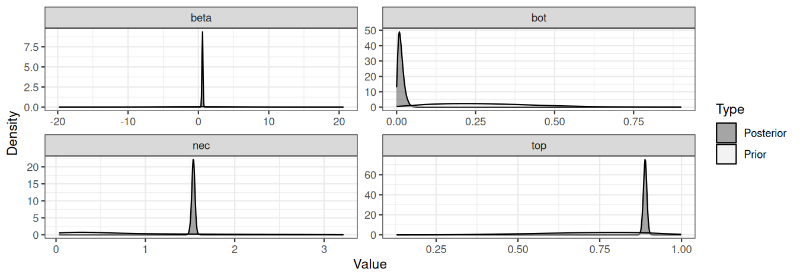
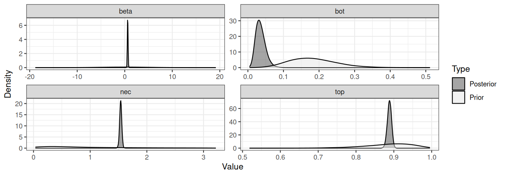
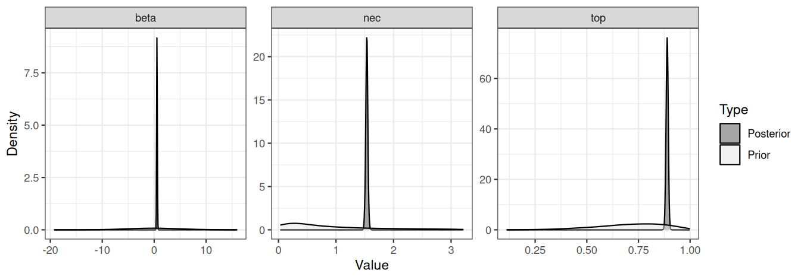

## Overview

The main focus here is to explain the default priors used in `bayesnec` and to showcase how the user can interrogate the priors used in a `bayesec` model and alternatively specify their own priors, should they wish to. This might be needed depending on the model and the data because `bayesnec` tries to find reasonable and yet only weakly informative priors for the model parameters by default. First we describe the default priors used in `bayesnec`, including the two alternative default prior sets that can be selected through the `prior_type` argument, and then follow up with a demonstration of how the user can specify priors in multiple ways for objects of class `bayesnecfit` and `bayesmanecfit`.

## Default priors in `bayesnec`

The default priors used in `bayesnec` can generally be considered "weakly informative". They are constructed for each parameter of each model being fitted based on the characteristics of either the input response and predictor data, depending on which is relevant to the specific parameter scaling. In the case of parameters that scale with the response, priors are constructed based on the relevant link scaling, whether that be identity or the default (or user specific) link function for a specific distribution. The priors are constructed by `bnec` internally based on the chosen model, the distribution (including the relevant link function), the predictor and the response.

### Priors for response-scaled parameters

Only the parameters **top** and **bot** scale specifically with the response. The priors described in this section are the default `"uninformative"` set (see **Selecting the default prior set** below for the alternative `"regularizing"` set, which differs only in these two response-scaled parameters). For Gaussian-distributed response data (or any response data for which the link ensures valid values of the response can take from `+Inf` to `-Inf`, including `log` and `logit`) priors are `normal` with a standard deviation of `2.5` times the standard deivation of the response data, and a mean set at the 90^th^ and 10^th^ quantiles for **top** and **bot** respectively. For Poisson-, Negative Binomial- and Gamma-distributed data the response is bounded by `0` and thus priors are `Gamma`, with a mean scaled to correspond to the 75^th^ and 25^th^ quantiles for **top** and **bot** respectively. The mean is linked mathematically to the shape (*s*) and rate parameters (*r*) by the equation $mean = s \times (1/r)$ with the Gamma shape parameter set at 2. For the Binomial, Beta, and Beta Binomial families estimates for **top** and **bot** must necessarily be constrained between `0` and `1` when modelled on the `"identity"` link (the default in `bayesnec`). Because of this constraint there is no need to adjust scaling based on the response. `bayesnec` uses `beta(5, 2)` and `beta(2, 5)` priors to provide a broad density centred across the upper and lower `0` to `1` range for the **top** and **bot** parameters, respectively.

### Priors for predictor-scaled parameters

The parameters **nec** and **ec50** scale with respect to the predictor because both of these are parameters in concentration-response curves that are estimated in units of concentration. To stabilise model fitting the **nec** and **ec50** parameters are bounded to the upper and lower observed range in the predictor, under the assumption that the range of concentrations in the experiment was sufficient to cover the full range of the response outcomes. Within those bounds the prior is a `normal` distribution on the *logarithm* of the predictor, which is the scale a dilution series is designed on. Where the predictor is supplied on the concentration scale the prior is written as a `lognormal`; where it spans negative values, and has therefore already been log transformed by the user, it is written as a `normal`. The two are the same rule stated on two scales.

For a predictor supplied on the concentration scale, the mean of the prior on the log scale is the median of the *distinct* positive predictor values, logged. Distinct values are used rather than the observations themselves so that the prior describes the series of concentrations that was tested and not how many replicates each of them received. Taking the median after logging returns the log of the median concentration where the number of distinct positive concentrations is odd, and the log of the geometric mean of the two central concentrations where it is even, that being their midpoint on the log axis rather than on the concentration axis. This places the maximum density of the prior at that concentration measured on the log scale, and makes the median of the untruncated prior on the concentration scale that same concentration, which is the convention Fisher et al. (2024) describe. Both statements describe the untruncated prior; truncation at the highest concentration removes part of the upper tail and so pulls the median down, to `0.58` against a median concentration of `0.88` on `nec_data`. The standard deviation is set so that the central 95% interval of the untruncated prior covers every concentration tested: it is the larger of the two half-widths from the mean to the ends of the logged series, divided by `qnorm(0.975)`. A prior on a threshold should not exclude a concentration the experiment applied, at either end, and that criterion is the whole of the rule. The width is therefore stated rather than chosen, and it adapts to the design: expressed as a multiple of `sd(log(x))` it lands between `0.73` and `1.18` across five designs, at `0.92` to `1.03` on the four `nassarius` series, and at `1.75` on `nec_data`, whose predictor is continuous and densely sampled. Because the width is set by the two extreme concentrations rather than by the spread of the series between them, it responds to how a control is recorded. The prior is built from the concentrations as recorded, so a control entered as a nominal small positive value states that the value was applied and the prior widens to cover it; on the `nassarius` contaminant A series the standard deviation is `2.30` with the control recorded as `0`, `2.59` with it recorded as `0.001` and `6.11` with it recorded as `1e-6`. Record a control as `0`.

For a predictor supplied already logged, the prior is `normal` with a mean at the median of the distinct predictor values and a standard deviation of `10` times their standard deviation. The multiplier of `10` is the one Fisher et al. (2024) describe and it is unchanged. The mean and the standard deviation are read from the distinct values rather than from the observations, as on the concentration-scale branch, so that replication has no effect on the prior; that part of the entry does differ from earlier versions. Over the pooled `log(herbicide$concentration)` column, 580 rows and 9 distinct values, the mean changes from `1.10` to `2.30` and the standard deviation from `26.3` to `31.5`.

Up to version 2.1.4 the predictor-scaled prior took one of three forms, selected by the range of the predictor: a `Gamma` prior with shape `5` and rate `2 / m` where the predictor was non-negative and reached above `1`, a fixed `beta(2, 2)` where it lay within `0` and `1`, and the `normal` prior above where it spanned negative values. The rate was first corrected to `4 / m`, moving the maximum density of the `Gamma` prior from `2 * m` to *m* (issue #273), before the entry was replaced altogether. Both rates share a defect that no rate can remove. The spread of a `Gamma` distribution is tied to its shape, so `gamma(5, 4 / m)` places its central 95% interval at `0.41 * m` to `2.56 * m` whatever the data are, and the prior therefore reaches the highest concentration tested only where that concentration is within about `2.6` times the median. That ratio is a property of the experimental design: it is `2.0` for a series spaced evenly from zero and between `13` and `125` for the four `nassarius` series, which are spaced logarithmically as most ecotoxicological designs are. No shape serves both, and the shape that would is not usable. Solving for the shape whose maximum density is at *m* and whose 97.5^th^ percentile is the highest concentration gives `8.6` for a series spaced evenly from zero and `1.03` for the contaminant A series. At `1.03` the mode is still at *m*, by construction, but that is all that is: the density rises `5.7`% from the lowest concentration to the mode and then falls to `2.8`% of its peak at the highest, and the median of that prior is `3.85`, twenty-four times *m* and above every concentration tested but the top one. On a response simulated from a **nec4param** curve with a known *NEC* of `1.25` over the `nassarius` contaminant A concentration series, the truncated prior placed only `1.2` parts in `10^9` of its mass above that value, so the estimate was determined by the prior rather than by the data, and the sampler reported no difficulty. Selecting on the range of the predictor was a second defect: the range is a property of the units a concentration is recorded in, so the same experiment received priors differing roughly 600-fold in width according to whether the dose was recorded in mg/L, in g/L, or logged: measured on the `nassarius` contaminant A series, the central 95% interval covered `1.7`% of the predictor range under the `Gamma` entry, `81`% under `beta(2, 2)` rescaled to that range and `1097`% under the `normal` entry before truncation. Both defects are removed by using one construction on whichever scale the predictor is supplied on. Note that the prior now used also has a monotonically decreasing density on the concentration scale over the whole tested range of the `nassarius` series. It is not the same defect: a `lognormal` has its mode at `exp(mu - sigma^2)` on the concentration scale, so the density falls because the change of variable from the log scale redistributes it, and where the mass lies is what separates the two. On the contaminant A series the median of the untruncated prior used here is `0.223`, which is the location the rule specifies exactly; that series has an even number of positive concentrations, so the location is the geometric mean of the two central ones rather than one of the concentrations itself. The shape-`1.03` `Gamma` has a median of `3.85`. See issue #302.

### Priors for other parameters

For the parameters **beta**, **slope**, **d** and **f**, we first ensured any relevant transformations in the model formula such that theoretical values of `-Inf` to `+Inf` are allowable, and a `normal(0, 5)` prior is used. For example, in the **nec3param** model, **beta** is an exponential decay parameter which must by definition be bounded to `0` and `+Inf`. Calling `exp(beta)` in the model formula ensures the exponent meets these requirements. Note also that a mean of `0` and standard deviation of `5` represents a relatively broad prior on the exponential scaling. See the **Model details** vignette or `?model("all")` for more information on all the models available in `bayesnec` and their specific formulation.

### Priors for group-level parameters

A group-level term---`ogl()`, `pgl()`, or `(par | group)`, see `?bayesnecformula` for the syntax---adds a standard deviation for each parameter it applies to, and `ogl()` adds an offset parameter as well. These are given priors on the same three-way split as the parameters above: a group-level standard deviation is given `student_t(3, 0, s)`, where *s* is one tenth of the observed range of the scale its parameter lives on. That is the response range for **top**, **bot** and **ogl**, the predictor range for **nec** and **ec50**, and `0.5` for **beta**, **slope**, **d** and **f**, which are estimated on a log scale and take `normal(0, 5)` of their own. Where the deviation is applied multiplicatively, described below, it acts on a log or log-odds scale rather than on the response scale, and *s* is converted onto that scale at the mean of the response. The `student_t(3, 0, .)` shape is the `brms` default for this class; only its scale, which is not otherwise derived from the data, is changed. The **ogl** offset itself is given a zero-centred `normal` prior on the response scale, because it enters as an offset on the whole curve and is therefore confounded with **top** and **bot** unless it is centred.

Note that *s* is derived from the observed data, not from the spread of the parameter's own prior. The two are not the same, and the difference is deliberate: **top** on a Gaussian response has a prior standard deviation of `2.5` times that of the response, which is a reasonable statement of ignorance about a *level* and a poor one about *deviation around* that level. For **nec** and **ec50** the distinction does not arise, since those priors are already truncated to the observed predictor range. Under `student_t(3, 0, s)` there is a prior probability of about `0.39` that the group-level standard deviation exceeds *s*, so this is a weakly informative prior rather than a tight one.

There is one property of the default priors that a grouped fit does not inherit. Every prior described above constrains its parameter to the region in which the model is defined---`beta(5, 2)` on `0` to `1`, a lower bound of `0` for the count and Gamma families, **nec** truncated to the predictor range---and this is what allows `bayesnec` to fit on the `"identity"` link and keep **top**, **bot** and **nec** directly interpretable. A group-level deviation cannot be constrained in the same way, because `brms` declares it unconstrained. Where the response distribution restricts the range of the mean---every family except Gaussian, under an identity link---a proposal that carries the mean outside that range is rejected by Stan and counted as a divergent transition.

`bayesnec` now avoids this rather than mitigating it. Where the deviation applies to the whole curve, through `ogl()`, it is applied *multiplicatively* rather than as an offset added to the mean: on a `0` to `1` response the deviation scales the odds of the mean, and on a positive response it scales the mean itself. The deviation is centred on zero and a deviation of zero leaves the curve exactly as it was, so **top**, **bot**, **nec** and **beta** keep their meanings, while the mean can no longer leave its support however far a proposal travels. The prior on the deviation is widened to match the scale it now acts on. Measured on a simulated `beta_binomial` design across three seeds, this gives **no divergent transitions at all**, against 70 to 95 per cent for the additive form on the same data, and it samples about twice as fast.

The same construction is applied to a deviation placed on **top** or **bot**, through `pgl()` or an explicit `(par | group)` term. Those two parameters are on the response scale and their own priors bound them to the support of the mean, so an unconstrained deviation added to either of them can put the parameter outside the region in which the likelihood is defined. **bot** is where this occurs in practice, because it is the lower asymptote and is routinely estimated close to zero. The parameter itself keeps its name, its prior and its meaning; what the term now adds is a deviation applied multiplicatively to it, with no population-level term of its own, so the fit has exactly the parameters the additive form had and **bot** remains the asymptote the population-level curve declines towards. One consequence for a user supplying their own priors: a prior on **top** or **bot** that does not bound the parameter to the range the mean is defined on is refused where a group-level term on it would be transformed, because the multiplicative form is only defined inside that range. Measured on the `herbicide` data with `Beta(link = "identity")` and **nec4param**, two chains and 2000 iterations, a `(bot | herbicide)` term gave 51 divergent transitions of 2000 at `adapt_delta = 0.95` under the additive form and gives none at Stan's default of `0.8` under the multiplicative one. The same term on a `gaussian` response, where the mean is unconstrained and the parameter is therefore not against a boundary, gave none either way.

A deviation on **nec**, **ec50**, **beta**, **slope**, **d** or **f** still adds to that parameter directly. Those parameters are on the predictor scale or are estimated on a log scale, so none of them is bounded by the likelihood and there is no excursion to prevent; a `(nec | herbicide)` term on the fixture above gave 0 divergent transitions of 2000 at `adapt_delta = 0.8`. A `pgl()` term places a deviation on every parameter of the equation at once and therefore generates a mixture of the two forms.

One restriction remains on `ogl()`. The transformation of the *mean* is only defined where the mean is provably strictly inside its range, so it is not used for **neclin**, **neclinhorme** and **ecxlin**, whose mean is unbounded below, nor for the hormesis equations, whose mean can reach or exceed `1`. The transformation of a *parameter* is not restricted in that way, because **top** and **bot** are bounded by their own priors whatever equation they appear in.

`bnec()` sets `control = list(adapt_delta = 0.99)` where a group-level term can still take the mean outside its support, which reduces the divergence rate substantially without removing it, and **such a fit should always be checked for divergent transitions**. With every deviation applied on a scale it cannot leave, that condition is decided by the equation: for one whose mean lies between **bot** and **top** no group-level term can put the mean outside the support, and the setting is not made. It is made for **neclin**, **neclinhorme** and **ecxlin**, and for the hormesis equations, whose mean can leave the support with every parameter inside it --- on every family, because an excess term in `exp(slope) * x` makes the mean negative for a sufficiently negative predictor, and `crf(log(concentration), ...)` supplies one as a matter of course. An `adapt_delta` supplied by the user is left unchanged. The setting is not made where it is not needed because it requires roughly fourteen times the gradient evaluations per iteration.

### Selecting the default prior set

The priors described above are the default `"uninformative"` set, which is deliberately broad and close to truly uninformative. From version 2.1.3.2 `bayesnec` also offers a narrower, more `"regularizing"` set, selected through the `prior_type` argument of `bnec` (and `amend`). The two sets differ in the response-scaled **top** and **bot** parameters, and in the group-level parameters described above; the predictor-scaled and fixed priors are identical for both.

For the `"regularizing"` set the no-effect **top** parameter is centred on the *upper extreme* of the response data, which for the monotonically decreasing concentration—response data typically modelled in `bayesnec` corresponds to the control (no-exposure) mean, and **bot** is centred on the *lower extreme*. The priors are also given less dispersion than the `"uninformative"` set:

* Gaussian families use a `normal` prior with a standard deviation of one (rather than `2.5` times) the standard deviation of the response, with means at the maximum and minimum of the response for **top** and **bot** respectively.
* Poisson-, Negative Binomial- and Gamma-distributed families use a `Gamma` prior with a shape of `5` (rather than `2`) and a mean placed at the maximum and minimum of the response for **top** and **bot** respectively.
* Binomial, Beta and Beta Binomial families use `beta(5, 1)` and `beta(1, 5)` priors (rather than `beta(5, 2)` and `beta(2, 5)`), pushing more density towards the upper and lower ends of the `0` to `1` range.
* Group-level standard deviations, and the **ogl** offset, take half the scale of the `"uninformative"` set. This is roughly the same degree of narrowing the response-scaled priors receive above, and it exists because a user selecting the regularizing set for a grouped fit is usually doing so *because* of the grouping.

These tighter priors can improve convergence and guard against implausible fits when the data are sparse or noisy, at the cost of exerting more influence on the posterior. The `"uninformative"` priors of Fisher et al. (2024) remain the default so that existing behaviour is preserved unless the regularizing set is explicitly requested.

To see the difference we fit the same **nec3param** model to the `nec_data` example (a Beta-distributed response on the `"identity"` link) under each prior set. Note `prior_type` is ignored whenever the user supplies their own `prior` argument.


``` r
library(brms)
library(bayesnec)
data(nec_data)

set.seed(333)
exmp_uninformative <- bnec(y ~ crf(x, model = "nec3param"), data = nec_data,
                           family = Beta(link = "identity"),
                           prior_type = "uninformative",
                           iter = 1e4, control = list(adapt_delta = 0.99))

set.seed(333)
exmp_regularizing <- bnec(y ~ crf(x, model = "nec3param"), data = nec_data,
                          family = Beta(link = "identity"),
                          prior_type = "regularizing",
                          iter = 1e4, control = list(adapt_delta = 0.99))
```

Comparing the priors that `bnec` built for each fit with `pull_prior` shows the change in the response-scaled **top** parameter: `beta(5, 2)` under the default `"uninformative"` set versus `beta(5, 1)` under `"regularizing"`. The predictor-scaled **nec** and fixed **beta** priors are unchanged.


``` r
pull_prior(exmp_uninformative)
#> [[1]]
#>                                            prior class      coef group resp
#>                                     normal(0, 5)     b                     
#>                                     normal(0, 5)     b Intercept           
#>  lognormal(-0.132723577442522, 1.68292842267636)     b                     
#>  lognormal(-0.132723577442522, 1.68292842267636)     b Intercept           
#>                                       beta(5, 2)     b                     
#>                                       beta(5, 2)     b Intercept           
#>                                gamma(0.01, 0.01)   phi                     
#>  dpar nlpar               lb               ub tag       source
#>        beta                                               user
#>        beta                                       (vectorized)
#>         nec 0.03234801324009 3.22051966293556             user
#>         nec 0.03234801324009 3.22051966293556     (vectorized)
#>         top                0                1             user
#>         top                0                1     (vectorized)
#>                            0                           default
```


``` r
pull_prior(exmp_regularizing)
#> [[1]]
#>                                            prior class      coef group resp
#>                                     normal(0, 5)     b                     
#>                                     normal(0, 5)     b Intercept           
#>  lognormal(-0.132723577442522, 1.68292842267636)     b                     
#>  lognormal(-0.132723577442522, 1.68292842267636)     b Intercept           
#>                                       beta(5, 1)     b                     
#>                                       beta(5, 1)     b Intercept           
#>                                gamma(0.01, 0.01)   phi                     
#>  dpar nlpar               lb               ub tag       source
#>        beta                                               user
#>        beta                                       (vectorized)
#>         nec 0.03234801324009 3.22051966293556             user
#>         nec 0.03234801324009 3.22051966293556     (vectorized)
#>         top                0                1             user
#>         top                0                1     (vectorized)
#>                            0                           default
```

Plotting the prior and posterior densities with `check_priors` makes the difference in the **top** prior clear: the `"regularizing"` prior places more density at the upper end of the response range, closer to the observed control mean.


``` r
check_priors(exmp_uninformative)
```

<div class="figure" style="text-align: center">

<p class="caption">plot of chunk exmp3-checkpriors-uninformative</p>
</div>


``` r
check_priors(exmp_regularizing)
```

<div class="figure" style="text-align: center">

<p class="caption">plot of chunk exmp3-checkpriors-regularizing</p>
</div>

## User specified priors

There may be situations were the default `bayesnec` priors to not behave as desired, or the user wants to provide informative priors. For example the default priors may be too informative, yielding unreasonably tight confidence bands, although this is only likely where there are few data. Conversely, priors may be too vague, leading to poor model convergence, or an inability of `bayesnec` to find appropriate starting values. Alternatively, as indicated in the example below, the default priors may be of the wrong statistical distribution if there was insufficient information in the provided data for `bayesnec` to guess correctly the appropriate one to use.

The priors used in the default model fit can be extracted using `pull_prior`, and a sample or plot of prior values can be obtained from the individual `brms` model fits through the function `sample_priors` which samples directly from the `prior` element in the `brm` model fit. We can also use the function `check_prior` (based on the `hypothesis` function of `brms`) to assess how the posterior probability density for each parameter differs from that of the prior.

### bayesnecfit

To set specified priors, it is simplest to start by letting `bnec` find the priors on its own, i.e. by not specifying the `brm` argument `prior` at all.


``` r
library(brms)
library(bayesnec)
data(nec_data)

# a single model
set.seed(333)
exmp_a <- bnec(y ~ crf(x, model = "nec3param"), data = nec_data,
               family = Beta(link = "identity"),
               iter = 1e4, control = list(adapt_delta = 0.99))
```


``` r
class(exmp_a)
#> [1] "bayesnecfit" "bnecfit"
```

We can view the prior and posterior probability densities of all the parameters in the model using the function `check_prior`, based on the `hypothesis` function of `brms`. This can be useful to assess if priors are suitably vague, and/or if they might be having an undesirable influence on the posterior.


``` r
check_priors(exmp_a)
```

<div class="figure" style="text-align: center">

<p class="caption">plot of chunk exmp3-checkpriors</p>
</div>

In this case the priors seem reasonably vague, however there will be times when it is necessary to modify these priors. The user can take advantage of the function `pull_prior` to inspect what `bnec` came up with on its own, and decide how best to modify those priors to be more desirable.


``` r
pull_prior(exmp_a)
#> [[1]]
#>                                            prior class      coef group resp
#>                                     normal(0, 5)     b                     
#>                                     normal(0, 5)     b Intercept           
#>  lognormal(-0.132723577442522, 1.68292842267636)     b                     
#>  lognormal(-0.132723577442522, 1.68292842267636)     b Intercept           
#>                                       beta(5, 2)     b                     
#>                                       beta(5, 2)     b Intercept           
#>                                gamma(0.01, 0.01)   phi                     
#>  dpar nlpar               lb               ub tag       source
#>        beta                                               user
#>        beta                                       (vectorized)
#>         nec 0.03234801324009 3.22051966293556             user
#>         nec 0.03234801324009 3.22051966293556     (vectorized)
#>         top                0                1             user
#>         top                0                1     (vectorized)
#>                            0                           default
```

`bnec` chose a `lognormal` prior on the *NEC* parameter of **nec3param** because the predictor `nec_data$x` is non-zero positive, so the prior is built on the log of the concentration. However, imagine that in theory the predictor could have had negative values, it just happened to not have in this particular dataset. So let's go ahead and specify something else, say a normal with larger variance.


``` r
set.seed(333)
my_prior <- c(prior_string("beta(5, 1)", nlpar = "top"),
              prior_string("normal(1.3, 2.7)", nlpar = "nec"),
              prior_string("gamma(0.5, 2)", nlpar = "beta"))
exmp_b <- bnec(y ~ crf(x, model = "nec3param"), data = nec_data,
               family = Beta(link = "identity"), prior = my_prior,
               iter = 1e4, control = list(adapt_delta = 0.99))
```

Two things are of note. If the user is specifying their own priors, `bnec` requires them to specify priors for **all** parameters. The `pull_prior` function shows the priors *after* the model was fitted, but suppose the user does not know what parameters were comprised in a particular model. In those instances, the user can call the function `show_params(model = "all")` to inspect the parameters of each function, or some targeted function in particular.


``` r
show_params(model = "nec3param")
#> [[1]]
#> y ~ top * exp(-exp(beta) * (x - nec) * step(x - nec)) 
#> top ~ 1
#> beta ~ 1
#> nec ~ 1
```

### bayesmanecfit

The user can also specify a named list of priors when one or more models are being fitted to the same dataset.


``` r
set.seed(333)
my_priors <- list(nec3param = c(prior_string("beta(5, 1)", nlpar = "top"),
                                prior_string("normal(1.3, 2.7)", nlpar = "nec"),
                                prior_string("gamma(0.5, 2)", nlpar = "beta")),
                  nec4param = c(prior_string("beta(5, 1)", nlpar = "top"),
                                prior_string("normal(1.3, 2.7)", nlpar = "nec"),
                                prior_string("gamma(0.5, 2)", nlpar = "beta"),
                                prior_string("beta(1, 5)", nlpar = "bot")))
exmp_c <- bnec(y ~ crf(x, model = c("nec3param", "nec4param")), data = nec_data,
               family = Beta(link = "identity"), prior = my_priors,
               iter = 1e4, control = list(adapt_delta = 0.99))
```

`pull_prior` also works for an object of class `bayesmanecfit`, as does `check_priors` which allows an option of passing a filename to save the prior and posterior probability density plots to a pdf.


``` r
pull_prior(exmp_c)
check_priors(exmp_c, filename = "Check_priors")
```


```
#> $nec3param
#>              prior class      coef group resp dpar nlpar lb ub tag       source
#>      gamma(0.5, 2)     b                            beta                   user
#>      gamma(0.5, 2)     b Intercept                  beta           (vectorized)
#>   normal(1.3, 2.7)     b                             nec                   user
#>   normal(1.3, 2.7)     b Intercept                   nec           (vectorized)
#>         beta(5, 1)     b                             top                   user
#>         beta(5, 1)     b Intercept                   top           (vectorized)
#>  gamma(0.01, 0.01)   phi                                  0             default
#> 
#> $nec4param
#>              prior class      coef group resp dpar nlpar lb ub tag       source
#>      gamma(0.5, 2)     b                            beta                   user
#>      gamma(0.5, 2)     b Intercept                  beta           (vectorized)
#>         beta(1, 5)     b                             bot                   user
#>         beta(1, 5)     b Intercept                   bot           (vectorized)
#>   normal(1.3, 2.7)     b                             nec                   user
#>   normal(1.3, 2.7)     b Intercept                   nec           (vectorized)
#>         beta(5, 1)     b                             top                   user
#>         beta(5, 1)     b Intercept                   top           (vectorized)
#>  gamma(0.01, 0.01)   phi                                  0             default
```

The user can also specify priors for one model only out of the entire set, `bayesnec` will return a message stating that it is searching for priors on its own when they are either ill-formed (e.g. incomplete or have a typo), or the user simply decided not to specify priors for a particular model, e.g.


``` r
set.seed(333)
my_priors <- list(nec3param = c(prior_string("beta(5, 1)", nlpar = "top"),
                                prior_string("normal(1.3, 2.7)", nlpar = "nec"),
                                prior_string("gamma(0.5, 2)", nlpar = "beta")),
                  nec4param = c(prior_string("beta(5, 1)", nlpar = "top"),
                                prior_string("normal(1.3, 2.7)", nlpar = "nec"),
                                prior_string("gamma(0.5, 2)", nlpar = "beta"),
                                prior_string("beta(1, 5)", nlpar = "bot")))
exmp_d <- bnec(y ~ crf(x, model = c("nec3param", "nec4param")), data = nec_data,
               family = Beta(link = "identity"), prior = my_priors[1],
               iter = 1e4, control = list(adapt_delta = 0.99))
```

`prior = my_priors[[1]]` would also have worked because the argument priors can either take a `brmsprior` object directly, or a named list containing model-specific `brmsprior` objects.

Finally the user can also extend an existing `bayesmanecfit` object with the function `amend`, also by specifying custom-built `priors`.


``` r
set.seed(333)
necsigm_priors <- c(prior_string("beta(5, 1)", nlpar = "top"),
                    prior_string("gamma(2, 6.5)", nlpar = "beta"),
                    prior_string("normal(1.3, 2.7)", nlpar = "nec"),
                    prior_string("normal(0, 2)", nlpar = "d"))
exmp_e <- amend(exmp_d, add = "necsigm", priors = necsigm_priors)
```

## Fixing a parameter

A parameter can be held at a known value rather than estimated, by giving it a `constant()` prior. This works wherever a user-specified prior works and requires no other change. `bayesnec` has no `fixed` argument of the kind `drc` provides, because a point-mass prior expresses the same thing through machinery that already exists.

The case where this is defensible is an asymptote that is structural rather than measured. In a two-choice avoidance assay, animals are offered a treated and an untreated container, and the expected proportion in the treated container at zero dose is 0.5 *by design*: at zero dose the two containers are identical.


``` r
set.seed(333)
avoid_x <- rep(c(0, 0.4, 0.8, 1.2, 1.6, 2.0, 2.4, 3.0), each = 6)
avoid_mu <- 0.5 * exp(-exp(0.3) * pmax(avoid_x - 1.1, 0))
avoid_data <- data.frame(x = avoid_x,
                         y = rbeta(length(avoid_x), avoid_mu * 60,
                                   (1 - avoid_mu) * 60))
```

`get_priors` returns the priors `bnec` would generate for a formula and data without fitting anything, so the set can be edited before the first run. Fixing `top` is a change to one row.


``` r
fixed_prior <- get_priors(y ~ crf(x, model = "nec3param"), data = avoid_data,
                          family = Beta(link = "identity"))
fixed_prior$prior[fixed_prior$nlpar == "top"] <- "constant(0.5)"
fixed_prior
#>                                            prior class coef group resp dpar
#>                                     normal(0, 5)     b                     
#>                                    constant(0.5)     b                     
#>  lognormal(0.470003629245736, 0.707306038302134)     b                     
#>  nlpar   lb   ub tag source
#>   beta <NA> <NA>       user
#>    top    0    1       user
#>    nec    0    3       user
```


``` r
set.seed(333)
exmp_f <- bnec(y ~ crf(x, model = "nec3param"), data = avoid_data,
               family = Beta(link = "identity"), prior = fixed_prior,
               iter = 1e4, control = list(adapt_delta = 0.99))
```

`top` is reported with an estimate of exactly 0.5 and no error, because it was never sampled. Stan does not declare a parameter whose prior is constant, so it contributes nothing to the posterior.


``` r
fixef(pull_brmsfit(exmp_f))
#>                 Estimate  Est.Error      Q2.5     Q97.5
#> beta_Intercept 0.3107041 0.09841615 0.1451665 0.5460517
#> nec_Intercept  1.1445531 0.07506455 1.0283312 1.3331188
#> top_Intercept  0.5000000 0.00000000 0.5000000 0.5000000
```

### Consequences of fixing an asymptote

Two things are given up, and both are easy to miss because the fit itself looks better rather than worse.

The first is a diagnostic. In the assay above, 0.5 is a *null expectation* rather than a design constant: it holds only if there is no baseline preference between the two containers arising from position, lighting, handling order or substrate. Fitting the same data with `top` free gives a credible interval that comfortably covers 0.5, and that is positive evidence the assay was unbiased before the contaminant was involved. No other output of the model carries it.


``` r
set.seed(333)
exmp_g <- bnec(y ~ crf(x, model = "nec3param"), data = avoid_data,
               family = Beta(link = "identity"), iter = 1e4,
               control = list(adapt_delta = 0.99))
```


``` r
fixef(pull_brmsfit(exmp_g))
#>                 Estimate  Est.Error      Q2.5     Q97.5
#> top_Intercept  0.4886657 0.01597993 0.4591279 0.5212572
#> beta_Intercept 0.3437224 0.10937483 0.1541249 0.5718228
#> nec_Intercept  1.1911299 0.09590852 1.0313781 1.3762869
```

That check only works while `top` is free, and here it passes: the interval covers 0.5, so this assay was unbiased at dose zero. The point is what it would have cost to be unable to ask. Had the assay carried a real baseline preference --- a `top` genuinely near 0.62 --- fixing it at 0.5 would have produced a fit that looked exactly as sound as this one. The disagreement does not disappear when it is forbidden from appearing in `top`; it is absorbed into `beta` and `nec` instead, and so into the toxicity estimate, with intervals that no longer reflect it. Whatever value is asserted for `top` propagates into the *NEC* directly, which is visible even here, where 0.5 is the value the data were generated from.


``` r
rbind(fixed = nec(exmp_f), free = nec(exmp_g))
#>            Q50     Q2.5    Q97.5
#> fixed 1.131241 1.028331 1.333119
#> free  1.169913 1.031378 1.376287
```

The second is uncertainty. A constant asserts the value is known exactly, so none of it propagates into ECx or the *NEC*, and the credible intervals narrow. That reads as a better analysis and is the opposite.

A tight informative prior is therefore the better tool in most cases, because it states what is known while still letting the data move the parameter and still carrying the uncertainty forward. `beta(6, 6)` has a mean of 0.5 and a standard deviation of 0.14, concentrating `top` around the design expectation without asserting it.


``` r
fixed_prior$prior[fixed_prior$nlpar == "top"] <- "beta(6, 6)"
```

### Fixing an asymptote on control-normalised data

A response divided by its control mean has a maximum of 1 by construction, and fixing `top` at 1 is a common reflex. It should be resisted, for a reason beyond the two above. Normalising to an *estimated* control already discards the sampling variability of the divisor; fixing the asymptote afterwards makes that loss invisible rather than merely present, because the intervals it narrows are the ones that were already too narrow. `bnec` warns when it detects a normalised response. See the "Preparing the response" section of `vignette("example1")` and `?bnec` for the alternative, which is to model the raw response and read the decline relative to the fitted control.
