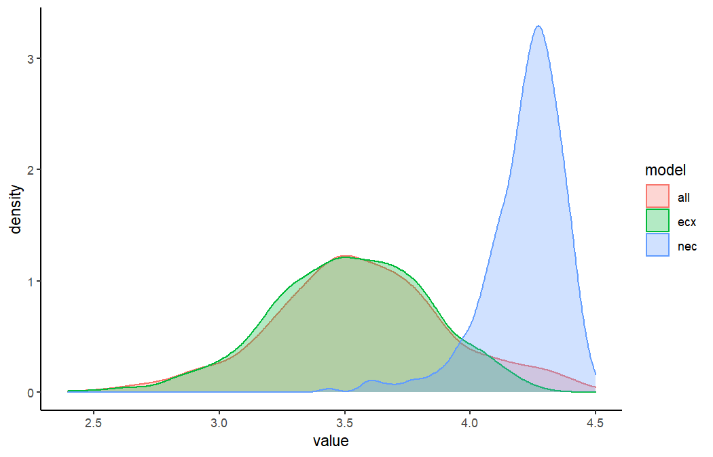
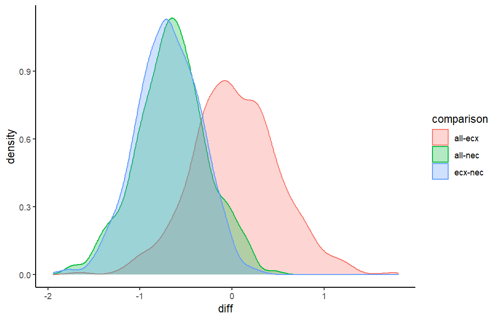
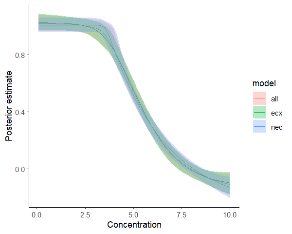
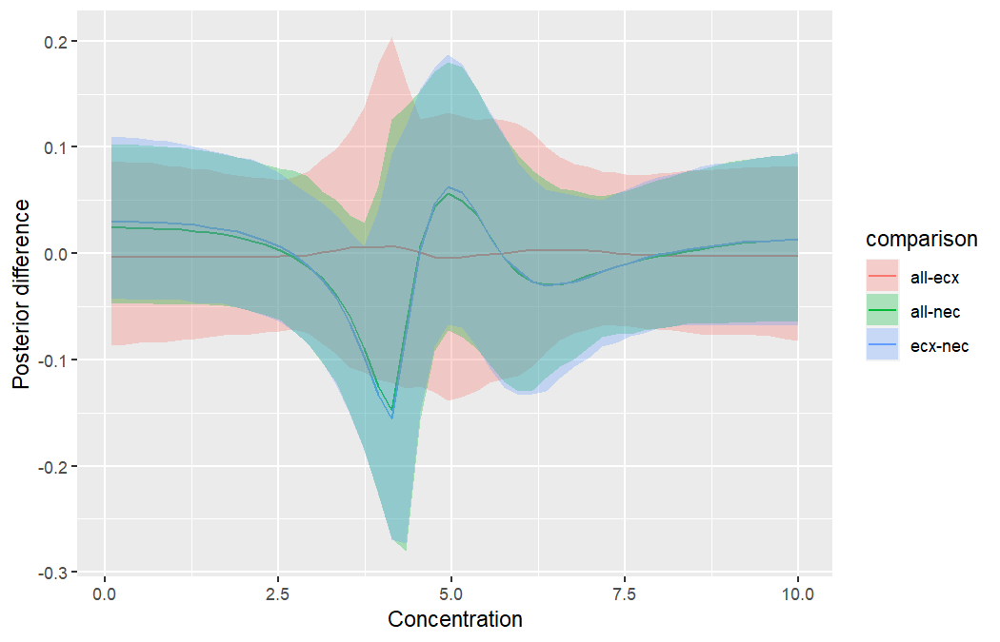
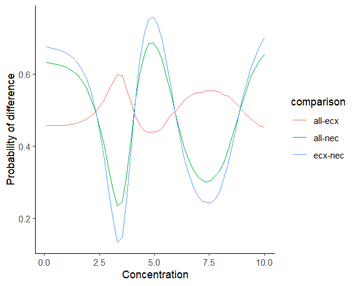

[e1]: https://open-aims.github.io/bayesnec/articles/example1.html
[e2]: https://open-aims.github.io/bayesnec/articles/example2.html
[e2b]: https://open-aims.github.io/bayesnec/articles/example2b.html
[e3]: https://open-aims.github.io/bayesnec/articles/example3.html
[e4]: https://open-aims.github.io/bayesnec/articles/example4.html

# Overview

With `bayesnec` we have included a function that allows bootstrapped comparisons of posterior predictions. The main focus here is to showcase how the user can fit several different `bnec` model fits and can compare differences in the posterior predictions across these fits for individual endpoint estimates (e.g. nec, nsec or ecx) or across a range of predictor (x) values. Below we demonstrate usage of `compare_posterior` for objects of class `bayesnecfit` and `bayesmanecfit`. In this example we compare different types of models and model sets using a single dataset. However, the intent of this function is to allow comparison across different datasets that might represent, for example, different levels of a fixed factor covariate. At this time `bnec` does not allow inclusion of an interaction with a fixed factor. Including an interaction term within each of the non-linear models implemented in `bayesnec` is relatively straightforward, and may be introduced in future releases. However, in many cases the functional form of the response may change with different levels of a given factor. The substantial complexity of defining all possible non-linear model combinations at each factor level means it unlikely this could be feasibly implemented in `bayesnec` in the short term. In the meantime the greatest flexibility in the functional form of individual model fits can be readily obtained using models fitted independently to data within each factor level.

To run this vignette, we will also need some additional packages


```r
library(ggplot2)
```

## Comparing posterior endpoint values


```r
library(brms)
library(bayesnec)
data(nec_data)

# Fit a set of models
set.seed(30)
x <- seq(0, 10, length = 12)
y <- bayesnec:::pred_ecx4param(x=x, b_bot=0, b_top=1, b_beta=0.5, b_ec50 = 5)
dat <- data.frame(y_vec = rnorm(15*12, y, 0.2), x_vec = rep(x, 15))
exmp <- bnec(data = dat, x_var = "x_vec", y_var = "y_vec", model = "decline", iter=2e3)
#> 
-

\

|

/

-

\

|

/

-

\

|

/

-

\

|

/

-

\

|

/

-

\

|

/

-

\

|

/

-

\

|

/

-

\

|

/

-

\

|

/

-

\

|

/

-

\

|

/

-

\

|

/

-

\

|

/

-

\

|

/

-

\

|

/

-

\

|

/

-

\

|

/

-

\

|

/

-

\

|

/

-

\

|

/

-

\

|

/

-

\

|

/

-

\

|

/

-

\

|

/

-

\

|

/

-

\

|

/

-

\

|

/

-

\

|

/

-

\

|

/

-

\

|

/

-

\

|

/

-

\

|

/

-

\

|

/

-

\

|

/

-

\

|

/

-

\

|

/

-

\

|

/

-

\

|

/

-

\

|

/

-

\

|

/

-

\

|

/

-

\

|

/

-

\

|

/

-

\

 
Running MCMC with 4 chains, at most 8 in parallel...
#> 
#> Chain 1 Iteration:    1 / 2000 [  0%]  (Warmup) 
#> Chain 2 Iteration:    1 / 2000 [  0%]  (Warmup) 
#> Chain 3 Iteration:    1 / 2000 [  0%]  (Warmup) 
#> Chain 4 Iteration:    1 / 2000 [  0%]  (Warmup) 
#> Chain 1 Iteration:  100 / 2000 [  5%]  (Warmup) 
#> Chain 1 Iteration:  200 / 2000 [ 10%]  (Warmup) 
#> Chain 1 Iteration:  300 / 2000 [ 15%]  (Warmup) 
#> Chain 2 Iteration:  100 / 2000 [  5%]  (Warmup) 
#> Chain 2 Iteration:  200 / 2000 [ 10%]  (Warmup) 
#> Chain 2 Iteration:  300 / 2000 [ 15%]  (Warmup) 
#> Chain 2 Iteration:  400 / 2000 [ 20%]  (Warmup) 
#> Chain 3 Iteration:  100 / 2000 [  5%]  (Warmup) 
#> Chain 3 Iteration:  200 / 2000 [ 10%]  (Warmup) 
#> Chain 3 Iteration:  300 / 2000 [ 15%]  (Warmup) 
#> Chain 4 Iteration:  100 / 2000 [  5%]  (Warmup) 
#> Chain 4 Iteration:  200 / 2000 [ 10%]  (Warmup) 
#> Chain 1 Iteration:  400 / 2000 [ 20%]  (Warmup) 
#> Chain 1 Iteration:  500 / 2000 [ 25%]  (Warmup) 
#> Chain 2 Iteration:  500 / 2000 [ 25%]  (Warmup) 
#> Chain 3 Iteration:  400 / 2000 [ 20%]  (Warmup) 
#> Chain 4 Iteration:  300 / 2000 [ 15%]  (Warmup) 
#> Chain 1 Iteration:  600 / 2000 [ 30%]  (Warmup) 
#> Chain 1 Iteration:  700 / 2000 [ 35%]  (Warmup) 
#> Chain 2 Iteration:  600 / 2000 [ 30%]  (Warmup) 
#> Chain 2 Iteration:  700 / 2000 [ 35%]  (Warmup) 
#> Chain 3 Iteration:  500 / 2000 [ 25%]  (Warmup) 
#> Chain 3 Iteration:  600 / 2000 [ 30%]  (Warmup) 
#> Chain 4 Iteration:  400 / 2000 [ 20%]  (Warmup) 
#> Chain 4 Iteration:  500 / 2000 [ 25%]  (Warmup) 
#> Chain 1 Iteration:  800 / 2000 [ 40%]  (Warmup) 
#> Chain 2 Iteration:  800 / 2000 [ 40%]  (Warmup) 
#> Chain 2 Iteration:  900 / 2000 [ 45%]  (Warmup) 
#> Chain 3 Iteration:  700 / 2000 [ 35%]  (Warmup) 
#> Chain 3 Iteration:  800 / 2000 [ 40%]  (Warmup) 
#> Chain 4 Iteration:  600 / 2000 [ 30%]  (Warmup) 
#> Chain 4 Iteration:  700 / 2000 [ 35%]  (Warmup) 
#> Chain 1 Iteration:  900 / 2000 [ 45%]  (Warmup) 
#> Chain 1 Iteration: 1000 / 2000 [ 50%]  (Warmup) 
#> Chain 2 Iteration: 1000 / 2000 [ 50%]  (Warmup) 
#> Chain 2 Iteration: 1100 / 2000 [ 55%]  (Warmup) 
#> Chain 3 Iteration:  900 / 2000 [ 45%]  (Warmup) 
#> Chain 3 Iteration: 1000 / 2000 [ 50%]  (Warmup) 
#> Chain 4 Iteration:  800 / 2000 [ 40%]  (Warmup) 
#> Chain 1 Iteration: 1100 / 2000 [ 55%]  (Warmup) 
#> Chain 2 Iteration: 1200 / 2000 [ 60%]  (Warmup) 
#> Chain 2 Iteration: 1300 / 2000 [ 65%]  (Warmup) 
#> Chain 2 Iteration: 1400 / 2000 [ 70%]  (Warmup) 
#> Chain 3 Iteration: 1100 / 2000 [ 55%]  (Warmup) 
#> Chain 3 Iteration: 1200 / 2000 [ 60%]  (Warmup) 
#> Chain 4 Iteration:  900 / 2000 [ 45%]  (Warmup) 
#> Chain 4 Iteration: 1000 / 2000 [ 50%]  (Warmup) 
#> Chain 1 Iteration: 1200 / 2000 [ 60%]  (Warmup) 
#> Chain 1 Iteration: 1300 / 2000 [ 65%]  (Warmup) 
#> Chain 1 Iteration: 1400 / 2000 [ 70%]  (Warmup) 
#> Chain 2 Iteration: 1500 / 2000 [ 75%]  (Warmup) 
#> Chain 2 Iteration: 1600 / 2000 [ 80%]  (Warmup) 
#> Chain 3 Iteration: 1300 / 2000 [ 65%]  (Warmup) 
#> Chain 3 Iteration: 1400 / 2000 [ 70%]  (Warmup) 
#> Chain 4 Iteration: 1100 / 2000 [ 55%]  (Warmup) 
#> Chain 4 Iteration: 1200 / 2000 [ 60%]  (Warmup) 
#> Chain 1 Iteration: 1500 / 2000 [ 75%]  (Warmup) 
#> Chain 1 Iteration: 1600 / 2000 [ 80%]  (Warmup) 
#> Chain 2 Iteration: 1700 / 2000 [ 85%]  (Warmup) 
#> Chain 2 Iteration: 1800 / 2000 [ 90%]  (Warmup) 
#> Chain 2 Iteration: 1801 / 2000 [ 90%]  (Sampling) 
#> Chain 3 Iteration: 1500 / 2000 [ 75%]  (Warmup) 
#> Chain 3 Iteration: 1600 / 2000 [ 80%]  (Warmup) 
#> Chain 3 Iteration: 1700 / 2000 [ 85%]  (Warmup) 
#> Chain 4 Iteration: 1300 / 2000 [ 65%]  (Warmup) 
#> Chain 4 Iteration: 1400 / 2000 [ 70%]  (Warmup) 
#> Chain 1 Iteration: 1700 / 2000 [ 85%]  (Warmup) 
#> Chain 1 Iteration: 1800 / 2000 [ 90%]  (Warmup) 
#> Chain 1 Iteration: 1801 / 2000 [ 90%]  (Sampling) 
#> Chain 2 Iteration: 1900 / 2000 [ 95%]  (Sampling) 
#> Chain 2 Iteration: 2000 / 2000 [100%]  (Sampling) 
#> Chain 3 Iteration: 1800 / 2000 [ 90%]  (Warmup) 
#> Chain 3 Iteration: 1801 / 2000 [ 90%]  (Sampling) 
#> Chain 4 Iteration: 1500 / 2000 [ 75%]  (Warmup) 
#> Chain 4 Iteration: 1600 / 2000 [ 80%]  (Warmup) 
#> Chain 4 Iteration: 1700 / 2000 [ 85%]  (Warmup) 
#> Chain 2 finished in 1.3 seconds.
#> Chain 1 Iteration: 1900 / 2000 [ 95%]  (Sampling) 
#> Chain 3 Iteration: 1900 / 2000 [ 95%]  (Sampling) 
#> Chain 3 Iteration: 2000 / 2000 [100%]  (Sampling) 
#> Chain 4 Iteration: 1800 / 2000 [ 90%]  (Warmup) 
#> Chain 4 Iteration: 1801 / 2000 [ 90%]  (Sampling) 
#> Chain 3 finished in 1.4 seconds.
#> Chain 1 Iteration: 2000 / 2000 [100%]  (Sampling) 
#> Chain 4 Iteration: 1900 / 2000 [ 95%]  (Sampling) 
#> Chain 4 Iteration: 2000 / 2000 [100%]  (Sampling) 
#> Chain 1 finished in 1.5 seconds.
#> Chain 4 finished in 1.5 seconds.
#> 
#> All 4 chains finished successfully.
#> Mean chain execution time: 1.4 seconds.
#> Total execution time: 2.2 seconds.
#> 
-

\

|

/

-

\

|

/

-

\

|

/

-

\

|

/

-

\

|

/

-

\

|

/

-

\

|

/

-

\

|

/

-

\

|

/

-

\

|

/

-

\

|

/

-

\

|

/

-

\

|

/

-

\

|

/

-

\

|

/

-

\

|

/

-

\

|

/

-

\

|

/

-

\

|

/

-

\

|

/

-

\

|

/

-

\

|

/

-

\

|

/

-

\

|

/

-

\

|

/

-

\

|

/

-

\

|

/

-

\

|

/

-

\

|

/

-

\

|

/

-

\

|

/

-

\

|

/

-

\

|

/

-

\

|

/

-

\

|

/

-

\

|

/

-

\

|

/

-

\

|

/

-

\

|

/

-

\

|

/

-

\

|

/

-

\

|

/

-

\

|

/

-

 
Running MCMC with 4 chains, at most 8 in parallel...
#> 
#> Chain 1 Iteration:    1 / 2000 [  0%]  (Warmup) 
#> Chain 1 Iteration:  100 / 2000 [  5%]  (Warmup) 
#> Chain 2 Iteration:    1 / 2000 [  0%]  (Warmup) 
#> Chain 3 Iteration:    1 / 2000 [  0%]  (Warmup) 
#> Chain 4 Iteration:    1 / 2000 [  0%]  (Warmup) 
#> Chain 1 Iteration:  200 / 2000 [ 10%]  (Warmup) 
#> Chain 1 Iteration:  300 / 2000 [ 15%]  (Warmup) 
#> Chain 1 Iteration:  400 / 2000 [ 20%]  (Warmup) 
#> Chain 2 Iteration:  100 / 2000 [  5%]  (Warmup) 
#> Chain 2 Iteration:  200 / 2000 [ 10%]  (Warmup) 
#> Chain 2 Iteration:  300 / 2000 [ 15%]  (Warmup) 
#> Chain 2 Iteration:  400 / 2000 [ 20%]  (Warmup) 
#> Chain 3 Iteration:  100 / 2000 [  5%]  (Warmup) 
#> Chain 3 Iteration:  200 / 2000 [ 10%]  (Warmup) 
#> Chain 4 Iteration:  100 / 2000 [  5%]  (Warmup) 
#> Chain 4 Iteration:  200 / 2000 [ 10%]  (Warmup) 
#> Chain 4 Iteration:  300 / 2000 [ 15%]  (Warmup) 
#> Chain 1 Iteration:  500 / 2000 [ 25%]  (Warmup) 
#> Chain 2 Iteration:  500 / 2000 [ 25%]  (Warmup) 
#> Chain 3 Iteration:  300 / 2000 [ 15%]  (Warmup) 
#> Chain 4 Iteration:  400 / 2000 [ 20%]  (Warmup) 
#> Chain 1 Iteration:  600 / 2000 [ 30%]  (Warmup) 
#> Chain 1 Iteration:  700 / 2000 [ 35%]  (Warmup) 
#> Chain 2 Iteration:  600 / 2000 [ 30%]  (Warmup) 
#> Chain 2 Iteration:  700 / 2000 [ 35%]  (Warmup) 
#> Chain 3 Iteration:  400 / 2000 [ 20%]  (Warmup) 
#> Chain 4 Iteration:  500 / 2000 [ 25%]  (Warmup) 
#> Chain 1 Iteration:  800 / 2000 [ 40%]  (Warmup) 
#> Chain 2 Iteration:  800 / 2000 [ 40%]  (Warmup) 
#> Chain 3 Iteration:  500 / 2000 [ 25%]  (Warmup) 
#> Chain 3 Iteration:  600 / 2000 [ 30%]  (Warmup) 
#> Chain 4 Iteration:  600 / 2000 [ 30%]  (Warmup) 
#> Chain 4 Iteration:  700 / 2000 [ 35%]  (Warmup) 
#> Chain 1 Iteration:  900 / 2000 [ 45%]  (Warmup) 
#> Chain 1 Iteration: 1000 / 2000 [ 50%]  (Warmup) 
#> Chain 2 Iteration:  900 / 2000 [ 45%]  (Warmup) 
#> Chain 2 Iteration: 1000 / 2000 [ 50%]  (Warmup) 
#> Chain 3 Iteration:  700 / 2000 [ 35%]  (Warmup) 
#> Chain 3 Iteration:  800 / 2000 [ 40%]  (Warmup) 
#> Chain 4 Iteration:  800 / 2000 [ 40%]  (Warmup) 
#> Chain 4 Iteration:  900 / 2000 [ 45%]  (Warmup) 
#> Chain 1 Iteration: 1100 / 2000 [ 55%]  (Warmup) 
#> Chain 1 Iteration: 1200 / 2000 [ 60%]  (Warmup) 
#> Chain 2 Iteration: 1100 / 2000 [ 55%]  (Warmup) 
#> Chain 3 Iteration:  900 / 2000 [ 45%]  (Warmup) 
#> Chain 4 Iteration: 1000 / 2000 [ 50%]  (Warmup) 
#> Chain 1 Iteration: 1300 / 2000 [ 65%]  (Warmup) 
#> Chain 1 Iteration: 1400 / 2000 [ 70%]  (Warmup) 
#> Chain 2 Iteration: 1200 / 2000 [ 60%]  (Warmup) 
#> Chain 2 Iteration: 1300 / 2000 [ 65%]  (Warmup) 
#> Chain 3 Iteration: 1000 / 2000 [ 50%]  (Warmup) 
#> Chain 3 Iteration: 1100 / 2000 [ 55%]  (Warmup) 
#> Chain 4 Iteration: 1100 / 2000 [ 55%]  (Warmup) 
#> Chain 4 Iteration: 1200 / 2000 [ 60%]  (Warmup) 
#> Chain 1 Iteration: 1500 / 2000 [ 75%]  (Warmup) 
#> Chain 1 Iteration: 1600 / 2000 [ 80%]  (Warmup) 
#> Chain 2 Iteration: 1400 / 2000 [ 70%]  (Warmup) 
#> Chain 2 Iteration: 1500 / 2000 [ 75%]  (Warmup) 
#> Chain 3 Iteration: 1200 / 2000 [ 60%]  (Warmup) 
#> Chain 3 Iteration: 1300 / 2000 [ 65%]  (Warmup) 
#> Chain 4 Iteration: 1300 / 2000 [ 65%]  (Warmup) 
#> Chain 4 Iteration: 1400 / 2000 [ 70%]  (Warmup) 
#> Chain 1 Iteration: 1700 / 2000 [ 85%]  (Warmup) 
#> Chain 1 Iteration: 1800 / 2000 [ 90%]  (Warmup) 
#> Chain 2 Iteration: 1600 / 2000 [ 80%]  (Warmup) 
#> Chain 2 Iteration: 1700 / 2000 [ 85%]  (Warmup) 
#> Chain 3 Iteration: 1400 / 2000 [ 70%]  (Warmup) 
#> Chain 3 Iteration: 1500 / 2000 [ 75%]  (Warmup) 
#> Chain 4 Iteration: 1500 / 2000 [ 75%]  (Warmup) 
#> Chain 4 Iteration: 1600 / 2000 [ 80%]  (Warmup) 
#> Chain 1 Iteration: 1801 / 2000 [ 90%]  (Sampling) 
#> Chain 1 Iteration: 1900 / 2000 [ 95%]  (Sampling) 
#> Chain 2 Iteration: 1800 / 2000 [ 90%]  (Warmup) 
#> Chain 2 Iteration: 1801 / 2000 [ 90%]  (Sampling) 
#> Chain 3 Iteration: 1600 / 2000 [ 80%]  (Warmup) 
#> Chain 3 Iteration: 1700 / 2000 [ 85%]  (Warmup) 
#> Chain 4 Iteration: 1700 / 2000 [ 85%]  (Warmup) 
#> Chain 1 Iteration: 2000 / 2000 [100%]  (Sampling) 
#> Chain 2 Iteration: 1900 / 2000 [ 95%]  (Sampling) 
#> Chain 2 Iteration: 2000 / 2000 [100%]  (Sampling) 
#> Chain 3 Iteration: 1800 / 2000 [ 90%]  (Warmup) 
#> Chain 3 Iteration: 1801 / 2000 [ 90%]  (Sampling) 
#> Chain 4 Iteration: 1800 / 2000 [ 90%]  (Warmup) 
#> Chain 4 Iteration: 1801 / 2000 [ 90%]  (Sampling) 
#> Chain 4 Iteration: 1900 / 2000 [ 95%]  (Sampling) 
#> Chain 1 finished in 1.5 seconds.
#> Chain 2 finished in 1.6 seconds.
#> Chain 3 Iteration: 1900 / 2000 [ 95%]  (Sampling) 
#> Chain 3 Iteration: 2000 / 2000 [100%]  (Sampling) 
#> Chain 4 Iteration: 2000 / 2000 [100%]  (Sampling) 
#> Chain 3 finished in 1.6 seconds.
#> Chain 4 finished in 1.5 seconds.
#> 
#> All 4 chains finished successfully.
#> Mean chain execution time: 1.6 seconds.
#> Total execution time: 2.3 seconds.
#> 
-

\

|

/

-

\

|

/

-

\

|

/

-

\

|

/

-

\

|

/

-

\

|

/

-

\

|

/

-

\

|

/

-

\

|

/

-

\

|

/

-

\

|

/

-

\

|

/

-

\

|

/

-

\

|

/

-

\

|

/

-

\

|

/

-

\

|

/

-

\

|

/

-

\

|

/

-

\

|

/

-

\

|

/

-

\

|

/

-

\

|

/

-

\

|

/

-

\

|

/

-

\

|

/

-

\

|

/

-

\

|

/

-

\

|

/

-

\

|

/

-

\

|

/

-

\

|

/

-

\

|

/

-

\

|

/

-

\

|

/

-

\

|

/

-

\

|

/

-

\

|

/

-

\

|

/

-

\

|

/

-

\

|

/

-

 
Running MCMC with 4 chains, at most 8 in parallel...
#> 
#> Chain 1 Iteration:    1 / 2000 [  0%]  (Warmup) 
#> Chain 1 Iteration:  100 / 2000 [  5%]  (Warmup) 
#> Chain 1 Iteration:  200 / 2000 [ 10%]  (Warmup) 
#> Chain 2 Iteration:    1 / 2000 [  0%]  (Warmup) 
#> Chain 2 Iteration:  100 / 2000 [  5%]  (Warmup) 
#> Chain 2 Iteration:  200 / 2000 [ 10%]  (Warmup) 
#> Chain 3 Iteration:    1 / 2000 [  0%]  (Warmup) 
#> Chain 3 Iteration:  100 / 2000 [  5%]  (Warmup) 
#> Chain 4 Iteration:    1 / 2000 [  0%]  (Warmup) 
#> Chain 1 Iteration:  300 / 2000 [ 15%]  (Warmup) 
#> Chain 1 Iteration:  400 / 2000 [ 20%]  (Warmup) 
#> Chain 1 Iteration:  500 / 2000 [ 25%]  (Warmup) 
#> Chain 1 Iteration:  600 / 2000 [ 30%]  (Warmup) 
#> Chain 1 Iteration:  700 / 2000 [ 35%]  (Warmup) 
#> Chain 1 Iteration:  800 / 2000 [ 40%]  (Warmup) 
#> Chain 1 Iteration:  900 / 2000 [ 45%]  (Warmup) 
#> Chain 1 Iteration: 1000 / 2000 [ 50%]  (Warmup) 
#> Chain 1 Iteration: 1100 / 2000 [ 55%]  (Warmup) 
#> Chain 1 Iteration: 1200 / 2000 [ 60%]  (Warmup) 
#> Chain 2 Iteration:  300 / 2000 [ 15%]  (Warmup) 
#> Chain 2 Iteration:  400 / 2000 [ 20%]  (Warmup) 
#> Chain 2 Iteration:  500 / 2000 [ 25%]  (Warmup) 
#> Chain 2 Iteration:  600 / 2000 [ 30%]  (Warmup) 
#> Chain 2 Iteration:  700 / 2000 [ 35%]  (Warmup) 
#> Chain 2 Iteration:  800 / 2000 [ 40%]  (Warmup) 
#> Chain 2 Iteration:  900 / 2000 [ 45%]  (Warmup) 
#> Chain 2 Iteration: 1000 / 2000 [ 50%]  (Warmup) 
#> Chain 2 Iteration: 1100 / 2000 [ 55%]  (Warmup) 
#> Chain 3 Iteration:  200 / 2000 [ 10%]  (Warmup) 
#> Chain 3 Iteration:  300 / 2000 [ 15%]  (Warmup) 
#> Chain 3 Iteration:  400 / 2000 [ 20%]  (Warmup) 
#> Chain 3 Iteration:  500 / 2000 [ 25%]  (Warmup) 
#> Chain 3 Iteration:  600 / 2000 [ 30%]  (Warmup) 
#> Chain 3 Iteration:  700 / 2000 [ 35%]  (Warmup) 
#> Chain 3 Iteration:  800 / 2000 [ 40%]  (Warmup) 
#> Chain 4 Iteration:  100 / 2000 [  5%]  (Warmup) 
#> Chain 4 Iteration:  200 / 2000 [ 10%]  (Warmup) 
#> Chain 4 Iteration:  300 / 2000 [ 15%]  (Warmup) 
#> Chain 4 Iteration:  400 / 2000 [ 20%]  (Warmup) 
#> Chain 4 Iteration:  500 / 2000 [ 25%]  (Warmup) 
#> Chain 4 Iteration:  600 / 2000 [ 30%]  (Warmup) 
#> Chain 4 Iteration:  700 / 2000 [ 35%]  (Warmup) 
#> Chain 4 Iteration:  800 / 2000 [ 40%]  (Warmup) 
#> Chain 1 Iteration: 1300 / 2000 [ 65%]  (Warmup) 
#> Chain 1 Iteration: 1400 / 2000 [ 70%]  (Warmup) 
#> Chain 1 Iteration: 1500 / 2000 [ 75%]  (Warmup) 
#> Chain 1 Iteration: 1600 / 2000 [ 80%]  (Warmup) 
#> Chain 1 Iteration: 1700 / 2000 [ 85%]  (Warmup) 
#> Chain 1 Iteration: 1800 / 2000 [ 90%]  (Warmup) 
#> Chain 1 Iteration: 1801 / 2000 [ 90%]  (Sampling) 
#> Chain 2 Iteration: 1200 / 2000 [ 60%]  (Warmup) 
#> Chain 2 Iteration: 1300 / 2000 [ 65%]  (Warmup) 
#> Chain 2 Iteration: 1400 / 2000 [ 70%]  (Warmup) 
#> Chain 2 Iteration: 1500 / 2000 [ 75%]  (Warmup) 
#> Chain 2 Iteration: 1600 / 2000 [ 80%]  (Warmup) 
#> Chain 3 Iteration:  900 / 2000 [ 45%]  (Warmup) 
#> Chain 3 Iteration: 1000 / 2000 [ 50%]  (Warmup) 
#> Chain 3 Iteration: 1100 / 2000 [ 55%]  (Warmup) 
#> Chain 3 Iteration: 1200 / 2000 [ 60%]  (Warmup) 
#> Chain 4 Iteration:  900 / 2000 [ 45%]  (Warmup) 
#> Chain 4 Iteration: 1000 / 2000 [ 50%]  (Warmup) 
#> Chain 4 Iteration: 1100 / 2000 [ 55%]  (Warmup) 
#> Chain 4 Iteration: 1200 / 2000 [ 60%]  (Warmup) 
#> Chain 4 Iteration: 1300 / 2000 [ 65%]  (Warmup) 
#> Chain 1 Iteration: 1900 / 2000 [ 95%]  (Sampling) 
#> Chain 1 Iteration: 2000 / 2000 [100%]  (Sampling) 
#> Chain 2 Iteration: 1700 / 2000 [ 85%]  (Warmup) 
#> Chain 2 Iteration: 1800 / 2000 [ 90%]  (Warmup) 
#> Chain 2 Iteration: 1801 / 2000 [ 90%]  (Sampling) 
#> Chain 2 Iteration: 1900 / 2000 [ 95%]  (Sampling) 
#> Chain 2 Iteration: 2000 / 2000 [100%]  (Sampling) 
#> Chain 3 Iteration: 1300 / 2000 [ 65%]  (Warmup) 
#> Chain 3 Iteration: 1400 / 2000 [ 70%]  (Warmup) 
#> Chain 3 Iteration: 1500 / 2000 [ 75%]  (Warmup) 
#> Chain 3 Iteration: 1600 / 2000 [ 80%]  (Warmup) 
#> Chain 3 Iteration: 1700 / 2000 [ 85%]  (Warmup) 
#> Chain 4 Iteration: 1400 / 2000 [ 70%]  (Warmup) 
#> Chain 4 Iteration: 1500 / 2000 [ 75%]  (Warmup) 
#> Chain 4 Iteration: 1600 / 2000 [ 80%]  (Warmup) 
#> Chain 4 Iteration: 1700 / 2000 [ 85%]  (Warmup) 
#> Chain 4 Iteration: 1800 / 2000 [ 90%]  (Warmup) 
#> Chain 4 Iteration: 1801 / 2000 [ 90%]  (Sampling) 
#> Chain 4 Iteration: 1900 / 2000 [ 95%]  (Sampling) 
#> Chain 1 finished in 0.6 seconds.
#> Chain 2 finished in 0.6 seconds.
#> Chain 3 Iteration: 1800 / 2000 [ 90%]  (Warmup) 
#> Chain 3 Iteration: 1801 / 2000 [ 90%]  (Sampling) 
#> Chain 3 Iteration: 1900 / 2000 [ 95%]  (Sampling) 
#> Chain 3 Iteration: 2000 / 2000 [100%]  (Sampling) 
#> Chain 4 Iteration: 2000 / 2000 [100%]  (Sampling) 
#> Chain 3 finished in 0.7 seconds.
#> Chain 4 finished in 0.6 seconds.
#> 
#> All 4 chains finished successfully.
#> Mean chain execution time: 0.7 seconds.
#> Total execution time: 1.3 seconds.
#> 
-

\

|

/

-

\

|

/

-

\

|

/

-

\

|

/

-

\

|

/

-

\

|

/

-

\

|

/

-

\

|

/

-

\

|

/

-

\

|

/

-

\

|

/

-

\

|

/

-

\

|

/

-

\

|

/

-

\

|

/

-

\

|

/

-

\

|

/

-

\

|

/

-

\

|

/

-

\

|

/

-

\

|

/

-

\

|

/

-

\

|

/

-

\

|

/

-

\

|

/

-

\

|

/

-

\

|

/

-

\

|

/

-

\

|

/

-

\

|

/

-

\

|

/

-

\

|

/

-

\

|

/

-

\

|

/

-

\

|

/

-

\

|

/

-

\

|

/

-

\

|

/

-

\

|

/

-

\

|

/

-

\

|

/

-

\

|

/

-

\

|

/

-

\

|

/

 
Running MCMC with 4 chains, at most 8 in parallel...
#> 
#> Chain 1 Iteration:    1 / 2000 [  0%]  (Warmup) 
#> Chain 1 Iteration:  100 / 2000 [  5%]  (Warmup) 
#> Chain 2 Iteration:    1 / 2000 [  0%]  (Warmup) 
#> Chain 3 Iteration:    1 / 2000 [  0%]  (Warmup) 
#> Chain 4 Iteration:    1 / 2000 [  0%]  (Warmup) 
#> Chain 1 Iteration:  200 / 2000 [ 10%]  (Warmup) 
#> Chain 1 Iteration:  300 / 2000 [ 15%]  (Warmup) 
#> Chain 1 Iteration:  400 / 2000 [ 20%]  (Warmup) 
#> Chain 1 Iteration:  500 / 2000 [ 25%]  (Warmup) 
#> Chain 1 Iteration:  600 / 2000 [ 30%]  (Warmup) 
#> Chain 1 Iteration:  700 / 2000 [ 35%]  (Warmup) 
#> Chain 2 Iteration:  100 / 2000 [  5%]  (Warmup) 
#> Chain 2 Iteration:  200 / 2000 [ 10%]  (Warmup) 
#> Chain 2 Iteration:  300 / 2000 [ 15%]  (Warmup) 
#> Chain 2 Iteration:  400 / 2000 [ 20%]  (Warmup) 
#> Chain 2 Iteration:  500 / 2000 [ 25%]  (Warmup) 
#> Chain 3 Iteration:  100 / 2000 [  5%]  (Warmup) 
#> Chain 3 Iteration:  200 / 2000 [ 10%]  (Warmup) 
#> Chain 3 Iteration:  300 / 2000 [ 15%]  (Warmup) 
#> Chain 3 Iteration:  400 / 2000 [ 20%]  (Warmup) 
#> Chain 3 Iteration:  500 / 2000 [ 25%]  (Warmup) 
#> Chain 4 Iteration:  100 / 2000 [  5%]  (Warmup) 
#> Chain 4 Iteration:  200 / 2000 [ 10%]  (Warmup) 
#> Chain 4 Iteration:  300 / 2000 [ 15%]  (Warmup) 
#> Chain 4 Iteration:  400 / 2000 [ 20%]  (Warmup) 
#> Chain 4 Iteration:  500 / 2000 [ 25%]  (Warmup) 
#> Chain 1 Iteration:  800 / 2000 [ 40%]  (Warmup) 
#> Chain 1 Iteration:  900 / 2000 [ 45%]  (Warmup) 
#> Chain 1 Iteration: 1000 / 2000 [ 50%]  (Warmup) 
#> Chain 2 Iteration:  600 / 2000 [ 30%]  (Warmup) 
#> Chain 2 Iteration:  700 / 2000 [ 35%]  (Warmup) 
#> Chain 2 Iteration:  800 / 2000 [ 40%]  (Warmup) 
#> Chain 3 Iteration:  600 / 2000 [ 30%]  (Warmup) 
#> Chain 3 Iteration:  700 / 2000 [ 35%]  (Warmup) 
#> Chain 3 Iteration:  800 / 2000 [ 40%]  (Warmup) 
#> Chain 3 Iteration:  900 / 2000 [ 45%]  (Warmup) 
#> Chain 4 Iteration:  600 / 2000 [ 30%]  (Warmup) 
#> Chain 4 Iteration:  700 / 2000 [ 35%]  (Warmup) 
#> Chain 4 Iteration:  800 / 2000 [ 40%]  (Warmup) 
#> Chain 1 Iteration: 1100 / 2000 [ 55%]  (Warmup) 
#> Chain 1 Iteration: 1200 / 2000 [ 60%]  (Warmup) 
#> Chain 1 Iteration: 1300 / 2000 [ 65%]  (Warmup) 
#> Chain 2 Iteration:  900 / 2000 [ 45%]  (Warmup) 
#> Chain 2 Iteration: 1000 / 2000 [ 50%]  (Warmup) 
#> Chain 3 Iteration: 1000 / 2000 [ 50%]  (Warmup) 
#> Chain 3 Iteration: 1100 / 2000 [ 55%]  (Warmup) 
#> Chain 3 Iteration: 1200 / 2000 [ 60%]  (Warmup) 
#> Chain 4 Iteration:  900 / 2000 [ 45%]  (Warmup) 
#> Chain 4 Iteration: 1000 / 2000 [ 50%]  (Warmup) 
#> Chain 4 Iteration: 1100 / 2000 [ 55%]  (Warmup) 
#> Chain 1 Iteration: 1400 / 2000 [ 70%]  (Warmup) 
#> Chain 1 Iteration: 1500 / 2000 [ 75%]  (Warmup) 
#> Chain 1 Iteration: 1600 / 2000 [ 80%]  (Warmup) 
#> Chain 1 Iteration: 1700 / 2000 [ 85%]  (Warmup) 
#> Chain 1 Iteration: 1800 / 2000 [ 90%]  (Warmup) 
#> Chain 1 Iteration: 1801 / 2000 [ 90%]  (Sampling) 
#> Chain 2 Iteration: 1100 / 2000 [ 55%]  (Warmup) 
#> Chain 2 Iteration: 1200 / 2000 [ 60%]  (Warmup) 
#> Chain 2 Iteration: 1300 / 2000 [ 65%]  (Warmup) 
#> Chain 2 Iteration: 1400 / 2000 [ 70%]  (Warmup) 
#> Chain 3 Iteration: 1300 / 2000 [ 65%]  (Warmup) 
#> Chain 3 Iteration: 1400 / 2000 [ 70%]  (Warmup) 
#> Chain 3 Iteration: 1500 / 2000 [ 75%]  (Warmup) 
#> Chain 3 Iteration: 1600 / 2000 [ 80%]  (Warmup) 
#> Chain 4 Iteration: 1200 / 2000 [ 60%]  (Warmup) 
#> Chain 4 Iteration: 1300 / 2000 [ 65%]  (Warmup) 
#> Chain 4 Iteration: 1400 / 2000 [ 70%]  (Warmup) 
#> Chain 4 Iteration: 1500 / 2000 [ 75%]  (Warmup) 
#> Chain 1 Iteration: 1900 / 2000 [ 95%]  (Sampling) 
#> Chain 1 Iteration: 2000 / 2000 [100%]  (Sampling) 
#> Chain 2 Iteration: 1500 / 2000 [ 75%]  (Warmup) 
#> Chain 2 Iteration: 1600 / 2000 [ 80%]  (Warmup) 
#> Chain 2 Iteration: 1700 / 2000 [ 85%]  (Warmup) 
#> Chain 3 Iteration: 1700 / 2000 [ 85%]  (Warmup) 
#> Chain 3 Iteration: 1800 / 2000 [ 90%]  (Warmup) 
#> Chain 3 Iteration: 1801 / 2000 [ 90%]  (Sampling) 
#> Chain 3 Iteration: 1900 / 2000 [ 95%]  (Sampling) 
#> Chain 4 Iteration: 1600 / 2000 [ 80%]  (Warmup) 
#> Chain 4 Iteration: 1700 / 2000 [ 85%]  (Warmup) 
#> Chain 4 Iteration: 1800 / 2000 [ 90%]  (Warmup) 
#> Chain 4 Iteration: 1801 / 2000 [ 90%]  (Sampling) 
#> Chain 1 finished in 0.8 seconds.
#> Chain 3 Iteration: 2000 / 2000 [100%]  (Sampling) 
#> Chain 3 finished in 0.8 seconds.
#> Chain 2 Iteration: 1800 / 2000 [ 90%]  (Warmup) 
#> Chain 2 Iteration: 1801 / 2000 [ 90%]  (Sampling) 
#> Chain 2 Iteration: 1900 / 2000 [ 95%]  (Sampling) 
#> Chain 2 Iteration: 2000 / 2000 [100%]  (Sampling) 
#> Chain 4 Iteration: 1900 / 2000 [ 95%]  (Sampling) 
#> Chain 4 Iteration: 2000 / 2000 [100%]  (Sampling) 
#> Chain 2 finished in 0.9 seconds.
#> Chain 4 finished in 0.8 seconds.
#> 
#> All 4 chains finished successfully.
#> Mean chain execution time: 0.8 seconds.
#> Total execution time: 1.5 seconds.
#> 
-

\

|

/

-

\

|

/

-

\

|

/

-

\

|

/

-

\

|

/

-

\

|

/

-

\

|

/

-

\

|

/

-

\

|

/

-

\

|

/

-

\

|

/

-

\

|

/

-

\

|

/

-

\

|

/

-

\

|

/

-

\

|

/

-

\

|

/

-

\

|

/

-

\

|

/

-

\

|

/

-

\

|

/

-

\

|

/

-

\

|

/

-

\

|

/

-

\

|

/

-

\

|

/

-

\

|

/

-

\

|

/

-

\

|

/

-

\

|

/

-

\

|

/

-

\

|

/

-

\

|

/

-

\

|

/

-

\

|

/

-

\

|

/

-

\

|

/

-

\

|

/

-

\

|

/

-

\

|

/

-

\

|

/

-

\

|

/

-

\

|

/

-

\

|

 
Running MCMC with 4 chains, at most 8 in parallel...
#> 
#> Chain 1 Iteration:    1 / 2000 [  0%]  (Warmup) 
#> Chain 1 Iteration:  100 / 2000 [  5%]  (Warmup) 
#> Chain 2 Iteration:    1 / 2000 [  0%]  (Warmup) 
#> Chain 2 Iteration:  100 / 2000 [  5%]  (Warmup) 
#> Chain 3 Iteration:    1 / 2000 [  0%]  (Warmup) 
#> Chain 4 Iteration:    1 / 2000 [  0%]  (Warmup) 
#> Chain 1 Iteration:  200 / 2000 [ 10%]  (Warmup) 
#> Chain 1 Iteration:  300 / 2000 [ 15%]  (Warmup) 
#> Chain 1 Iteration:  400 / 2000 [ 20%]  (Warmup) 
#> Chain 1 Iteration:  500 / 2000 [ 25%]  (Warmup) 
#> Chain 2 Iteration:  200 / 2000 [ 10%]  (Warmup) 
#> Chain 2 Iteration:  300 / 2000 [ 15%]  (Warmup) 
#> Chain 2 Iteration:  400 / 2000 [ 20%]  (Warmup) 
#> Chain 2 Iteration:  500 / 2000 [ 25%]  (Warmup) 
#> Chain 3 Iteration:  100 / 2000 [  5%]  (Warmup) 
#> Chain 3 Iteration:  200 / 2000 [ 10%]  (Warmup) 
#> Chain 3 Iteration:  300 / 2000 [ 15%]  (Warmup) 
#> Chain 4 Iteration:  100 / 2000 [  5%]  (Warmup) 
#> Chain 4 Iteration:  200 / 2000 [ 10%]  (Warmup) 
#> Chain 4 Iteration:  300 / 2000 [ 15%]  (Warmup) 
#> Chain 4 Iteration:  400 / 2000 [ 20%]  (Warmup) 
#> Chain 1 Iteration:  600 / 2000 [ 30%]  (Warmup) 
#> Chain 1 Iteration:  700 / 2000 [ 35%]  (Warmup) 
#> Chain 2 Iteration:  600 / 2000 [ 30%]  (Warmup) 
#> Chain 2 Iteration:  700 / 2000 [ 35%]  (Warmup) 
#> Chain 3 Iteration:  400 / 2000 [ 20%]  (Warmup) 
#> Chain 3 Iteration:  500 / 2000 [ 25%]  (Warmup) 
#> Chain 4 Iteration:  500 / 2000 [ 25%]  (Warmup) 
#> Chain 4 Iteration:  600 / 2000 [ 30%]  (Warmup) 
#> Chain 1 Iteration:  800 / 2000 [ 40%]  (Warmup) 
#> Chain 1 Iteration:  900 / 2000 [ 45%]  (Warmup) 
#> Chain 2 Iteration:  800 / 2000 [ 40%]  (Warmup) 
#> Chain 2 Iteration:  900 / 2000 [ 45%]  (Warmup) 
#> Chain 3 Iteration:  600 / 2000 [ 30%]  (Warmup) 
#> Chain 3 Iteration:  700 / 2000 [ 35%]  (Warmup) 
#> Chain 3 Iteration:  800 / 2000 [ 40%]  (Warmup) 
#> Chain 4 Iteration:  700 / 2000 [ 35%]  (Warmup) 
#> Chain 4 Iteration:  800 / 2000 [ 40%]  (Warmup) 
#> Chain 1 Iteration: 1000 / 2000 [ 50%]  (Warmup) 
#> Chain 1 Iteration: 1100 / 2000 [ 55%]  (Warmup) 
#> Chain 1 Iteration: 1200 / 2000 [ 60%]  (Warmup) 
#> Chain 2 Iteration: 1000 / 2000 [ 50%]  (Warmup) 
#> Chain 2 Iteration: 1100 / 2000 [ 55%]  (Warmup) 
#> Chain 2 Iteration: 1200 / 2000 [ 60%]  (Warmup) 
#> Chain 3 Iteration:  900 / 2000 [ 45%]  (Warmup) 
#> Chain 3 Iteration: 1000 / 2000 [ 50%]  (Warmup) 
#> Chain 4 Iteration:  900 / 2000 [ 45%]  (Warmup) 
#> Chain 4 Iteration: 1000 / 2000 [ 50%]  (Warmup) 
#> Chain 1 Iteration: 1300 / 2000 [ 65%]  (Warmup) 
#> Chain 1 Iteration: 1400 / 2000 [ 70%]  (Warmup) 
#> Chain 1 Iteration: 1500 / 2000 [ 75%]  (Warmup) 
#> Chain 2 Iteration: 1300 / 2000 [ 65%]  (Warmup) 
#> Chain 2 Iteration: 1400 / 2000 [ 70%]  (Warmup) 
#> Chain 3 Iteration: 1100 / 2000 [ 55%]  (Warmup) 
#> Chain 3 Iteration: 1200 / 2000 [ 60%]  (Warmup) 
#> Chain 3 Iteration: 1300 / 2000 [ 65%]  (Warmup) 
#> Chain 4 Iteration: 1100 / 2000 [ 55%]  (Warmup) 
#> Chain 4 Iteration: 1200 / 2000 [ 60%]  (Warmup) 
#> Chain 4 Iteration: 1300 / 2000 [ 65%]  (Warmup) 
#> Chain 1 Iteration: 1600 / 2000 [ 80%]  (Warmup) 
#> Chain 1 Iteration: 1700 / 2000 [ 85%]  (Warmup) 
#> Chain 2 Iteration: 1500 / 2000 [ 75%]  (Warmup) 
#> Chain 2 Iteration: 1600 / 2000 [ 80%]  (Warmup) 
#> Chain 2 Iteration: 1700 / 2000 [ 85%]  (Warmup) 
#> Chain 3 Iteration: 1400 / 2000 [ 70%]  (Warmup) 
#> Chain 3 Iteration: 1500 / 2000 [ 75%]  (Warmup) 
#> Chain 3 Iteration: 1600 / 2000 [ 80%]  (Warmup) 
#> Chain 4 Iteration: 1400 / 2000 [ 70%]  (Warmup) 
#> Chain 4 Iteration: 1500 / 2000 [ 75%]  (Warmup) 
#> Chain 4 Iteration: 1600 / 2000 [ 80%]  (Warmup) 
#> Chain 1 Iteration: 1800 / 2000 [ 90%]  (Warmup) 
#> Chain 1 Iteration: 1801 / 2000 [ 90%]  (Sampling) 
#> Chain 1 Iteration: 1900 / 2000 [ 95%]  (Sampling) 
#> Chain 1 Iteration: 2000 / 2000 [100%]  (Sampling) 
#> Chain 2 Iteration: 1800 / 2000 [ 90%]  (Warmup) 
#> Chain 2 Iteration: 1801 / 2000 [ 90%]  (Sampling) 
#> Chain 2 Iteration: 1900 / 2000 [ 95%]  (Sampling) 
#> Chain 3 Iteration: 1700 / 2000 [ 85%]  (Warmup) 
#> Chain 3 Iteration: 1800 / 2000 [ 90%]  (Warmup) 
#> Chain 3 Iteration: 1801 / 2000 [ 90%]  (Sampling) 
#> Chain 4 Iteration: 1700 / 2000 [ 85%]  (Warmup) 
#> Chain 4 Iteration: 1800 / 2000 [ 90%]  (Warmup) 
#> Chain 4 Iteration: 1801 / 2000 [ 90%]  (Sampling) 
#> Chain 1 finished in 1.1 seconds.
#> Chain 2 Iteration: 2000 / 2000 [100%]  (Sampling) 
#> Chain 3 Iteration: 1900 / 2000 [ 95%]  (Sampling) 
#> Chain 3 Iteration: 2000 / 2000 [100%]  (Sampling) 
#> Chain 4 Iteration: 1900 / 2000 [ 95%]  (Sampling) 
#> Chain 4 Iteration: 2000 / 2000 [100%]  (Sampling) 
#> Chain 2 finished in 1.1 seconds.
#> Chain 3 finished in 1.1 seconds.
#> Chain 4 finished in 1.1 seconds.
#> 
#> All 4 chains finished successfully.
#> Mean chain execution time: 1.1 seconds.
#> Total execution time: 1.7 seconds.
#> 
-

\

|

/

-

\

|

/

-

\

|

/

-

\

|

/

-

\

|

/

-

\

|

/

-

\

|

/

-

\

|

/

-

\

|

/

-

\

|

/

-

\

|

/

-

\

|

/

-

\

|

/

-

\

|

/

-

\

|

/

-

\

|

/

-

\

|

/

-

\

|

/

-

\

|

/

-

\

|

/

-

\

|

/

-

\

|

/

-

\

|

/

-

\

|

/

-

\

|

/

-

\

|

/

-

\

|

/

-

\

|

/

-

\

|

/

-

\

|

/

-

\

|

/

-

\

|

/

-

\

|

/

-

\

|

/

-

\

|

/

-

\

|

/

-

\

|

/

-

\

|

/

-

\

|

/

-

\

|

/

-

\

|

/

-

\

|

/

-

\

|

/

-

\

|

/

 
Running MCMC with 4 chains, at most 8 in parallel...
#> 
#> Chain 1 Iteration:    1 / 2000 [  0%]  (Warmup) 
#> Chain 1 Iteration:  100 / 2000 [  5%]  (Warmup) 
#> Chain 2 Iteration:    1 / 2000 [  0%]  (Warmup) 
#> Chain 3 Iteration:    1 / 2000 [  0%]  (Warmup) 
#> Chain 4 Iteration:    1 / 2000 [  0%]  (Warmup) 
#> Chain 1 Iteration:  200 / 2000 [ 10%]  (Warmup) 
#> Chain 1 Iteration:  300 / 2000 [ 15%]  (Warmup) 
#> Chain 1 Iteration:  400 / 2000 [ 20%]  (Warmup) 
#> Chain 1 Iteration:  500 / 2000 [ 25%]  (Warmup) 
#> Chain 2 Iteration:  100 / 2000 [  5%]  (Warmup) 
#> Chain 2 Iteration:  200 / 2000 [ 10%]  (Warmup) 
#> Chain 2 Iteration:  300 / 2000 [ 15%]  (Warmup) 
#> Chain 2 Iteration:  400 / 2000 [ 20%]  (Warmup) 
#> Chain 3 Iteration:  100 / 2000 [  5%]  (Warmup) 
#> Chain 3 Iteration:  200 / 2000 [ 10%]  (Warmup) 
#> Chain 3 Iteration:  300 / 2000 [ 15%]  (Warmup) 
#> Chain 3 Iteration:  400 / 2000 [ 20%]  (Warmup) 
#> Chain 4 Iteration:  100 / 2000 [  5%]  (Warmup) 
#> Chain 4 Iteration:  200 / 2000 [ 10%]  (Warmup) 
#> Chain 4 Iteration:  300 / 2000 [ 15%]  (Warmup) 
#> Chain 1 Iteration:  600 / 2000 [ 30%]  (Warmup) 
#> Chain 1 Iteration:  700 / 2000 [ 35%]  (Warmup) 
#> Chain 2 Iteration:  500 / 2000 [ 25%]  (Warmup) 
#> Chain 2 Iteration:  600 / 2000 [ 30%]  (Warmup) 
#> Chain 3 Iteration:  500 / 2000 [ 25%]  (Warmup) 
#> Chain 4 Iteration:  400 / 2000 [ 20%]  (Warmup) 
#> Chain 1 Iteration:  800 / 2000 [ 40%]  (Warmup) 
#> Chain 2 Iteration:  700 / 2000 [ 35%]  (Warmup) 
#> Chain 2 Iteration:  800 / 2000 [ 40%]  (Warmup) 
#> Chain 3 Iteration:  600 / 2000 [ 30%]  (Warmup) 
#> Chain 3 Iteration:  700 / 2000 [ 35%]  (Warmup) 
#> Chain 4 Iteration:  500 / 2000 [ 25%]  (Warmup) 
#> Chain 4 Iteration:  600 / 2000 [ 30%]  (Warmup) 
#> Chain 1 Iteration:  900 / 2000 [ 45%]  (Warmup) 
#> Chain 1 Iteration: 1000 / 2000 [ 50%]  (Warmup) 
#> Chain 1 Iteration: 1100 / 2000 [ 55%]  (Warmup) 
#> Chain 2 Iteration:  900 / 2000 [ 45%]  (Warmup) 
#> Chain 2 Iteration: 1000 / 2000 [ 50%]  (Warmup) 
#> Chain 3 Iteration:  800 / 2000 [ 40%]  (Warmup) 
#> Chain 3 Iteration:  900 / 2000 [ 45%]  (Warmup) 
#> Chain 3 Iteration: 1000 / 2000 [ 50%]  (Warmup) 
#> Chain 4 Iteration:  700 / 2000 [ 35%]  (Warmup) 
#> Chain 4 Iteration:  800 / 2000 [ 40%]  (Warmup) 
#> Chain 4 Iteration:  900 / 2000 [ 45%]  (Warmup) 
#> Chain 1 Iteration: 1200 / 2000 [ 60%]  (Warmup) 
#> Chain 1 Iteration: 1300 / 2000 [ 65%]  (Warmup) 
#> Chain 2 Iteration: 1100 / 2000 [ 55%]  (Warmup) 
#> Chain 2 Iteration: 1200 / 2000 [ 60%]  (Warmup) 
#> Chain 3 Iteration: 1100 / 2000 [ 55%]  (Warmup) 
#> Chain 3 Iteration: 1200 / 2000 [ 60%]  (Warmup) 
#> Chain 4 Iteration: 1000 / 2000 [ 50%]  (Warmup) 
#> Chain 4 Iteration: 1100 / 2000 [ 55%]  (Warmup) 
#> Chain 1 Iteration: 1400 / 2000 [ 70%]  (Warmup) 
#> Chain 1 Iteration: 1500 / 2000 [ 75%]  (Warmup) 
#> Chain 2 Iteration: 1300 / 2000 [ 65%]  (Warmup) 
#> Chain 2 Iteration: 1400 / 2000 [ 70%]  (Warmup) 
#> Chain 2 Iteration: 1500 / 2000 [ 75%]  (Warmup) 
#> Chain 3 Iteration: 1300 / 2000 [ 65%]  (Warmup) 
#> Chain 3 Iteration: 1400 / 2000 [ 70%]  (Warmup) 
#> Chain 4 Iteration: 1200 / 2000 [ 60%]  (Warmup) 
#> Chain 4 Iteration: 1300 / 2000 [ 65%]  (Warmup) 
#> Chain 1 Iteration: 1600 / 2000 [ 80%]  (Warmup) 
#> Chain 1 Iteration: 1700 / 2000 [ 85%]  (Warmup) 
#> Chain 1 Iteration: 1800 / 2000 [ 90%]  (Warmup) 
#> Chain 1 Iteration: 1801 / 2000 [ 90%]  (Sampling) 
#> Chain 2 Iteration: 1600 / 2000 [ 80%]  (Warmup) 
#> Chain 2 Iteration: 1700 / 2000 [ 85%]  (Warmup) 
#> Chain 3 Iteration: 1500 / 2000 [ 75%]  (Warmup) 
#> Chain 3 Iteration: 1600 / 2000 [ 80%]  (Warmup) 
#> Chain 3 Iteration: 1700 / 2000 [ 85%]  (Warmup) 
#> Chain 4 Iteration: 1400 / 2000 [ 70%]  (Warmup) 
#> Chain 4 Iteration: 1500 / 2000 [ 75%]  (Warmup) 
#> Chain 4 Iteration: 1600 / 2000 [ 80%]  (Warmup) 
#> Chain 1 Iteration: 1900 / 2000 [ 95%]  (Sampling) 
#> Chain 2 Iteration: 1800 / 2000 [ 90%]  (Warmup) 
#> Chain 2 Iteration: 1801 / 2000 [ 90%]  (Sampling) 
#> Chain 2 Iteration: 1900 / 2000 [ 95%]  (Sampling) 
#> Chain 3 Iteration: 1800 / 2000 [ 90%]  (Warmup) 
#> Chain 3 Iteration: 1801 / 2000 [ 90%]  (Sampling) 
#> Chain 3 Iteration: 1900 / 2000 [ 95%]  (Sampling) 
#> Chain 4 Iteration: 1700 / 2000 [ 85%]  (Warmup) 
#> Chain 4 Iteration: 1800 / 2000 [ 90%]  (Warmup) 
#> Chain 4 Iteration: 1801 / 2000 [ 90%]  (Sampling) 
#> Chain 1 Iteration: 2000 / 2000 [100%]  (Sampling) 
#> Chain 2 Iteration: 2000 / 2000 [100%]  (Sampling) 
#> Chain 3 Iteration: 2000 / 2000 [100%]  (Sampling) 
#> Chain 4 Iteration: 1900 / 2000 [ 95%]  (Sampling) 
#> Chain 4 Iteration: 2000 / 2000 [100%]  (Sampling) 
#> Chain 1 finished in 1.3 seconds.
#> Chain 2 finished in 1.2 seconds.
#> Chain 3 finished in 1.2 seconds.
#> Chain 4 finished in 1.2 seconds.
#> 
#> All 4 chains finished successfully.
#> Mean chain execution time: 1.2 seconds.
#> Total execution time: 1.8 seconds.
#> 
-

\

|

/

-

\

|

/

-

\

|

/

-

\

|

/

-

\

|

/

-

\

|

/

-

\

|

/

-

\

|

/

-

\

|

/

-

\

|

/

-

\

|

/

-

\

|

/

-

\

|

/

-

\

|

/

-

\

|

/

-

\

|

/

-

\

|

/

-

\

|

/

-

\

|

/

-

\

|

/

-

\

|

/

-

\

|

/

-

\

|

/

-

\

|

/

-

\

|

/

-

\

|

/

-

\

|

/

-

\

|

/

-

\

|

/

-

\

|

/

-

\

|

/

-

\

|

/

-

\

|

/

-

\

|

/

-

\

|

/

-

\

|

/

-

\

|

/

-

\

|

/

-

\

|

/

-

\

|

/

-

\

|

/

-

\

|

/

-

\

|

/

-

\

|

/

-

\

|

/

-

\

|

 
Running MCMC with 4 chains, at most 8 in parallel...
#> 
#> Chain 1 Iteration:    1 / 2000 [  0%]  (Warmup) 
#> Chain 2 Iteration:    1 / 2000 [  0%]  (Warmup) 
#> Chain 3 Iteration:    1 / 2000 [  0%]  (Warmup) 
#> Chain 4 Iteration:    1 / 2000 [  0%]  (Warmup) 
#> Chain 1 Iteration:  100 / 2000 [  5%]  (Warmup) 
#> Chain 2 Iteration:  100 / 2000 [  5%]  (Warmup) 
#> Chain 4 Iteration:  100 / 2000 [  5%]  (Warmup) 
#> Chain 1 Iteration:  200 / 2000 [ 10%]  (Warmup) 
#> Chain 3 Iteration:  100 / 2000 [  5%]  (Warmup) 
#> Chain 2 Iteration:  200 / 2000 [ 10%]  (Warmup) 
#> Chain 3 Iteration:  200 / 2000 [ 10%]  (Warmup) 
#> Chain 4 Iteration:  200 / 2000 [ 10%]  (Warmup) 
#> Chain 1 Iteration:  300 / 2000 [ 15%]  (Warmup) 
#> Chain 2 Iteration:  300 / 2000 [ 15%]  (Warmup) 
#> Chain 4 Iteration:  300 / 2000 [ 15%]  (Warmup) 
#> Chain 1 Iteration:  400 / 2000 [ 20%]  (Warmup) 
#> Chain 3 Iteration:  300 / 2000 [ 15%]  (Warmup) 
#> Chain 2 Iteration:  400 / 2000 [ 20%]  (Warmup) 
#> Chain 1 Iteration:  500 / 2000 [ 25%]  (Warmup) 
#> Chain 3 Iteration:  400 / 2000 [ 20%]  (Warmup) 
#> Chain 4 Iteration:  400 / 2000 [ 20%]  (Warmup) 
#> Chain 1 Iteration:  600 / 2000 [ 30%]  (Warmup) 
#> Chain 2 Iteration:  500 / 2000 [ 25%]  (Warmup) 
#> Chain 4 Iteration:  500 / 2000 [ 25%]  (Warmup) 
#> Chain 3 Iteration:  500 / 2000 [ 25%]  (Warmup) 
#> Chain 1 Iteration:  700 / 2000 [ 35%]  (Warmup) 
#> Chain 2 Iteration:  600 / 2000 [ 30%]  (Warmup) 
#> Chain 3 Iteration:  600 / 2000 [ 30%]  (Warmup) 
#> Chain 4 Iteration:  600 / 2000 [ 30%]  (Warmup) 
#> Chain 1 Iteration:  800 / 2000 [ 40%]  (Warmup) 
#> Chain 2 Iteration:  700 / 2000 [ 35%]  (Warmup) 
#> Chain 4 Iteration:  700 / 2000 [ 35%]  (Warmup) 
#> Chain 1 Iteration:  900 / 2000 [ 45%]  (Warmup) 
#> Chain 2 Iteration:  800 / 2000 [ 40%]  (Warmup) 
#> Chain 3 Iteration:  700 / 2000 [ 35%]  (Warmup) 
#> Chain 4 Iteration:  800 / 2000 [ 40%]  (Warmup) 
#> Chain 1 Iteration: 1000 / 2000 [ 50%]  (Warmup) 
#> Chain 2 Iteration:  900 / 2000 [ 45%]  (Warmup) 
#> Chain 3 Iteration:  800 / 2000 [ 40%]  (Warmup) 
#> Chain 4 Iteration:  900 / 2000 [ 45%]  (Warmup) 
#> Chain 3 Iteration:  900 / 2000 [ 45%]  (Warmup) 
#> Chain 1 Iteration: 1100 / 2000 [ 55%]  (Warmup) 
#> Chain 2 Iteration: 1000 / 2000 [ 50%]  (Warmup) 
#> Chain 4 Iteration: 1000 / 2000 [ 50%]  (Warmup) 
#> Chain 3 Iteration: 1000 / 2000 [ 50%]  (Warmup) 
#> Chain 1 Iteration: 1200 / 2000 [ 60%]  (Warmup) 
#> Chain 2 Iteration: 1100 / 2000 [ 55%]  (Warmup) 
#> Chain 4 Iteration: 1100 / 2000 [ 55%]  (Warmup) 
#> Chain 1 Iteration: 1300 / 2000 [ 65%]  (Warmup) 
#> Chain 3 Iteration: 1100 / 2000 [ 55%]  (Warmup) 
#> Chain 4 Iteration: 1200 / 2000 [ 60%]  (Warmup) 
#> Chain 2 Iteration: 1200 / 2000 [ 60%]  (Warmup) 
#> Chain 3 Iteration: 1200 / 2000 [ 60%]  (Warmup) 
#> Chain 1 Iteration: 1400 / 2000 [ 70%]  (Warmup) 
#> Chain 4 Iteration: 1300 / 2000 [ 65%]  (Warmup) 
#> Chain 2 Iteration: 1300 / 2000 [ 65%]  (Warmup) 
#> Chain 3 Iteration: 1300 / 2000 [ 65%]  (Warmup) 
#> Chain 1 Iteration: 1500 / 2000 [ 75%]  (Warmup) 
#> Chain 2 Iteration: 1400 / 2000 [ 70%]  (Warmup) 
#> Chain 4 Iteration: 1400 / 2000 [ 70%]  (Warmup) 
#> Chain 1 Iteration: 1600 / 2000 [ 80%]  (Warmup) 
#> Chain 2 Iteration: 1500 / 2000 [ 75%]  (Warmup) 
#> Chain 3 Iteration: 1400 / 2000 [ 70%]  (Warmup) 
#> Chain 4 Iteration: 1500 / 2000 [ 75%]  (Warmup) 
#> Chain 3 Iteration: 1500 / 2000 [ 75%]  (Warmup) 
#> Chain 4 Iteration: 1600 / 2000 [ 80%]  (Warmup) 
#> Chain 1 Iteration: 1700 / 2000 [ 85%]  (Warmup) 
#> Chain 2 Iteration: 1600 / 2000 [ 80%]  (Warmup) 
#> Chain 3 Iteration: 1600 / 2000 [ 80%]  (Warmup) 
#> Chain 4 Iteration: 1700 / 2000 [ 85%]  (Warmup) 
#> Chain 1 Iteration: 1800 / 2000 [ 90%]  (Warmup) 
#> Chain 2 Iteration: 1700 / 2000 [ 85%]  (Warmup) 
#> Chain 1 Iteration: 1801 / 2000 [ 90%]  (Sampling) 
#> Chain 3 Iteration: 1700 / 2000 [ 85%]  (Warmup) 
#> Chain 4 Iteration: 1800 / 2000 [ 90%]  (Warmup) 
#> Chain 1 Iteration: 1900 / 2000 [ 95%]  (Sampling) 
#> Chain 2 Iteration: 1800 / 2000 [ 90%]  (Warmup) 
#> Chain 4 Iteration: 1801 / 2000 [ 90%]  (Sampling) 
#> Chain 4 Iteration: 1900 / 2000 [ 95%]  (Sampling) 
#> Chain 2 Iteration: 1801 / 2000 [ 90%]  (Sampling) 
#> Chain 3 Iteration: 1800 / 2000 [ 90%]  (Warmup) 
#> Chain 1 Iteration: 2000 / 2000 [100%]  (Sampling) 
#> Chain 2 Iteration: 1900 / 2000 [ 95%]  (Sampling) 
#> Chain 3 Iteration: 1801 / 2000 [ 90%]  (Sampling) 
#> Chain 4 Iteration: 2000 / 2000 [100%]  (Sampling) 
#> Chain 1 finished in 5.1 seconds.
#> Chain 4 finished in 4.9 seconds.
#> Chain 2 Iteration: 2000 / 2000 [100%]  (Sampling) 
#> Chain 3 Iteration: 1900 / 2000 [ 95%]  (Sampling) 
#> Chain 2 finished in 5.2 seconds.
#> Chain 3 Iteration: 2000 / 2000 [100%]  (Sampling) 
#> Chain 3 finished in 5.4 seconds.
#> 
#> All 4 chains finished successfully.
#> Mean chain execution time: 5.2 seconds.
#> Total execution time: 6.1 seconds.
#> 
-

\

|

/

-

\

|

/

-

\

|

/

-

\

|

/

-

\

|

/

-

\

|

/

-

\

|

/

-

\

|

/

-

\

|

/

-

\

|

/

-

\

|

/

-

\

|

/

-

\

|

/

-

\

|

/

-

\

|

/

-

\

|

/

-

\

|

/

-

\

|

/

-

\

|

/

-

\

|

/

-

\

|

/

-

\

|

/

-

\

|

/

-

\

|

/

-

\

|

/

-

\

|

/

-

\

|

/

-

\

|

/

-

\

|

/

-

\

|

/

-

\

|

/

-

\

|

/

-

\

|

/

-

\

|

/

-

\

|

/

-

\

|

/

-

\

|

/

-

\

|

/

-

\

|

/

-

\

|

/

-

\

|

/

-

\

|

/

-

\

|

/

-

\

|

/

 
Running MCMC with 4 chains, at most 8 in parallel...
#> 
#> Chain 1 Iteration:    1 / 2000 [  0%]  (Warmup) 
#> Chain 1 Iteration:  100 / 2000 [  5%]  (Warmup) 
#> Chain 2 Iteration:    1 / 2000 [  0%]  (Warmup) 
#> Chain 2 Iteration:  100 / 2000 [  5%]  (Warmup) 
#> Chain 3 Iteration:    1 / 2000 [  0%]  (Warmup) 
#> Chain 4 Iteration:    1 / 2000 [  0%]  (Warmup) 
#> Chain 1 Iteration:  200 / 2000 [ 10%]  (Warmup) 
#> Chain 1 Iteration:  300 / 2000 [ 15%]  (Warmup) 
#> Chain 1 Iteration:  400 / 2000 [ 20%]  (Warmup) 
#> Chain 1 Iteration:  500 / 2000 [ 25%]  (Warmup) 
#> Chain 1 Iteration:  600 / 2000 [ 30%]  (Warmup) 
#> Chain 1 Iteration:  700 / 2000 [ 35%]  (Warmup) 
#> Chain 1 Iteration:  800 / 2000 [ 40%]  (Warmup) 
#> Chain 2 Iteration:  200 / 2000 [ 10%]  (Warmup) 
#> Chain 2 Iteration:  300 / 2000 [ 15%]  (Warmup) 
#> Chain 2 Iteration:  400 / 2000 [ 20%]  (Warmup) 
#> Chain 2 Iteration:  500 / 2000 [ 25%]  (Warmup) 
#> Chain 2 Iteration:  600 / 2000 [ 30%]  (Warmup) 
#> Chain 2 Iteration:  700 / 2000 [ 35%]  (Warmup) 
#> Chain 3 Iteration:  100 / 2000 [  5%]  (Warmup) 
#> Chain 3 Iteration:  200 / 2000 [ 10%]  (Warmup) 
#> Chain 3 Iteration:  300 / 2000 [ 15%]  (Warmup) 
#> Chain 3 Iteration:  400 / 2000 [ 20%]  (Warmup) 
#> Chain 3 Iteration:  500 / 2000 [ 25%]  (Warmup) 
#> Chain 3 Iteration:  600 / 2000 [ 30%]  (Warmup) 
#> Chain 3 Iteration:  700 / 2000 [ 35%]  (Warmup) 
#> Chain 4 Iteration:  100 / 2000 [  5%]  (Warmup) 
#> Chain 4 Iteration:  200 / 2000 [ 10%]  (Warmup) 
#> Chain 4 Iteration:  300 / 2000 [ 15%]  (Warmup) 
#> Chain 4 Iteration:  400 / 2000 [ 20%]  (Warmup) 
#> Chain 4 Iteration:  500 / 2000 [ 25%]  (Warmup) 
#> Chain 4 Iteration:  600 / 2000 [ 30%]  (Warmup) 
#> Chain 1 Iteration:  900 / 2000 [ 45%]  (Warmup) 
#> Chain 1 Iteration: 1000 / 2000 [ 50%]  (Warmup) 
#> Chain 1 Iteration: 1100 / 2000 [ 55%]  (Warmup) 
#> Chain 2 Iteration:  800 / 2000 [ 40%]  (Warmup) 
#> Chain 2 Iteration:  900 / 2000 [ 45%]  (Warmup) 
#> Chain 2 Iteration: 1000 / 2000 [ 50%]  (Warmup) 
#> Chain 2 Iteration: 1100 / 2000 [ 55%]  (Warmup) 
#> Chain 3 Iteration:  800 / 2000 [ 40%]  (Warmup) 
#> Chain 3 Iteration:  900 / 2000 [ 45%]  (Warmup) 
#> Chain 3 Iteration: 1000 / 2000 [ 50%]  (Warmup) 
#> Chain 4 Iteration:  700 / 2000 [ 35%]  (Warmup) 
#> Chain 4 Iteration:  800 / 2000 [ 40%]  (Warmup) 
#> Chain 4 Iteration:  900 / 2000 [ 45%]  (Warmup) 
#> Chain 1 Iteration: 1200 / 2000 [ 60%]  (Warmup) 
#> Chain 1 Iteration: 1300 / 2000 [ 65%]  (Warmup) 
#> Chain 1 Iteration: 1400 / 2000 [ 70%]  (Warmup) 
#> Chain 1 Iteration: 1500 / 2000 [ 75%]  (Warmup) 
#> Chain 1 Iteration: 1600 / 2000 [ 80%]  (Warmup) 
#> Chain 2 Iteration: 1200 / 2000 [ 60%]  (Warmup) 
#> Chain 2 Iteration: 1300 / 2000 [ 65%]  (Warmup) 
#> Chain 2 Iteration: 1400 / 2000 [ 70%]  (Warmup) 
#> Chain 2 Iteration: 1500 / 2000 [ 75%]  (Warmup) 
#> Chain 3 Iteration: 1100 / 2000 [ 55%]  (Warmup) 
#> Chain 3 Iteration: 1200 / 2000 [ 60%]  (Warmup) 
#> Chain 3 Iteration: 1300 / 2000 [ 65%]  (Warmup) 
#> Chain 4 Iteration: 1000 / 2000 [ 50%]  (Warmup) 
#> Chain 4 Iteration: 1100 / 2000 [ 55%]  (Warmup) 
#> Chain 4 Iteration: 1200 / 2000 [ 60%]  (Warmup) 
#> Chain 4 Iteration: 1300 / 2000 [ 65%]  (Warmup) 
#> Chain 1 Iteration: 1700 / 2000 [ 85%]  (Warmup) 
#> Chain 1 Iteration: 1800 / 2000 [ 90%]  (Warmup) 
#> Chain 1 Iteration: 1801 / 2000 [ 90%]  (Sampling) 
#> Chain 1 Iteration: 1900 / 2000 [ 95%]  (Sampling) 
#> Chain 2 Iteration: 1600 / 2000 [ 80%]  (Warmup) 
#> Chain 2 Iteration: 1700 / 2000 [ 85%]  (Warmup) 
#> Chain 2 Iteration: 1800 / 2000 [ 90%]  (Warmup) 
#> Chain 2 Iteration: 1801 / 2000 [ 90%]  (Sampling) 
#> Chain 3 Iteration: 1400 / 2000 [ 70%]  (Warmup) 
#> Chain 3 Iteration: 1500 / 2000 [ 75%]  (Warmup) 
#> Chain 3 Iteration: 1600 / 2000 [ 80%]  (Warmup) 
#> Chain 3 Iteration: 1700 / 2000 [ 85%]  (Warmup) 
#> Chain 4 Iteration: 1400 / 2000 [ 70%]  (Warmup) 
#> Chain 4 Iteration: 1500 / 2000 [ 75%]  (Warmup) 
#> Chain 4 Iteration: 1600 / 2000 [ 80%]  (Warmup) 
#> Chain 4 Iteration: 1700 / 2000 [ 85%]  (Warmup) 
#> Chain 1 Iteration: 2000 / 2000 [100%]  (Sampling) 
#> Chain 2 Iteration: 1900 / 2000 [ 95%]  (Sampling) 
#> Chain 2 Iteration: 2000 / 2000 [100%]  (Sampling) 
#> Chain 3 Iteration: 1800 / 2000 [ 90%]  (Warmup) 
#> Chain 3 Iteration: 1801 / 2000 [ 90%]  (Sampling) 
#> Chain 3 Iteration: 1900 / 2000 [ 95%]  (Sampling) 
#> Chain 3 Iteration: 2000 / 2000 [100%]  (Sampling) 
#> Chain 4 Iteration: 1800 / 2000 [ 90%]  (Warmup) 
#> Chain 4 Iteration: 1801 / 2000 [ 90%]  (Sampling) 
#> Chain 4 Iteration: 1900 / 2000 [ 95%]  (Sampling) 
#> Chain 4 Iteration: 2000 / 2000 [100%]  (Sampling) 
#> Chain 1 finished in 0.8 seconds.
#> Chain 2 finished in 0.8 seconds.
#> Chain 3 finished in 0.8 seconds.
#> Chain 4 finished in 0.8 seconds.
#> 
#> All 4 chains finished successfully.
#> Mean chain execution time: 0.8 seconds.
#> Total execution time: 1.4 seconds.

class(exmp)
#> [1] "bayesmanecfit"
```

This call fits all models that are suitable for modelling beta response data using a logit link, excluding all of the hormesis models, which we are not considering here. We've reduce the iter back to the `brms` default to make the example lighter, but we do not recommend this in practive. Now we have our example fit, we can use this to make different model sets, purely for the purposes of illustrating `compare_posterior` in `bayesnec` and highlighting the rich information that is contained in the Bayesian posterior samples.

We can pull out the **nec** models and the **ecx** models separately, to create two alternative model fits of this data that we can compare to each other, as well as the original **all** model fit.


```r
exmp_nec <- pull_out(exmp, model = "nec")
exmp_ecx <- pull_out(exmp, model = "ecx")
```

Now we have three different averaged model fits, all of class `bayemanec` in this case (because they all contain multiple fits). We can compare their posterior estimates of the ex10 values using `compare_posterior`.


```r
post_comp <- compare_posterior(list("all" = exmp, "ecx" = exmp_ecx,
                                    "nec" = exmp_nec),
                               comparison = "ecx", ecx_val = 10)
names(post_comp)
#> [1] "posterior_list" "posterior_data" "diff_list"      "diff_data"      "prob_diff"
```

The `compare_posterior` function outputs several elements in a named list. This includes the **posterior_data** for each model in the comparison as a `data.frame` which we can use to plot a `geom_density` plot of the posterior estimates, so they can be compared visually.


```r
ggplot(data = post_comp$posterior_data, mapping = aes(x = value)) + 
  geom_density(mapping = aes(group = model, colour = model, fill = model),
               alpha = 0.3) +
  theme_classic()
```



From this you can see that the ec10 estimates are very similar for the **ecx** and **all**. This is because the **ecx** model types dominate the model weights in this **all** fit, see wi in `exmp$mod_stats`. The ec10 estimate is slightly lower (more conservative) for the **ecx** based models.


The `data.frame` "diff_data" can be used to make a similar plot, but specifically for the differences among models.


```r
ggplot(data = post_comp$diff_data, mapping = aes(x = diff)) +
  geom_density(mapping = aes(group = comparison, colour = comparison,
                             fill = comparison), alpha = 0.3) +
  theme_classic() 
```




This shows that the differences among the three estimates. There is no difference in the **ecx** and **all** estimates (the probability density overlaps zero - red shaded curve). This is because for this example the simulated data are from a smooth **ecx** type curve and thus those models have high weight. The *nec* based ec10 estimates are than the **ecx** estimates in this case.

We can formally test the probability that the endpoint estimate for one model set is greater than the other using posterior differencing. This is contained in the compare posterior output as "prob_diff". Here you can see there is 52% chance that **all** is greater than **ecx**. There is only a 3% chance that **ecx** is greater than **nec**, and the a 1-that chance that the **nec** is greater than **ecx** (ie 97%).


```r
post_comp$prob_diff
#>   comparison       prob
#> 1    all-ecx 0.52065081
#> 2    all-nec 0.05131414
#> 3    ecx-nec 0.02628285
```

## Comparing posterior fitted values

The user can also compare posterior fitted values across the full range of x values, using `comparison = "fitted"`. 


```r
post_comp_fitted <- compare_posterior(list("all" = exmp, "ecx" = exmp_ecx,
                                           "nec" = exmp_nec),
                                      comparison = "fitted")
```

In the case of `comparison = "fitted"` most of the elements returned by compare_posterior are class `data.frame`, with summary values for the posteriors, difference values and probabilities returned for each value of x, for each model, or model comparison.


```r
head(post_comp_fitted$posterior_data)
#>   model          x  Estimate      Q2.5    Q97.5
#> 1   all 0.09090909 0.9663089 0.9082343 1.030167
#> 2   all 0.29313544 0.9660590 0.9082343 1.029482
#> 3   all 0.49536178 0.9656569 0.9082343 1.028503
#> 4   all 0.69758813 0.9648412 0.9082343 1.027323
#> 5   all 0.89981447 0.9643711 0.9082343 1.025621
#> 6   all 1.10204082 0.9635142 0.9082343 1.024097
head(post_comp_fitted$diff_data)
#>   comparison diff.Estimate   diff.Q2.5 diff.Q97.5          x
#> 1    all-ecx  -0.003827778 -0.08568933 0.08292121 0.09090909
#> 2    all-ecx  -0.003877445 -0.08538498 0.08264045 0.29313544
#> 3    all-ecx  -0.003867668 -0.08374411 0.08270002 0.49536178
#> 4    all-ecx  -0.003737136 -0.08221835 0.08276112 0.69758813
#> 5    all-ecx  -0.002980101 -0.07974471 0.08241463 0.89981447
#> 6    all-ecx  -0.002847507 -0.07963160 0.08073813 1.10204082
```

Using the collated posterior_data we can plot the predicted curves with confidence bounds for each of the input models. This shows clearly that the **ecx** model set begins to decline earlier than the **nec** set, which is flat prior to the **nec** step point, and then declines more rapidly.


```r
ggplot(data = post_comp_fitted$posterior_data) +
  geom_line(mapping = aes(x = x, y = Estimate, color = model), size = 0.5) +
  geom_ribbon(mapping = aes(x = x, ymin = Q2.5, ymax = Q97.5, fill = model),
              alpha = 0.3)+
  labs(x = "Concentration", y = "Posterior estimate")
```



```r
  theme_classic()
#> List of 93
#>  $ line                      :List of 6
#>   ..$ colour       : chr "black"
#>   ..$ size         : num 0.5
#>   ..$ linetype     : num 1
#>   ..$ lineend      : chr "butt"
#>   ..$ arrow        : logi FALSE
#>   ..$ inherit.blank: logi TRUE
#>   ..- attr(*, "class")= chr [1:2] "element_line" "element"
#>  $ rect                      :List of 5
#>   ..$ fill         : chr "white"
#>   ..$ colour       : chr "black"
#>   ..$ size         : num 0.5
#>   ..$ linetype     : num 1
#>   ..$ inherit.blank: logi TRUE
#>   ..- attr(*, "class")= chr [1:2] "element_rect" "element"
#>  $ text                      :List of 11
#>   ..$ family       : chr ""
#>   ..$ face         : chr "plain"
#>   ..$ colour       : chr "black"
#>   ..$ size         : num 11
#>   ..$ hjust        : num 0.5
#>   ..$ vjust        : num 0.5
#>   ..$ angle        : num 0
#>   ..$ lineheight   : num 0.9
#>   ..$ margin       : 'margin' num [1:4] 0points 0points 0points 0points
#>   .. ..- attr(*, "unit")= int 8
#>   ..$ debug        : logi FALSE
#>   ..$ inherit.blank: logi TRUE
#>   ..- attr(*, "class")= chr [1:2] "element_text" "element"
#>  $ title                     : NULL
#>  $ aspect.ratio              : NULL
#>  $ axis.title                : NULL
#>  $ axis.title.x              :List of 11
#>   ..$ family       : NULL
#>   ..$ face         : NULL
#>   ..$ colour       : NULL
#>   ..$ size         : NULL
#>   ..$ hjust        : NULL
#>   ..$ vjust        : num 1
#>   ..$ angle        : NULL
#>   ..$ lineheight   : NULL
#>   ..$ margin       : 'margin' num [1:4] 2.75points 0points 0points 0points
#>   .. ..- attr(*, "unit")= int 8
#>   ..$ debug        : NULL
#>   ..$ inherit.blank: logi TRUE
#>   ..- attr(*, "class")= chr [1:2] "element_text" "element"
#>  $ axis.title.x.top          :List of 11
#>   ..$ family       : NULL
#>   ..$ face         : NULL
#>   ..$ colour       : NULL
#>   ..$ size         : NULL
#>   ..$ hjust        : NULL
#>   ..$ vjust        : num 0
#>   ..$ angle        : NULL
#>   ..$ lineheight   : NULL
#>   ..$ margin       : 'margin' num [1:4] 0points 0points 2.75points 0points
#>   .. ..- attr(*, "unit")= int 8
#>   ..$ debug        : NULL
#>   ..$ inherit.blank: logi TRUE
#>   ..- attr(*, "class")= chr [1:2] "element_text" "element"
#>  $ axis.title.x.bottom       : NULL
#>  $ axis.title.y              :List of 11
#>   ..$ family       : NULL
#>   ..$ face         : NULL
#>   ..$ colour       : NULL
#>   ..$ size         : NULL
#>   ..$ hjust        : NULL
#>   ..$ vjust        : num 1
#>   ..$ angle        : num 90
#>   ..$ lineheight   : NULL
#>   ..$ margin       : 'margin' num [1:4] 0points 2.75points 0points 0points
#>   .. ..- attr(*, "unit")= int 8
#>   ..$ debug        : NULL
#>   ..$ inherit.blank: logi TRUE
#>   ..- attr(*, "class")= chr [1:2] "element_text" "element"
#>  $ axis.title.y.left         : NULL
#>  $ axis.title.y.right        :List of 11
#>   ..$ family       : NULL
#>   ..$ face         : NULL
#>   ..$ colour       : NULL
#>   ..$ size         : NULL
#>   ..$ hjust        : NULL
#>   ..$ vjust        : num 0
#>   ..$ angle        : num -90
#>   ..$ lineheight   : NULL
#>   ..$ margin       : 'margin' num [1:4] 0points 0points 0points 2.75points
#>   .. ..- attr(*, "unit")= int 8
#>   ..$ debug        : NULL
#>   ..$ inherit.blank: logi TRUE
#>   ..- attr(*, "class")= chr [1:2] "element_text" "element"
#>  $ axis.text                 :List of 11
#>   ..$ family       : NULL
#>   ..$ face         : NULL
#>   ..$ colour       : chr "grey30"
#>   ..$ size         : 'rel' num 0.8
#>   ..$ hjust        : NULL
#>   ..$ vjust        : NULL
#>   ..$ angle        : NULL
#>   ..$ lineheight   : NULL
#>   ..$ margin       : NULL
#>   ..$ debug        : NULL
#>   ..$ inherit.blank: logi TRUE
#>   ..- attr(*, "class")= chr [1:2] "element_text" "element"
#>  $ axis.text.x               :List of 11
#>   ..$ family       : NULL
#>   ..$ face         : NULL
#>   ..$ colour       : NULL
#>   ..$ size         : NULL
#>   ..$ hjust        : NULL
#>   ..$ vjust        : num 1
#>   ..$ angle        : NULL
#>   ..$ lineheight   : NULL
#>   ..$ margin       : 'margin' num [1:4] 2.2points 0points 0points 0points
#>   .. ..- attr(*, "unit")= int 8
#>   ..$ debug        : NULL
#>   ..$ inherit.blank: logi TRUE
#>   ..- attr(*, "class")= chr [1:2] "element_text" "element"
#>  $ axis.text.x.top           :List of 11
#>   ..$ family       : NULL
#>   ..$ face         : NULL
#>   ..$ colour       : NULL
#>   ..$ size         : NULL
#>   ..$ hjust        : NULL
#>   ..$ vjust        : num 0
#>   ..$ angle        : NULL
#>   ..$ lineheight   : NULL
#>   ..$ margin       : 'margin' num [1:4] 0points 0points 2.2points 0points
#>   .. ..- attr(*, "unit")= int 8
#>   ..$ debug        : NULL
#>   ..$ inherit.blank: logi TRUE
#>   ..- attr(*, "class")= chr [1:2] "element_text" "element"
#>  $ axis.text.x.bottom        : NULL
#>  $ axis.text.y               :List of 11
#>   ..$ family       : NULL
#>   ..$ face         : NULL
#>   ..$ colour       : NULL
#>   ..$ size         : NULL
#>   ..$ hjust        : num 1
#>   ..$ vjust        : NULL
#>   ..$ angle        : NULL
#>   ..$ lineheight   : NULL
#>   ..$ margin       : 'margin' num [1:4] 0points 2.2points 0points 0points
#>   .. ..- attr(*, "unit")= int 8
#>   ..$ debug        : NULL
#>   ..$ inherit.blank: logi TRUE
#>   ..- attr(*, "class")= chr [1:2] "element_text" "element"
#>  $ axis.text.y.left          : NULL
#>  $ axis.text.y.right         :List of 11
#>   ..$ family       : NULL
#>   ..$ face         : NULL
#>   ..$ colour       : NULL
#>   ..$ size         : NULL
#>   ..$ hjust        : num 0
#>   ..$ vjust        : NULL
#>   ..$ angle        : NULL
#>   ..$ lineheight   : NULL
#>   ..$ margin       : 'margin' num [1:4] 0points 0points 0points 2.2points
#>   .. ..- attr(*, "unit")= int 8
#>   ..$ debug        : NULL
#>   ..$ inherit.blank: logi TRUE
#>   ..- attr(*, "class")= chr [1:2] "element_text" "element"
#>  $ axis.ticks                :List of 6
#>   ..$ colour       : chr "grey20"
#>   ..$ size         : NULL
#>   ..$ linetype     : NULL
#>   ..$ lineend      : NULL
#>   ..$ arrow        : logi FALSE
#>   ..$ inherit.blank: logi TRUE
#>   ..- attr(*, "class")= chr [1:2] "element_line" "element"
#>  $ axis.ticks.x              : NULL
#>  $ axis.ticks.x.top          : NULL
#>  $ axis.ticks.x.bottom       : NULL
#>  $ axis.ticks.y              : NULL
#>  $ axis.ticks.y.left         : NULL
#>  $ axis.ticks.y.right        : NULL
#>  $ axis.ticks.length         : 'simpleUnit' num 2.75points
#>   ..- attr(*, "unit")= int 8
#>  $ axis.ticks.length.x       : NULL
#>  $ axis.ticks.length.x.top   : NULL
#>  $ axis.ticks.length.x.bottom: NULL
#>  $ axis.ticks.length.y       : NULL
#>  $ axis.ticks.length.y.left  : NULL
#>  $ axis.ticks.length.y.right : NULL
#>  $ axis.line                 :List of 6
#>   ..$ colour       : chr "black"
#>   ..$ size         : 'rel' num 1
#>   ..$ linetype     : NULL
#>   ..$ lineend      : NULL
#>   ..$ arrow        : logi FALSE
#>   ..$ inherit.blank: logi TRUE
#>   ..- attr(*, "class")= chr [1:2] "element_line" "element"
#>  $ axis.line.x               : NULL
#>  $ axis.line.x.top           : NULL
#>  $ axis.line.x.bottom        : NULL
#>  $ axis.line.y               : NULL
#>  $ axis.line.y.left          : NULL
#>  $ axis.line.y.right         : NULL
#>  $ legend.background         :List of 5
#>   ..$ fill         : NULL
#>   ..$ colour       : logi NA
#>   ..$ size         : NULL
#>   ..$ linetype     : NULL
#>   ..$ inherit.blank: logi TRUE
#>   ..- attr(*, "class")= chr [1:2] "element_rect" "element"
#>  $ legend.margin             : 'margin' num [1:4] 5.5points 5.5points 5.5points 5.5points
#>   ..- attr(*, "unit")= int 8
#>  $ legend.spacing            : 'simpleUnit' num 11points
#>   ..- attr(*, "unit")= int 8
#>  $ legend.spacing.x          : NULL
#>  $ legend.spacing.y          : NULL
#>  $ legend.key                : list()
#>   ..- attr(*, "class")= chr [1:2] "element_blank" "element"
#>  $ legend.key.size           : 'simpleUnit' num 1.2lines
#>   ..- attr(*, "unit")= int 3
#>  $ legend.key.height         : NULL
#>  $ legend.key.width          : NULL
#>  $ legend.text               :List of 11
#>   ..$ family       : NULL
#>   ..$ face         : NULL
#>   ..$ colour       : NULL
#>   ..$ size         : 'rel' num 0.8
#>   ..$ hjust        : NULL
#>   ..$ vjust        : NULL
#>   ..$ angle        : NULL
#>   ..$ lineheight   : NULL
#>   ..$ margin       : NULL
#>   ..$ debug        : NULL
#>   ..$ inherit.blank: logi TRUE
#>   ..- attr(*, "class")= chr [1:2] "element_text" "element"
#>  $ legend.text.align         : NULL
#>  $ legend.title              :List of 11
#>   ..$ family       : NULL
#>   ..$ face         : NULL
#>   ..$ colour       : NULL
#>   ..$ size         : NULL
#>   ..$ hjust        : num 0
#>   ..$ vjust        : NULL
#>   ..$ angle        : NULL
#>   ..$ lineheight   : NULL
#>   ..$ margin       : NULL
#>   ..$ debug        : NULL
#>   ..$ inherit.blank: logi TRUE
#>   ..- attr(*, "class")= chr [1:2] "element_text" "element"
#>  $ legend.title.align        : NULL
#>  $ legend.position           : chr "right"
#>  $ legend.direction          : NULL
#>  $ legend.justification      : chr "center"
#>  $ legend.box                : NULL
#>  $ legend.box.just           : NULL
#>  $ legend.box.margin         : 'margin' num [1:4] 0cm 0cm 0cm 0cm
#>   ..- attr(*, "unit")= int 1
#>  $ legend.box.background     : list()
#>   ..- attr(*, "class")= chr [1:2] "element_blank" "element"
#>  $ legend.box.spacing        : 'simpleUnit' num 11points
#>   ..- attr(*, "unit")= int 8
#>  $ panel.background          :List of 5
#>   ..$ fill         : chr "white"
#>   ..$ colour       : logi NA
#>   ..$ size         : NULL
#>   ..$ linetype     : NULL
#>   ..$ inherit.blank: logi TRUE
#>   ..- attr(*, "class")= chr [1:2] "element_rect" "element"
#>  $ panel.border              : list()
#>   ..- attr(*, "class")= chr [1:2] "element_blank" "element"
#>  $ panel.spacing             : 'simpleUnit' num 5.5points
#>   ..- attr(*, "unit")= int 8
#>  $ panel.spacing.x           : NULL
#>  $ panel.spacing.y           : NULL
#>  $ panel.grid                :List of 6
#>   ..$ colour       : chr "grey92"
#>   ..$ size         : NULL
#>   ..$ linetype     : NULL
#>   ..$ lineend      : NULL
#>   ..$ arrow        : logi FALSE
#>   ..$ inherit.blank: logi TRUE
#>   ..- attr(*, "class")= chr [1:2] "element_line" "element"
#>  $ panel.grid.major          : list()
#>   ..- attr(*, "class")= chr [1:2] "element_blank" "element"
#>  $ panel.grid.minor          : list()
#>   ..- attr(*, "class")= chr [1:2] "element_blank" "element"
#>  $ panel.grid.major.x        : NULL
#>  $ panel.grid.major.y        : NULL
#>  $ panel.grid.minor.x        : NULL
#>  $ panel.grid.minor.y        : NULL
#>  $ panel.ontop               : logi FALSE
#>  $ plot.background           :List of 5
#>   ..$ fill         : NULL
#>   ..$ colour       : chr "white"
#>   ..$ size         : NULL
#>   ..$ linetype     : NULL
#>   ..$ inherit.blank: logi TRUE
#>   ..- attr(*, "class")= chr [1:2] "element_rect" "element"
#>  $ plot.title                :List of 11
#>   ..$ family       : NULL
#>   ..$ face         : NULL
#>   ..$ colour       : NULL
#>   ..$ size         : 'rel' num 1.2
#>   ..$ hjust        : num 0
#>   ..$ vjust        : num 1
#>   ..$ angle        : NULL
#>   ..$ lineheight   : NULL
#>   ..$ margin       : 'margin' num [1:4] 0points 0points 5.5points 0points
#>   .. ..- attr(*, "unit")= int 8
#>   ..$ debug        : NULL
#>   ..$ inherit.blank: logi TRUE
#>   ..- attr(*, "class")= chr [1:2] "element_text" "element"
#>  $ plot.title.position       : chr "panel"
#>  $ plot.subtitle             :List of 11
#>   ..$ family       : NULL
#>   ..$ face         : NULL
#>   ..$ colour       : NULL
#>   ..$ size         : NULL
#>   ..$ hjust        : num 0
#>   ..$ vjust        : num 1
#>   ..$ angle        : NULL
#>   ..$ lineheight   : NULL
#>   ..$ margin       : 'margin' num [1:4] 0points 0points 5.5points 0points
#>   .. ..- attr(*, "unit")= int 8
#>   ..$ debug        : NULL
#>   ..$ inherit.blank: logi TRUE
#>   ..- attr(*, "class")= chr [1:2] "element_text" "element"
#>  $ plot.caption              :List of 11
#>   ..$ family       : NULL
#>   ..$ face         : NULL
#>   ..$ colour       : NULL
#>   ..$ size         : 'rel' num 0.8
#>   ..$ hjust        : num 1
#>   ..$ vjust        : num 1
#>   ..$ angle        : NULL
#>   ..$ lineheight   : NULL
#>   ..$ margin       : 'margin' num [1:4] 5.5points 0points 0points 0points
#>   .. ..- attr(*, "unit")= int 8
#>   ..$ debug        : NULL
#>   ..$ inherit.blank: logi TRUE
#>   ..- attr(*, "class")= chr [1:2] "element_text" "element"
#>  $ plot.caption.position     : chr "panel"
#>  $ plot.tag                  :List of 11
#>   ..$ family       : NULL
#>   ..$ face         : NULL
#>   ..$ colour       : NULL
#>   ..$ size         : 'rel' num 1.2
#>   ..$ hjust        : num 0.5
#>   ..$ vjust        : num 0.5
#>   ..$ angle        : NULL
#>   ..$ lineheight   : NULL
#>   ..$ margin       : NULL
#>   ..$ debug        : NULL
#>   ..$ inherit.blank: logi TRUE
#>   ..- attr(*, "class")= chr [1:2] "element_text" "element"
#>  $ plot.tag.position         : chr "topleft"
#>  $ plot.margin               : 'margin' num [1:4] 5.5points 5.5points 5.5points 5.5points
#>   ..- attr(*, "unit")= int 8
#>  $ strip.background          :List of 5
#>   ..$ fill         : chr "white"
#>   ..$ colour       : chr "black"
#>   ..$ size         : 'rel' num 2
#>   ..$ linetype     : NULL
#>   ..$ inherit.blank: logi TRUE
#>   ..- attr(*, "class")= chr [1:2] "element_rect" "element"
#>  $ strip.background.x        : NULL
#>  $ strip.background.y        : NULL
#>  $ strip.placement           : chr "inside"
#>  $ strip.text                :List of 11
#>   ..$ family       : NULL
#>   ..$ face         : NULL
#>   ..$ colour       : chr "grey10"
#>   ..$ size         : 'rel' num 0.8
#>   ..$ hjust        : NULL
#>   ..$ vjust        : NULL
#>   ..$ angle        : NULL
#>   ..$ lineheight   : NULL
#>   ..$ margin       : 'margin' num [1:4] 4.4points 4.4points 4.4points 4.4points
#>   .. ..- attr(*, "unit")= int 8
#>   ..$ debug        : NULL
#>   ..$ inherit.blank: logi TRUE
#>   ..- attr(*, "class")= chr [1:2] "element_text" "element"
#>  $ strip.text.x              : NULL
#>  $ strip.text.y              :List of 11
#>   ..$ family       : NULL
#>   ..$ face         : NULL
#>   ..$ colour       : NULL
#>   ..$ size         : NULL
#>   ..$ hjust        : NULL
#>   ..$ vjust        : NULL
#>   ..$ angle        : num -90
#>   ..$ lineheight   : NULL
#>   ..$ margin       : NULL
#>   ..$ debug        : NULL
#>   ..$ inherit.blank: logi TRUE
#>   ..- attr(*, "class")= chr [1:2] "element_text" "element"
#>  $ strip.switch.pad.grid     : 'simpleUnit' num 2.75points
#>   ..- attr(*, "unit")= int 8
#>  $ strip.switch.pad.wrap     : 'simpleUnit' num 2.75points
#>   ..- attr(*, "unit")= int 8
#>  $ strip.text.y.left         :List of 11
#>   ..$ family       : NULL
#>   ..$ face         : NULL
#>   ..$ colour       : NULL
#>   ..$ size         : NULL
#>   ..$ hjust        : NULL
#>   ..$ vjust        : NULL
#>   ..$ angle        : num 90
#>   ..$ lineheight   : NULL
#>   ..$ margin       : NULL
#>   ..$ debug        : NULL
#>   ..$ inherit.blank: logi TRUE
#>   ..- attr(*, "class")= chr [1:2] "element_text" "element"
#>  - attr(*, "class")= chr [1:2] "theme" "gg"
#>  - attr(*, "complete")= logi TRUE
#>  - attr(*, "validate")= logi TRUE
```

We can plot the differences between pairs of models in the list by plotting "diff.Estimate" from "diff_data" and using colours for the different comparisons. This plot highlights where the differences among these model sets are the greatest and explains the differences we see above in the ec10 endpoint estimates. The **ecx** and **all** model sets are relatively similar across the entire range of concentrations (x) (red band overlaps zero). The green band is the difference between **nec** and **all** (specifically **all**-**nec**) and the blue band is the difference between **nec** and **ecx** (specifically **ecx**-**nec**). You can see from the green and blue bands that the **nec** set has slightly lower estimates than **all** and **ecx** at low to moderate x values; the **nec** based curve then crosses the other two, predicting higher values of the response at around a concentration of 4-5;  then drops rapidly, producing lower predictions than the other curves at around 5.


```r
ggplot(data = post_comp_fitted$diff_data) +
  geom_line(mapping = aes(x = x, y = diff.Estimate, color = comparison),
            size = 0.5) +
  geom_ribbon(mapping = aes(x = x, ymin  = diff.Q2.5, ymax = diff.Q97.5,
              fill = comparison), alpha = 0.3) +
  labs(x = "Concentration", y = "Posterior difference")
```



And finally we can plot the probability that one model is greater than the other by plotting "prob" from "diff_data". The pattern of this plot is identical to the plot of differences, but the y axis now shows the probability of these differences. The red line hovers around 0.5 clearly indicating the lack of significant difference in the **ecx** and **all** model sets at any point of the x-curve. The green and blue curves pass through 0.5 at several points, meaning there are parts of the curve where there is no significant difference between the **nec** and the **ecx** or **all** predictions. The greatest probability of difference among these curves is between values of ~3 and ~4  of x, where the probability of difference trends towards low values (**ecx* is higher than **nec**), and at around 5, where the probability difference is very high (**nec** is higher than **ecx**). These are the two points where the *ecx** set deviates most from the **nec** set.


```r
ggplot(data = post_comp_fitted$prob_diff) +
  geom_line(mapping = aes(x = x, y = prob, color = comparison), size = 0.5) +
  labs(x = "Concentration", y = "Probability of difference")
```



Here we use the difference in the **ecx** and **nec** models sets purely to showcase the functionality of 'compare_posterior' and highlight some of the strengths of using a bayesian approach. These differences are expected in this case, because the simulated data we used are from a smooth **exc** function. The **nec** models are fitting a break-point model that has a single mean value up to the *nec**, followed by a relatively sharp decline. When fitted to these smooth curves the **nec** models don't really fit the data well and produces inflated (less conservative) estimates of the ec10 value. Fortunately, the model averaging approach solves this issue by yielding a very low weight to the **nec** based models, and the **all** model set is indistinguishable from the **ecx** set, which contains the underlying true generating model in this case. As such, this is not really an intersting example - other than illustrating the behaviour of **nec** model types in this setting. 

The compare_posterior function was actually developed with the intention of comparing model sets based on different data to assess statistically the difference in either the endpoint estimtates, or across the entire fitted curve, amongst factors of interest. Examples would include assessing for changes in toxicity across different WET tests through time, or comparing different levels of a factor treatment variable (such as climate change scenarios), to look at how these interact with the concentration to impact toxicity.
