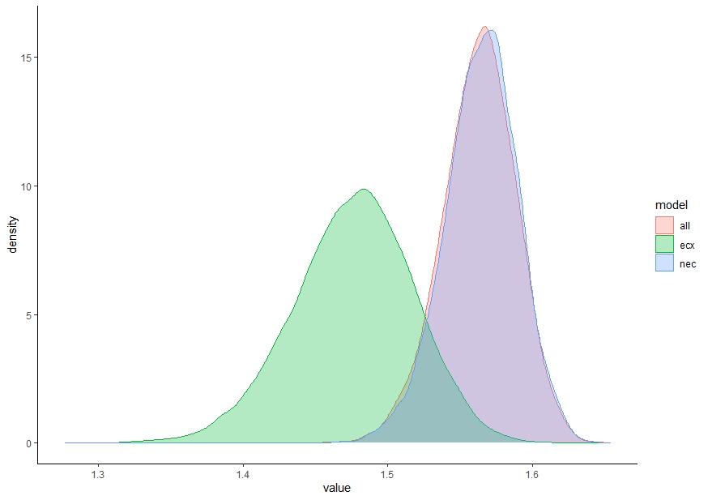
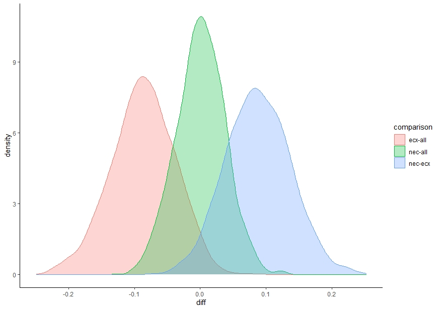
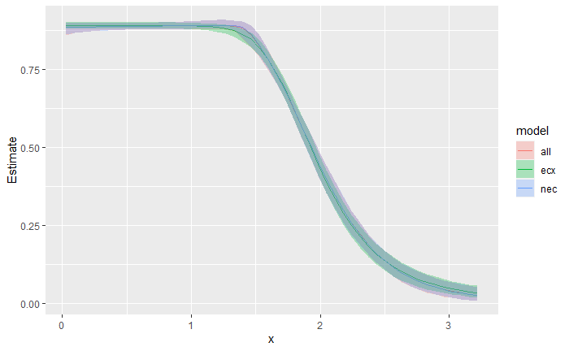
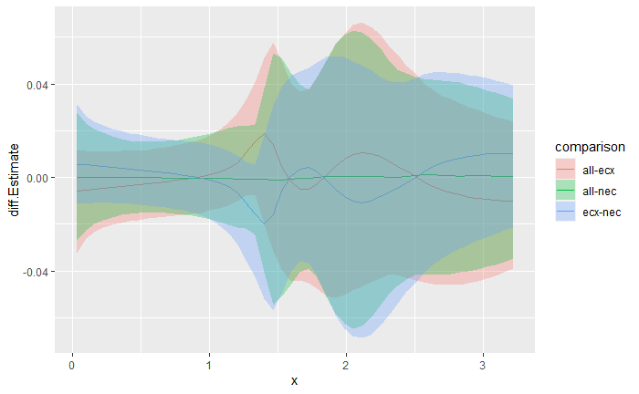
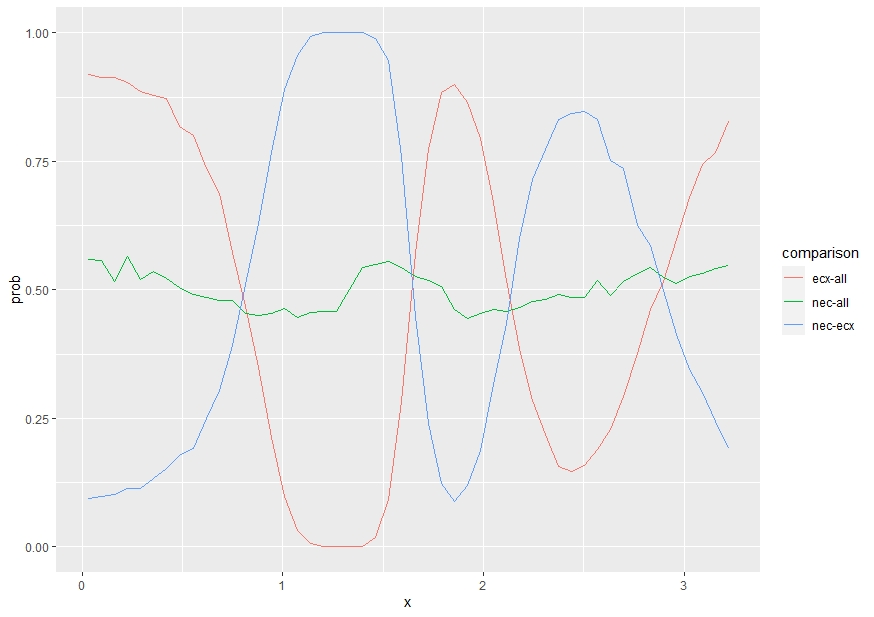

```{r include = FALSE}
stopifnot(require(knitr))
knitr::opts_chunk$set(warning = FALSE, message = FALSE)
```

```{r echo = FALSE}
e1 <- "https://open-aims.github.io/bayesnec/articles/example1.html"
e2 <- "https://open-aims.github.io/bayesnec/articles/example2.html"
e2b <- "https://open-aims.github.io/bayesnec/articles/example2b.html"
e3 <- "https://open-aims.github.io/bayesnec/articles/example3.html"
e4 <- "https://open-aims.github.io/bayesnec/articles/example4.html"
```

[e1]: `r e1`
[e2]: `r e2`
[e2b]: `r e2b`
[e3]: `r e3`
[e4]: `r e4`

# Overview

With `bayesnec` we have included a function that allows bootstrapped comparisons of posterior predictions. The main focus here is to showcase how the user can fit several different `bnec` model fits and can compare differences in the posterior predictions across these fits for individual endpoint estimates (e.g. nec, nsec or ecx) or across a range of predictor (x) values. Below we demonstrate usage of `compare_posterior` for objects of class `bayesnecfit` and `bayesmanecfit`. In this example we compare different types of models and model sets using a single dataset. However, the intent of this function is to allow comparison across different datasets that might represent, for example, different levels of a fixed factor covariate. At this time `bnec` does not allow inclusion of an interaction with a fixed factor. Including an interaction term within each of the non-linear models implemented in `bayesnec` is relatively straightforward, and may be introduced in future releases. However, in many cases the functional form of the response may change with different levels of a given factor. The substantial complexity of defining all possible non-linear model combinations at each factor level means it unlikely this could be feasibly implemented in `bayesnec` in the short term. In the meantime the greatest flexibility in the functional form of individual model fits can be readily obtained using models fitted independently to data within each factor level.

## Comparing posterior endpoint values


```{r, eval=FALSE}
library(brms)
library(bayesnec)
data(nec_data)

# Fit a set of models
exmp <- bnec(data = nec_data, x_var = "x", y_var = "y", model = "all")

class(exmp) # bayesmanecfit

```
This call fits all models that are suitable for modelling beta response data using a logit link. We can pull out the **nec** models and the **ecx** models separately, to create two more alternative model fits of this data.

```{r, eval=FALSE}
exmp_nec <- pull_out(exmp, model = "nec")
exmp_ecx <- pull_out(exmp, model = "ecx")
```
Now we have three different averaged model fits, all of class `bayemanec` in this case (because they all contain multiple fits). We can compare their posterior estimates of the ex10 values using `compare_posterior`.

```{r, eval=FALSE}
library(tidyverse)
post_comp <- compare_posterior(list("all" = exmp, "ecx" = exmp_ecx, "nec" = exmp_nec), comparison = "ecx", ecx_val = 10, precision=100)
names(post_comp)
# "posterior_list" 
# "posterior_data" 
# "diff_list"      
# "diff_data"      
# "prob_diff"
```
The `compare_posterior` function outputs several elements in a named list. This includes the **posterior_data** for each model in the comparison as a `data.frame` which we can use to plot a `geom_density` plot of the posterior estimates, so they can be compared visually.

```{r, eval=FALSE}
ggplot(post_comp$posterior_data, aes(x=value)) + 
  geom_density(aes(group=model, colour=model, fill = model), alpha=0.3) +
  theme_classic() 
```
```{r echo=FALSE, out.width='100%'}

```

From this you can see that the ec10 estimates are very similar for the **nec** and **all**. This is because the **nec** model types dominate the model weights in this **all** fit, see `exmp$mod_stats$wi`. The ec10 estimate is much lower (more conservative) for the **ecx** based models.


The `data.frame` "diff_data" can be used to make a similar plot, but specifically for the differences among models.

```{r, eval=FALSE}
ggplot(post_comp$diff_data, aes(x=diff)) + 
  geom_density(aes(group=comparison, colour=comparison, fill = comparison), alpha=0.3) +
  theme_classic() 
```
```{r echo=FALSE, out.width='100%'}

```

This shows clearly the differences among the three estimates, with there being no difference in the **nec** and **all** estimates (the probability density overlaps zero), and a tendency for the **ecx** to be lower than **all** and **nec**. Finally, the probability that the endpoint estimate for one model set is greater than the other is obtained in "prob_diff". Here you can see there is ~50% chance that **nec** is greater or less than **all** (i.e. they do not differ), but a 97% chance that the **ecx** estimate is lower than the other two.

```{r, eval=FALSE}
post_comp$prob_diff
#        all    ecx    nec
# all 1.0000 0.9730 0.5020
# ecx 0.0325 1.0000 0.0365
# nec 0.5350 0.9675 1.0000
```


## Comparing posterior fitted values

The user can also compare posterior fitted values across the full range of x values, using `comparison = "fitted"`. 

```{r, eval=FALSE}
library(tidyverse)
library(bayesnec)
post_comp_fitted <- compare_posterior(list("all" = exmp, "ecx" = exmp_ecx, "nec" = exmp_nec), comparison = "fitted", precision = 50)

```
In the case of `comparison = "fitted"` most of the elements returned by compare_posterior are class `data.frame`, with summary values for the posteriors, difference values and probabilities returned for each value of x, for each model, or model comparison.

```{r, eval=FALSE}
head(post_comp_fitted$posterior_data)
  model          x  Estimate      Q2.5     Q97.5
# 1   all 0.03234801 0.8885559 0.8718261 0.8991815
# 2   all 0.09741274 0.8885995 0.8733894 0.8991821
# 3   all 0.16247747 0.8886515 0.8745928 0.8991952
# 4   all 0.22754220 0.8887310 0.8759464 0.8991952
# 5   all 0.29260692 0.8888061 0.8767969 0.8992226
# 6   all 0.35767165 0.8888948 0.8775943 0.8992401

head(post_comp_fitted$diff_data)
#            x comparison   prob diff.Estimate    diff.Q2.5  diff.Q97.5
# 1 0.03234801    ecx-all 0.9185   0.012593751 -0.004832162 0.032435951
# 2 0.03234801    nec-all 0.5595   0.001079684 -0.013983908 0.019867356
# 3 0.03234801    nec-ecx 0.0940  -0.011610798 -0.027872420 0.005847878
# 4 0.09741274    ecx-all 0.9125   0.011564489 -0.005086656 0.031355968
# 5 0.09741274    nec-all 0.5575   0.001122890 -0.014437448 0.018929807
# 6 0.09741274    nec-ecx 0.0970  -0.010600105 -0.026747137 0.005956780

```

Using the collated posterior_data we can plot the predicted curves with confidence bounds for each of the input models. This shows clearly that the **ecx** model set begins to decline earlier than the **nec** or **all** sets, which are flat prior to the nec step point, and then decline more rapidly.

```{r, eval=FALSE}
ggplot(post_comp_fitted$posterior_data) +
geom_line(aes(x=x, y=Estimate, color= model), size=0.5) +
geom_ribbon(aes(x=x, ymin=Q2.5, ymax=Q97.5, fill=model), alpha=0.3) 
```
```{r echo=FALSE, out.width='100%'}

```

We can plot the differences between pairs of models in the list by plotting "diff.Estimate" from "diff_data" and using colors for the different comparisons. This plot highlights where the differences among these model sets are the greatest. As we have seen for ec10, the **nec** and **all** model sets are relatively similar across the entire range of concentrations (x) (green band overlaps zero). The red band is the difference between **ecx** and **all** and clearly shows that the **ecx** set has higher estimates than **all** at low x values, substantially lower estimates than **all** at low-moderate x values, higher estimates again in the centre of the x range, and then lower estimates than **all** towards to upper end of the x range. The blue band shows the difference between the **nec** and **ecx** model sets, which given the similarity between **nec** and **all**, shows an inverted pattern to the red band.

```{r eval = FALSE}
ggplot(post_comp_fitted$diff_data) +
  geom_line(aes(x=x, diff.Estimate, color=comparison), size=0.5) +
  geom_ribbon(aes(x=x, ymin=diff.Q2.5, ymax=diff.Q97.5, fill=comparison), alpha=0.3) 
```
```{r echo=FALSE, out.width='100%'}

```

And finally we can plot the probability that one model is greater than the other by plotting "prob" from "diff_data". The pattern of this plot is identical to the plot of differences, but the y axis now shows the probability of these differences. The green line hovers around 0.5 clearly indicating the lack of significant difference in the **nec** and **all** model sets at any point of the x-curve. The red and blue curves pass through 0.5 at several points, meaning there are parts of the curve where there is no significant difference between the **ecx** and the **nec** or **all** predictions. The greatest probability of difference among these curves is between values of ~1 and ~1.5 of x.

```{r eval = FALSE}
ggplot(post_comp_fitted$prob_diff) +
  geom_line(aes(x=x, prob, color=comparison), size=0.5)
```
```{r echo=FALSE, out.width='100%'}

```