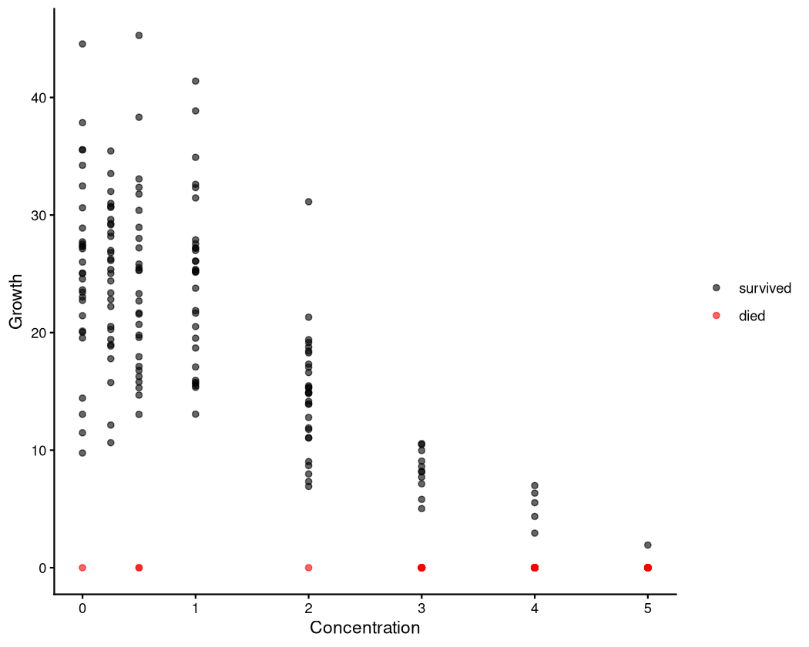
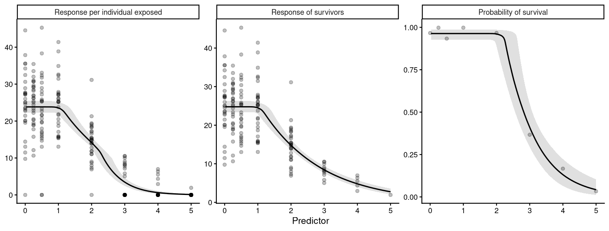
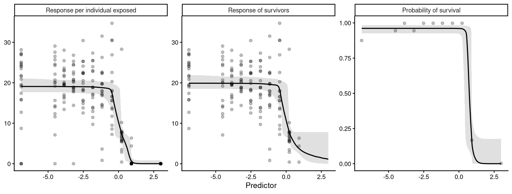
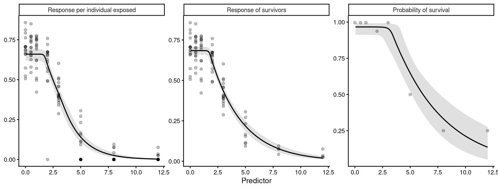

[e1]: https://open-aims.github.io/bayesnec/articles/example1.html
[e2]: https://open-aims.github.io/bayesnec/articles/example2.html
[e2b]: https://open-aims.github.io/bayesnec/articles/example2b.html
[e3]: https://open-aims.github.io/bayesnec/articles/example3.html
[e4]: https://open-aims.github.io/bayesnec/articles/example4.html
[e5]: https://open-aims.github.io/bayesnec/articles/example5.html

# Overview

Some toxicity tests damage the response and remove the responder at the same
time. A snail exposed to contaminated sediment may grow more slowly, or it may
die; an algal culture may be suppressed, or it may fail entirely. The
conventional analysis discards the individuals that did not survive and fits a
zero-bounded model to the remainder.

That analysis is not incorrect, but it answers a narrower question than it
appears to. Dropping the individuals that died conditions the estimate on
survival: it describes growth *given that the individual lived*, rather than
growth. Because mortality is itself concentration-dependent, the surviving
cohort at a high concentration is a more strongly selected group than the
surviving cohort at a low one, and the two are not directly comparable in the
way a single fitted curve implies.

A hurdle model retains both processes. It splits the likelihood into

* a **response** component, describing the measurement made on units that
  provided one, and
* a **zero-probability** component, describing whether a unit provided a
  measurement at all,

and therefore yields three toxicity estimates where the conventional analysis
yields one.

| endpoint | question | in `bayesnec` |
|---|---|---|
| response of survivors | how much does exposure suppress growth among individuals that live? | `which = "growth"` |
| survival | how much does exposure kill? | `which = "survival"` |
| combined | what is the expected response per individual *exposed*? | `which = "combined"` (default) |

The combined endpoint is the one the conventional analysis cannot produce, and
it is generally the quantity of interest for risk assessment, being the
expectation over the whole exposed cohort including the individuals that
contributed no measurement.

Two properties of these models are worth stating before any code, because both
are easily misread.

**The survivors-only analysis is not an approximation.** The hurdle
log-likelihood separates exactly into a term over all individuals and a term
over the survivors only,

```
log p(y_i) = log Bernoulli(alive_i | 1 - hu_i)
           + 1[y_i > 0] * log Gamma(y_i | mu_i, shape)
```

The two blocks share no parameters, so with independent priors the posterior
factorises and the survivors-only fit recovers the response block exactly. What
it cannot provide is the mortality curve or the combined endpoint. This is
demonstrated numerically below.

**Zero-inflated Gamma and Beta are the same model as the hurdle.**
Zero-inflation differs from a hurdle only when the base distribution can itself
produce zeros, which neither the Gamma nor the Beta can. The Stan density
`brms` generates for `zero_inflated_beta` is the hurdle form, with no mixture
at zero. `bayesnec` treats the two identically and carries the `brms` name
through, so `hurdle_gamma` and `zero_inflated_beta` differ in name and in the
support of the response, not in structure.

Throughout, the two components are referred to as "growth" and "survival",
after the case these models were written for. Nothing in the implementation is
specific to that reading: any process producing exact zeros alongside a
continuous response has the same structure.

To run this vignette we also need


``` r
library(bayesnec)
library(ggplot2)
library(dplyr)
```


# Two implementations of the same model

`bayesnec` provides two ways of fitting these models. Because the likelihood
factorises, the two give equivalent inference; the choice between them is
practical rather than statistical.

**Factorised** — `bnec_hurdle()` fits two ordinary `bnec()` models, a
zero-bounded model to the non-zero subset and a `bernoulli` model to the
survival indicator over all individuals, and returns them together as a
`bayesnechurdlefit`. Combined predictions are formed afterwards by multiplying
the two posteriors.

**Joint** — `bnec(family = "hurdle_gamma")` fits one model with two parameter
blocks. `brms` names the second block `hu` (or `zi` for the zero-inflated
families), and `bayesnec` gives it its own concentration-response curve with
every non-linear parameter carrying that prefix: `top` belongs to the response
block, `hutop` to the survival block.

| | factorised (`bnec_hurdle`) | joint (`family = "hurdle_gamma"`) |
|---|---|---|
| different equation on each block | yes, via `model_survival` | yes, via `model_survival` |
| model averaging | full crossed set via `crossed_weights()` | response block only |
| coupling the blocks (e.g. shared group-level effect) | no — breaks the factorisation | yes |
| number of fits | two | one |

The factorised route is the default recommendation because it is what makes
the crossed model comparison tractable. Since
`elpd(a, b) = elpd_growth(a) + elpd_survival(b)`, all combinations of the two
model sets can be compared from two fits rather than by fitting every pair. The
joint route is needed where the blocks must share structure, which is the one
thing the factorisation cannot express. The two are intended to be used in
sequence, and `bnec_joint()` connects them: fit and average the model sets with
`bnec_hurdle()`, select a combination from `crossed_weights()`, then refit that
combination jointly with whatever shared structure is required.

## The second block describes survival, not mortality

Both routes model the probability of **surviving**, which declines with
concentration and so matches the sign convention of all 23 `bayesnec`
equations. They arrive at this differently.

**In the factorised route the response is coded as survival.** There is a real
response variable for the second fit, so `bnec_hurdle()` constructs an
alive/dead indicator, `1` for alive, and fits an ordinary `bernoulli` model to
it using the equation unchanged. Nothing is inverted.

**In the joint route there is no second response to code.** `hu` is a
distributional parameter of the *same* response, and `brms` defines it as the
probability of a zero, that is, mortality. That definition belongs to the
family and cannot be exchanged for its complement. The formula is the only
element under the user's control, so `bayesnec` writes

```
hu = 1 - (an ordinary bayesnec equation, parameters prefixed)
```

which describes the same declining survival curve while leaving `hu` with the
meaning `brms` requires. The `1 -` is an adapter that makes the joint route
agree with the factorised one, not a modelling decision.

### Why survival rather than mortality

Placing the declining curve on survival, in both routes, has three
consequences.

* **The equation set is reused unchanged.** All 23 equations are available for
  the second block, with no mirrored versions to write or maintain. `beta` is
  exponentiated in every one, so they can only decline; an increasing mortality
  curve is not something they can express.
* **The priors remain well behaved.** `hutop` is control survival, so it sits
  near 1 and takes the same prior a `bernoulli` fit would use. Under a
  mortality parameterisation the equivalent parameter would sit near 0, against
  its lower bound, which samples poorly.
* **`ecx()` and `nsec()` continue to apply.** Both are defined as a percentage
  decline from the fitted control value, which requires a declining curve.
  `ecx()` inverts the zero-probability block back to survival before computing,
  so EC10 has the same meaning here as for any other model in the package.

Nothing is lost in exchange. `hunec` is the concentration at which survival
begins to fall, which is the concentration at which mortality begins to rise.

When reading output, the consequence is that `hutop` and `hunec` describe
**surviving**: `hutop` near 1 indicates near-complete survival in the controls.

# A simulated demonstration

To show the two routes agreeing, and to show what the survivors-only analysis
does and does not recover, we simulate a growth experiment in which both
processes operate and both are known.


``` r
set.seed(333)

nec3 <- function(x, top, beta, nec) {
  top * exp(-exp(beta) * (x - nec) * (x > nec))
}

# Truth: growth is suppressed from 1.0 onward, survival only from 2.0 onward,
# so the two thresholds are genuinely different and can be told apart.
conc <- rep(c(0, 0.25, 0.5, 1, 2, 3, 4, 5), each = 30)
mu_true <- nec3(conc, top = 25, beta = log(0.55), nec = 1.0)
p_alive <- nec3(conc, top = 0.97, beta = log(0.9), nec = 2.0)

alive <- rbinom(length(conc), 1, p_alive)
shape <- 12
growth <- rgamma(length(conc), shape = shape, rate = shape / mu_true)

# A death contributes a zero, not a missing row. Every individual that entered
# the experiment must be present in the data or the fit reads a smaller
# experiment rather than more zeros.
sim_dat <- data.frame(x = conc, y = ifelse(alive == 1, growth, 0))

table(sim_dat$x, sim_dat$y > 0)
#>       
#>        FALSE TRUE
#>   0        1   29
#>   0.25     0   30
#>   0.5      2   28
#>   1        0   30
#>   2        1   29
#>   3       19   11
#>   4       25    5
#>   5       29    1
```


``` r
ggplot(sim_dat, aes(x = x, y = y)) +
  geom_point(aes(colour = y == 0), alpha = 0.6) +
  scale_colour_manual(values = c("black", "red"),
                      labels = c("survived", "died"), name = NULL) +
  labs(x = "Concentration", y = "Growth") +
  theme_classic()
```

<div class="figure" style="text-align: center">

<p class="caption">Simulated growth data. Zeros are deaths, not small measurements.</p>
</div>

## The factorised route


``` r
fit_f <- bnec_hurdle(y ~ crf(x, model = "nec3param"), data = sim_dat,
                     seed = 333, refresh = 0)
```

The `summary` method reports all three endpoints together, and labels each by
type. Because both components here hold a single threshold model, every
no-effect estimate is a true NEC.


``` r
summary(fit_f, ecx = TRUE, ecx_vals = c(10, 50))
#> Object of class bayesnechurdlefit
#> 
#>    240 individuals exposed; 77 recorded as zero ( 32.1% )
#> 
#>   growth   : gamma -- nec3param 
#>   survival : bernoulli -- nec3param 
#> 
#> No-effect toxicity estimates
#>                 Q50 Q2.5 Q97.5
#> combined (NEC) 1.08 0.81  1.36
#> growth (NEC)   1.08 0.81  1.36
#> survival (NEC) 2.22 1.91  2.61
#> 
#> ECx estimates
#>                Q50 Q2.5 Q97.5
#> combined ec10 1.27 1.02  1.53
#> combined ec50 2.23 2.05  2.42
#> growth ec10   1.27 1.02  1.53
#> growth ec50   2.32 2.14  2.51
#> survival ec10 2.31 2.03  2.67
#> survival ec50 2.86 2.59  3.12
#> 
#> The combined endpoint is the expected response per individual exposed,
#> i.e. growth * survival. Use which = to select a component.
```

The growth and survival thresholds separate at close to their generating values
of 1.0 and 2.0. The combined threshold equals the growth threshold, for reasons
set out in the next section.

`which = "all"` draws the three curves together.


``` r
autoplot(fit_f, which = "all")
```

<div class="figure" style="text-align: center">

<p class="caption">The three curves. Growth is the response of survivors, survival the probability of contributing a measurement at all, and the combined endpoint their product. Note the zeros along the bottom of the combined panel: these are the deaths, and they are absent from the survivors panel entirely.</p>
</div>

## Where the combined endpoint differs from the growth endpoint

The combined no-effect estimate is `pmin(ne_growth, ne_survival)` evaluated per
posterior draw, and so equals the growth estimate whenever growth is the more
sensitive endpoint. In practice that is usually the case, because a contaminant
that kills has generally slowed growth at a lower concentration first. This is
a property of thresholds rather than a limitation of the combination: a
threshold marks the concentration at which an effect *begins*, and the combined
effect begins as soon as either process does.

The same reasoning applies more generally, and it is worth being explicit about
it, because it determines where the combined endpoint is informative. The
combined curve is the product of the two components, and below the survival
threshold survival sits at its control value, so the product is a constant
multiple of the growth curve there. Any estimate defined as a proportional
decline from the control — which is how both `ecx()` and `nsec()` are defined —
therefore takes the same value on the combined curve as on the growth curve
until the concentration at which mortality begins. The two separate only above
that point.


``` r
rbind(
  `growth NSEC`   = nsec(fit_f, which = "growth"),
  `combined NSEC` = nsec(fit_f, which = "combined"),
  `growth EC10`   = ecx(fit_f, ecx_val = 10, which = "growth"),
  `combined EC10` = ecx(fit_f, ecx_val = 10, which = "combined"),
  `growth EC50`   = ecx(fit_f, ecx_val = 50, which = "growth"),
  `combined EC50` = ecx(fit_f, ecx_val = 50, which = "combined")
) |>
  round(3)
#>                 Q50  Q2.5 Q97.5
#> growth NSEC   1.198 0.976 1.474
#> combined NSEC 1.218 0.988 1.493
#> growth EC10   1.265 1.016 1.529
#> combined EC10 1.265 1.016 1.529
#> growth EC50   2.316 2.137 2.505
#> combined EC50 2.226 2.047 2.420
```

In this simulation survival is unaffected until a concentration of 2.0, so the
NSEC and the EC10 — both of which fall below that — are effectively the same on
the two curves, while the EC50 is reached earlier on the combined curve than on
the growth curve. The gap continues to widen with the level of effect
considered, and is largest on the response scale itself, as the comparison in
the next section shows.

The practical consequence is that a hurdle model is not worth fitting for the
sake of a combined no-effect estimate, which will generally reproduce the
growth one. It is worth fitting for the survival curve, which a survivors-only
analysis cannot produce at all, and for the effect sizes at concentrations
where mortality is operating, which it systematically understates.

## The joint route

The same model fitted as a single two-block `brms` model. The two blocks appear
as `nec` and `hunec`.


``` r
fit_j <- bnec(y ~ crf(x, model = "nec3param"), data = sim_dat,
              family = "hurdle_gamma", seed = 333, refresh = 0)
```


``` r
summary(fit_j)
#> Object of class bayesnecfit containing the nec3param model
#> 
#>  Family: hurdle_gamma 
#>   Links: mu = identity; shape = identity; hu = identity 
#> Formula: y ~ top * exp(-exp(beta) * (x - nec) * step(x - nec)) 
#>          top ~ 1
#>          beta ~ 1
#>          nec ~ 1
#>          hu ~ 1 - (hutop * exp(-exp(hubeta) * (x - hunec) * step(x - hunec)))
#>          hutop ~ 1
#>          hubeta ~ 1
#>          hunec ~ 1
#>    Data: data (Number of observations: 240) 
#>   Draws: 4 chains, each with iter = 10000; warmup = 8000; thin = 1;
#>          total post-warmup draws = 8000
#> 
#> Regression Coefficients:
#>        Estimate Est.Error l-95% CI u-95% CI Rhat Bulk_ESS Tail_ESS
#> top       24.76      0.71    23.42    26.27 1.00     7339     5584
#> beta      -0.58      0.09    -0.74    -0.41 1.00     4958     5702
#> nec        1.09      0.15     0.81     1.36 1.00     4937     5018
#> hutop      0.96      0.01     0.93     0.99 1.00     7111     4234
#> hubeta     0.12      0.21    -0.27     0.57 1.00     5280     5351
#> hunec      2.22      0.22     1.91     2.61 1.00     5165     5992
#> 
#> Further Distributional Parameters:
#>       Estimate Est.Error l-95% CI u-95% CI Rhat Bulk_ESS Tail_ESS
#> shape    11.03      1.18     8.83    13.60 1.00     7767     5605
#> 
#> Draws were sampled using sampling(NUTS). For each parameter, Bulk_ESS
#> and Tail_ESS are effective sample size measures, and Rhat is the potential
#> scale reduction factor on split chains (at convergence, Rhat = 1).
#> 
#> 
#>     Estimate Q2.5 Q97.5
#> NEC     1.09 0.81  1.36
#> 
#> 
#> Bayesian R2 estimates:
#>    Estimate Est.Error Q2.5 Q97.5
#> R2     0.73      0.01 0.70  0.76
```

The component a toxicity estimate refers to is selected differently in the two
routes, and the distinction is easy to miss. A `bayesnechurdlefit` from
`bnec_hurdle()` holds two separate fits, so `which = "growth"`,
`"survival"` or `"combined"` selects one of them. A joint fit holds two
parameter blocks inside one model, so `ecx()` takes `dpar = "mu"` or
`dpar = "hu"` instead, naming the `brms` distributional parameter. The two are
not interchangeable, so it is worth checking `class(fit)` where a component
estimate comes back looking like the combined one.

Note also that `nec()` on a joint fit returns the **combined** threshold — the
per-draw minimum of the two blocks, as described above — and has no argument
for selecting a block. Comparing like with like:


``` r
comparison <- rbind(
  `factorised, combined`      = nec(fit_f, which = "combined"),
  `joint, combined`           = nec(fit_j),
  `factorised, growth EC10`   = ecx(fit_f, ecx_val = 10, which = "growth"),
  `joint, growth EC10`        = ecx(fit_j, ecx_val = 10, dpar = "mu"),
  `factorised, survival EC10` = ecx(fit_f, ecx_val = 10, which = "survival"),
  `joint, survival EC10`      = ecx(fit_j, ecx_val = 10, dpar = "hu")
)
round(comparison, 3)
#>                             Q50  Q2.5 Q97.5
#> factorised, combined      1.077 0.806 1.364
#> joint, combined           1.086 0.807 1.358
#> factorised, growth EC10   1.265 1.016 1.529
#> joint, growth EC10        1.275 1.021 1.524
#> factorised, survival EC10 2.311 2.027 2.674
#> joint, survival EC10      2.316 2.032 2.679
```

Differences between the two routes are Monte Carlo noise rather than a
modelling choice.

## What the survivors-only analysis recovers

The point made in the overview, demonstrated numerically. Fitting an ordinary
Gamma model to the non-zero rows only:


``` r
fit_s <- bnec(y ~ crf(x, model = "nec3param"),
              data = subset(sim_dat, y > 0),
              family = "Gamma", seed = 333, refresh = 0)
```


``` r
rbind(`survivors only` = nec(fit_s),
      `hurdle, growth` = nec(fit_f, which = "growth"))
#>                    Q50     Q2.5    Q97.5
#> survivors only 1.07742 0.805644 1.363567
#> hurdle, growth 1.07742 0.805644 1.363567
```

These are identical to every printed digit, because the factorised route *is*
this fit, run on the same subset with the same seed. The survivors-only
analysis is a correct estimate of the response of survivors, and nothing is
gained by replacing it.

The difficulty lies not in the fit but in reporting it as the effect of
exposure on growth. Comparing the two on the response scale:


``` r
nd <- data.frame(x = c(0, 1, 2, 3, 4, 5))
med <- function(m) apply(m, 2, median)

data.frame(
  x         = nd$x,
  growth    = round(med(posterior_epred(fit_f, which = "growth",   newdata = nd)), 2),
  survival  = round(med(posterior_epred(fit_f, which = "survival", newdata = nd)), 3),
  combined  = round(med(posterior_epred(fit_f, which = "combined", newdata = nd)), 2)
)
#>   x growth survival combined
#> 1 0  24.77    0.963    23.83
#> 2 1  24.50    0.963    23.55
#> 3 2  14.78    0.961    14.15
#> 4 3   8.43    0.410     3.46
#> 5 4   4.81    0.131     0.63
#> 6 5   2.74    0.043     0.12
```

At the control the two agree, because almost all individuals survive. At the
top concentration the survivors-only analysis reports a growth of about 2.7
while the expected growth per individual *exposed* is about 0.12, a factor of
more than twenty. The difference is not error; the two numbers answer different
questions. Which is appropriate depends on whether the assessment concerns the
individuals that survive or the population that was exposed. The survivors-only
analysis also cannot produce the mortality curve, which here is the effect with
the more clearly identified threshold.

# Crossed model averaging

The factorised route makes the full crossed model comparison available. Here we
fit a set spanning both threshold and smooth models to each component. As
elsewhere in `bayesnec`, model averaging is the preferred way of handling
uncertainty about the functional form of the response [see the
[Multi model usage][e2] vignette], and it matters as much for the survival
component as for the growth component.


``` r
mod_set <- c("nec3param", "nec4param", "ecx4param", "ecxexp", "ecxwb1",
             "ecxll3")

# adapt_delta is raised because the four-parameter models are weakly identified
# on the survival component here -- only the top three concentrations carry much
# mortality information, so the lower asymptote is poorly constrained. iter is
# reduced from the bayesnec default of 1e4 to keep a twelve-fit example
# tractable; these models converge comfortably at this length. See the fitting
# section of the worked example below for why `resolution` is reduced.
fit_m <- bnec_hurdle(y ~ crf(x, model = mod_set), data = sim_dat,
                     seed = 333, refresh = 0, iter = 4e3, cores = 4,
                     resolution = 200,
                     control = list(adapt_delta = 0.99))
```


``` r
round(crossed_weights(fit_m), 3)
#>            survival
#> growth      nec3param nec4param ecx4param ecxexp ecxwb1 ecxll3
#>   nec3param     0.370     0.115     0.040      0  0.026  0.042
#>   nec4param     0.142     0.044     0.015      0  0.010  0.016
#>   ecx4param     0.026     0.008     0.003      0  0.002  0.003
#>   ecxexp        0.000     0.000     0.000      0  0.000  0.000
#>   ecxwb1        0.013     0.004     0.001      0  0.001  0.001
#>   ecxll3        0.072     0.022     0.008      0  0.005  0.008
```

Rows are growth models, columns survival models, and the entries are weights
over every combination of the two. Because the components are independent, the
crossed weights are exactly the outer product of the two components' weights,
so all `n_growth * n_survival` combinations follow from the two fits alone
rather than from fitting every pair. Note that this identity is specific to
pseudo-BMA; stacking optimises a different objective whose solution is not
generally an outer product.

## Reading the no-effect estimate from a mixed model set


``` r
summary(fit_m, ecx = TRUE, ecx_vals = c(10, 50), resolution = 500)
#> Object of class bayesnechurdlefit
#> 
#>    240 individuals exposed; 77 recorded as zero ( 32.1% )
#> 
#>   growth   : gamma -- nec3param, nec4param, ecx4param, ecxexp, ecxwb1, ecxll3 
#>   survival : bernoulli -- nec3param, nec4param, ecx4param, ecxexp, ecxwb1, ecxll3 
#> 
#> No-effect toxicity estimates
#>                    Q50 Q2.5 Q97.5
#> combined (N(S)EC) 1.07 0.31  1.43
#> growth (N(S)EC)   1.07 0.31  1.44
#> survival (N(S)EC) 2.24 1.53  2.87
#> 
#> NSEC values appear where a model set contains smooth (ECx) models, which
#> carry no threshold parameter; N(S)EC is a model-averaged combination
#> of the two (Fisher et al. 2023).
#> 
#> ECx estimates
#>                Q50 Q2.5 Q97.5
#> combined ec10 1.25 0.49  1.58
#> combined ec50 2.22 1.97  2.44
#> growth ec10   1.26 0.49  1.57
#> growth ec50   2.31 2.10  2.50
#> survival ec10 2.34 1.88  2.89
#> survival ec50 2.88 2.56  3.16
#> 
#> The combined endpoint is the expected response per individual exposed,
#> i.e. growth * survival. Use which = to select a component.
```

Each model set now contains smooth (ECx) models alongside threshold ones. A
smooth model has no threshold parameter, so its contribution to the weighted
posterior is an NSEC [@fisherfox2023] rather than an NEC, and the
model-averaged estimate is a weighted mixture of the two. `bayesnec` refers to
this as the N(S)EC [@fisher2023ieam], and `summary` labels each endpoint
accordingly. The same quantity is returned by `nec()`, which emits a message to
the same effect but returns an unlabelled vector; `summary` is the better
choice where the distinction matters.

## Refitting a selected combination jointly

Model averaging is done on the factorised fit, because the joint route can
average only over the response block. Where a single fit is required — most
often because the two blocks need to share structure, which the factorisation
cannot express — `best_crossed()` reports the combination carrying the highest
crossed weight and `bnec_joint()` refits that combination as one two-block
model.


``` r
best_crossed(fit_m)
#> $growth
#> [1] "nec3param"
#> 
#> $survival
#> [1] "nec3param"
#> 
#> $weight
#> [1] 0.3699382
```


``` r
fit_bj <- bnec_joint(fit_m, seed = 333, refresh = 0, iter = 4e3, cores = 4,
                     control = list(adapt_delta = 0.99))
```


``` r
summary(fit_bj)
#> Object of class bayesnecfit containing the nec3param model
#> 
#>  Family: hurdle_gamma 
#>   Links: mu = identity; shape = identity; hu = identity 
#> Formula: y ~ top * exp(-exp(beta) * (x - nec) * step(x - nec)) 
#>          top ~ 1
#>          beta ~ 1
#>          nec ~ 1
#>          hu ~ 1 - (hutop * exp(-exp(hubeta) * (x - hunec) * step(x - hunec)))
#>          hutop ~ 1
#>          hubeta ~ 1
#>          hunec ~ 1
#>    Data: data (Number of observations: 240) 
#>   Draws: 4 chains, each with iter = 4000; warmup = 3200; thin = 1;
#>          total post-warmup draws = 3200
#> 
#> Regression Coefficients:
#>        Estimate Est.Error l-95% CI u-95% CI Rhat Bulk_ESS Tail_ESS
#> top       24.78      0.72    23.41    26.32 1.00     2096     1792
#> beta      -0.58      0.09    -0.75    -0.40 1.00     1664     2113
#> nec        1.08      0.15     0.81     1.37 1.00     1437     1347
#> hutop      0.96      0.01     0.93     0.99 1.00     2650     1980
#> hubeta     0.12      0.22    -0.28     0.58 1.00     1866     1706
#> hunec      2.22      0.22     1.91     2.62 1.00     1790     2364
#> 
#> Further Distributional Parameters:
#>       Estimate Est.Error l-95% CI u-95% CI Rhat Bulk_ESS Tail_ESS
#> shape    11.02      1.22     8.85    13.62 1.00     2858     2113
#> 
#> Draws were sampled using sampling(NUTS). For each parameter, Bulk_ESS
#> and Tail_ESS are effective sample size measures, and Rhat is the potential
#> scale reduction factor on split chains (at convergence, Rhat = 1).
#> 
#> 
#>     Estimate Q2.5 Q97.5
#> NEC     1.08 0.81  1.37
#> 
#> 
#> Bayesian R2 estimates:
#>    Estimate Est.Error Q2.5 Q97.5
#> R2     0.73      0.01 0.70  0.76
```

The equation used for each block is set independently, so the same fit can be
requested directly: `crf` in the formula names the response block's equation
and `model_survival` names the survival block's. `bnec_joint()` is a
convenience wrapper that fills in the two names from `best_crossed()`.


``` r
bnec(y ~ crf(x, model = "nec3param"), data = sim_dat,
     family = "hurdle_gamma", model_survival = "ecx4param")
```

Selecting a single combination discards the rest of the crossed table, which is
a real loss where the weights are spread, so this step is worth taking only
where the joint form is needed for a reason the factorisation cannot serve.
Group-level structure spanning both blocks is the main such reason, and is
supplied through the `formula` argument of `bnec_joint()`.

# Worked example: chronic snail toxicity

The `nassarius` dataset holds four chronic toxicity tests on the tropical
marine snail *Nassarius dorsatus*, one row per individual snail that entered
the experiment. The test method follows @trenfield2016, although that paper
does not describe the mortality scenario these models address. The contaminants
are anonymised as A–D and the dose units are not stated, so only the relative
spacing of doses — which is all any toxicity estimate depends on — is
preserved.

The endpoint is a growth measure, which matters for the reason set out in the
data-preparation section below: growth can in principle be negative, so zeros
in it cannot be assumed structural without checking how negatives were handled.
In these data they were not floored — four survivors are recorded negative,
which is the evidence that no truncation happened upstream.


``` r
data(nassarius)
str(nassarius)
#> 'data.frame':	1208 obs. of  6 variables:
#>  $ contaminant: Factor w/ 4 levels "A","B","C","D": 1 1 1 1 1 1 1 1 1 1 ...
#>  $ dose       : num  0 0 0 0 0 0 0 0 0 0 ...
#>  $ tank       : chr  "A-1" "A-1" "A-1" "A-1" ...
#>  $ alive      : int  1 1 1 1 1 0 1 1 1 1 ...
#>  $ growth     : num  8.72 28.17 27.28 15.86 19.02 ...
#>  $ record     : Factor w/ 5 levels "measured","sentinel_code",..: 1 1 1 1 1 2 1 1 1 1 ...
```

Mortality is substantial and concentration-dependent in every test, which is
what makes these data unsuitable for a survivors-only analysis.


``` r
nassarius |>
  group_by(contaminant) |>
  summarise(exposed = n(), survived = sum(alive),
            died = sum(alive == 0),
            pct_died = round(100 * mean(alive == 0), 1), .groups = "drop")
#> # A tibble: 4 × 5
#>   contaminant exposed survived  died pct_died
#>   <fct>         <int>    <int> <int>    <dbl>
#> 1 A               204      166    38     18.6
#> 2 B               284       63   221     77.8
#> 3 C               348      320    28      8  
#> 4 D               372      327    45     12.1
```

## Deaths were not recorded as zeros

The `alive` column here is the product of a reconstruction rather than
something read directly off the source records. In those records a death
appeared as one of four traces, and only the first is obvious:

1. a **sentinel value** far below the real data, one constant per test;
2. a **blank replicate** within a tank that ran;
3. a **tank missing** from a treatment that ran;
4. a **treatment missing from the file entirely**, because nothing in it
   survived.

The `record` column preserves that provenance, and the result is worth
examining before any model is fitted.


``` r
nassarius |>
  filter(alive == 0) |>
  mutate(record = droplevels(record)) |>
  count(contaminant, record, .drop = FALSE) |>
  tidyr::pivot_wider(names_from = record, values_from = n)
#> # A tibble: 4 × 5
#>   contaminant sentinel_code blank_rep absent_tank absent_dose
#>   <fct>               <int>     <int>       <int>       <int>
#> 1 A                       8         0          12          18
#> 2 B                      11         0           0         210
#> 3 C                       4         0           0          24
#> 4 D                       0         9          12          24
```

Only the first two categories appear in the source file. The last two are
snails that are absent from it altogether — a tank missing from a treatment
that ran, or a treatment missing entirely because nothing in it survived — and
they account for 79% to 95% of the deaths in every test.

Had these been omitted, each fit would have read a smaller experiment with less
mortality rather than a full one with more. The fourth trace is the most
consequential because it cannot be recovered from the file at any level of
care: it requires returning to the test design and establishing which
treatments were set up. Here every test was taken to a common top dose at which
nothing survived, and no test records it.

A reinstated death is not a guess. A treatment that ran and killed every
individual is a fact about the experiment that happens to have been recorded by
omission, and recovering it adds information rather than inventing it. The
reconstruction is part of the analysis rather than a caveat attached to it, and
the next section quantifies what it contributes.

## The contribution of the reconstruction: contaminant B

B is the most severely affected of the four tests, and for that reason it is
the clearest illustration of why a hurdle model is needed.


``` r
B <- subset(nassarius, contaminant == "B")
survivors <- subset(B, growth > 0)

c(exposed = nrow(B), survived = nrow(survivors),
  doses_total = length(unique(B$dose)),
  doses_with_a_survivor = length(unique(survivors$dose)))
#>               exposed              survived           doses_total 
#>                   284                    63                    14 
#> doses_with_a_survivor 
#>                     4
```

A survivors-only analysis of these data would contain 63 snails of the 284
exposed and, because a dose at which nothing survived contributes no rows, only
the four lowest doses. The ten doses from 0.30 upward would not appear in it at
all: not as zeros, and not in any other form.


``` r
round(tapply(survivors$growth, survivors$dose, mean), 2)
#>     0  0.02  0.05   0.1 
#> 24.82 24.52 19.83  6.94
```

Those four numbers are the entire dataset such an analysis would see. It would
report a smooth decline in growth across a dose range topping out at 0.10, and
each of its fitted values would be defensible. What it could not report is that
the contaminant sterilises the experiment at three times that dose. The 221
snails carrying that information are precisely the ones it discards. This is
the conditioning problem in an extreme form: 78% of the cohort and 71% of the
tested doses are removed from the analysis by the act of dropping the dead.

### Does the reconstruction change the answer?

Only for the survival component — and that is exactly the point.

The three variants below differ only in rows recording individuals that died.
They contain 74, 95 and 284 snails respectively, but all three contain the same
63 survivors. The growth component is fitted to the non-zero responses alone,
so it is *identical* in all three by construction: a survivors-only analysis of
B returns the same answer however much of the mortality is reconstructed. That
is the factorisation demonstrated in the simulation above, seen from the other
side — reinstated deaths are invisible to the response block.

The survival component is a `bernoulli` model over every individual that
entered the experiment, so it sees all of them. Refitting that block on
progressively more of the reconstruction:


``` r
observed <- subset(B, record != "absent_dose")

variants <- list(
  `recorded deaths only` = observed,
  `+ first all-dead dose` = rbind(observed, subset(B, dose == 0.30)),
  `+ all all-dead doses` = B
)

off <- min(B$dose[B$dose > 0]) / 10
sens <- lapply(variants, function(d) {
  d$log_dose <- log(d$dose + off)
  f <- bnec(alive ~ crf(log_dose, model = "nec3param"), data = d,
            family = "bernoulli", seed = 10, refresh = 0, cores = 4,
            control = list(adapt_delta = 0.99))
  nec(f, xform = function(z) exp(z) - off)
})
```


``` r
do.call(rbind, sens)
#>                              Q50       Q2.5      Q97.5
#> recorded deaths only  0.06574407 0.03670270 0.09733147
#> + first all-dead dose 0.08272188 0.05214153 0.09824861
#> + all all-dead doses  0.08520196 0.05699393 0.09830694
```

Two conclusions follow, and they have different implications.

**Reinstating the first all-dead dose changes the survival threshold**,
moving it by about 25% and halving the credible interval. Analysing only the
doses that appear in the file biases that threshold low, because the last dose
those records contain is one at which half the snails were still alive, so the
fit never sees the concentration at which survival collapses. Nothing about the
growth estimate moves, which is why this cost is invisible to an analysis that
looks only at survivors.

**The all-dead doses above it add little** — about 3%, well inside the
interval. Once the fitted curve has reached zero, further doses at which every
individual died are largely redundant. The information about where survival
collapses sits in the narrow window between the last dose with full survival
and the first with none.

The second conclusion is the more useful in practice, because it indicates
where effort belongs. Reconstructing the *first* treatment that killed every
individual is essential and irreplaceable; reconstructing those beyond it makes
little difference to the estimate. Where records are incomplete, that is where
to concentrate.

B's high mortality is a finding rather than a limitation of the dataset. Its
growth curve rests on four doses because the contaminant kills every individual
beyond them, and no analysis can recover growth measurements from snails that
did not survive to be measured. The contribution of the hurdle model is that it
reports this rather than conditioning it away.

## Preparing the response

Two decisions have to be made before fitting, and both are of the kind usually
made silently.

**The four negative growth values.** The assay is destructive, so growth is
obtained by referencing each snail to a baseline mean rather than to its own
starting size. That referencing carries error, and four survivors of 876 are
slightly negative. The Gamma distribution cannot accommodate them.


``` r
subset(nassarius, alive == 1 & growth <= 0)
#>     contaminant  dose  tank alive     growth   record
#> 159           A  1.25  A-27     1 -0.7424596 measured
#> 169           A  2.50  A-29     1 -7.2883168 measured
#> 766           C 10.00 C-124     1 -1.4209774 measured
#> 797           C 15.00 C-129     1 -2.7495489 measured
```

This is measurement noise around a true value near zero — a *random* zero
region rather than a structural one — so these snails must not be passed to the
hurdle as though they had died. They are nudged to half the smallest positive
value in their own test. At 0.46% of survivors this is immaterial to the fit,
but it is a substitution and is stated rather than done quietly. See the
data-preparation section below for why the alternative, flooring them to zero,
would be considerably worse than immaterial.

**The control on a log dose scale.** Dose spans several orders of magnitude, so
the models are fitted on a log scale, and `log(0)` is undefined. The control is
placed one decade below the lowest tested dose: far enough to read as a
control, close enough not to stretch the fitted range.


``` r
prep <- function(d) {
  pos_min <- min(d$growth[d$growth > 0])
  d$growth <- ifelse(d$alive == 1 & d$growth <= 0, pos_min / 2, d$growth)
  off <- min(d$dose[d$dose > 0]) / 10
  d$log_dose <- log(d$dose + off)
  d
}

back_transform <- function(d) {
  off <- min(d$dose[d$dose > 0]) / 10
  function(z) exp(z) - off
}
```

## Fitting

Before fitting, the simulation objects are released. Every `bnec` fit forks
worker processes that share the memory of the session that spawned them, and
each page those workers touch stops being shared, so a large session makes
every subsequent fit more expensive. None of the simulation fits are referenced
again.


``` r
rm(fit_f, fit_j, fit_s, fit_m, fit_bj)
invisible(gc())
```

Each test is fitted with `mod_set`, the same six-model set used in the
simulation above, on both components. That is 48 model fits in total, so the
loop below is written to hold as few of them at once as it can: each test is
summarised as it is fitted and then discarded, keeping only contaminant A for
the plots that follow. Holding all four six-model hurdle fits at once is the
largest memory cost in this vignette, and an avoidable one.


``` r
tests <- split(nassarius, nassarius$contaminant)

# adapt_delta is pushed high because the survival curve is weakly identified in
# every test -- mortality is confined to the top one or two doses.
#
# `cores` is worth setting explicitly: bayesnec does not pass one through, so
# brms falls back to mc.cores, which is 1 unless it has been changed, and the
# chains then run one after another. On a fit of this size that is the single
# largest cost.
#
# `resolution` sets the predictor grid each fit stores its predictions on. It is
# reduced from the default 1000 because the only reported quantity that grid
# feeds is the NSEC contribution to the model-averaged N(S)EC, and that is
# located by interpolation (`modelbased::zero_crossings`, which itself samples
# on a fixed 100-point grid), so its precision saturates well below 200. ECx is
# read off a fresh grid at reporting time, where a finer one is requested.
fit_test <- function(d) {
  bnec_hurdle(growth ~ crf(log_dose, model = mod_set),
              data = prep(d), seed = 10, refresh = 0, cores = 4, iter = 4e3,
              resolution = 200,
              control = list(adapt_delta = 0.99, max_treedepth = 12))
}

estimates <- function(f, ct, back) {
  do.call(rbind, lapply(c("growth", "survival", "combined"), function(w) {
    data.frame(
      contaminant = ct, endpoint = w,
      ne = nec(f, which = w, xform = back)[1],
      ec10 = ecx(f, ecx_val = 10, which = w, xform = back,
                 resolution = 500)[1],
      ec50 = ecx(f, ecx_val = 50, which = w, xform = back,
                 resolution = 500)[1],
      row.names = NULL
    )
  }))
}

endpoints <- list()
for (ct in names(tests)) {
  f <- fit_test(tests[[ct]])
  endpoints[[ct]] <- estimates(f, ct, back_transform(tests[[ct]]))
  # Contaminant A is carried forward for the summary, plot and crossed weights
  # below; the rest are released as soon as their estimates are extracted.
  if (ct == "A") fit_a <- f
  rm(f)
  gc()
}
```

The `summary` method reports all three endpoints for one test. Passing `xform`
applies the back-transformation to every estimate in the table, so the values
are on the original dose scale.


``` r
# resolution is the number of predictor values ECx is read off, and every call
# rebuilds the component predictions for both six-model sets. The default of
# 1000 is finer than two significant figures can show over this dose range, and
# 500 keeps the memory these repeated rebuilds need well under control.
summary(fit_a, ecx = TRUE, ecx_vals = c(10, 50), resolution = 500,
        xform = back_transform(tests[["A"]]))
#> Object of class bayesnechurdlefit
#> 
#>    204 individuals exposed; 38 recorded as zero ( 18.6% )
#> 
#>   growth   : gamma -- nec3param, nec4param, ecx4param, ecxexp, ecxwb1, ecxll3 
#>   survival : bernoulli -- nec3param, nec4param, ecx4param, ecxexp, ecxwb1, ecxll3 
#> 
#> No-effect toxicity estimates
#>                    Q50 Q2.5 Q97.5
#> combined (N(S)EC) 0.60 0.20  1.15
#> growth (N(S)EC)   0.60 0.20  1.15
#> survival (N(S)EC) 1.71 1.17  2.40
#> 
#> NSEC values appear where a model set contains smooth (ECx) models, which
#> carry no threshold parameter; N(S)EC is a model-averaged combination
#> of the two (Fisher et al. 2023).
#> 
#> ECx estimates
#>                Q50 Q2.5 Q97.5
#> combined ec10 0.63 0.00  1.15
#> combined ec50 1.06 0.74  1.24
#> growth ec10   0.63 0.00  1.12
#> growth ec50   1.06 0.76  1.27
#> survival ec10 1.71 0.00  2.39
#> survival ec50 2.12 1.46  2.49
#> 
#> The combined endpoint is the expected response per individual exposed,
#> i.e. growth * survival. Use which = to select a component.
```

Every estimate is labelled N(S)EC, because each model set mixes threshold and
smooth models. This is the intended behaviour of a model-averaged no-effect
estimate, but it means the reported values are not pure NEC values and should
not be described as such.

Collecting the median estimates across the four tests, where `ne` is the
no-effect estimate — the N(S)EC, as above:


``` r
endpoints <- do.call(rbind, endpoints)
endpoints[, 3:5] <- signif(endpoints[, 3:5], 2)
endpoints
#>     contaminant endpoint     ne   ec10   ec50
#> A.1           A   growth  0.600  0.630  1.100
#> A.2           A survival  1.700  1.700  2.100
#> A.3           A combined  0.600  0.640  1.100
#> B.1           B   growth  0.050  0.047  0.073
#> B.2           B survival  0.080  0.081  0.100
#> B.3           B combined  0.049  0.047  0.071
#> C.1           C   growth  0.029  0.029  3.500
#> C.2           C survival 14.000 15.000 16.000
#> C.3           C combined  0.029  0.029  3.300
#> D.1           D   growth  0.034  0.079  7.700
#> D.2           D survival 12.000 13.000 15.000
#> D.3           D combined  0.034  0.081  7.500
```

Three features of these results are notable.

**The combined and growth rows are all but identical.** The combined no-effect
estimate matches the growth estimate exactly for A, C and D, and differs only
in the third decimal for B, 0.049 against 0.050. This is the per-draw minimum
at work: the combined estimate can depart from growth only where mortality
begins close enough to the growth threshold to bind on at least some draws. B
is the test where it comes closest — its survival estimate is 1.6 times its
growth estimate, against ratios of 2.8 for A and several hundred for C and D —
which is why B is the one that moves, and why it moves so little.

**Growth and survival, in contrast, separate widely.** The two sit within a
factor of two for B and a factor of three for A, but more than two orders of
magnitude apart for C and D, whose growth declines from the low end of the
tested range while survival holds until close to the top dose of 20. A single
number from a survivors-only analysis cannot express that, and the four tests
would look far more alike than they are. The survival curve is also the one
thing such an analysis cannot produce at any level of effect.

**What the combined endpoint adds appears above the no-effect level.** The
combined EC50 sits at or below the growth EC50 in all four tests: about 6%
lower for C, 3% for B and D, and unchanged for A, whose growth EC50 of 1.1
falls below the concentration at which its survival curve leaves the control.
C and D separate at EC50 despite survival estimates two orders of magnitude
higher, because a model-averaged survival curve containing smooth models is
never perfectly flat and so contributes a little decline well below its nominal
threshold. Differences in the last digit of the EC10 column are at the scale of
the predictor grid rather than anything interpretable. The larger contribution
is on the response scale, where the combined endpoint gives the expected growth
per individual exposed rather than per individual that lived.


``` r
autoplot(fit_a, which = "all")
```

<div class="figure" style="text-align: center">

<p class="caption">Contaminant A: the combined endpoint, the growth of survivors, and the probability of survival. The predictor is on the log dose scale used for fitting.</p>
</div>

## Crossed model weights

Each component was fitted with a set of six models, so there are 36 crossed
combinations, all available from the two fits.


``` r
round(crossed_weights(fit_a), 3)
#>            survival
#> growth      nec3param nec4param ecx4param ecxexp ecxwb1 ecxll3
#>   nec3param     0.147     0.027     0.026      0  0.023  0.119
#>   nec4param     0.088     0.016     0.015      0  0.014  0.071
#>   ecx4param     0.060     0.011     0.010      0  0.009  0.048
#>   ecxexp        0.007     0.001     0.001      0  0.001  0.005
#>   ecxwb1        0.062     0.011     0.011      0  0.010  0.050
#>   ecxll3        0.067     0.012     0.012      0  0.010  0.054
```

Weight is spread across several combinations rather than concentrated in one,
which is the situation model averaging exists to handle. Reporting a single
crossed combination would discard that uncertainty, and it is the reason
`bnec_joint()` should be reserved for cases where the joint form is required
for structural reasons.

# The hurdle Beta

`zero_inflated_beta` is the two-block family for a proportional response
bounded on (0, 1), and is the direct analogue of `hurdle_gamma`: a Beta
response block for the units that gave a measurement, and a survival block for
whether a unit gave one at all. It applies where a proportion is measured on
each unit and some units fail entirely — an algal culture expressed as a
proportion of a design ceiling, with replicates that crashed, for example.

In practice the conditions under which it is appropriate are more restrictive
than they first appear, and the most likely misuse is reaching for it simply
because a proportion happens to contain some zeros.

## When a hurdle Beta is appropriate

A usable hurdle-Beta case requires **all** of:

* a proportion whose denominator is **fixed by design or measured per unit**,
  not a control mean and not an observed maximum (see the normalisation caveat
  below);
* a **declining** response, matching the convention of the `bayesnec` model set;
* structural zeros produced by a process that genuinely fails;
* **no mass at 1**.

The last condition is the binding one, and it fails for structural reasons
rather than by accident:

* if the denominator is the unit's own baseline, the response can exceed it,
  producing values at or above 1 — and capping them there converts the excess
  into a spike at the boundary, which is the same operation as flooring
  (discussed below) applied at the other end;
* if the "nothing happened" state sits at the *top* of the scale, the inflation
  is at 1 rather than at 0, which requires a different family;
* if the response is genuinely a count out of a known total, the binomial is
  already correct and no Beta is needed.

A response inflated at both boundaries requires `zero_one_inflated_beta` or an
ordered-Beta treatment, neither of which is available in `bayesnec`. A response
that is a ratio to a per-unit baseline is often better modelled with
`hurdle_gamma` on the uncapped ratio.

## A simulated example

No dataset shipped with `bayesnec`, and none of the candidates considered while
this vignette was written, satisfies all four conditions — the mass-at-1
condition is the one that keeps failing, for the structural reasons just given.
The demonstration below is therefore **simulated**, and deliberately constructed
to meet every condition. It shows what the family does when it is the right
reach; it is not evidence that any particular real dataset qualifies, and the
checklist above remains the thing to work through before using it.

The scenario is an algal growth-rate test. Growth is expressed as a proportion
of a ceiling **fixed in advance by the test protocol** — not a control mean and
not the observed maximum, which is what condition one requires. Cultures that
crash contribute an exact zero; cultures that grow contribute a proportion drawn
from a Beta, which can never itself return a zero. So every zero in the data is
structural.


``` r
set.seed(101)

# Growth declines from a control proportion of 0.70 with a threshold at 1.5;
# cultures start crashing only from 3.0, so the two thresholds are distinct.
conc <- rep(c(0, 0.5, 1, 2, 3, 5, 8, 12), each = 16)
mu_true <- nec3(conc, top = 0.70, beta = log(0.32), nec = 1.5)
p_alive <- nec3(conc, top = 0.98, beta = log(0.20), nec = 3.0)

alive <- rbinom(length(conc), 1, p_alive)
# phi is the Beta precision: higher values give tighter scatter about mu.
prop <- rbeta(length(conc), mu_true * 30, (1 - mu_true) * 30)

zib_dat <- data.frame(x = conc, y = ifelse(alive == 1, prop, 0))
```

Checking the two conditions that can be read directly off the data — no mass at
1, and zeros confined to crashed cultures rather than merely small measurements:


``` r
c(n = nrow(zib_dat),
  zeros = sum(zib_dat$y == 0),
  max = round(max(zib_dat$y), 3),
  at_or_above_1 = sum(zib_dat$y >= 1))
#>             n         zeros           max at_or_above_1 
#>       128.000        33.000         0.857         0.000

table(dose = zib_dat$x, measured = zib_dat$y > 0)
#>      measured
#> dose  FALSE TRUE
#>   0       0   16
#>   0.5     0   16
#>   1       0   16
#>   2       1   15
#>   3       0   16
#>   5       8    8
#>   8      12    4
#>   12     12    4
```

The largest observed proportion is well short of 1 and nothing reaches it, so
there is no boundary spike for the Beta to choke on. Mortality is graded across
the top four doses rather than jumping straight to total loss, which leaves the
response block with data at every dose and the survival threshold identifiable.

Both routes take the data unchanged. The factorised route selects the response
family from the non-zero rows, and so picks a Beta here rather than the Gamma
appropriate to the snail example.


``` r
zib_f <- bnec_hurdle(y ~ crf(x, model = "nec3param"), data = zib_dat,
                     seed = 101, refresh = 0)
```


``` r
summary(zib_f, ecx = TRUE, ecx_vals = c(10, 50))
#> Object of class bayesnechurdlefit
#> 
#>    128 individuals exposed; 33 recorded as zero ( 25.8% )
#> 
#>   growth   : beta -- nec3param 
#>   survival : bernoulli -- nec3param 
#> 
#> No-effect toxicity estimates
#>                 Q50 Q2.5 Q97.5
#> combined (NEC) 1.69 1.42  1.92
#> growth (NEC)   1.69 1.42  1.92
#> survival (NEC) 3.16 2.11  4.10
#> 
#> ECx estimates
#>                Q50 Q2.5 Q97.5
#> combined ec10 2.00 1.76  2.20
#> combined ec50 3.48 3.15  3.82
#> growth ec10   2.00 1.76  2.20
#> growth ec50   3.69 3.45  4.00
#> survival ec10 3.65 2.74  4.52
#> survival ec50 6.34 5.28  7.97
#> 
#> The combined endpoint is the expected response per individual exposed,
#> i.e. growth * survival. Use which = to select a component.
```

The joint route asks for the family explicitly. Its second block is named `zi`
rather than `hu`, so the survival parameters appear as `zitop`, `zibeta` and
`zinec`; nothing else about the specification changes.


``` r
zib_j <- bnec(y ~ crf(x, model = "nec3param"), data = zib_dat,
              family = "zero_inflated_beta", seed = 101, refresh = 0)
```


``` r
summary(zib_j)
#> Object of class bayesnecfit containing the nec3param model
#> 
#>  Family: zero_inflated_beta 
#>   Links: mu = identity; phi = identity; zi = identity 
#> Formula: y ~ top * exp(-exp(beta) * (x - nec) * step(x - nec)) 
#>          top ~ 1
#>          beta ~ 1
#>          nec ~ 1
#>          zi ~ 1 - (zitop * exp(-exp(zibeta) * (x - zinec) * step(x - zinec)))
#>          zitop ~ 1
#>          zibeta ~ 1
#>          zinec ~ 1
#>    Data: data (Number of observations: 128) 
#>   Draws: 4 chains, each with iter = 10000; warmup = 8000; thin = 1;
#>          total post-warmup draws = 8000
#> 
#> Regression Coefficients:
#>        Estimate Est.Error l-95% CI u-95% CI Rhat Bulk_ESS Tail_ESS
#> top        0.68      0.01     0.66     0.71 1.00     6850     5160
#> beta      -1.06      0.09    -1.24    -0.90 1.00     6160     5064
#> nec        1.69      0.12     1.42     1.92 1.00     5650     4663
#> zitop      0.97      0.02     0.91     0.99 1.00     6760     5048
#> zibeta    -1.50      0.24    -2.00    -1.05 1.00     5549     4957
#> zinec      3.16      0.44     2.12     4.14 1.00     5657     3156
#> 
#> Further Distributional Parameters:
#>     Estimate Est.Error l-95% CI u-95% CI Rhat Bulk_ESS Tail_ESS
#> phi    28.53      4.18    21.11    37.72 1.00     7100     5692
#> 
#> Draws were sampled using sampling(NUTS). For each parameter, Bulk_ESS
#> and Tail_ESS are effective sample size measures, and Rhat is the potential
#> scale reduction factor on split chains (at convergence, Rhat = 1).
#> 
#> 
#>     Estimate Q2.5 Q97.5
#> NEC     1.69 1.41  1.92
#> 
#> 
#> Bayesian R2 estimates:
#>    Estimate Est.Error Q2.5 Q97.5
#> R2     0.88      0.01 0.86  0.90
```

Set against the generating values:

| parameter | generating value | joint estimate |
|---|---|---|
| growth `top` | 0.70 | 0.68 |
| growth `nec` | 1.5 | 1.69 |
| survival `zitop` | 0.98 | 0.97 |
| survival `zinec` | 3.0 | 3.16 |
| Beta precision `phi` | 30 | 28.5 |

The two routes agree, as they must:


``` r
rbind(factorised = nec(zib_f),
      joint      = nec(zib_j))
#>                 Q50     Q2.5    Q97.5
#> factorised 1.693801 1.417784 1.918231
#> joint      1.689459 1.414871 1.919908
```

Every generating value falls inside its credible interval. The two thresholds
are the least precisely recovered, and both point estimates sit above the truth
— the growth threshold at 1.69 against a generating value of 1.5, with an
interval of 1.42 to 1.92.

That imprecision is a design property rather than a defect in the family. A
threshold model can only locate a changepoint as sharply as the dose spacing
around it allows, and here the generating threshold of 1.5 falls in the gap
between the doses at 1 and 2. With nothing observed in between, the likelihood
is nearly flat across that interval and the estimate drifts toward the first
dose showing unambiguous decline. The survival threshold is looser still,
because mortality is confined to the top four doses. The same lesson appears in
the snail example below, where reinstating a single missing dose moves the
survival threshold by 25%: where a threshold is the quantity of interest, dose
placement around it does more good than extra replication elsewhere.


``` r
autoplot(zib_f, which = "all")
```

<div class="figure" style="text-align: center">

<p class="caption">The simulated hurdle Beta. Growth is the proportion achieved by cultures that grew, survival the probability of a culture growing at all, and the combined endpoint their product -- the expected proportion per culture started.</p>
</div>

## Normalisation caveat

Where a proportional response has been obtained by dividing through by a
maximum, the divisor must be a constant fixed in advance rather than one
computed from the data under analysis. Dividing every observation by the same
random quantity — a control mean, or an observed maximum — induces correlation
across observations, discards the uncertainty in the divisor, and biases
effective doses upwards by Jensen's inequality [@ritz2026].

The operative distinction is not random versus fixed but **shared versus
per-unit**. Dividing each unit by its own baseline also uses a random quantity,
yet induces no cross-observation correlation and no Jensen bias. A single
divisor applied to every observation is the problem.

A baseline mean that is **subtracted** rather than divided does not attract the
Jensen bias at all, since subtraction is linear. It leaves a shared offset that
slightly understates standard errors but does not bias effective doses.

The recommended alternative is already available and requires no normalisation:
fit the raw response and use `ecx(type = "absolute")`, which measures decline
relative to the *fitted* control value and therefore propagates control
uncertainty through the posterior.

# Counter-example: when zeros are not structural

`bayesnec` ships the `herbicide` dataset [@jones2003], which contains 23 zero
values in `fvfm`, maximum quantum yield. These appear to be candidates for
zero-inflation. They are not, and fitting `zero_inflated_beta` to them would be
misleading.


``` r
data(herbicide)

herbicide |>
  group_by(herbicide) |>
  summarise(n = n(), zeros = sum(fvfm == 0),
            min_nonzero = min(fvfm[fvfm > 0]), .groups = "drop")
#> # A tibble: 7 × 4
#>   herbicide       n zeros min_nonzero
#>   <chr>       <int> <int>       <dbl>
#> 1 ametryn        96    12        0.01
#> 2 atrazine       84     0        0.04
#> 3 diuron         72     0        0.02
#> 4 hexazinone     76     1        0.01
#> 5 irgarol        72    10        0.01
#> 6 simazine       72     0        0.16
#> 7 tebuthiuron   108     0        0.04
```

Two features indicate the true origin of these zeros.

**Every value is a multiple of the recording resolution, and the smallest
non-zero value is exactly one unit of it.**


``` r
nonzero <- herbicide$fvfm[herbicide$fvfm > 0]
c(resolution = min(diff(sort(unique(nonzero)))),
  smallest_nonzero = min(nonzero))
#>       resolution smallest_nonzero 
#>             0.01             0.01
```

A recorded `0.00` therefore means the true value was below 0.005. It does not
mark a distinct event; it marks a measurement that rounded down.

**The zeros appear only where the curve crosses below the rounding floor.**
Diuron records no zeros at all; its means decline smoothly and level off above
the floor, while zeros appear only in the more potent compounds whose curves go
lower. The same biology and the same instrument produce no zeros.


``` r
herbicide |>
  filter(herbicide == "diuron") |>
  group_by(concentration) |>
  summarise(mean_fvfm = round(mean(fvfm), 3), .groups = "drop")
#> # A tibble: 6 × 2
#>   concentration mean_fvfm
#>           <dbl>     <dbl>
#> 1           0.1     0.698
#> 2           0.3     0.639
#> 3           1       0.491
#> 4           3       0.27 
#> 5          10       0.092
#> 6          30       0.043
```

Fitting a hurdle here would give the `zi` block its own NEC and ECx for the
probability of *rounding to zero*, which is a measurement artefact rather than
an endpoint. The `mu` block would be biased upward at high concentrations,
since conditioning on `y > 0` truncates away precisely the smallest values.

What these data exhibit is interval censoring at the recording resolution, `y`
in `[0, 0.005)`. `brms` supports `y | cens("left", 0.005)`, although
`bayesnecformula` currently validates only the `trials()` and `weights()`
aterms, so that route is untested here. The existing `bayesnec` behaviour of
nudging zeros to `min(y[y > 0]) / 10` is crude but defensible in this case,
since 0.001 falls inside the true interval.

## The diagnostic

> Compare the gap between zero and the smallest non-zero value against the
> resolution the data were recorded at. **Gap much greater than resolution**:
> the zeros mark a distinct process, so a hurdle model applies. **Gap
> approximately equal to resolution**: the zeros are rounding or censoring, and
> it does not.


``` r
gap_ratio <- function(y) {
  y <- y[!is.na(y)]
  nonzero <- y[y > 0]
  resolution <- min(diff(sort(unique(nonzero))))
  min(nonzero) / resolution
}

c(herbicide = gap_ratio(herbicide$fvfm),
  simulated = gap_ratio(sim_dat$y))
#> herbicide simulated 
#>     1.000  1574.487
```

A ratio near 1 indicates that the smallest non-zero value is one rounding unit
above zero, so zero is simply the next value down. A large ratio indicates a
real gap between "no response" and "the smallest response that was measured".

# Data preparation and the meaning of zero

The gap diagnostic tests whether the zeros are separated from the continuum. It
does not test **how many causes they have**, and no test computed on the
processed data can. That is the second thing to establish, and it is a
provenance question rather than a computation.

## Three kinds of zero

| state | true value | kind of zero |
|---|---|---|
| individual died / replicate failed | undefined | **structural** |
| individual shrank / population declined | negative | **floored** — a substituted value |
| no measurable change | ≈ 0 | **genuine** |

A hurdle model assumes the first. Growth endpoints frequently contain the
second, because negative growth rates, yields or increments are routinely
replaced with 0, or nudged to a small positive value, so that a zero-bounded
family will accept them.

Given a floored response, three things go wrong at once:

1. a living, measured individual is assigned to the same state as a dead one;
2. the response block conditions on `y > 0`, so "response of survivors"
   silently becomes "response of those that happened to increase" — selection
   on the outcome, and because decline is concentration-dependent, the bias
   grows with dose;
3. the zero-probability block then mixes failure with decline and describes
   neither.

Both biases run in the same direction and both worsen with dose, so the two
fitted curves are pulled apart exactly where the toxicological signal is
strongest.

This is substitution at a boundary, and the case against substitution is well
established: it fabricates data, biases statistics and obscures real
relationships [@helsel2006]. Establishing which kind of zero is present before
choosing a model is the standard advice [@blasco2019; @martin2005], as is the
warning that many zeros does not by itself indicate zero inflation
[@warton2005].

The regulatory standard advises against it, and for the same reason. OECD TG 201
[@oecd2026tg201] defines growth endpoints that admit negative values — average
specific growth rate, `µ = (ln X_j − ln X_i)/(t_j − t_i)` (eq. 1, ¶49), and
yield, the biomass at the end of the test minus the biomass at the start (¶53) —
and Annex 5 is explicit about values that fall outside the expected range — both
what to do with them and what not to:

> Negative inhibitions may be a problem with for instance the log-normal
> distribution function likewise demanding an alternative regression function. It
> is not recommended to assign a zero or small positive value to such negative
> values because this distorts the error distribution.

Those sentences are written about negative *inhibition* — growth stimulation at
low concentrations — rather than about negative growth rates, so they are not a
ruling on this case. The reason and the remedy are both general, however, and
both apply here: change the function, not the values.

## What "distorts the error distribution" means

The phrase is precise rather than rhetorical. Write `µ(x)` for the fitted mean at
concentration `x`, `σ` for the residual scale, `f` for the density and `F` for
the distribution function. For a unit whose growth was measured as some negative
value `y`, there are three things one can do, and they contribute differently to
the likelihood:

| treatment | contribution | what it asserts |
|---|---|---|
| keep `y`, on a real-line scale | `f(y; µ(x), σ)` | the true value **is** `y` — true |
| floor to zero | `f(0; µ(x), σ)` | the true value **is** 0 — false |
| censor at zero | `F(0; µ(x), σ)` | the true value **is at most** 0 — true |

The first row is the remedy the guideline points to: keep the value, and choose a
regression function able to accommodate it. Its contribution is largest when
`µ(x)` sits near `y`, so the fitted curve is free to follow the data down.

Flooring replaces that with a contribution largest when `µ(x)` sits near **zero**.
Every floored observation therefore pulls the curve up toward zero, and because
floored values cluster at the top of the concentration range, that pull is
concentrated exactly where the response is changing fastest. The result is a fit
biased upward in a dose-dependent way, which is what distorting the error
distribution amounts to in practice.

The third row asserts something true without requiring the negative region to be
modelled at all: `F(0; µ(x), σ)` rises toward 1 as `µ(x)` falls, so it saturates
rather than pulling. That property is useful enough to be worth a recommendation
of its own, and it is taken up below.

The three failures listed earlier all follow from the way a hurdle model
allocates observations between its two blocks. This one does not. It originates
in the likelihood contribution of the substituted value itself, and is therefore
present in an ordinary regression that has no zero-probability block at all.
Fitting a simpler model does not avoid it.

## The provenance question

> **Can this endpoint take negative values in principle?** Rates, increments,
> differences and yields all can. If so, and the data as supplied contain zeros
> but no negatives, the zeros should not be accepted as structural without
> establishing how negatives were handled — from the raw measurements, or from
> whoever prepared the data.

Two zeros of different origin are indistinguishable once written to file. The
two checks are complementary: the gap test asks whether the zeros are distinct
from the continuum, and the provenance question asks whether they are distinct
from each other.

## Recommended handling

**1. Do not floor.** Model on a scale that admits the values actually measured —
a specific growth rate, or the raw increment — using a family on the real line
with a model carrying a lower asymptote (`nec4param`, `ecx4param`) so the curve
can cross zero. `bayesnec` already drops the zero-bounded models for Gaussian
data. Drive any hurdle from the **recorded failure indicator**, not from
`y == 0`.

**2. If the shape of the curve below zero is not of interest, censor there.**
This is the better answer whenever the assessment concerns the transition from
growth to decline rather than the severity of the decline. A left-censored
(Tobit) likelihood asserts "true value ≤ 0" instead of "= 0", so the fit is not
dragged upward, and the region below zero stops competing for the model's
attention.

That second effect matters more than it first appears. Growth data often provide
no lower plateau — the curve is still descending at the highest concentration
tested — so `bot` is identified by the prior and by its correlation with the
other parameters. Because `bot` is shared across the whole curve, that deforms
the fit in the positive-growth region as well. Censoring turns `bot` from a badly
extrapolated estimate into a weakly identified nuisance.

The cost is that censored observations retain only near-quantal information: the
proportion falling below zero at a given concentration is informative, but once
nearly all replicates at a concentration lie below zero, a small negative growth
rate and a large one become close to indistinguishable. **The distinction between
growth arrest and active loss of biomass is largely given up.** Where that
distinction matters to the assessment, keep the uncensored real-line fit of item
1.

Two points of discipline. This is a deliberate coarsening of values that were in
fact measured, not a description of the recording process, and should be reported
as such. And a censored zero and a structural zero are indistinguishable once
written to file, so the censoring indicator and the failure indicator must be
**separate columns**: a dead individual is a structural zero and belongs to the
hurdle, a living one that shrank is a censored observation and belongs to the
response block. Collapsing them is flooring by another route.

`bayesnecformula` does not yet carry the `cens()` aterm through to the fit, so
this route is not available in `bayesnec` today — see issue #181.

**3. If the values are already floored and unrecoverable**, the same
left-censored likelihood is the salvage: it replaces a false assertion with a
true one, which is the most that can be recovered. This is a repair, whereas item
2 is a design.

**4. If a strictly positive scale is required**, model the response relative to
each unit's own baseline, where the only zeros are genuine failures and
`hurdle_gamma` is correct. Note that ECx must then be defined on the derived
increment: a 50% reduction in a *ratio* and a 50% reduction in the *increment*
are different quantities and can differ by more than an order of magnitude.

## Reconstructing deaths

Deaths are often recorded by omission or by a sentinel code rather than as
zeros, and must be reconstructed before fitting. `bnec_hurdle()` requires every
unit that entered the experiment to be present in the data, with `0` recorded
for those that gave no response. Rows omitted rather than zeroed cannot be
distinguished from ones never run, and would be read as a smaller experiment
rather than as more zeros.

Common traces to look for:

* **Sentinel codes**, often one constant per test run, sitting far below the
  real data. A large gap between the sentinel and the next real value makes
  these unambiguous.
* **Blank replicates** within a present tank or plate.
* **Absent tanks or plates** within a present treatment, where the whole unit
  failed.
* **An omitted top concentration**, where every unit died and the treatment
  does not appear in the file.

The last is the easiest to miss and the most consequential, since it removes
the concentration carrying the most information about the survival curve.

# References
