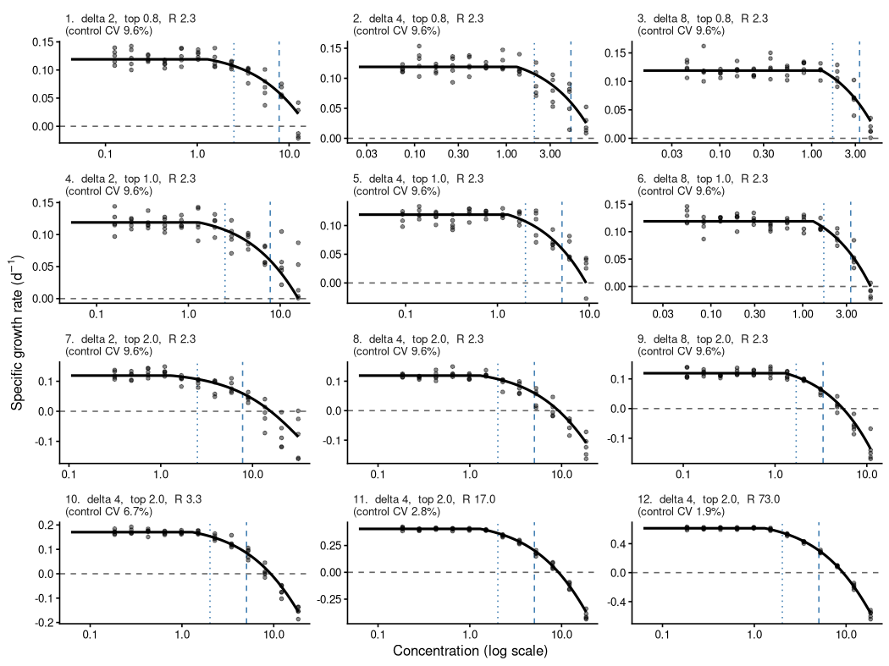
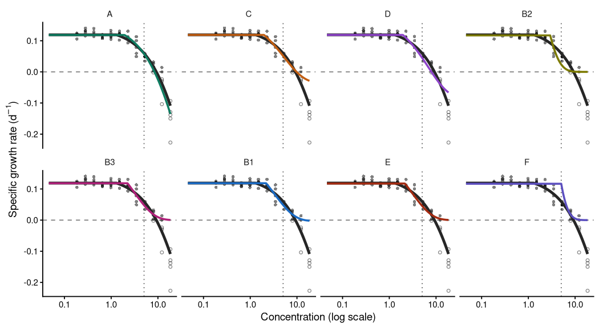
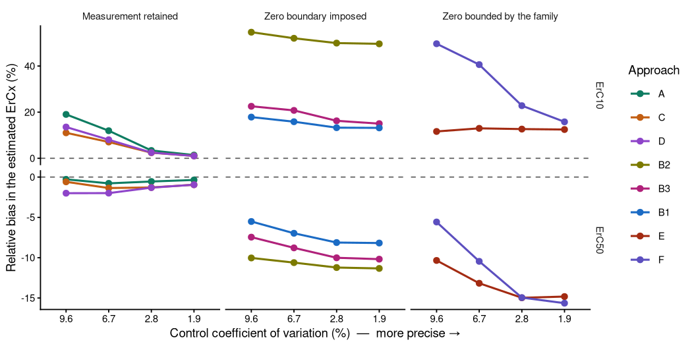
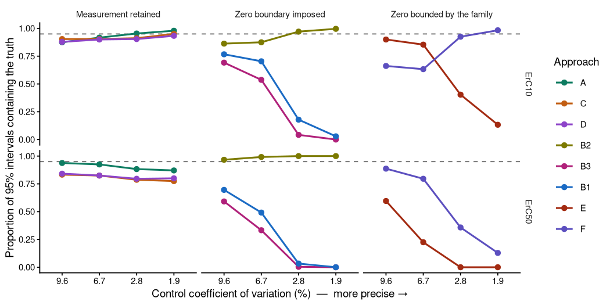
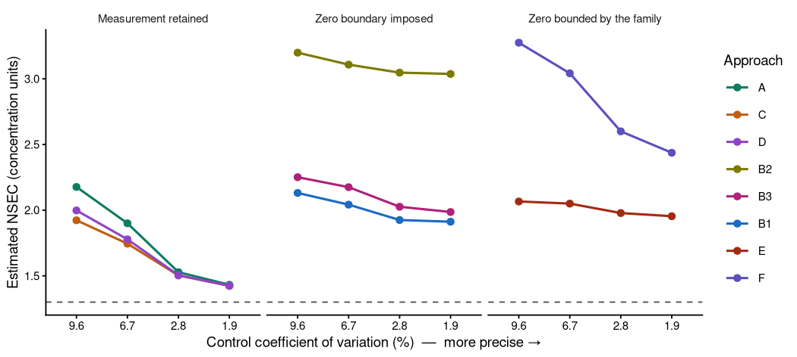

[e1]: https://open-aims.github.io/bayesnec/articles/example1.html
[e2]: https://open-aims.github.io/bayesnec/articles/example2.html
[e2b]: https://open-aims.github.io/bayesnec/articles/example2b.html
[e3]: https://open-aims.github.io/bayesnec/articles/example3.html
[e4]: https://open-aims.github.io/bayesnec/articles/example4.html
[e6]: https://open-aims.github.io/bayesnec/articles/example6.html

# Overview

Some ecotoxicological responses can legitimately take negative values. Specific
growth rate is the most common example: it is a rate of change, and a population
that declines over the course of a test has a negative one. Other examples
include increments, differences between paired measurements, and any response
expressed as a change from a baseline.

A negative response is inconvenient. It cannot be expressed as a percentage of
the control without the percentage exceeding 100, several commonly used
concentration-response models cannot generate one, and it looks anomalous on a
plot. It is therefore common practice to remove it: by replacing the
negative values with zero before fitting, by constraining the fitted curve so
that its lower asymptote cannot fall below zero, by both, or — most commonly of
all — by fitting a response distribution such as a Beta or a Gamma that has no
support below zero, so that the flooring happens as a side effect of a choice
made for some other reason.

This vignette asks what those conventions do to the toxicity estimates that are
subsequently reported. It covers, in order: how the endpoints are defined and
why the definition matters here; how each convention is expressed in
`bayesnec`; a simulation study in which the true values are known, so that the
conventions can be scored rather than merely compared; and what the same
comparison looks like on real data.

The short answer is that `bayesnec`'s defaults are already correct, and that
the difficulty enters upstream in data preparation rather than in the model. A
Gaussian response in `bayesnec` is not constrained to be positive, and the
package already excludes the zero-bounded models from the candidate set when the
family is Gaussian, for exactly this reason. What follows quantifies the cost of
overriding that.

To run this vignette we will need the following packages.


``` r
library(bayesnec)
library(brms)
library(ggplot2)
library(dplyr)
library(tidyr)
```

# Background

Because the whole question concerns a boundary at zero on the response scale, it
is necessary to be precise about where the reported toxicity estimates sit relative to
that boundary. Two toxicity estimates are used throughout: an ECx and the NSEC.

## Toxicity estimates and the ErCx notation

The subscript `r` in ErC50 is not a `bayesnec` convention; it comes from OECD
Test Guideline 201 [@oecd2026tg201]. In OECD terminology the *endpoint* is the measured biological response, and TG
201 defines two of them from the same cell counts and requires both to be
reported. The toxicity estimates derived from each are distinguished by a
subscript naming the endpoint they came from:

* **ErC50** is the EC50 for the average specific **growth rate** endpoint — the
  rate constant of population increase, with units of reciprocal time.
* **EyC50** is the EC50 for the **yield** endpoint — the biomass increase over
  the test, that is, final density minus initial density.

An ECx or an NSEC is therefore a *toxicity estimate*, not an endpoint; the
endpoint is the response it was estimated from. That distinction matters here
because it is the growth rate endpoint, not the toxicity estimate, that can take
negative values.

The two are not interchangeable and, for the same data, EyC50 is systematically
lower than ErC50. The guideline requires the growth rate endpoint to be reported
because it is the one that does not depend on test duration. Everything in this
vignette concerns ErCx, because growth rate is the response variable that can go
negative; yield can also go negative, and the same arguments apply, but the
worked examples here are on the rate scale.

## ECx on the absolute scale

`bayesnec`'s `ecx()` function offers three definitions of "x percent effect",
controlled by the `type` argument. The distinction is normally a matter of
preference; here it is central, because the three definitions place the effect
axis differently with respect to zero.

Writing `top` for the fitted upper asymptote (the modelled control response) and
`bot` for the fitted lower asymptote:

* `type = "relative"` measures the decline from `top` to `bot`. The ECx solves
  `f(x) = top - (top - bot) * x/100`. One hundred per cent effect is the fitted
  lower asymptote, wherever that happens to be.
* `type = "absolute"` measures the decline from `top` to **zero**. The ECx
  solves `f(x) = top * (1 - x/100)`. One hundred per cent effect is zero
  response.
* `type = "direct"` reads the ECx off a nominated value of the response itself.

`type = "absolute"` is the default, and it is the definition that corresponds to
OECD TG 201's ErCx: a 50% effect means the growth rate has been halved relative
to the control, and a 100% effect means growth has stopped altogether. This is
also why no normalisation to the control is applied anywhere in this vignette —
the absolute ECx already expresses the effect relative to the fitted control
response, so dividing the data by the control mean beforehand would apply the
same correction twice, and would additionally distort the error structure
[@Ritz2026].

The consequence for the present problem is worth stating explicitly. On the
growth rate scale, **zero growth is by definition 100% effect**, for every
dataset, whatever the control growth rate. A curve whose lower asymptote is
negative therefore descends past 100% effect and keeps going. ErC10 and ErC50
themselves never lie in that region — they require the response to be 90% and
50% of `top` respectively, both strictly positive — so the negative part of the
curve can only affect them indirectly, by changing the shape of the fitted curve
through the high-concentration observations. That indirect route is what this
vignette quantifies.

The three `type` definitions are currently implemented in ways that do not all
match their documentation, and this is being tracked in `bayesnec` issue #195.
The behaviour relied on here is the one described above and used throughout:
`type = "absolute"` referenced from the predicted control response down to zero.
Rather than describe the surrounding guards, which are expected to change, this
vignette records the model set that was actually fitted.

## The NSEC

The NSEC is the no-significant-effect-concentration of @fisherfox2023: the
concentration at which the modelled mean response first becomes statistically
indistinguishable from the modelled control response. In `bayesnec` it is
computed by taking a lower quantile of the posterior of the fitted response at
the lowest concentration — by default the 1st percentile, controlled by
`sig_val` — and finding where each posterior draw of the curve crosses it.


``` r
# schematically, what nsec() does
reference <- quantile(posterior_control_response, sig_val)
nsec_draw <- min(x[curve_draw <= reference])
```

This definition has a property that matters a great deal below, and which is a
property of the metric rather than a defect of any fitting approach: **the NSEC
depends on the width of the control posterior**. A noisier experiment produces a
wider control posterior, hence a lower reference value, hence a crossing further
to the right. As the residual error tends to zero the reference converges on the
control mean, and for a `nec` model the NSEC converges on `nec` itself. The true
`nec` is therefore the NSEC's limiting value, not its expected value at any
finite level of noise. The Results section returns to this, because it
determines how the NSEC results have to be read.

# Methods

## Model and family

All fits in this vignette use the four-parameter NEC model `nec4param` with a
Gaussian family and an identity link:


``` r
bnec(y ~ crf(x, "nec4param"), data = dat, family = gaussian(link = "identity"))
```

Three aspects of that specification are deliberate.

**Why `nec4param` and not a model-averaged set.** `bayesnec`'s usual
recommendation is to fit a set of candidate models and average them
(see the [Multi model usage][e2] vignette). That is the right default for
estimating a toxicity value, but it is the wrong tool for the present question.
Here the object of study is the effect of a *data-handling choice*, and if the
model set were free to change at the same time, a shift in the toxicity estimate
could come from either. Holding the functional form fixed makes the comparison
attributable, and for the simulation it also removes model misspecification
entirely, because `nec4param` is the model the data are generated from.

`nec4param` carries an explicit lower asymptote `bot`, which is the parameter two
of the three conventions act on directly. Note that `bot` plays no part in the
*definition* of the toxicity estimate: `type = "absolute"` is referenced from the
predicted control response down to zero and does not involve `bot` at all. `bot`
matters because constraining it changes the shape of the fitted curve — `nec` and
`beta` move to accommodate the constraint — and the ECx is read off that curve.
The effect on the reported value is entirely indirect, which is what makes it
easy to overlook.

**Why the family already does the right thing.** Under a Gaussian family
`bayesnec` automatically drops the models whose lower asymptote is pinned at
zero, because a Gaussian response is not bounded below. The candidate set is
reduced from the full list to eight declining models:


``` r
# the fourteen declining models bayesnec can fit
names(show_params("decline"))
#>  [1] "nec3param" "nec4param" "neclin"    "ecxlin"    "ecxexp"    "ecxsigm"  
#>  [7] "ecx4param" "ecxwb1"    "ecxwb2"    "ecxwb1p3"  "ecxwb2p3"  "ecxll5"   
#> [13] "ecxll4"    "ecxll3"
```

Six of those fourteen have a lower asymptote fixed at zero, and `bnec()` drops
them when the family is Gaussian: `nec3param`, `ecxexp`, `ecxsigm`, `ecxwb1p3`,
`ecxwb2p3` and `ecxll3`. Eight remain valid. The model used throughout is the
first of those, whose form is


``` r
show_params("nec4param")
#> [[1]]
#> y ~ bot + (top - bot) * exp(-exp(beta) * (x - nec) * step(x - nec)) 
#> bot ~ 1
#> top ~ 1
#> beta ~ 1
#> nec ~ 1
```

`nec3param` is the three-parameter NEC model, which is exactly `nec4param` with
`bot` set to zero:

    nec4param:  bot + (top - bot) * exp(-exp(beta) * (x - nec) * step(x - nec))
    nec3param:        top         * exp(-exp(beta) * (x - nec) * step(x - nec))

It is precisely the model an analyst reaches for when they want the curve to stop
at zero. Setting `bot` to zero through a `constant(0)` prior on `nec4param`, as
approaches B2 and B3 below do, therefore fits **the same model**, not an
approximation to it. The two routes are algebraically identical and differ only
in bookkeeping: the prior route keeps the Stan program, the parameter names and
the `ecx()` call path common to the six Gaussian approaches, so that nothing but
the constraint changes between them.

The same fit could equally be specified directly in `brms` with a non-linear
formula, bypassing `bayesnec`'s model checking. It would give the same posterior.
What would be lost is `bayesnec`'s initial-value search and its `ecx()`/`nsec()`
machinery, both of which would then have to be reimplemented; there is no
statistical difference.

**The model set actually fitted.** Every fit reported in this vignette used a
single model, chosen in advance; no model averaging was performed and no model
was selected from a set. For the six Gaussian approaches, across all twelve
simulation scenarios and all four case studies, that model is `nec4param` with
`family = gaussian(link = "identity")`. The two family-floored approaches use
`nec3param` with a Beta or a Gamma, for the reason given in their own section:
`nec3param` holds the lower asymptote at zero, which is what makes them the
family-enforced counterpart of B2 and B3. This is
recorded explicitly because `bayesnec`'s default behaviour is to fit and average
over a candidate set, and because the rules governing which models are valid for
a given family are expected to change (issue #195). A reader reproducing this
work should fix the model rather than rely on the default set of the day.

**Why the link is identity.** `bnec()` sets `link = "identity"` for every family
it accepts, so that `top`, `bot` and `nec` remain on the natural response scale
and stay directly interpretable. If you are writing raw `brms` code to compare
against a `bnec()` fit, pass the link explicitly, because several `brms`
families default to something else.

## The eight approaches

Eight approaches are compared, falling into three groups. Three retain the
measured values. Three impose the zero boundary explicitly, by substituting the
data or by constraining the fitted curve. Two impose it implicitly, by choosing
a response distribution that cannot represent a negative value. They are
labelled A to F below for compactness, and the labels are used consistently in
the results.

The first six approaches use the same model, the same family and — importantly
— the *same prior*. `bnec()` derives its default Gaussian priors from the response
vector, so allowing each approach to take its own default would confound the
change in likelihood with a change in prior. On one of the real datasets the
default `bot` prior is centred at exactly zero *because of* the substituted
zeros, so the convention under test would leak into the prior. The prior is
therefore built once, from the intact data, and passed to all six.
Approaches E and F stand outside that scheme deliberately, for the reason
given in their own section below.

The simplest way to do this with the exported interface is to fit the intact
analysis with `bnec()`'s defaults, recover the prior it constructed with
`pull_prior()`, and pass that object to every subsequent fit.

### Approaches that retain the measurement

**A — analyse as measured.** The negative growth rates are used exactly as
recorded, and `bot` is estimated freely. This is the reference, and it is also
where the shared prior comes from.


``` r
fit_A <- bnec(y ~ crf(x, "nec4param"), data = dat,
              family = gaussian(link = "identity"))

# the default prior bnec() built from the intact response vector, reused below
shared_prior <- pull_prior(fit_A)
shared_prior
#>                     prior class coef group resp dpar nlpar  lb ub
#>              normal(0, 5)     b                       beta
#>   normal(0.128, 0.404...)     b                        top
#>  normal(-0.270, 0.404...)     b                        bot
#>               gamma(5, 8)     b                        nec   0 20
```

**C — left-censor at zero.** Each negative value is declared as censored at
zero: the model is told that the observation lies at or below zero, without
being told what it was. This is the same device used for values below an
analytical detection limit, and it is available when the negative values were
never recorded — a common situation with historical data. See the Censoring
section of the [Single model usage][e1] vignette for the mechanics and for what
a censored likelihood can and cannot recover.


``` r
dat_C <- dat |>
  mutate(cens = ifelse(y < 0, "left", "none"),
         y = ifelse(y < 0, 0, y))
fit_C <- bnec(y | cens(cens) ~ crf(x, "nec4param"), data = dat_C,
              family = gaussian(link = "identity"), prior = shared_prior)
```

**D — truncate the series.** The concentration series is cut off at the point
where the fitted curve crosses zero, and only the remaining data are analysed.
Nothing false is asserted, but the highest concentrations are discarded. The
crossing must be estimated from the data — here from approach A's own posterior
— so this approach cannot be applied without first fitting A.


``` r
crossing <- min(dat$x[fitted(fit_A, newdata = data.frame(x = dat$x))[, "Estimate"] <= 0])
fit_D <- bnec(y ~ crf(x, "nec4param"), data = filter(dat, x < crossing),
              family = gaussian(link = "identity"), prior = shared_prior)
```

### Approaches that impose the zero boundary

**B1 — floor the data.** Every negative growth rate is replaced by zero. The
model is unchanged and `bot` is still free.


``` r
dat_B1 <- mutate(dat, y = pmax(y, 0))
fit_B1 <- bnec(y ~ crf(x, "nec4param"), data = dat_B1,
               family = gaussian(link = "identity"), prior = shared_prior)
```

**B2 — pin the asymptote.** The data are left as measured, but `bot` is fixed at
zero by giving it a point-mass prior. As noted above this is done through the
prior rather than by switching to `nec3param`.


``` r
prior_fixed_bot <- shared_prior
prior_fixed_bot$prior[prior_fixed_bot$nlpar == "bot"] <- "constant(0)"

fit_B2 <- bnec(y ~ crf(x, "nec4param"), data = dat,
               family = gaussian(link = "identity"), prior = prior_fixed_bot)
```

A practical note: `bayesnec`'s default initial values are drawn by sampling each
prior, and a `constant()` prior has no sampling distribution, so initial values
must be supplied when `bot` is fixed. Stan does not declare a parameter whose
prior is constant, so `b_bot` must be omitted from them.

**B3 — both.** The data are floored *and* `bot` is pinned. This combination is
the most common in practice, because an analyst who floors the data usually also
wants a model that cannot go below zero.


``` r
fit_B3 <- bnec(y ~ crf(x, "nec4param"), data = dat_B1,
               family = gaussian(link = "identity"), prior = prior_fixed_bot)
```

### Approaches that let the family impose the boundary

The three approaches above all impose the zero boundary deliberately, through a
choice an analyst makes and could defend. There is a fourth route, and it is the
one most often taken with these data in practice: choose a response distribution
whose support excludes negative values. A Beta is defined on (0, 1) and a Gamma
on (0, infinity), so neither can represent a negative growth rate at all.
Selecting one floors the data by construction, and the flooring is a side effect
of a distributional choice rather than a decision about the negative values as
such.

Both approaches below use `nec3param` rather than `nec4param`. As set out above
that is the same model as `nec4param` with `bot` set to zero, so E and F are the
family-enforced counterpart of B2 and B3, and the four flooring mechanisms are
directly comparable. Unlike the Gaussian arms, both take `bnec()`'s own default
priors, because taking the defaults is the practice under examination.

**E — scale to a proportion and fit a Beta.** The response is divided by its
maximum so that it lies in (0, 1], which is the usual preparation for a Beta.
Negative values must be dealt with first, since the family rejects them; they are
set to zero.


``` r
dat_E <- dat |>
  mutate(y = pmax(y, 0)) |>
  mutate(y = y / max(y))
fit_E <- bnec(y ~ crf(x, "nec3param"), data = dat_E,
              family = Beta(link = "identity"))
```

**F — leave the scale alone and fit a Gamma.** No scaling is applied; the Gamma
accommodates the positive response directly. Negatives are again set to zero.


``` r
dat_F <- mutate(dat, y = pmax(y, 0))
fit_F <- bnec(y ~ crf(x, "nec3param"), data = dat_F,
              family = Gamma(link = "identity"))
```

In both cases the zeros that flooring creates are then adjusted by `bnec()`
itself: `check_data()` shifts an exact zero to one tenth of the smallest positive
value, and an exact one to `1 - 0.001`, because neither is inside the open
support of the family. That adjustment is left in place here rather than
pre-empted, since it is part of the convention being examined. `bnec()` reports
the shift with a message.

Dividing by the maximum does not affect the reported toxicity estimates.
`ecx(type = "absolute")` solves `f(x) = max(f) * (1 - x/100)`, so both sides
carry any positive scaling of the response and the concentration at which the
curve meets the target is unchanged; the same argument applies to the NSEC, whose
control-posterior reference scales with the curve. What the family changes is the
fitted curve, not the definition of the estimate.

The distinction between B1 and B2 matters because they act on the residual scale
in opposite directions. Flooring the data removes the most extreme low values
and therefore *compresses* the residual variance at high concentration. Pinning
the asymptote leaves those values in place but makes them unreachable by the
fitted curve, and therefore *inflates* the residual variance. B3 combines both
and its net effect is not predictable in advance, which is the reason for
running the full set rather than comparing A against B3 alone.

## Simulation design

Real datasets can show that the approaches disagree, but not which of them
is right, because the true toxicity of a real substance is unknown. The
comparison is therefore made on simulated data, where the true ErC10, ErC50 and
`nec` are known by construction and each approach can be scored against them.

### The generating model

Data are generated from the same `nec4param` curve that is fitted, so that the
only misspecification under study is the one deliberately introduced by each
convention:


``` r
nec4param_curve <- function(x, top, bot, beta, nec) {
  bot + (top - bot) * exp(-exp(beta) * (x - nec) * (x >= nec))
}
```

The truth is parameterised in a way that makes the two experimental factors
explicit. The control growth rate is set by the control fold-change `R` — the
factor by which the control population multiplies over a test of length `t` —
and the depth of the lower asymptote is set as a multiple `delta` of that
control rate:


``` r
sim_truth <- function(R = 2.3, delta = 4, t = 7, nec = 1.3, beta = -3.573) {
  mu_0 <- log(R) / t                    # true control growth rate
  bot <- -delta * mu_0                  # lower asymptote, delta x deeper than top
  list(R = R, delta = delta, t = t, top = mu_0, bot = bot,
       beta = beta, nec = nec,
       # where the true curve crosses zero growth
       zero_crossing = nec + log((1 + delta) / delta) / exp(beta))
}
```

So `delta` is the ratio of the lower asymptote to the control response: at
`delta = 2` the population declines twice as fast at the highest concentrations
as it grows in the control, and at `delta = 8`, eight times as fast. The three
levels used, `delta` = 2, 4 and 8, span the range measured on the real datasets.
`nec` and `beta` are held fixed throughout, so the concentration axis is
identical in every scenario.

The design is a geometric concentration series spanning a factor of one hundred,
with ten controls and five replicates at each of twelve concentrations
(n = 70), matching the real designs. The position of the *highest* concentration
is the second experimental factor, expressed as a multiple `top_factor` of the
concentration at which the true curve crosses zero:


``` r
sim_design <- function(truth, top_factor = 1, n_conc = 12, n_rep = 5,
                       n_control = 10, span = 100) {
  x_max <- top_factor * truth$zero_crossing
  concs <- exp(seq(log(x_max / span), log(x_max), length.out = n_conc))
  data.frame(x = c(rep(0, n_control), rep(concs, each = n_rep)))
}
```

At `top_factor = 0.8` the series stops before the curve reaches zero and no true
mean is negative; at `1.0` it stops exactly at the crossing; at `2.0` it runs
well past, and roughly one observation in seven has a negative true mean. This
factor determines how much negative data there is for a convention to act on,
and it turns out to be the dominant one.

Residual error is heteroscedastic, rising linearly from the control to the lower
asymptote by a factor of 8.1 calibrated from the real data. It is *generated*
heteroscedastic and *fitted* homoscedastic, because `bnec()` has no route to a
distributional `sigma`. That is the realistic situation rather than a flattering
one, and it is a misspecification shared by all eight approaches.


``` r
sim_sigma <- function(x, truth, sigma_0, sigma_ratio = 8.09) {
  mu <- nec4param_curve(x, truth$top, truth$bot, truth$beta, truth$nec)
  lost <- (truth$top - mu) / (truth$top - truth$bot)
  sigma_0 * (1 + (sigma_ratio - 1) * lost)
}

simulate_dataset <- function(truth, design, sigma_0, sigma_ratio = 8.09, seed = NULL) {
  if (!is.null(seed)) set.seed(seed)
  mu <- nec4param_curve(design$x, truth$top, truth$bot, truth$beta, truth$nec)
  data.frame(x = design$x,
             y = rnorm(length(mu), mu, sim_sigma(design$x, truth, sigma_0, sigma_ratio)))
}
```

One detail of the noise specification matters for interpreting the results. The
control residual standard deviation is held at a fixed *absolute* value —
anchored so that it corresponds to a 9.6% coefficient of variation at
`R` = 2.3 — rather than at a fixed coefficient of variation. Under a fixed
coefficient of variation the whole generating model is exactly scale-equivariant
in the growth rate, so changing `R` would change nothing that is reported.
Holding the absolute error fixed instead means that raising `R` raises the
signal and leaves the noise alone. **The `R` axis in this study is therefore a
measurement-precision axis, and should be read as one**; it is not a test of the
control fold-change as such.


``` r
sigma_0 <- 0.096 * log(2.3) / 7   # absolute control SD, anchored at R = 2.3
```

### The twelve scenarios

The design is nine scenarios crossing `delta` with `top_factor` at fixed
`R` = 2.3, plus three further scenarios that hold `delta` = 4 and
`top_factor` = 2.0 and raise `R`, giving four levels of measurement precision at
an otherwise identical design and truth.


``` r
scenarios <- rbind(
  expand.grid(delta = c(2, 4, 8), top_factor = c(0.8, 1.0, 2.0), R = 2.3),
  expand.grid(delta = 4, top_factor = 2.0, R = c(3.3, 17, 73))
)
scenarios$scenario <- seq_len(nrow(scenarios))

scenario_detail <- function(s) {
  tr <- sim_truth(R = s$R, delta = s$delta)
  dz <- sim_design(tr, top_factor = s$top_factor)
  mu <- nec4param_curve(dz$x, tr$top, tr$bot, tr$beta, tr$nec)
  true_ecx <- function(p) {
    target <- tr$top * (1 - p / 100)
    tr$nec + log((tr$top - tr$bot) / (target - tr$bot)) / exp(tr$beta)
  }
  data.frame(top = tr$top, bot = tr$bot, zero_crossing = tr$zero_crossing,
             x_max = max(dz$x), ErC10 = true_ecx(10), ErC50 = true_ecx(50),
             cv_control = sigma_0 / tr$top,
             # tolerance, not `<= 0`: at top_factor = 1 the highest design point
             # sits exactly on the crossing, so a strict test flips on floating
             # point and reports 0 for some scenarios and 1/14 for others
             prop_negative = mean(mu <= 1e-10))
}
scenarios <- cbind(scenarios,
                   do.call(rbind, lapply(seq_len(nrow(scenarios)),
                                         function(i) scenario_detail(scenarios[i, ]))))
```


Table: The twelve simulated scenarios. `top` and `bot` are the true upper and lower asymptotes of the growth rate; `prop. negative` is the proportion of the 70 design points whose true mean growth rate is at or below zero. It is the quantity the conventions act on.

| Scenario| delta| top factor|    R|   top|    bot| max conc.| true ErC10| true ErC50| control CV| prop. negative|
|--------:|-----:|----------:|----:|-----:|------:|---------:|----------:|----------:|----------:|--------------:|
|        1|     2|        0.8|  2.3| 0.119| -0.238|      12.6|       2.51|       7.79|      0.096|          0.000|
|        2|     4|        0.8|  2.3| 0.119| -0.476|       7.4|       2.02|       5.05|      0.096|          0.000|
|        3|     8|        0.8|  2.3| 0.119| -0.952|       4.4|       1.70|       3.34|      0.096|          0.000|
|        4|     2|        1.0|  2.3| 0.119| -0.238|      15.7|       2.51|       7.79|      0.096|          0.071|
|        5|     4|        1.0|  2.3| 0.119| -0.476|       9.2|       2.02|       5.05|      0.096|          0.071|
|        6|     8|        1.0|  2.3| 0.119| -0.952|       5.5|       1.70|       3.34|      0.096|          0.071|
|        7|     2|        2.0|  2.3| 0.119| -0.238|      31.5|       2.51|       7.79|      0.096|          0.143|
|        8|     4|        2.0|  2.3| 0.119| -0.476|      18.5|       2.02|       5.05|      0.096|          0.143|
|        9|     8|        2.0|  2.3| 0.119| -0.952|      11.0|       1.70|       3.34|      0.096|          0.143|
|       10|     4|        2.0|  3.3| 0.171| -0.682|      18.5|       2.02|       5.05|      0.067|          0.143|
|       11|     4|        2.0| 17.0| 0.405| -1.619|      18.5|       2.02|       5.05|      0.028|          0.143|
|       12|     4|        2.0| 73.0| 0.613| -2.452|      18.5|       2.02|       5.05|      0.019|          0.143|


Three features of this table are worth drawing out. First, the true ErC10 and
ErC50 depend only on `delta` — scenarios 1, 4 and 7 share a true ErC50 of 7.80,
and scenarios 8 and 10 to 12 all share 5.05 — so within a column of the design
the estimand is constant and only the data change. Second, the proportion of
negative true means is zero for `top_factor` = 0.8, one in fourteen at 1.0, and
one in seven at 2.0: this is the quantity the conventions actually act on.
Third, scenarios 8 and 10 to 12 differ *only* in the control coefficient of
variation, falling from 9.6% to 1.9%, which is what makes them a clean precision
sweep.


``` r
curve_data <- do.call(rbind, lapply(seq_len(nrow(scenarios)), function(i) {
  s <- scenarios[i, ]
  tr <- sim_truth(R = s$R, delta = s$delta)
  xx <- seq(0, s$x_max, length.out = 300)
  data.frame(scenario = s$scenario, x = xx,
             mu = nec4param_curve(xx, tr$top, tr$bot, tr$beta, tr$nec))
}))

point_data <- do.call(rbind, lapply(seq_len(nrow(scenarios)), function(i) {
  s <- scenarios[i, ]
  tr <- sim_truth(R = s$R, delta = s$delta)
  d <- simulate_dataset(tr, sim_design(tr, s$top_factor), sigma_0, seed = 42 + i)
  data.frame(scenario = s$scenario, d)
}))

lab <- setNames(
  sprintf("%d.  delta %g,  top %.1f,  R %.1f\n(control CV %.1f%%)",
          scenarios$scenario, scenarios$delta, scenarios$top_factor,
          scenarios$R, 100 * scenarios$cv_control),
  scenarios$scenario)

# controls sit at x = 0 and have no position on a log axis, so they are dropped
# from this figure; every fit uses them
ggplot(subset(point_data, x > 0), aes(x = x, y = y)) +
  geom_hline(yintercept = 0, linetype = "dashed", colour = "grey40") +
  geom_vline(data = scenarios, aes(xintercept = ErC10),
             linetype = "dotted", colour = "steelblue") +
  geom_vline(data = scenarios, aes(xintercept = ErC50),
             linetype = "dashed", colour = "steelblue") +
  geom_point(alpha = 0.45, size = 0.8) +
  geom_line(data = subset(curve_data, x > 0), aes(y = mu), linewidth = 0.7) +
  facet_wrap(~ scenario, scales = "free", ncol = 3,
             labeller = labeller(scenario = lab)) +
  scale_x_log10() +
  labs(x = "Concentration (log scale)",
       y = expression("Specific growth rate ("*d^-1*")")) +
  theme_classic(base_size = 8) +
  theme(strip.background = element_blank(), strip.text = element_text(hjust = 0))
```

<div class="figure" style="text-align: center">

<p class="caption">The twelve simulated scenarios. Points are one simulated dataset per scenario; the solid line is the true curve; the dashed horizontal line is zero growth. Vertical lines mark the true ErC10 (dotted) and ErC50 (dashed). Panels are labelled with the scenario number and its two design factors.</p>
</div>

Reading down the first column of the figure — scenarios 1, 4 and 7 — shows the
`top_factor` factor at `delta` = 2: the same truth, sampled over an increasingly
wide concentration range, with the amount of data below zero growing from none
to about one point in seven. Reading across a row shows the `delta` factor: how
far below zero the curve eventually settles. The last three panels show the
precision sweep, where the design and the estimands are identical and only the
scatter changes.

### Fitted curves from each approach


``` r
# One colour per approach, used consistently in every figure below. Eight series
# is past the point where a categorical palette is safe by inspection, so these
# were checked for lightness, chroma and colour-vision separation rather than
# chosen by eye. Two consequences are worth stating, because they constrain how
# the figures may be drawn. The legend order is not arbitrary: the obvious
# grouping puts D next to B1, which fails deutan separation, and reversing the
# middle group clears every adjacent pair. And all-pairs separation is not
# achievable with eight hues, only adjacent-pair separation, which is safe only
# because every figure below facets by the kind of handling, so two series close
# in hue never share a panel.
arm_cols <- c(A = "#0E7C61", C = "#C25E12", D = "#8E44C9",
              B2 = "#7C7A00", B3 = "#B0217A", B1 = "#1B6BC4",
              E = "#A32B12", F = "#5C4FBF")
arm_levels <- c("A", "C", "D", "B2", "B3", "B1", "E", "F")

# The three kinds of handling, used as the facet variable in every figure. The
# distinction that matters is not six-versus-two but how the zero boundary comes
# to be imposed: deliberately, by substituting data or constraining the mean, or
# implicitly, as a side effect of choosing a response distribution.
arm_handling <- c(A = "Measurement retained", C = "Measurement retained",
                  D = "Measurement retained",
                  B1 = "Zero boundary imposed", B2 = "Zero boundary imposed",
                  B3 = "Zero boundary imposed",
                  E = "Zero bounded by the family",
                  F = "Zero bounded by the family")
handling_levels <- c("Measurement retained", "Zero boundary imposed",
                     "Zero bounded by the family")
```


Before the aggregate results, it is worth looking at a single simulated dataset
fitted by all eight approaches, because the summary statistics are easier to
interpret once the curves have been seen. The dataset below is one draw from
scenario 8 — `delta` = 4, `top_factor` = 2.0, `R` = 2.3 — in which the true
upper asymptote is 0.119, the true lower asymptote is -0.476, and the true ErC50
is 5.05. Nine of its 70 observations are negative.


``` r
# Posterior means from the eight fits to one simulated dataset from scenario 8.
# The dispersion parameter is named as well as valued, because a Gaussian
# `sigma`, a Beta `phi` and a Gamma `shape` are three different quantities and
# must never be read down one column. E's `top` and `bot` are on the growth-rate
# scale: it was fitted to the response divided by its maximum, and the
# parameters are multiplied back by that maximum so all eight curves share an
# axis. `nec` and `beta` are unaffected by that rescaling.
example_pars <- read.csv(text = "
arm,bot,top,beta,nec,disp_par,dispersion
A,-0.43045,0.11839,-3.28625,1.93283,sigma,0.02249
C,-0.03579,0.11865,-1.67881,1.97273,sigma,0.01332
D,-0.08428,0.11860,-1.92347,1.95741,sigma,0.01321
B2,0.00000,0.11709,-0.28537,2.93709,sigma,0.04703
B3,0.00000,0.11841,-1.13271,2.23954,sigma,0.01219
B1,-0.00280,0.11851,-1.20377,2.18407,sigma,0.01225
E,0.00000,0.11751,-1.11542,2.16161,phi,10.01332
F,0.00000,0.11676,-0.46473,5.05488,shape,1.17656
")
example_ends <- read.csv(text = "
arm,ErC50,lower,upper
A,5.050,4.532,5.642
C,4.625,4.181,5.143
D,4.681,4.137,5.177
B2,4.273,3.200,5.586
B3,4.403,4.033,4.810
B1,4.440,4.070,4.865
E,4.273,3.829,4.792
F,6.132,4.292,7.899
")
example_truth <- list(top = 0.11897, bot = -0.47588, beta = -3.573,
                      nec = 1.3, ErC50 = 5.053)
```


``` r
xx <- seq(0, 18.5, length.out = 400)
ex_curves <- do.call(rbind, lapply(seq_len(nrow(example_pars)), function(i) {
  p <- example_pars[i, ]
  data.frame(arm = p$arm, x = xx,
             y = nec4param_curve(xx, p$top, p$bot, p$beta, p$nec))
}))
ex_curves$arm <- factor(ex_curves$arm, levels = arm_levels)
true_curve <- data.frame(
  x = xx, y = nec4param_curve(xx, example_truth$top, example_truth$bot,
                              example_truth$beta, example_truth$nec))

# the actual dataset these eight models were fitted to, rather than a fresh draw,
# so that the points shown are the points the curves were estimated from
ex_dat <- read.csv(text = "x,y
0,0.0926
0,0.10881
0,0.11001
0,0.13129
0,0.11349
0,0.11454
0,0.13466
0,0.10658
0,0.11699
0,0.10843
0.185,0.12449
0.185,0.12131
0.185,0.11926
0.185,0.12076
0.185,0.10532
0.2812,0.13111
0.2812,0.12578
0.2812,0.13266
0.2812,0.14073
0.2812,0.11534
0.4273,0.11343
0.4273,0.1224
0.4273,0.12922
0.4273,0.11899
0.4273,0.13912
0.6495,0.10738
0.6495,0.11256
0.6495,0.1093
0.6495,0.11983
0.6495,0.11757
0.9872,0.13323
0.9872,0.12545
0.9872,0.11341
0.9872,0.11195
0.9872,0.10474
1.5004,0.12402
1.5004,0.12101
1.5004,0.12124
1.5004,0.10222
1.5004,0.13077
2.2805,0.11006
2.2805,0.09346
2.2805,0.11237
2.2805,0.13052
2.2805,0.10846
3.4662,0.0494
3.4662,0.11345
3.4662,0.07806
3.4662,0.10041
3.4662,0.05933
5.2684,0.05943
5.2684,0.04904
5.2684,0.04867
5.2684,0.04828
5.2684,0.03435
8.0074,0.01667
8.0074,0.03189
8.0074,0.00315
8.0074,-0.00199
8.0074,0.02695
12.1706,-0.02958
12.1706,-0.10372
12.1706,0.01398
12.1706,-0.02375
12.1706,9e-05
18.4982,-0.12908
18.4982,-0.13829
18.4982,-0.22695
18.4982,-0.14983
18.4982,-0.09347
")

ggplot(subset(ex_curves, x > 0), aes(x = x, y = y)) +
  geom_hline(yintercept = 0, linetype = "dashed", colour = "grey50") +
  geom_vline(xintercept = example_truth$ErC50, linetype = "dotted",
             colour = "grey40") +
  geom_point(data = subset(ex_dat, x > 0), aes(shape = y < 0),
             alpha = 0.5, size = 1) +
  geom_line(data = subset(true_curve, x > 0), linewidth = 1.1, colour = "grey15") +
  geom_line(aes(colour = arm), linewidth = 0.8) +
  scale_shape_manual(values = c("FALSE" = 16, "TRUE" = 1), guide = "none") +
  scale_colour_manual(values = arm_cols, guide = "none") +
  facet_wrap(~ arm, ncol = 4) +
  scale_x_log10() +
  labs(x = "Concentration (log scale)",
       y = expression("Specific growth rate ("*d^-1*")")) +
  theme_classic(base_size = 9) +
  theme(strip.background = element_blank())
```

<div class="figure" style="text-align: center">

<p class="caption">Fitted curves from all eight approaches applied to a single simulated dataset from scenario 8, with the true curve in black. Points are the simulated observations; open points are the nine negative values that the conventions act on. The vertical line is the true ErC50.</p>
</div>

The intact analysis is the only one whose fitted curve follows the true curve
below zero. It recovers a lower asymptote of -0.430 against a true -0.476 and
returns an ErC50 of 5.05 against a true 5.05.

Left-censoring and truncation both flatten out well above the true asymptote, at
-0.036 and -0.084 respectively. This is expected and is not the same failure as
flooring. Both approaches deliberately decline to use the magnitude of the
negative values — censoring records only that they are at or below zero,
truncation discards them — so neither has the information needed to place the
asymptote, and the flat region below zero is the prior's rather than the data's.
What matters is that their curves still track the true curve through the region
where ErC10 and ErC50 are read, which is above zero.

The three boundary-imposing approaches flatten at exactly zero, and to do so they
must make the descent shallower and push `nec` to the right, which deforms the
curve in the region the toxicity estimates *are* read from. `nec` moves from 1.93 under
the intact analysis to 2.18, 2.24 and 2.94 under B1, B3 and B2 respectively,
against a true value of 1.3. This is the indirect route described in the
Background: the constraint applies below zero, but its consequences are felt
above it.

The two family-floored approaches do the same thing by a different route, and F
does it hardest. E is barely distinguishable from B3 here — `nec` 2.16 against
B3's 2.24 — which is what it was constructed to be. F places `nec` at **5.05**,
nearly four times the true value and beyond even B2, and returns an ErC50 of 6.13
against a true 5.05.

That last figure is worth reading carefully, because it runs the *opposite* way
to F's average. Across the 240 datasets of this scenario F's mean ErC50 bias is
-5.6%; on this particular one it is 21% high. Both are F: its RMSE is the largest
of any approach, and a single dataset cannot be used to characterise it. What the
single dataset does show, and what the aggregate confirms, is where the damage
enters — the position of `nec`.

The fitted residual standard deviation shows the two opposing mechanisms
directly, and this is the clearest available evidence for them:


Table: Posterior mean parameters from the six Gaussian fits to one simulated dataset. True values are bot = -0.476 and nec = 1.3.

|Approach | fitted bot| fitted nec| fitted sigma| sigma relative to A|
|:--------|----------:|----------:|------------:|-------------------:|
|A        |    -0.4304|       1.93|       0.0225|                1.00|
|C        |    -0.0358|       1.97|       0.0133|                0.59|
|D        |    -0.0843|       1.96|       0.0132|                0.59|
|B2       |     0.0000|       2.94|       0.0470|                2.09|
|B3       |     0.0000|       2.24|       0.0122|                0.54|
|B1       |    -0.0028|       2.18|       0.0122|                0.54|


Flooring the data (B1, B3) removes the most extreme low observations and
compresses the residual standard deviation to a little over half that of the
intact analysis. Pinning the asymptote (B2) leaves those observations in place
but puts them out of the curve's reach, and roughly doubles it. These are the
two mechanisms described in the previous section, and they are why B1 and B2
distort the NSEC in opposite directions.

E and F have no `sigma` to put in that table, and the comparison has to be made
on their own terms. E's Beta precision of 10.0 corresponds to a residual standard
deviation of about 0.016 at the control once the scaling is undone — close to the
0.012 of the floored Gaussian fits, which is another way of saying E is B3 by
another route. F's Gamma shape of 1.18 corresponds to a **coefficient of
variation of 92%** at every point on the curve, against a true control value of
9.6%. A Gamma with an identity link ties the spread to the mean, and asking one
to cover both real control scatter and a floor of identical near-zero values
leaves it with no good value to take.

One caution about this figure: it is one dataset, and the individual differences between estimates are within Monte Carlo noise. It is included to show the *shapes*
and the mechanism. The aggregate results below, each averaging 240 simulated
datasets, are what the conclusions rest on.

### Model fitting and summaries

Each scenario was simulated 240 times and every simulated dataset fitted by all
eight approaches, giving 12 x 240 x 8 = 23,040 model fits. The iteration count was
set from the Monte Carlo standard error on coverage, which is the least precise
of the reported quantities: coverage is a proportion, so 240 iterations give a
standard error of about 1.4 percentage points at a true coverage of 0.95, and
about 2 points near 0.5. That is comfortably smaller than the differences the
study reports, which run from several percentage points to the difference
between 0.95 and 0.00, but it is coarser than the 500 iterations often used for
work of this kind, and the coverage figures below should be read with it in
mind. Sampling used four
chains of 2,000 iterations with 1,000 warmup and `adapt_delta = 0.95`. Every fit
is retained in the summaries below: filtering on convergence would have been
actively misleading here, because the approaches do not diverge at the same rate
— B2 averages several divergent transitions per fit while A averages none — so
excluding poorly-behaved fits would preferentially remove the worst fits of the
worst approach. In the scenarios that reach past the crossing the mean number of
divergent transitions per fit is 0.00 for A and E, 0.03 for B3 and F, 0.06 for
B1, 0.07 for C, 1.21 for D and **5.67 for B2**; mean maximum R-hat is between
1.004 and 1.012 throughout.

The pattern is worth reading carefully, because it is not the one intuition
suggests. Flooring the data does *not* cause sampling problems: B1 and B3, the
two approaches that replace negative values with zero, are among the best behaved
in the set, and E and F — where the family does the flooring — are better still,
with E producing no divergent transitions at all. It is B2 — which leaves the
data untouched and constrains the curve — that struggles, by two orders of
magnitude. The reason is that B2 is asked to fit a curve that cannot reach its
own observations, so the sampler must trade the residual scale against the curve
shape with no good compromise available. A floored dataset is certainly no
longer Gaussian, but the models that floor it accommodate it comfortably and
report nothing amiss, which is precisely what makes them dangerous: the failure
is silent. E and F are the sharpest case. They produce the largest ErC50 bias in
the study at high precision and among the worst coverage, and they do it while
sampling more cleanly than the approach that is unbiased.

The results are summarised below from stored output rather than refitted, since
the full study takes several days of computation.


``` r
sim_results <- read.csv(text = "
arm,estimate,regime,rel_bias,coverage,rmse
A,ErC10,reaches,0.2413,0.8264,0.6376
C,ErC10,reaches,0.1508,0.8764,0.4777
D,ErC10,reaches,0.1708,0.8750,0.5396
B2,ErC10,reaches,0.5700,0.8319,1.3304
B3,ErC10,reaches,0.2362,0.6847,0.6836
B1,ErC10,reaches,0.2017,0.7486,0.6135
E,ErC10,reaches,0.1352,0.8944,0.4412
F,ErC10,reaches,0.5416,0.6903,1.6112
A,ErC10,stops short,0.0828,0.9257,0.4219
C,ErC10,stops short,0.0705,0.9276,0.3859
D,ErC10,stops short,0.0726,0.9333,0.3938
B2,ErC10,stops short,0.1331,0.8521,0.5421
B3,ErC10,stops short,0.0975,0.8764,0.4421
B1,ErC10,stops short,0.0616,0.9299,0.3574
E,ErC10,stops short,0.1053,0.8903,0.5073
F,ErC10,stops short,0.2824,0.8299,1.0291
A,ErC50,reaches,0.0069,0.9153,0.3999
C,ErC50,reaches,-0.0010,0.8292,0.4818
D,ErC50,reaches,-0.0161,0.8528,0.4812
B2,ErC50,reaches,-0.0933,0.9667,0.6249
B3,ErC50,reaches,-0.0640,0.6083,0.5343
B1,ErC50,reaches,-0.0480,0.7028,0.5300
E,ErC50,reaches,-0.0843,0.6403,0.5991
F,ErC50,reaches,-0.0200,0.7625,1.0671
A,ErC50,stops short,-0.0416,0.7667,0.5041
C,ErC50,stops short,-0.0334,0.7944,0.4918
D,ErC50,stops short,-0.0353,0.8007,0.5102
B2,ErC50,stops short,-0.0696,0.6444,0.6148
B3,ErC50,stops short,-0.0498,0.7201,0.5405
B1,ErC50,stops short,-0.0270,0.8201,0.4912
E,ErC50,stops short,-0.0996,0.5826,0.7527
F,ErC50,stops short,-0.0440,0.7507,0.6631
")
```

# Results

## Effect of the concentration design

Before any approach can be compared with another, the scenarios have to be
separated into two groups, because the answer is qualitatively different in each.
Where the concentration series stops at or before the zero crossing
(`top_factor` 0.8 and 1.0), the lower asymptote is barely identified by *any*
approach: there are no data in the region that determines it, and all eight
carry a shared bias of similar size and the same sign. Where the series runs past the
crossing (`top_factor` = 2.0), the asymptote is identified and the approaches
separate.


Table: Relative bias and 95% interval coverage for ErC50, averaged over the three delta levels at R = 2.3, split by whether the concentration series reaches past the zero crossing.

|Approach | bias (reaches)| bias (stops short)| coverage (reaches)| coverage (stops short)|
|:--------|--------------:|------------------:|------------------:|----------------------:|
|A        |          0.007|             -0.042|              0.915|                  0.767|
|C        |         -0.001|             -0.033|              0.829|                  0.794|
|D        |         -0.016|             -0.035|              0.853|                  0.801|
|B2       |         -0.093|             -0.070|              0.967|                  0.644|
|B3       |         -0.064|             -0.050|              0.608|                  0.720|
|B1       |         -0.048|             -0.027|              0.703|                  0.820|
|E        |         -0.084|             -0.100|              0.640|                  0.583|
|F        |         -0.020|             -0.044|              0.762|                  0.751|


In the *stops short* column six of the eight approaches are within about four
percentage points of each other and B1 has the smallest bias of any; only E, at
-10.0%, stands outside that band. It would be a mistake
to read that as flooring helping. What it shows is that the intact analysis is
itself carrying a bias, of about -4%, from an asymptote the design never
measured, and that flooring happens to offset it. Averaging the two regimes
together would combine a real effect with an artefact.

**All results below are from the scenarios that reach past the zero crossing.**
If your own design does not reach it — if essentially none of your observations
are at or below zero growth — none of this applies to your data.

## ErC10 and ErC50

Within the reaching regime the ordering is consistent. Relative to a true value,
the intact analysis (A) and left-censoring (C) are unbiased to within one per
cent for ErC50; truncation (D) is close behind; and the approaches that impose
the zero boundary deliberately are biased low by 5 to 9 per cent, in the
direction of making the substance appear more toxic than it is. The two
approaches where the *family* imposes the boundary are E at -8.4%, in among the
worst of the deliberate ones, and F at -2.0%.

**F's -2.0% must not be read as accuracy.** It is a mean over three `delta`
levels of a quantity that changes sign across them, and its RMSE is 1.07 —
two and a half times arm A's 0.40 and the largest of any approach. An estimate
that is 13% high in one scenario and 13% low in another averages to something
respectable while being wrong in both.

The bias also deepens as the true lower asymptote gets further below zero. Across
`delta` = 2, 4 and 8, B1 moves from -2.5% to -5.5% to -6.3%, B3 from -4.1% to
-7.4% to -7.6%, B2 from -8.2% to -10.0% to -9.8%, and E from -5.2% to -10.3% to
-9.7%, while A and C stay inside ±3.6% with no trend. This is the mechanism
working as expected: the further the data descend below the boundary, the more
the boundary distorts. F has the steepest gradient of all and is the only
approach that crosses zero on the way: **+13.0%, then -5.6%, then -13.4%**.

ErC10 behaves differently and needs care. At `R` = 2.3 every approach is biased
*high* on ErC10, by between 14% and 57%, and the intact analysis is sixth of
eight. That is not a reversal of the ordering; it is a shared estimation
difficulty swamping the differences between approaches. ErC10 requires a 10%
decline from the control to be resolved against the residual scatter, and at a
9.6% control coefficient of variation that is a demanding thing to ask. The next
section resolves it.

## Effect of measurement precision

Scenarios 8 and 10 to 12 hold the design and the true values fixed and vary only
the control coefficient of variation, from 9.6% down to 1.9%. This is the most
informative comparison in the study, because it distinguishes the two things that
can make an estimate wrong. Estimation error shrinks as an experiment becomes
more precise. Model misspecification does not.


``` r
precision <- read.csv(text = "
arm,estimate,R,cv,rel_bias,coverage
A,ErC10,2.3,9.6,0.1903,0.875
A,ErC10,3.3,6.7,0.1196,0.917
A,ErC10,17,2.8,0.0339,0.954
A,ErC10,73,1.9,0.0140,0.979
C,ErC10,2.3,9.6,0.1105,0.904
C,ErC10,3.3,6.7,0.0707,0.904
C,ErC10,17,2.8,0.0243,0.912
C,ErC10,73,1.9,0.0104,0.950
D,ErC10,2.3,9.6,0.1356,0.879
D,ErC10,3.3,6.7,0.0805,0.900
D,ErC10,17,2.8,0.0247,0.904
D,ErC10,73,1.9,0.0100,0.933
B2,ErC10,2.3,9.6,0.5467,0.863
B2,ErC10,3.3,6.7,0.5204,0.875
B2,ErC10,17,2.8,0.4995,0.971
B2,ErC10,73,1.9,0.4962,0.996
B3,ErC10,2.3,9.6,0.2255,0.692
B3,ErC10,3.3,6.7,0.2077,0.537
B3,ErC10,17,2.8,0.1625,0.042
B3,ErC10,73,1.9,0.1503,0.000
B1,ErC10,2.3,9.6,0.1787,0.767
B1,ErC10,3.3,6.7,0.1586,0.704
B1,ErC10,17,2.8,0.1328,0.179
B1,ErC10,73,1.9,0.1319,0.029
E,ErC10,2.3,9.6,0.1164,0.900
E,ErC10,3.3,6.7,0.1299,0.854
E,ErC10,17,2.8,0.1267,0.404
E,ErC10,73,1.9,0.1248,0.133
F,ErC10,2.3,9.6,0.4967,0.662
F,ErC10,3.3,6.7,0.4062,0.633
F,ErC10,17,2.8,0.2282,0.925
F,ErC10,73,1.9,0.1581,0.983
A,ErC50,2.3,9.6,-0.0028,0.938
A,ErC50,3.3,6.7,-0.0078,0.925
A,ErC50,17,2.8,-0.0055,0.883
A,ErC50,73,1.9,-0.0036,0.871
C,ErC50,2.3,9.6,-0.0059,0.833
C,ErC50,3.3,6.7,-0.0136,0.825
C,ErC50,17,2.8,-0.0129,0.787
C,ErC50,73,1.9,-0.0095,0.775
D,ErC50,2.3,9.6,-0.0200,0.842
D,ErC50,3.3,6.7,-0.0199,0.825
D,ErC50,17,2.8,-0.0131,0.796
D,ErC50,73,1.9,-0.0095,0.800
B2,ErC50,2.3,9.6,-0.1003,0.967
B2,ErC50,3.3,6.7,-0.1061,0.992
B2,ErC50,17,2.8,-0.1122,1.000
B2,ErC50,73,1.9,-0.1133,1.000
B3,ErC50,2.3,9.6,-0.0745,0.592
B3,ErC50,3.3,6.7,-0.0878,0.333
B3,ErC50,17,2.8,-0.1001,0.004
B3,ErC50,73,1.9,-0.1018,0.000
B1,ErC50,2.3,9.6,-0.0551,0.696
B1,ErC50,3.3,6.7,-0.0697,0.492
B1,ErC50,17,2.8,-0.0812,0.033
B1,ErC50,73,1.9,-0.0818,0.000
E,ErC50,2.3,9.6,-0.1034,0.596
E,ErC50,3.3,6.7,-0.1317,0.225
E,ErC50,17,2.8,-0.1497,0.000
E,ErC50,73,1.9,-0.1482,0.000
F,ErC50,2.3,9.6,-0.0557,0.887
F,ErC50,3.3,6.7,-0.1045,0.796
F,ErC50,17,2.8,-0.1495,0.358
F,ErC50,73,1.9,-0.1564,0.129
")
precision$handling <- factor(arm_handling[precision$arm],
                             levels = handling_levels)
precision$arm <- factor(precision$arm, levels = arm_levels)
# CV as an ordered factor rather than a numeric axis: the four levels are not
# evenly spaced on either a linear or a log scale, and what matters is their
# order, not their spacing.
precision$cv_f <- factor(precision$cv, levels = c(9.6, 6.7, 2.8, 1.9))
```


``` r
ggplot(precision, aes(x = cv_f, y = 100 * rel_bias, colour = arm, group = arm)) +
  geom_hline(yintercept = 0, linetype = "dashed", colour = "grey40") +
  geom_line(linewidth = 0.7) +
  geom_point(size = 1.8) +
  facet_grid(estimate ~ handling, scales = "free_y") +
  labs(x = "Control coefficient of variation (%)  —  more precise →",
       y = "Relative bias in the estimated ErCx (%)",
       colour = "Approach") +
  scale_colour_manual(values = arm_cols) +
  theme_classic(base_size = 9) +
  theme(strip.background = element_blank(), legend.position = "right")
```

<div class="figure" style="text-align: center">

<p class="caption">Relative bias in the estimated ErC10 and ErC50 against the control coefficient of variation, which decreases to the right as the experiment becomes more precise. Each point summarises 240 simulated datasets. Approaches that retain the measurement converge on zero bias; approaches that impose the zero boundary converge on a non-zero value.</p>
</div>

The left-hand panels show every retained-measurement approach converging on the
true value: arm A's ErC10 bias falls from +19.0% to +1.4% and arm C's from
+11.1% to +1.0%, and both ErC50 biases sit within one per cent throughout. The
middle panels show the three boundary-imposing approaches levelling off: B1 at
+13.2% and B2 at +49.6% on ErC10, and at -8.2% and -11.3% on ErC50. A
discrepancy that does not shrink as the noise shrinks is not estimation error.

The right-hand panels are the same story told by the families, and they end
worse than either group. E's ErC50 bias *grows* as the experiment improves, from
-10.3% to **-14.8%**, and F's from -5.6% to **-15.6%** — the two largest ErC50
biases in the study at the highest precision tested, larger than B2's -11.3%.
Nothing about the analysis looks wrong while this happens: E is the best-behaved
approach in the set by sampler diagnostics.

F's ErC10 is the one place where a family-floored approach improves with
precision, falling from +49.7% to +15.8%, and it is worth being explicit that
this is not convergence on the truth: it flattens out near +16%, an order of
magnitude away from arm A's +1.4%.

This also resolves the ErC10 puzzle. Once the measurement is precise enough for
a 10% decline to be resolved, the ErC10 ordering is the same as the ErC50
ordering, and the intact analysis is no longer sixth of eight. The apparent
reversal at `R` = 2.3 is an artefact of reading a single, noisy scenario in
isolation.

## What the two family-floored approaches actually do

E and F fail in different ways and it is worth separating them, because only one
of the two is surprising.

E behaves like B3, which is what it was constructed to be: the same floored data
and the same zero lower asymptote, arrived at by choosing a Beta rather than by
pinning a parameter. Its bias deepens with `delta` in the same way, and it ends
the precision sweep with the largest ErC50 bias in the study and coverage of
zero. That a Beta on a proportion behaves like an explicitly floored Gaussian is
not a surprise. That it is the *default* thing to do with these data, and that it
performs worse than doing the same thing openly, is the point.

F is the one that needs explaining, because its bias changes sign: +13.0% at
`delta` = 2, -5.6% at `delta` = 4 and -13.4% at `delta` = 8. A sign change is not
something a fixed misspecification produces, so it is worth knowing where in the
model it comes from. F and B3 see *exactly* the same floored data and both hold
the lower asymptote at zero, so a contrast between them isolates the likelihood
and nothing else. Fitting both to the same twenty simulated datasets in each
scenario gives:

| `delta` | `nec`, F − B3 | `beta`, F − B3 | ErC50, F − B3 |
|---|---|---|---|
| 2 | **+1.50** (SE 0.33), 19 of 20 positive | +0.16 (SE 0.08) | +0.80 (SE 0.13) |
| 4 | +0.78 (SE 0.43), 15 of 20 positive | +0.27 (SE 0.10) | +0.23 (SE 0.30) |
| 8 | **−0.16** (SE 0.10), 3 of 20 positive | +0.01 (SE 0.06) | −0.18 (SE 0.05) |

The displacement is in `nec` — where the model puts the breakpoint — and the
ErC50 follows it, correlating with it at 0.56 to 0.96 across the three scenarios.
`beta`, which controls the shape of the decline, barely moves and does not
reverse. So the Gamma is not bending the curve; it is relocating the point at
which the curve starts to fall, and it relocates it to the right when the true
descent is shallow and to the left when it is steep.

What makes that breakpoint unstable is visible in the fitted dispersion. A Gamma
with an identity link has a constant coefficient of variation, so its residual
standard deviation is proportional to the mean — and it has to cover both the
scatter of the control observations and a foot of the curve that flooring has
turned into a block of identical near-zero values. The coefficient of variation
it settles on is **47% to 64%**, against 10% to 13% for the Gaussian fitted to
the same floored data and a true control value of 9.6%.

**Why the displacement reverses with `delta` is not established here**, and the
vignette does not claim a mechanism for it. What these fits do settle is that an
earlier and superficially reasonable explanation is wrong: that a Gamma's
mean-squared variance overweights the low tail and flattens the descent. That
would show up in `beta`, and `beta` is the parameter that does not move.

## Credible interval coverage

Bias understates the problem, because the intervals narrow as precision improves
while their centre stays displaced.


``` r
ggplot(precision, aes(x = cv_f, y = coverage, colour = arm, group = arm)) +
  geom_hline(yintercept = 0.95, linetype = "dashed", colour = "grey40") +
  geom_line(linewidth = 0.7) +
  geom_point(size = 1.8) +
  scale_y_continuous(limits = c(0, 1)) +
  facet_grid(estimate ~ handling) +
  labs(x = "Control coefficient of variation (%)  —  more precise →",
       y = "Proportion of 95% intervals containing the truth",
       colour = "Approach") +
  scale_colour_manual(values = arm_cols) +
  theme_classic(base_size = 9) +
  theme(strip.background = element_blank(), legend.position = "right")
```

<div class="figure" style="text-align: center">

<p class="caption">Proportion of 95% credible intervals containing the true value, against the control coefficient of variation. The dashed line is nominal coverage. Under B1 and B3 the intervals shrink around a displaced centre and coverage falls to zero; under B2 they are so wide that coverage reaches one while the point estimate is 11% low.</p>
</div>

At the highest precision tested, B1, B3 and E contained the true ErC50 in
**none** of the 240 simulated datasets, and B3 and E likewise miss almost every
ErC10 interval (0.000 and 0.133). F is not far behind at 0.129 on ErC50. The
practical reading is uncomfortable: a laboratory that improves its technique,
adds replicates and reduces its control variability will, if it floors its
negative values — whether by substitution or by choosing a distribution that
cannot represent them — produce an analysis that is more confident and no less
wrong.

B2 fails in the opposite direction and this is easy to misread. Its coverage
reaches 1.000 — every interval contained the truth — but its RMSE is 0.62
against arm A's 0.40 and its point estimate is 11% low. The intervals are wide
enough to contain almost anything. **Coverage should never be reported without a
measure of interval width**, or the two worst-performing approaches here would be
scored as the two best.

## NSEC

The NSEC needs separate treatment, and it turns out to be the toxicity estimate
most strongly affected. This matters because the NSEC is one of the estimates
recommended for guideline derivation under the current Australian and New Zealand
technical guidance [@warne2025], alongside the ECx; see @fisherfox2023 for its
derivation and @fisher2023ieam for its relationship to the NEC and to other
no-effect estimates.

### Scoring the NSEC against the true nec

As set out above, the NSEC is defined against a lower quantile of the control
posterior, so its expected value at any finite level of noise is larger than the
true `nec`: a noisier control gives a lower reference and pushes the crossing to
the right. Comparing an estimated NSEC with the true `nec` in a single scenario
therefore measures the metric's definition and the approach's error at the same
time, and cannot separate them. In the noisiest scenarios here, *every* approach
including the intact one overestimates `nec` by more than 100%, and none of that
is attributable to data handling.

The precision sweep provides the way through. The true `nec` is the NSEC's
*limiting* value as the residual error goes to zero, so a correctly specified
approach must converge on it. Checked directly at negligible noise, `nsec()`
returns 1.2985 against a true `nec` of 1.3. Any approach that fails to converge
on the true value as noise falls is wrong for a reason that is not the
definition.


``` r
nsec_precision <- read.csv(text = "
arm,cv,nsec,ratio_to_A
A,9.6,2.177,1.000
A,6.7,1.900,1.000
A,2.8,1.528,1.000
A,1.9,1.432,1.000
C,9.6,1.923,0.889
C,6.7,1.745,0.921
C,2.8,1.503,0.984
C,1.9,1.424,0.996
D,9.6,1.998,0.924
D,6.7,1.778,0.937
D,2.8,1.505,0.985
D,1.9,1.424,0.998
B2,9.6,3.199,1.474
B2,6.7,3.108,1.637
B2,2.8,3.047,2.003
B2,1.9,3.037,2.132
B3,9.6,2.251,1.029
B3,6.7,2.175,1.128
B3,2.8,2.026,1.317
B3,1.9,1.986,1.393
B1,9.6,2.131,0.972
B1,6.7,2.042,1.060
B1,2.8,1.925,1.264
B1,1.9,1.912,1.341
E,9.6,2.066,0.950
E,6.7,2.050,1.077
E,2.8,1.978,1.297
E,1.9,1.954,1.368
F,9.6,3.275,1.450
F,6.7,3.042,1.523
F,2.8,2.600,1.681
F,1.9,2.437,1.687
")
nsec_precision$handling <- factor(arm_handling[nsec_precision$arm],
                                  levels = handling_levels)
nsec_precision$arm <- factor(nsec_precision$arm, levels = arm_levels)
nsec_precision$cv_f <- factor(nsec_precision$cv, levels = c(9.6, 6.7, 2.8, 1.9))
```


``` r
ggplot(nsec_precision, aes(x = cv_f, y = nsec, colour = arm, group = arm)) +
  geom_hline(yintercept = 1.3, linetype = "dashed", colour = "grey30") +
  # the reference line is identified in the caption rather than annotated on the
  # panel: the x scale is discrete here, and annotate() with a numeric position
  # errors under ggplot2 4.x
  geom_line(linewidth = 0.7) +
  geom_point(size = 1.8) +
  facet_wrap(~ handling) +
  labs(x = "Control coefficient of variation (%)  —  more precise →",
       y = "Estimated NSEC (concentration units)",
       colour = "Approach") +
  scale_colour_manual(values = arm_cols) +
  theme_classic(base_size = 9) +
  theme(strip.background = element_blank())
```

<div class="figure" style="text-align: center">

<p class="caption">Mean estimated NSEC against the control coefficient of variation, for scenarios 8 and 10 to 12, in which the design and the true values are identical and only the measurement precision changes. The horizontal line is the true nec of 1.3, which is the value the NSEC must converge on as the residual error goes to zero.</p>
</div>

### Results of the precision sweep

The three approaches that retain the measurement converge cleanly: A, C and D
fall from 2.18, 1.92 and 2.00 to 1.43, 1.42 and 1.42 as the control coefficient
of variation drops from 9.6% to 1.9%, all heading toward 1.3, with the residual
gap accounted for by the remaining noise.

The three that impose the zero boundary level off well above it — B1 at 1.91,
B3 at 1.99 and B2 at 3.04 — corresponding to overestimates of the true `nec` by
**47%, 53% and 134%**. The two where the family imposes it do the same, E at 1.95
and F at 2.44, overestimating by **50% and 87%**. These are not estimation error
and they do not improve with a better experiment.

F is the one approach whose NSEC is still falling steeply at the precise end of
the sweep, from 3.28 to 2.44, and it is worth saying plainly that this is not
convergence: it is still 87% high at the finest precision tested, and its ratio
to the intact analysis has *risen* throughout, from 1.45 to 1.69. What is falling
is the part of the overestimate that belongs to the metric's definition and is
shared with arm A; the part that belongs to the approach is growing.

So the answer to whether the NSEC escapes the problem is no, emphatically. It is
affected more severely than ErC50, and in the opposite direction:

* **ErC50 is biased low** under every approach that imposes the boundary, by 5
  to 16%. The substance appears *more* toxic than it is.
* **The NSEC is biased high**, by 37 to 134% relative to the intact analysis at
  the highest precision. The substance appears *less* toxic than it is.

For a metric whose purpose is to identify a concentration at which no
significant effect occurs, the second is the more serious of the two, because it
errs against protection. Reporting an NSEC three times the true no-effect
concentration, from a fit whose diagnostics are unremarkable, is the worst
outcome in this study.

### Direction of the B1 contrast

The contrast between B1 and the intact analysis changes sign across the sweep:
B1 sits 3% *below* A in the noisiest scenario and 34% *above* it in the most
precise one. E does the same thing, 5% below and 37% above. Both directions are consequences of the two mechanisms described in
the previous section acting on different scales.

At high noise the residual scale dominates the NSEC, because the reference
quantile is set by the width of the control posterior. Flooring removes the most
extreme low values, compressing the residual scale, which raises the reference
and pulls the crossing to the left — so B1 reads lower than A. As the noise
falls that channel closes, and what remains is the distortion of the curve
itself: the floored high-concentration values pull the fitted curve up, flatten
its descent, and push the crossing to the right. B2 has no compression channel to
begin with — it leaves the data alone and inflates the residual scale instead —
which is why it is above A at every level and by a growing margin. F, which
floors the data like B1 but through a family whose variance grows with the mean,
is above A at every level as well.

This is why the full set was fitted rather than the intact analysis
against B3 alone. B3 combines a compressing and an inflating mechanism, its
contrast with A is close to neutral at high noise (a ratio of 1.03), and a study
that compared only those two at a single realistic noise level could easily have
concluded that nothing was wrong.

## Case studies: four algal growth tests

The simulation establishes which approach is right. Real data establish whether
the choice makes a practical difference, and the answer is that it does — by up
to a factor of two on a single dataset.

Four marine microalgal growth tests were analysed by the six Gaussian
approaches. E and F are simulation-only: on a real dataset there is no true value
to score them against, and what they add to the study — that the bias survives to
the noise-free limit — can only be shown where the truth is known. Two are
on *Cladocopium proliferum*, a coral endosymbiont, over seven days; two are on
*Rhodomonas salina* over three days.


``` r
datasets <- read.csv(text = "
dataset,species,duration_d,n,n_conc,control_rate,fold_change_R,prop_at_or_below_zero
c_proliferum,Cladocopium proliferum,7,85,14,0.119,2.31,0.141
c_proliferum2,Cladocopium proliferum,7,70,13,0.169,3.27,0.143
r_salina,Rhodomonas salina,3,85,14,1.431,73.1,0.235
r_salina2,Rhodomonas salina,3,70,13,0.951,17.3,0.300
")
```


Table: The four real datasets. All are in the regime where the design reaches the zero-growth boundary.

|Dataset       |Species                | Days|  n| Concentrations| Control rate (per d)| Fold change R| Prop. at or below zero|
|:-------------|:----------------------|----:|--:|--------------:|--------------------:|-------------:|----------------------:|
|c_proliferum  |Cladocopium proliferum |    7| 85|             14|                0.119|          2.31|                  0.141|
|c_proliferum2 |Cladocopium proliferum |    7| 70|             13|                0.169|          3.27|                  0.143|
|r_salina      |Rhodomonas salina      |    3| 85|             14|                1.431|         73.10|                  0.235|
|r_salina2     |Rhodomonas salina      |    3| 70|             13|                0.951|         17.30|                  0.300|


One feature of the *Rhodomonas* tests needs stating before their results are
read. At the highest concentrations the population fell below the counting limit
of 10 cells per mL, so the density is recorded as zero and the specific growth
rate is *undefined* rather than negative. There is no measured value to retain,
and every approach must substitute something. For these two datasets the
"intact" analysis therefore uses the growth rate implied by the counting limit,
which is itself a substitution — a conservative one, but a substitution
nonetheless. **On these two datasets no approach is a true intact analysis**,
and the comparison is correspondingly weaker. This is a common situation with
real algal data and it is one of the reasons left-censoring is useful: it can
express "at or below the limit" without inventing a value.


``` r
real_ratios <- read.csv(text = "
dataset,arm,estimate,r,rlo,rhi,usable
c_proliferum,A,ErC50,1.000,0.786,1.309,TRUE
c_proliferum,B1,ErC50,1.887,1.714,2.083,TRUE
c_proliferum,B2,ErC50,0.744,0.173,1.667,TRUE
c_proliferum,B3,ErC50,1.797,1.637,1.958,TRUE
c_proliferum,C,ErC50,1.940,1.791,2.089,TRUE
c_proliferum,D,ErC50,1.486,1.486,1.486,FALSE
c_proliferum2,A,ErC50,1.000,0.967,1.031,TRUE
c_proliferum2,B1,ErC50,0.950,0.911,0.986,TRUE
c_proliferum2,B2,ErC50,0.953,0.000,1.195,FALSE
c_proliferum2,B3,ErC50,0.944,0.908,0.978,TRUE
c_proliferum2,C,ErC50,0.981,0.950,1.011,TRUE
c_proliferum2,D,ErC50,0.984,0.949,1.021,TRUE
r_salina,A,ErC50,1.000,0.996,1.000,TRUE
r_salina,B1,ErC50,1.008,0.996,1.016,TRUE
r_salina,B2,ErC50,0.430,0.211,0.673,TRUE
r_salina,B3,ErC50,1.008,1.000,1.016,TRUE
r_salina,C,ErC50,1.004,0.996,1.012,TRUE
r_salina,D,ErC50,0.995,0.995,0.995,FALSE
r_salina2,A,ErC50,1.000,0.903,1.112,TRUE
r_salina2,B1,ErC50,0.806,0.776,0.828,TRUE
r_salina2,B2,ErC50,0.843,0.000,1.134,FALSE
r_salina2,B3,ErC50,0.806,0.776,0.828,TRUE
r_salina2,C,ErC50,0.873,0.821,0.925,TRUE
r_salina2,D,ErC50,0.803,0.769,0.845,TRUE
c_proliferum,A,NSEC,1.000,0.531,1.706,TRUE
c_proliferum,B1,NSEC,1.187,0.668,1.607,TRUE
c_proliferum,B2,NSEC,0.942,0.300,2.313,TRUE
c_proliferum,B3,NSEC,1.347,0.987,1.816,TRUE
c_proliferum,C,NSEC,1.012,0.613,1.443,TRUE
c_proliferum,D,NSEC,0.758,0.416,1.278,TRUE
c_proliferum2,A,NSEC,1.000,0.940,1.066,TRUE
c_proliferum2,B1,NSEC,0.891,0.769,0.982,TRUE
c_proliferum2,B2,NSEC,1.300,0.857,1.856,TRUE
c_proliferum2,B3,NSEC,0.923,0.804,0.995,TRUE
c_proliferum2,C,NSEC,0.763,0.694,0.843,TRUE
c_proliferum2,D,NSEC,0.757,0.676,0.845,TRUE
r_salina,A,NSEC,1.000,0.993,1.013,TRUE
r_salina,B1,NSEC,0.960,0.923,1.013,TRUE
r_salina,B2,NSEC,0.260,0.134,0.451,TRUE
r_salina,B3,NSEC,0.963,0.928,1.012,TRUE
r_salina,C,NSEC,0.968,0.938,1.017,TRUE
r_salina,D,NSEC,0.466,0.426,0.503,TRUE
r_salina2,A,NSEC,1.000,0.677,1.390,TRUE
r_salina2,B1,NSEC,1.771,1.623,1.884,TRUE
r_salina2,B2,NSEC,2.456,1.585,3.526,TRUE
r_salina2,B3,NSEC,1.771,1.630,1.879,TRUE
r_salina2,C,NSEC,1.229,1.028,1.457,TRUE
r_salina2,D,NSEC,1.775,1.468,1.947,TRUE
")
```

Because the four datasets have toxicity values on completely different
concentration scales, each estimate is shown as a ratio to the intact analysis
on the same dataset. A ratio of 1 means the approach agreed with the intact
analysis; a ratio of 2 means it returned twice the toxicity value.


``` r
real_ratios$arm <- factor(real_ratios$arm, levels = rev(arm_levels))

ggplot(real_ratios, aes(x = r, y = arm, colour = arm, shape = usable)) +
  geom_vline(xintercept = 1, linetype = "dashed", colour = "grey40") +
  geom_errorbar(aes(xmin = rlo, xmax = rhi), orientation = "y",
                width = 0, linewidth = 0.6) +
  geom_point(size = 2.2, fill = "white") +
  scale_shape_manual(values = c("TRUE" = 16, "FALSE" = 21), guide = "none") +
  scale_x_log10(breaks = c(0.25, 0.5, 1, 2, 4)) +
  facet_grid(estimate ~ dataset) +
  labs(x = "Estimate as a ratio to the intact analysis (log scale)",
       y = "Approach") +
  scale_colour_manual(values = arm_cols) +
  theme_classic(base_size = 9) +
  theme(strip.background = element_blank(), legend.position = "none")
```

<div class="figure" style="text-align: center">

<p class="caption">Estimated ErC50 and NSEC from each approach on the four real datasets, expressed as a ratio to the intact analysis (A) on the same dataset, with 95% credible intervals. The vertical line at 1 is exact agreement with the intact analysis. Open symbols mark estimates flagged as unusable: for B2 the interval reached the edge of the tested concentration range, and for D on two datasets truncation left too few concentrations above the crossing to estimate an interval at all, so the interval is degenerate.</p>
</div>

Three things are visible in that figure, and it is worth being careful about
what they do and do not establish.

**The choice changes the answer, substantially.** On `c_proliferum` the floored
analyses return an ErC50 roughly 1.8 to 1.9 times that of the intact analysis,
and the pinned analysis returns 0.74 times it — a spread of about two and a half
fold between approaches applied to the same data. On `r_salina` the pinned
analysis returns 0.43 times the intact ErC50 and 0.26 times its NSEC. These are
not rounding differences; they are the difference between one regulatory value
and another.

**The direction is not predictable from the data alone.** On `c_proliferum` the
floored analyses sit *above* the intact one; on `r_salina2` they sit *below* it;
on `c_proliferum2` they are within 6% of it. The simulation is unambiguous that
flooring biases ErC50 downward, but a single real dataset can show the opposite,
because the intact analysis on that dataset carries its own error and the two are
not separable without a known truth. This is the reason the study rests on the
simulation: four datasets can show that the choice matters, but they cannot say
which way, and averaging four noisy comparisons does not fix that.

**B2 is unusable more often than not.** On two of the four datasets its interval
ran to the lower edge of the tested concentration range, which is why those
estimates are shown as open symbols. Its intervals on the remaining two are 2.9
and 116 times wider than the intact analysis. Pinning the asymptote at zero while
leaving genuinely negative data in place asks the model to fit a curve that
cannot reach its own observations, and the sampler reports this honestly, as
divergent transitions and enormous uncertainty.

The NSEC panel is consistent with the simulation on the dataset best placed to
show it. `r_salina2` has the largest proportion of observations at or below zero
of the four (30%), and there all three boundary-imposing approaches return an
NSEC between 1.8 and 2.5 times the intact one — the same upward direction, and a
similar magnitude, to the 47–134% overestimates measured in the simulation.

## Sensitivity to the `bot` prior

Under a Gaussian likelihood with no lower plateau in the data, `bot` is
substantially prior-informed, and `bnec()` derives its default `bot` prior from
the response vector. It is reasonable to ask whether the differences reported
above are really differences in the prior rather than in the likelihood. This was
checked on `c_proliferum` by refitting each approach with a `bot` prior that was
four times wider and four times tighter than the default — a sixteen-fold range
of prior scale — and comparing how far the plateau and the reported toxicity estimates
moved.

Approaches B2 and B3 are excluded from this check because their `bot` is
`constant(0)`. There is no prior to vary, which is itself the point: they do not
depend on the prior because they do not estimate the parameter at all.


``` r
prior_sens <- read.csv(text = "
arm,estimate,tighter,default,wider,estimate_span_pct,bot_tighter,bot_default,bot_wider,bot_span_x
A,ErC10,1.64,1.62,1.56,4.94,-0.5035,-1.0218,-2.3929,4.75
B1,ErC10,2.72,2.78,2.76,2.16,-0.0298,-0.0243,-0.0244,1.22
C,ErC10,2.66,2.60,2.56,3.85,-0.3159,-0.6082,-1.6192,5.13
D,ErC10,2.53,2.53,2.55,0.59,-0.2700,-0.4040,-1.2484,4.62
A,ErC50,3.16,3.32,3.42,7.83,-0.5035,-1.0218,-2.3929,4.75
B1,ErC50,6.41,6.35,6.37,0.95,-0.0298,-0.0243,-0.0244,1.22
C,ErC50,6.49,6.55,6.59,1.53,-0.3159,-0.6082,-1.6192,5.13
D,ErC50,5.00,5.00,5.00,0.00,-0.2700,-0.4040,-1.2484,4.62
A,NSEC,2.00,1.96,1.94,2.99,-0.5035,-1.0218,-2.3929,4.75
B1,NSEC,2.24,2.33,2.30,3.86,-0.0298,-0.0243,-0.0244,1.22
C,NSEC,2.08,2.00,1.93,7.75,-0.3159,-0.6082,-1.6192,5.13
D,NSEC,1.50,1.50,1.51,0.82,-0.2700,-0.4040,-1.2484,4.62
")
```


Table: Posterior mean lower asymptote on c_proliferum under three bot priors spanning a sixteen-fold range of scale.

|Approach | bot (tighter prior)| bot (default)| bot (wider prior)| range, as a multiple|
|:--------|-------------------:|-------------:|-----------------:|--------------------:|
|A        |              -0.503|        -1.022|            -2.393|                 4.75|
|B1       |              -0.030|        -0.024|            -0.024|                 1.22|
|C        |              -0.316|        -0.608|            -1.619|                 5.13|
|D        |              -0.270|        -0.404|            -1.248|                 4.62|


Table: How far each reported toxicity estimate moves across the same sixteen-fold change in the bot prior, as a percentage of its value under the default prior.

|Approach | ErC10| ErC50| NSEC|
|:--------|-----:|-----:|----:|
|A        |  4.94|  7.83| 2.99|
|B1       |  2.16|  0.95| 3.86|
|C        |  3.85|  1.53| 7.75|
|D        |  0.59|  0.00| 0.82|


Two things follow, and the second is not what one would guess.

**The plateau is strongly prior-dependent in every approach that actually
estimates it.** Across a sixteen-fold change in prior scale, `bot` moves by a
factor of 4.8 under the intact analysis, 4.6 under truncation and 5.1 under
left-censoring — censoring being the most sensitive of the three, which is
consistent with it deliberately withdrawing the information that would locate the
asymptote. Where the data do not reach the plateau, its posterior is largely the
prior's, and it should not be reported as an estimate.

**Flooring is the one approach whose plateau is insensitive to the prior, and
that is a symptom rather than a virtue.** Under B1 the plateau moves by a factor
of only 1.2 across the same range, because it is not being determined by the
prior *or* by the measurements — it is being determined by the substituted
zeros. A parameter that is robust to its prior is normally reassuring; here it
indicates that the data have been replaced by a constant. B2 and B3 are the
limiting case of the same thing, with the parameter fixed outright.

**The reported toxicity estimates, however, are robust in every approach.** The largest
movement anywhere in the table is 7.8%, for the intact analysis's ErC50, across a
sixteen-fold change of prior scale — against a gap of about 33% between the
intact analysis and B2 on the same dataset. The differences this vignette reports
are therefore differences in the likelihood, not artefacts of a prior that nobody
chose deliberately. This is the useful form of the result: **the toxicity estimates can be
reported even where the parameter that generates them cannot.**

# Discussion

## Recommendations

**Analyse the growth rates as measured, and let the model estimate the lower
asymptote.** Nothing in a Gaussian concentration-response fit requires the
response to be positive, and `bayesnec` already excludes the zero-bounded models
under a Gaussian family. In the simulation this approach is unbiased to within
one per cent on ErC50 and converges on the truth for every endpoint.

**If the negative values were never recorded, declare them as censored rather
than substituting a value.** Left-censoring recovers essentially all of what
flooring loses — an ErC50 bias of -0.1% against the intact analysis's +0.7% —
and it is the only option when the underlying measurements are gone. Be aware of
its limitation: where the lower asymptote is *entirely* below the censoring
bound, the likelihood is flat in `bot` and its posterior is the prior's. See the
Censoring section of the [Single model usage][e1] vignette.

**Do not choose a zero-bounded response distribution to solve the problem.**
This is the most common response to negative growth rates and it is the
worst-performing option tested. A Beta on the scaled response (E) and a Gamma on
the unscaled one (F) both floor the data by construction, and at the highest
precision tested they carry the two largest ErC50 biases in the study, -14.8%
and -15.6%, against -11.3% for the worst of the deliberate conventions. Neither
gives any sign of trouble: E produced no divergent transitions in 2,880 fits.
The choice is usually made for a reason that has nothing to do with the negative
values — the response looks like a proportion, or has already been scaled to one
— which is exactly what makes it hard to catch.

**Do not convert to percent inhibition before fitting.** This is where the
problem usually originates. Expressing the response as a percentage of the
control caps it at 100%, which makes negative growth look like an error and
pushes the analyst toward a bounded family. The `ecx(type = "absolute")` endpoint
already expresses the effect relative to the fitted control, so the
transformation is unnecessary as well as harmful; @Ritz2026 reach the same
conclusion by a different route. `bayesnec` will warn if it detects data that
appear to have been normalised.

**Report the proportion of observations at or below zero.** This is the single
number that tells a reader whether the question arises for your dataset at all.
Below a few per cent, none of the effects described here are detectable; at 15%
or more they are the size reported above.

**Do not report interval coverage, or interval width, alone.** B2 achieves
perfect coverage with an 11%-low point estimate and enormous intervals; B1, B3
and E achieve narrow intervals with zero coverage. Either statistic on its own
identifies the wrong approach as the best one. The same caution applies to a mean
bias taken across scenarios: F averages -2.0% on ErC50 in the reaching regime by
combining +13.0% at `delta` = 2 with -13.4% at `delta` = 8, and its RMSE, 1.07
against arm A's 0.40, is what gives that away.

**A practical note on initial values.** `bayesnec` draws initial values by
sampling the priors and rejecting draws whose predicted curve falls outside the
range of the observed response. Floored data have no negative range, so a wide
`bot` prior and floored data are close to incompatible: almost every draw is
rejected, initialisation becomes very slow, and `bayesnec` eventually falls back
to Stan's defaults with a message. If you find initialisation unexpectedly slow
on a dataset where you have replaced negative values with zero, that is the
mechanism, and it is a symptom of the data preparation rather than of the model.

## Limitations

**Neither recommended approach reaches nominal coverage on ErC50.** In the
reaching regime the intact analysis holds 0.87–0.94 and left-censoring 0.78–0.83
against a nominal 0.95. Both are far better than the alternatives, but neither is
perfectly calibrated, and the shortfall is at least partly attributable to the
next point.

**Residual error is generated heteroscedastic and fitted homoscedastic.** This
is a real misspecification, shared by all eight approaches, and it is
present because `bnec()` has no route to a distributional `sigma`. It is the
realistic situation for anyone fitting these data today, but the coverage figures
above should be read as reflecting it. A version of this study with a
distributional `sigma` would be expected to improve coverage for all approaches;
there is no reason to expect it to change the ordering, since the approaches
differ in how they handle the mean structure.

**The two family-floored approaches use `nec3param`, and take their own
default priors.** Both differences are deliberate and both limit what their
contrast means. `nec3param` fixes the lower asymptote at zero, which is what
makes E and F the family-enforced counterpart of B2 and B3; running a Beta or a
Gamma under `nec4param`, where the asymptote is free but still bounded below by
the family's support, is a separate question that is not answered here. And
unlike the six Gaussian approaches, which share one prior so that a contrast
between them is a contrast of likelihoods alone, E and F take `bnec()`'s defaults
for their own family and response — because taking the defaults is the practice
being examined. Their contrast is therefore the broader and less surgical one:
what an analyst actually gets, rather than what the likelihood alone does.

**Only one model form was fitted, and for the case studies that is a
limitation rather than a design choice.** In the simulation, fixing the model at
`nec4param` is unambiguously right: it is the model the data are generated from,
so there is no model misspecification to confound the comparison of data-handling
choices. For the four real datasets the justification is weaker. `nec4param` was
fixed there for comparability across approaches, but nothing about those datasets
recommends it, and it is not what an analyst using `bayesnec` would do — the
package's default is to fit a candidate set and average over it, and on real data
the functional form is not known. The case-study numbers should therefore be read
as showing that the choice of convention changes the answer, not as
recommendations for how to analyse those particular tests. Re-running the case
studies under `bnec()`'s model-averaged workflow is the obvious next step and is
not done here.

**The precision sweep was run at one combination of the other two factors**
(`delta` = 4, `top_factor` = 2.0). The convergence behaviour is expected to be
general, since it follows from the boundary being a fixed misspecification, but
it has been demonstrated at one point of the design rather than across it.

# References
