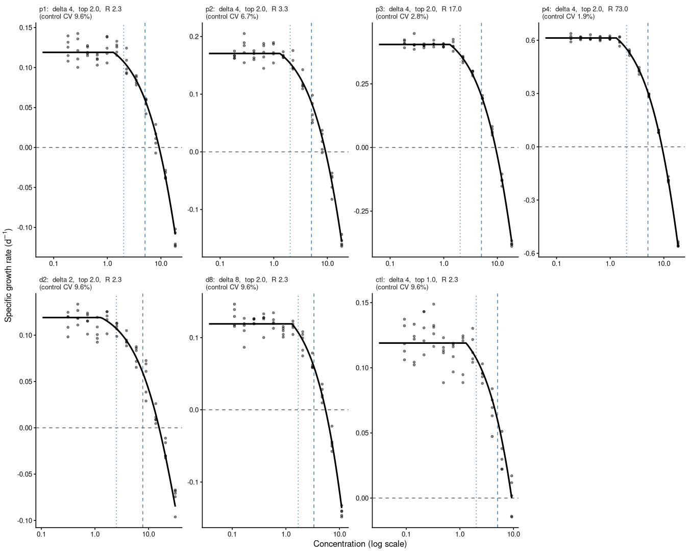

[e1]: https://open-aims.github.io/bayesnec/articles/example1.html
[e2]: https://open-aims.github.io/bayesnec/articles/example2.html
[e5]: https://open-aims.github.io/bayesnec/articles/example5.html

# 1 Negative growth rates

Some ecotoxicological responses can legitimately take negative values. Specific
growth rate is the most common example: it is a rate of change, and a
population that declines over the course of a test has a negative one. Other
examples include increments, differences between paired measurements, and any
response expressed as a change from a baseline.

Removing those negative values before fitting is standard practice, in this
package and in others. The reasons are long-standing and none of them is
specific to any one piece of software. A negative value cannot be expressed as
a percentage of the control without the percentage exceeding 100. Several
commonly used concentration-response equations cannot generate a negative mean
at all. And a negative growth rate looks anomalous on a plot, which invites the
reader to treat it as an error rather than as a measurement.

The removal is done in one of several ways: by replacing the negative values
with zero before fitting, by deleting the rows that hold them, by declaring
them censored at zero, or by fitting a response distribution such as a Beta or
a Gamma that has no support below zero.

Here we examine what each of those conventions does to the toxicity estimate
that is subsequently reported. Section 2 sets out how the estimates are defined
and why the definition matters when the response can cross zero. Section 3 sets
out what replacing a negative value commits the analyst to, which is more than
an edit to the data. Section 4 records what `bayesnec` permits, which changed
in version 2.2.0. Section 5 reports a simulation study in which the true values
are known, so that each convention can be scored rather than merely compared.
Section 6 applies the same comparison to four real algal growth tests. Sections
7 and 8 give the recommendations and the limitations, and Section 9 records the
provenance of every figure quoted.

To run this vignette we will need the following packages.


``` r
library(bayesnec)
library(brms)
library(ggplot2)
library(dplyr)
library(tidyr)
```

# 2 Toxicity estimates and their reference

## 2.1 Growth rate and the ErCx notation

The subscript `r` in ErC50 comes from OECD Test Guideline 201
[@oecd2026tg201]. In OECD terminology the *endpoint* is the measured biological
response, and TG 201 defines two of them from the same cell counts and requires
both to be reported. The toxicity estimates derived from each are distinguished
by a subscript naming the endpoint they came from: ErC50 is the EC50 for the
average specific *growth rate*, the rate constant of population increase, and
EyC50 is the EC50 for the *yield*, the biomass increase over the test. For the
same data EyC50 is systematically lower than ErC50, and the guideline requires
the growth rate to be reported because it is the one that does not depend on
test duration.

An ECx or an NSEC is therefore a *toxicity estimate*, not an endpoint. That
distinction matters here because it is the growth rate endpoint, not the
toxicity estimate, that can take negative values. Everything below concerns
ErCx.

## 2.2 The ECx reference

`bayesnec` measures every ECx from the control, which is the predicted mean at
the lowest concentration in the supplied predictor, taken per posterior draw.
The `type` argument names what the percentage is measured *towards*:
`"absolute"`, the default, measures from the control to zero; `"relative"`
measures from the control to the equation's lower asymptote; `"range"` measures
from the control to the lowest response the curve predicts; and `"direct"`
reads the concentration off a nominated response value. See `?ecx` for the full
definitions.

`type = "absolute"` is the definition TG 201 uses. A 50% effect means the
growth rate has been halved relative to the control, and a 100% effect means
growth has stopped altogether. Two consequences follow for a response that can
go negative. Zero growth is 100% effect for every dataset, whatever the control
growth rate, so a curve whose lower asymptote is negative descends past 100%
effect and keeps going. And effects above 100% are meaningful and are not
truncated: `ecx_val` is not capped, because 120% inhibition of a growth rate is
a rate of -0.2 times the control, which is a real measurement on an unbounded
response and is what TG 201 reports.

ErC10 and ErC50 themselves never lie below zero. They require the response to
be 90% and 50% of the control respectively, both strictly positive, so the
negative part of the curve can only affect them indirectly, by changing the
shape of the fitted curve through the high-concentration observations. That
indirect route is what the rest of this vignette quantifies.

We do not normalise to the control anywhere here. The absolute ECx already
expresses the effect relative to the fitted control response, so dividing the
data by the control mean beforehand would apply the same correction twice and
would additionally distort the error structure [@Ritz2026].

## 2.3 The NSEC

The NSEC is the no-significant-effect-concentration of @fisherfox2023: the
concentration at which the modelled mean response first becomes statistically
indistinguishable from the modelled control response. `bayesnec` takes a lower
quantile of the control posterior — by default the 1st percentile, controlled
by `sig_val` — and finds where each posterior draw of the curve crosses it. It
is one of the estimates recommended for guideline derivation under the current
Australian and New Zealand technical guidance [@warne2025]; see @fisher2023ieam
for its relationship to the NEC.

The NSEC depends on the width of the control posterior, and this determines how
the results below have to be read. It is a property of the metric rather than a
defect of any fitting approach. A noisier experiment produces a wider control
posterior, hence a lower reference value, hence a crossing further to the
right. As the residual error tends to zero the reference converges on the
control mean, and for an equation that includes a `nec` parameter the NSEC
converges on `nec` itself. The true `nec` is therefore the NSEC's limiting
value, not its expected value at any finite level of noise.

# 3 Flooring and the response distribution

Replacing a negative growth rate with zero is not only an edit to the data. It
asserts that the response cannot be negative, which is a statement about the
response distribution, and the rest of the analysis has to be made consistent
with it.

No available family represents that assertion exactly. A floored response has a
point mass at zero, and the distributions available for a non-negative
continuous response exclude zero itself: a Beta is defined on the open interval
(0, 1) and a Gamma on the open interval (0, infinity). The floored values
therefore sit outside the support of the family the flooring implies. A
distribution that does represent a continuous non-negative response with a
point mass at zero — a Tweedie, for instance — is not available natively in
`brms`.

`bayesnec` accommodates this by moving the values inside the support.
`check_data()` shifts an exact zero to one tenth of the smallest positive
value, and an exact one to `1 - 0.001`. This has always been the behaviour and
it is unchanged. Since version 2.2.0 `bnec()` reports each substitution once,
naming the number of rows, the value substituted, the reason, and the family
that would represent a genuine zero rather than move it. The accommodation is a
device for making an inconsistent specification runnable, not a model of the
response.

Substituting zeros and choosing a bounded family are therefore the same
practice at different stages, which is why this vignette does not treat them as
alternatives. The `floored` convention below replaces the negative values and
leaves the family unbounded; the `beta` and `gamma` conventions make the same
assertion through the family as well.

Two cases are outside this argument. A row whose value was never recorded,
because the population fell below a counting limit, is a censored observation
rather than a floored one, and is exempt from the substitution. And a response
that is genuinely zero because the population died is a different process
again, which the hurdle and zero-inflated families are designed for; see the
[Hurdle and zero-inflated models][e5] vignette. Those families are not a remedy
for a substituted negative.

# 4 Zero-asymptote equations under a Gaussian family

The interval a response distribution allows the mean to occupy is a property of
the distribution and not of the link. A Gaussian mean is unconstrained: the
data enter the likelihood only through the residual, so a negative fitted mean
is an ordinary prediction rather than an invalid one.

From version 2.2.0 the six declining equations whose lower asymptote is fixed
at zero — `nec3param`, `ecxexp`, `ecxsigm`, `ecxwb1p3`, `ecxwb2p3` and `ecxll3`
— are retained under a Gaussian family, and an absolute ECx is reported for
them. Earlier versions dropped them, on the grounds that they cannot generate a
negative prediction, and refused an absolute ECx for a Gaussian fit without a
`bot` parameter. Both restrictions have been removed (#206). The declining
candidate set that `bnec()` fits by default under a Gaussian family is
therefore fourteen equations rather than eight.


``` r
models()$decline
#>  [1] "nec3param" "nec4param" "neclin"    "ecxlin"    "ecxexp"    "ecxsigm"  
#>  [7] "ecx4param" "ecxwb1"    "ecxwb2"    "ecxwb1p3"  "ecxwb2p3"  "ecxll5"   
#> [13] "ecxll4"    "ecxll3"
```

The practical effect is that the curve shape TG 201 and @Ritz2026 both describe
for algal growth-rate data — a lower asymptote fixed at zero, representing
complete inhibition — can be fitted directly, on the measurements as recorded,
and can be weighed against the free-asymptote shapes by the same model
averaging that `bayesnec` applies to everything else. Choosing that shape is
now a matter of evidence rather than of specification. Replacing the
measurements remains a decision about the data, and the sections that follow
are about the second of them.

# 5 Simulation study

Real datasets can show that the conventions disagree, but not which of them is
right, because the true toxicity of a real substance is unknown. We therefore
make the comparison on simulated data, where the true ErC10, ErC50 and `nec`
are known by construction and each convention can be scored against them.

## 5.1 The conventions compared

We compare six conventions, distinguished only by what is done to the data
before fitting and which response distribution is then used.

| name | what the analyst does |
|---|---|
| `measured` | use the growth rates as recorded |
| `censored` | declare each negative value left-censored at zero |
| `deleted` | delete the rows holding a negative value |
| `floored` | replace each negative value with zero |
| `beta` | floor, scale the response to (0, 1], fit a Beta |
| `gamma` | floor, fit a Gamma |

Every convention then calls `bnec()` with package defaults: the default priors derived
from its own prepared data, the default declining candidate set for its family,
and the default model averaging over that set. No convention is handed a prior or an
equation chosen by another. The contrast between two conventions is therefore the
contrast a practitioner would obtain by following the convention through, not a
likelihood-only contrast with everything else held artificially fixed.

That is a change of question from an earlier version of this study, which held
the equation fixed at `nec4param` so that any difference could be attributed to
the treatment of the data alone. Holding the equation fixed answers a question
about the likelihood; it does not answer the question a reader has, which is
what happens to the number they will report. Fitting the candidate set also
removes an artefact of the fixed design: on altered data a fixed `nec4param` is
no longer the equation that generated them, so part of what it measured was
misspecification the convention did not cause.

The `measured` convention uses the growth rates exactly as recorded, with the lower
asymptote left free wherever the equation has one. It is the reference for
everything below.


``` r
bnec(y ~ crf(x, "decline"), data = dat, family = gaussian(link = "identity"))
```

The `censored` convention declares each negative value as censored at zero: the model
is told the observation lies at or below zero, without being told what it was.
This is the option available when the negative values were never recorded. It
also changes which observations constrain the mean the most, because a censored
row contributes the probability that the response lies at or below the bound
rather than a density. See the *Censoring* section of the
[Single model usage][e1] vignette.


``` r
dat_censored <- dat |>
  mutate(cens = ifelse(y < 0, "left", "none"),
         y = ifelse(y < 0, 0, y))
bnec(y | cens(cens) ~ crf(x, "decline"), data = dat_censored,
     family = gaussian(link = "identity"))
```

The `deleted` convention drops the rows holding a negative value and analyses what is
left unchanged. Nothing false is asserted about any observation that is kept,
but the replication per concentration changes, and at the top of the series a
whole treatment group can disappear.


``` r
bnec(y ~ crf(x, "decline"), data = filter(dat, y >= 0),
     family = gaussian(link = "identity"))
```

The `floored` convention replaces every negative growth rate with zero and leaves the
model unchanged.


``` r
dat_floored <- mutate(dat, y = pmax(y, 0))
bnec(y ~ crf(x, "decline"), data = dat_floored,
     family = gaussian(link = "identity"))
```

The `beta` convention divides the floored response by its maximum so that it lies in
(0, 1] and fits a Beta. Dividing by the maximum is how these data have been
prepared in the work this vignette draws on; dividing by the control mean is at
least as common elsewhere, and @Ritz2026 set out why neither should be done
before fitting.


``` r
dat_beta <- dat |>
  mutate(y = pmax(y, 0)) |>
  mutate(y = y / max(y))
bnec(y ~ crf(x, "decline"), data = dat_beta, family = Beta(link = "identity"))
```

The `gamma` convention applies no scaling and fits a Gamma to the floored response.


``` r
bnec(y ~ crf(x, "decline"), data = dat_floored,
     family = Gamma(link = "identity"))
```

The zeros that flooring creates are shifted off the boundary by `check_data()`,
as described in Section 3, and that shift is part of the convention under test
rather than something the study pre-empts. Dividing by the maximum does not
affect the reported toxicity estimates: `ecx(type = "absolute")` solves
`f(x) = control * (1 - x/100)`, so a positive scaling of the response applies
to both sides and the concentration at which the curve meets the target is
unchanged. What the family changes is the fitted curve, not the definition of
the estimate.

The candidate set differs between families, because the declining set is
filtered by what each family's support allows. Under a Gaussian family it is
the fourteen equations listed in Section 4; under a Beta and under a Gamma it
is twelve.


## 5.2 Design

The data are generated from `nec4param`, an equation that is in every Gaussian
convention's candidate set, so that the generating shape is available to be recovered
and the weight it receives is itself informative.


``` r
nec4param_curve <- function(x, top, bot, beta, nec) {
  bot + (top - bot) * exp(-exp(beta) * (x - nec) * (x >= nec))
}
```

The truth is parameterised so that the two experimental factors are explicit.
The control growth rate is set by the control fold-change `R`, the factor by
which the control population multiplies over a test of length `t`. The depth of
the lower asymptote is set as a multiple `delta` of that control rate, so at
`delta = 2` the population declines twice as fast at the highest concentrations
as it grows in the control. The three levels used, `delta` = 2, 4 and 8, span
the range measured on the real datasets.


``` r
sim_truth <- function(R = 2.3, delta = 4, t = 7, nec = 1.3, beta = -3.573) {
  mu_0 <- log(R) / t                    # true control growth rate
  bot <- -delta * mu_0                  # lower asymptote, delta x deeper than top
  list(R = R, delta = delta, t = t, top = mu_0, bot = bot,
       beta = beta, nec = nec,
       # where the true curve crosses zero growth
       zero_crossing = nec + log((1 + delta) / delta) / exp(beta))
}
```

The design is a geometric concentration series spanning a factor of one
hundred, with ten controls and five replicates at each of twelve concentrations
(n = 70), matching the real designs. The position of the highest concentration
is the second factor, expressed as a multiple `top_factor` of the concentration
at which the true curve crosses zero. At `top_factor = 1.0` the series stops
exactly at the crossing and about one design point in fourteen has a
non-positive true mean; at `2.0` it runs well past, and one in seven does. This
factor determines how much negative data there is for a convention to act on.


``` r
sim_design <- function(truth, top_factor = 1, n_conc = 12, n_rep = 5,
                       n_control = 10, span = 100) {
  x_max <- top_factor * truth$zero_crossing
  concs <- exp(seq(log(x_max / span), log(x_max), length.out = n_conc))
  data.frame(x = c(rep(0, n_control), rep(concs, each = n_rep)))
}
```

The residual scale is constant along the curve, and the fits are homoscedastic
to match, so that no convention is misspecified in its variance and the mean structure
is the only thing under test. An earlier version of this study generated the
residual scale rising 8.1-fold from the control to the lower asymptote, a
figure described as calibrated from the real data. Re-measured on `alga` as the
within-dose standard deviation against position on the curve, with substituted
rows excluded, only one of the four datasets shows a gradient at all
(`c_proliferum`, fitted ratio 14.1, slope p < 0.001; the other three 1.2 to
1.5, p > 0.35). Generating every cell heteroscedastic asserted as general
something seen in one dataset, and made every convention misspecified in the same way,
which is a confound shared by the whole comparison rather than a feature of it.


``` r
sim_sigma <- function(x, truth, sigma_0_abs) rep(sigma_0_abs, length(x))

simulate_dataset <- function(truth, design, sigma_0_abs, seed = NULL) {
  if (!is.null(seed)) set.seed(seed)
  mu <- nec4param_curve(design$x, truth$top, truth$bot, truth$beta, truth$nec)
  data.frame(x = design$x,
             y = rnorm(length(mu), mu, sim_sigma(design$x, truth, sigma_0_abs)))
}
```

The control residual standard deviation is held at a fixed absolute value,
anchored so that it corresponds to a 9.6% coefficient of variation at
`R` = 2.3, rather than at a fixed coefficient of variation. Under a fixed
coefficient of variation the generating model is exactly scale-equivariant in
the growth rate, so changing `R` would change nothing that is reported. Holding
the absolute error fixed instead means that raising `R` raises the signal and
leaves the noise alone, which makes `R` a measurement-precision axis.


``` r
sigma_0_abs <- 0.096 * log(2.3) / 7   # absolute control SD, anchored at R = 2.3
```

The design is seven cells. Four of them, `p1` to `p4`, hold `delta` = 4 and
`top_factor` = 2.0 and raise `R`, giving four levels of measurement precision
at an otherwise identical design and truth. Two more, `d2` and `d8`, change how
far the true curve descends below zero. The seventh, `ctl`, stops the
concentration series at the zero crossing, so that the conventions have almost
nothing to act on. Each cell was simulated 100 times and every simulated
dataset was analysed by all six conventions, giving 7 x 100 x 6 = 4,200
model-averaged fits and 52,533 individual equation fits. Sampling used four
chains of 4,000 iterations with 2,000 warmup, `adapt_delta = 0.99` and
`max_treedepth = 12`. Every fit is retained in the summaries: no unit failed and
no estimate was unidentified.


``` r
cells <- data.frame(
  cell = c("p1", "p2", "p3", "p4", "d2", "d8", "ctl"),
  delta = c(4, 4, 4, 4, 2, 8, 4),
  top_factor = c(2, 2, 2, 2, 2, 2, 1),
  R = c(2.3, 3.3, 17, 73, 2.3, 2.3, 2.3)
)

cell_detail <- function(s) {
  tr <- sim_truth(R = s$R, delta = s$delta)
  dz <- sim_design(tr, top_factor = s$top_factor)
  mu <- nec4param_curve(dz$x, tr$top, tr$bot, tr$beta, tr$nec)
  true_ecx <- function(p) {
    target <- tr$top * (1 - p / 100)
    tr$nec + log((tr$top - tr$bot) / (target - tr$bot)) / exp(tr$beta)
  }
  data.frame(top = tr$top, bot = tr$bot, x_max = max(dz$x),
             ErC10 = true_ecx(10), ErC50 = true_ecx(50),
             cv_control = sigma_0_abs / tr$top,
             # tolerance, not `<= 0`: at top_factor = 1 the highest design point
             # sits exactly on the crossing, so a strict test flips on floating
             # point and reports 0 for some cells and 1/14 for others
             prop_negative = mean(mu <= 1e-10))
}
cells <- cbind(cells, do.call(rbind, lapply(seq_len(nrow(cells)),
                                            function(i) cell_detail(cells[i, ]))))
```


Table: **Table 1.** The seven simulated cells. `top` and `bot` are the true upper and lower asymptotes of the growth rate; `prop. negative` is the proportion of the 70 design points whose true mean growth rate is at or below zero. The true `nec` is 1.3 in every cell.

|Cell | delta| top factor|    R|   top|    bot| max conc.| true ErC10| true ErC50| control CV| prop. negative|
|:----|-----:|----------:|----:|-----:|------:|---------:|----------:|----------:|----------:|--------------:|
|p1   |     4|          2|  2.3| 0.119| -0.476|      18.5|       2.02|       5.05|      0.096|          0.143|
|p2   |     4|          2|  3.3| 0.171| -0.682|      18.5|       2.02|       5.05|      0.067|          0.143|
|p3   |     4|          2| 17.0| 0.405| -1.619|      18.5|       2.02|       5.05|      0.028|          0.143|
|p4   |     4|          2| 73.0| 0.613| -2.452|      18.5|       2.02|       5.05|      0.019|          0.143|
|d2   |     2|          2|  2.3| 0.119| -0.238|      31.5|       2.51|       7.79|      0.096|          0.143|
|d8   |     8|          2|  2.3| 0.119| -0.952|      11.0|       1.70|       3.34|      0.096|          0.143|
|ctl  |     4|          1|  2.3| 0.119| -0.476|       9.2|       2.02|       5.05|      0.096|          0.071|


Three features of Table 1 matter for the results below. The true ErC10 and
ErC50 depend only on `delta`, so `p1` to `p4` share one estimand and differ
only in how precisely it can be measured. The proportion of negative true means
is one in seven in every cell except `ctl`, where it is one in fourteen; in the
realised datasets that is about 10 negative observations out of 70, against
about 2 in `ctl`. And the control coefficient of variation falls from 9.6% to
1.9% across `p1` to `p4`, which is the sweep the rest of the section is built
on.


``` r
curve_data <- do.call(rbind, lapply(seq_len(nrow(cells)), function(i) {
  s <- cells[i, ]
  tr <- sim_truth(R = s$R, delta = s$delta)
  xx <- seq(0, s$x_max, length.out = 300)
  data.frame(cell = s$cell, x = xx,
             mu = nec4param_curve(xx, tr$top, tr$bot, tr$beta, tr$nec))
}))

point_data <- do.call(rbind, lapply(seq_len(nrow(cells)), function(i) {
  s <- cells[i, ]
  tr <- sim_truth(R = s$R, delta = s$delta)
  d <- simulate_dataset(tr, sim_design(tr, s$top_factor), sigma_0_abs,
                        seed = 42 + i)
  data.frame(cell = s$cell, d)
}))

# Panels in design order -- the precision sweep first, then the cells that change
# the truth or the design -- rather than alphabetically.
cell_levels <- c("p1", "p2", "p3", "p4", "d2", "d8", "ctl")
cells$cell <- factor(cells$cell, levels = cell_levels)
curve_data$cell <- factor(curve_data$cell, levels = cell_levels)
point_data$cell <- factor(point_data$cell, levels = cell_levels)

lab <- setNames(
  sprintf("%s:  delta %g,  top %.1f,  R %.1f\n(control CV %.1f%%)",
          cells$cell, cells$delta, cells$top_factor, cells$R,
          100 * cells$cv_control),
  levels(cells$cell))

# controls sit at x = 0 and have no position on a log axis, so they are dropped
# from this figure; every fit uses them
ggplot(subset(point_data, x > 0), aes(x = x, y = y)) +
  geom_hline(yintercept = 0, linetype = "dashed", colour = "grey40") +
  geom_vline(data = cells, aes(xintercept = ErC10),
             linetype = "dotted", colour = "steelblue") +
  geom_vline(data = cells, aes(xintercept = ErC50),
             linetype = "dashed", colour = "steelblue") +
  geom_point(alpha = 0.45, size = 0.8) +
  geom_line(data = subset(curve_data, x > 0), aes(y = mu), linewidth = 0.7) +
  facet_wrap(~ cell, scales = "free", ncol = 4,
             labeller = labeller(cell = lab)) +
  scale_x_log10() +
  labs(x = "Concentration (log scale)",
       y = expression("Specific growth rate ("*d^-1*")")) +
  theme_classic(base_size = 8) +
  theme(panel.spacing = unit(0.35, "lines"),
        plot.margin = margin(2, 4, 2, 2),
        strip.background = element_blank(), strip.text = element_text(hjust = 0))
```

<div class="figure" style="text-align: center">

<p class="caption">**Figure 1.** The seven simulated cells. Points are one simulated dataset per cell; the solid line is the true curve; the dashed horizontal line is zero growth. Vertical lines mark the true ErC10 (dotted) and ErC50 (dashed). Panels are labelled with the cell name, its design factors and the control coefficient of variation it realises.</p>
</div>


## 5.3 ErC10 and ErC50

Relative bias is the mean of the estimated value minus the true value, over the
100 realisations of a cell, expressed as a percentage of the true value. The
precision sweep is the most informative comparison in the study, because it
distinguishes the two things that can make an estimate wrong: estimation error
shrinks as an experiment becomes more precise, and model misspecification does
not.


``` r
bias_plot <- function(d, ests) {
  ggplot(subset(d, estimate %in% ests),
         aes(x = cv_f, y = rel_bias, colour = arm, group = arm)) +
    geom_hline(yintercept = 0, linetype = "dashed", colour = "grey40") +
    geom_line(linewidth = 0.7) +
    geom_point(size = 1.8) +
    # One label per series at the right-hand edge rather than a key: the label
    # sits on the line it names, which is the secondary encoding the palette
    # note above depends on.
    scale_x_discrete(expand = expansion(add = c(0.4, 0.4))) +
    facet_grid(estimate ~ handling, scales = "free_y") +
    labs(x = "Control coefficient of variation (%)  —  more precise →",
         y = "Relative bias in the estimate (%)") +
    scale_colour_manual(values = arm_cols, breaks = arm_levels) +
    guides(colour = guide_legend(nrow = 1)) +
    theme_classic(base_size = 9) +
    theme(strip.background = element_blank(), legend.position = "bottom",
          legend.title = element_blank(), legend.key.width = unit(1.4, "lines"))
}
bias_plot(precision, c("ErC10", "ErC50"))
```

<div class="figure" style="text-align: center">

<p class="caption">**Figure 2.** Relative bias in the estimated ErC10 and ErC50 against the control coefficient of variation, which decreases to the right as the experiment becomes more precise. Each point summarises 100 simulated datasets. The dashed line is zero bias.</p>
</div>

The three conventions that retain the measurement converge on the true ErC50.
Across `p1` to `p4` the bias of `measured` runs from
-0.5% to
-0.2%, `censored` from
-0.7% to
-0.2%, and `deleted` from
-2.4% to
-0.1%. All three are within half a per cent of
the truth at the highest precision tested.

Flooring does not converge. Its ErC50 bias falls from
-3.4% to
-2.3% and then stops, and the Beta holds
between -4.4% and
-5.8% throughout. Both make the substance
appear more toxic than it is. The residual bias is smaller than the 8 to 15%
reported for the same conventions under a fixed `nec4param`, and the reason is
Section 4: the enlarged candidate set now contains the zero-asymptote shapes
that floored data resemble, and averaging over them absorbs part of the
distortion. It does not absorb all of it.

The Gamma converges on ErC50 and is the worst of the six on ErC10. Its ErC50
bias falls from 4.3% to
0.2% across the sweep, while its ErC10 is
displaced by -8.7% at the noisiest and
-25.0% at the most precise — it gets worse as the
experiment improves, which is the signature of misspecification rather than of
estimation error. An identity-link Gamma fixes the coefficient of variation along the whole
curve, so a single value has to cover both the control scatter and the block of
near-identical values that flooring creates, and the compromise falls on the
shoulder of the curve where ErC10 is read. Its intervals are
2.14
times as wide as those of `measured` on ErC50, which is what keeps its ErC50
coverage nominal while its point estimate for ErC10 is a fifth low.

The Beta is displaced in the other direction on ErC10, from
-0.9% at the noisiest to
9.3% at the most precise. Its bias grows as the
experiment improves, which is the signature of misspecification rather than of
estimation error.


``` r
ggplot(design_cells, aes(x = rel_bias, y = arm, colour = arm)) +
  geom_vline(xintercept = 0, linetype = "dashed", colour = "grey40") +
  geom_point(size = 2.2) +
  # estimate on the columns, not the rows: facet_grid frees a scale per column,
  # and the three estimates are on scales that differ by an order of magnitude,
  # so sharing one x axis across them would hide everything but the NSEC.
  facet_grid(cell ~ estimate, scales = "free_x") +
  scale_y_discrete(limits = rev(arm_levels)) +
  labs(x = "Relative bias in the estimate (%)", y = NULL) +
  scale_colour_manual(values = arm_cols, guide = "none") +
  theme_classic(base_size = 9) +
  theme(strip.background = element_blank(), legend.position = "none")
```

<div class="figure" style="text-align: center">

<p class="caption">**Figure 3.** Relative bias in the three cells that change the truth or the design rather than the measurement precision, all at a control coefficient of variation of 9.6%. `d2` and `d8` change how far the true curve descends below zero; `ctl` stops the concentration series at the zero crossing, leaving about two negative observations in seventy for a convention to act on.</p>
</div>

How far the curve descends below zero changes the size of the effect but not
its direction. Between `d2` and `d8` the ErC50 bias of `floored` is
-4.0% and
-2.0%, and of `beta`
-5.0% and
-3.1%, against
0.0% and
1.1% for `measured`.

The `ctl` cell is the one that tells a reader whether any of this applies to
their data. Its concentration series stops at the zero crossing, so a realised
dataset holds about two negative observations rather than ten, and the four
Gaussian conventions then span 0.4 percentage points
of ErC50 bias between them, against 3.0 in `p1`, which
has the same control variability and four times as many negative observations.
Where essentially none of the observations are at or below zero growth, the
choice of convention does not change the reported value.

## 5.4 Credible interval coverage

Coverage is the proportion of the 100 realisations whose 95% credible interval
contains the true value. It is reported here alongside the mean interval width,
because a wide interval and an accurate one both achieve nominal coverage and
they are not the same result.


``` r
cov_plot <- function(d, ests) {
  ggplot(subset(d, estimate %in% ests),
         aes(x = cv_f, y = coverage, colour = arm, group = arm)) +
    geom_hline(yintercept = 0.95, linetype = "dashed", colour = "grey40") +
    geom_line(linewidth = 0.7) +
    geom_point(size = 1.8) +
    scale_x_discrete(expand = expansion(add = c(0.4, 0.4))) +
    scale_y_continuous(limits = c(0, 1)) +
    facet_grid(estimate ~ handling) +
    labs(x = "Control coefficient of variation (%)  —  more precise →",
         y = "Proportion of 95% intervals containing the truth") +
    scale_colour_manual(values = arm_cols, breaks = arm_levels) +
    guides(colour = guide_legend(nrow = 1)) +
    theme_classic(base_size = 9) +
    theme(strip.background = element_blank(), legend.position = "bottom",
          legend.title = element_blank(), legend.key.width = unit(1.4, "lines"))
}
cov_plot(precision, c("ErC10", "ErC50"))
```

<div class="figure" style="text-align: center">

<p class="caption">**Figure 4.** Proportion of 95% credible intervals containing the true ErC10 or ErC50, against the control coefficient of variation. The dashed line is nominal coverage.</p>
</div>

The three retaining conventions hold nominal coverage across the sweep. At the
highest precision `measured` contains the true ErC50 in
0.97 of the 100 realisations,
`censored` in 0.99 and `deleted`
in 0.99.

Flooring loses coverage as the experiment improves, from
0.85 to
0.24 on ErC50, and the Beta from
0.99 to
0.52. This is the practical
consequence of a bias that does not converge. The interval narrows around a
centre that stays displaced, so a laboratory that improves its technique, adds
replicates and reduces its control variability will, if it floors its negative
values, produce an analysis that is more confident and no less wrong. The
Gamma's ErC10 shows the same failure more sharply, falling from
0.84 to
0.01.

Interval width is what keeps this from being read the other way round. At the
highest precision `floored` has an ErC50 interval
1.47
times as wide as that of `measured` and covers the truth a quarter of the time,
while `gamma` has one
2.14
times as wide and covers it at the nominal rate. Neither coverage nor width
should be reported without the other.

## 5.5 The NSEC

ErC10 and the NSEC are the two estimates commonly used as a no-effect value,
and the conventions do not affect them in the same way. As Section 2.3 sets
out, the true `nec` is the NSEC's limiting value as the residual error goes to
zero rather than its expected value at any finite noise, so the sweep rather
than any single cell is what identifies an approach: a correctly specified one
sits on the truth and stays there as the experiment improves, and a
misspecified one departs further the more precise the experiment becomes.


``` r
# Bias and coverage in one figure, as two rows of a facet rather than two plots
# stacked by a layout package: the reference line differs between the rows, so
# it is supplied as data rather than as a constant.
nsec_long <- subset(precision, estimate == "NSEC") |>
  select(arm, handling, cv_f, `Relative bias (%)` = rel_bias,
         `Interval coverage` = coverage) |>
  pivot_longer(c(`Relative bias (%)`, `Interval coverage`),
               names_to = "metric", values_to = "value") |>
  mutate(metric = factor(metric, levels = c("Relative bias (%)",
                                            "Interval coverage")))
nsec_ref <- data.frame(metric = factor(c("Relative bias (%)",
                                         "Interval coverage"),
                                       levels = levels(nsec_long$metric)),
                       yint = c(0, 0.95))

ggplot(nsec_long, aes(x = cv_f, y = value, colour = arm, group = arm)) +
  geom_hline(data = nsec_ref, aes(yintercept = yint),
             linetype = "dashed", colour = "grey40") +
  geom_line(linewidth = 0.7) +
  geom_point(size = 1.8) +
  scale_x_discrete(expand = expansion(add = c(0.4, 0.4))) +
  facet_grid(metric ~ handling, scales = "free_y", switch = "y") +
  labs(x = "Control coefficient of variation (%)  —  more precise \u2192",
       y = NULL) +
  scale_colour_manual(values = arm_cols, breaks = arm_levels) +
  guides(colour = guide_legend(nrow = 1)) +
  theme_classic(base_size = 9) +
  theme(strip.background = element_blank(), strip.placement = "outside",
        legend.position = "bottom", legend.title = element_blank(),
        legend.key.width = unit(1.4, "lines"))
```

<div class="figure" style="text-align: center">

<p class="caption">**Figure 5.** Relative bias in the estimated NSEC against the true `nec` of 1.3 (upper row) and the proportion of 95% credible intervals containing it (lower row), against the control coefficient of variation. The dashed lines are zero bias and nominal coverage. A correctly specified approach stays on zero bias as the residual error falls; a misspecified one departs further the more precise the experiment becomes.</p>
</div>
The retaining conventions stay near the true `nec` across the sweep, and show no
trend in either direction. At the highest precision the NSEC bias of `measured`
is 3.3%, of `censored`
2.5% and of `deleted`
0.8%. They are not flat along the way — the
largest single departure any of the three shows is
11.1%,
by `measured` at a 6.7% control coefficient of variation — but the departures do
not grow as the experiment improves, which is what distinguishes estimation
error from misspecification.

Section 2.3 gives the reason to expect an overestimate at finite noise, and
under the priors used here that overshoot is small enough to be lost in the
Monte Carlo error of 100 realisations rather than being visible as a trend. It
was visible under the superseded prior, where the same three conventions ran
from about +14% down to +4%. What identifies a correctly specified approach here
is therefore that it stays on the truth as the residual error falls, not the
direction it approaches from.

The conventions that replace the measurement diverge downward instead. The NSEC
of `floored` runs from -11.5% to
-52.8%, of `beta` from
-1.0% to -42.5%, and
of `gamma` from 25.5% to
-71.5%. Coverage follows: at the highest precision
`floored` contains the true `nec` in
0.00 of the 100 realisations and
`gamma` in 0.04, against
0.97 for `censored` and
0.98 for `deleted`.

Both errors run in the same direction. A convention that floors reports an
ErC50 that is too low and an NSEC that is too low, so the substance appears
more toxic than it is on both estimates, which for a guideline value is the
cautious side to be wrong on. Being cautious is not the same as being right:
at the highest precision tested the NSEC is displaced by more than half the
true value, which is an error of the same order as the estimate, and the
interval contains the truth in none of the 100 realisations. An estimate that
says nothing about the quantity it names cannot be relied on to be cautious on
the next dataset either.

The one convention whose NSEC coverage falls without its bias diverging is `measured`,
from 1.00 to
0.84. That is the property of the
metric described in Section 2.3 rather than a failure of the convention. The
NSEC overshoots the true `nec` slightly at finite noise, and by `p4` the
interval has narrowed faster than the remaining
3.3% has closed, so an interval that is
correctly placed to within a few per cent stops containing the truth.
`censored` and `deleted` hold nominal coverage over the same range with
intervals
1.72
and
2.04
times as wide.

## 5.6 The equations the data are made to resemble

Because every convention is model-averaged over its family's declining set, and the
data were generated from `nec4param`, the weight each convention gives `nec4param`
measures how far the convention leaves the data resembling the process that
produced them. This is a description of the data supplied to the fit, not of
the substance, and it is reported because it explains the biases above.


Table: **Table 2.** Mean stacking weight on the generating equation `nec4param` across the precision sweep, averaged over 100 realisations per cell. The remaining weight is spread over the other eleven to thirteen equations in the candidate set.

|Convention | p1 (CV 9.6%)| p2 (CV 6.7%)| p3 (CV 2.8%)| p4 (CV 1.9%)|
|:----------|------------:|------------:|------------:|------------:|
|measured   |        0.506|        0.714|        0.849|        0.852|
|censored   |        0.300|        0.355|        0.344|        0.469|
|deleted    |        0.111|        0.191|        0.254|        0.363|
|floored    |        0.066|        0.061|        0.003|        0.000|
|beta       |        0.066|        0.050|        0.017|        0.010|
|gamma      |        0.036|        0.021|        0.000|        0.000|


Given the measurements as recorded, model averaging identifies the generating
equation, and identifies it more sharply as the experiment improves:
`nec4param` takes 0.51
of the weight at a 9.6% control coefficient of variation and
0.85
at 1.9%. Under `censored` and `deleted` it still takes
0.47
and 0.36
of the weight at the highest precision, with most of the remainder on `neclin`,
which shares the same breakpoint and differs only in the shape below it.

Under the conventions that replace the measurement the generating equation
receives essentially none of the weight, and what replaces it is a
zero-asymptote shape. At the highest precision `floored` gives `nec4param`
0.00
and gives `ecxsigm`
0.96;
`gamma` gives `ecxwb1`
0.92.
Both of those equations decay smoothly to zero, which is what floored data look
like, and the more precise the experiment the more confidently the weights say
so. A model weight is evidence about which shape fits the data supplied, not
about which process produced the measurements, and on floored data those are
different questions.

The six equations whose lower asymptote is fixed at zero are the clearest
signature of the substitution, and they identify it only where the substitution
is the thing imposing the boundary. At the highest precision they take
0.98
of the weight under `floored`, against
0.00
under `measured` and
0.00
under `censored`. Under `beta` and `gamma` they take only
0.04
and
0.00,
because there the family already forbids a negative mean and an equation with a
free lower asymptote is bounded below in any case. The weight on these
equations is therefore a diagnostic for flooring under an unbounded family, not
for the zero boundary in general.

# 6 Worked case studies

The simulation establishes which conventions recover the truth. It cannot show
how large the difference is on a real dataset, where the truth is unknown and
the design, the noise and the shape of the response are not under the analyst's
control. Four marine microalgal growth tests were therefore analysed by all six
conventions, and each estimate compared with the `measured` estimate on the same
dataset.

The four tests ship with `bayesnec` as `alga`: two tests on *Cladocopium
proliferum*, a coral endosymbiont, over seven days, and two on *Rhodomonas
salina* over three days, each species exposed to two contaminants on undisclosed
and mutually incomparable concentration scales. The datasets themselves are
summarised from the data that ship with the package, so Table 3 describes
whatever version you have installed.


``` r
data(alga)

# The four case studies are the four species-by-contaminant cells of `alga`.
# The names used throughout this section are the vignette's; the mapping is by
# cell rather than by row order, so it survives any reordering of the data.
alga$dataset <- factor(
  paste0(as.character(alga$species), ifelse(alga$contaminant == "B", "2", "")),
  levels = c("c_proliferum", "c_proliferum2", "r_salina", "r_salina2"))

# The growth rate implied by the counting limit of 10 cells per mL, against the
# starting density recorded for the test. Where the source substituted a zero
# for a below-limit count -- flagged `sgr_source == "substituted"` -- this is the
# rate the substitution implies, and it is what the retaining conventions use in
# place of the substituted zero.
alga$below_limit <- alga$sgr_source == "substituted"
alga$limit_rate <- (log(10) - log(alga$density_initial)) / alga$days
alga$y <- ifelse(alga$below_limit, alga$limit_rate, alga$sgr)

datasets <- alga |>
  group_by(dataset, species, duration_d = days) |>
  summarise(n = n(), n_conc = n_distinct(dose),
            control_rate = mean(y[dose == 0]),
            below_limit = sum(below_limit),
            n_negative = sum(y < 0),
            prop_at_or_below_zero = mean(y <= 0), .groups = "drop") |>
  mutate(fold_change_R = exp(control_rate * duration_d), .before = below_limit)
```


Table: **Table 3.** The four case-study datasets, computed from the `alga` data that ship with the package. `Below limit` counts the rows whose population fell below the counting limit, for which the source substituted a zero. All four have a substantial proportion of observations at or below zero growth, so all four are in the regime where Section 5 applies.

|                       |c_proliferum |c_proliferum2 |r_salina |r_salina2 |
|:----------------------|:------------|:-------------|:--------|:---------|
|Species                |c_proliferum |c_proliferum  |r_salina |r_salina  |
|Days                   |7            |7             |3        |3         |
|n                      |85           |70            |85       |70        |
|Concentrations         |14           |13            |14       |13        |
|Control rate (per d)   |0.119        |0.169         |1.431    |0.951     |
|Fold change R          |2.3          |3.3           |73.1     |17.3      |
|Below limit            |0            |0             |16       |4         |
|Negative               |12           |10            |20       |21        |
|Prop. at or below zero |0.14         |0.14          |0.24     |0.30      |


## 6.1 Undefined growth rates in the *Rhodomonas* tests

At the highest concentrations in both *Rhodomonas* tests the population fell
below the counting limit of 10 cells per mL, so the density is recorded as zero
and the specific growth rate is *undefined* rather than negative. Those rows are
flagged `sgr_source == "substituted"` in `alga`, 16 on `r_salina` and 4 on
`r_salina2`. The two *Cladocopium* tests have none, and their negative values
are measurements.

There is no measured value to retain in those rows, so every convention must
substitute something. The `measured` convention uses the growth rate implied by
the counting limit, which is itself a substitution, and on those two datasets it
is therefore not a true analysis of the measurements. The comparison is
correspondingly weaker there. This is a common situation with real algal data
and one of the reasons left-censoring is useful: it can express "at or below the
limit" without inventing a value.

It also determines what `censored` means on those two datasets. Left-censoring
declares that the truth lies at or below a bound, so the bound should be the
tightest one the measurement supports: zero for a growth rate that was measured
and came out negative, but the counting limit itself for a row that fell below
it, which is a stronger statement than "below zero" and is the one thing the
test does establish about that row.

## 6.2 Estimates from each convention

Each dataset is prepared by each convention exactly as in Section 5.1 and passed
to `bnec()` with package defaults, so the case studies and the simulation run
the same six conventions over the same candidate set.


``` r
# Every convention takes bnec()'s own default priors here, unlike the
# simulation, where one prior is fixed per cell and convention so that repeated
# realisations compile one Stan program rather than a hundred. Each dataset is
# fitted once, so there is nothing for a fixed prior to save, and taking the
# defaults is the practice under examination.
fit_case <- function(d, convention) {
  d$y <- ifelse(d$below_limit, d$limit_rate, d$sgr)
  gauss <- gaussian(link = "identity")
  switch(convention,
    measured = bnec(y ~ crf(dose, "decline"), data = d, family = gauss),
    floored  = bnec(y ~ crf(dose, "decline"), data = transform(d, y = pmax(y, 0)),
                    family = gauss),
    deleted  = bnec(y ~ crf(dose, "decline"), data = d[d$y >= 0, ],
                    family = gauss),
    # Zero for a measured negative; the counting limit for a row that fell below
    # it, which is what the test actually establishes about that row.
    censored = bnec(y | cens(cens) ~ crf(dose, "decline"),
                    data = transform(d,
                      cens = ifelse(below_limit | y < 0, "left", "none"),
                      y = ifelse(below_limit, limit_rate, pmax(y, 0))),
                    family = gauss),
    beta     = bnec(y ~ crf(dose, "decline"),
                    data = transform(d, y = pmax(y, 0) / max(pmax(y, 0))),
                    family = Beta(link = "identity")),
    gamma    = bnec(y ~ crf(dose, "decline"), data = transform(d, y = pmax(y, 0)),
                    family = Gamma(link = "identity")))
}
```

Those 24 fits are not run when this vignette is built. Each is an average over
thirteen or fourteen equations, and together they take about fifteen hours,
which is more machine time than a package build can use. They are run in the
same compendium as the simulation, against the same pinned version of
`bayesnec`, and their results are transcribed here. Section 9 records what that
means for reading them.


Because the four datasets have toxicity values on completely different
concentration scales, each estimate is shown as a ratio: the convention's
estimate divided by the `measured` estimate on the same dataset. A ratio of 1
is exact agreement.


``` r
# Clipping by pmax/pmin on the data rather than a scale limit, to avoid
# depending on `scales` for an out-of-bounds handler. An interval that runs past
# the panel is already flagged unusable and is drawn with an open symbol.
ratio_lim <- c(0.1, 4)
case_ratios$rlo_p <- pmax(case_ratios$rlo, ratio_lim[1])
case_ratios$rhi_p <- pmin(case_ratios$rhi, ratio_lim[2])

ggplot(case_ratios, aes(x = r, y = arm, colour = arm, shape = usable)) +
  geom_vline(xintercept = 1, linetype = "dashed", colour = "grey40") +
  geom_errorbar(aes(xmin = rlo_p, xmax = rhi_p), orientation = "y",
                width = 0, linewidth = 0.6) +
  geom_point(size = 2.2, fill = "white") +
  scale_shape_manual(values = c("TRUE" = 16, "FALSE" = 21), guide = "none") +
  scale_y_discrete(limits = rev(arm_levels)) +
  scale_x_log10(breaks = c(0.25, 0.5, 1, 2, 4), limits = ratio_lim) +
  facet_grid(estimate ~ dataset) +
  labs(x = "Estimate as a ratio to the `measured` analysis (log scale)",
       y = NULL) +
  scale_colour_manual(values = arm_cols, guide = "none") +
  theme_classic(base_size = 9) +
  theme(strip.background = element_blank(), legend.position = "none")
```

<div class="figure" style="text-align: center">

<p class="caption">**Figure 6.** Estimated ErC10, ErC50 and NSEC from each convention on the four real datasets, expressed as a ratio to the `measured` analysis of the same dataset, with 95% credible intervals. The vertical line at 1 is exact agreement. Open symbols mark estimates flagged as unusable, meaning the interval reached an edge of the tested concentration range, where the bound is the design rather than the data, or collapsed to a point. Intervals extending past the plotted range are clipped at the panel edge.</p>
</div>

No estimate in Figure 6 is flagged unusable: every interval lies inside the tested concentration range.

Three features of Figure 6 require care in what they do and do not establish.

The choice of convention changes the reported value substantially on one of the
four datasets and hardly at all on the other three. On `c_proliferum` the five
conventions other than `measured` return an ErC50 between
0.72 and 0.77
times the `measured` estimate — the difference between one regulatory value and
another. On `c_proliferum2`, `r_salina` and `r_salina2` the convention lying
furthest from `measured` is at 0.96,
1.02 and 0.87 times it.

So the size of the effect cannot be predicted from the data alone, and on three
of these four datasets a reader choosing between conventions would have seen
almost no difference. That is not evidence that the choice is safe. The
simulation is unambiguous about the direction and about the fact that the error
does not shrink as an experiment improves; what a single real dataset cannot do
is separate the effect of a convention from the error of the analysis it is
compared against, because the `measured` analysis has its own error and there is
no truth to score either of them by.


Table: **Table 5.** Total model weight on the six equations whose lower asymptote is fixed at zero, for each convention on each dataset.

|Convention | c_proliferum| c_proliferum2| r_salina| r_salina2|
|:----------|------------:|-------------:|--------:|---------:|
|measured   |         0.00|          0.00|     0.00|      0.00|
|censored   |         0.00|          0.00|     0.00|      0.00|
|deleted    |         0.50|          0.41|     0.43|      0.60|
|floored    |         0.61|          0.74|     0.64|      0.44|
|beta       |         0.05|          0.01|     0.00|      0.00|
|gamma      |         0.19|          0.00|     0.00|      0.00|


One feature of these fits has to be read alongside the ratios. Each is an
average over thirteen or fourteen equations, and on two datasets a substantial
share of the weight sits on equations that mixed poorly. The transcribed table
records, for each fit, the weight held by equations whose tail effective sample
size fell below 400, the level at which a 95% interval's bounds stop being
reliably estimated.


Table: **Table 4.** Model weight held by equations whose tail effective sample size fell below 400, for the fits where it exceeds 0.01. Fits not listed hold essentially none. In the simulation the largest such figure in any cell and convention is under 0.005.

|Dataset      |Convention | weight on tail ESS < 400|
|:------------|:----------|------------------------:|
|r_salina     |deleted    |                    0.576|
|r_salina     |measured   |                    0.524|
|c_proliferum |measured   |                    0.151|
|r_salina     |gamma      |                    0.065|
|r_salina2    |deleted    |                    0.028|


That is a limitation of these four fits rather than of the conventions. It falls
on `measured` and `deleted` on `r_salina`, which are reference analyses rather
than the conventions under test, so the ratios on that dataset should be read as
the weaker evidence. The simulation does not have this problem: across all 4,200
fits the largest mean weight on an equation failing either diagnostic is under
half a per cent, so nothing there rests on an equation that did not converge.

The weight on the zero-asymptote equations is the diagnostic Section 5.6
identifies for flooring under an unbounded family, and it is computable here because it needs
no truth. Averaged over the four datasets `floored` puts
61% of its weight on
them, against 0% under
`measured` and 0% under
`censored`. In the simulation the same comparison runs from near zero to near
one. Two things differ. There the generating equation is in the candidate set
and is known to be correct, so a retaining convention recovers it and a floored
one visibly cannot; on real data no candidate is known to be correct. And these
growth-rate curves decline toward zero whatever is done to the data, so a
zero-asymptote shape is a defensible description of all four datasets rather
than an artefact of one convention. The case studies establish that the choice
of convention changes the reported value. They do not confirm the mechanism, and
without a known truth they cannot.

# 7 Recommendations

Analyse the growth rates as measured and let the model set decide the shape.
Nothing in a Gaussian concentration-response fit requires the response to be
positive. In the simulation this recovers the true ErC50 to within
0.6%
at every level of measurement precision tested, holds nominal interval coverage,
and gives the generating equation
0.85
of the model weight at the highest precision tested.

If the negative values were never recorded, declare them censored rather than
substituting a value. At the highest precision tested it matches the
measurements themselves on ErC50, -0.2%
against -0.2%, and it is the only option when
the underlying values are gone. It is also, with `deleted`, one of only two
conventions that hold nominal coverage for all three toxicity estimates across
the whole precision sweep.

Deleting the negative rows is better than replacing them and worse than keeping
them. Its ErC50 bias converges on zero as the experiment improves and its
coverage stays nominal, but it changes the replication per concentration and at
the top of a series it can remove a treatment group altogether, which is a
change to the design rather than to the data.

Do not replace negative values with zero. Flooring leaves an ErC50 bias of
-2.3% that does not shrink as the experiment
improves, so its interval coverage falls to
0.24 at the highest precision
tested, and it displaces the NSEC by
-52.8%. Averaging over the enlarged candidate
set absorbs part of the distortion — the ErC10 result is close to unbiased —
but it does not remove it, and it cannot, because the floored data are no
longer draws from the process that produced the measurements.

Do not choose a zero-bounded response distribution to solve the problem. This
is the most common response to negative growth rates and it does not work. The
Beta holds an ErC50 bias near
-5.8% at every precision and an ErC10 bias that
grows to 9.3% as the experiment improves. The
Gamma converges on ErC50 and displaces ErC10 by
-25.0%, with coverage of
0.01. Neither gives any outward sign
of trouble: every one of the 1,400 fits in those two conventions converged and
returned all three toxicity estimates.

Do not convert to percent inhibition before fitting. Expressing the response as
a percentage of the control caps it at 100%, which makes negative growth look
like an error and pushes the analyst toward a bounded family.
`ecx(type = "absolute")` already expresses the effect relative to the fitted
control, so the transformation is unnecessary as well as harmful; @Ritz2026
reach the same conclusion by a different route. `bayesnec` will warn if it
detects data that appear to have been normalised.

Report the proportion of observations at or below zero. This is the single
number that tells a reader whether the question arises for the dataset at all.
In the `ctl` cell, where about two observations in seventy are negative, the
four Gaussian conventions span 0.4 percentage points
of ErC50 bias between them; at one in seven and the same control variability
they span 3.0.

Do not report interval coverage, or interval width, alone. At the highest
precision tested `gamma` reaches nominal coverage on ErC50 with intervals
2.14
times as wide as those of `measured`, while `floored` reports narrower
intervals than `gamma` and covers the truth a quarter of the time. Either
figure on its own reverses the ranking.

Read the model weights as a description of the data supplied. On floored data
the generating equation receives essentially none of the weight and a
zero-asymptote shape receives almost all of it, with a confidence that
increases as the experiment improves. A weight is evidence about which shape
fits the data in front of the model, not about which process produced the
measurements.

# 8 Limitations

The data are generated from one equation. `nec4param` is in every Gaussian
convention's candidate set, so the study measures how well each convention lets a
correctly specified candidate be recovered. It does not establish what happens
when no candidate is correct, which is the ordinary situation with real data.

The residual scale is constant along the curve and every fit is homoscedastic
to match. That is a deliberate simplification, and it removes a confound that
was present in the earlier version of this study, but it also means the
dispersion sub-model is never exercised. One of the four `alga` datasets does
show a residual gradient along the curve, so the homoscedastic case is not the
only one that arises. Re-running the sweep under `disp("loglinear")` is tracked
in issue #283.

The priors are `bnec()`'s own defaults, derived once per cell and convention
from a reference realisation and then held fixed across the 100 realisations of
that cell, so that the Stan programs are identical between realisations and
compile once. Holding them fixed removes realisation-to-realisation prior
jitter, which is nuisance variation; each convention still keeps its own prior
derived from its own prepared data, so the contrast between conventions is
unaffected. Under the pinned version the default `nec` prior is a lognormal on
the log of the predictor whose central 95% interval covers the concentrations
tested, and it places the true `nec` of 1.3 between the 23rd and the 63rd
percentile depending on the cell, and the true ErC50 between the 80th and the
95th. Both are comfortably inside.

That was not true of the version of this study published before. Its default
`nec` and `ec50` prior was a gamma whose spread is tied to its shape, so its
central 95% interval covered a fraction of a logarithmically spaced series
however the series was designed, and it placed the true ErC50 above the 99th
percentile in every cell. Anyone comparing the two versions should expect the
equations parameterised by `ec50` to behave differently between them for that
reason alone.

Each cell was simulated 100 times. The Monte Carlo standard error of the
reported bias is a median of 0.4% of the true value for ErC50, 1.2% for ErC10
and 2.1% for the NSEC, reaching 11.6% for the `gamma` NSEC in the `d2` cell.
Differences smaller than those are not resolved by this study. The Monte Carlo
standard error on a coverage of 0.95 is 0.02.

The design is fixed at seventy observations across twelve concentrations
spanning a factor of one hundred, with ten controls. Nothing here establishes
how the conventions behave on a smaller design, an arithmetic series, or one
that does not reach the zero crossing at all beyond the single `ctl` cell.

The case studies compare conventions on four datasets whose truth is unknown.
They show that the choice changes the reported value, and Section 6.2 records
where they do not reproduce what the simulation shows. They are not
recommendations for how those
particular tests should be analysed, and the *Rhodomonas* comparison is weaker
than the *Cladocopium* one because no convention there is a true analysis of
the measurements, as Section 6.1 records.

# 9 Provenance of the reported results

Neither the simulation nor the case studies are run when this vignette is built.
Together they are 4,224 model-averaged fits, which is far more machine time than
a package build can use, and they run instead in a separate research compendium,
[open-AIMS/negative-response-conventions](https://github.com/open-AIMS/negative-response-conventions)
[@negresponse2026]. It holds the generating code, the runners, the fixed priors
as tracked files, the container the fits ran in, and the result tables every
figure here is transcribed from.

Every figure quoted is transcribed from that compendium's output at the commit
named in the bibliography entry: `results/metrics.csv` for the simulation,
`results/weights.csv` for the model weights of Table 2, and
`results/case_estimates.csv` for Section 6. The fits ran against `bayesnec` at
the commit recorded in the compendium's `hpc/bayesnec.lock`, inside the
container that repository's `hpc/image.lock` identifies, which holds the
toolchain and installs the package from that pinned source.

That commit is on the development branch rather than a CRAN release, and here
the difference matters more than it usually would, because what this vignette
measures is what package defaults do. Two of the changes between that commit and
the 2.1.3.1 release are the subject of results reported above: the `nec` and
`ec50` priors are now built on the log of the predictor, and the initial-value
search accepts chains individually. An analysis run under the CRAN release will
not reproduce these numbers exactly.

The case studies were computed when this vignette was built until the
conventions became model-averaged over the whole declining set. Four datasets by
six conventions, each an average over thirteen or fourteen equations, is about
fifteen hours, which is not something to run on a workstation whenever a
sentence changes. Moving them into the compendium gives something up, and it is
stated here rather than left to be discovered: the case-study estimates no longer track
whatever version of `bayesnec` they are published beside. They describe the
pinned commit, exactly as the simulation does. What Table 3 reports — the four
datasets themselves — is still computed at build time from the `alga` data that
ship with the package, so that much does track your installation.

# 10 References
