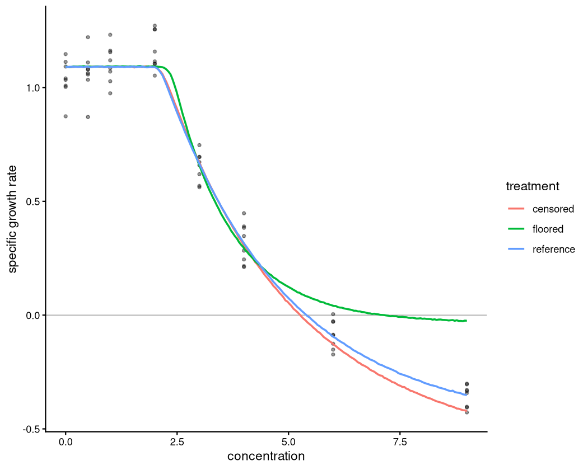
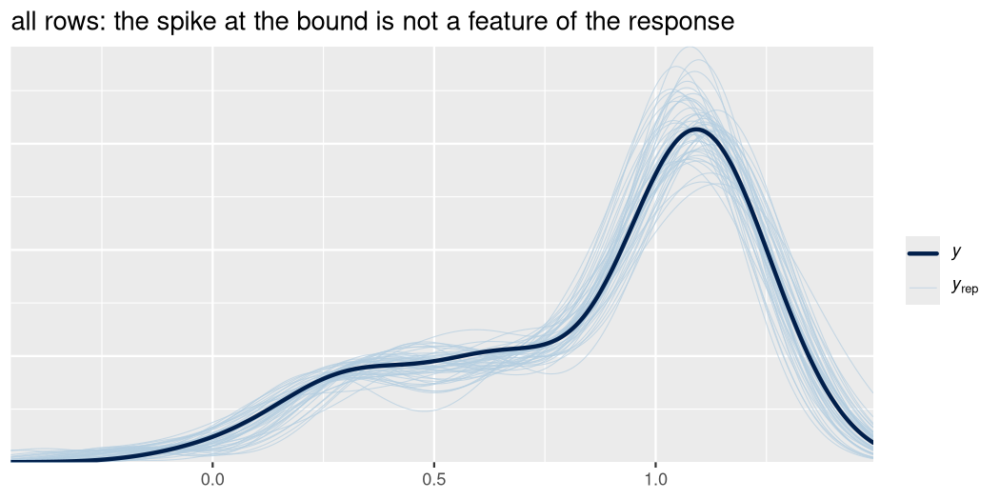
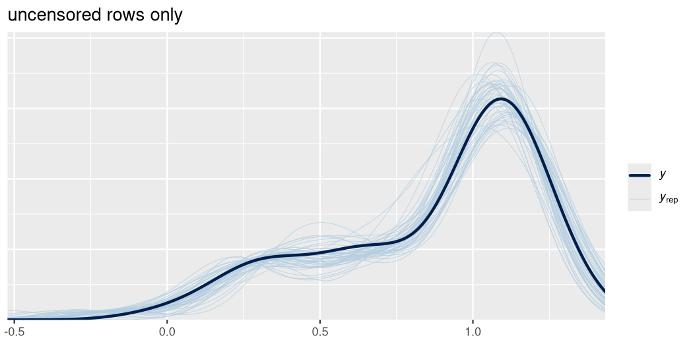

``` r
library(bayesnec)
library(brms)
library(dplyr)
library(ggplot2)
```

# When a recorded value is not a measurement

A concentration-response dataset usually mixes two kinds of number. Most rows
carry a measurement. Some carry a statement that the measurement fell outside
the range the recording process could express — below a detection limit, below
the rounding resolution, or below a boundary the analyst decided not to model.

Those rows are **censored**: the true value is known to lie in an interval, not
at a point. Writing a single number into them and proceeding treats a statement
about an interval as if it were an observation, and the consequences are not
confined to the affected rows.

`vignette("example6")` deals with the neighbouring question of which zeros mean
*nothing happened* and which mean *the unit failed*. This vignette deals with
the zeros that mean neither: the ones that mark the edge of what was recorded.

Three situations recur.

| situation | what a recorded 0 means | bound |
|---|---|---|
| rounded to the recording resolution | true value below half a resolution unit | half the resolution |
| below a limit of detection or quantification | true value below the limit | the reported limit |
| deliberately coarsened at a boundary | true value at or below the boundary | the boundary |

The first two are properties of the measurement process. The third is a
modelling decision, and is discussed separately below, because it carries an
obligation the first two do not.

# Substitution versus censoring

The case against substitution is general: it fabricates data, biases statistics
and obscures real relationships [@helsel2006]. For concentration-response
fitting the mechanism is worth stating exactly, because it explains why the
damage is not local.

Write `µ(x)` for the fitted mean at concentration `x`, `σ` for the residual
scale, `f` for the density and `F` for the distribution function. For an
observation whose true value lies below a bound `c`:

| treatment | likelihood contribution | what it asserts |
|---|---|---|
| substitute `c` (or 0, or `c/2`) | `f(c; µ(x), σ)` | the true value **is** `c` |
| censor at `c` | `F(c; µ(x), σ)` | the true value **is at most** `c` |

Only the second is true.

The practical difference is in how each behaves as the fitted curve descends.
`F(c; µ(x), σ)` rises toward 1 as `µ(x)` falls, so it **saturates**: a curve
that passes further below the bound is not rewarded, but neither is it
penalised. `f(c; µ(x), σ)` instead falls away toward 0, so substitution
**penalises the curve for descending** and goes on pulling `µ(x)` back up toward
the substituted value.

Because censored observations cluster at the high-concentration end, that
upward pull is concentrated exactly where the response is changing fastest. The
fit is biased in a dose-dependent direction, and the bias does not disappear by
choosing a different model or a different family — it is a property of the
likelihood the substituted values induce.

# How censoring is expressed

`brms` takes censoring through the `cens()` aterm on the response:

```r
y | cens(censored) ~ ...
```

where `censored` is a **variable in the data**, aligned to the response, taking
the values `"none"`, `"left"`, `"right"` or `"interval"` (equivalently `0`,
`-1`, `1`, `2`). It is not a constant: in a concentration-response dataset only
some rows are censored, and a literal such as `cens("left")` would declare every
row to be censored.

**The response value carries the bound.** For a left-censored row, the number in
the response column is the value the truth is known to be at or below — not
zero, and not a substitute for the unknown truth. This is the detail that is
easiest to get wrong, and it differs from what one would write when flooring.


``` r
# A response rounded to two decimal places: a recorded 0.00 means the true
# value fell in [0, 0.005). The bound is 0.005, and that is what goes in the
# response column for those rows.
dat <- tibble(
  x   = c(0.1, 0.3, 1.0, 3.0, 10.0),
  raw = c(0.82, 0.55, 0.21, 0.00, 0.00)
) |>
  mutate(
    censored = if_else(raw == 0, "left", "none"),
    y        = if_else(raw == 0, 0.005, raw)
  )

dat
#> # A tibble: 5 × 4
#>       x   raw censored     y
#>   <dbl> <dbl> <chr>    <dbl>
#> 1   0.1  0.82 none     0.82 
#> 2   0.3  0.55 none     0.55 
#> 3   1    0.21 none     0.21 
#> 4   3    0    left     0.005
#> 5  10    0    left     0.005
```

In `bayesnec` the aterm goes in the `bayesnecformula` exactly as it would in
`brms`:


``` r
bnf(y | cens(censored) ~ crf(x, "nec3param"))
#> y | cens(censored) ~ crf(x, "nec3param")
```

Two behaviours follow from a response being declared censored, and are worth
knowing about because they differ from the uncensored path:

* the boundary shift that `bnec()` applies to zeros in Gamma and Beta responses,
  and to ones in Beta responses, is not applied to a censored row — the bound
  has already been declared and moving it would restate it. A row censored at a
  value the family excludes altogether, such as left-censored at 0 under Beta,
  is an error rather than a shift, because the censored likelihood contribution
  there is `F(0) = 0`;
* the censoring variable is carried into the fit alongside the response, so it
  must be present in any `newdata` supplied to post-processing functions that
  re-evaluate the likelihood, such as `pp_check()` and `log_lik()`. Functions
  that read the fitted mean curve — `ecx()`, `nsec()`, `predict()` on the mean —
  do not need it.

# Case A: rounded at the recording resolution

The shipped `herbicide` dataset [@jones2003] is the worked example from
`vignette("example6")`, where it serves as the counter-example for *not*
reaching for a hurdle model. Its 23 zeros in `fvfm` are a recording artefact.


``` r
data(herbicide)

nonzero <- herbicide$fvfm[herbicide$fvfm > 0]
c(resolution       = min(diff(sort(unique(nonzero)))),
  smallest_nonzero = min(nonzero),
  n_zero           = sum(herbicide$fvfm == 0))
#>       resolution smallest_nonzero           n_zero 
#>             0.01             0.01            23.00
```

Every value is a multiple of the recording resolution and the smallest non-zero
value is exactly one unit of it. The gap ratio is 1: zero is simply the next
value down, not a distinct state. A recorded `0.00` therefore means the reading
fell below half a resolution unit.

The zeros are not spread evenly across the seven compounds. They occur only
where the curve descends far enough to reach the rounding floor.


``` r
herbicide |>
  group_by(herbicide) |>
  summarise(n = n(), zeros = sum(fvfm == 0), .groups = "drop")
#> # A tibble: 7 × 3
#>   herbicide       n zeros
#>   <chr>       <int> <int>
#> 1 ametryn        96    12
#> 2 atrazine       84     0
#> 3 diuron         72     0
#> 4 hexazinone     76     1
#> 5 irgarol        72    10
#> 6 simazine       72     0
#> 7 tebuthiuron   108     0
```

`vignette("example6")` uses `diuron` to make the point that the same instrument
and the same biology produce no zeros when the curve levels off above the floor.
For the same reason `diuron` is of no use *here*: a censored fit needs censored
rows. `ametryn` carries the most, so that is the subset used below.


``` r
resolution <- min(diff(sort(unique(nonzero))))
bound <- resolution / 2

herb <- herbicide |>
  filter(herbicide == "ametryn") |>
  mutate(
    # the design is log-spaced over three and a half orders of magnitude, so
    # the curve is fitted on log10 concentration
    x        = log10(concentration),
    censored = if_else(fvfm == 0, "left", "none"),
    y        = if_else(fvfm == 0, bound, fvfm)
  )

count(herb, censored)
#>   censored  n
#> 1     left 12
#> 2     none 84
```

`fvfm` is a proportion, so a Beta family is appropriate. Left-censoring at the
bound then asserts that the truth lies in `(0, bound]` — the family supplies the
lower limit and the censoring supplies the upper one, so no interval censoring
is needed.


``` r
fit_cens <- bnec(y | cens(censored) ~ crf(x, "nec3param"),
                 data = herb, family = Beta(link = "identity"),
                 seed = 17, refresh = 0)

# The existing fallback: zeros shifted to min(y[y > 0]) / 10 by check_data().
fit_nudge <- bnec(fvfm ~ crf(x, "nec3param"), data = herb,
                  family = Beta(link = "identity"), seed = 17, refresh = 0)
```


``` r
compare_fits <- function(fit, label) {
  # both fits are on log10 concentration, so the estimates are back-transformed
  # to the scale the design was laid out on
  tibble(treatment = label,
         nec   = 10^nec(fit)[["Q50"]],
         ec10  = 10^ecx(fit, ecx_val = 10)[["Q50"]],
         ec50  = 10^ecx(fit, ecx_val = 50)[["Q50"]])
}

bind_rows(
  compare_fits(fit_cens,  "censored at 0.005"),
  compare_fits(fit_nudge, "nudged to 0.001")
)
#> # A tibble: 2 × 4
#>   treatment           nec  ec10  ec50
#>   <chr>             <dbl> <dbl> <dbl>
#> 1 censored at 0.005 0.598 0.679  1.42
#> 2 nudged to 0.001   0.600 0.684  1.42
```

The two agree to within a percent on every estimate, and that is the expected
result for these data. The substituted value, `min(fvfm[fvfm > 0]) / 10` = 0.001, falls
inside the interval `[0, 0.005)` that a recorded zero stands for, so it asserts
nothing the censoring contradicts. The censored rows also sit at the three
highest concentrations, well past both the NEC and the EC50, where the curve has
already flattened and the fit has little left to learn from them.

The point of the comparison is not the size of the difference. It is that the
agreement is a coincidence of `min(y[y > 0]) / 10` for these particular numbers,
and nothing about the rule guarantees it. With a coarser resolution, or a
different smallest non-zero value, the substitute can land outside the interval
it is standing in for, and nothing in the output would say so. The censored fit
states the interval; the nudged one only happens to be consistent with it.

# Case B: coarsening at a substantive boundary

The second use is different in kind. Here the values **were** measured; the
analyst chooses not to model the region beyond a boundary.

The motivating case is a growth endpoint that can go negative — a specific
growth rate, a yield, a size increment. Once growth is negative the population
is declining, and for many assessments the question is *where the transition
occurs*, not how severe the decline becomes. Fitting the negative tail then
spends the model's flexibility on a region nobody will report.

## Why not simply floor the negatives

Because of the mechanism in the previous section. To see the size of it, simulate
from a `nec4param` curve whose lower asymptote is negative, and fit the same
data three ways.


``` r
set.seed(2026)

top      <- 1.10    # control specific growth rate, day^-1
bot      <- -0.45   # asymptotic decline
nec_true <- 2.0
beta     <- log(0.35)

x  <- rep(c(0, 0.5, 1, 2, 3, 4, 6, 9), each = 8)
mu <- bot + (top - bot) * exp(-exp(beta) * (x - nec_true) * (x > nec_true))
y  <- rnorm(length(mu), mu, 0.09)

sim <- tibble(x = x, y_true = y) |>
  mutate(
    y_floored = pmax(y_true, 0),
    censored  = if_else(y_true <= 0, "left", "none"),
    y_censored = pmax(y_true, 0)   # the bound is 0, and that is the value
  )

# how much of the data is affected
sim |> count(x, negative = y_true <= 0) |> filter(negative)
#> # A tibble: 2 × 3
#>       x negative     n
#>   <dbl> <lgl>    <int>
#> 1     6 TRUE         7
#> 2     9 TRUE         8
```

Note the highest concentration is well short of the lower asymptote — the curve
is still descending at the end of the range. That is the usual situation, and it
matters for what follows.


``` r
fit_true <- bnec(y_true ~ crf(x, "nec4param"), data = sim,
                 family = gaussian(), seed = 17, refresh = 0)

fit_floored <- bnec(y_floored ~ crf(x, "nec4param"), data = sim,
                    family = gaussian(), seed = 17, refresh = 0)

fit_censored <- bnec(y_censored | cens(censored) ~ crf(x, "nec4param"),
                     data = sim, family = gaussian(), seed = 17, refresh = 0)
```


``` r
compare_nec <- function(fit, label) {
  tibble(treatment = label,
         nec_est = nec(fit)[["Q50"]],
         ec10    = ecx(fit, ecx_val = 10)[["Q50"]],
         bot_est = fixef(fit$fit)["bot_Intercept", "Estimate"])
}

bind_rows(
  compare_nec(fit_true, "measured (reference)"),
  compare_nec(fit_floored, "floored at 0"),
  compare_nec(fit_censored, "censored at 0")
) |>
  mutate(true_nec = nec_true, true_bot = bot)
#> # A tibble: 3 × 6
#>   treatment            nec_est  ec10 bot_est true_nec true_bot
#>   <chr>                  <dbl> <dbl>   <dbl>    <dbl>    <dbl>
#> 1 measured (reference)    2.11  2.31 -0.488         2    -0.45
#> 2 floored at 0            2.35  2.49 -0.0339        2    -0.45
#> 3 censored at 0           2.13  2.33 -0.638         2    -0.45
```

Three things to read off that table.

The **floored** fit's NEC sits above the true value, and its EC10 with it: the
substituted zeros hold the curve up at the top of the range, and the model
compensates by starting its decline later. The **censored** fit recovers the NEC
to about the same accuracy as the fit to the measured values it never saw.

The `bot` estimates show why. Flooring does not merely lose the negative tail,
it replaces it with a plateau at zero, and `bot` — a single parameter shared
across the whole curve — is dragged from the true −0.45 to nearly zero. That
mis-estimate is not confined to the region beyond the boundary, because `bot`
enters the equation everywhere.

Censoring makes no such claim. Its `bot` sits below the truth and is poorly
determined, which is the honest answer: no observation locates the lower
asymptote, because the design does not reach it.


``` r
grid <- tibble(x = seq(0, 9, length.out = 200))

curves <- bind_rows(
  reference = as_tibble(predict(fit_true, newdata = grid)),
  floored   = as_tibble(predict(fit_floored, newdata = grid)),
  censored  = as_tibble(predict(fit_censored, newdata = grid)),
  .id = "treatment"
) |>
  mutate(x = rep(grid$x, 3))

ggplot(curves, aes(x = x, y = Estimate, colour = treatment)) +
  geom_hline(yintercept = 0, linewidth = 0.3, colour = "grey60") +
  geom_point(data = sim, aes(x = x, y = y_true), inherit.aes = FALSE,
             alpha = 0.4, size = 1) +
  geom_line(linewidth = 0.8) +
  labs(x = "concentration", y = "specific growth rate") +
  theme_classic()
```



## What censoring buys beyond honesty

There is a second gain, and in practice it is often the larger one.

`bot` is a single parameter shared across the whole curve. When the data provide
no lower plateau — as in the simulation above, and as is usual — `bot` is
identified by the prior and by its correlation with the other parameters rather
than by observations. Whatever it settles on propagates into the shape of the
curve **everywhere**, including the positive-growth region that will actually be
reported.

Censoring at zero removes the pressure. The likelihood saturates once the curve
is below the bound, so `bot` becomes a weakly identified nuisance rather than a
badly extrapolated estimate, and the model concentrates its flexibility on the
region where the data discriminate.

The corollary is that `bot` should be given a weakly informative prior under
censoring. A saturating likelihood with a flat prior is an invitation to
divergent transitions.


``` r
# inspect what the default gave, and tighten it if it is flat
pull_prior(fit_censored)
#> [[1]]
#>                                       prior class      coef group resp dpar
#>                                normal(0, 5)     b                          
#>                                normal(0, 5)     b Intercept                
#>                 normal(0, 1.19007255704615)     b                          
#>                 normal(0, 1.19007255704615)     b Intercept                
#>                               gamma(5, 0.8)     b                          
#>                               gamma(5, 0.8)     b Intercept                
#>  normal(1.15729869412978, 1.19007255704615)     b                          
#>  normal(1.15729869412978, 1.19007255704615)     b Intercept                
#>                        student_t(3, 0, 2.5) sigma                          
#>  nlpar   lb ub       source
#>   beta                 user
#>   beta         (vectorized)
#>    bot                 user
#>    bot         (vectorized)
#>    nec 0.05  9         user
#>    nec 0.05  9 (vectorized)
#>    top                 user
#>    top         (vectorized)
#>           0         default
```

For these data `bayesnec`'s default is already weakly informative rather than
flat, so nothing needs changing. It is worth checking rather than assuming,
because the default is derived from the response and a different dataset can
give a much wider one.

# Interaction with hurdle models

This is the trap, and it is the one that undoes the argument if it is missed.

**A censored zero and a structural zero are indistinguishable once written to
file.** They mean different things and belong in different parts of the model:

| state | meaning | where it belongs |
|---|---|---|
| unit failed / individual died | no response is defined | the hurdle |
| unit survived, response below the bound | a response exists, and is at most the bound | the response block, censored |

So a fit that combines the two needs **two indicator columns**, derived from two
different pieces of recorded information:


``` r
# schematic -- `died` comes from the recorded failure indicator, never from
# y == 0, and `censored` comes from comparing the measured value to the bound
example <- tibble(
  id       = 1:5,
  died     = c(FALSE, FALSE, TRUE,  FALSE, FALSE),
  measured = c(0.42,  -0.10, NA,    0.00,  -0.35)
) |>
  mutate(
    censored = case_when(died ~ "none",
                         measured <= 0 ~ "left",
                         TRUE ~ "none"),
    y = case_when(died ~ 0,
                  measured <= 0 ~ 0,
                  TRUE ~ measured)
  )

example
#> # A tibble: 5 × 5
#>      id died  measured censored     y
#>   <int> <lgl>    <dbl> <chr>    <dbl>
#> 1     1 FALSE     0.42 none      0.42
#> 2     2 FALSE    -0.1  left      0   
#> 3     3 TRUE     NA    none      0   
#> 4     4 FALSE     0    left      0   
#> 5     5 FALSE    -0.35 left      0
```

Four of the five rows carry `y = 0`, and they are not the same observation. Row
3 is a death: no growth rate exists for it, and it belongs to the hurdle. Rows
2, 4 and 5 are live individuals whose growth was at or below zero, and they
belong in the response block, censored. Only `died` separates them, and it comes
from the recorded failure indicator. Deriving either column from `y == 0` would
collapse the two states into one, which reproduces precisely the failure
`vignette("example6")` exists to warn about.

# ECx and NSEC under censoring

`ecx()` and `nsec()` read the fitted mean curve rather than the likelihood, so
they need no modification and their interpretation is unchanged. Two cautions
apply to how the answer should be read.

First, the fitted curve **below the censoring bound is weakly identified by
construction**. That is the point of censoring, but it means any quantity read
off that region — an ECx large enough to fall below the bound, for instance —
inherits the weakness. Check where the reported effect concentration sits
relative to the bound.

Second, and following from that, censoring suits assessments framed around the
approach to a boundary rather than the severity of exceeding it.


``` r
# does the reported effect level fall above the censoring bound?
ecx(fit_censored, ecx_val = 10, posterior = FALSE)
#>      Q50     Q2.5    Q97.5 
#> 2.325576 2.199926 2.549550 
#> attr(,"resolution")
#> [1] 1000
#> attr(,"ecx_val")
#> [1] 10
#> attr(,"toxicity_estimate")
#> [1] "ecx"
```

# Diagnostics

Three checks are worth running on any censored fit.


``` r
# 1. How much of the data is censored, and where? A concentration at which
#    every replicate is censored contributes almost no information about the
#    location of the curve there.
sim |> count(x, censored) |> filter(censored == "left")
#> # A tibble: 2 × 3
#>       x censored     n
#>   <dbl> <chr>    <int>
#> 1     6 left         7
#> 2     9 left         8

# 2. Does the censoring change the answer? If the censored and uncensored fits
#    agree closely, the censored region was not doing much work and the choice
#    is inconsequential. If they diverge, understand why before proceeding.
ec10 <- function(fit) as.list(ecx(fit, ecx_val = 10)[1:3])

bind_rows(uncensored = ec10(fit_true), censored = ec10(fit_censored),
          .id = "fit")
#> # A tibble: 2 × 4
#>   fit          Q50  Q2.5 Q97.5
#>   <chr>      <dbl> <dbl> <dbl>
#> 1 uncensored  2.31  2.19  2.50
#> 2 censored    2.33  2.20  2.55
```

The third check is the posterior predictive one, and it needs care: the censored
rows hold bounds rather than draws from the response, so a raw `pp_check()`
compares simulated values against numbers that were never observed. Comparing
the two side by side shows what that does — the censored rows pile up as a spike
at the bound in `y`, which no draw from the model will reproduce.


``` r
uncensored_rows <- which(sim$censored == "none")

pp_check(fit_censored$fit, ndraws = 50) +
  ggtitle("all rows: the spike at the bound is not a feature of the response")
```



``` r

pp_check(fit_censored$fit, ndraws = 50, newdata = sim[uncensored_rows, ]) +
  ggtitle("uncensored rows only")
```



# When not to censor

Censoring at a measurement bound (Case A) is a description of what happened and
needs no defence. Censoring at a substantive boundary (Case B) is a modelling
decision, and there are two situations in which it is the wrong one.

**When the severity of the decline is part of the question.** Censored
observations retain only near-quantal information — the *proportion* falling
below the bound at a given concentration is informative about the curve, but
once nearly all replicates at a concentration lie below it, a small exceedance
and a large one are close to indistinguishable. Distinguishing growth arrest
from active loss of biomass is largely given up. If that distinction matters,
fit the measured values on the real line and accept the cost of a weakly
identified `bot`.

**When the boundary is chosen for convenience.** The justification for Case B is
that the region beyond the boundary is genuinely not of interest — for a growth
rate, that zero separates increase from decline and the assessment concerns the
transition. A boundary chosen because it makes the fit tidier has no such
justification, and censoring there discards real information to no end.

In both cases the obligation is the same: Case B coarsens values that were in
fact measured, and it should be reported as a modelling choice rather than
described as though the observation process had censored the data.

# References
