[e1]: https://open-aims.github.io/bayesnec/articles/example1.html
[e4]: https://open-aims.github.io/bayesnec/articles/example4.html
[e6]: https://open-aims.github.io/bayesnec/articles/example6.html

# Overview

Concentration-response experiments are rarely a single clean series. Replicates
sit together in tanks, vials or chambers; the same experiment may be run on
several genotypes, in different seasons, or under a second stressor. Those
structures are not usually of interest in themselves, but ignoring them means
treating observations as independent when they are not.

`bayesnec` offers two distinct routes, and choosing between them is the first
decision to make:

- **group-level (hierarchical) terms** --- `ogl()`, `pgl()` and
  `(par | group)` --- which keep every observation in **one** fit and let the
  grouping shift parts of the curve;
- **fitting each level separately** --- `bnec_group()` --- which gives every
  level its own complete model set, and lets the *functional form* differ
  between levels.

They answer different questions and suit different data. The first case study
below uses both, on the same dataset.


``` r
library(bayesnec)
library(ggplot2)
library(dplyr)
```

Every concentration series used here spans between two and four orders of
magnitude, so each figure is drawn on a log axis. `autoplot()` and
`ggbnec_data()` return the predictor on the scale it was recorded on, having
already inverted any transformation written inside `crf()`. The axis is
therefore set by transforming the scale, and not by transforming the values or
the breaks. The same scale object serves every figure.


``` r
log_x <- scale_x_continuous(transform = "log10",
                            labels = function(x) signif(x, 2))
```

# Types of grouping

The distinction that matters is whether the grouping sits **within** a
concentration or **across** it, because it decides which route applies.

**Within concentration.** Each group occurs at one concentration only ---
replicate tanks, vials, chambers. The group cannot have its own
concentration-response curve, because it spans no concentrations. What it can do
is shift the response level up or down, and that is a **group-level term**.

**Across concentration.** Each group spans the whole concentration range ---
different genotypes, chemicals, seasons. Every level *could* have its own curve,
and the question is usually whether it does. That is **`bnec_group()`**.

# Group-level term syntax

`ogl()`, `(par | group)` and `pgl()` are written into a `bayesnecformula` the
same way and produce three different `brms` formulae from the same
concentration-response equation. They are generated below by
`make_brmsformula()`, the function `bnec()` uses to translate a
`bayesnecformula` into the non-linear `brms` formula passed to Stan, so what is
shown is the model that is fitted rather than a description of it. `nec4param` is used throughout, because every parameter a
group-level term can be placed on --- `top`, `bot`, `beta` and `nec` --- is
present in it.

`make_brmsformula()` resolves the names in a formula against a data frame, and
needs nothing else from it, so the frame below is a small synthetic one. No
dataset is introduced here: the section is about the syntax, and a real
experiment would bring with it an argument the syntax does not depend on. The
response is a proportion and is modelled with a `Beta` family, with the link
stated explicitly because `Beta()` defaults to `logit` and `bnec()` fits every
family on the identity link.


``` r
set.seed(228)
gdat <- data.frame(
  conc     = rep(c(0.1, 0.3, 1, 3, 10, 30), each = 4),
  response = rep(c(0.90, 0.88, 0.70, 0.40, 0.15, 0.05), each = 4) +
             rnorm(24, 0, 0.02),
  group    = factor(rep(letters[1:4], times = 6))
)
gfam <- Beta(link = "identity")

brms_form <- function(formula, family = gfam) {
  make_brmsformula(bayesnecformula(formula), data = gdat,
                   family = family)[["nec4param"]]
}
```

## Displacement of the whole curve

`ogl()` gives each level of the grouping one deviation applied to the fitted
mean. The whole curve is displaced up or down and its shape is identical in
every level, which makes it the analogue of a random intercept in a linear
model.


``` r
brms_form(response ~ crf(conc, "nec4param") + ogl(group))
#> response ~ bnecmu * exp(ogl)/(1 - bnecmu + bnecmu * exp(ogl)) 
#> bnecmu ~ bot + (top - bot) * exp(-exp(beta) * (conc - nec) * step(conc - nec))
#> bot ~ 1
#> top ~ 1
#> beta ~ 1
#> nec ~ 1
#> ogl ~ 1 + (1 | group)
```

The concentration-response equation appears intact as `bnecmu`, and the
deviation `ogl` is applied to it through
`bnecmu * exp(ogl) / (1 - bnecmu + bnecmu * exp(ogl))`, which adds `ogl` to the
log-odds of the mean. `top`, `bot`, `beta` and `nec` each retain a
population-level intercept and nothing more, so one displacement per level is
the whole of what `ogl()` estimates. The multiplicative form is used because a
`Beta` response restricts the mean to $(0, 1)$; `vignette("example3")`, section
"Priors for group-level parameters", states which deviations are applied that
way and why.

## Deviation on a named parameter

`(par | group)` places a deviation on one named parameter of the equation and
leaves the others population-level, so the curve changes shape in one specified
way rather than being displaced as a whole.


``` r
brms_form(response ~ crf(conc, "nec4param") + (nec | group))
#> response ~ bot + (top - bot) * exp(-exp(beta) * (conc - nec) * step(conc - nec)) 
#> bot ~ 1
#> top ~ 1
#> beta ~ 1
#> nec ~ 1 + (1 | group)
```

`nec` gains `+ (1 | group)` and nothing else in the equation changes. The
threshold is on the scale of the predictor and is not restricted by the response
distribution, so the deviation is added to it directly.

A parameter that is restricted is written differently.


``` r
brms_form(response ~ crf(conc, "nec4param") + (bot | group))
#> response ~ bnecbot + (top - bnecbot) * exp(-exp(beta) * (conc - nec) * step(conc - nec)) 
#> bot ~ 1
#> top ~ 1
#> beta ~ 1
#> nec ~ 1
#> botgl ~ 0 + (1 | group)
#> bnecbot ~ bot * exp(botgl)/(1 - bot + bot * exp(botgl))
```

`bot` keeps its population-level intercept, its prior and its meaning. The
deviation is the separate non-linear parameter `botgl`, which has no intercept
of its own --- `0 + (1 | group)` --- and is therefore centred on zero, and
`bnecbot` recombines the two on the log-odds scale. `brms` reports the standard
deviation of that deviation as `sd(botgl_Intercept)`, which is read as a
log-odds and not as a proportion.

The term names a parameter, and not every equation of a model set has every
parameter: `bot` is a parameter of `nec4param` and not of `nec3param`. Where the
named parameter is absent the `(par | group)` term is dropped for that equation
and the fit proceeds without it. The drop is reported by a message, which is easily lost
among Stan's compilation output. `check_formula()` reports it for every equation
of the set before any model is fitted.


``` r
invisible(check_formula(
  bayesnecformula(response ~ crf(conc, c("nec3param", "nec4param")) +
                    (bot | group)),
  data = gdat, run_par_checks = TRUE
))
#> Performing single parameter checks on all models...
#> The parameter(s) "bot" not valid parameters in nec3param. If this was a mistake, check ?models and ?show_params, otherwise ignore.
```

## Deviation on every parameter

`pgl()` places a deviation on every parameter of the equation at once, so each
level is given its own curve shrunk towards a common one, and the parameter
names of the equation do not have to be known in advance.


``` r
brms_form(response ~ crf(conc, "nec4param") + pgl(group))
#> response ~ bnecbot + (bnectop - bnecbot) * exp(-exp(beta) * (conc - nec) * step(conc - nec)) 
#> bot ~ 1
#> top ~ 1
#> beta ~ 1 + (1 | group)
#> nec ~ 1 + (1 | group)
#> botgl ~ 0 + (1 | group)
#> bnecbot ~ bot * exp(botgl)/(1 - bot + bot * exp(botgl))
#> topgl ~ 0 + (1 | group)
#> bnectop ~ top * exp(topgl)/(1 - top + top * exp(topgl))
```

All four parameters gain a group-level term. `beta` and `nec` are on unbounded
scales and take theirs additively; `top` and `bot` are restricted by the
response distribution and take theirs through `topgl` and `botgl` in the same
transformed form as above. Four group-level standard deviations are estimated
from however many levels the grouping has, which is the widest of the three
claims and the one the data are least likely to support.

## An unconstrained mean

Under `gaussian()` the mean is on the real line and no transformation is needed,
so all three terms appear as plain additive `brms` terms.


``` r
brms_form(response ~ crf(conc, "nec4param") + ogl(group), family = gaussian())
#> response ~ ogl + bot + (top - bot) * exp(-exp(beta) * (conc - nec) * step(conc - nec)) 
#> bot ~ 1
#> top ~ 1
#> beta ~ 1
#> nec ~ 1
#> ogl ~ 1 + (1 | group)
brms_form(response ~ crf(conc, "nec4param") + (nec | group), family = gaussian())
#> response ~ bot + (top - bot) * exp(-exp(beta) * (conc - nec) * step(conc - nec)) 
#> bot ~ 1
#> top ~ 1
#> beta ~ 1
#> nec ~ 1 + (1 | group)
brms_form(response ~ crf(conc, "nec4param") + pgl(group), family = gaussian())
#> response ~ bot + (top - bot) * exp(-exp(beta) * (conc - nec) * step(conc - nec)) 
#> bot ~ 1 + (1 | group)
#> top ~ 1 + (1 | group)
#> beta ~ 1 + (1 | group)
#> nec ~ 1 + (1 | group)
```

`ogl` is added to the equation rather than applied to its odds, and `pgl()`
reduces to `+ (1 | group)` on each of the four parameters. Compared with the
`Beta` formulae above, this isolates the transformation as a consequence of the
support of the response distribution rather than of the grouping term.

## Term choice and design structure

The within and across distinction decides which of the three terms applies, and
the decision follows from the design rather than from preference.

A grouping whose levels each sit at one concentration --- replicate tanks,
vessels or chambers --- admits only a displacement. Such a level spans no part
of the curve, so there is nothing in the data from which to estimate a
difference in shape, and `ogl()` is the term.

A grouping whose levels each span the whole concentration series --- genotypes,
plates, separate runs of the same test --- admits a difference in shape. Where
there is a hypothesis about which feature of the curve varies, `(par | group)`
states it, and `(nec | group)` is the common case: the threshold differs between
levels and the rest of the curve is shared. Where there is no such hypothesis,
`pgl()` fits a separate random curve per level. Five levels is the conventional
minimum for estimating one group-level standard deviation, and `pgl()` estimates
one per parameter.

Levels that are fixed and of interest in themselves --- a set of herbicides, or
a set of species --- are not a random grouping. They are not a sample
from a larger population, so shrinking them towards a common curve answers a
different question from the one being asked, and their functional forms may
differ from one another. `bnec_group()` fits each level separately and is the
route for these.

# Case study 1: the Lum-31 bacterial assay

## The assay

The `lum31` dataset records acute copper and zinc toxicity tests using the
bioluminescent bacterial assay of @luter2025, reported at
<https://doi.org/10.1002/tox.70003>. The test organism is *Vibrio
azureus* strain Lum-31, a tropical bacterium chosen because the established
bacterial assays use the temperate *Aliivibrio fischeri* and are run at
temperatures a tropical marine assessment cannot use; these tests are at 27 °C.

Light is the response because light is a by-product of metabolism. Luciferase
oxidises reduced flavin mononucleotide and an aldehyde in the presence of
oxygen, and the cell regenerates the substrate through further oxidation, so
anything that interferes with electron transport reduces the light emitted.
Nothing separate is scored: the endpoint is the reading itself, in relative
light units.

Two features of the assay design decide how the response behaves, and both
matter below. Twenty microlitres of cell suspension goes into 180 µL of sample
in a white 96-well plate. @luter2025 chose that cell density to keep control
luminescence above 250 000 relative light units while still resolving an effect
threshold, so the lower end of the control readings is a design target rather
than an accident. The second is that the plate reader sets its gain per read,
which is where the between-plate differences come from.

Copper and zinc are reference toxicants here rather than contaminants under
investigation, run repeatedly to establish that the assay is reproducible:
sixteen copper plates and seventeen zinc plates.


``` r
data(lum31)
str(lum31)
#> 'data.frame':	2904 obs. of  10 variables:
#>  $ toxicant  : Factor w/ 2 levels "Cu","Zn": 1 1 1 1 1 1 1 1 1 1 ...
#>  $ batch     : Factor w/ 5 levels "19Mar24","28Mar24",..: 1 1 1 1 1 1 1 1 1 1 ...
#>  $ plate     : Factor w/ 33 levels "Cu 19Mar24 Rep1B",..: 1 1 1 1 1 1 1 1 1 1 ...
#>  $ conc_group: Factor w/ 363 levels "Cu 19Mar24 Rep1B-c01",..: 1 1 1 1 2 2 2 2 3 3 ...
#>  $ well      : Factor w/ 1452 levels "Cu 19Mar24 Rep1B-w01",..: 1 2 3 4 5 6 7 8 9 10 ...
#>  $ minutes   : int  15 15 15 15 15 15 15 15 15 15 ...
#>  $ conc      : num  0.003 0.003 0.003 0.003 0.0137 ...
#>  $ rlu       : num  1064085 1107620 990758 1067172 1032736 ...
#>  $ censoring : chr  "none" "none" "none" "none" ...
#>  $ rlu_cens  : num  1064085 1107620 990758 1067172 1032736 ...
```

The design supplies replication at three scales, and each is used in turn:

- **`conc_group`** --- the four replicate wells at one concentration on one
  plate. Every well of a concentration group sits at the same concentration, so
  the group spans no part of the curve and admits only a displacement.
- **`plate`** --- one complete test: eleven measured concentrations by four
  wells, read twice. A plate spans the whole series, so it could in principle
  differ in the shape of its curve and not only in its level.
- **`toxicant` by `minutes`** --- copper against zinc, at 15 and 30 minutes of
  exposure. These are four fixed arms chosen for their interest rather than a
  sample from a population of arms, so they are levels rather than a grouping.


``` r
lum31 |>
  group_by(toxicant, minutes) |>
  summarise(plates = n_distinct(plate), conc_groups = n_distinct(conc_group),
            wells = n_distinct(well), rows = n(), .groups = "drop")
#> # A tibble: 4 × 6
#>   toxicant minutes plates conc_groups wells  rows
#>   <fct>      <int>  <int>       <int> <int> <int>
#> 1 Cu            15     16         176   704   704
#> 2 Cu            30     16         176   704   704
#> 3 Zn            15     17         187   748   748
#> 4 Zn            30     17         187   748   748
```

Every well of every plate is drawn below, one panel per toxicant and exposure
time, with the wells of one plate joined at their concentration means. The
response is `rlu_cens`, which is the recorded luminescence with the readings
that reached the instrument's floor marked as censored; *Preparing the response*
sets out why they are treated that way.


``` r
ggplot(lum31, aes(x = conc, y = rlu_cens, group = plate)) +
  geom_point(shape = 21, fill = "grey30", alpha = 0.25, size = 1) +
  stat_summary(fun = mean, geom = "line", colour = "grey40", linewidth = 0.3) +
  facet_wrap(~toxicant + minutes, scales = "free", labeller = label_both) +
  log_x +
  theme_classic() +
  labs(x = "Dissolved metal (mg/L)", y = "Relative light units")
```

<div class="figure" style="text-align: center">
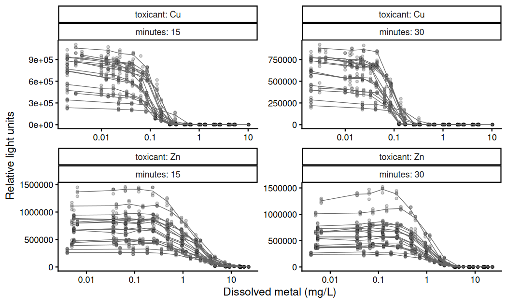
<p class="caption">plot of chunk fig-lum31-raw</p>
</div>

Luminescence stays near its control level over the lower part of each series and
then declines across about a tenfold range of concentration. It is below half the
control by 0.084 mg/L of copper at 15 minutes and 0.064 at 30 minutes, and by 1.9
and 0.93 mg/L of zinc. Zinc is therefore the weaker of the two by roughly an
order of magnitude, and both are more potent at the longer exposure. At the top
concentrations of every arm the readings reach a floor.

Two further features are taken up below. The plates of one arm are separated
vertically by a factor of four to five at the control. And at low zinc
concentrations luminescence rises above the control level before declining.

`well` identifies an individual well, which is read at both exposure times.
Concentrations are measured dissolved metal rather than nominal, and each batch
was dosed separately, so the concentration values differ between batches and the
plates are not on a common grid.

## Normalising to a control

The analysis published with these data divides each plate twice before fitting.
@luter2025 state it in the methods --- the median of the four control wells is
used to model the inverse proportion of light lost relative to the control, and
that quantity is then divided by the maximum luminescence --- and
`bayesNEC_30m_final.R` in the accompanying repository does it:

```r
Rep1B_y30_qtox  = (1 - (median(CuDat1[1:4, 4]) - Rep1B_y30) / median(CuDat1[1:4, 4]))
Rep1B_y30_qtoxB = Rep1B_y30_qtox / max(Rep1B_y30_qtox)
```

The first line simplifies to the reading divided by the median of the plate's
four control wells. The second divides by the plate maximum, which forces
exactly one observation to 1.000.

Dividing by a control mean is standard practice in ecotoxicology, and on this
assay the first division has a clear physical motivation. The plate reader
applies auto-scale gain adjustment, set per read, so absolute luminescence is a
property of the read rather than of the assay. Median control-well luminescence
differs several-fold between plates of the same batch:


``` r
lum31 |>
  filter(toxicant == "Zn", minutes == 15) |>
  group_by(batch, plate) |>
  filter(conc == min(conc)) |>
  summarise(control_rlu = median(rlu_cens), .groups = "drop_last") |>
  summarise(plates = n(), lowest = min(control_rlu), highest = max(control_rlu),
            ratio = round(max(control_rlu) / min(control_rlu), 1), .groups = "drop")
#> # A tibble: 5 × 5
#>   batch   plates  lowest  highest ratio
#>   <fct>    <int>   <dbl>    <dbl> <dbl>
#> 1 19Mar24      4 396861  1110610.   2.8
#> 2 28Mar24      3 780502  1366046.   1.8
#> 3 5Apr24       3 667941   924912    1.4
#> 4 23Apr24      5 458610.  918672.   2  
#> 5 1Oct24       2 260432.  322856    1.2
```

Gain is a per-plate multiplicative constant, so dividing by a per-plate quantity
does remove it. The difficulty is what the divisor is.

@Ritz2026 show that dividing a response by an *estimated* control mean induces
correlation between every observation sharing the denominator, and that ignoring
it biases effect doses downwards and gives intervals that are too narrow. In
their simulation, fitting the normalised response as though the observations
were independent gave ED10 bias of 2.6 to 6.8 per cent and coverage of 0.88 to
0.91 against a nominal 0.95, while modelling the raw rates gave 0.7 to 2.1 per
cent and 0.94 to 0.96. They state that weights do not remedy it, and that
per-curve normalisation on few control measurements is the worst configuration.
This assay normalises each plate by four control wells.

Their recommended approach is to model the raw response and derive inhibition
from the fitted control, treating the control level as a parameter. In
`bayesnec` that parameter is `top`, and `ecx()` is measured from the modelled
control, so a `bnec()` fit on raw luminescence is that approach.

The published estimates are what the fits in this case study are read against.
@luter2025 fitted
each plate separately on the normalised response. For copper they report EC50s
averaging 0.109 mg/L at 15 minutes, with a standard deviation of 0.036 and a
range of 0.069 to 0.201 over sixteen plates, and 0.085 at 30 minutes. For zinc,
1.546 at 15 minutes (0.284, 1.207 to 2.076 over seventeen plates) and 1.013 at
30 minutes. The spread across plates is what a per-plate analysis leaves as
variation between tests, and what a plate term estimates instead.

### A group-level term as the division

A group-level term on the control parameter targets the same per-plate constant
the division removes, and propagates its uncertainty instead of conditioning on
a point estimate. Generating the `brms` formula shows the form directly:


``` r
gfam <- Gamma(link = "identity")
make_brmsformula(
  bayesnecformula(rlu_cens | cens(censoring) ~ crf(log(conc), "nec3param") + (top | plate)),
  data = subset(lum31, toxicant == "Zn" & minutes == 15), family = gfam
)
#> $nec3param
#> rlu_cens | cens(censoring) ~ bnectop * exp(-exp(beta) * (log(conc) - nec) * step(log(conc) - nec)) 
#> top ~ 1
#> beta ~ 1
#> nec ~ 1
#> topgl ~ 0 + (1 | plate)
#> bnectop ~ top * exp(topgl)
```

`bnectop ~ top * exp(topgl)` with `topgl ~ 0 + (1 | plate)` is a per-plate
multiplicative factor on the curve, which is the form gain takes. `ogl()` gives
the same multiplicative structure applied to the whole fitted value rather than
to `top` alone:


``` r
make_brmsformula(
  bayesnecformula(rlu_cens | cens(censoring) ~ crf(log(conc), "nec3param") + ogl(plate)),
  data = subset(lum31, toxicant == "Zn" & minutes == 15), family = gfam
)
#> $nec3param
#> rlu_cens | cens(censoring) ~ bnecmu * exp(ogl) 
#> bnecmu ~ top * exp(-exp(beta) * (log(conc) - nec) * step(log(conc) - nec))
#> top ~ 1
#> beta ~ 1
#> nec ~ 1
#> ogl ~ 1 + (1 | plate)
```

The distinction matters once the equation has a lower asymptote. Gain multiplies
the whole curve, `bot` included, so `ogl()` is the match; `(top | plate)` scales
`top` and leaves `bot` common between plates. For a three-parameter equation
whose curve is `top` times a function of the predictor the two coincide.

### A global divisor

A divisor that is one constant for the whole dataset is only a change of units.
It uses no estimate and induces no correlation, so it is not what @Ritz2026
object to. This assay nonetheless does not use one, and the reason is a
property of the instrument rather than a preference.

The benefit of normalisation is not the divisor itself. It is that every curve's
control lands near the top of a bounded scale, where a `Beta` variance
`mu * (1 - mu) / (1 + phi)` is small, so the upper asymptote is well determined
and any effect concentration measured from it is stable. That requires the
curves to share a scale, and under per-read gain they do not:


``` r
lum31 |>
  filter(toxicant == "Zn", minutes == 15) |>
  group_by(plate) |>
  filter(conc == min(conc)) |>
  summarise(control_share = median(rlu_cens) / max(lum31$rlu), .groups = "drop") |>
  summarise(plates = n(), lowest = round(min(control_share), 3),
            highest = round(max(control_share), 3),
            middle_of_scale = sum(control_share < 0.61))
#> # A tibble: 1 × 4
#>   plates lowest highest middle_of_scale
#>    <int>  <dbl>   <dbl>           <int>
#> 1     17  0.171   0.898              15
```

Dividing by the largest reading in the dataset leaves most plates in the middle
of the interval, where a `Beta` variance is at its largest, so the stability a
normalised analysis relies on is not obtained. No universal ceiling in luminance
exists for the same reason: the supplementary material of @luter2025 measures 44
technical replicates of undosed cells, but at one gain, so it bounds that read
only.

### Limits of the plate term

Gain and genuine plate-to-plate biological variation are confounded in the
estimated per-plate factor, and nothing in these data separates them. This does
not affect the N(S)EC or an ECx, for which both are nuisance plate effects, but
the plate-level standard deviation is not a biological quantity and should not
be reported as one.

A related caution from @Ritz2026 applies to the scope of an `ogl(plate)` term. Normalising,
or sharing a plate term, is legitimate only within curves of the same treatment.
Plates within one toxicant-by-exposure-time arm qualify. A plate term is not
placed across the copper-versus-zinc or 15-versus-30-minute contrasts; those are
handled by `bnec_group()` below.

The argument for modelling the predictor on a transformed scale is made in
`vignette("example3")` and is not repeated here.

## Preparing the response

Two properties of the recorded response have to be settled before any fit, and
both follow from how the instrument works.

### Floored readings

Readings were blank-corrected against wells of artificial seawater, so a well
emitting less light than the blank gives a negative value. The source records
replaced such a value by zero. `rlu` reports every reading as it stands,
including one that escaped the replacement:


``` r
lum31 |>
  group_by(toxicant, minutes) |>
  summarise(rows = n(), zero = sum(rlu == 0), negative = sum(rlu < 0),
            per_cent = round(100 * mean(rlu <= 0), 1), .groups = "drop")
#> # A tibble: 4 × 6
#>   toxicant minutes  rows  zero negative per_cent
#>   <fct>      <int> <int> <int>    <int>    <dbl>
#> 1 Cu            15   704   106        0     15.1
#> 2 Cu            30   704   197        0     28  
#> 3 Zn            15   748     6        1      0.9
#> 4 Zn            30   748    77        0     10.3
```

That surviving negative is the evidence for how the zeros arise. Luminescence
cannot be negative, so a zero here is a blank-corrected negative rather than an
absence of light, and the process generating it is measurement noise about a
small positive value. These readings are therefore left-censored. A hurdle would
assert a distinct zero-generating process, which is not what happened.

A `Gamma` likelihood requires a strictly positive response and `brms` refuses
the fit at data validation otherwise, so the censoring bound cannot be zero.
`rlu_cens` and `censoring` supply the censored form, with the bound set to the
smallest positive reading on the plate --- a plate property, because gain is set
per plate, and pooled over the two exposure times because the two reads of one
plate share a gain setting.


``` r
lum31 |>
  filter(toxicant == "Zn", minutes == 15) |>
  count(censoring)
#>   censoring   n
#> 1      left   7
#> 2      none 741
```

The estimates are more sensitive to this bound where more readings reach the
floor, which is 0.9 per cent for zinc at 15 minutes and 28 per cent for copper
at 30. No detection limit is recorded for the instrument, so the bound is an
inference from the readings rather than a stated resolution.

### Non-constant dispersion

A `Gamma` with an identity link has a constant coefficient of variation, and
these data do not. Within-cell variation, pooled over the seventeen plates at
each concentration, rises steadily as the response falls:


``` r
zn15 <- droplevels(subset(lum31, toxicant == "Zn" & minutes == 15))
zn15 |>
  mutate(rank = as.integer(sub(".*-c", "", as.character(conc_group)))) |>
  group_by(rank, plate) |>
  summarise(mean_rlu = mean(rlu_cens), cv = sd(rlu_cens) / mean(rlu_cens),
            .groups = "drop_last") |>
  group_by(rank) |>
  summarise(mean_rlu = signif(mean(mean_rlu), 3), cv = round(median(cv), 3),
            .groups = "drop")
#> # A tibble: 11 × 3
#>     rank mean_rlu    cv
#>    <int>    <dbl> <dbl>
#>  1     1   704000 0.051
#>  2     2   713000 0.055
#>  3     3   714000 0.056
#>  4     4   717000 0.042
#>  5     5   718000 0.028
#>  6     6   601000 0.058
#>  7     7   459000 0.057
#>  8     8   305000 0.082
#>  9     9    92700 0.117
#> 10    10    17600 0.201
#> 11    11     3560 0.361
```

One shape parameter cannot serve a series whose own coefficient of variation
runs from about 0.05 at the control to about 0.36 at the bottom, and the
compromise it reaches is dominated by the noisy low end. The consequence falls
on the control, where the fitted variance is then far larger than the data show.
That matters for two reasons: `nsec()` is defined against the control's lower
quantile, and the relative fit of the candidate equations --- and so the model
weights --- depends on how the variance is apportioned along the series.

`disp()` models the dispersion parameter rather than holding it constant.
`disp("power")` writes `log(shape)` as a linear function of `log(mu)`, a
variance function of the fitted mean, which is a statement about the measurement
process rather than about the dose axis:


``` r
make_brmsformula(
  bayesnecformula(rlu_cens | cens(censoring) ~ crf(log(conc), "nec3param") +
                    ogl(plate) + disp("power")),
  data = zn15, family = gfam
)
#> $nec3param
#> rlu_cens | cens(censoring) ~ bnecmu * exp(ogl) 
#> bnecmu ~ top * exp(-exp(beta) * (log(conc) - nec) * step(log(conc) - nec))
#> top ~ 1
#> beta ~ 1
#> nec ~ 1
#> ogl ~ 1 + (1 | plate)
#> shape ~ c0 + c1 * (log((bnecmu * exp(ogl))) - 12.9867)
#> c0 ~ 1
#> c1 ~ 1
```

The alternative form, `disp(~log(conc))`, is an ordinary distributional formula
and describes noise as a function of the dose axis instead. Both are used below,
and `vignette("example1")` covers the dispersion machinery in general.

The coefficient-of-variation table is a summary of the recorded response rather
than of a fit, so it diagnoses the problem without confirming the remedy. The posterior check that
does confirm it belongs with the other diagnostics, and #367 adds it to
`vignette("example9")`.

## Within-concentration grouping

The commonest structure in ecotoxicology is replication within a concentration:
several vessels, chambers or wells at each exposure level, each sitting at one
point on the dose axis. Such a level spans no part of the curve, so only a
displacement is estimable and `ogl()` is the term.

In `lum31` that unit is `conc_group`, the four wells at one concentration on one
plate. A single plate is fitted here, because a plate is the only portion of
these data free of the gain differences between plates, and fitting a whole arm
would let a concentration-group term absorb plate structure as well. That plate
holds 44 readings over 11 concentration groups.


``` r
one_plate <- droplevels(subset(lum31, plate == "Zn 23Apr24 Rep6B" & minutes == 15))
nrow(one_plate)
#> [1] 44
n_distinct(one_plate$conc_group)
#> [1] 11
```

The fits below use `model = "all"`, which `bnec()` filters to the equations
valid for the family and predictor. The whole set is kept rather than `decline`
because the zinc response rises above its control at low concentrations, and
`decline` holds only the equations whose curves fall from the control. Taking
the mean of each plate's four wells at each concentration, relative to that
plate's own control:


``` r
zn15 |>
  mutate(rank = as.integer(sub(".*-c", "", as.character(conc_group)))) |>
  group_by(plate, rank) |>
  summarise(m = mean(rlu_cens), .groups = "drop_last") |>
  mutate(rel = m / m[rank == 1]) |>
  group_by(rank) |>
  summarise(plates_above_control = sum(rel > 1), median_rel = round(median(rel), 3),
            .groups = "drop") |>
  head(6)
#> # A tibble: 6 × 3
#>    rank plates_above_control median_rel
#>   <int>                <int>      <dbl>
#> 1     1                    0      1    
#> 2     2                   13      1.02 
#> 3     3                   13      1.01 
#> 4     4                   12      1.03 
#> 5     5                   12      1.01 
#> 6     6                    0      0.864
```

Excluding the hormesis equations would be a decision about the curve made
against that, so they are kept and the weights are left to settle it.

No fit in this vignette names `iter`, `warmup` or `control`, so every one of
them samples at `bnec()`'s defaults. A diagnostic reported here is therefore a
diagnostic of what a reader gets by writing the same call.


``` r
fit_plain <- bnec(rlu_cens | cens(censoring) ~ crf(log(conc), "all") + disp("power"),
                  data = one_plate, family = gfam,
                  seed = 228, refresh = 0)

fit_ogl <- bnec(rlu_cens | cens(censoring) ~ crf(log(conc), "all") + ogl(conc_group) + disp("power"),
                data = one_plate, family = gfam,
                seed = 228, refresh = 0)
```

Whether either fit may be reported is a separate question from whether it ran.
`check_sampling()` asks it for every equation of a set at once, against the
largest R-hat, the smallest effective sample size and the number of divergent
transitions:


``` r
check_sampling(fit_ogl)
#> Loading required namespace: rstan
#>          model max_rhat     min_ess min_ess_ratio n_divergent failed
#> 1    nec3param 1.001923 1355.457369  0.1694321711           0  FALSE
#> 2    nec4param 2.107572    5.208820  0.0006511025         136   TRUE
#> 3     nechorme 1.733517    6.082601  0.0007603251          13   TRUE
#> 4    nechorme4 1.529753    7.120474  0.0008900592          13   TRUE
#> 5       ecxexp 1.008704 1140.998288  0.1426247861         159   TRUE
#> 6    ecx4param 1.001570 1821.441692  0.2276802116           0  FALSE
#> 7       ecxwb1 1.002608 1491.067927  0.1863834909           0  FALSE
#> 8       ecxwb2 1.532098    7.112430  0.0008890538          39   TRUE
#> 9     ecxwb1p3 1.007373  922.702088  0.1153377610           0  FALSE
#> 10    ecxwb2p3 1.530992    7.114904  0.0008893630          10   TRUE
#> 11      ecxll5 1.563882    6.876918  0.0008596147         718   TRUE
#> 12      ecxll4 1.735840    6.105236  0.0007631545          26   TRUE
#> 13      ecxll3 1.001396 1869.073784  0.2336342230           0  FALSE
#> 14 ecxhormebc4 1.002787 1957.873132  0.2447341415           0  FALSE
```

`vignette("example9")` gives the cutoffs and the reasoning behind them,
including that Stan's own guidance is that any divergent transition means the
sampler failed to explore the posterior, and that the default of ten is a
package convention rather than a published recommendation.

`screen_models()` applies the same test and drops what fails, leaving a model
average over the equations that sampled. Both fits are screened before anything
is read from them, and everything below refers to the screened objects:


``` r
fit_plain <- screen_models(fit_plain)
#> Dropping 5 of 14 candidate models that failed the sampler screen:
#>   -  nec3param: Rhat 1.53, ESS 7.2
#>   -  nechorme: Rhat 1.532, ESS 7.2, 67 divergent transitions
#>   -  nechorme4: 34 divergent transitions
#>   -  ecxll5: Rhat 1.015, ESS 127, 166 divergent transitions
#>   -  ecxhormebc4: 54 divergent transitions
#> Fitted models are: nec4param ecxexp ecx4param ecxwb1 ecxwb2 ecxwb1p3 ecxwb2p3 ecxll4 ecxll3
fit_ogl <- screen_models(fit_ogl)
#> Dropping 8 of 14 candidate models that failed the sampler screen:
#>   -  nec4param: Rhat 2.108, ESS 5.2, 136 divergent transitions
#>   -  nechorme: Rhat 1.734, ESS 6.1, 13 divergent transitions
#>   -  nechorme4: Rhat 1.53, ESS 7.1, 13 divergent transitions
#>   -  ecxexp: 159 divergent transitions
#>   -  ecxwb2: Rhat 1.532, ESS 7.1, 39 divergent transitions
#>   -  ecxwb2p3: Rhat 1.531, ESS 7.1
#>   -  ecxll5: Rhat 1.564, ESS 6.9, 718 divergent transitions
#>   -  ecxll4: Rhat 1.736, ESS 6.1, 26 divergent transitions
#> Fitted models are: nec3param ecx4param ecxwb1 ecxwb1p3 ecxll3 ecxhormebc4
```

`ogl(conc_group)` estimates one deviation per concentration group, so its
standard deviation summarises how much the four wells at a concentration depart
from the fitted curve beyond what the family allows.


``` r
s_ogl <- summary(fit_ogl)
s_ogl
#> Object of class bayesmanecfit
#> 
#>  Family: gamma  
#>   Links: mu = identity; shape = log  
#> 
#> Number of posterior draws per model:  8000
#> 
#> Model weights (Method: pseudobma_bb_weights):
#>               waic   wi
#> nec3param   980.84 0.19
#> ecx4param   982.32 0.11
#> ecxwb1      981.19 0.24
#> ecxwb1p3    987.65 0.03
#> ecxll3      980.63 0.22
#> ecxhormebc4 980.66 0.21
#> 
#> 
#> Summary of weighted N(S)EC posterior estimates:
#> NB: Model set contains a combination of ECx and NEC
#>     models, and is therefore a model averaged
#>     combination of NEC and NSEC estimates.
#>        Estimate  Q2.5 Q97.5
#> N(S)EC     0.01 -1.81  0.57
#> 
#> 
#> Bayesian R2 estimates:
#>             Estimate Est.Error Q2.5 Q97.5
#> nec3param       0.98      0.00 0.97  0.99
#> ecx4param       0.98      0.00 0.97  0.99
#> ecxwb1          0.98      0.00 0.97  0.99
#> ecxwb1p3        0.98      0.00 0.98  0.99
#> ecxll3          0.98      0.00 0.97  0.99
#> ecxhormebc4     0.98      0.00 0.97  0.99
```

That summary reports the model weights, the model-averaged N(S)EC and a Bayesian
R-squared for each equation. It does not report the group-level standard
deviation, which is estimated separately by every equation of the set, so it is
read from one of them. Taking the equation with the most weight:


``` r
best <- rownames(s_ogl$mod_weights)[which.max(s_ogl$mod_weights[, "wi"])]
best
#> [1] "ecxwb1"
brms::VarCorr(pull_out(fit_ogl, model = best)$fit)$conc_group$sd
#>                 Estimate Est.Error       Q2.5     Q97.5
#> ogl_Intercept 0.08792598 0.0374769 0.03082911 0.1801875
```

That standard deviation is 0.088 (0.031--0.180), on the scale the deviation is
applied on rather than on the response scale. It is a property of that equation
as well as of the data: an equation
whose curve fits the concentration means poorly attributes more of the
difference to the group term, so a standard deviation read from a poorly
weighted equation is not comparable with this one.

The N(S)EC in the summary above is on the scale `fit_ogl` was fitted on,
`log(conc)`, which is why its lower bound can be negative. `ecx()` takes
`xform = exp` and reports concentrations in mg/L, so the two are not in
disagreement:


``` r
rbind(
  data.frame(fit = "ungrouped", t(ecx(fit_plain, ecx_val = 10, xform = exp))),
  data.frame(fit = "ogl(conc_group)", t(ecx(fit_ogl, ecx_val = 10, xform = exp)))
)
#>               fit       Q50      Q2.5     Q97.5
#> 1       ungrouped 0.2701030 0.2039545 0.3617184
#> 2 ogl(conc_group) 0.8142811 0.1584256 1.8201453
```

The two fitted curves are drawn below, ungrouped first. The second marks the
mean of each concentration group with a diamond, which is the quantity
`ogl(conc_group)` gives a deviation to. `group_aes = "colour"` would map the
eleven groups to a colour scale as well; it is not used here because each group
sits at one concentration, so the colour would repeat what the position on the
axis already says.


``` r
autoplot(fit_plain) + log_x
```

<div class="figure" style="text-align: center">
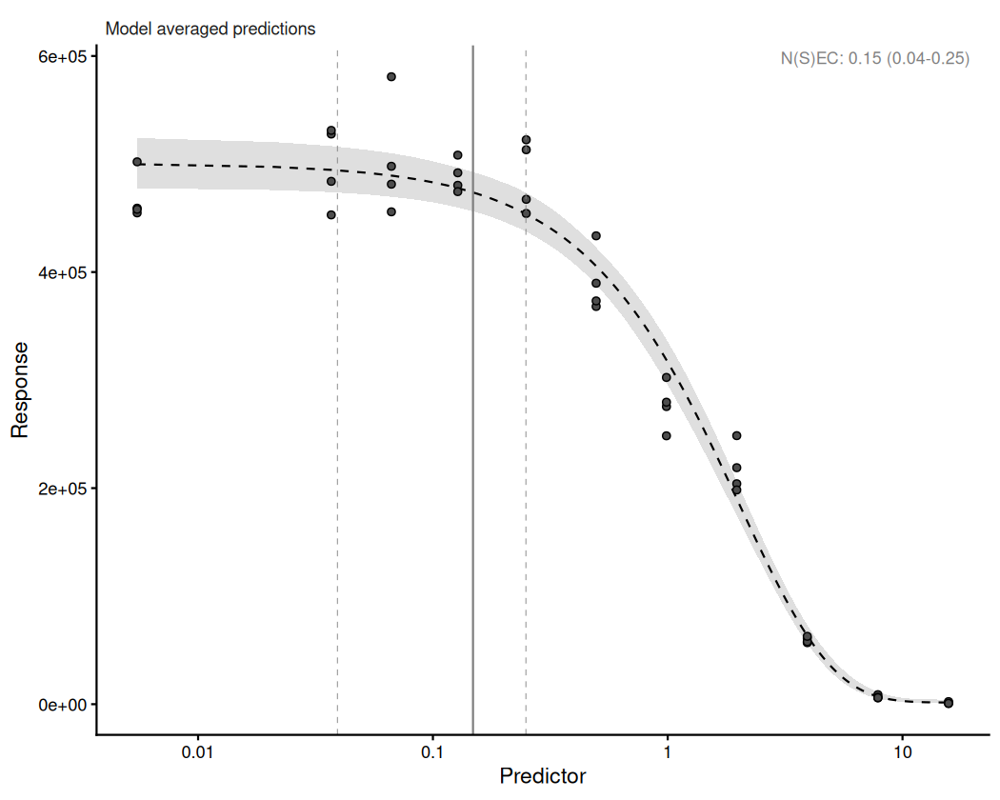
<p class="caption">plot of chunk fig-plain</p>
</div>


``` r
autoplot(fit_ogl, group = "conc_group") + log_x
```

<div class="figure" style="text-align: center">
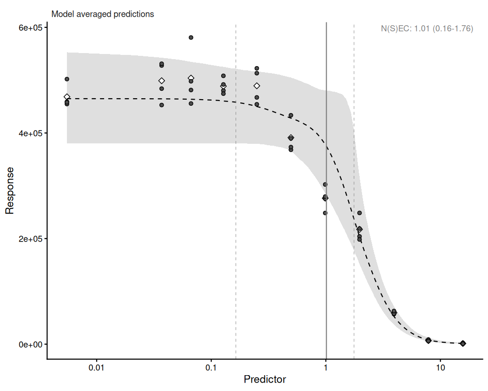
<p class="caption">plot of chunk fig-ogl</p>
</div>

`ogl(conc_group)` changes the fitted curve, not only its uncertainty. Ungrouped,
the model-averaged curve falls from the control immediately; with the term it
holds near the control before falling. EC10 changes with it, from 0.270 mg/L
(0.204--0.362) to 0.814 (0.158--1.820) --- three times the estimate, on an
interval that runs a factor of 11.5 from end to end against 1.8.

That follows from the weights rather than from any one equation. Adding
`ogl(conc_group)`, which absorbs within-concentration variation, changes which
curve shapes fit the concentration means best, so the average is taken over a
different mixture. The
four wells at a concentration are the only replication the design has, so an
analysis that treats them as independent has nothing left to estimate that
variation with, and reports the narrow band as though it were the evidence.

## Across-concentration grouping

A grouping whose levels each span the whole series admits a difference in shape,
and the plates of one arm are that case. Each plate is a complete test, and the
gain differences shown above mean the plates are not on a common vertical scale.


``` r
fit_pooled <- bnec(rlu_cens | cens(censoring) ~ crf(log(conc), "all") + disp("power"),
                   data = zn15, family = gfam,
                   seed = 228, refresh = 0)

fit_plate <- bnec(rlu_cens | cens(censoring) ~ crf(log(conc), "all") + ogl(plate) + disp("power"),
                  data = zn15, family = gfam,
                  seed = 228, refresh = 0)
```

Both are screened as above, so that the comparison is between two model averages
that sampled rather than between two that merely returned:


``` r
fit_pooled <- screen_models(fit_pooled)
#> Dropping 2 of 14 candidate models that failed the sampler screen:
#>   -  ecxll5: 11 divergent transitions
#>   -  ecxhormebc4: 44 divergent transitions
#> Fitted models are: nec3param nec4param nechorme nechorme4 ecxexp ecx4param ecxwb1 ecxwb2 ecxwb1p3 ecxwb2p3 ecxll4 ecxll3
fit_plate <- screen_models(fit_plate)
#> Dropping 7 of 14 candidate models that failed the sampler screen:
#>   -  nec3param: Rhat 1.529, ESS 7.2
#>   -  nec4param: Rhat 1.53, ESS 7.2
#>   -  nechorme: Rhat 1.75, ESS 6.1
#>   -  nechorme4: Rhat 1.53, ESS 7.1
#>   -  ecxwb2: Rhat 1.53, ESS 7.2
#>   -  ecxll5: Rhat 1.534, ESS 7.2, 148 divergent transitions
#>   -  ecxll4: Rhat 1.531, ESS 7.1
#> Fitted models are: ecxexp ecx4param ecxwb1 ecxwb1p3 ecxwb2p3 ecxll3 ecxhormebc4
```

The comparison of interest is between the estimates each gives, and between the
model weights each assigns, since pooling curves that differ in scale changes
which functional form fits best:


``` r
summary(fit_pooled)
#> Object of class bayesmanecfit
#> 
#>  Family: gamma  
#>   Links: mu = identity; shape = log  
#> 
#> Number of posterior draws per model:  8000
#> 
#> Model weights (Method: pseudobma_bb_weights):
#>               waic   wi
#> nec3param 19377.38 0.00
#> nec4param 19381.16 0.00
#> nechorme  19377.38 0.00
#> nechorme4 19381.17 0.00
#> ecxexp    20091.17 0.00
#> ecx4param 19314.85 0.04
#> ecxwb1    19301.93 0.76
#> ecxwb2    19345.83 0.00
#> ecxwb1p3  19378.00 0.00
#> ecxwb2p3  19341.98 0.00
#> ecxll4    19314.77 0.04
#> ecxll3    19311.92 0.17
#> 
#> 
#> Summary of weighted N(S)EC posterior estimates:
#> NB: Model set contains a combination of ECx and NEC
#>     models, and is therefore a model averaged
#>     combination of NEC and NSEC estimates.
#>        Estimate  Q2.5 Q97.5
#> N(S)EC    -1.80 -3.27 -0.56
#> 
#> 
#> Bayesian R2 estimates:
#>           Estimate Est.Error Q2.5 Q97.5
#> nec3param     0.60      0.01 0.57  0.62
#> nec4param     0.59      0.01 0.57  0.62
#> nechorme      0.60      0.01 0.57  0.62
#> nechorme4     0.59      0.01 0.57  0.62
#> ecxexp        0.20      0.03 0.13  0.26
#> ecx4param     0.62      0.01 0.60  0.65
#> ecxwb1        0.63      0.01 0.61  0.65
#> ecxwb2        0.61      0.01 0.59  0.64
#> ecxwb1p3      0.64      0.01 0.62  0.66
#> ecxwb2p3      0.61      0.01 0.59  0.64
#> ecxll4        0.62      0.01 0.60  0.65
#> ecxll3        0.63      0.01 0.60  0.65
summary(fit_plate)
#> Object of class bayesmanecfit
#> 
#>  Family: gamma  
#>   Links: mu = identity; shape = log  
#> 
#> Number of posterior draws per model:  8000
#> 
#> Model weights (Method: pseudobma_bb_weights):
#>                 waic   wi
#> ecxexp      19884.99 0.00
#> ecx4param   17676.50 0.00
#> ecxwb1      17572.48 1.00
#> ecxwb1p3    17989.70 0.00
#> ecxwb2p3    17845.82 0.00
#> ecxll3      17677.02 0.00
#> ecxhormebc4 17677.52 0.00
#> 
#> 
#> Summary of weighted NSEC posterior estimates:
#>      Estimate  Q2.5 Q97.5
#> NSEC    -0.36 -1.94  0.15
#> 
#> 
#> Bayesian R2 estimates:
#>             Estimate Est.Error Q2.5 Q97.5
#> ecxexp          0.53      0.03 0.46  0.59
#> ecx4param       0.98      0.00 0.98  0.98
#> ecxwb1          0.98      0.00 0.98  0.99
#> ecxwb1p3        0.98      0.00 0.98  0.98
#> ecxwb2p3        0.98      0.00 0.98  0.98
#> ecxll3          0.98      0.00 0.98  0.99
#> ecxhormebc4     0.98      0.00 0.98  0.99
```


``` r
rbind(
  data.frame(fit = "pooled", t(ecx(fit_pooled, ecx_val = 10, xform = exp))),
  data.frame(fit = "ogl(plate)", t(ecx(fit_plate, ecx_val = 10, xform = exp)))
)
#>          fit      Q50      Q2.5     Q97.5
#> 1     pooled 0.280055 0.2074506 0.7368929
#> 2 ogl(plate) 0.325643 0.3018052 0.3509309
```

Both fits draw one population curve through the same observations. What differs
is where the spread between plates goes: into the residual for `fit_pooled`, and
into the group-level term for `fit_plate`.


``` r
autoplot(fit_pooled) + log_x
```

<div class="figure" style="text-align: center">
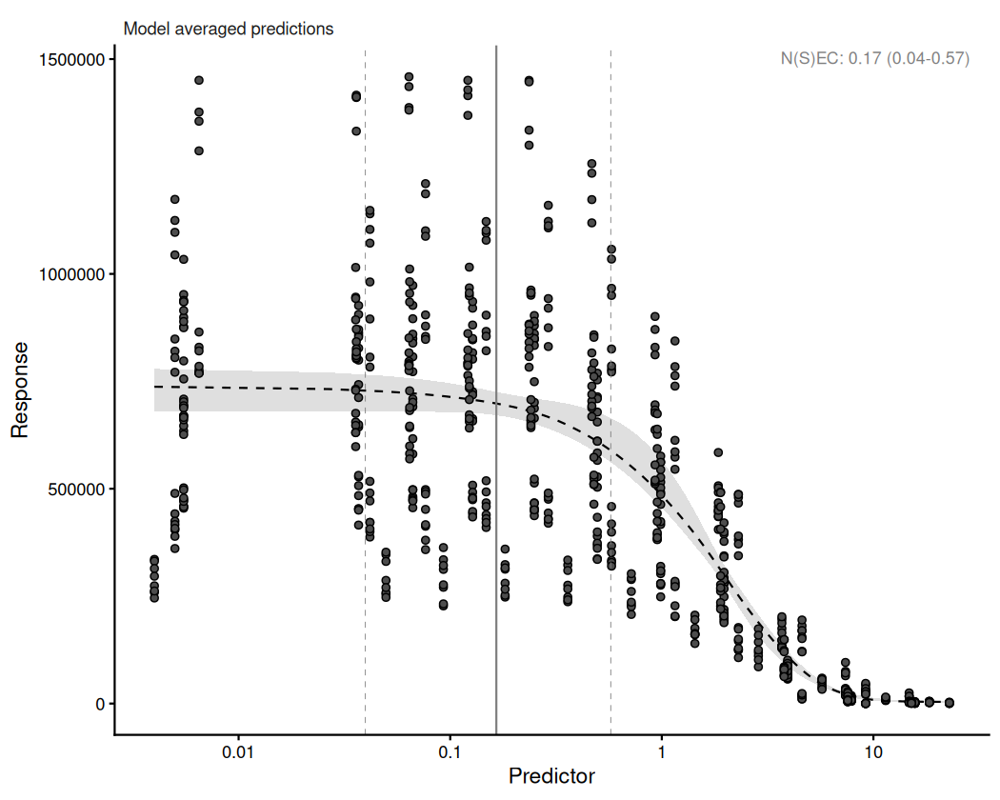
<p class="caption">plot of chunk fig-pooled</p>
</div>


``` r
autoplot(fit_plate, group = "plate") + log_x
```

<div class="figure" style="text-align: center">
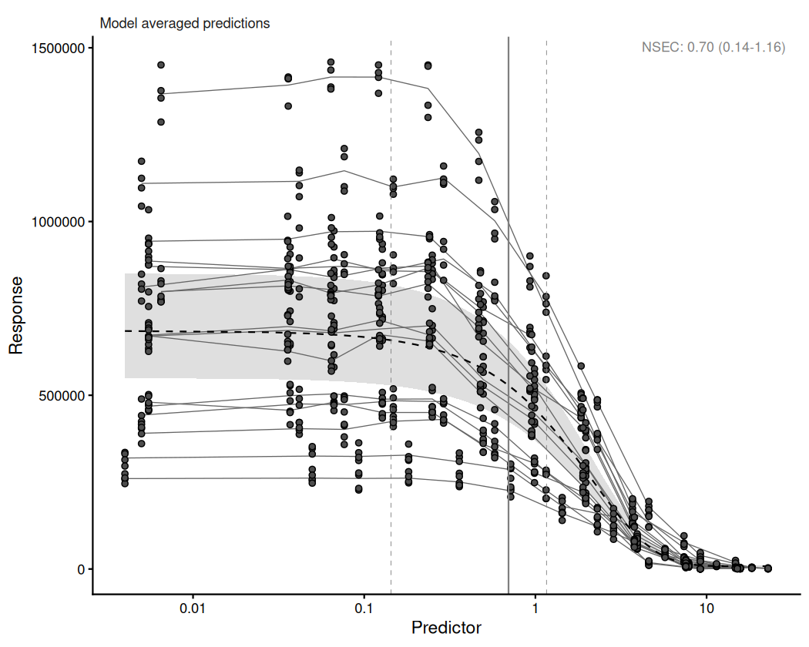
<p class="caption">plot of chunk fig-plate</p>
</div>

`group = "plate"` joins each plate's observations in the second figure, which is
what makes the structure legible: seventeen roughly parallel traces, flat over
the lower half of the series and falling together. The spread between them at
any one concentration is larger than the fall between one concentration and the
next over that flat part, and the traces stay in much the same order throughout,
which is what a per-plate multiplicative constant looks like. Control wells run
from about 250,000 to 1,450,000 relative light units across the seventeen
plates, against the 250,000 floor the assay was designed to clear.

The pooled fit has nowhere to put that except the residual, so its curve falls
from the control on a narrow band; with `ogl(plate)` the spread is attributed to
the plates and the population curve holds nearer the control before falling.

EC10 is 0.280 mg/L pooled against 0.326 with the plate term, a difference of
about a sixth, and its interval closes from 0.207--0.737 to 0.302--0.351 ---
from a factor of 3.6 between the bounds to a factor of 1.2. The N(S)EC changes
by more: 0.165 mg/L (0.038--0.571) pooled against 0.698 (0.144--1.162). A reader
who took the pooled fit at face value would report a no-effect concentration a
quarter of the one the plate term gives, with an EC10 interval three times wider
than the data support.

The weights account for it. With the plate term `ecxwb1` takes all of the
weight; pooled it takes 0.76, with 0.17 on `ecxll3` and 0.04 each on
`ecx4param` and `ecxll4`. Pooling curves that differ in scale leaves the
candidate set less certain of which shape it is looking at, and the threshold
estimate is what that uncertainty lands on. `nec3param`, `nec4param`,
`nechorme` and `nechorme4` --- every equation that estimates a threshold ---
take no weight in either fit. A term on the fitted value rescales
each plate's curve by a constant and leaves the shape of the transition alone,
so it does not make a threshold easier to place, and pooling curves of different
scale smears the transition rather than sharpening it.

The direction here is the opposite of the within-concentration result, and both
follow from what the grouping has to explain. A concentration group sits at one
concentration, so `ogl(conc_group)` adds a variance component that the mean
function cannot absorb, and the intervals widen. A plate spans the whole series,
so `ogl(plate)` removes a between-plate difference that was otherwise left in
the residual, and the curve is better determined.

A `bnec_group()` fit holds one model-averaged fit per level, and `plot()` on it
draws each in turn through base graphics. `ggbnec_data()` returns the same
model-averaged curve as a data frame, so stacking those frames gives one object
that a single `ggplot()` call can facet. Both figures below use it.


``` r
group_curves <- function(x) {
  do.call(rbind, Map(function(f, lev) data.frame(level = lev, ggbnec_data(f)),
                     x$fits, x$levels))
}
```


## Copper against zinc

Copper and zinc are two contaminants of interest, not a sample from a
population of metals, so they are levels rather than a grouping. Each is fitted
with the structure the sections above arrived at: the censored response, a plate
term for the gain, and a dispersion sub-model. `bnec_group()` fits each level
separately and returns one object. The call keeps `model = "all"` for the reason
given under *Within-concentration grouping*, that luminescence rises above the
control level at low zinc concentrations.


``` r
zn_cu_15 <- droplevels(subset(lum31, minutes == 15))

fits_tox <- bnec_group(
  rlu_cens | cens(censoring) ~ crf(log(conc), "all") + ogl(plate) + disp("power"),
  data = zn_cu_15, group_var = "toxicant", family = gfam,
  seed = 228, refresh = 0)
```


``` r
summary(fits_tox)
#> $Cu
#> Object of class bayesmanecfit
#> 
#>  Family: gamma  
#>   Links: mu = identity; shape = log  
#> 
#> Number of posterior draws per model:  8000
#> 
#> Model weights (Method: pseudobma_bb_weights):
#>                 waic   wi
#> nec3param   14270.05 0.00
#> nec4param   14003.98 0.00
#> nechorme    14269.86 0.00
#> nechorme4   14670.57 0.00
#> ecxexp      15049.23 0.00
#> ecx4param   13925.43 0.34
#> ecxwb1      13953.02 0.06
#> ecxwb2      13960.35 0.00
#> ecxwb1p3    14917.03 0.00
#> ecxwb2p3    14287.94 0.00
#> ecxll5      13926.95 0.29
#> ecxll4      13925.55 0.31
#> ecxll3      14323.43 0.00
#> ecxhormebc4 14323.20 0.00
#> 
#> 
#> Summary of weighted N(S)EC posterior estimates:
#> NB: Model set contains a combination of ECx and NEC
#>     models, and is therefore a model averaged
#>     combination of NEC and NSEC estimates.
#>        Estimate  Q2.5 Q97.5
#> N(S)EC    -2.59 -3.14 -2.40
#> 
#> 
#> Bayesian R2 estimates:
#>             Estimate Est.Error Q2.5 Q97.5
#> nec3param       0.96      0.00 0.95  0.96
#> nec4param       0.96      0.00 0.96  0.97
#> nechorme        0.96      0.00 0.95  0.96
#> nechorme4       0.75      0.38 0.08  0.97
#> ecxexp          0.55      0.03 0.49  0.60
#> ecx4param       0.97      0.00 0.97  0.97
#> ecxwb1          0.97      0.00 0.97  0.98
#> ecxwb2          0.97      0.00 0.97  0.97
#> ecxwb1p3        0.82      0.01 0.80  0.84
#> ecxwb2p3        0.96      0.00 0.95  0.97
#> ecxll5          0.97      0.00 0.97  0.98
#> ecxll4          0.97      0.00 0.97  0.97
#> ecxll3          0.96      0.00 0.95  0.97
#> ecxhormebc4     0.96      0.00 0.95  0.97
#> 
#> $Zn
#> Object of class bayesmanecfit
#> 
#>  Family: gamma  
#>   Links: mu = identity; shape = log  
#> 
#> Number of posterior draws per model:  8000
#> 
#> Model weights (Method: pseudobma_bb_weights):
#>                 waic   wi
#> nec3param   18187.58 0.00
#> nec4param   18191.58 0.00
#> nechorme    18237.85 0.00
#> nechorme4   18191.58 0.00
#> ecxexp      19884.99 0.00
#> ecx4param   17676.50 0.00
#> ecxwb1      17572.48 1.00
#> ecxwb2      18629.37 0.00
#> ecxwb1p3    17989.70 0.00
#> ecxwb2p3    17845.82 0.00
#> ecxll5      18688.73 0.00
#> ecxll4      18628.74 0.00
#> ecxll3      17677.02 0.00
#> ecxhormebc4 17677.52 0.00
#> 
#> 
#> Summary of weighted N(S)EC posterior estimates:
#> NB: Model set contains a combination of ECx and NEC
#>     models, and is therefore a model averaged
#>     combination of NEC and NSEC estimates.
#>        Estimate  Q2.5 Q97.5
#> N(S)EC    -0.36 -1.94  0.15
#> 
#> 
#> Bayesian R2 estimates:
#>             Estimate Est.Error Q2.5 Q97.5
#> nec3param       0.97      0.00 0.97  0.97
#> nec4param       0.97      0.00 0.97  0.97
#> nechorme        0.97      0.00 0.97  0.97
#> nechorme4       0.97      0.00 0.97  0.97
#> ecxexp          0.53      0.03 0.46  0.59
#> ecx4param       0.98      0.00 0.98  0.98
#> ecxwb1          0.98      0.00 0.98  0.99
#> ecxwb2          0.89      0.16 0.61  0.98
#> ecxwb1p3        0.98      0.00 0.98  0.98
#> ecxwb2p3        0.98      0.00 0.98  0.98
#> ecxll5          0.75      0.40 0.05  0.99
#> ecxll4          0.89      0.16 0.61  0.98
#> ecxll3          0.98      0.00 0.98  0.99
#> ecxhormebc4     0.98      0.00 0.98  0.99
```

Back-transformed, the threshold is 0.075 mg/L for copper (0.043--0.091) and
0.698 for zinc (0.144--1.162): copper is the more potent by roughly an order of
magnitude, which is the ordering @luter2025 report from the per-plate analysis
and at much the same separation.


``` r
ggplot(group_curves(fits_tox), aes(x = x_e)) +
  geom_polygon(aes(y = y_ci), fill = "grey75", alpha = 0.5) +
  geom_line(aes(y = y_e), linetype = 2) +
  geom_point(aes(x = x_r, y = y_r), shape = 21, fill = "grey30", alpha = 0.4) +
  geom_vline(aes(xintercept = nec_vals), colour = "grey50") +
  facet_wrap(~level, ncol = 1, scales = "free") +
  log_x +
  theme_classic() +
  labs(x = "Dissolved metal (mg/L)", y = "Relative light units")
```

<div class="figure" style="text-align: center">
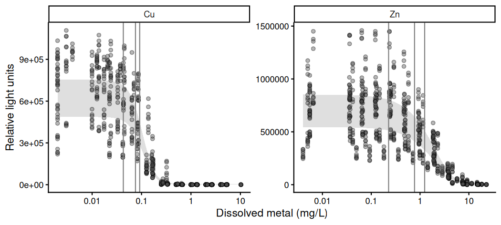
<p class="caption">plot of chunk fig-metals</p>
</div>

Each panel holds its own response axis, because the two arms were read at
different gains and their relative light units are not comparable between them.
What is comparable is where each falls, and the two panels put that an order of
magnitude apart: copper's threshold rules sit between 0.04 and 0.09 mg/L and
zinc's between 0.14 and 1.2. In both the observations scatter widely at every
concentration while the fitted band stays narrow, which is the plate term
holding the between-plate spread out of the population curve.


``` r
cmp_tox <- compare_posterior(fits_tox, comparison = "nec")
cmp_tox$prob_diff
#>   comparison    prob
#> 1      Cu-Zn 0.01525
```

`prob_diff` reduces each pair to one number. The posteriors it was computed
from are returned as well, in `posterior_data`, and drawing them separates a
difference in location from a difference in width:


``` r
tox_post <- cmp_tox$posterior_data
tox_post$value <- exp(tox_post$value)

ggplot(data = tox_post, mapping = aes(x = value)) +
  geom_density(mapping = aes(group = model, colour = model, fill = model),
               alpha = 0.3) +
  log_x +
  theme_classic() +
  labs(x = "Dissolved metal (mg/L)", y = "Density",
       fill = "Toxicant", colour = "Toxicant")
```

<div class="figure" style="text-align: center">
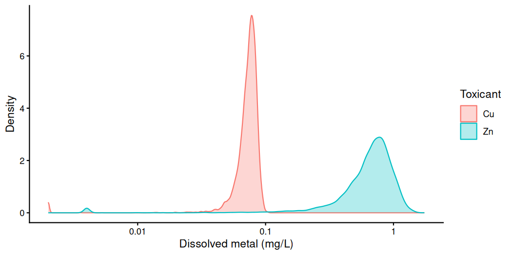
<p class="caption">plot of chunk fig-cmp-metals</p>
</div>


The two posteriors barely overlap, and they differ in more than their centres.
Copper's median is 0.075 mg/L over an interval of 0.043 to 0.091, a factor of
2.1 from end to end. Zinc's is 0.698 over 0.144 to 1.162, a factor of 8.1.
Copper is both the more potent metal and the better determined one on these
data, and the single pairwise comparison of 0.0153 is what that separation
reduces to.

# Case study 2: diuron and climate on a coral

## Design and model complexity

A concentration-response design has to be wide enough for the curve being asked
of it. Five concentrations is the conventional minimum, and at that minimum the
number of parameters in an equation matters: the design has enough information
to place a threshold or a midpoint but not enough to place both asymptotes as
well. Nothing refuses: every equation is offered, each returns an object, and the
divergent transitions are the only sign that the design was too narrow for it.

`coral_colour` and `coral_pam` are two endpoints of one exposure of *Acropora
millepora* to the herbicide diuron under three climate scenarios [@flores2021],
reported at <https://doi.org/10.1016/j.marpolbul.2021.112582>.

The scenarios are not years but combinations of temperature and dissolved carbon
dioxide, labelled by the year they represent: 28.1 °C at 397 ppm for present-day
conditions, and RCP8.5 projections of 29.1 °C at 680 ppm and 30.2 °C at 858 ppm.
Three replicate chambers were run at each combination of scenario and
concentration, with four coral fragments in each. The concentrations are
relevant to where the corals live: diuron has been measured in the Great Barrier
Reef lagoon at up to 0.778 µg/L.

The two endpoints are different measurements on the same fragments. `yield` is
the effective quantum yield of photosystem II in the symbiotic dinoflagellates,
read by pulse-amplitude modulated fluorometry. `proportion` is a colour index
standing in for bleaching: a photograph of about half a square centimetre of
live tissue, reduced to its mean grey pixel value and then rescaled between the
smallest and largest values observed. That rescaling has a consequence for the
family: one observation is bound to sit on 1, and one does.

Both are within-concentration designs, a chamber sitting at one concentration,
and they differ in the width of the design and in nothing else that matters
here.


``` r
data(coral_colour)
data(coral_pam)
rbind(
  colour = c(rows = nrow(coral_colour), concentrations = n_distinct(coral_colour$diuron),
             chambers = n_distinct(coral_colour$chamber)),
  pam    = c(rows = nrow(coral_pam), concentrations = n_distinct(coral_pam$diuron),
             chambers = n_distinct(coral_pam$chamber))
)
#>        rows concentrations chambers
#> colour  180              5       45
#> pam     414              6       54
```

The two differ in width rather than in kind: 180 colour readings over five
concentrations in 45 chambers, against 414 yield readings over six in 54. The
colour endpoint is the narrower design and the one this section turns on.

## The control on a log axis

Both endpoints include an untreated control recorded as an exact zero. A log
axis has no position for it, and `crf(log(diuron))` has no value for it either:
the column reaches the data check as `-Inf` and `bnec()` refuses the fit,
naming it. Some value has to be put in its place. That substitution is made
here, in the vignette, and not in the shipped data, so that `data-raw/coral_diuron.R`
continues to record what the experiment measured.

`coral_pam` was dosed at 0.29, 0.96, 2.9, 9.6 and 29 µg/L, each step about 3.16
times the last, which is half an order of magnitude. One further step below the lowest
treatment is 0.29/3.16 = 0.092 µg/L, and 0.1 is that value rounded. It puts the
control the same distance from 0.29 that 0.29 is from 0.96. Half the lowest
treatment, 0.145, would put it a third of that distance away, closer to the
lowest dose than any two doses are to each other. `coral_colour` was dosed at
the same concentrations but for 9.6, so its series has one step missing in the
middle and the substituted control sits a regular step below it.


``` r
nudge <- function(x) ifelse(x == 0, 0.1, x)
coral_colour$diuron_adj <- nudge(coral_colour$diuron)
coral_pam$diuron_adj <- nudge(coral_pam$diuron)
sort(unique(coral_pam$diuron_adj))
#> [1]  0.10  0.29  0.96  2.90  9.60 29.00
```

No other concentration is altered. Every estimate reported in this section is
therefore an estimate against a control placed at 0.1 µg/L, and a threshold
returned near that value would be describing the substitution rather than
diuron.

The substitution has a second consequence, and it is general rather than
particular to these data. Any concentration below 1 has a negative logarithm,
so `log(diuron_adj)` runs from -2.30 to 3.37. Three of the 18 equations that
`model = "all"` offers for this family cannot be fitted on a predictor that
reaches a negative value. `necsigm` and `ecxsigm` raise the predictor to a
fractional power, which is undefined there. `ecxhormebc5` cannot be reliably
initialised where an identity-linked `Beta` mean must stay positive, because
its hormesis term is negative wherever the predictor is. `bnec()` reports each
exclusion and fits the remaining 15. Every `lum31` fit in this vignette meets
the same condition, its concentrations being in mg/L and mostly below 1.


``` r
rbind(
  transform(coral_colour[c("climate", "diuron_adj")],
            endpoint = "colour (proportion)", y = coral_colour$proportion),
  transform(coral_pam[c("climate", "diuron_adj")],
            endpoint = "yield", y = coral_pam$yield)
) |>
  ggplot(aes(x = diuron_adj, y = y, colour = climate, shape = climate)) +
  geom_point(alpha = 0.7) +
  facet_wrap(~endpoint, scales = "free_y") +
  log_x +
  scale_colour_grey(start = 0.7, end = 0) +
  theme_classic() +
  theme(legend.position = "bottom") +
  labs(x = "Diuron (ug/L), control at 0.1", y = "Response")
```

<div class="figure" style="text-align: center">
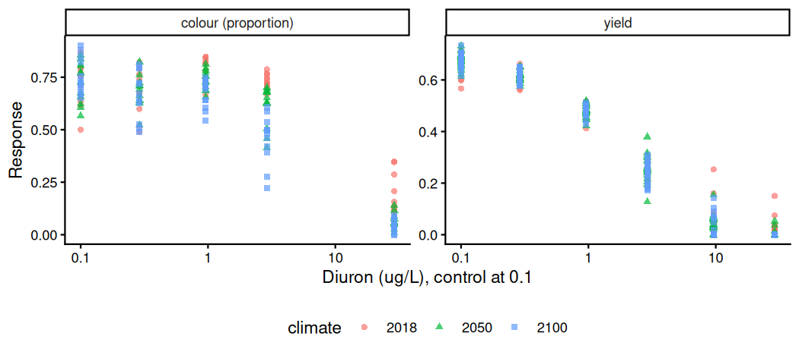
<p class="caption">plot of chunk fig-coral-raw</p>
</div>

Both responses decline with concentration. The yield panel has observations at every
one of its six concentrations. The colour panel has none between 2.9 and 29
µg/L, a full order of magnitude and the widest unsampled interval in either
endpoint.

The colour panel's top concentration is worth reading carefully, because it is
the only observation below the gap and so is the only thing that can place a
lower asymptote. At 29 µg/L the underlying photographs average 211 of 255 on
the grey scale at day 14, against 90 to 128 at every lower concentration. The
day-0 values run from 91 to 103 throughout, so those fragments started like the
others and ended white. @flores2021 record that all corals at 29 µg/L had died by day 10. The
point is real and the published fit uses it, but what it measures is a fragment
that has bleached completely rather than one on a declining curve.

The scenarios separate in the colour endpoint and barely at all in yield. Mean
colour at 2.9 µg/L runs 0.728, 0.611 and 0.456 from 2018 to 2100, and at 29
µg/L 0.173, 0.066 and 0.045. Mean yield differs by less than 0.015 between
scenarios at every concentration below 9.6.

@flores2021 reach the same conclusion from their own fits. Their colour index
EC50 falls from 6.05 µg/L under present-day conditions to 4.99 and 4.86, and
they put the probability that each later scenario lies below the first at 0.956
and 0.970. Their yield EC50 is 2.06, 2.02 and 2.03, and the matching
probabilities are 0.615 and 0.539, neither far from the 0.5 that would mean no
separation at all.

Climate is a fixed set of three levels of interest in themselves, so the route
for it is `bnec_group()`, the route the factor covariates take. The fits below
pool over it, which the yield result above licenses and the colour result does
not. That is a deliberate simplification: what these fits are used to show is
how the number of curve parameters behaves against a design of a given width,
and one curve per endpoint shows it most directly.

The yield endpoint has six concentrations and 54 chambers of five to eight
readings, and `ogl(chamber)` on it is well conditioned:


``` r
fit_pam <- bnec(yield ~ crf(log(diuron_adj), "all") + ogl(chamber),
                data = coral_pam, family = Beta(link = "identity"),
                seed = 228, refresh = 0)
```


``` r
fit_pam <- screen_models(fit_pam)
#> Dropping 4 of 15 candidate models that failed the sampler screen:
#>   -  nec3param: Rhat 1.014, ESS 177.2
#>   -  nechorme4: 29 divergent transitions
#>   -  ecxexp: 25 divergent transitions
#>   -  ecxll5: 84 divergent transitions
#> Fitted models are: nec4param nechorme nechormepwr01 ecx4param ecxwb1 ecxwb2 ecxwb1p3 ecxwb2p3 ecxll4 ecxll3 ecxhormebc4
```


``` r
summary(fit_pam)
#> Object of class bayesmanecfit
#> 
#>  Family: beta  
#>   Links: mu = identity  
#> 
#> Number of posterior draws per model:  8000
#> 
#> Model weights (Method: pseudobma_bb_weights):
#>                   waic   wi
#> nec4param     -1668.50 0.04
#> nechorme      -1665.74 0.01
#> nechormepwr01 -1665.56 0.01
#> ecx4param     -1664.11 0.02
#> ecxwb1        -1658.17 0.24
#> ecxwb2        -1668.13 0.05
#> ecxwb1p3      -1659.14 0.00
#> ecxwb2p3      -1660.36 0.00
#> ecxll4        -1663.47 0.01
#> ecxll3        -1653.11 0.00
#> ecxhormebc4   -1677.66 0.63
#> 
#> 
#> Summary of weighted N(S)EC posterior estimates:
#> NB: Model set contains a combination of ECx and NEC
#>     models, and is therefore a model averaged
#>     combination of NEC and NSEC estimates.
#>        Estimate  Q2.5 Q97.5
#> N(S)EC    -1.50 -2.06  0.71
#> 
#> 
#> Bayesian R2 estimates:
#>               Estimate Est.Error Q2.5 Q97.5
#> nec4param         0.98      0.00 0.98  0.98
#> nechorme          0.98      0.00 0.98  0.99
#> nechormepwr01     0.98      0.00 0.98  0.99
#> ecx4param         0.98      0.00 0.98  0.98
#> ecxwb1            0.98      0.00 0.98  0.98
#> ecxwb2            0.98      0.00 0.98  0.98
#> ecxwb1p3          0.98      0.00 0.98  0.98
#> ecxwb2p3          0.98      0.00 0.98  0.98
#> ecxll4            0.98      0.00 0.98  0.98
#> ecxll3            0.98      0.00 0.98  0.98
#> ecxhormebc4       0.98      0.00 0.98  0.99
```

As in the sections above, the N(S)EC in that summary is on the scale the model
was fitted on, `log(diuron_adj)`. `xform = exp` returns it and the effect
concentrations to µg/L:


``` r
rbind(
  data.frame(estimate = "NSEC", t(nsec(fit_pam, xform = exp))),
  data.frame(estimate = "EC10", t(ecx(fit_pam, ecx_val = 10, xform = exp))),
  data.frame(estimate = "EC50", t(ecx(fit_pam, ecx_val = 50, xform = exp)))
)
#>   estimate       Q50      Q2.5    Q97.5
#> 1     NSEC 0.2197578 0.1226876 2.069799
#> 2     EC10 0.4785594 0.4007950 2.119488
#> 3     EC50 2.0003351 1.8009836 2.750745
```

The three estimates are ordered as they should be --- 0.220, 0.479 and 2.000
µg/L --- and their upper bounds are not. The N(S)EC reaches 2.070 and the EC10
2.119, both above the EC50 median, while the EC50 interval is the narrowest of
the three at 1.801 to 2.751.

A model-averaged estimate is a mixture, and the median and the tail of a mixture
can be set by different components. Two equations hold 0.87 of the weight here
and both place the threshold low: `ecxhormebc4` at 0.229 (0.125--0.295) and
`ecxwb1` at 0.178 (0.114--0.230). Neither has an upper bound above 0.3, and the
averaged median of 0.220 is theirs. The averaged upper bound is not. `nec4param`
places a threshold at 2.106 (1.821--2.357) on a weight of 0.04, and `ecxwb2` at
1.620 on 0.05. Those two hold about a tenth of the weight between them and sit
an order of magnitude above the other nine, which is enough to put the 97.5th
percentile of the mixture at 2.070. The screen removed a third equation of the
same kind, `nec3param` at 1.654, and the tail is still there: it is not one
equation's doing.

The same draws are visible in the figure below. The credible band steps down at
about 2 µg/L, its upper edge falling from about 0.58 to about 0.30, because the
equations that place a threshold there hold the curve near the control until it
and drop afterwards. A tenth of the weight has no effect on the median and still
decides where the interval ends, which is a reason to read a model-averaged
interval against the weights rather than on its own.


``` r
autoplot(fit_pam) + log_x
```

<div class="figure" style="text-align: center">
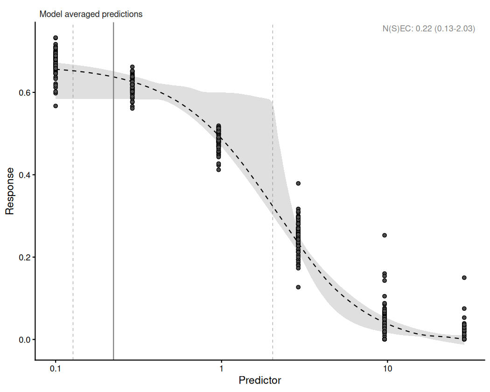
<p class="caption">plot of chunk fig-pam</p>
</div>

The colour endpoint has five concentrations and 45 chambers of four fragments.
Fitting equations of three and of four curve parameters to it separately shows
where the design runs out:


``` r
three_par <- bnec(proportion ~ crf(log(diuron_adj), c("ecxll3", "ecxwb1p3")) + ogl(chamber),
                  data = coral_colour, family = Beta(link = "identity"),
                  seed = 228, refresh = 0)

four_par <- bnec(proportion ~ crf(log(diuron_adj), c("nec4param", "ecx4param")) + ogl(chamber),
                 data = coral_colour, family = Beta(link = "identity"),
                 seed = 228, refresh = 0)
```


``` r
sampled_badly <- function(fit, label) {
  worst <- vapply(rhat(fit), function(x) max(x$rhat_vals), numeric(1))
  divergent <- vapply(names(worst), function(m) {
    np <- brms::nuts_params(pull_out(fit, model = m)$fit)
    sum(np$Value[np$Parameter == "divergent__"])
  }, numeric(1))
  data.frame(curve = label, equation = names(worst),
             divergent = divergent, max_rhat = round(worst, 4),
             row.names = NULL)
}
rbind(sampled_badly(three_par, "three parameters"),
      sampled_badly(four_par, "four parameters"))
#>              curve  equation divergent max_rhat
#> 1 three parameters    ecxll3         0   1.0021
#> 2 three parameters  ecxwb1p3         0   1.0042
#> 3  four parameters nec4param      1914   1.0859
#> 4  four parameters ecx4param      2076   1.2926
```

Neither three-parameter equation records a divergent transition, and both have
an R-hat of 1.004 or below. `nec4param` records 1914 of its 8000 retained draws
and `ecx4param` 2076, at R-hats of 1.086 and 1.293. About a quarter of the
transitions of each four-parameter equation diverged.

A divergent transition is recorded where the sampler's step size is too large
for the curvature of the posterior at that point, so the simulated path departs
from the one the equations describe. A parameter the data do not constrain
produces exactly that curvature, in a posterior nearly flat along one direction
and sharp across it. R-hat asks a different question --- whether the chains of
one fit arrived at the same distribution --- and here it fails as well.

Length of run matters to which of the two checks notices. Fitting the same four
equations at 5000 iterations with 4000 warmup, half what `bnec()` uses, gave 212
divergent transitions for `nec4param` and 326 for `ecx4param` of 4000 draws
each. At that length `ecx4param` returned an R-hat of 1.009, inside every
conventional cutoff and within 0.005 of the two three-parameter equations. At the default
run its R-hat is 1.293. The shorter chain did not make the fit better; it made
one of the two diagnostics stop reporting the problem, which is a reason to
report a diagnostic against the settings that produced it.


``` r
autoplot(three_par) + log_x
```

<div class="figure" style="text-align: center">
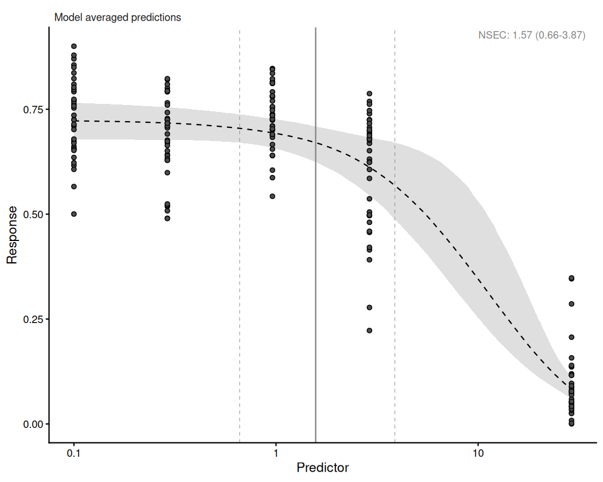
<p class="caption">plot of chunk fig-three-par</p>
</div>


``` r
autoplot(four_par) + log_x
```

<div class="figure" style="text-align: center">
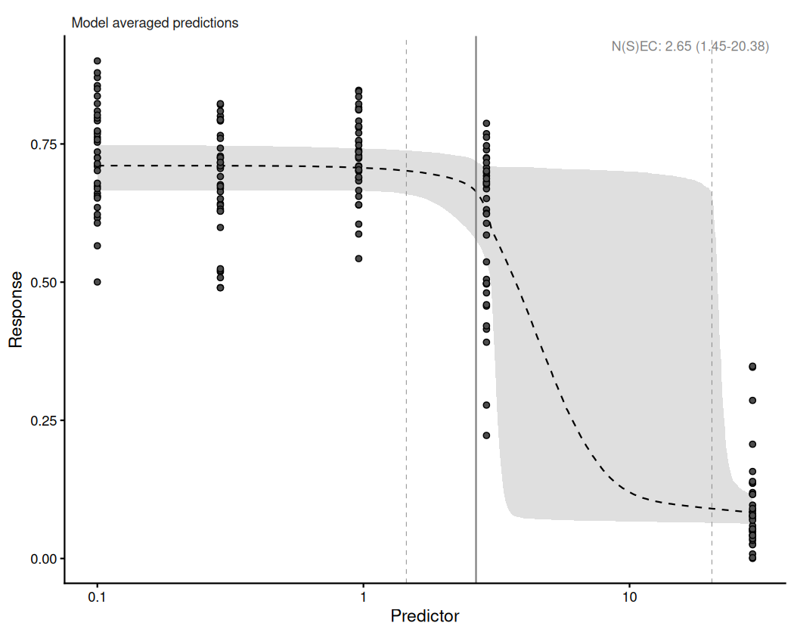
<p class="caption">plot of chunk fig-four-par</p>
</div>

The figures show where those divergences come from. Nothing between 2.9 and 29
µg/L tells a four-parameter equation where its lower asymptote sits, because
the colour design has no observation across that tenfold range. At 10 µg/L the
four-parameter credible band is 0.63 wide on a response that runs from 0 to
about 0.9, so it covers most of the values the endpoint can take; the
three-parameter band is 0.35 there. Both close to 0.05 at 29 µg/L, where the
observations resume. A three-parameter equation fixes the lower asymptote
instead of estimating it, and so has nothing to place in the gap.

The four-parameter equations are worse served than the gap alone suggests. What
they have to estimate a lower asymptote from is one concentration, and the
reading at that concentration is of fragments that had bleached completely.

The threshold estimates differ in the same way. The three-parameter set returns
an NSEC of 1.71 µg/L (0.65--5.84). The four-parameter set returns 2.69
(1.42--20.37), an upper bound of the same order as the highest concentration
tested, which is 29. Both sets were fitted to the same 180 observations.

#301 proposes restricting a model set by the number of curve parameters for
this reason.

The colour score has exactly one observation on the `Beta` boundary, which
follows from the rescaling described above, and the yield endpoint has 63
readings at zero.
Neither is a defect in the data; both are decisions about the response that have
to be made before the family is chosen, and `vignette("example6")` covers them.

# Case study 3: seven herbicides

`herbicide` [@jones2003] holds the effective quantum yield of photosystem II in
the symbiotic dinoflagellates of the coral *Seriatopora hystrix*, measured after
a ten-hour exposure to each of seven photosystem II inhibiting herbicides. Three
replicate containers of four corals were held at each concentration. The report
is at <https://doi.org/10.3354/meps261149>.

The endpoint is the same quantity as case study 2's `yield`, and the two studies
are connected by more than that. @jones2003 found the effect of diuron to be
inversely related to temperature, which is the observation @flores2021 tested
two decades later by crossing diuron with warming.


``` r
data(herbicide)
ggplot(herbicide, aes(x = concentration, y = fvfm)) +
  geom_point(shape = 21, fill = "grey30", alpha = 0.6) +
  facet_wrap(~herbicide, ncol = 2, scales = "free_x") +
  log_x +
  theme_classic() +
  theme(panel.spacing.x = unit(1.2, "lines")) +
  labs(x = "Concentration (ug/L)", y = "Effective quantum yield")
```

<div class="figure" style="text-align: center">
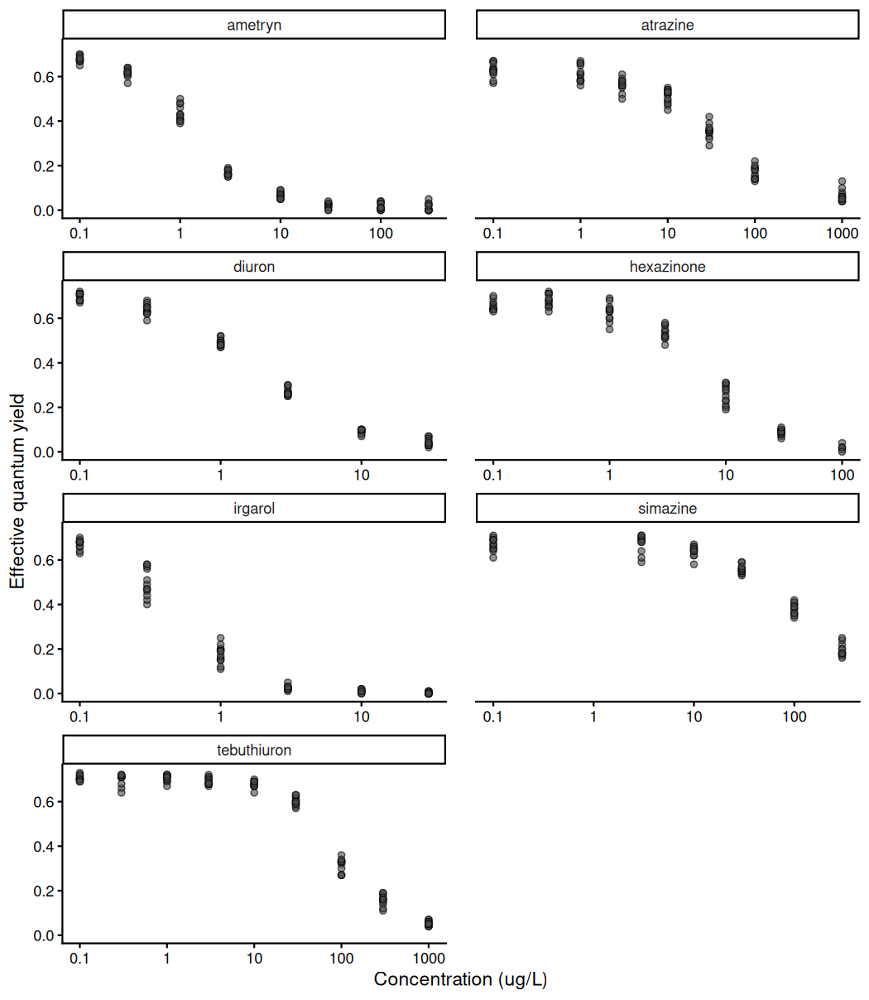
<p class="caption">plot of chunk fig-herbicide-raw</p>
</div>

Effective quantum yield declines with concentration in all seven, and the
concentration at which it does so differs by two orders of magnitude between
them. Yield is at half its lowest-dose mean by 1 µg/L of irgarol and 3 µg/L of
diuron or ametryn, against 100 µg/L of tebuthiuron and 300 of simazine, which is
the highest concentration simazine was tested at.

Seven herbicides are a fixed set chosen for their interest, not a sample from a
population of herbicides, so shrinking them towards a common curve answers a
different question from the one being asked, and their functional forms may
differ. `bnec_group()` fits each level separately and returns one object. This
call uses `decline` rather than `"all"`, which is what Figure 11 of @fisher2024
was fitted with.


``` r
fits_herb <- bnec_group(fvfm ~ crf(log(concentration), "decline"),
                        data = herbicide, group_var = "herbicide",
                        family = Beta(link = "identity"),
                        seed = 228, refresh = 0)
```

`summary()` on a `bayesnecgroupfit` prints a full summary for every level, which
for seven herbicides is several hundred lines. What the sections below draw on
is the model weights, and those are worth seeing together:


``` r
herb_wi <- do.call(rbind, Map(function(f, lev) {
  w <- summary(f)$mod_weights[, "wi"]
  data.frame(herbicide = lev, equation = names(w), wi = as.numeric(w))
}, fits_herb$fits, fits_herb$levels))
# Ordered by the weight each equation takes over all seven, so that the
# equations the set actually uses sit together at the top.
herb_wi$equation <- reorder(factor(herb_wi$equation), herb_wi$wi, sum)

ggplot(herb_wi, aes(x = herbicide, y = equation, fill = wi)) +
  geom_tile(colour = "white", linewidth = 0.4) +
  geom_text(aes(label = ifelse(wi >= 0.05, sprintf("%.2f", wi), "")),
            size = 2.7, colour = "grey15") +
  scale_fill_gradient(low = "white", high = "#2c6a5a", name = "weight",
                      limits = c(0, 1)) +
  theme_classic() +
  theme(axis.text.x = element_text(angle = 30, hjust = 1),
        axis.line = element_blank(), axis.ticks = element_blank()) +
  labs(x = NULL, y = NULL)
```

<div class="figure" style="text-align: center">
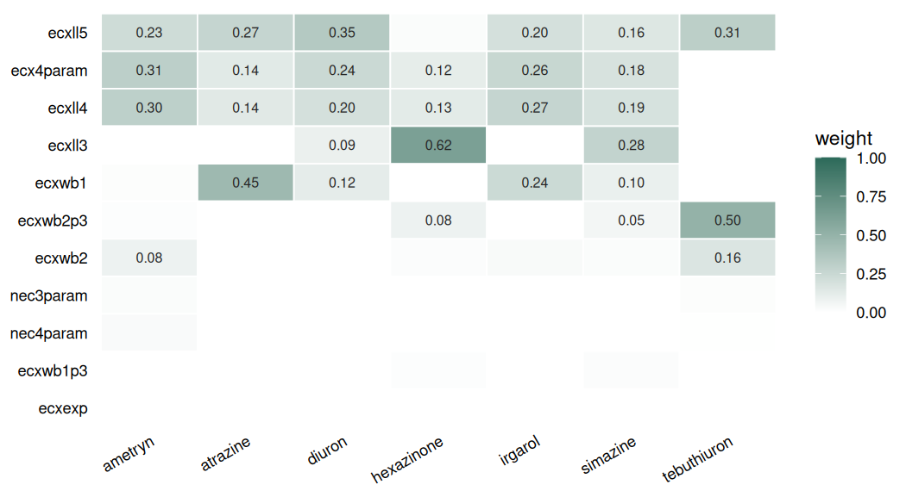
<p class="caption">plot of chunk fig-herb-weights</p>
</div>

The seven do not agree on which equation describes them. Tebuthiuron puts half
its weight on `ecxwb2p3`, which takes almost none anywhere else, and hexazinone
puts 0.62 on `ecxll3`, which four of the others give nothing at all. Ametryn,
irgarol and diuron each spread their weight over three or four equations. That
is the case for fitting the levels separately rather than shrinking them towards
a common curve: the curve they would be shrunk towards is not one the data agree
on.

Toxicity estimates for the seven herbicides span two orders of magnitude.
Back-transformed from the fitted scale, the N(S)EC runs from irgarol at 0.135 µg/L (0.108--0.174) and
diuron at 0.151 (0.110--0.194), through ametryn at 0.196, hexazinone at 0.631
and atrazine at 1.197, to simazine at 4.349 and tebuthiuron at 10.591
(4.349--14.013).

The N(S)EC is a threshold, the concentration at which the response first departs
from the control, and it is not what @jones2003 report. They report EC50s, the
concentration at which yield is halved, so the comparison with the source study
is against `ecx()`:


``` r
ecx(fits_herb, ecx_val = 50, xform = exp)
#>         level         Q50       Q2.5      Q97.5
#> 1     ametryn   1.4985971   1.412824   1.603517
#> 2    atrazine  39.3270716  34.816560  44.281153
#> 3      diuron   2.0414192   1.903991   2.192404
#> 4  hexazinone   7.4219317   6.747813   8.119615
#> 5     irgarol   0.5404365   0.491021   0.599159
#> 6    simazine 123.5956229 112.483813 135.634985
#> 7 tebuthiuron  90.3189131  84.294982  95.274655
```

Their values are irgarol 0.7 µg/L, ametryn 1.7, diuron 2.3, hexazinone 8.8,
atrazine 45, simazine 150 and tebuthiuron 175. Six of the seven agree closely,
the published figure sitting between 13 and 30 per cent above the one here, and
the ordering of those six is the same in both. Tebuthiuron is the exception at
roughly half the published value, and it is also the herbicide whose ordering
differs: here it is less toxic than simazine, and in the source study more so.

The two are not derived the same way. @jones2003 interpolate linearly between
the tested concentrations, in ToxCalc 5.0, while the values above come from a
model average over eleven fitted curves. Linear interpolation across a
log-spaced series cuts the chord of a curve that is concave over that interval,
which places the half-effect concentration higher than a fitted curve does, and
the published value is higher in all seven. That six of the seven agree within a
third is the agreement worth having. Nothing in these data settles which
estimate is closer to the truth for tebuthiuron.


``` r
ggplot(group_curves(fits_herb), aes(x = x_e)) +
  geom_polygon(aes(y = y_ci), fill = "grey75", alpha = 0.5) +
  geom_line(aes(y = y_e), linetype = 2) +
  geom_point(aes(x = x_r, y = y_r), shape = 21, fill = "grey30", alpha = 0.6) +
  geom_vline(aes(xintercept = nec_vals), colour = "grey50") +
  facet_wrap(~level, ncol = 2, scales = "free_x") +
  log_x +
  theme_classic() +
  theme(panel.spacing.x = unit(1.2, "lines")) +
  labs(x = "Concentration (ug/L)", y = "Effective quantum yield")
```

<div class="figure" style="text-align: center">
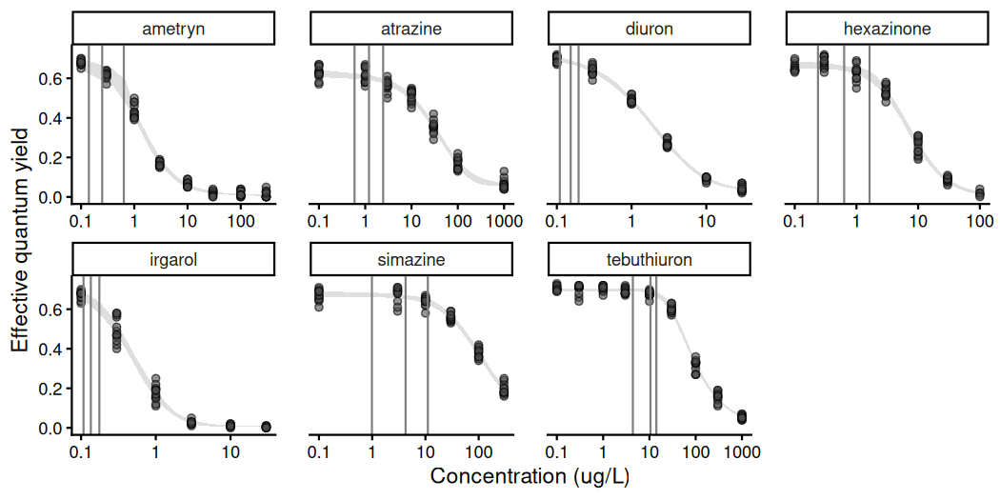
<p class="caption">plot of chunk fig-herbicides</p>
</div>

Yield declines with concentration in all seven, and the fitted band follows the
observations down in each, with the N(S)EC rule at or a little before the
concentration where the points leave the control level. The response axis is shared and the concentration axis
is not, so the panels are comparable in level and not in position: the seven
curves have much the same shape and sit at different concentrations. Fitting
each level separately is what allows the shape to differ between them. Here it
largely does not, and what separates the herbicides is where the curve falls
rather than how.


``` r
cmp_herb <- compare_posterior(fits_herb, comparison = "nec")
cmp_herb$prob_diff
#>                comparison        prob
#> 1        ametryn-atrazine 0.019627453
#> 2          ametryn-diuron 0.841355169
#> 3      ametryn-hexazinone 0.044880610
#> 4         ametryn-irgarol 0.914739342
#> 5        ametryn-simazine 0.011626453
#> 6     ametryn-tebuthiuron 0.009501188
#> 7         atrazine-diuron 0.987248406
#> 8     atrazine-hexazinone 0.844605576
#> 9        atrazine-irgarol 0.987998500
#> 10      atrazine-simazine 0.040380048
#> 11   atrazine-tebuthiuron 0.010751344
#> 12      diuron-hexazinone 0.013626703
#> 13         diuron-irgarol 0.707463433
#> 14        diuron-simazine 0.011251406
#> 15     diuron-tebuthiuron 0.009751219
#> 16     hexazinone-irgarol 0.986873359
#> 17    hexazinone-simazine 0.016627078
#> 18 hexazinone-tebuthiuron 0.010126266
#> 19       irgarol-simazine 0.010876360
#> 20    irgarol-tebuthiuron 0.009751219
#> 21   simazine-tebuthiuron 0.076384548
```

`prob_diff` gives the probability that the first level of each pair has the
higher estimate, so a value near 0 or 1 separates two herbicides and one near
0.5 does not. Of the 21 pairs the clearest are those against tebuthiuron, from
0.0095 for ametryn to 0.0101 for hexazinone. The least separated is diuron
against irgarol at 0.707, the two most potent of the set, whose intervals
overlap over most of their length; the next is simazine against tebuthiuron at
0.076.

The 21 pairwise probabilities reduce seven posteriors to one number each, and
those posteriors are in `posterior_data`:


``` r
# Figure 11 of Fisher et al. (2024) is this display for these seven herbicides,
# and this reproduces it. The posteriors are on the fitted scale, log(ug/L), and
# exp() returns them to concentration so that the axis reads in the units the
# estimates are reported in, as every other figure here does.
herb_post <- cmp_herb$posterior_data
herb_post$value <- exp(herb_post$value)

ggplot(data = herb_post, mapping = aes(x = value)) +
  geom_density(mapping = aes(group = model, colour = model, fill = model),
               alpha = 0.3) +
  log_x +
  theme_classic() +
  labs(x = "Concentration (ug/L)", y = "Density",
       fill = "Model", colour = "Model")
```

<div class="figure" style="text-align: center">
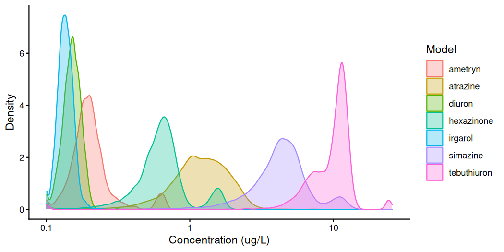
<p class="caption">plot of chunk fig-cmp-herbicides</p>
</div>

This reproduces Figure 11 of @fisher2024. Two things the pairwise probabilities
do not say are visible in the densities.

The three most potent overlap almost entirely. Irgarol at 0.135 and diuron at
0.151 have intervals of 0.108 to 0.174 and 0.110 to 0.194, so one sits almost
inside the other; that is what a `prob_diff` of 0.707 looks like as a
distribution. Ametryn at 0.196 overlaps both.

The posteriors differ in width as much as in position. From end to end,
irgarol's interval spans a factor of 1.6 and diuron's 1.8, against 11.0 for
simazine and 7.8 for atrazine. Two herbicides an order of magnitude apart in
median can still overlap, because one of them is poorly determined rather than
because they are alike.

Several are bimodal. Tebuthiuron has a second mode near 2 µg/L and hexazinone
one near 1.6, which is the model-averaging mixture case study 2 traced in
`fit_pam`: a low-weight equation placing its threshold elsewhere, visible in the
tail of the average and not in its median.

The pairing matters for what this comparison may be used on. `compare_posterior()`
pairs the draws of two posteriors by a random permutation, which approximates the
difference of two independent posteriors and is valid only where the posteriors
come from separate fits. `bnec_group()` fits every level separately, so that
holds here.

The two `bnec_group()` fits in this vignette are not screened as the five single
fits above are. `check_sampling()` and `screen_models()` do not accept a
`bayesnecgroupfit`, which #376 records; their per-level diagnostics were read by
hand instead. Two levels of a single fit share draws, and permuting them discards
the correlation between them, widening the difference and pulling `prob_diff`
towards 0.5 --- so a contrast between parts of one fit needs draw-wise
differencing and must not be routed through this function.

# Provenance

Every fit shown was made when this vignette was precompiled, so the estimates
are those of the package version it ships with. The session that produced them
is recorded below.


``` r
packageVersion("bayesnec")
#> [1] '2.1.3.38'
packageVersion("brms")
#> [1] '2.23.0'
R.version.string
#> [1] "R version 4.6.1 (2026-06-24)"
```

The fits use `model = "all"`, which `bnec()` filters to the equations valid for
the family and predictor. Two calls do not. The herbicide call uses `decline`,
to match Figure 11 of @fisher2024. The parameter-count contrast of case study 2
names two equations on each side, because the contrast is the point. No call names `iter`, `warmup` or `control`, so `bnec()`'s defaults
apply: 4 chains at 10000 iterations with 8000 warmup, under `seed = 228`.
`bnec()` also raises `adapt_delta` from Stan's 0.8 to 0.99 of its own accord
wherever a constrained mean is given an unbounded group-level term, which is
every fit here except the herbicide one. That raise is not decoration: at 0.8,
`ecxll5` returned 880 divergent transitions of 16000 on the single-plate fit
while holding about a fifth of the weight, and fitted alone it returns none at
0.99.

@luter2025 sampled the published `lum31` analysis longer again, at 20000
iterations with 19000 warmup and `adapt_delta = 0.99` named explicitly.

`ecxhormebc5` is excluded before fitting wherever the predictor reaches a
negative value and the response family requires a positive mean on an identity
link. Its hormesis term `exp(slope) * x` is negative wherever the predictor is,
and a starting value drawn from the prior then puts the mean below zero, which
neither a Gamma nor a `Beta` on an identity link can represent. That covers
every fit in this vignette on a logged predictor: the `lum31` concentrations
are in mg/L and negative on the log scale for 64 per cent of the observations,
and `log(diuron_adj)` is negative below 1 µg/L. `necsigm` and `ecxsigm` are
excluded on the same predictor for a different reason, that a fractional power
of a negative number is undefined. See #344.

`lum31` was built from the AIMS data repository deposit accompanying
@luter2025 by `data-raw/lum31.R`. `coral_colour` and `coral_pam` were built from
the records behind @flores2021 by `data-raw/coral_diuron.R`. Neither set of
source records is distributed with the package: the scripts are, and the
manual pages state what was derived and how.

# References
