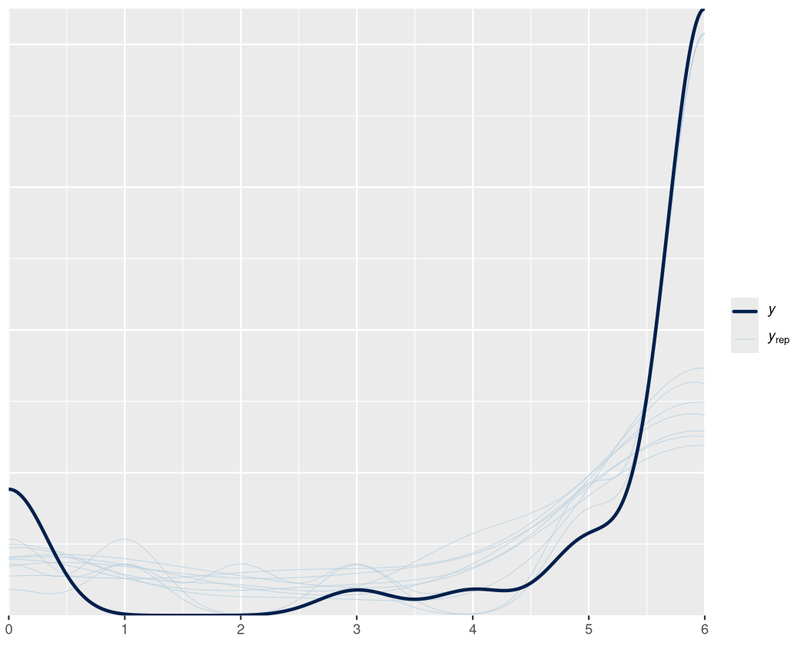
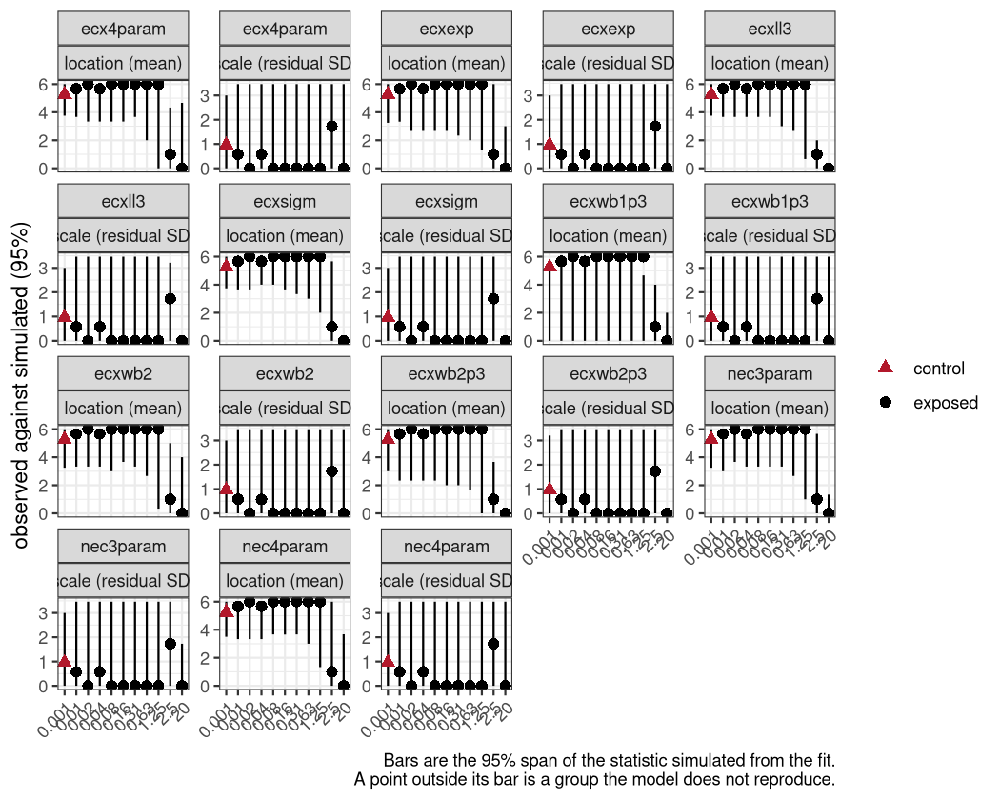
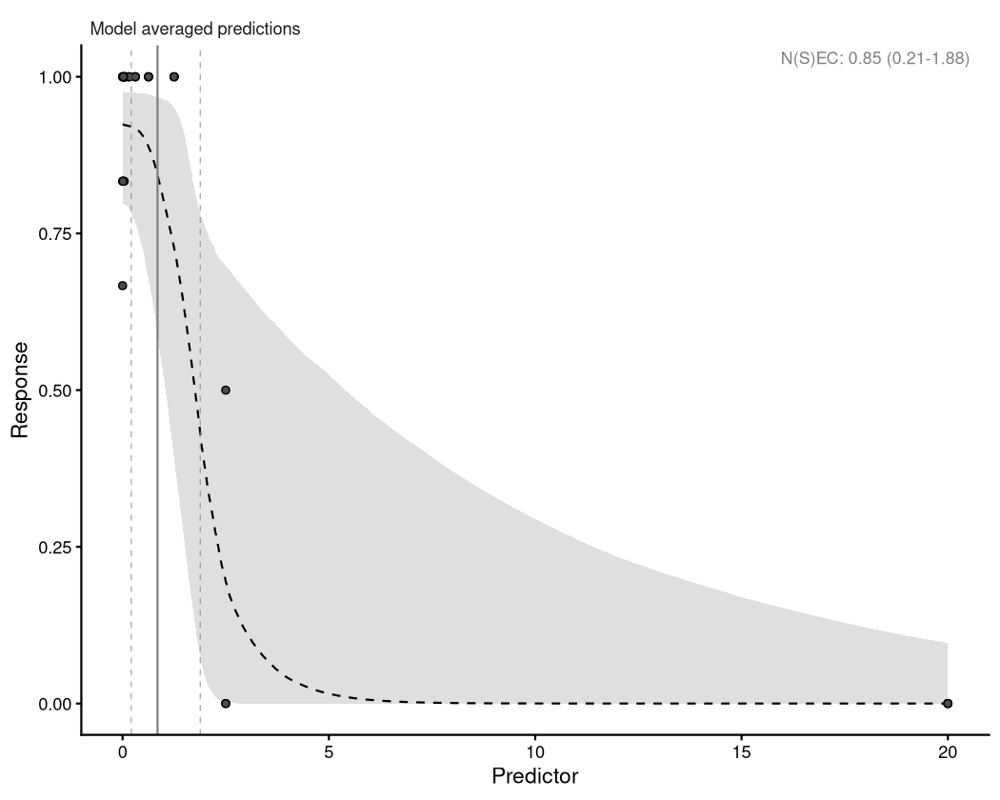

# Overview

The other vignettes each explain one part of `bayesnec`: what the model set is,
what a `bayesmanecfit` is, how priors are built, how to handle a two-block
response. This one runs a single analysis from data to reportable estimate, in
the order the steps actually occur, and shows the two that the others state but
do not demonstrate: **choosing the family from the data**, and **removing a
model from the set and seeing what that does to the answer**.

The workflow is:

1. Prepare the data and choose the family.
2. Fit the candidate set.
3. Check the sampler.
4. Check the fit.
5. Exclude what fails, and re-inspect the weights.
6. Report.

Steps 3 and 5 are the ones with consequences. `vignette("example2")` notes that
there is little harm in leaving a poorly *shaped* model in the set with low
weight — which is true — but a model that has not **converged** is a different
matter, and dropping it changes the weights and therefore the model-averaged
*N(S)EC* that gets reported. That is shown here rather than asserted.


``` r
library(bayesnec)
library(ggplot2)
```

# 1. Data preparation and family choice

The `nassarius` data are survival counts for a marine gastropod exposed to a
contaminant, recorded per individual within replicate tanks.


``` r
data(nassarius)
head(nassarius)
#>   contaminant dose tank alive    growth        record
#> 1           A    0  A-1     1  8.720112      measured
#> 2           A    0  A-1     1 28.167398      measured
#> 3           A    0  A-1     1 27.282255      measured
#> 4           A    0  A-1     1 15.859112      measured
#> 5           A    0  A-1     1 19.017969      measured
#> 6           A    0  A-1     0  0.000000 sentinel_code
```

Survival is binary per individual, so the natural unit for a
concentration-response model is the tank: the number alive out of the number
exposed.


``` r
surv <- aggregate(alive ~ dose + tank + contaminant,
                  data = nassarius, FUN = function(x) c(suc = sum(x),
                                                        tot = length(x)))
surv <- do.call(data.frame, surv)
names(surv)[names(surv) == "alive.suc"] <- "suc"
names(surv)[names(surv) == "alive.tot"] <- "tot"
surv <- surv[surv$contaminant == "A", ]
head(surv)
#>   dose tank contaminant suc tot
#> 1 0.00  A-1           A   5   6
#> 2 0.02 A-10           A   6   6
#> 3 0.04 A-11           A   6   6
#> 4 0.04 A-12           A   6   6
#> 5 0.04 A-13           A   5   6
#> 6 0.08 A-14           A   6   6
```

## The pre-fit screen

The obvious family for successes-out-of-trials is `binomial`. But a binomial
model fixes the variance at $np(1-p)$, and replicate tanks almost always vary by
more than that — animals within a tank share conditions, so the effective sample
size is smaller than the number of individuals. Fitting the whole candidate set
under a family that cannot represent the spread wastes the run.

The screen is cheap: fit **one** model, and look at `dispersion()`.


``` r
screen <- bnec(suc | trials(tot) ~ crf(dose, model = "nec4param"),
               data = surv, family = binomial(link = "identity"),
               iter = 2e3, chains = 2, seed = 17)
#> 
#> SAMPLING FOR MODEL 'anon_model' NOW (CHAIN 1).
#> Chain 1: 
#> Chain 1: Gradient evaluation took 4.3e-05 seconds
#> Chain 1: 1000 transitions using 10 leapfrog steps per transition would take 0.43 seconds.
#> Chain 1: Adjust your expectations accordingly!
#> Chain 1: 
#> Chain 1: 
#> Chain 1: Iteration:    1 / 2000 [  0%]  (Warmup)
#> Chain 1: Iteration:  200 / 2000 [ 10%]  (Warmup)
#> Chain 1: Iteration:  400 / 2000 [ 20%]  (Warmup)
#> Chain 1: Iteration:  600 / 2000 [ 30%]  (Warmup)
#> Chain 1: Iteration:  800 / 2000 [ 40%]  (Warmup)
#> Chain 1: Iteration: 1000 / 2000 [ 50%]  (Warmup)
#> Chain 1: Iteration: 1200 / 2000 [ 60%]  (Warmup)
#> Chain 1: Iteration: 1400 / 2000 [ 70%]  (Warmup)
#> Chain 1: Iteration: 1600 / 2000 [ 80%]  (Warmup)
#> Chain 1: Iteration: 1601 / 2000 [ 80%]  (Sampling)
#> Chain 1: Iteration: 1800 / 2000 [ 90%]  (Sampling)
#> Chain 1: Iteration: 2000 / 2000 [100%]  (Sampling)
#> Chain 1: 
#> Chain 1:  Elapsed Time: 0.8 seconds (Warm-up)
#> Chain 1:                0.126 seconds (Sampling)
#> Chain 1:                0.926 seconds (Total)
#> Chain 1: 
#> 
#> SAMPLING FOR MODEL 'anon_model' NOW (CHAIN 2).
#> Chain 2: 
#> Chain 2: Gradient evaluation took 3.1e-05 seconds
#> Chain 2: 1000 transitions using 10 leapfrog steps per transition would take 0.31 seconds.
#> Chain 2: Adjust your expectations accordingly!
#> Chain 2: 
#> Chain 2: 
#> Chain 2: Iteration:    1 / 2000 [  0%]  (Warmup)
#> Chain 2: Iteration:  200 / 2000 [ 10%]  (Warmup)
#> Chain 2: Iteration:  400 / 2000 [ 20%]  (Warmup)
#> Chain 2: Iteration:  600 / 2000 [ 30%]  (Warmup)
#> Chain 2: Iteration:  800 / 2000 [ 40%]  (Warmup)
#> Chain 2: Iteration: 1000 / 2000 [ 50%]  (Warmup)
#> Chain 2: Iteration: 1200 / 2000 [ 60%]  (Warmup)
#> Chain 2: Iteration: 1400 / 2000 [ 70%]  (Warmup)
#> Chain 2: Iteration: 1600 / 2000 [ 80%]  (Warmup)
#> Chain 2: Iteration: 1601 / 2000 [ 80%]  (Sampling)
#> Chain 2: Iteration: 1800 / 2000 [ 90%]  (Sampling)
#> Chain 2: Iteration: 2000 / 2000 [100%]  (Sampling)
#> Chain 2: 
#> Chain 2:  Elapsed Time: 1.938 seconds (Warm-up)
#> Chain 2:                0.066 seconds (Sampling)
#> Chain 2:                2.004 seconds (Total)
#> Chain 2:
dispersion(screen, summary = TRUE)
#>  Estimate      Q2.5     Q97.5 
#> 1.5236827 0.6663722 3.7174703
```

`dispersion()` returns the ratio of the residual variance to the variance the
family assumes. A value near 1 means the family's variance assumption is
supported. Comfortably above 1 means it is not, and the fix is a family with a
free dispersion parameter — `beta_binomial` for counts out of trials.


``` r
disp <- dispersion(screen, summary = TRUE)
fam <- if (disp[["Estimate"]] > 1.5) "beta_binomial" else "binomial"
fam
#> [1] "beta_binomial"
```

`dispersion()` returns a named vector — `Estimate`, `Q2.5`, `Q97.5` — and only
for `poisson` and `binomial`, the two families whose variance is fixed by the
mean. For anything else it returns an empty vector, which is the correct answer
rather than an error: there is no over-dispersion decision to make when the
family already carries a free dispersion parameter.

The 1.5 threshold is a judgement, not a rule; what matters is that the decision
is made from the data and recorded, rather than defaulted to. Note that
`bnec()` forces `link = "identity"` on every family so that `top`, `bot` and
`nec` stay on the response scale — see `vignette("example1")`.

# 2. Fitting the candidate set


``` r
fit <- bnec(suc | trials(tot) ~ crf(dose, model = "decline"),
            data = surv, family = fam,
            iter = 5e3, chains = 3, seed = 17)
```

Two arguments are worth knowing before you need them:

- `iter` and `warmup`. The defaults are generous, but a model with a poorly
  identified `nec` may need more. Raising `iter` is the first thing to try when
  Rhat is marginal.
- `control = list(adapt_delta = 0.99, max_treedepth = 12)`. Raise `adapt_delta`
  when there are divergent transitions; raise `max_treedepth` when the sampler
  reports hitting it. Both cost time and neither fixes a misspecified model.

Models that fail outright are recorded rather than silently dropped, and can be
re-tried individually with `amend(add = )`:


``` r
failed_models(fit)
#> 3 model(s) failed to fit:
#> 
#>   ecxwb1
#>     Failed to fit model ecxwb1.
#>   ecxll5
#>     Failed to fit model ecxll5.
#>   ecxll4
#>     Failed to fit model ecxll4.
#> 
#> The priors and initial values used are retained, e.g.
#>   failed_models(fit)$ecxwb1$prior
#>   failed_models(fit)$ecxwb1$init
```

# 3. Sampler diagnostics

The first question is whether the sampler worked — not whether the model is
any good, which is step 4.

`rhat()` reports per candidate model, so the whole set is screened in one call
rather than model by model.


``` r
check_sampling(fit)
#>       model max_rhat     min_ess min_ess_ratio n_divergent failed
#> 1 nec3param 1.002117  409.823226   0.136607742           0  FALSE
#> 2 nec4param 1.246953    9.033458   0.003011153          55   TRUE
#> 3    ecxexp 1.000729 1196.416104   0.398805368           0  FALSE
#> 4   ecxsigm 1.037810  117.413286   0.039137762        2413   TRUE
#> 5 ecx4param 1.039196  119.203969   0.039734656         923   TRUE
#> 6    ecxwb2 1.039670  127.368496   0.042456165         706   TRUE
#> 7  ecxwb1p3 1.191971   11.980482   0.003993494        2708   TRUE
#> 8  ecxwb2p3 1.015112  175.882242   0.058627414        1982   TRUE
#> 9    ecxll3 1.003426  925.028606   0.308342869           1  FALSE
```

One row per candidate model, with the three diagnostics that decide whether a
fit is usable at all: the largest Rhat, the smallest effective sample size, and
the number of divergent transitions.

Read `min_ess` rather than `min_ess_ratio` when deciding: the default cutoff of
400 is Vehtari's recommendation that both bulk and tail ESS exceed 100 per
chain [@Vehtari2021], at the four chains `bnec()` fits by default. The ratio is
reported beside it so that "passed because we drew 8000" can be told apart from
"passed efficiently".

All three thresholds are arguments. The Rhat default of 1.01 and the ESS default
of 400 follow published recommendations; **the divergence default of 10 does
not** --- Stan's own guidance is that *any* divergence means the sampler failed
to explore the posterior. Ten is pragmatic, from practice with these non-linear
models, which routinely produce a handful near a boundary. State whichever you
use, because it will be quoted.

A cutoff of 1.01 is stricter than the `bayesnec` default of 1.05, and is worth
using here: the default is permissive, and the point of this step is to find the
models that should not be averaged. Which cutoff to use is a decision to record,
not a default to accept silently.

Chain mixing is worth looking at for anything marginal, rather than for
everything:


``` r
worst <- check_sampling(fit)
check_chains(pull_out(fit, model = worst$model[which.max(worst$max_rhat)]))
```

# 4. Fit diagnostics

Rhat says the sampler explored the posterior. It says nothing about whether the
model *fits*. Two checks, and they answer different questions.

`pp_check()` asks whether data simulated from the fitted model look like the
data observed, overall:


``` r
pp_check(pull_out(fit, model = "nec4param"))
```

<div class="figure" style="text-align: center">

<p class="caption">plot of chunk ppcheck</p>
</div>

`check_fit()` asks the sharper question: does the model reproduce the observed
**variability**, and the observed **level**, *locally* — within each
concentration group, with the control flagged.


``` r
check_fit(fit)
#>        model    wi group n obs_mean sim_mean mean_ratio ppp_mean obs_sd sim_sd
#> 1  nec3param 0.122 0.001 4    5.250    5.750      0.913    0.760  0.957  0.500
#> 2  nec3param 0.122  0.01 3    5.667    6.000      0.944    0.659  0.577  0.000
#> 3  nec3param 0.122  0.02 3    6.000    6.000      1.000    0.554  0.000  0.000
#> 4  nec3param 0.122  0.04 3    5.667    6.000      0.944    0.671  0.577  0.000
#> 5  nec3param 0.122  0.08 3    6.000    6.000      1.000    0.504  0.000  0.000
#> 6  nec3param 0.122  0.16 3    6.000    6.000      1.000    0.517  0.000  0.000
#> 7  nec3param 0.122  0.31 3    6.000    6.000      1.000    0.549  0.000  0.000
#> 8  nec3param 0.122  0.63 3    6.000    5.667      1.059    0.449  0.000  0.577
#> 9  nec3param 0.122  1.25 3    6.000    4.333      1.385    0.128  0.000  1.732
#> 10 nec3param 0.122   2.5 3    1.000    2.333      0.429    0.802  1.732  2.000
#> 11 nec3param 0.122    20 3    0.000    0.000        NaN    1.000  0.000  0.000
#> 12 nec4param 0.075 0.001 4    5.250    5.750      0.913    0.764  0.957  0.500
#> 13 nec4param 0.075  0.01 3    5.667    6.000      0.944    0.708  0.577  0.000
#> 14 nec4param 0.075  0.02 3    6.000    6.000      1.000    0.541  0.000  0.000
#> 15 nec4param 0.075  0.04 3    5.667    6.000      0.944    0.682  0.577  0.000
#> 16 nec4param 0.075  0.08 3    6.000    6.000      1.000    0.566  0.000  0.000
#> 17 nec4param 0.075  0.16 3    6.000    6.000      1.000    0.577  0.000  0.000
#> 18 nec4param 0.075  0.31 3    6.000    6.000      1.000    0.568  0.000  0.000
#> 19 nec4param 0.075  0.63 3    6.000    5.667      1.059    0.493  0.000  0.577
#> 20 nec4param 0.075  1.25 3    6.000    5.000      1.200    0.307  0.000  1.155
#> 21 nec4param 0.075   2.5 3    1.000    2.000      0.500    0.706  1.732  1.528
#> 22 nec4param 0.075    20 3    0.000    0.667      0.000    1.000  0.000  0.577
#> 23    ecxexp 0.015 0.001 4    5.250    5.750      0.913    0.689  0.957  0.500
#> 24    ecxexp 0.015  0.01 3    5.667    6.000      0.944    0.658  0.577  0.000
#> 25    ecxexp 0.015  0.02 3    6.000    6.000      1.000    0.520  0.000  0.000
#> 26    ecxexp 0.015  0.04 3    5.667    6.000      0.944    0.621  0.577  0.000
#> 27    ecxexp 0.015  0.08 3    6.000    5.667      1.059    0.493  0.000  0.577
#> 28    ecxexp 0.015  0.16 3    6.000    5.667      1.059    0.443  0.000  0.577
#> 29    ecxexp 0.015  0.31 3    6.000    5.667      1.059    0.398  0.000  0.577
#> 30    ecxexp 0.015  0.63 3    6.000    5.000      1.200    0.264  0.000  1.155
#> 31    ecxexp 0.015  1.25 3    6.000    4.333      1.385    0.153  0.000  2.082
#> 32    ecxexp 0.015   2.5 3    1.000    3.667      0.273    0.930  1.732  2.309
#> 33    ecxexp 0.015    20 3    0.000    0.000        NaN    1.000  0.000  0.000
#> 34   ecxsigm 0.315 0.001 4    5.250    5.750      0.913    0.783  0.957  0.500
#> 35   ecxsigm 0.315  0.01 3    5.667    6.000      0.944    0.708  0.577  0.000
#> 36   ecxsigm 0.315  0.02 3    6.000    6.000      1.000    0.528  0.000  0.000
#> 37   ecxsigm 0.315  0.04 3    5.667    6.000      0.944    0.696  0.577  0.000
#> 38   ecxsigm 0.315  0.08 3    6.000    6.000      1.000    0.554  0.000  0.000
#> 39   ecxsigm 0.315  0.16 3    6.000    6.000      1.000    0.528  0.000  0.000
#> 40   ecxsigm 0.315  0.31 3    6.000    6.000      1.000    0.510  0.000  0.000
#> 41   ecxsigm 0.315  0.63 3    6.000    5.667      1.059    0.405  0.000  0.577
#> 42   ecxsigm 0.315  1.25 3    6.000    5.000      1.200    0.203  0.000  1.155
#> 43   ecxsigm 0.315   2.5 3    1.000    2.333      0.429    0.824  1.732  1.732
#> 44   ecxsigm 0.315    20 3    0.000    0.000        NaN    1.000  0.000  0.000
#> 45 ecx4param 0.073 0.001 4    5.250    5.750      0.913    0.769  0.957  0.500
#> 46 ecx4param 0.073  0.01 3    5.667    6.000      0.944    0.685  0.577  0.000
#> 47 ecx4param 0.073  0.02 3    6.000    6.000      1.000    0.525  0.000  0.000
#> 48 ecx4param 0.073  0.04 3    5.667    6.000      0.944    0.680  0.577  0.000
#> 49 ecx4param 0.073  0.08 3    6.000    6.000      1.000    0.540  0.000  0.000
#> 50 ecx4param 0.073  0.16 3    6.000    6.000      1.000    0.549  0.000  0.000
#> 51 ecx4param 0.073  0.31 3    6.000    6.000      1.000    0.528  0.000  0.000
#> 52 ecx4param 0.073  0.63 3    6.000    6.000      1.000    0.519  0.000  0.000
#> 53 ecx4param 0.073  1.25 3    6.000    5.333      1.125    0.349  0.000  0.577
#> 54 ecx4param 0.073   2.5 3    1.000    1.000      1.000    0.504  1.732  1.000
#> 55 ecx4param 0.073    20 3    0.000    1.000      0.000    1.000  0.000  1.155
#> 56    ecxwb2 0.118 0.001 4    5.250    5.750      0.913    0.762  0.957  0.500
#> 57    ecxwb2 0.118  0.01 3    5.667    6.000      0.944    0.705  0.577  0.000
#> 58    ecxwb2 0.118  0.02 3    6.000    6.000      1.000    0.508  0.000  0.000
#> 59    ecxwb2 0.118  0.04 3    5.667    6.000      0.944    0.677  0.577  0.000
#> 60    ecxwb2 0.118  0.08 3    6.000    6.000      1.000    0.542  0.000  0.000
#> 61    ecxwb2 0.118  0.16 3    6.000    6.000      1.000    0.561  0.000  0.000
#> 62    ecxwb2 0.118  0.31 3    6.000    6.000      1.000    0.519  0.000  0.000
#> 63    ecxwb2 0.118  0.63 3    6.000    5.667      1.059    0.484  0.000  0.577
#> 64    ecxwb2 0.118  1.25 3    6.000    5.667      1.059    0.372  0.000  0.577
#> 65    ecxwb2 0.118   2.5 3    1.000    0.667      1.500    0.457  1.732  0.577
#> 66    ecxwb2 0.118    20 3    0.000    0.667      0.000    1.000  0.000  0.577
#> 67  ecxwb1p3 0.000 0.001 4    5.250    2.500      2.100    0.036  0.957  3.000
#> 68  ecxwb1p3 0.000  0.01 3    5.667    2.000      2.833    0.052  0.577  3.215
#> 69  ecxwb1p3 0.000  0.02 3    6.000    2.000      3.000    0.057  0.000  3.215
#> 70  ecxwb1p3 0.000  0.04 3    5.667    2.000      2.833    0.059  0.577  3.215
#> 71  ecxwb1p3 0.000  0.08 3    6.000    2.000      3.000    0.035  0.000  3.215
#> 72  ecxwb1p3 0.000  0.16 3    6.000    2.000      3.000    0.027  0.000  3.215
#> 73  ecxwb1p3 0.000  0.31 3    6.000    2.000      3.000    0.043  0.000  3.215
#> 74  ecxwb1p3 0.000  0.63 3    6.000    2.000      3.000    0.036  0.000  3.215
#> 75  ecxwb1p3 0.000  1.25 3    6.000    2.000      3.000    0.011  0.000  3.055
#> 76  ecxwb1p3 0.000   2.5 3    1.000    1.667      0.600    0.555  1.732  2.082
#> 77  ecxwb1p3 0.000    20 3    0.000    0.000        NaN    1.000  0.000  0.000
#> 78  ecxwb2p3 0.044 0.001 4    5.250    5.750      0.913    0.673  0.957  0.500
#> 79  ecxwb2p3 0.044  0.01 3    5.667    5.667      1.000    0.601  0.577  0.577
#> 80  ecxwb2p3 0.044  0.02 3    6.000    5.667      1.059    0.493  0.000  0.577
#> 81  ecxwb2p3 0.044  0.04 3    5.667    6.000      0.944    0.596  0.577  0.000
#> 82  ecxwb2p3 0.044  0.08 3    6.000    6.000      1.000    0.513  0.000  0.000
#> 83  ecxwb2p3 0.044  0.16 3    6.000    5.667      1.059    0.482  0.000  0.577
#> 84  ecxwb2p3 0.044  0.31 3    6.000    5.667      1.059    0.450  0.000  0.577
#> 85  ecxwb2p3 0.044  0.63 3    6.000    5.000      1.200    0.284  0.000  1.155
#> 86  ecxwb2p3 0.044  1.25 3    6.000    3.667      1.636    0.050  0.000  2.082
#> 87  ecxwb2p3 0.044   2.5 3    1.000    0.667      1.500    0.425  1.732  0.577
#> 88  ecxwb2p3 0.044    20 3    0.000    0.000        NaN    1.000  0.000  0.000
#> 89    ecxll3 0.238 0.001 4    5.250    5.750      0.913    0.784  0.957  0.500
#> 90    ecxll3 0.238  0.01 3    5.667    6.000      0.944    0.681  0.577  0.000
#> 91    ecxll3 0.238  0.02 3    6.000    6.000      1.000    0.544  0.000  0.000
#> 92    ecxll3 0.238  0.04 3    5.667    6.000      0.944    0.683  0.577  0.000
#> 93    ecxll3 0.238  0.08 3    6.000    6.000      1.000    0.523  0.000  0.000
#> 94    ecxll3 0.238  0.16 3    6.000    6.000      1.000    0.536  0.000  0.000
#> 95    ecxll3 0.238  0.31 3    6.000    6.000      1.000    0.509  0.000  0.000
#> 96    ecxll3 0.238  0.63 3    6.000    5.667      1.059    0.410  0.000  0.577
#> 97    ecxll3 0.238  1.25 3    6.000    4.667      1.286    0.172  0.000  1.155
#> 98    ecxll3 0.238   2.5 3    1.000    0.000        Inf    0.133  1.732  0.000
#> 99    ecxll3 0.238    20 3    0.000    0.000        NaN    1.000  0.000  0.000
#>    sd_ratio ppp_sd control
#> 1     1.915  0.376    TRUE
#> 2       Inf  0.448   FALSE
#> 3       NaN  1.000   FALSE
#> 4       Inf  0.438   FALSE
#> 5       NaN  1.000   FALSE
#> 6       NaN  1.000   FALSE
#> 7       NaN  1.000   FALSE
#> 8     0.000  1.000   FALSE
#> 9     0.000  1.000   FALSE
#> 10    0.866  0.562   FALSE
#> 11      NaN  1.000   FALSE
#> 12    1.915  0.361    TRUE
#> 13      Inf  0.421   FALSE
#> 14      NaN  1.000   FALSE
#> 15      Inf  0.418   FALSE
#> 16      NaN  1.000   FALSE
#> 17      NaN  1.000   FALSE
#> 18      NaN  1.000   FALSE
#> 19    0.000  1.000   FALSE
#> 20    0.000  1.000   FALSE
#> 21    1.134  0.478   FALSE
#> 22    0.000  1.000   FALSE
#> 23    1.915  0.431    TRUE
#> 24      Inf  0.449   FALSE
#> 25      NaN  1.000   FALSE
#> 26      Inf  0.488   FALSE
#> 27    0.000  1.000   FALSE
#> 28    0.000  1.000   FALSE
#> 29    0.000  1.000   FALSE
#> 30    0.000  1.000   FALSE
#> 31    0.000  1.000   FALSE
#> 32    0.750  0.641   FALSE
#> 33      NaN  1.000   FALSE
#> 34    1.915  0.383    TRUE
#> 35      Inf  0.455   FALSE
#> 36      NaN  1.000   FALSE
#> 37      Inf  0.446   FALSE
#> 38      NaN  1.000   FALSE
#> 39      NaN  1.000   FALSE
#> 40      NaN  1.000   FALSE
#> 41    0.000  1.000   FALSE
#> 42    0.000  1.000   FALSE
#> 43    1.000  0.545   FALSE
#> 44      NaN  1.000   FALSE
#> 45    1.915  0.357    TRUE
#> 46      Inf  0.462   FALSE
#> 47      NaN  1.000   FALSE
#> 48      Inf  0.479   FALSE
#> 49      NaN  1.000   FALSE
#> 50      NaN  1.000   FALSE
#> 51      NaN  1.000   FALSE
#> 52      NaN  1.000   FALSE
#> 53    0.000  1.000   FALSE
#> 54    1.732  0.353   FALSE
#> 55    0.000  1.000   FALSE
#> 56    1.915  0.355    TRUE
#> 57      Inf  0.479   FALSE
#> 58      NaN  1.000   FALSE
#> 59      Inf  0.460   FALSE
#> 60      NaN  1.000   FALSE
#> 61      NaN  1.000   FALSE
#> 62      NaN  1.000   FALSE
#> 63    0.000  1.000   FALSE
#> 64    0.000  1.000   FALSE
#> 65    3.000  0.316   FALSE
#> 66    0.000  1.000   FALSE
#> 67    0.319  0.863    TRUE
#> 68    0.180  0.831   FALSE
#> 69    0.000  1.000   FALSE
#> 70    0.180  0.800   FALSE
#> 71    0.000  1.000   FALSE
#> 72    0.000  1.000   FALSE
#> 73    0.000  1.000   FALSE
#> 74    0.000  1.000   FALSE
#> 75    0.000  1.000   FALSE
#> 76    0.832  0.533   FALSE
#> 77      NaN  1.000   FALSE
#> 78    1.915  0.451    TRUE
#> 79    1.000  0.524   FALSE
#> 80    0.000  1.000   FALSE
#> 81      Inf  0.496   FALSE
#> 82      NaN  1.000   FALSE
#> 83    0.000  1.000   FALSE
#> 84    0.000  1.000   FALSE
#> 85    0.000  1.000   FALSE
#> 86    0.000  1.000   FALSE
#> 87    3.000  0.322   FALSE
#> 88      NaN  1.000   FALSE
#> 89    1.915  0.372    TRUE
#> 90      Inf  0.477   FALSE
#> 91      NaN  1.000   FALSE
#> 92      Inf  0.491   FALSE
#> 93      NaN  1.000   FALSE
#> 94      NaN  1.000   FALSE
#> 95      NaN  1.000   FALSE
#> 96    0.000  1.000   FALSE
#> 97    0.000  1.000   FALSE
#> 98      Inf  0.094   FALSE
#> 99      NaN  1.000   FALSE
#> 
#> The control group is flagged. nsec() reads its reference from the 
#> control, so this is the row most likely to move a reported 
#> no-effect concentration. See ?check_fit.
```


``` r
plot(check_fit(fit))
```

<div class="figure" style="text-align: center">

<p class="caption">plot of chunk checkfit-plot</p>
</div>

The plot answers the question the table does not: not *is any group off* but
*by how much, and in which direction*. Each panel shows the observed statistic
against the 95% span of what the model simulates; a point outside its bar is a
group the model does not reproduce. Location and scale are separate panels
because they fail independently --- a model can get every group's mean right
while simulating far too much spread, which is the case this check exists to
catch.

This is local by necessity. A global dispersion statistic averages over the
curve and can return a clean bill of health while the model simulates far more
variability than the data show in the control region — which is exactly the
region *NSEC* is read off. The per-group table is what makes that visible.

Read the posterior predictive p-value as a screen, not a test: values near 0 or
1 mean the model is not reproducing that group, and the control row is the one
to look at first.

# 5. Exclusion, and what it does to the answer

This is the step with no coverage elsewhere, and the one that changes the
reported number.


``` r
weights_before <- fit$mod_stats[, c("model", "wi")]
weights_before[order(-weights_before$wi), ]
#>               model           wi
#> ecxsigm     ecxsigm 3.145144e-01
#> ecxll3       ecxll3 2.382370e-01
#> nec3param nec3param 1.220755e-01
#> ecxwb2       ecxwb2 1.179319e-01
#> nec4param nec4param 7.522453e-02
#> ecx4param ecx4param 7.276835e-02
#> ecxwb2p3   ecxwb2p3 4.439278e-02
#> ecxexp       ecxexp 1.485555e-02
#> ecxwb1p3   ecxwb1p3 1.204072e-09
nec_before <- nec(fit)
nec_before
#>       Q50      Q2.5     Q97.5 
#> 1.1954460 0.2755656 1.9582728 
#> attr(,"toxicity_estimate")
#> [1] "nec"
```

Screen on the diagnostics from steps 3 and 4, then drop:


``` r
fit_screened <- screen_models(fit)
```

`screen_models()` runs the same diagnostics, drops what failed, and **says what
went and why** --- one line per model, naming every threshold it missed rather
than just the first. That message is not decoration: it is what a methods
section has to cite, and an exclusion step that leaves no record is not
reproducible.

It screens on the **sampler only**. A poor `check_fit()` is a modelling result,
not a reason the fit is unusable, and dropping on it silently would hide exactly
what step 4 exists to show you. The two are reported side by side and only one
of them is acted on.

If every candidate fails, `screen_models()` stops with an error saying so rather
than leaving a meaningless average --- which is the right outcome, and a signal
to go back to step 2 rather than to loosen a threshold.

`amend()` refuses to leave the set empty, so if everything fails the screen you
get an error rather than a meaningless average — which is the right outcome, and
a signal to go back to step 2 rather than to loosen the cutoff.


``` r
weights_after <- fit_screened$mod_stats[, c("model", "wi")]
weights_after[order(-weights_after$wi), ]
#>               model         wi
#> nec3param nec3param 0.47980560
#> ecxll3       ecxll3 0.46029106
#> ecxexp       ecxexp 0.05990335
nec_after <- nec(fit_screened)
rbind(before = nec_before, after = nec_after)
#>              Q50      Q2.5    Q97.5
#> before 1.1954460 0.2755656 1.958273
#> after  0.8473371 0.2121489 1.881206
```

The weights are renormalised across the models that remain, so dropping a model
does not merely remove its contribution — it redistributes its weight among the
survivors, and the model-averaged estimate moves accordingly. That is why the
exclusion step cannot be treated as incidental.


``` r
autoplot(fit_screened)
```

<div class="figure" style="text-align: center">

<p class="caption">plot of chunk plot-after</p>
</div>

# 6. Reporting

What to state in a methods section:

- **the family, and why** — including the dispersion screen and its value, since
  a reader cannot otherwise tell whether `beta_binomial` was chosen or defaulted
  to;
- **the candidate set** as fitted, and any model that failed to fit at all;
- **the diagnostic thresholds used** — all three, since they are choices and
  they determine what gets excluded. `check_sampling()`'s defaults are 1.01,
  400 and 10; say if you moved any of them and why;
- **which models were excluded and why**, with the weights before and after, so
  a reader can see the effect of the screen rather than take it on trust;
- **the model-averaged estimate with its credible interval**, and the weights of
  the retained models.


``` r
summary(fit_screened)
#> Object of class bayesmanecfit
#> 
#>  Family: beta_binomial  
#>   Links: mu = identity  
#> 
#> Number of posterior draws per model:  3000
#> 
#> Model weights (Method: pseudobma_bb_weights):
#>            waic   wi
#> nec3param 51.99 0.48
#> ecxexp    56.63 0.06
#> ecxll3    52.94 0.46
#> 
#> 
#> Summary of weighted N(S)EC posterior estimates:
#> NB: Model set contains a combination of ECx and NEC
#>     models, and is therefore a model averaged
#>     combination of NEC and NSEC estimates.
#>        Estimate Q2.5 Q97.5
#> N(S)EC     0.85 0.21  1.88
#> 
#> 
#> Bayesian R2 estimates:
#>           Estimate Est.Error Q2.5 Q97.5
#> nec3param     0.74      0.10 0.50  0.91
#> ecxexp        0.60      0.11 0.29  0.72
#> ecxll3        0.87      0.06 0.71  0.92
```

# A second family: a continuous response

The screen in step 1 and the checks in step 4 behave differently for a
continuous response, so it is worth seeing both. The `herbicide` data record
photosynthetic yield, a proportion bounded by 0 and 1 but not a count, which is
the `beta` case.

`simazine` is chosen deliberately rather than arbitrarily. A `Beta` response is
supported on the open interval (0, 1), so a series whose response reaches
*exactly* zero at the top concentrations gives the fit a floor it cannot
represent --- and the whole candidate set can fail on it. `simazine` spans
0.16--0.71 and never reaches either boundary. Several of the other herbicides in
this dataset do: `irgarol` has eight of twelve replicates at exactly zero at its
highest concentration. Check the response before choosing the family, not
after.


``` r
data(herbicide)
simazine <- herbicide[herbicide$herbicide == "simazine", ]
fit_b <- bnec(fvfm ~ crf(log(concentration), model = "decline"),
              data = simazine, family = Beta(link = "identity"),
              iter = 5e3, chains = 3, seed = 17)
```

Two differences to note.

- **There is no family choice to make.** `beta` already carries a free
  dispersion parameter (`phi`), so the over-dispersion screen has nothing to
  decide. The screen in step 1 is specifically a `binomial` question.
- **`check_fit()` is more informative here**, because a beta response has
  genuine residual variability at every concentration, where a binomial response
  near total mortality has almost none and every group looks well fitted by
  construction.


``` r
check_fit(fit_b)
#>        model    wi group  n obs_mean sim_mean mean_ratio ppp_mean obs_sd sim_sd
#> 1  nec3param 0.000   0.1 12    0.669    0.661      1.012    0.247  0.029  0.035
#> 2  nec3param 0.000     3 12    0.674    0.661      1.019    0.144  0.039  0.036
#> 3  nec3param 0.000    10 12    0.640    0.662      0.967    0.962  0.024  0.036
#> 4  nec3param 0.000    30 12    0.557    0.568      0.982    0.743  0.019  0.037
#> 5  nec3param 0.000   100 12    0.379    0.343      1.106    0.002  0.025  0.036
#> 6  nec3param 0.000   300 12    0.194    0.217      0.897    0.972  0.029  0.031
#> 7  nec4param 0.000   0.1 12    0.669    0.660      1.013    0.243  0.029  0.036
#> 8  nec4param 0.000     3 12    0.674    0.661      1.020    0.149  0.039  0.036
#> 9  nec4param 0.000    10 12    0.640    0.662      0.967    0.945  0.024  0.037
#> 10 nec4param 0.000    30 12    0.557    0.569      0.979    0.754  0.019  0.038
#> 11 nec4param 0.000   100 12    0.379    0.340      1.115    0.003  0.025  0.036
#> 12 nec4param 0.000   300 12    0.194    0.220      0.884    0.976  0.029  0.032
#> 13    ecxexp 0.000   0.1 12    0.669    0.738      0.906    0.935  0.029  0.106
#> 14    ecxexp 0.000     3 12    0.674    0.559      1.206    0.002  0.039  0.122
#> 15    ecxexp 0.000    10 12    0.640    0.509      1.258    0.000  0.024  0.125
#> 16    ecxexp 0.000    30 12    0.557    0.463      1.204    0.009  0.019  0.124
#> 17    ecxexp 0.000   100 12    0.379    0.420      0.903    0.843  0.025  0.122
#> 18    ecxexp 0.000   300 12    0.194    0.384      0.505    1.000  0.029  0.121
#> 19 ecx4param 0.196   0.1 12    0.669    0.674      0.993    0.687  0.029  0.029
#> 20 ecx4param 0.196     3 12    0.674    0.666      1.012    0.198  0.039  0.029
#> 21 ecx4param 0.196    10 12    0.640    0.641      0.999    0.535  0.024  0.030
#> 22 ecx4param 0.196    30 12    0.557    0.563      0.991    0.689  0.019  0.031
#> 23 ecx4param 0.196   100 12    0.379    0.374      1.013    0.335  0.025  0.029
#> 24 ecx4param 0.196   300 12    0.194    0.197      0.987    0.610  0.029  0.024
#> 25    ecxwb1 0.099   0.1 12    0.669    0.678      0.987    0.800  0.029  0.029
#> 26    ecxwb1 0.099     3 12    0.674    0.666      1.013    0.183  0.039  0.029
#> 27    ecxwb1 0.099    10 12    0.640    0.637      1.004    0.401  0.024  0.030
#> 28    ecxwb1 0.099    30 12    0.557    0.563      0.990    0.676  0.019  0.031
#> 29    ecxwb1 0.099   100 12    0.379    0.379      1.001    0.485  0.025  0.030
#> 30    ecxwb1 0.099   300 12    0.194    0.194      1.003    0.477  0.029  0.024
#> 31    ecxwb2 0.020   0.1 12    0.669    0.664      1.007    0.333  0.029  0.031
#> 32    ecxwb2 0.020     3 12    0.674    0.665      1.014    0.199  0.039  0.031
#> 33    ecxwb2 0.020    10 12    0.640    0.655      0.977    0.916  0.024  0.031
#> 34    ecxwb2 0.020    30 12    0.557    0.563      0.990    0.669  0.019  0.033
#> 35    ecxwb2 0.020   100 12    0.379    0.361      1.049    0.046  0.025  0.031
#> 36    ecxwb2 0.020   300 12    0.194    0.206      0.943    0.877  0.029  0.027
#> 37  ecxwb1p3 0.015   0.1 12    0.669    0.686      0.976    0.921  0.029  0.030
#> 38  ecxwb1p3 0.015     3 12    0.674    0.663      1.016    0.155  0.039  0.031
#> 39  ecxwb1p3 0.015    10 12    0.640    0.628      1.019    0.141  0.024  0.032
#> 40  ecxwb1p3 0.015    30 12    0.557    0.555      1.005    0.406  0.019  0.032
#> 41  ecxwb1p3 0.015   100 12    0.379    0.397      0.956    0.934  0.025  0.032
#> 42  ecxwb1p3 0.015   300 12    0.194    0.188      1.033    0.274  0.029  0.025
#> 43  ecxwb2p3 0.049   0.1 12    0.669    0.665      1.006    0.369  0.029  0.030
#> 44  ecxwb2p3 0.049     3 12    0.674    0.666      1.012    0.217  0.039  0.030
#> 45  ecxwb2p3 0.049    10 12    0.640    0.654      0.979    0.912  0.024  0.030
#> 46  ecxwb2p3 0.049    30 12    0.557    0.561      0.993    0.624  0.019  0.032
#> 47  ecxwb2p3 0.049   100 12    0.379    0.364      1.041    0.097  0.025  0.031
#> 48  ecxwb2p3 0.049   300 12    0.194    0.204      0.954    0.834  0.029  0.026
#> 49    ecxll5 0.121   0.1 12    0.669    0.675      0.992    0.708  0.029  0.029
#> 50    ecxll5 0.121     3 12    0.674    0.666      1.012    0.207  0.039  0.029
#> 51    ecxll5 0.121    10 12    0.640    0.640      1.000    0.505  0.024  0.029
#> 52    ecxll5 0.121    30 12    0.557    0.563      0.990    0.692  0.019  0.031
#> 53    ecxll5 0.121   100 12    0.379    0.376      1.010    0.372  0.025  0.030
#> 54    ecxll5 0.121   300 12    0.194    0.196      0.990    0.576  0.029  0.024
#> 55    ecxll4 0.188   0.1 12    0.669    0.675      0.992    0.673  0.029  0.029
#> 56    ecxll4 0.188     3 12    0.674    0.666      1.012    0.210  0.039  0.029
#> 57    ecxll4 0.188    10 12    0.640    0.641      0.998    0.536  0.024  0.030
#> 58    ecxll4 0.188    30 12    0.557    0.563      0.990    0.683  0.019  0.031
#> 59    ecxll4 0.188   100 12    0.379    0.374      1.013    0.355  0.025  0.030
#> 60    ecxll4 0.188   300 12    0.194    0.197      0.987    0.604  0.029  0.025
#> 61    ecxll3 0.312   0.1 12    0.669    0.678      0.988    0.785  0.029  0.029
#> 62    ecxll3 0.312     3 12    0.674    0.666      1.013    0.216  0.039  0.029
#> 63    ecxll3 0.312    10 12    0.640    0.637      1.005    0.384  0.024  0.030
#> 64    ecxll3 0.312    30 12    0.557    0.559      0.996    0.578  0.019  0.030
#> 65    ecxll3 0.312   100 12    0.379    0.382      0.994    0.603  0.025  0.029
#> 66    ecxll3 0.312   300 12    0.194    0.192      1.013    0.415  0.029  0.024
#>    sd_ratio ppp_sd control
#> 1     0.811  0.803    TRUE
#> 2     1.105  0.341   FALSE
#> 3     0.669  0.952   FALSE
#> 4     0.502  0.996   FALSE
#> 5     0.711  0.901   FALSE
#> 6     0.920  0.632   FALSE
#> 7     0.792  0.832    TRUE
#> 8     1.083  0.360   FALSE
#> 9     0.653  0.947   FALSE
#> 10    0.488  0.997   FALSE
#> 11    0.698  0.926   FALSE
#> 12    0.895  0.670   FALSE
#> 13    0.270  1.000    TRUE
#> 14    0.323  1.000   FALSE
#> 15    0.193  1.000   FALSE
#> 16    0.150  1.000   FALSE
#> 17    0.209  1.000   FALSE
#> 18    0.238  1.000   FALSE
#> 19    1.001  0.496    TRUE
#> 20    1.363  0.065   FALSE
#> 21    0.811  0.794   FALSE
#> 22    0.607  0.972   FALSE
#> 23    0.865  0.725   FALSE
#> 24    1.175  0.222   FALSE
#> 25    0.986  0.524    TRUE
#> 26    1.347  0.086   FALSE
#> 27    0.796  0.809   FALSE
#> 28    0.604  0.969   FALSE
#> 29    0.853  0.720   FALSE
#> 30    1.175  0.228   FALSE
#> 31    0.929  0.624    TRUE
#> 32    1.257  0.136   FALSE
#> 33    0.772  0.869   FALSE
#> 34    0.573  0.977   FALSE
#> 35    0.811  0.798   FALSE
#> 36    1.081  0.361   FALSE
#> 37    0.947  0.575    TRUE
#> 38    1.258  0.153   FALSE
#> 39    0.752  0.871   FALSE
#> 40    0.583  0.982   FALSE
#> 41    0.803  0.810   FALSE
#> 42    1.129  0.303   FALSE
#> 43    0.956  0.583    TRUE
#> 44    1.300  0.109   FALSE
#> 45    0.792  0.863   FALSE
#> 46    0.590  0.981   FALSE
#> 47    0.829  0.781   FALSE
#> 48    1.113  0.303   FALSE
#> 49    0.992  0.518    TRUE
#> 50    1.355  0.094   FALSE
#> 51    0.819  0.801   FALSE
#> 52    0.611  0.975   FALSE
#> 53    0.855  0.728   FALSE
#> 54    1.183  0.239   FALSE
#> 55    0.984  0.522    TRUE
#> 56    1.352  0.078   FALSE
#> 57    0.814  0.802   FALSE
#> 58    0.609  0.970   FALSE
#> 59    0.852  0.763   FALSE
#> 60    1.170  0.249   FALSE
#> 61    0.998  0.504    TRUE
#> 62    1.345  0.082   FALSE
#> 63    0.805  0.813   FALSE
#> 64    0.612  0.973   FALSE
#> 65    0.865  0.725   FALSE
#> 66    1.179  0.222   FALSE
#> 
#> The control group is flagged. nsec() reads its reference from the 
#> control, so this is the row most likely to move a reported 
#> no-effect concentration. See ?check_fit.
```

The rest of the workflow — steps 3, 5 and 6 — is identical.

# References
