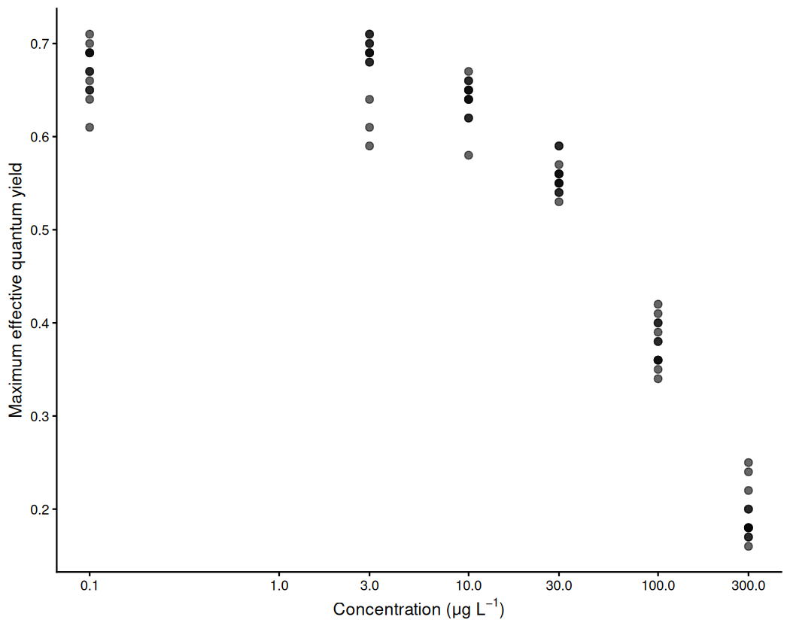
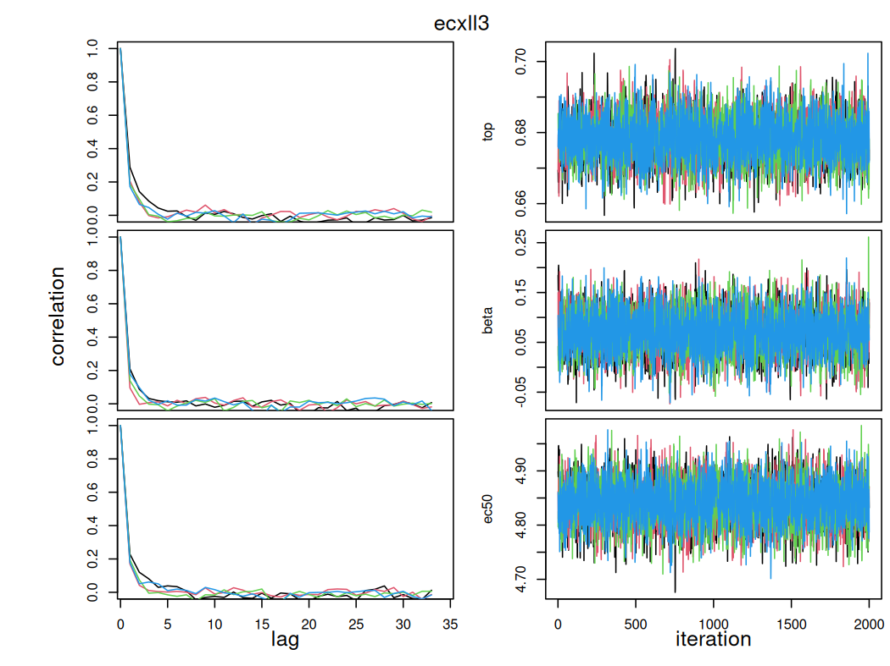
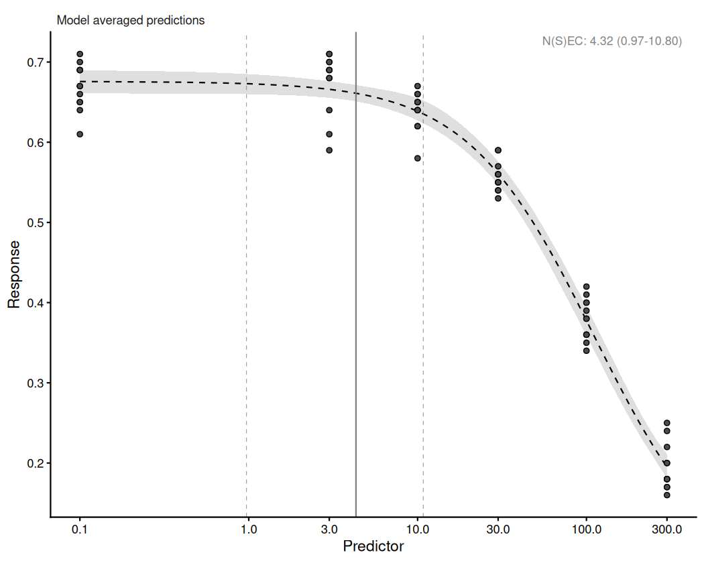
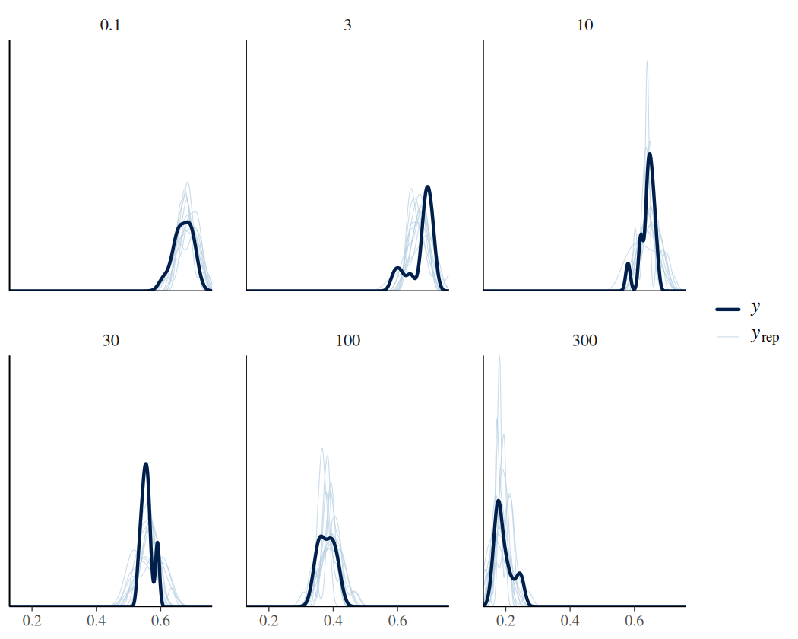
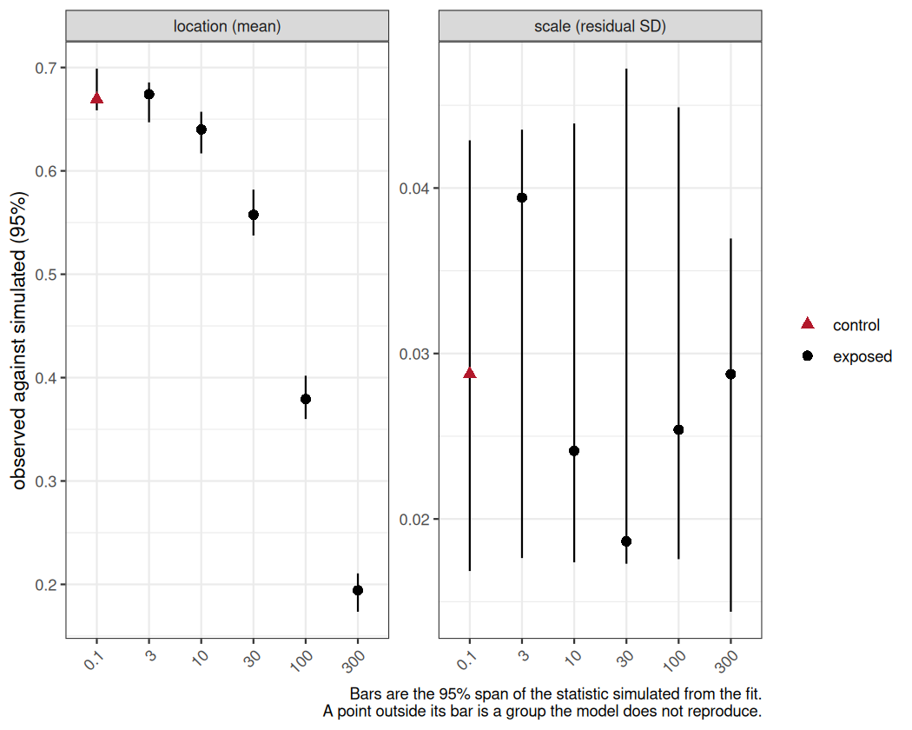
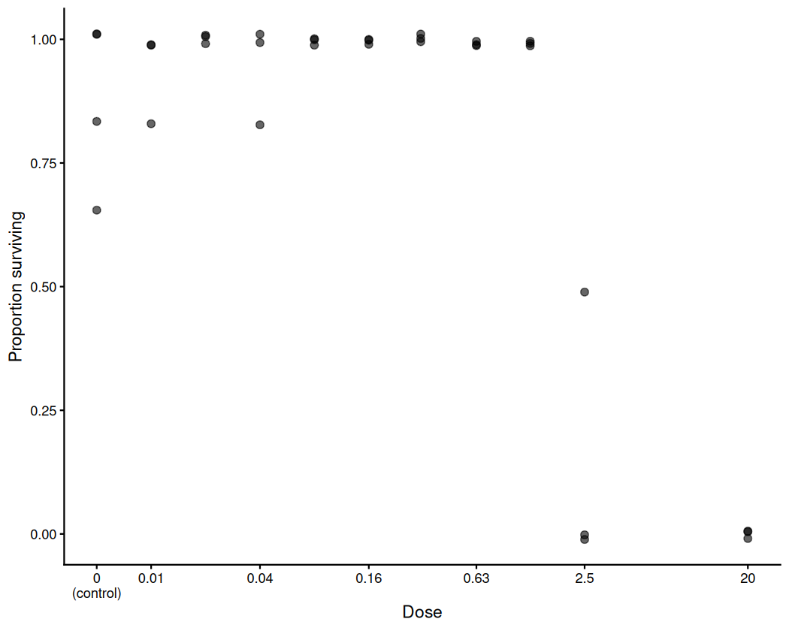

# Overview

The other vignettes each explain one part of `bayesnec`: what the model set is,
what a `bayesmanecfit` is, how priors are built, how to handle a two-block
response. One analysis is run here from data to reportable estimate, in the order
the steps occur.

The workflow is:

1. Prepare the data and choose the family.
2. Fit the candidate set.
3. Check the sampler, and screen out the models that did not sample adequately.
4. Check the fit of the models that remain.
5. Report.

A prior check belongs between steps 2 and 3. [*Priors*](https://open-aims.github.io/bayesnec/articles/example3.html) covers
`check_priors()` and the construction of the defaults.

## The assumptions the diagnostics test

Convergence is what a Bayesian fit is usually judged on, and it is not the only
thing that can be wrong. `rhat()`, `check_chains()` and `check_sampling()` ask
whether the sampler explored the posterior. `loo` and `waic` rank the candidate
equations against one another. None of them asks whether the variability the
fitted model implies matches the variability in the data, and a threshold
estimate depends on that assumption more than on any other.

*NSEC* depends on it most directly. `nsec()` sets its reference at a quantile of the
posterior of the control mean, and the width of that posterior is set by the
dispersion the fit estimated at the control. A model simulating more variability
at the control than the data show places the reference lower, so the curve
crosses it further along and the reported concentration is higher and less
protective. A model simulating less variability places the reference higher and
returns a lower concentration. The direction is not
known in advance, and no convergence diagnostic reveals it. [*Single model usage*](https://open-aims.github.io/bayesnec/articles/example1.html)
makes the same point for the choice between constant and non-constant dispersion.
ECx depends on it less, being read from the fitted curve relative to that curve's own
asymptotes: an error in the variance widens or narrows its interval rather than
relocating it.

One statistic for the whole fit does not detect this. Every family with a free
dispersion parameter --- `gaussian`, `Gamma`, `negbinomial`, `Beta` and
`beta_binomial` --- estimates that parameter from the same residuals such a
statistic summarises. The parameter absorbs the discrepancy, so the fit reports a
ratio near 1 while simulating the wrong spread at the concentrations that
determine the estimate. The check is therefore made within concentration
groups, which is what `check_fit()` does.

## The effect of exclusion

[*Multi model usage*](https://open-aims.github.io/bayesnec/articles/example2.html) notes that there is little harm in leaving a poorly
*shaped* model in the set with a low weight. That holds for shape and it does not
hold for convergence. A model that has not sampled contributes to the averaged
prediction on the strength of a posterior the sampler never explored, and its
weight is computed from that same posterior, so the weight is no evidence that
keeping it is safe. Removing it changes the candidate set, and `amend()` then
recomputes the weights across what remains rather than rescaling those retained,
so the reported *N(S)EC* changes with it.

Which models a screen removes is not predictable before it is run, and the
reasons differ between them. An equation given too few draws, an equation whose
posterior the sampler cannot traverse, and an equation the design does not
support are all reported as the same value in the same column. The right response
to each is different.

## Coverage

Steps 1 to 5 are worked in full on one dataset. A count response follows, for
which the family question and the sampler screen both take a different form.

The threshold estimates themselves --- *NEC*, *NSEC*, ECx, and the
model-averaged *N(S)EC* reported when a set mixes both kinds --- are defined in
[*Model details*](https://open-aims.github.io/bayesnec/articles/example2b.html), together with the candidate equations.


``` r
library(bayesnec)
library(ggplot2)
```

# 1. Data preparation and family choice

The `herbicide` data record the maximum effective quantum yield of coral symbionts exposed
to each of seven herbicides [@jones2003]. `?herbicide` documents the columns and
the provenance of the response. `simazine` is the series worked here.


``` r
data(herbicide)
simazine <- herbicide[herbicide$herbicide == "simazine", ]
head(simazine)
#>    herbicide concentration fvfm
#> 6   simazine           0.1 0.69
#> 13  simazine           0.1 0.71
#> 20  simazine           0.1 0.66
#> 27  simazine           0.1 0.65
#> 34  simazine           0.1 0.67
#> 41  simazine           0.1 0.64
```

The response, `fvfm`, is a ratio of chlorophyll fluorescence yields. It is
bounded by 0 and 1 and it is continuous, which is the `Beta` case rather than
the `binomial` one: a proportion of this kind is not a count of successes out of
a known number of trials, and there is no denominator to supply.


``` r
conc_breaks <- c(0.1, 1, 3, 10, 30, 100, 300)
ggplot(simazine, aes(x = concentration, y = fvfm)) +
  geom_point(size = 2, alpha = 0.6) +
  scale_x_continuous(transform = "log", breaks = conc_breaks) +
  labs(x = expression(paste("Concentration (", mu, "g ", L^-1, ")")),
       y = "Maximum effective quantum yield") +
  theme_classic()
```

<div class="figure" style="text-align: center">

<p class="caption">plot of chunk exmp9-data</p>
</div>

The first step of any analysis is to look at the data before fitting anything.
The response is flat across the two
lowest concentrations, declines from 3
onwards, and is still falling at the highest concentration tested.

The series has 6 distinct
concentrations. That is the number of points from which a curve's shape has to
be identified, and it is a constraint on which equations the design can
support.

The curve does not reach a floor. Mean yield at the highest concentration is
0.194
against 0.669
at the lowest, so the decline is incomplete and the lower asymptote of any
four-parameter equation is estimated by extrapolation rather than observation.

No value lies on a boundary, which matters because a `Beta` response is supported on the open
interval (0, 1), so a value recorded as exactly 0 or 1 lies outside the family's
support. `bayesnec` substitutes for both: a zero becomes one tenth of the
smallest non-zero value, which is relative to the scale of the response, and a
one is reduced by an absolute 0.001. A series with several concentrations at a
boundary is then being modelled through that substitution rather than as
recorded.


``` r
range(simazine$fvfm)
#> [1] 0.16 0.71
```

`simazine` reaches neither boundary. Several of the other herbicides in this
dataset do: `irgarol` records ten zeros, eight of its twelve replicates at the
highest concentration, so the family cannot be chosen without inspecting the
response. Where zeros are part of the process rather than a recording
floor, see [*Hurdle and zero-inflated concentration-response models*](https://open-aims.github.io/bayesnec/articles/example6.html), which covers the families that
model them explicitly.

## The scale of the response

Choosing a family is a statement about what kind of quantity the response is:
the values it can take, the bounds it cannot cross, and how its variance behaves
as its mean changes. A proportion measured on a continuous scale, a count of
successes out of a known number of trials, and a strictly positive measurement
are three different kinds of quantity, and each has a family that can represent
it. [*Single model usage*](https://open-aims.github.io/bayesnec/articles/example1.html) sets out the families `bayesnec` supports and what
each assumes.

The question therefore takes a different form for each kind of response, and
`bayesnec` provides a different check for each. Here the response is a
continuous proportion, so the family is `Beta`, and the two things to establish
are whether any value lies outside its support and whether its variance needs a
free parameter.

`Beta` estimates a dispersion parameter, `phi`, from the data. There is
therefore no over-dispersion decision to take: the family already has a free
parameter for the spread, and the fit will estimate it. `dispersion()` is
defined only for `poisson` and `binomial`, the two families whose variance is
fixed by the mean, and returns an empty vector otherwise. For those families a
pre-fit screen is available, and it is run on
[the count response](#a-count-response).

What has to be checked is the one thing `Beta` cannot accommodate, which is a
value outside its support. `bnec_record()` reports after the fit whether anything
was altered.


``` r
fam <- Beta(link = "identity")
```

`bnec()` sets `link = "identity"` by default on every family, so that `top`,
`bot` and `nec` are estimated on the scale of the response and remain directly
interpretable. It is written out above for clarity; passing the family as a bare
string has the same effect. A user who supplies a family object with a different
link --- `Beta(link = "logit")` --- overrides that default, and the model then
fits a non-linear curve to the logit of the mean rather than to the mean.
`bnec()` accommodates this by dropping the equations that are invalid on a link
scale, but the parameters are no longer on the response scale. See
[*Single model usage*](https://open-aims.github.io/bayesnec/articles/example1.html).

## The scale of the predictor

The concentrations run from 0.1 to
300, a factor of
3000, in roughly
even steps on a logarithmic scale. The predictor is logged in the formula.

The predictor enters the equations directly, so a transform changes the shape
being fitted and not merely the axis: the same equation describes a different
curve in `concentration` and in `log(concentration)`. The default priors are
also scaled from the predictor, so a transform rescales them. Neither consideration
settles the question in general, and which scale samples better on a given
dataset is an empirical matter. Here the series was designed as a logarithmic
dilution, and a logarithm is what makes its steps even.

A logged predictor spanning
-2.3 to
5.7 takes negative values, which
excludes the equations that raise the predictor to a fractional power.
And every estimate is returned on the logged scale unless `xform` is supplied.

# 2. Fitting the candidate set

The whole `decline` set is fitted in one call, under the family chosen in step 1.


``` r
fit_reduced <- bnec(fvfm ~ crf(log(concentration), model = "decline"),
                    data = simazine, family = fam,
                    iter = 4000, chains = 2, seed = 17)
```

The sampler settings above are deliberately below `bnec()`'s defaults, and that
is a decision made for this document rather than advice.

Compare the retained draws and not `iter`. `iter` counts warmup as well as
sampling, and the fraction discarded is a choice each package makes for itself.
`bayesnec` takes `chains = 4` and `iter = 1e4`, and sets `warmup` to
`floor(iter / 5) * 4`, discarding four fifths and retaining 8000 draws. The call
above sets `iter` to 4000 with two chains, and the same warmup rule leaves
1600. The two `iter` values differ by a factor of
2.5 and the draws they retain by a factor of
5. For comparison, `brms` discards
half rather than four fifths, so its own defaults of `iter = 2000` over four
chains retain 4000 --- more than this call, from a quarter of the iterations.
A number of iterations means nothing until the warmup rule and the chain count
are stated beside it.

These data are well behaved at the defaults, and every equation the design
supports passes the screen there, so a fit made at the defaults produces no
screen failure to examine. Running short guarantees that some
equations fail, which is what makes steps 3 and 5 a demonstration rather than an
assertion. The settings are raised to the defaults in step 3, and every estimate
reported in step 5 comes from the fit made there.

Running short is done here to produce a screen failure to examine, and is not
something an analysis should copy. Where a fit is genuinely marginal, two
arguments are the ones to reach for:

- `iter` and `warmup`. A model with a poorly identified parameter may need more
  draws. Raise `iter` first when Rhat is marginal or the effective sample size
  is low.
- `control = list(adapt_delta = 0.99, max_treedepth = 12)`. Raise `adapt_delta`
  when there are divergent transitions; raise `max_treedepth` when the sampler
  reports hitting it. Both increase runtime and neither corrects a misspecified
  model.

## The set as fitted

`model = "decline"` requests the equations that describe a declining response,
of which there are 14 currently in `bayesnec`. The
remaining equations in the package describe hormesis, a response that rises
above the control before it falls. There is no evidence of hormesis in these
data, so they are not considered here. Two mechanisms then reduce it from this
original set. Some equations are excluded before fitting, because they are invalid
for the family or the predictor; [*Model details*](https://open-aims.github.io/bayesnec/articles/example2b.html) sets out the equations and
the rules that govern them. Others are attempted and fail to fit, which happens
with complex non-linear models, and particularly with those that have many
parameters.

`bnec_record()` reports both, so neither has to be reconstructed from the fitted
object:


``` r
rec <- bnec_record(fit_reduced)
rec$excluded
#>     model
#> 1  neclin
#> 2  ecxlin
#> 3 ecxsigm
#>                                                                                         reason
#> 1         decays by subtraction, so its mean is unbounded below for beta with an identity link
#> 2         decays by subtraction, so its mean is unbounded below for beta with an identity link
#> 3 raises the predictor to a fractional power, which is undefined for negative predictor values
rec$attempted
#>  [1] "nec3param" "nec4param" "ecxexp"    "ecx4param" "ecxwb1"    "ecxwb2"    "ecxwb1p3"  "ecxwb2p3" 
#>  [9] "ecxll5"    "ecxll4"    "ecxll3"
```

`requested` is partitioned exactly by `attempted` and `excluded$model`. An
equation that was attempted and failed to fit stays in `attempted`.

Two rules apply here. `neclin` and `ecxlin` decay by subtraction rather than by
an exponential factor, so their fitted mean is unbounded below and cannot be
held inside the (0, 1) interval a `Beta` mean occupies under an identity link.
And the predictor is `log(concentration)`, which is negative below a
concentration of 1, so the equations that raise the predictor to a fractional
power cannot be evaluated; `ecxsigm` is among them. `?models` sets out these
rules and the others.

`failed_models()` names the equations that were attempted and did not fit, and
records the priors and initial values each was given, which are built inside
`bnec()` and otherwise unrecoverable:


``` r
names(failed_models(fit_reduced))
#> NULL
```

Every equation the design admits was fitted at these settings, so there is
nothing to report here.


``` r
rec$substitutions
#> NULL
```

`substitutions` reports the changes `check_data()` made to the response because
the family cannot represent a value as recorded. It is `NULL` here, which is the
evidence for the boundary check in step 1: the response was fitted as recorded,
with nothing shifted off a boundary. On a series that does reach 0 or 1 this
element names each altered value, so a methods section can state what was
modelled rather than leaving a reader to assume it was the data as measured.

A methods section has to state the equations requested, those excluded before
fitting and why, and any change made to the response. `bnec_record()` returns
each of them, so a knitted document records them without depending on console
output.

## Model weights

`summary()` reports the set as a whole.


``` r
summary(fit_reduced)
#> Object of class bayesmanecfit
#> 
#>  Family: beta  
#>   Links: mu = identity  
#> 
#> Number of posterior draws per model:  1600
#> 
#> Model weights (Method: pseudobma_bb_weights):
#>              waic   wi
#> nec3param -274.13 0.00
#> nec4param -270.07 0.00
#> ecxexp     -97.54 0.00
#> ecx4param -303.78 0.15
#> ecxwb1    -303.35 0.12
#> ecxwb2    -294.78 0.02
#> ecxwb1p3  -294.45 0.02
#> ecxwb2p3  -298.19 0.05
#> ecxll5    -303.81 0.15
#> ecxll4    -304.13 0.18
#> ecxll3    -304.92 0.31
#> 
#> 
#> Summary of weighted N(S)EC posterior estimates:
#> NB: Model set contains a combination of ECx and NEC
#>     models, and is therefore a model averaged
#>     combination of NEC and NSEC estimates.
#>        Estimate Q2.5 Q97.5
#> N(S)EC     1.44 0.22  2.41
#> 
#> 
#> Bayesian R2 estimates:
#>           Estimate Est.Error Q2.5 Q97.5
#> nec3param     0.96      0.00 0.96  0.96
#> nec4param     0.96      0.00 0.96  0.96
#> ecxexp        0.48      0.06 0.35  0.57
#> ecx4param     0.98      0.00 0.97  0.98
#> ecxwb1        0.98      0.00 0.97  0.98
#> ecxwb2        0.97      0.00 0.97  0.97
#> ecxwb1p3      0.97      0.00 0.97  0.97
#> ecxwb2p3      0.97      0.00 0.97  0.97
#> ecxll5        0.98      0.00 0.97  0.98
#> ecxll4        0.98      0.00 0.97  0.98
#> ecxll3        0.98      0.00 0.97  0.98
```

`wi` is the model weight: the share of the model-averaged prediction each
candidate contributes, summing to one across the set. The weights come from
PSIS-LOO --- `loo_model_weights()` consumes the `loo` objects `brms` computes
for each fit --- and where a model reports Pareto *k* values above 0.7 for a few
observations, `brms` warns and those warnings are suppressed in the chunk
options. The weights are usable and the estimates behind them are flagged as
unreliable at those points, which belongs in a methods statement alongside the
weights themselves.

# 3. Sampler diagnostics and screening

Every equation in the fitted set produced draws; the ones that did not are in
`failed_models()`. The diagnostics here establish whether those draws describe
the posterior adequately. Whether a model fits the data is a separate question,
answered in step 4.

`check_sampling()` reports per candidate model, so the whole set is screened in
one call rather than model by model.


``` r
check_sampling(fit_reduced)
#>        model max_rhat   min_ess min_ess_ratio n_divergent failed
#> 1  nec3param 1.001990 642.73715    0.40171072           0  FALSE
#> 2  nec4param 1.004450 445.24592    0.27827870           0  FALSE
#> 3     ecxexp 1.006129 747.36202    0.46710126           0  FALSE
#> 4  ecx4param 1.010773 359.18327    0.22448954           0   TRUE
#> 5     ecxwb1 1.011074 378.43216    0.23652010           0   TRUE
#> 6     ecxwb2 1.010926 484.52274    0.30282671           0   TRUE
#> 7   ecxwb1p3 1.001416 722.29490    0.45143432           0  FALSE
#> 8   ecxwb2p3 1.002646 772.37795    0.48273622           0  FALSE
#> 9     ecxll5 1.015624  57.81288    0.03613305          33   TRUE
#> 10    ecxll4 1.005792 266.89352    0.16680845           0   TRUE
#> 11    ecxll3 1.003542 785.63696    0.49102310           0  FALSE
```

The table gives one row per fitted model, with three diagnostics: the largest
Rhat, the smallest effective sample size, and the number of divergent
transitions. Each is compared against a cutoff, and `failed` is `TRUE` where any
of the three is missed.

The cutoffs are arguments to `check_sampling()` and can be changed. The Rhat
default of 1.01 and the ESS default of
400 follow published recommendations [@Vehtari2021]; the divergence default of
10 does not. Stan's own guidance is that *any* divergence means the sampler
failed to explore the posterior. The default of ten is a package convention
rather than a published recommendation: these non-linear models commonly produce
a small number of divergent transitions near a parameter boundary, as described
in `?check_sampling`. The value 1.01 is the `bayesnec` default
throughout: `rhat()`, `summary()` and `check_sampling()` agree on it.

Read `min_ess` rather than `min_ess_ratio` when deciding. The 400 is an absolute
floor, below which the Rhat and ESS estimates are themselves unreliable, and it
corresponds to 100 draws per chain at the four chains `bnec()` fits by default.
Both the ESS and the divergence cutoffs are absolute counts, and the number of
draws changes what each of them demands --- in opposite directions. At the
1600 draws retained here a model must reach an
efficiency ratio of 0.250
to clear 400, against 0.050 at the default 8000, so the
ESS cutoff is harder to clear at these settings. Ten divergent transitions, on
the other hand, is 0.62
per cent of the retained draws here and 0.125 per
cent at the default. At an equal divergence rate the same fit therefore produces
more of them at the defaults, and the divergence cutoff is harder to clear
there.
Neither setting is uniformly stricter, and a screen result is therefore a
property of the settings as much as of the model. It is always important to
state the settings used.

The ratio is reported beside the count because it answers a different question
from the one the cutoff answers: it separates a model that cleared 400 because
many draws were taken from one that cleared it efficiently, and it is what
reveals a heavily thinned fit. `?check_sampling` sets out the distinction. The
decision is taken on `min_ess`; the ratio is read alongside it.

## Kinds of failure

The three kinds of failure are distinguished by which thresholds an equation
missed, and whether divergent transitions are among them.


``` r
cs <- check_sampling(fit_reduced)
failed <- cs[cs$failed, c("model", "max_rhat", "min_ess", "n_divergent")]
failed
#>        model max_rhat   min_ess n_divergent
#> 4  ecx4param 1.010773 359.18327           0
#> 5     ecxwb1 1.011074 378.43216           0
#> 6     ecxwb2 1.010926 484.52274           0
#> 9     ecxll5 1.015624  57.81288          33
#> 10    ecxll4 1.005792 266.89352           0
```

An equation that misses the effective sample size or Rhat threshold with no
divergent transitions has been sampled from a posterior the sampler could
traverse. It was not sampled for long enough to describe that posterior, and both
diagnostics are themselves estimated less precisely from fewer draws. Refitting
with a higher `iter` is what such an equation needs, and it is expected to pass
once it has them, so excluding it on this evidence would be premature.

Divergent transitions are different, because they describe the posterior rather
than the run. A divergence is recorded when the sampler's trajectory through
parameter space goes numerically unstable, which happens where the posterior has
curvature too sharp for the step size adapted during warmup. Taking more draws
samples the same surface for longer and does not smooth it. Where such an equation is also the most heavily parameterised in
the set, the usual explanation is that the design does not support it:


``` r
n_par <- vapply(cs$model, function(m) length(names(show_params(m)[[1]]$pforms)),
                integer(1))
data.frame(model = cs$model, parameters = n_par, failed = cs$failed,
           row.names = NULL)
#>        model parameters failed
#> 1  nec3param          3  FALSE
#> 2  nec4param          4  FALSE
#> 3     ecxexp          2  FALSE
#> 4  ecx4param          4   TRUE
#> 5     ecxwb1          4   TRUE
#> 6     ecxwb2          4   TRUE
#> 7   ecxwb1p3          3  FALSE
#> 8   ecxwb2p3          3  FALSE
#> 9     ecxll5          5   TRUE
#> 10    ecxll4          4   TRUE
#> 11    ecxll3          3  FALSE
```

`ecxll5` has 5 curve
parameters, the most of any equation in this set, and the `Beta` dispersion
parameter `phi` is estimated alongside them. The series has
6 distinct concentrations. The
parameter that distinguishes `ecxll5` from `ecxll4` is `f`, an exponent
governing the asymmetry of the curve, and asymmetry is identified from the shape
of the shoulder, which a series of
6 concentrations with an incomplete
lower limb does not resolve. Adjusting the settings further to retain an equation
in that position does not address the problem: the fit is not failing because it
was run badly, but because the experiment does not contain the information the
equation needs. Report it as excluded, and say why.

Where an equation's Rhat or effective sample size sits at the threshold, which
side of it the equation falls on is sensitive to the seed, and another run may
place it on the other side. Any threshold applied to an estimated quantity
behaves this way. It is why the thresholds have to be reported with the result,
and why the screen's message names every threshold an equation missed rather than
only the first.

## Screening the model set

Only models that pass the sampler diagnostics are retained. The screen reads the
sampler and nothing else: whether an equation reproduces the data is a separate
question, and removing an equation for that silently would hide the
discrepancies the fit checks exist to show.


``` r
screened_reduced <- screen_models(fit_reduced)
#> Dropping 5 of 11 candidate models that failed the sampler screen:
#>   -  ecx4param: Rhat 1.011, ESS 359.2
#>   -  ecxwb1: Rhat 1.011, ESS 378.4
#>   -  ecxwb2: Rhat 1.011
#>   -  ecxll5: Rhat 1.016, ESS 57.8, 33 divergent transitions
#>   -  ecxll4: ESS 266.9
#> Fitted models are: nec3param nec4param ecxexp ecxwb1p3 ecxwb2p3 ecxll3
```

`screen_models()` runs the same diagnostics as `check_sampling()`, drops what
failed, and reports which models were removed and why: one line per model,
naming every threshold it missed rather than only the first. An exclusion step
that leaves no record is not reproducible, which is why the message is on by
default and why `quiet = TRUE`, which suppresses it, should not be used in an
analysis that will be reported.

If every candidate fails, `screen_models()` stops with an error listing the
reasons rather than returning a meaningless average, which signals a return to
step 2 rather than a loosened threshold. If none fails, it says so and returns
the set unchanged.

`amend()` does the work, and it is the only route by which a model leaves a
`bayesmanecfit`. The weights of a screened set therefore have to be read from the
screened fit rather than rescaled by hand.

## Raising the settings

The screen has identified the equations that did not sample adequately. For those that
reported no divergent transitions, the remedy is the one step 2 deferred: fit
again at `bnec()`'s defaults.


``` r
fit <- bnec(fvfm ~ crf(log(concentration), model = "decline"),
            data = simazine, family = fam, seed = 17)
```


``` r
check_sampling(fit)
#>        model max_rhat  min_ess min_ess_ratio n_divergent failed
#> 1  nec3param 1.001419 3154.473     0.3943091           0  FALSE
#> 2  nec4param 1.001943 1743.866     0.2179833           3  FALSE
#> 3     ecxexp 1.000742 3681.209     0.4601511           0  FALSE
#> 4  ecx4param 1.001910 2176.799     0.2720998           0  FALSE
#> 5     ecxwb1 1.000661 1868.897     0.2336121           0  FALSE
#> 6     ecxwb2 1.001944 1554.556     0.1943195          13   TRUE
#> 7   ecxwb1p3 1.001560 3783.128     0.4728910           0  FALSE
#> 8   ecxwb2p3 1.000465 3772.512     0.4715640           0  FALSE
#> 9     ecxll4 1.000844 2147.015     0.2683769           0  FALSE
#> 10    ecxll3 1.000374 3507.633     0.4384542           0  FALSE
```


``` r
names(failed_models(fit))
#> [1] "ecxll5"
```

Of the 5 equations the screen removed at the reduced settings, 3 now pass, on the same data and the same priors, because they were given more draws. Their failures were failures of the run, and more draws corrected them.

The screen still removes ecxwb2, and on divergent transitions rather than on Rhat or effective sample size, which are estimated more precisely from more draws. This is the second kind of failure, the one that describes the posterior rather than the run: more sampling does not change the curvature the sampler could not traverse. The divergence cutoff is an absolute count, so a longer run
reports proportionally more divergences at an unchanged rate --- raising the
settings makes this failure easier to see, not harder.

And ecxll5 now fails to fit at all. More sampling did not make it fit, and would not be expected to: an equation with more free parameters than the design can determine has a posterior that is flat in some direction, and sampling a flat direction for longer does not locate a maximum that is not there. This is the third kind of failure, the one the parameter count anticipated.

The priors and initial values `ecxll5` was given are retained on the failed fit,
and are the starting point for an adjustment if one is wanted, as
`?failed_models` sets out:


``` r
f <- failed_models(fit)[[1]]
f$prior                                   # the priors that failed
# Widen the prior that pinned the fit, then retry with the edited model.
new_prior <- f$prior
new_prior$prior[new_prior$nlpar == "beta"] <- "normal(0, 5)"
bnec(fvfm ~ crf(log(concentration), model = names(failed_models(fit))[1]),
     data = simazine, family = fam, prior = new_prior)
```

[*Priors*](https://open-aims.github.io/bayesnec/articles/example3.html) covers how the defaults are built and what a sensible
adjustment looks like. It is not attempted here: a prior wide enough to let
`ecxll5` fit would be doing the work the data cannot, and the estimate it
produced would be a property of that prior.

Fitting twice, once short and once at the defaults, is what separates the three
kinds of failure from one another. One fit cannot: an equation that missed a
cutoff might have passed with more draws, and the table alone does not say which
would have. A methods statement has the same difficulty. Saying that some
equations exceeded a cutoff leaves open whether more sampling would have changed
that, and saying that the sampling was increased and reporting which equations
then passed does not.

The set used from this point is the one fitted at the defaults, and every
estimate reported in steps 4 and 5 comes from it.


``` r
fit_screened <- screen_models(fit)
#> Dropping 1 of 10 candidate models that failed the sampler screen:
#>   -  ecxwb2: 13 divergent transitions
#> Fitted models are: nec3param nec4param ecxexp ecx4param ecxwb1 ecxwb1p3 ecxwb2p3 ecxll4 ecxll3
```

Chain mixing has to be inspected as well, and for every equation rather than for
the worst one. Poor mixing occurs at an acceptable Rhat, and there is no
established scalar that detects what rank-normalised split-Rhat and bulk and
tail effective sample size miss.


``` r
# One equation is shown here as an example. check_chains() on the whole set
# writes one page per model to a file, which is the form worth archiving.
check_chains(pull_best(fit_screened))
```

<div class="figure" style="text-align: center">

<p class="caption">plot of chunk exmp9-chains</p>
</div>

Each row is one parameter of the equation. The right column is the trace, one
line per chain, and the left column is the autocorrelation of each chain against
lag. What to look for in the trace: chains overlapping one another across its
whole width, with no drift and no excursion that one chain makes and the others
do not. A chain that wanders into a region the others never visit is the visual
form of a failed Rhat. In the autocorrelation, look for a fall to near zero
within a few lags; a slow decay is the visual form of a low effective sample
size. These chains overlap throughout and their autocorrelation is gone by about
the fifth lag.

For the whole set, `check_chains()` takes a filename and writes one page per
model, which keeps the output out of a report while leaving a record that can be
inspected and archived:


``` r
check_chains(fit_screened, filename = "simazine_check_chains")
```


``` r
# autoplot() returns the predictor on the scale it was recorded on, having
# back-transformed the log the formula applied, so the spacing is asked of the
# scale and the breaks are the measured concentrations. Transforming the breaks
# instead would relabel the axis without respacing it.
autoplot(fit_screened) +
  scale_x_continuous(transform = "log", breaks = conc_breaks)
```

<div class="figure" style="text-align: center">

<p class="caption">plot of chunk exmp9-plot-after</p>
</div>

The averaged curve with its credible band, over the retained set, with the
model-averaged *N(S)EC* marked. `autoplot()` back-transforms both the predictor
and the annotation, so the axis is in the units the experiment was run in even
though the fit used `log(concentration)`, and the marked value is the one step 5
reports with `xform = exp`. The band should contain the bulk of the observations
and widen where the data are sparse; a band that excludes whole groups is a fit
problem rather than a sampler one, and belongs to step 4.

# 4. Fit diagnostics

The sampler diagnostics indicate whether the sampler explored the posterior
adequately. They say nothing about whether the model fits. Two checks answer
different questions: `pp_check()` overall, and `check_fit()` within
concentration groups.

Both checks are applied to the highest-weighted model of the screened set, which
contributes most to the reported estimate and is therefore the one whose fit
matters most. `pull_best()` returns it as a `bayesnecfit`, and returns a
`bayesnecfit` unchanged, so a set that the screen reduced to a single equation
needs no separate handling.


``` r
best_fit <- pull_best(fit_screened)
#> Highest-weighted model is ecxll3, holding 0.35 of the weight of 9 candidate models.
#> Pulling out model(s): ecxll3
```

The weight is reported with the number of candidates it was selected from,
because the two together are what say whether the selection means anything. The
highest weight of a flat set of ten is little more than the equal share of 0.1,
and one such equation describes the model-averaged estimate hardly at all. Read
it against the weights `summary()` reported in step 2.

`pp_check()` asks whether data simulated from the fitted model resemble the data
observed. Pooled over the whole dataset the comparison is weak for
concentration-response data, because a model can match the pooled distribution
while being wrong at every concentration, so it is grouped by the predictor
here:


``` r
pp_check(best_fit, type = "dens_overlay_grouped", group = "concentration")
```

<div class="figure" style="text-align: center">

<p class="caption">plot of chunk exmp9-ppcheck</p>
</div>

The dark line is the observed density of the response within each concentration
group and the light lines are the same quantity simulated from the fit. The
response is continuous, so a density overlay is the appropriate display; a
discrete response takes `type = "bars_grouped"` instead, which is what the count
response uses.

The fit reproduces these data well. The observed density lies within the spread
of the simulated ones in all 6 panels,
and its location follows the decline, from a mode near
0.67
at the lowest concentration to
0.19
at the highest. The observed curves are the more irregular of the two, with a
secondary bump in several panels; that is a property of a kernel density
estimated from 12
observations, which resolves individual values as separate modes, and not
evidence against the fit.

The display shows location, and no panel departs from it. Width is harder to
judge by eye from 12
observations per group, and it is where these data do depart from the fit: in one
panel the observed density is visibly narrower than the simulated ones.
`check_fit()` identifies the group and puts a number on it.

`check_fit()` tests something narrower: whether the model reproduces the
observed variability and the observed level *locally*, within each concentration
group, with the control flagged.

The control is the lowest value of the predictor, which is `bayesnec`'s
convention throughout. `check_fit()` flags that group, and both estimators read
their reference from the posterior of the fitted mean there: `nsec()` sets its
significance reference from it, and since version 2.2 every ECx is measured from
it as well. Control variability therefore propagates into every threshold the
analysis reports, not only the no-effect concentration. An experiment whose
lowest treatment is not a control is being analysed on that assumption and
should say so.

Identifying the control by its position rather than by its value keeps the
convention intact under a common preparation. Analysis is often done on a log
scale,
and a small constant is added to the concentrations so that a zero control can be
plotted and fitted there. Whether the control is entered as 0, or as 0.001, or as
one tenth of the lowest exposure, it remains the lowest value in the series and
is therefore still the control. These data have no zero concentration, so the
question does not arise; the lowest tested concentration is the reference.

For a `bayesmanecfit` it returns every group of every candidate model, which is
more than can be read at once. Two views are useful. The first is the control
row of each model, which is the row both estimators read their reference from.


``` r
cf <- check_fit(fit_screened)
cf[cf$control, ]
#>        model    wi group  n obs_mean sim_mean mean_ratio ppp_mean obs_sd sim_sd sd_ratio ppp_sd
#> 1  nec3param 0.000   0.1 12    0.669    0.662      1.011    0.257  0.029  0.035    0.815  0.795
#> 7  nec4param 0.000   0.1 12    0.669    0.661      1.012    0.256  0.029  0.036    0.801  0.824
#> 13    ecxexp 0.000   0.1 12    0.669    0.741      0.903    0.947  0.029  0.107    0.270  1.000
#> 19 ecx4param 0.238   0.1 12    0.669    0.675      0.992    0.695  0.029  0.028    1.011  0.478
#> 25    ecxwb1 0.110   0.1 12    0.669    0.678      0.987    0.803  0.029  0.028    1.012  0.480
#> 31  ecxwb1p3 0.021   0.1 12    0.669    0.686      0.976    0.927  0.029  0.030    0.966  0.555
#> 37  ecxwb2p3 0.065   0.1 12    0.669    0.666      1.005    0.370  0.029  0.030    0.950  0.585
#> 43    ecxll4 0.216   0.1 12    0.669    0.675      0.992    0.708  0.029  0.028    1.011  0.481
#> 49    ecxll3 0.350   0.1 12    0.669    0.678      0.987    0.807  0.029  0.028    1.015  0.476
#>    control
#> 1     TRUE
#> 7     TRUE
#> 13    TRUE
#> 19    TRUE
#> 25    TRUE
#> 31    TRUE
#> 37    TRUE
#> 43    TRUE
#> 49    TRUE
#> 
#> The control group is flagged. nsec() reads its reference from the 
#> control, so this is the row most likely to move a reported 
#> no-effect concentration. See ?check_fit.
```

This table shows what a binomial response near total mortality cannot: a
continuous response has genuine residual variability at every concentration, so
`obs_sd`, `sim_sd` and the ratio between them are all finite and informative, and
`ppp_sd` is not forced to 0 or 1 by construction. With
12 replicates at the
control the statistics are estimated from a reasonable number of observations
rather than from three or four.

Read `ppp_mean` and `ppp_sd` rather than the ratios. The posterior predictive
p-value is `mean(sim >= obs)`, so a value near 0.5 says the observed statistic
sits in the middle of what the model simulates and a value near 0 or 1 says it
sits in a tail. `?check_fit` records the case in which a model holds high weight
because it fits the bulk of the curve while fitting the control badly, which is
what this view is for.

The second view is the full table for a single model, read when one candidate is
in question:


``` r
cf_best <- check_fit(best_fit)
cf_best
#>   group  n obs_mean sim_mean mean_ratio ppp_mean obs_sd sim_sd sd_ratio ppp_sd control
#> 1   0.1 12    0.669    0.678      0.987    0.807  0.029  0.028    1.015  0.476    TRUE
#> 2     3 12    0.674    0.666      1.012    0.196  0.039  0.029    1.337  0.089   FALSE
#> 3    10 12    0.640    0.637      1.005    0.378  0.024  0.029    0.826  0.787   FALSE
#> 4    30 12    0.557    0.559      0.996    0.580  0.019  0.030    0.613  0.964   FALSE
#> 5   100 12    0.379    0.382      0.992    0.600  0.025  0.030    0.840  0.773   FALSE
#> 6   300 12    0.194    0.192      1.011    0.413  0.029  0.024    1.194  0.232   FALSE
#> 
#> One or more groups show a posterior predictive p-value beyond 
#> [0.05, 0.95]. See ?check_fit.
```

Location is reproduced at every concentration: `mean_ratio` runs from
0.987 to
1.012, and no `ppp_mean` is near either
bound. The departure is in scale, and it is what the message reports. At a
concentration of 30
the observed spread is
0.61 times
what the model simulates, on
12 observations,
at which a residual standard deviation is not well determined.

The control row is the one the Overview singled out, because `nsec()` reads its
reference from the posterior of the control mean and the width of that posterior
is the dispersion estimated there. It is among the closest to agreement of any
group, at a `sd_ratio` of
1.015 and a `ppp_sd` of
0.476. The assumption the *NSEC*
depends on most is supported at the concentration where it matters.


``` r
plot(cf_best)
```

<div class="figure" style="text-align: center">

<p class="caption">plot of chunk exmp9-checkfit-plot</p>
</div>

The plot shows what the table does not: the magnitude and direction of any
discrepancy. Each panel gives the observed statistic against the 95% span of what
the model simulates; a point outside its bar is a group the model does not
reproduce. Location and scale are separate panels because they fail
independently. A model can reproduce every group's mean while simulating far too
much spread, which is the discrepancy this check is designed to detect.

Here no point lies outside its bar in either panel, which appears to contradict
the message the table printed. It does not: the two use different criteria. The
message flags a posterior predictive p-value outside [0.05, 0.95], and the bars
are the 95% span, which is [0.025, 0.975]. A group can fall beyond the first and
inside the second, and that is the case here. Read the message as a prompt to
look at the group, not as a finding that the fit is inadequate.

# 5. Reporting

What to state in a methods section:

- **the data as analysed**, including the response, its bounds, and any values
  altered to bring them inside the family's support;
- **the family, and how it was chosen** --- for a continuous bounded response,
  the support and the boundary check of step 1; for a count, the dispersion
  screen shown for the count response, with its `P(>1)` and the threshold
  applied to it;
- **the candidate set as fitted**: the set requested, the equations excluded as
  invalid, and any model that failed to fit at all, with a note of whether a
  retry was attempted. `bnec_record()` reports the first three directly, and its
  `substitutions` element states any change made to the response;
- **the sampler settings**, including the number of retained draws, since both
  the ESS and divergence cutoffs are absolute counts read against them;
- **the diagnostic thresholds used** --- all three, since they are choices and
  they determine what is excluded. `check_sampling()`'s defaults are 1.01, 400
  and 10; state whether any were changed, and why;
- **which models were excluded and why**, naming the threshold each failed, and
  distinguishing a model that would pass at more draws from one the design does
  not support;
- **the estimate settings**, which determine the numbers as much as the model
  set does: `sig_val`, which sets the *NSEC* reference from the control
  posterior and defaults to 0.01; `type` for `ecx()` and `nsec()`, which takes
  `"absolute"`, `"range"`, `"relative"` or `"direct"` and defaults to
  `"absolute"`; `resolution`, the number of grid points the crossing is
  interpolated on, which defaults to 200; and any `xform` used to return an
  estimate to the measured scale;
- **the estimates with their credible intervals**, and the weights of the
  retained models;
- **the parameters of the fitted curve**, which is what the threshold estimates
  are read from: `top`, the control level the curve is referenced to; `bot`, the
  asymptote a `"relative"` ECx is measured against; and `beta`, the decay rate.

`summary()` returns the retained equations with their weights and the
model-averaged estimate. The set mixes threshold and smooth equations, so that
estimate is a mixture of *NEC* and *NSEC* draws --- the *N(S)EC* --- and should
not be reported as a *NEC*.


``` r
summary(fit_screened)
#> Object of class bayesmanecfit
#> 
#>  Family: beta  
#>   Links: mu = identity  
#> 
#> Number of posterior draws per model:  8000
#> 
#> Model weights (Method: pseudobma_bb_weights):
#>              waic   wi
#> nec3param -273.96 0.00
#> nec4param -270.43 0.00
#> ecxexp     -97.48 0.00
#> ecx4param -304.37 0.24
#> ecxwb1    -302.81 0.11
#> ecxwb1p3  -294.75 0.02
#> ecxwb2p3  -297.89 0.06
#> ecxll4    -304.18 0.22
#> ecxll3    -304.85 0.35
#> 
#> 
#> Summary of weighted N(S)EC posterior estimates:
#> NB: Model set contains a combination of ECx and NEC
#>     models, and is therefore a model averaged
#>     combination of NEC and NSEC estimates.
#>        Estimate  Q2.5 Q97.5
#> N(S)EC     1.46 -0.04  2.38
#> 
#> 
#> Bayesian R2 estimates:
#>           Estimate Est.Error Q2.5 Q97.5
#> nec3param     0.96      0.00 0.96  0.96
#> nec4param     0.96      0.00 0.95  0.96
#> ecxexp        0.48      0.06 0.34  0.57
#> ecx4param     0.98      0.00 0.97  0.98
#> ecxwb1        0.98      0.00 0.97  0.98
#> ecxwb1p3      0.97      0.00 0.97  0.97
#> ecxwb2p3      0.97      0.00 0.97  0.97
#> ecxll4        0.98      0.00 0.97  0.98
#> ecxll3        0.98      0.00 0.97  0.98
```

The predictor was logged in the formula, so the threshold is returned on that
scale, and `nec()`, `nsec()` and `ecx()` all take an `xform` argument to put it
back on the measured one.


``` r
rbind(log_scale = nec(fit_screened),
      measured  = nec(fit_screened, xform = exp))
#>                Q50        Q2.5     Q97.5
#> log_scale 1.462272 -0.03545458  2.379579
#> measured  4.315755  0.96516765 10.800352
```

Only the second row is on the measured scale. The first is its natural logarithm,
and the two are easy to confuse, because a logged value can land in the same
numeric range as a concentration: the median of the first row would pass
unremarked in a series running from 0.1 to
300. Reporting a logged value as a concentration
understates the threshold by a factor of 2.7 for every unit on
the logged scale. Where the logarithm is negative the value is not a
concentration at all, which is the one case in which the error announces itself.
A reported value has to state the scale it is on.

`summary()` does not report the parameters of the curve itself, and for a
`bayesmanecfit` nothing else did until `curve_params()` was added. It returns one
row per parameter per equation, with the model weight beside each row:


``` r
curve_params(fit_screened, xform = exp)
#>        model           wi dpar     link parameter     Estimate          Q2.5        Q97.5
#> 1     ecxll3 3.502614e-01   mu identity       top   0.67836354   0.666123725   0.69052197
#> 2     ecxll3 3.502614e-01   mu identity      beta   0.07085970  -0.012351725   0.15381521
#> 3     ecxll3 3.502614e-01   mu identity      ec50 126.61927509 117.028479829 136.80301269
#> 4  ecx4param 2.377291e-01   mu identity       top   0.67459755   0.661992409   0.68736686
#> 5  ecx4param 2.377291e-01   mu identity       bot   0.06611033   0.014470976   0.12379920
#> 6  ecx4param 2.377291e-01   mu identity      beta   0.19208385   0.059270844   0.36914712
#> 7  ecx4param 2.377291e-01   mu identity      ec50 102.28823895  83.536370383 123.24521405
#> 8     ecxll4 2.159349e-01   mu identity       top   0.67447104   0.661475828   0.68747212
#> 9     ecxll4 2.159349e-01   mu identity       bot   0.06459981   0.014496514   0.12249871
#> 10    ecxll4 2.159349e-01   mu identity      beta   0.19216973   0.059025618   0.36196505
#> 11    ecxll4 2.159349e-01   mu identity      ec50 102.88294649  83.611612867 123.09331268
#> 12    ecxwb1 1.104195e-01   mu identity       top   0.67797871   0.664399379   0.69214634
#> 13    ecxwb1 1.104195e-01   mu identity       bot   0.15394149   0.084235022   0.18960708
#> 14    ecxwb1 1.104195e-01   mu identity      beta   0.01096906  -0.164740633   0.19201485
#> 15    ecxwb1 1.104195e-01   mu identity      ec50 117.95903589  98.832446160 158.97898690
#> 16  ecxwb2p3 6.481747e-02   mu identity       top   0.66575414   0.653876607   0.67743777
#> 17  ecxwb2p3 6.481747e-02   mu identity      beta  -0.34764140  -0.437249345  -0.25794472
#> 18  ecxwb2p3 6.481747e-02   mu identity      ec50  71.89711225  64.872005718  79.44867101
#> 19  ecxwb1p3 2.059038e-02   mu identity       top   0.68736924   0.673525711   0.70162969
#> 20  ecxwb1p3 2.059038e-02   mu identity      beta  -0.24589160  -0.335065248  -0.16012710
#> 21  ecxwb1p3 2.059038e-02   mu identity      ec50 214.82666637 200.282215747 230.71690858
#> 22 nec3param 1.727399e-04   mu identity       top   0.66087567   0.648391044   0.67296764
#> 23 nec3param 1.727399e-04   mu identity      beta  -0.86976502  -0.957275149  -0.78968216
#> 24 nec3param 1.727399e-04   mu identity       nec  20.90896679  18.390170457  23.30564551
#> 25 nec4param 7.447212e-05   mu identity       top   0.66105235   0.648807587   0.67340098
#> 26 nec4param 7.447212e-05   mu identity       bot   0.03159372   0.004648275   0.09008558
#> 27 nec4param 7.447212e-05   mu identity      beta  -0.77904445  -0.904742594  -0.58680064
#> 28 nec4param 7.447212e-05   mu identity       nec  21.21369577  18.695330981  23.57579158
#> 29    ecxexp 4.609334e-38   mu identity       top   0.61175957   0.576356143   0.64523648
#> 30    ecxexp 4.609334e-38   mu identity      beta  -2.50626070  -2.750171400  -2.32188070
```

The equations of a set do not share a parameter list, which is why nothing is
averaged across them. In the table above `ecxexp` reports only `top` and `beta`,
the three-parameter equations report no `bot`, and `nec` appears for `nec3param`
and `nec4param` alone, those being the equations of `mod_groups$nec` that the
screen retained. Averaging a parameter over whichever equations estimate it would
average over a different subset for each parameter.

The weight beside each row says how much of the model-averaged prediction those
parameters describe, and here it is what makes the two `nec` rows readable. Both
place a threshold near 21, well above the *N(S)EC* reported above, and both hold
less than a thousandth of the weight. Neither describes the averaged estimate,
which is dominated by the smooth equations and is a mixture of *NEC* and *NSEC*
draws rather than a threshold any one equation estimated.

`xform` reaches `nec` and `ec50` and no other parameter, because those two are on
the scale of the predictor while `top`, `bot` and `beta` are not. Supplying it
here puts the two that are on the measured concentration scale, and leaves the
rest alone.

ECx values are the other commonly required endpoint, read from the same screened
set:


``` r
ecx(fit_screened, ecx_val = 10, xform = exp)
#>      Q50     Q2.5    Q97.5 
#> 17.52962 13.03474 23.49901 
#> attr(,"resolution")
#> [1] 200
#> attr(,"ecx_val")
#> [1] 10
#> attr(,"toxicity_estimate")
#> [1] "ecx"
ecx(fit_screened, ecx_val = 50, xform = exp)
#>      Q50     Q2.5    Q97.5 
#> 124.2095 112.8956 136.4443 
#> attr(,"resolution")
#> [1] 200
#> attr(,"ecx_val")
#> [1] 50
#> attr(,"toxicity_estimate")
#> [1] "ecx"
```

Both are model-averaged over the screened set. Every ECx and NSEC is measured
from the **control** --- the predicted mean at the lowest concentration in the
series, taken per posterior draw. `type` sets what the decline is measured
against: `"absolute"`, the default, takes it against 0, and `"range"` takes it
against the lowest response the curve predicts. The two answer different
questions and give different numbers, so the value used has to be stated. `?ecx`
sets out all four values and what each measures against.

A target the curve never reaches within the tested range returns `NA` for the
affected draws, with a warning naming how many. That is a reportable outcome
rather than a failure: it says the design did not reach the effect size asked
for. An ECx summarised over the remaining draws is a **censored** estimate and
has to be reported as one, naming how many draws were excluded and that the
value is bounded below by the highest concentration tested. Reported without that
label it reads as an ordinary estimate and understates the true value. This
matters here, because the `simazine` curve is still falling at the highest
concentration tested.

# A count response {#a-count-response}

The family question and the sampler screen take a different form when the
response is a count out of a known number of trials. The family question becomes a dispersion question, and
the sampler screen can return an outcome that more sampling does not fix. The
`nassarius` data demonstrate both.

The data are survival counts for the tropical marine snail *Nassarius dorsatus*
exposed to each of four contaminants, recorded per individual within replicate
tanks [@trenfield2016]. `?nassarius` documents the columns and the provenance of
the response.


``` r
data(nassarius)
a <- nassarius[nassarius$contaminant == "A", ]
table(a$record, a$alive)
#>                
#>                   0   1
#>   measured        0 166
#>   sentinel_code   8   0
#>   blank_rep       0   0
#>   absent_tank    12   0
#>   absent_dose    18   0
```

The `record` column matters. A death is `alive = 0`, but most of those zeros were
not read from the source file: a treatment in which nothing survived was not
written down at all, so the rows were reinstated from the test design. `record`
states how each snail's fate was established --- `measured`, `sentinel_code`,
`blank_rep`, `absent_tank` or `absent_dose`, the last two being the reinstated
ones. Every dose at which anything died is largely or wholly reconstructed, so
the descending limb that determines the reported estimate is derived almost
entirely from reinstated records. That is a fact about the data rather than about
`bayesnec`, and it belongs in the methods section of any analysis built on it.
[*Hurdle and zero-inflated concentration-response models*](https://open-aims.github.io/bayesnec/articles/example6.html) runs the corresponding
sensitivity analysis on contaminant B.

Survival is binary per individual, so the natural unit for a
concentration-response model is the tank: the number alive out of the number
exposed.


``` r
surv <- aggregate(alive ~ dose + tank + contaminant,
                  data = nassarius, FUN = function(x) c(suc = sum(x),
                                                        tot = length(x)))
surv <- do.call(data.frame, surv)
names(surv)[names(surv) == "alive.suc"] <- "suc"
names(surv)[names(surv) == "alive.tot"] <- "tot"
surv <- surv[surv$contaminant == "A", ]
head(surv)
#>   dose tank contaminant suc tot
#> 1 0.00  A-1           A   5   6
#> 2 0.02 A-10           A   6   6
#> 3 0.04 A-11           A   6   6
#> 4 0.04 A-12           A   6   6
#> 5 0.04 A-13           A   5   6
#> 6 0.08 A-14           A   6   6
```

A concentration series laid out as a dilution ladder is read on a logarithmic
axis, which is what spaces its steps evenly. A logarithm is undefined at zero, so
the control has to be given a plotting position. Half the lowest tested dose is
used here, marked on the axis as the control rather than as a number, so that
nothing on the figure claims the control was a dose it was not.

The substitution is made for the figure alone. The fit uses the recorded dose,
the control included, and every estimate is reported in those units. That
the two can differ safely is a consequence of `bayesnec`'s control convention,
which takes the control to be the lowest value of the predictor whatever that
value is; the point is set out in step 4.


``` r
ctrl_pos <- min(surv$dose[surv$dose > 0]) / 2
surv$dose_plot <- ifelse(surv$dose == 0, ctrl_pos, surv$dose)
dose_breaks <- c(ctrl_pos, 0.01, 0.04, 0.16, 0.63, 2.5, 20)
# Most tanks sit at exactly 1 or exactly 0, so the points overplot and the
# number of tanks at each dose cannot be read. The vertical jitter is a display
# device and the seed is set so the figure is reproducible; no value shown is
# the value recorded, and the fit uses the recorded proportions.
set.seed(17)
ggplot(surv, aes(x = dose_plot, y = suc / tot)) +
  geom_point(size = 2, alpha = 0.6,
             position = position_jitter(width = 0, height = 0.015)) +
  # Axis spacing only: the transform is applied to the scale, so the spacing is
  # logarithmic while the labels stay in recorded units. Transforming the breaks
  # instead would relabel the axis without respacing it.
  scale_x_continuous(transform = "log", breaks = dose_breaks,
                     labels = c("0\n(control)", "0.01", "0.04", "0.16", "0.63",
                                "2.5", "20")) +
  labs(x = "Dose", y = "Proportion surviving") +
  theme_classic()
```

<div class="figure" style="text-align: center">

<p class="caption">plot of chunk exmp9-nass-data</p>
</div>

Survival is at or near complete for most of the series and falls away over the
top two doses. Nine of the eleven doses have survival at or above 0.875, and the
whole of the decline happens between 1.25 and 2.5, with no dose tested in
between. The logarithmic axis is what makes that gap visible: on a linear axis
the nine doses up to 1.25 occupy the leftmost six per cent of the plot and
overlap into a single stack.

## The dispersion screen

The default family for successes out of trials is `binomial`, which fixes the
variance at $np(1-p)$. Toxicity data often vary by more than that, for any of
several reasons: animals within a replicate share conditions, so the effective
sample size is smaller than the number of individuals; individuals differ in
susceptibility, so the probability of survival is not one number but a
distribution; and covariates that were not measured contribute the same way. The
`beta_binomial` is the second of those written down explicitly --- `p` varies
between units, drawn from a beta --- and it accommodates the others in practice.

The asymmetry is not symmetric in the two directions: mixing `p` over a beta can
only *add* variance, so `beta_binomial` addresses over-dispersion and does not
address the opposite case. A screen pointing below 1 indicates something about
the fit, the design or the data-generating process rather than about the family.

The screen requires one model rather than the whole set.


``` r
screen <- bnec(suc | trials(tot) ~ crf(dose, model = "nec3param"),
               data = surv, family = binomial(link = "identity"),
               seed = 17)
```


``` r
dispersion(screen, summary = TRUE)
#>  Estimate      Q2.5     Q97.5     P(>1) 
#> 1.3525146 0.5680747 4.3523994 0.7340000
```

`dispersion()` returns, for each posterior draw, the ratio of the observed to the
simulated sum of squared Pearson residuals, summarised here to a median, an
equal-tailed 95% interval, and `P(>1)`: the posterior probability that the ratio
exceeds 1. The statistic centres near 1 when the family's variance assumption
holds. Because a posterior is returned rather than a point, the decision is read
from `P(>1)` rather than from the point estimate, which says nothing about how
well determined the ratio is.

Each draw of the statistic compares one observed residual sum against a single
simulated replicate, so the spread of the posterior is dominated by
replicate-to-replicate simulation noise rather than by uncertainty about a
dispersion parameter. At a design of this size --- 34 tanks across
11 doses --- its power to separate a genuine departure
from noise is low, and a rule that asks only whether the interval excludes 1 will
detect gross over-dispersion and nothing else. `P(>1)` is what the interval
cannot give: the share of the posterior lying above the null value, which
measures the evidence rather than settling the question. It is also symmetric, so
`1 - P(>1)` is the posterior probability of *under*-dispersion. `?dispersion`
sets this out.


``` r
disp <- dispersion(screen, summary = TRUE)
fam_nass <- "binomial"
```

The number is read rather than thresholded. Here `P(>1)` is
0.734, on an interval running from
0.57 to 4.35 and a median of
1.35. `binomial` is taken forward on
the grounds that the screen is a single-equation pre-check and the same question
is put to every candidate in the fitted set, where `summary()` reports
`dispersion_Estimate` and `dispersion_P_over_1` per equation. Had the probability
been higher, or the design larger, fitting both families and comparing them would
be the better use of the compute. The decision is the analyst's; what the
workflow requires is that the number behind it is reported.

This is a pre-check, and it is model-conditional: it reads dispersion from one
shape, and a dispersion ratio cannot separate over-dispersion from a shape that
fits badly. The screening fit therefore has to sample adequately before the
dispersion it reports is used.


``` r
check_sampling(screen)$failed
#> [1] TRUE
```

## Divergent transitions and the design

The whole `decline` set is fitted at `bnec()`'s defaults --- there is no reason
to run short here, because this dataset supplies failures of its own.


``` r
fit_nass <- bnec(suc | trials(tot) ~ crf(dose, model = "decline"),
                 data = surv, family = fam_nass, seed = 17)
```


``` r
check_sampling(fit_nass)
#>        model max_rhat    min_ess min_ess_ratio n_divergent failed
#> 1  nec3param 1.029621   22.89446   0.002861808         120   TRUE
#> 2  nec4param 1.002673 1369.17758   0.171147198         200   TRUE
#> 3     ecxexp 1.000912 3467.83192   0.433478990           0  FALSE
#> 4    ecxsigm 1.002985 1323.32616   0.165415770           2  FALSE
#> 5  ecx4param 1.020844   39.91788   0.004989735        2416   TRUE
#> 6     ecxwb2 1.002526 1264.64849   0.158081061        2015   TRUE
#> 7   ecxwb1p3 1.003123 1001.78675   0.125223344         193   TRUE
#> 8   ecxwb2p3 1.059694   30.90590   0.003863237         427   TRUE
#> 9     ecxll5 1.008112  730.45899   0.091307373        5589   TRUE
#> 10    ecxll3 1.005883  281.68479   0.035210599         228   TRUE
```


``` r
nass_screened <- screen_models(fit_nass)
#> Dropping 8 of 10 candidate models that failed the sampler screen:
#>   -  nec3param: Rhat 1.03, ESS 22.9, 120 divergent transitions
#>   -  nec4param: 200 divergent transitions
#>   -  ecx4param: Rhat 1.021, ESS 39.9, 2416 divergent transitions
#>   -  ecxwb2: 2015 divergent transitions
#>   -  ecxwb1p3: 193 divergent transitions
#>   -  ecxwb2p3: Rhat 1.06, ESS 30.9, 427 divergent transitions
#>   -  ecxll5: 5589 divergent transitions
#>   -  ecxll3: ESS 281.7, 228 divergent transitions
#> Fitted models are: ecxexp ecxsigm
#> The fitted ecxsigm mean has zero variance at 3 of 34 observations (26, 27, 28) which the model reproduces exactly, in 7930 of 8000 draws. Such a term says nothing about dispersion in either direction, and is excluded from both sums in the draws where it arises; every draw is retained.
```

The contrast with `simazine` is the point of including this dataset. There, five
equations failed at reduced settings and all but one passed once the settings
were raised, because the failures were failures of the run. Here the set is
fitted at the defaults from the start and most of it still fails, on divergent
transitions in the hundreds and thousands rather than on effective sample size.

More sampling makes this worse rather than better. The divergence cutoff is
an absolute count over post-warmup draws, so at an unchanged divergence rate a
longer run reports proportionally more of them. A divergence count is a statement
about the shape of the posterior, and the shape does not change with the number
of draws taken from it.

The shape is the design. Across the untested interval from 1.25 to 2.5 the
threshold is unidentified, and the likelihood has a flat ridge there. Every
equation with a threshold or a steep mid-point has to place it somewhere on that
ridge, and the sampler's difficulty follows from that. Raising
`adapt_delta` reduces the step size and does not remove the ridge.

That is a result about the experiment, and it is reportable as one: the data
identify the threshold only to the interval between the last dose with no effect
and the first with near-total mortality.


``` r
nec(nass_screened)
#>       Q50      Q2.5     Q97.5 
#> 1.4562962 0.3088741 1.9222823 
#> attr(,"toxicity_estimate")
#> [1] "nec"
```

The interval is that gap. An analysis of these data reports it as such, together
with the equations excluded and the reason, rather than presenting a narrower
number obtained by loosening a threshold until enough equations survive.

# Summary

The sampler screen returned a different outcome at each of the three fits, and
none of them was predictable before it was run. On `simazine` at deliberately reduced settings it removed 5 of 11 equations; at `bnec()`'s defaults on the same data it removed 1 of 10, with a further equation failing to fit at all; and on `nassarius` at those same defaults it removed 8 of 10. That is the argument for running and reporting the screen in every case.

The three outcomes have three different causes, and separating them is what the
step is for. An equation that fails on effective sample size alone has not been
given enough draws, and the remedy is to give it more. An equation that fails on
divergent transitions, or that fails to fit at all, is reporting something about
the posterior. Where it is also the most heavily parameterised equation in the
set and the design has few distinct concentrations, the explanation is that the
experiment does not contain the information it needs. Adjusting the settings
further to retain it is not the right response. An equation that fails at the cutoff is a
decision the analyst has taken, and it has to be reported as one.

The same holds one level up. The dispersion screen returned `binomial` because it
detected nothing, not because nothing was there; the family for a continuous
bounded response was settled by the support of the data and not by a test; and
estimates are reported on the scale they were fitted on unless `xform` says
otherwise. None of those is a result the workflow produces automatically. Each is
a decision the analysis has to record.

# References
